# 深入研究作用域链和闭包

> 原文：<https://www.freecodecamp.org/news/deep-dive-into-scope-chains-and-closures-21ee18b71dd9/>

凯文·特尼

# 深入研究作用域链和闭包

#### 举例说明作用域链和闭包是如何工作的。


Photo by [Anurag Harishchandrakar](https://unsplash.com/@anuragvh?utm_source=medium&utm_medium=referral) on [Unsplash](https://unsplash.com?utm_source=medium&utm_medium=referral)

### 理解 JavaScript 中的作用域和闭包

要深入挖掘并获得你需要的信息，要像记者一样思考。问六个主要问题:谁，什么，为什么，在哪里，何时，如何。如果你能回答某个特定主题的所有这些问题，那么你已经获得了你需要知道的本质。

在我们讨论闭包之前，我们必须了解范围。

首先，如果你知道什么是[[范围]](双括号范围)，那么这篇文章不适合你。你有更高深的知识，可以继续前进。

### 什么…

什么是**范围**，为什么它很重要？

> ***作用域是编写函数时创建的上下文环境(也称词法环境)。该上下文定义了它可以访问的其他数据。***

换句话说，范围是关于访问的。函数是否有能力查找一个变量来执行或操作，哪些变量是可见的？

有两种类型的作用域:局部和全局。范围解析，或者说寻找什么变量属于哪里，从最里面的上下文开始，向外进行，直到找到标识符。让我们从小处着手…

```
var firstNum = 1;
```

```
function number() {  var secondNum = 2;  return firstNum + secondNum;}
```

```
number();
```

### 何时、为什么和如何…执行上下文

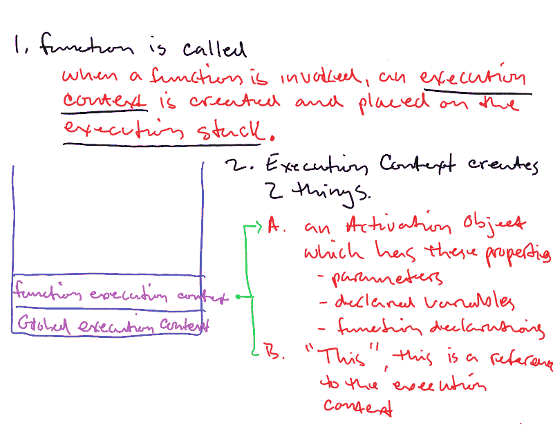

当函数被调用时，它形成一个新的执行上下文。什么是执行上下文？正如我们有两种类型的作用域一样，我们也有两种类型的执行上下文。它们是全局执行上下文和函数执行上下文。

全局上下文始终在运行。在浏览器环境中，它只有在浏览器关闭时才会停止。当我们调用一个函数时，我们将该函数的执行上下文放在全局执行上下文之上。因此，我们将术语**堆叠**它们。

JavaScript 是单线程语言，这意味着它一次只能做一件事。当我们调用一个函数时，先前的执行上下文被暂停。被调用的函数在顶层，然后被执行。完成后，它被弹出堆栈，然后旧的执行上下文被恢复。这个执行的“堆栈”是跟踪应用程序中执行位置的东西。查找标识符也很重要。

现在我们已经形成了一个执行上下文，接下来呢？

#### **每个执行上下文都有一个相关的变量对象**

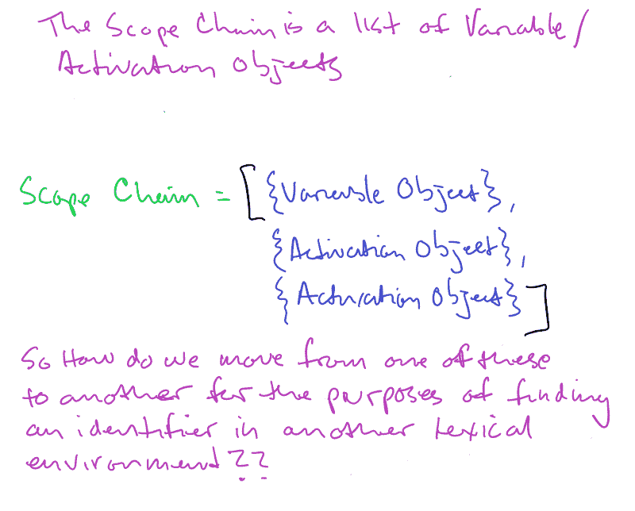

首先，形成一个**激活对象**(代码无法访问，但在后台运行)。它与这个执行上下文相关联。该对象保存在该上下文(其作用域或可访问范围)内传递的所有**声明的变量**、**函数**和**参数**。

函数的参数是隐式定义的。它们对于该函数的作用域来说是“局部的”。这些声明的变量被“提升”到它们所属范围的顶部。

在我继续之前，为了避免混淆—在全局执行上下文中，创建了一个**变量对象**，如果它是一个函数，它就是一个**激活对象**。他们几乎是一样的。

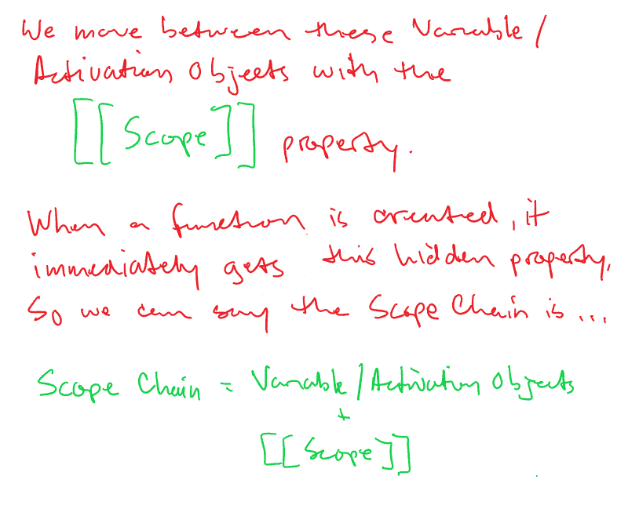

现在，当这个函数被调用时，这些对象的“作用域链”被创建。为什么？作用域链是一种链接或提供对所有变量和当前执行上下文(本例中为函数)可以访问的其他函数的系统访问的方式。[[Scope]]是链接这些变量对象以进行标识符查找的隐藏机制。这个隐藏的[[Scope]]是函数的一个属性，在声明时创建，而不是在调用时创建。

在作用域链的最前面，如果是一个函数，就是**激活对象**。这个激活对象有自己声明的变量、参数和这个。

在作用域链上，下一个是包含上下文中的下一个对象。如果它是一个全局变量，它就是一个**变量对象。**如果是函数，则是一个**激活对象**。这种情况一直持续到我们到达全球范围。这就是为什么你可以看到我们从最里面开始到最外面，想想俄罗斯的套娃。

声明的变量和未声明的变量有什么区别？如果标识符前面有 var、let 或 const，则显式声明该标识符，并为该变量分配内存空间。如果标识符没有被显式声明，那么它在全局范围内被隐式声明，我们将很快对此进行探讨。出于本文的目的，我坚持使用 var，没有特别的原因。

我知道，上面的内容有点技术性，老实说，在我写这篇文章的时候，我自己只了解了变量和激活对象。既然你已经有了深潜的解释，这里有一个高角度的描述…

范围链类似于原型链。如果没有找到某个变量或属性，它将继续沿着链向上，直到找到它或抛出错误。该函数创建一个隐藏的[[scope]]属性。此属性将最内部的范围链接到最外部的范围。在这种情况下，number 的作用域链链接到全局窗口对象(包含函数 number 的上下文)。这使得引擎可以在函数号之外查找 firstNum 和 secondNum。

举个例子，我们拿同一个功能号，改一个东西:

```
// global scope  - includes firstNum, secondNum, and the// function number
```

```
var firstNum = 1;
```

```
function number() {    // local scope for number - only thirdNum is local to number()    // because it was explicitly declared. secondNum is implicitly declared in the    // the global scope.
```

```
secondNum = 2;    var thirdNum = 3;    return firstNum + secondNum;  }// what do we have access to in the global scope?number(); // 3firstNum; // 1secondNum; // 2thirdNum; // Reference Error: thirdNum is not defined
```

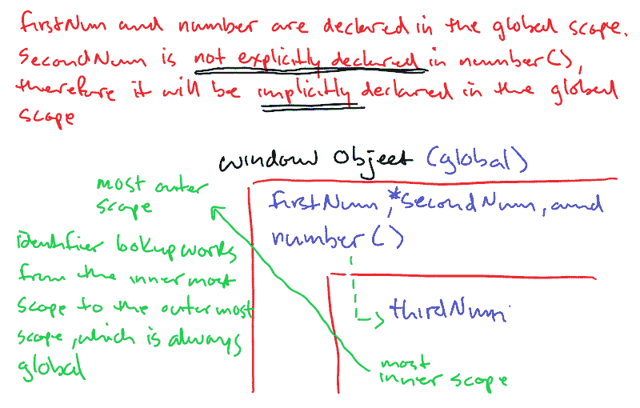

当谈到全局范围时，变量声明、非嵌套函数声明和函数表达式(仍被认为是变量定义)被认为是浏览器中全局窗口对象的范围。正如我们在上面看到的，window 对象添加了 firstNum、secondNum 和 number 属性。如果我们沿着作用域链寻找它，我们会一直寻找，直到到达全局上下文的变量对象。如果不在这里，我们就会得到参考误差。

```
In a new tab, type "about:blank" in the search bar. A blank page will open and hit cmd-option-i to open dev tools.
```

```
Type the code above and remember, shift-enter for a new line!
```

```
Now type "window" and explore all the properties on the window object.
```

```
Look closely and you will see the properties firstNum, secondNum, and number are all available on the window object.
```

当我们试图在声明 thirdNum 的地方之外访问它时，我们得到一个引用错误。编译代码的引擎未能在窗口全局范围对象中找到标识符。

ThirdNum 只在声明它的函数内部可用。它被封装或专用于函数号

你可能会有这样的问题:“全局作用域可以访问 number 内部的所有内容吗？”同样，作用域只能从内向外工作，从最里面的上下文局部到最外面的上下文全局。

从局部作用域开始，我们可以说包装在函数中的数据和变量只能被该函数的成员访问。作用域链是 firstNum 和 number()之间的链接。

当 number()被调用时，非技术性的对话是这样的…

> ***引擎:*** *“号，我给你一个新的执行上下文。让我找到你需要运行的东西"*

> ***引擎*** *:“好的，我看到 thirdNum 是显式声明的。我在给你留出空间，去号码功能块的顶部，等我叫你…*

> ***发动机*** *:“号，我看到 secondNum，他是你的吗？”*

> ***编号*** *:“没有。”*

> ***引擎*** *:“好了，我看到你链接到全局窗口对象了，让我看看你的外部。”*

> ***引擎*** *:“窗口，我有个标识符叫 secondNum，他是你的吗？”*

> ***窗口*** *:“他没有用 var，let，或者*
> *const 在 Number 中显式声明自己，我就把他带走，留出空间。”*

> ***发动机*** *:“爽。号，我在你的功能块里看到 firstNum，他是你的吗？”*

> ***编号*** *:“没有。”*

> ***引擎*** *:“窗口，我看到 firstNum 被用在 Number 里面，他需要他，他属于你吗？”*

> ***窗口*** *:“是的，他被宣告了。”*

> ***引擎*** *:“每个人都有交代，现在我在给变量赋值。”*

> ***引擎*** *:号，我正在执行你，预备，开始！”*

对于理解范围，基本上就是这样，关键要点是:

1.  标识符查找由内向外进行，并在第一次匹配时停止。
2.  有两种类型的作用域，全局和局部
3.  作用域链是在函数调用时创建的，并且基于变量和/或代码块的编写位置(词法环境)。变量或函数是嵌套的吗？
4.  在 JavaScript 中，如果标识符没有以 var、let 或 const 开头，那么它会在全局范围内隐式声明。
5.  作用域不会与函数一对一，而是与函数调用一对一。执行一个函数三次，得到三个不同的作用域。为什么？因为如果一个函数的执行完成了，它就会被弹出执行堆栈，并随之通过它的作用域链访问其他变量。因此，每次执行函数时都会创建一个新的作用域。闭包的工作方式有点不同！

在继续讨论闭包之前，让我们结束一个更复杂的例子。

```
a = 1;var b = 2;
```

```
function outer(z) {  b = 3;  c = 4;  var d = 5;  e = 6;
```

```
function inner() {    var e = 0;    d = 2 * d;    return d;  }  return inner();  var e;}outer(1);
```

1.  在我们运行任何东西之前，提升是从外部全局级别开始的。因此我们从一个对变量 **b** 的**声明和一个对**函数对象外部**的函数声明开始。在这一点上，没有分配任何东西，我们只在全局范围变量对象中设置了这两个键。**
2.  接下来，我们从 **a = 1 开始。**这是一个赋值语句，或者说“写给”语句，但是没有正式的声明。所以在全局范围内，如果不是在“严格模式”下，那么 **a** 将被隐式声明为属于全局范围变量对象。
3.  我们移动到下一行，查找标识符 **b** ，通过提升，它被计算在内，现在我们可以给它赋值 2。

到目前为止，我们已经…

#### 全球范围

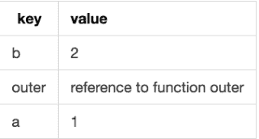

4.由于我们构建了**函数对象 outer** ，在提升时，我们跳转到 execution，outer(1)；

5.请记住，在函数调用时，首先会创建一个执行上下文。这样我们就创建了一个激活对象。它包含该上下文本地的数据和变量。我们还形成了范围链。

6.参数 **z** 为该函数隐式声明，并被赋值为 1。

快速补充说明:此时，函数的执行上下文创建了它的“ **this** ”绑定。它还创建了一个**参数数组**，这是一个传递的参数数组，在本例中，z. **这个**超出了本文的范围，所以请允许我浏览一下。

7.现在我们在**函数外部**中寻找显式变量声明。我们有 **d** ，在**函数内部**之后声明**变量 e** 。

8.这里有一些隐藏的魔法，此时函数的一个隐藏的[[scope]]属性外部链接了它的变量对象的作用域链。在这种情况下，它就像一个链表，其父类型属性将函数外部激活对象连接到全局执行上下文的变量对象。这里可以看到，作用域从内向外延伸，形成了这种“链接”。这是允许我们沿着范围链向上查找的引用。

#### 外部功能范围

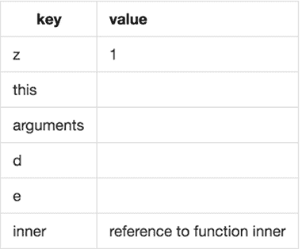

9.我们从**外**内开始，从 **b** = 3 开始。 **b** 申报了吗？没有。所以 JavaScript 使用隐藏的 **[[scope]]** 属性附加到函数 **outer** 上，沿着作用域链向上移动，找到一个“ **b** ”。它在全局作用域对象中找到它，因为我们在函数体**外部**中，我们给 **b** 赋值 3。

#### 又是全局范围

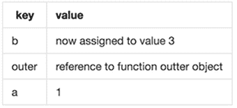

10.下一行， **c** = 4。既然这是对标识符 **c** 的写操作，那么 **c** 是否在函数**外层**中被显式声明？没有，因此在 outer 的激活对象中查找不到它。所以它沿着作用域链向上移动，并在全局作用域变量对象中查找。它不在那里。因为这是一个 write to/ assignment 操作，所以全局作用域将处理它并将其放在其变量对象上。

#### 全局范围变量对象

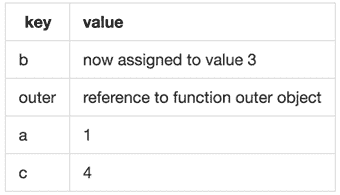

11. **d** = 5。是的，它在这里，所以我们指定它为 5。

#### 外部功能范围

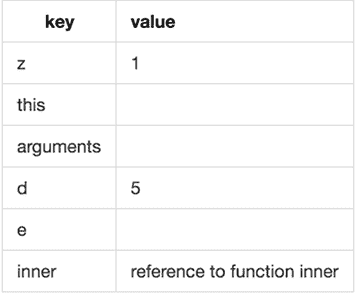

12. **e** = 6。还记得那个落伍者吗，var **e** ？它仍然是在 **outer** 的主体中声明的，所以我们已经为它准备了一个位置——所以我们把它赋值为 6。如果它没有像 **c** 那样被声明，我们将向上移动范围链进行查找。因为它是一个写操作，而不是读操作，并且不是在“严格模式”下，所以它应该被放在全局的作用域中。

13.我们开始调用函数**内部的**。我们像处理函数 **outer:** 提升一样从头开始，设置一个激活对象，并创建一个隐藏的**[[范围]]** 属性。在这种情况下，包含上下文是函数**外部**，并且**外部**“指向”全局范围。

#### 内部函数的作用域

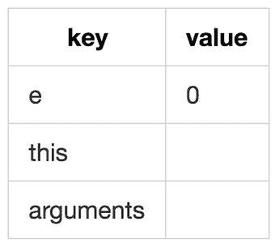

14.现在用 **e** 一般来说，同名的变量是这样工作的。由于标识符查找从最内部的范围到最外部的范围开始，所以查找在第一次找到该标识符时停止。在**的体内，**我们看到 var **e** = 0，完成，停止，不再前进。函数体**外部**中的 **e** 为“不可访问”。通常使用的术语是函数**内**中的 **e** “阴影”或遮蔽函数**外**中的 **e** 。

15.下一行是 **d** = 2 * **d** 。在我们给左边的 **d** 赋值之前，我们必须评估右边的表达式 2 * **d** 。由于 **d** 在 **inner** 的作用域内不是局部的，我们沿着作用域链向上移动来寻找 **d** 的一个变量，以及它是否有一个与之相关联的值。我们在函数 **outer** 的 **outer** 作用域中找到它，在那里值被改变。

#### 外部功能范围

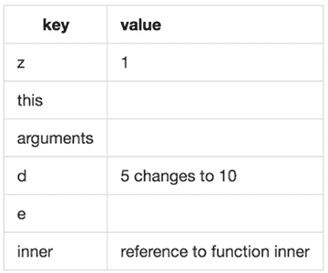

这里重要的是 **inner 在它的外部范围内操作数据！**

16.函数 **inner** 返回值 **d** ，10。

17.函数**外部**返回函数**内部**的值。

18.结果是 10。

19.一旦函数**外部**完全执行完毕，**垃圾收集**发生。垃圾收集是释放不再需要的资源。它从全局范围开始，只要有“可达性”就可以工作。

这个例子中的全局作用域没有函数**外部**或函数**内部**的句柄，所以嗖的一声，消失了。当我们使用闭包时，这一点很重要，因为在那里，我们需要数据和一些变量，即使在一个函数已经完成运行之后。

### 最后，让我们来做个了结吧！

#### 我们如何定义一个结束？

让我们从几个定义开始，它们都是正确的，有些更深入，但都指向同一点。

```
1\. Closures are functions that have access to variables from another function's scope. This is accomplished by creating a function inside another function.
```

```
2\. A Closure is a function that returns another function.
```

```
3\. A Closure is an implicit, permanent link between a function and its scope chain.
```

#### 为什么要关闭？

如果不能利用作用域链规则，异步操作将是不可能的。因为不能保证数据以后还会被使用。JavaScript 只有函数作用域作为它的封装机制。

闭包是函数和变量隐私的最好形式。这在许多模块模式的使用中是显而易见的。模块模式返回一个对象来公开一个公共 API。它还保持其他方法和变量的私有性。闭包用于事件处理和回调。

一个模块的例子…

```
var Toaster = (function(){    var setting = 0;    var temperature;    var low = 100;    var med = 200;    var high = 300;    // public    var turnOn = function(){        return heatSetting();    };    var adjustSetting = function(setting){        if(setting <= 3){            temperature = low;        }if (setting >3  && setting <= 6){            temperature = med;        }if (setting > 6 && setting <= 10){            temperature = high;
```

```
}return temperature;    };    // private    var heatSetting = function(adjustSetting){        var thermostat = adjustSetting;        return thermostat;        };    return{            turnOn:turnOn,            adjustSetting:adjustSetting        };})();
```

```
Toaster.adjustSetting(5);Toaster.adjustSetting(8);
```

模块 Toaster 有私有的局部变量和一个公共接口，并被写成一个立即调用的函数表达式(IIFE)。我们创建一个函数，立即调用它，并获取返回值。

另一个小例子:

```
function firstName(first){    function fullName(last){        console.log(first + " " + last);    }    return fullName;}var name = firstName("Mister");name("Smith") // Mister Smithname("Jones"); //Mister Jones
```

内部函数 fullName()首先在其外部作用域 firstName()中访问变量。即使在内部函数 fullName 返回之后，它仍然可以访问那个变量。这怎么可能呢？内部函数的范围链包括其外部范围的范围。

当调用一个函数时，会创建一个执行上下文和一个作用域链。该函数还获得了一个隐藏的[[Scope]]属性。函数的激活对象被初始化并放入链中。然后将外部函数的激活对象放入链中。在这种情况下，最后是全局变量对象。

在本例中，定义了 fullName。将创建一个[[范围]]属性。包含函数的激活对象被添加到全名的作用域链中。它也被添加到全局变量对象中。对外部函数的激活对象的引用允许访问所有包含的作用域变量。它不会被垃圾收集。

这是最重要的。外部函数 firstName()的激活对象一旦完成执行就不能被销毁，因为引用仍然存在于 fullName 的作用域链中。在 firstName( )
**执行完成后，其用于该执行上下文的作用域链被销毁。但是激活对象将一直保留在内存中，直到 fullName()被销毁。**我们可以通过将它的引用设置为 null 来实现。

敏锐的观察者会注意到，我们返回的是对 fullName 的引用，而不是 fullName()的返回值！

这就是我们所说的函数和它的作用域链之间的隐含的、永久的链接。

闭包总是从包含函数中获取最后一个值，因为存储了对变量对象的引用。

例如…

```
var myFunctions= [];function createMyFunction(i) {    return function() {           console.log("My value: " + i);            };        }for (var i = 0; i < 10; i++) {myFunctions[i] = createMyFunction(i);myFunctions[i]();}
```

```
My value: 0 My value: 1 My value: 2 My value: 3 My value: 4 My value: 5 My value: 6 My value: 7 My value: 8 My value: 9
```

如果我们回到我们最初的作用域例子，改变一件事:

```
a = 1;var b = 2;
```

```
function outer(z) {  b = 3;  c = 4;  var d = 5;  e = 6;
```

```
function inner() {    var e = 0;    d = 2 * d;    return d;  }  return inner; // we remove the call operator, now we are returning a reference to function inner.  var e;}myG = outer(1); // store a reference to function inner in the global scope (the return value of outer)myG(); // when we execute myG, inner's [[Scope]] property is copied to recreate the scope chain,    //  and that gives it access to the scopes that contain function inner, outter then global. We got inner and inner's got outter.
```

这里还有几个例子:

```
function make_calculator() {    var n = 0;  // this calculator stores a single number n    return {      add: function(a) { n += a; return n; },      multiply: function(a) { n *= a; return n; }    };}
```

```
first_calculator = make_calculator();second_calculator = make_calculator();
```

```
first_calculator.add(3);                   // returns 3second_calculator.add(400);                // returns 400
```

```
first_calculator.multiply(11);             // returns 33second_calculator.multiply(10);            // returns 4000
```

假设我们想执行一组函数:

```
function buildList(list) {    var result = [];    for (var i = 0; i < list.length; i++) {        result.push(function number(i) {          var item = 'item' + list[i];          console.log(item + ' ' + list[i])} );    }    return result;}buildList([1,2,3,4,5]);
```

```
function testList() {     var fnlist = buildList([1,2,3,4,5]);     for (var i = 0; i < fnlist.length; i++) {       fnlist[i](i); // another IIFE with i passed as a parameter!!     } } testList();
```

我希望对范围和闭包的解释有所帮助。尝试一下你在这里看到的图案。实际上写这篇文章很困难——我获得了比开始时更深刻的理解。

### 资源

[上冲](https://github.com/getify/You-Dont-Know-JS/tree/master/scope%20%26%20closures)

德米特里·索什尼科夫

[ECMA 262.3](http://dmitrysoshnikov.com/ecmascript/chapter-2-variable-object/)

[堆栈溢出](https://stackoverflow.com/questions/111102/how-do-javascript-closures-work)

[尼克禁赛](https://www.amazon.com/Professional-JavaScript-Developers-Nicholas-Zakas/dp/1118026691)