# 深入探究 Spark 内部结构和架构

> 原文：<https://www.freecodecamp.org/news/deep-dive-into-spark-internals-and-architecture-f6e32045393b/>

作者 Jayvardhan Reddy

# 深入探究 Spark 内部结构和架构

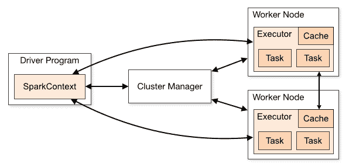

Image Credits: [spark.apache.org](https://spark.apache.org/docs/latest/cluster-overview.html)

***Apache Spark*** 是一个开源的分布式通用集群计算框架。spark 应用程序是一个 JVM 进程，它使用 spark 作为第三方库来运行用户代码。

作为本博客的一部分，我将通过一个例子展示 Spark 在 Yarn 架构上的工作方式，以及所涉及的各种底层后台流程，例如:

*   火花上下文
*   纱线资源经理、应用程序主管和启动执行器(容器)。
*   设置环境变量、作业资源。
*   基于粗粒度的 RPC。
*   SparkListeners。
*   作业的执行(逻辑计划、物理计划)。
*   Spark-WebUI。

#### **火花情境**

Spark 上下文是第一级入口点，也是任何 spark 应用程序的核心。 ***Spark-shell*** 不过是一个基于 Scala 的 REPL，带有 Spark 二进制文件，将创建一个名为 spark context 的对象 sc。

我们可以启动如下所示的火花外壳:

```
spark-shell --master yarn \ --conf spark.ui.port=12345 \ --num-executors 3 \ --executor-cores 2 \ --executor-memory 500M
```

作为 spark-shell 的一部分，我们已经提到了 num 执行程序。它们指示要使用的工作节点的数量以及每个工作节点并行执行任务的核心数量。

或者您可以使用默认配置启动 spark shell。

```
spark-shell --master yarn
```

这些配置作为 **spark-env.sh** 的一部分出现

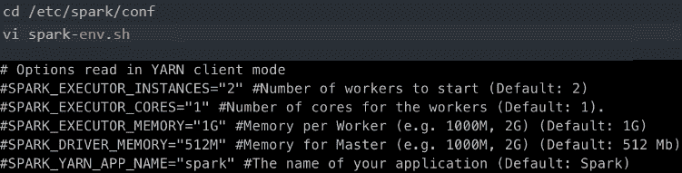

我们的驱动程序是在网关节点上执行的，网关节点只是一个火花壳。它将创建一个 spark 上下文并启动一个应用程序。

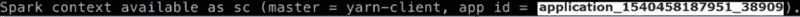

可以使用 **sc 来访问 spark 上下文对象。**

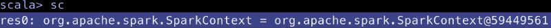

创建 Spark 上下文后，它会等待资源。一旦资源可用，Spark context 就会设置内部服务并建立到 Spark 执行环境的连接。

#### **纱线资源经理、应用主管&启动执行器(集装箱)。**

一旦创建了 Spark 上下文，它将检查 ***集群管理器*** 并启动 ***应用主*** ，即启动一个容器并注册信号处理程序 ***。***

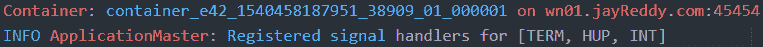

一旦应用程序主机启动，它就与驱动程序建立连接。

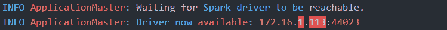

接下来，ApplicationMasterEndPoint 触发代理应用程序连接到资源管理器。

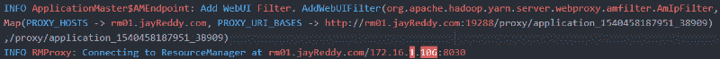

现在，纱线容器将执行以下操作，如图所示。

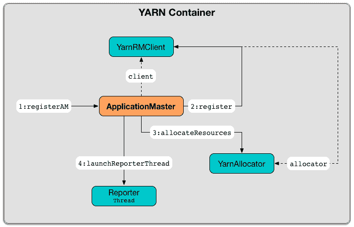

Image Credits: [jaceklaskowski.gitbooks.io](https://jaceklaskowski.gitbooks.io/mastering-apache-spark/yarn/spark-yarn-applicationmaster.html)

ii) YarnRMClient 将向应用主程序注册。


iii) YarnAllocator:将请求 3 个 executor 容器，每个容器有 2 个内核和 884 MB 内存，包括 384 MB 开销

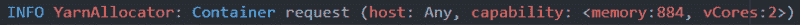

iv) AM 启动报告线程

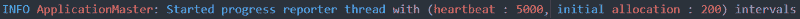

现在，纱线分配器从驱动程序接收令牌来启动执行器节点和容器。

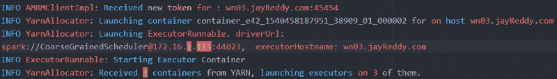

#### **设置环境变量，作业资源&启动容器。**

每次启动一个容器时，它都会做以下三件事。

*   设置环境变量

Spark 运行时环境(SparkEnv)是带有 Spark 服务的运行时环境，这些服务用于相互交互，以便为 Spark 应用程序建立分布式计算平台。

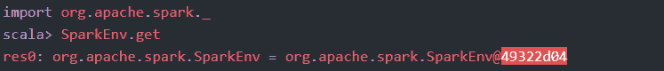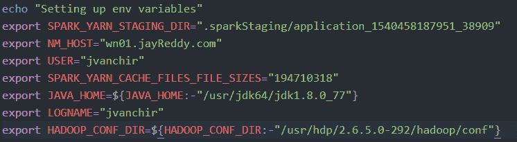

*   设置职务资源

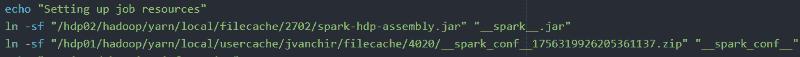

*   发射容器

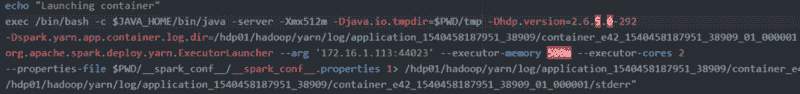

YARN executor 启动上下文为每个执行器分配一个执行器 id 来标识相应的执行器(通过 Spark WebUI ),并启动一个粗粒度 ExecutorBackend。

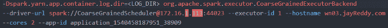

#### 基于网格的 RPC。

从资源管理器获得资源后，我们将看到执行程序启动

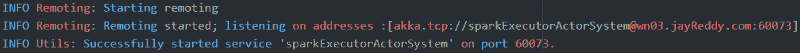

***粗粒度 ExecutorBackend*** 是一个执行器后端，控制单个执行器的生命周期。它将执行者的状态发送给驱动程序。

当 ExecutorRunnable 启动时，CoarseGrainedExecutorBackend 会注册 Executor RPC 端点和信号处理程序，以便与驱动程序(即与 CoarseGrainedScheduler RPC 端点)通信，并通知它已准备好启动任务。

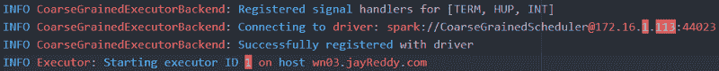

***基于 Netty 的 RPC -*** 用于 worker 节点、spark 上下文、executors 之间的通信。

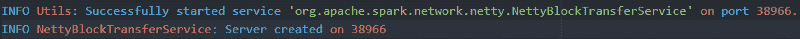

NettyRPCEndPoint 用于跟踪工作节点的结果状态。

RpcEndpointAddress 是注册到 RPC 环境的终结点的逻辑地址，RpcAddress 和 name 为。

它的格式如下所示:


这是粗粒度执行切割或备份通过 RpcEnv 启动与 driverUrl 上的驱动程序通信的第一个时刻。

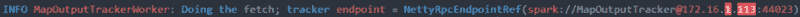

#### **火花监听器**

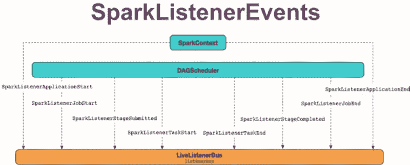

Image Credits: [jaceklaskowski.gitbooks.io](https://jaceklaskowski.gitbooks.io/mastering-apache-spark/spark-scheduler-LiveListenerBus.html)

Spark listener(Scheduler listener)是一个类，它侦听来自 Spark 的 DAGScheduler 的执行事件，并记录应用程序的所有事件信息，如执行器、驱动程序分配详细信息以及作业、阶段和任务以及其他环境属性更改。

SparkContext 启动驻留在驱动程序内部的 LiveListenerBus。它向 LiveListenerBus 注册 JobProgressListener，LiveListenerBus 收集所有数据以在 spark UI 中显示统计数据。

默认情况下，只有 WebUI 的监听器会被启用，但是如果我们想要添加任何其他监听器，那么我们可以使用 **spark.extraListeners.**

Spark 附带了两个监听器，展示了大多数活动

i) StatsReportListener

eventlogginglistener

***eventlogging listener:****如果您想进一步分析 Spark 历史服务器以外的应用程序性能，那么您可以处理事件日志数据。Spark 事件日志记录有关已处理的作业/阶段/任务的信息。可以如下所示启用它...*

*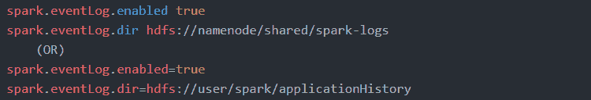*

*事件日志文件可以如下所示读取*

*   *Spark 驱动程序以 JSON 文件的形式记录 spark.evenLog.dir 目录中的工作负载/性能指标。*
*   *每个应用程序有一个文件，文件名包含应用程序 id(因此包含时间戳)application _ 1540458187951 _ 38909。*

*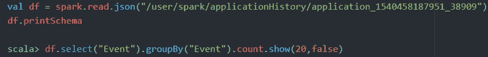*

*它显示事件的类型和每个事件的条目数。*

*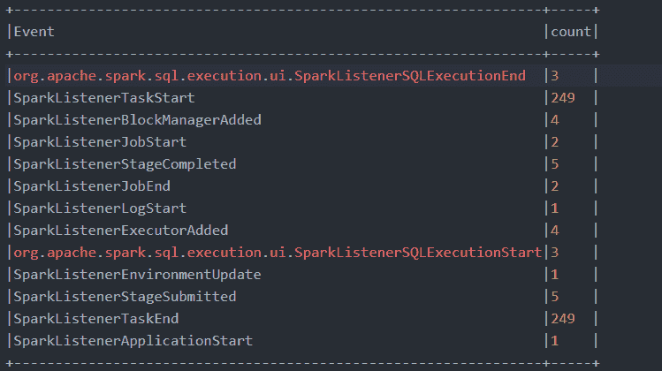*

*现在，让我们将***StatsReportListener***添加到 spark.extraListeners 中，并检查作业的状态。*

*启用 org . Apache . spark . scheduler . statsreportlistener 记录器的信息日志记录级别以查看 Spark 事件。*

*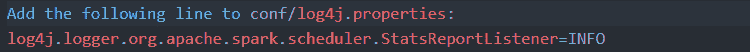*

*要启用侦听器，需要将其注册到 SparkContext。有两种方法可以做到。*

*I)在 Spark 应用程序中使用 Spark context . addsparklistener(listener:Spark listener)方法。*

*点击链接实现自定义监听器-[**自定义监听器**](https://stackoverflow.com/questions/24463055/how-to-implement-custom-job-listener-tracker-in-spark)*

***ii)使用 conf 命令行选项***

***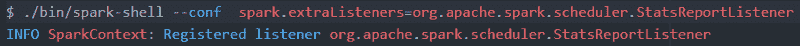***

***让我们读取一个示例文件并执行计数操作来查看 StatsReportListener。***

***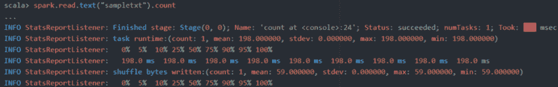***

#### ***作业的执行(逻辑计划，物理计划)。***

***在 Spark 中，RDD ( *弹性分布式数据集*)是抽象层的第一级。它是跨集群中可以并行操作的节点划分的元素的集合。rdd 可以通过两种方式创建。***

***P *在你的驱动程序中编译*一个现有的集合***

***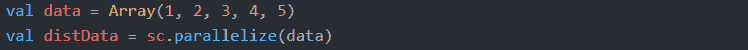***

*****ii)引用外部存储系统中的数据集*****

***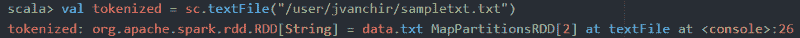***

***rdd 是通过使用 Hadoop 文件系统中的文件或驱动程序中现有的 Scala 集合并转换它来创建的。***

***让我们来看一个样本片段，如下所示***

***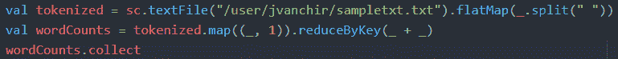***

***上述代码片段的执行分两个阶段进行。***

******6.1 逻辑计划:*** 在此阶段，使用一组转换创建一个 RDD，它通过构建一个计算链(一系列 RDD)作为转换图来跟踪驱动程序中的那些转换，以产生一个被称为 ***谱系图*** 的 RDD。***

***转换可以进一步分为两种类型***

*   *****窄转换:**可以作为一个阶段执行的操作管道，不需要在分区之间混洗数据，例如映射、过滤等..***

***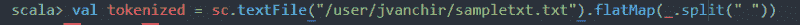***

***现在，将使用广播变量将数据读入驱动程序。***

***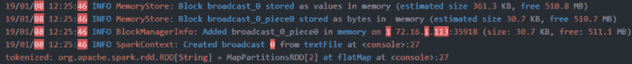***

*   *****宽转换:**这里每个操作都需要对数据进行混洗，因此，对于每个宽转换，都将创建一个新的阶段，例如，reduceByKey 等..***

***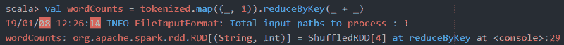***

***我们可以通过使用 ***到*到**来查看谱系图***

***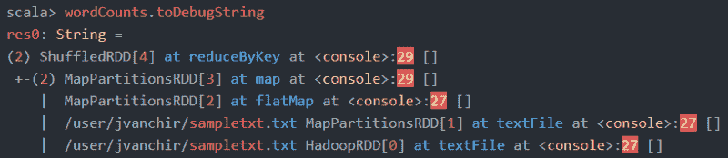***

******6.2 物理计划:*** 在这个阶段，一旦我们在 RDD 上触发了一个动作， ***DAG 调度器*** 查看 RDD 血统，并与 TaskSchedulerImpl 一起提出具有阶段和任务的最佳执行计划，并将作业并行执行到一组任务中。***

******

***一旦我们执行了一个动作操作，SparkContext 就会触发一个作业，并将 RDD 注册为 DAGScheduler 的一部分，直到第一阶段(即在任何大范围转换之前)。***

***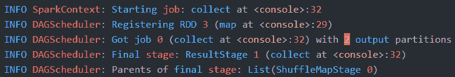***

***现在，在移动到下一阶段(宽转换)之前，它将检查是否有任何分区数据要被混洗，以及它是否有它所依赖的任何丢失的父操作结果，如果任何这样的阶段丢失，则它通过利用使其容错的 DAG(有向非循环图)来重新执行该部分操作。***

***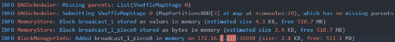***

***在缺少任务的情况下，它将任务分配给执行者。***

***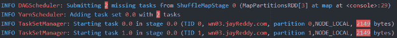***

***每个任务被分配给执行程序的粗粒度执行切割或备份。***

***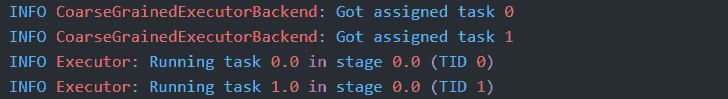***

***它从 Namenode 获取块信息。***

***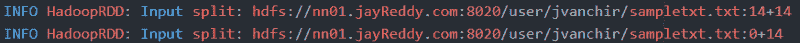***

***现在，它执行计算并返回结果。***

***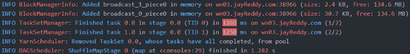***

***接下来，DAGScheduler 查找新的可运行阶段，并触发下一阶段(reduceByKey)操作。***

***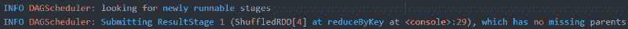***

***ShuffleBlockFetcherIterator 获取要洗牌的方块。***

***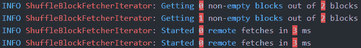***

***现在，reduce 操作被分成两个任务来执行。***

***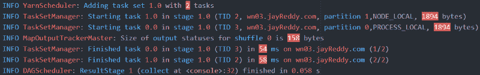***

***每个任务完成后，执行器将结果返回给驱动程序。***

***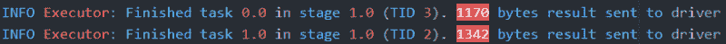***

***一旦作业完成，就会显示结果。***

***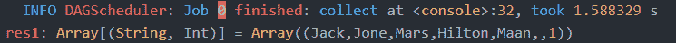***

#### *****Spark-WebUI*****

***Spark-UI 有助于理解代码执行流程和完成特定工作所花费的时间。可视化有助于找出执行过程中发生的任何潜在问题，并进一步优化 spark 应用程序。***

***我们将看到 Spark-UI 可视化是前面的**步骤 6 的一部分。*****

***作业完成后，您可以看到作业的详细信息，如阶段数、作业执行期间计划的任务数。***

***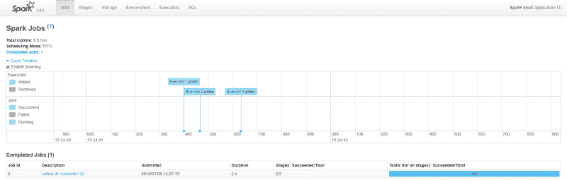***

***单击已完成的作业，我们可以查看 DAG 可视化，即不同的宽和窄转换作为其一部分。***

***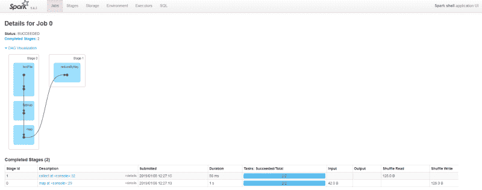***

***您可以看到每个阶段所花费的执行时间。***

***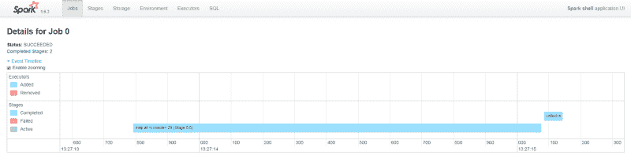***

***作为作业的一部分，单击某个特定阶段，它将显示完整的详细信息，如数据块驻留在哪里、数据大小、使用的执行器、使用的内存以及完成特定任务所用的时间。它还显示了发生洗牌的次数。***

***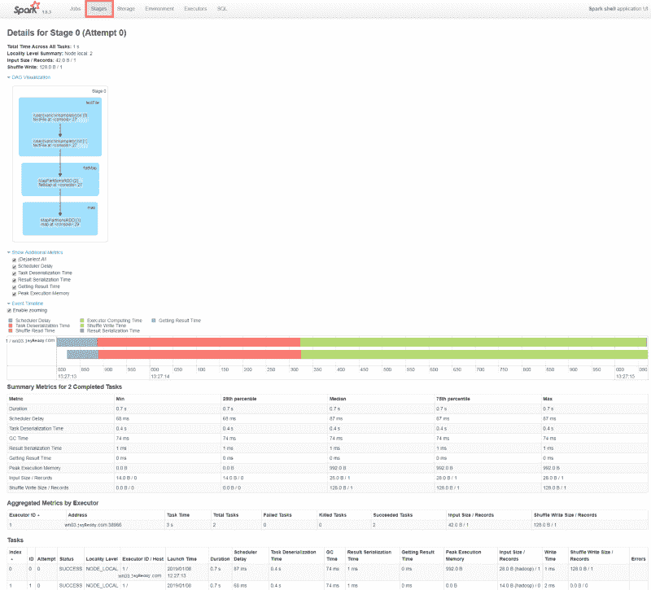***

***此外，我们可以单击 Executors 选项卡来查看所使用的执行器和驱动程序。***

***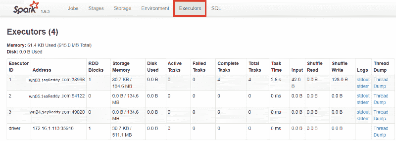***

***现在我们已经看到了 Spark 的内部工作方式，您可以通过使用 Spark UI、日志和调整 Spark EventListeners 来确定执行流程，从而确定 Spark 作业提交的最佳解决方案。***

*****注意 *:*** 与这篇文章相关的被执行的命令被添加为我的 [GIT](https://github.com/Jayvardhan-Reddy/BigData-Ecosystem-Architecture) 账户的一部分。***

***同样，您也可以在此阅读更多内容:***

*   ***[带有**代码的深度**](https://medium.freecodecamp.org/an-in-depth-introduction-to-sqoop-architecture-ad4ae0532583)sq OOP 架构。***
*   ***[HDFS 建筑深度](https://medium.com/plumbersofdatascience/hdfs-architecture-in-depth-1edb822b95fa)与**代号**。***
*   ***[蜂巢架构深度](https://medium.com/plumbersofdatascience/hive-architecture-in-depth-ba44e8946cbc)带**代号**。***

***如果你也愿意，你可以在 LinkedIn 上与我联系——Jayvardhan Reddy。***

***如果你喜欢读它，你可以点击拍手，让别人知道它。如果你想让我补充什么，请随时回复？***