# 开发者的深度学习:第一天你可以用来编码神经网络的工具

> 原文：<https://www.freecodecamp.org/news/deep-learning-for-developers-tools-you-can-use-to-code-neural-networks-on-day-1-34c4435ae6b/>

作者:emailwallner

# 开发者的深度学习:第一天你可以用来编码神经网络的工具

当前的深度学习浪潮始于五年前。计算能力的指数级进步以及随之而来的一些成功故事创造了大肆宣传。

深度学习是驾驶汽车、在雅达利游戏中击败人类、诊断癌症的技术。

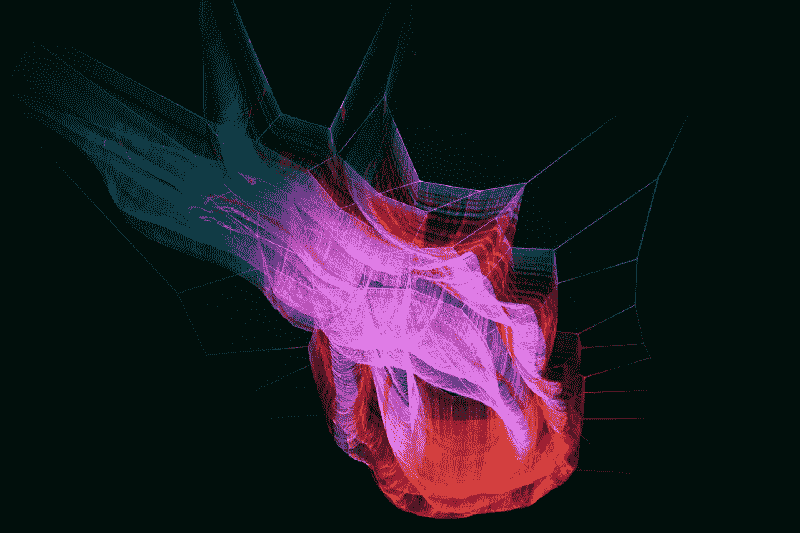

Photo by [Arif Wahid](https://unsplash.com/photos/y3FkHW1cyBE?utm_source=unsplash&utm_medium=referral&utm_content=creditCopyText) on [Unsplash](https://unsplash.com/?utm_source=unsplash&utm_medium=referral&utm_content=creditCopyText)

当我开始学习深度学习时，我花了两周时间进行研究。我选择了工具，比较了云服务，研究了在线课程。回想起来，我希望我能从第一天就建立神经网络。这就是本文要做的事情。

不需要任何前提条件。然而对 [Python](https://www.codecademy.com/tracks/python) 、[命令行](https://www.codecademy.com/learn/learn-the-command-line)和 [Jupyter 笔记本](https://www.youtube.com/watch?v=HW29067qVWk)的基本理解会有所帮助。

深度学习是机器学习的一个分支。事实证明，这是一种在原始数据(如图像或声音)中寻找模式的有效方法。

说你要做一个猫狗图像的分类。在没有特定编程的情况下，它首先找到图片中的边缘。然后它根据它们构建模式。接下来，它探测鼻子、尾巴和爪子。这使得神经网络能够对猫狗做出最终的分类。

但是，对于结构化数据，有更好的机器学习算法。例如，如果您有一个包含消费者数据的已订购 excel 表，并且您想预测他们的下一个订单。然后你可以采用传统的方法，使用 T2 的更简单的机器学习算法。

### 核心逻辑

想象一台带有随机调整嵌齿轮的机器= ✱.齿轮层层叠叠，相互影响。起初，机器不工作。齿轮是随机调整的，它们都需要调整以给出正确的输出。

然后，工程师将检查所有的齿轮，并标记哪些齿轮导致了错误。他从最后一层齿轮开始，这是所有错误组合的结果。一旦他知道最后一层引起的错误，他就向后工作。这样他就可以计算出每个齿轮对误差的贡献。我们称这个过程为**反向传播**。

然后，工程师根据每个齿轮的误差调整每个齿轮，并再次运行机器。他继续运转机器，计算误差，调整每个齿轮。他一直这样做，直到机器给出正确的输出。

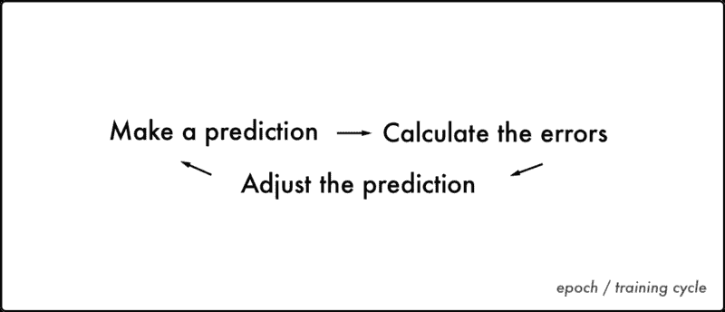

神经网络以同样的方式运作。它知道输入和输出，并调整 cogs 以找到两者之间的相关性。给定一个输入，它调整齿轮来预测输出。然后将预测值与实际值进行比较。

为了使误差最小化，预测值和真实值之间存在差异。神经网络调节齿轮。它会调整 cogs，直到预测值和实际值之间的差异尽可能小。

以最佳方式最小化误差是**梯度下降**。使用`error / cost`功能计算误差。

### 一种浅层人工神经网络

许多人认为人工神经网络是我们大脑皮层的数字复制品。这不是真的。

我们不知道我们的大脑有多少能力做出这样的断言。这是神经网络发明者弗兰克·罗森布拉特**、**的灵感来源。

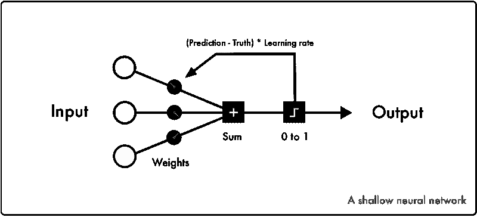

玩[神经网络模拟器](https://www.mladdict.com/neural-network-simulator)一两个小时，对它有个直觉。

我们将首先实现一个简单的神经网络来了解 [TFlearn](http://tflearn.org/) 中的语法。首先，一个经典的 101 问题是[或操作符](https://msdn.microsoft.com/en-us/library/f355wky8.aspx)。虽然神经网络更适合其他类型的数据，但理解它如何工作是一个好问题。

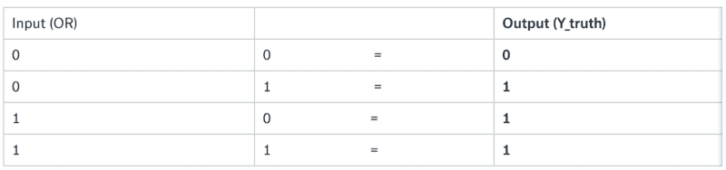

所有深度学习程序都遵循相同的核心逻辑:

*   它从包含库开始，然后导入和清理数据。所有的输入都被翻译成[数字](https://ml4a.github.io/images/figures/mnist-input.png)，不管它是图像、音频还是感官数据。
    这些长长的数字列表是我们神经网络的输入
*   现在设计你的神经网络
    选择你的网络的类型和层数
*   然后进入学习过程。它知道输入和输出值，并搜索它们之间的相关性
*   最后一步是通过训练好的神经网络给你一个预测。

这是我们神经网络的代码:

**输出**

```
Training Step: 2000  | total loss: 0.00072 | time: 0.002s| SGD | epoch: 2000 | loss: 0.00072 -- iter: 4/4Testing OR operator0 or 0: [[ 0.04013482]]0 or 1: [[ 0.97487926]]1 or 0: [[ 0.97542077]]1 or 1: [[ 0.99997282]]
```

**第 1 行**以#开头的行是注释
它们用于解释代码

**Line 2** 包含 TFlearn 库
这允许我们使用来自谷歌 [Tensorflow](https://www.tensorflow.org/) 的深度学习功能

**第 5–6 行**表格中的数据存储在列表中
每个数字末尾的点将每个整数映射成浮点数
它存储带有十进制值的数字，使计算精确

**第 9 行**初始化神经网络并指定输入数据的尺寸或形状
每个 or 运算符都是成对出现的，因此具有 2 的形状
None 是默认值，代表批量大小

**第 10 行:**我们的输出层。
激活函数在间隔
之间映射层中的输出。在我们的例子中，我们使用 Sigmoid 函数来映射 0 和 1 之间的值

[阅读更多关于 9 号线和 10 号线的](http://tflearn.org/layers/core/)。

**第 11 行**应用[回归](http://tflearn.org/layers/estimator/)
[优化器](http://tflearn.org/optimizers/)选择哪种算法来最小化成本函数
学习速率决定修改神经网络的速度，损失变量决定如何计算误差

**第 14 行**选择使用哪个神经网络
它也用于指定存储训练日志的位置

**第 15 行**训练您的神经网络和模型
选择您的输入数据(OR)和真实标签(Y_truth)
历元确定通过您的神经网络运行您的所有数据的次数
如果您设置`snapshot=True` ，它将在每个历元后验证模型

**第 18–22 行**用你训练好的模型
做一个预测，在我们的例子中，它返回返回 True/1 的概率

[阅读更多关于第 14-22 行的](http://tflearn.org/models/dnn/)。

**输出标签**第一个结果意味着组合[0。】&【0。]有 a 有 4%的概率为真，以此类推。训练步骤表示您已经训练了多少批次。

由于数据可以放入一个批处理中，所以它与 [Epoch](https://medium.com/towards-data-science/epoch-vs-iterations-vs-batch-size-4dfb9c7ce9c9) 相同。如果数据对于内存来说太大，你需要把训练分成几块。损失衡量每个时期的误差总和。

SGD 代表随机梯度下降和最小化成本函数的方法。

`Iter`显示当前数据指标和输入项目的总量。

你几乎可以在每一个 TFlearn 神经网络中找到上面的逻辑和语法。感受代码的最好方法是修改它并产生一些错误。

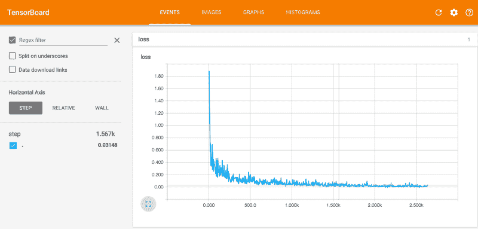

The loss curve shows the amount of errors for each training step

使用 [Tensorboard](TensorBoard: Visualizing Learning) 你可以将每个实验可视化，并对每个参数如何改变训练建立直觉。

这里有一些你可以运行的例子的建议。我建议用它玩几个小时来适应环境和 TFlearn 参数。

**实验**

*   增加训练和纪元
*   尝试从文档中添加和更改每个函数的参数
    例如`g = tflearn.fullyconnected(g, 1, activation=’sigmoid’)` 变成`tflearn.fullyconnected(g, 1, activation=’sigmoid’, bias=False)`
*   在输入数据中添加整数
*   更改输入图层中的形状
*   更改输出层中的激活函数
*   使用不同的梯度下降方法
*   更改神经网络计算成本的方式
*   将 X 和 Y 更改为 and 和 NOT 逻辑运算符
*   将输出数据更改为 XOR 逻辑运算符
    ，例如从[1]交换最后一个 Y_truth。]到[0。]
    你必须在你的网络中添加一层，它才能工作
*   让它学得更快
*   想办法让每一步学习时间超过 0.1 秒

### 入门指南

Python 结合 Tensorflow 是深度学习最常见的栈。

TFlearn 是一个运行在 Tensorflow 之上的高级框架。

另一个常见的框架是 [Keras](https://keras.io/) 。这是一个更健壮的库，但是我发现 TFlearn 语法更干净，更容易理解。

它们都是运行在 Tensorflow 之上的高层框架。

你可以在电脑的 CPU 上运行简单的神经网络。但是大多数实验需要几个小时甚至几周的时间。这就是为什么大多数人使用现代 GPU 进行深度学习，通常是通过云服务。

云 GPU 最简单的解决方案是 [FloydHub](https://www.floydhub.com/) 。如果你有基本的命令行技能，设置 FloydHub 应该不会超过 5 分钟。

[使用 FloydHub 文档](http://docs.floydhub.com/getstarted/quick_start/)安装`floyd-cli`命令行工具。如果您在任何时候遇到困难，FloydHub 还会在他们的内部通话中提供支持。

让我们使用 TFlearn、Jupyter Notebook 和 Tensorboard 在 FloydHub 中运行您的第一个神经网络。

安装并登录到 FloydHub 后，下载本指南所需的文件。

转到您的终端，键入以下命令:

```
git clone https://github.com/emilwallner/Deep-Learning-101.git
```

打开文件夹并启动 FloydHub:

```
cd Deep-Learning-101floyd init 101
```

FloydHub web dashboard 将在您的浏览器中打开，并提示您创建一个名为`101`的新 FloydHub 项目。一旦完成，回到您的终端并运行相同的`init`命令。

```
floyd init 101
```

现在，您已经准备好在 FloydHub 上运行您的神经网络作业了。

使用`floyd run`命令，您可以传入各种设置。在我们的案例中，我们希望:

*   在 FloydHub 上挂载一个公共数据集，我已经上传了。
    在数据目录键入`--data emilwallner/datasets/cifar-10/1:data`
    您可以通过在 [FloydHub](https://www.floydhub.com/emilwallner/datasets/cifar-10/1) 上查看来探索这个数据集(以及许多其他公共数据集)
*   使用带有`--gpu`的云 GPU
*   使用`--tensorboard`启用张量板
*   使用`--mode jupyter`在 Jupyter 笔记本模式下运行作业

好，让我们开始工作:

```
floyd run --data emilwallner/datasets/cifar-10/1:data --gpu --tensorboard --mode jupyter
```

一旦它在你的浏览器中启动 Jupyter，点击名为`start-here.ipnyb`的文件。

`start-here.ipnyb` 是一个简单的神经网络，用来了解 TFlearn 中的语法。它学习 OR 运算符的逻辑，稍后会详细解释。

在菜单行中，点击**内核>重启&运行** *一* ll。如果你看到这个消息，它正在工作，那么你就可以开始了。

去你的 FloydHub 项目找到 Tensorboard 的链接。

### 深度神经网络

深度学习是具有不止一个隐藏层的神经网络。关于 CNN(卷积神经网络)如何工作，已经有大量详细的教程。你可以在这里找到他们，在这里找到，在这里找到。

因此，我们将把重点放在可以应用于大多数神经网络的高级概念上。

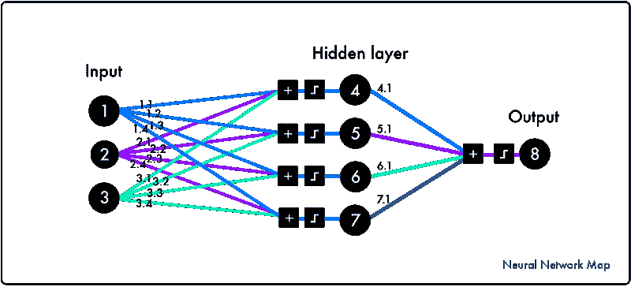

Note: the visual is not a deep neural network. It needs more than one hidden layer.

你想训练神经网络对未经训练的数据进行预测。它需要一种概括的能力。这是学习和遗忘之间的平衡。

你想让它学会从噪音中分离出信号。但是也忘记了只在训练数据中发现的信号。

如果神经网络没有学习到足够的知识，那么它就是不适合的。相反的是过度拟合。这时它已经从训练数据中学到了太多东西。

**正则化**是通过遗忘训练特定信号来减少过拟合的过程。

为了获得这些概念的直觉，我们将使用 [CIFAR-10 数据集](https://pgaleone.eu/images/autoencoders/tf/cifar10_io_l2.png)。这是一个数据集，包含 10 个不同类别的 60k 张图片，比如汽车、卡车和鸟类。目标是预测一张新图片属于哪一类。

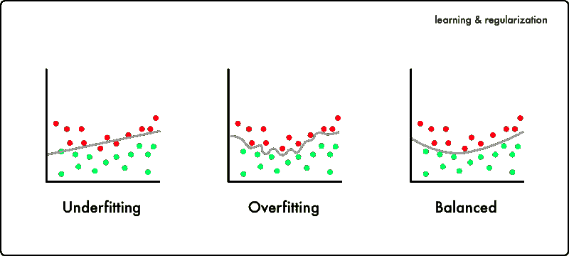

为了获得这些概念的直觉，我们将使用 [CIFAR-10 数据集](https://pgaleone.eu/images/autoencoders/tf/cifar10_io_l2.png)。这是一个数据集，包含 10 个不同类别的 60k 张图片，比如汽车、卡车和鸟类。目标是预测一张新图片属于哪一类。

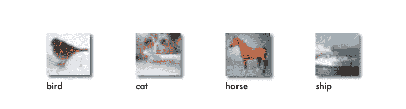

Sample images from CIFAR

通常，我们必须收集数据，清理数据，并对图像进行过滤。但是为了缩小范围，我们只关注神经网络。您可以运行 Jupyter 笔记本中的所有示例，这些示例位于安装部分。

输入层获取已经被映射成数字的图像。输出层将图像分为十类。隐藏层是卷积层、池层和连接层的混合。

### 选择层数

让我们用一个对三组层的神经网络做一个比较。每个集合包括一个卷积层、汇集层和连接层。

前两个实验被称为`[experiment-0-few-layers.ipynb](https://github.com/emilwallner/Deep-Learning-101/blob/master/experiment_0_few_layers.ipynb)`和`[experiment-0-three-layer-sets.ipynb](https://github.com/emilwallner/Deep-Learning-101/blob/master/experiment_0_three_layer_sets.ipynb)`。

点击菜单栏中的**内核>重启&运行**就可以运行这些笔记本了。然后偷看一下 Tensorboard 里的训练日志。你会发现有很多层的那个要精确 15%。层数很少的那一层不合适——它学得不够。

您可以从先前下载的文件夹中运行相同的示例，以及所有即将进行的实验。

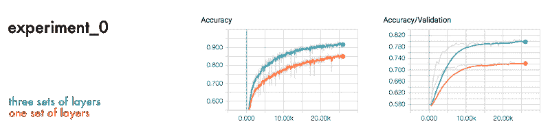

experiment_0.ipynb in the repo

看看**精度**和**精度/验证**。深度学习的最佳实践是将数据集一分为二。一个用于训练神经网络，另一个用于验证它。这样你就可以知道神经网络对新数据的预测有多好，或者它的概括能力有多强。

这就是你如何判断神经网络对新数据进行预测的好坏，或者它的概括能力。

正如我们所看到的，训练数据的准确性高于验证数据集的准确性。神经网络包括了背景噪音和阻碍它预测新图像的细节。

为了处理过度拟合，你可以惩罚复杂的函数，并在神经网络中引入噪声。防止这种情况的常见正则化技术是丢弃图层和惩罚复杂函数。

### 脱落层

我们可以把辍学管制比作民主的价值。他们不是由几个强大的神经元决定最终结果，而是分配权力。

神经网络被迫学习几个独立的表示。当它做出最终预测时，它就有几个不同的模式可以学习。

这是一个带有脱落层的神经网络的例子。

在这个比较中，神经网络是相同的，只是一个有一个脱落层，另一个没有。

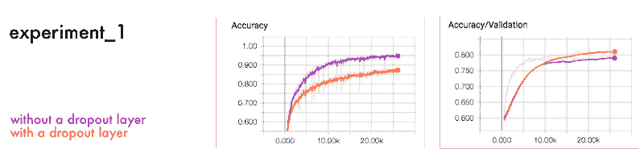

在神经网络的每一层中，神经元变得相互依赖。一些神经元比其他神经元获得更大的影响力。脱落层随机抑制不同的神经元。这样，每个神经元都必须对最终输出做出独特的贡献。

防止过度拟合的第二种流行方法是在每一层应用`L1`或`L2` `regularizer`函数。

### L1 和 L2 正规化

假设你想描述一匹马。如果描述太详细，你就排除了太多的马。但是，如果太笼统，你可能会包括其他动物。 `L1`和`L2`正则化有助于网络进行这种区分。

如果我们做一个与先前实验相似的比较，我们会得到相似的结果。

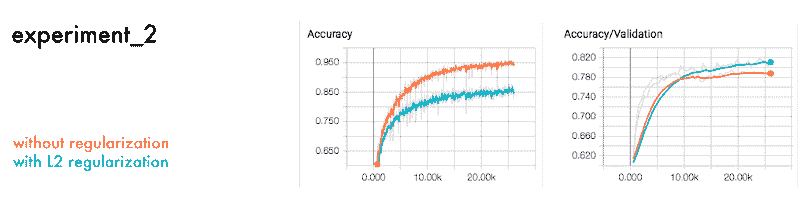

具有正则化函数的神经网络优于没有正则化函数的神经网络。

正则化函数`L2`惩罚过于复杂的函数。它衡量每个功能对最终输出的贡献。然后惩罚系数大的。

### 批量

另一个核心参数是批量大小，即每个训练步骤使用的数据量。下面是大批量和小批量之间的比较。

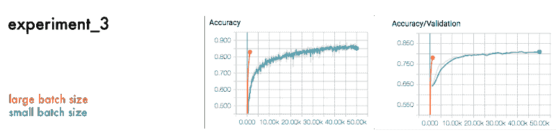

正如我们在结果中看到的，大批量需要更少的周期，但有更准确的训练步骤。相比之下，较小的批量更随机，但需要更多的步骤来补偿它。

大批量需要较少的学习步骤。但是，你需要更多的内存和时间来计算每一步。

### 学习率

最后一个实验是对具有小、中和大学习率的网络进行比较。

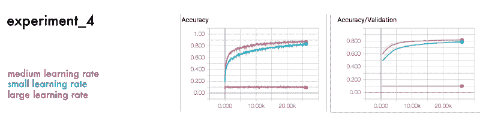

由于学习率的影响，它通常被认为是最重要的参数之一。它规定了如何调整每个学习步骤的预测变化。如果学习率太高或太低，它可能不会收敛，就像上面的大学习率一样。

设计神经网络没有固定的方法。这很大程度上与实验有关。看看其他人做了什么添加层，并调整超参数。

如果你有大量的计算能力，你可以创建程序来设计和调整超参数。

当您完成运行您的作业时，您应该通过在您的作业的 FloydHub web 仪表板中单击 Cancel 来关闭您的云 GPU 实例。

### 后续步骤

在 TFlearn 的[官方示例报告](https://github.com/tflearn/tflearn/tree/master/examples/images)中，你可以感受到一些表现最好的 CNN。尝试复制一些方法并改进 CIFAR-10 数据集的验证。目前为止最好的结果是 96.53% (Graham，2014)。

学习 Python 语法并熟悉命令行也是值得的。这减少了不必要的认知负荷，所以你可以专注于深度学习概念。从 Codecademy 关于 Python 的[课程开始，然后做](https://www.codecademy.com/tracks/python)[命令行一](https://www.codecademy.com/learn/learn-the-command-line)。如果你是全职的，应该不会超过三天。

**感谢**[Ignacio Tonoli de Maussion](https://www.freecodecamp.org/news/deep-learning-for-developers-tools-you-can-use-to-code-neural-networks-on-day-1-34c4435ae6b/undefined)[Per Harald Borgen](https://www.freecodecamp.org/news/deep-learning-for-developers-tools-you-can-use-to-code-neural-networks-on-day-1-34c4435ae6b/undefined)[Jean-Luc Wingert](https://www.freecodecamp.org/news/deep-learning-for-developers-tools-you-can-use-to-code-neural-networks-on-day-1-34c4435ae6b/undefined)[Sai soundaraj](https://twitter.com/sasounda)和 [Charlie Harrington](https://www.freecodecamp.org/news/deep-learning-for-developers-tools-you-can-use-to-code-neural-networks-on-day-1-34c4435ae6b/undefined) 阅读本文的草稿。感谢 [TFlearn 社区](https://github.com/tflearn/tflearn/blob/master/examples/basics/linear_regression.py)提供的文档和示例代码。

#### **关于埃米尔·沃纳**

这是我学习深度学习系列博客的第一部分。我花了十年探索人类的学习。我在牛津大学商学院工作，投资了教育初创公司，建立了一家教育科技企业。去年，我注册了 Ecole 42，将我在人类学习方面的知识应用到机器学习中。

你可以在 Twitter 上关注我的学习之旅。如果您有任何问题/建议，请在下面留言或在[媒体](https://medium.com/@emilwallner)上联系我。

这篇文章最初发表在 Floydhub 的博客上。