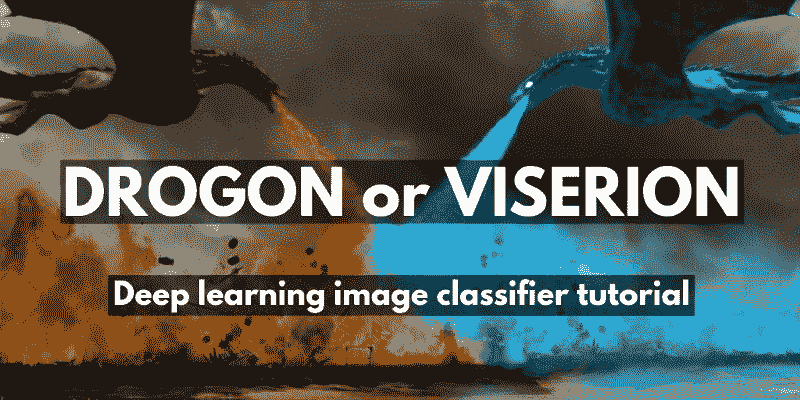
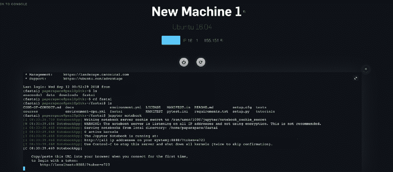
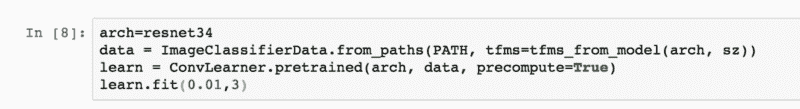
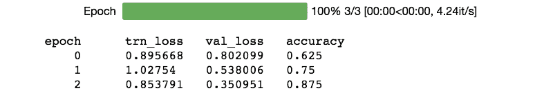
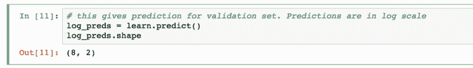
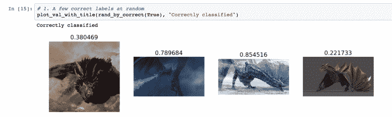
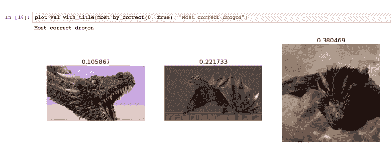
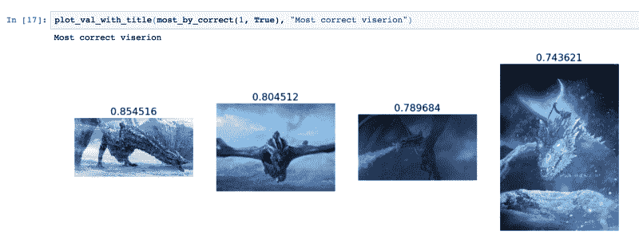
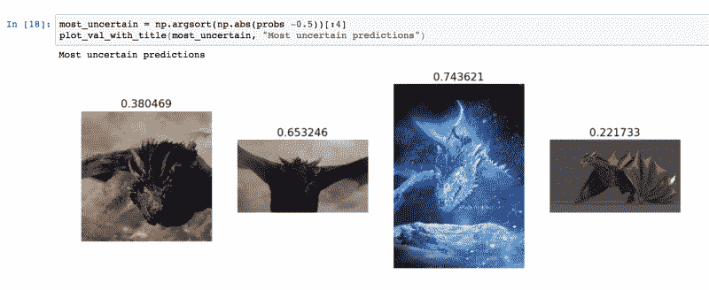

# 第 24 天:如何为《权力的游戏:龙》构建深度学习图像分类器

> 原文：<https://www.freecodecamp.org/news/deep-learning-image-classifier-for-game-of-thrones-dragons-42cd59a1972d/>

作者:Harini Janakiraman

# 第 24 天:如何为《权力的游戏:龙》构建深度学习图像分类器



Source: [Imgur](https://imgur.com/r/freefolk/ipGjQUG)

> 大多数老一代学习算法的性能将趋于平稳。训练大型神经网络的深度学习是可扩展的，当你给它们提供更多数据时，性能会越来越好。— *吴恩达*

深度学习不需要大量的时间或计算资源。它也不需要高度复杂的代码，在某些情况下甚至不需要大量的训练数据。精选的最佳实践现在可以作为库使用，这使得使用最少量的代码插入和编写您自己的神经网络架构变得容易，从而实现 90%以上的预测准确性。

两个最受欢迎的深度学习库是:(1)脸书创建的 pytorch(我们今天将使用 fastai，它是建立在 pytorch 之上的)和(2)谷歌创建的 keras-tensorflow 框架。

### 该项目

我们将使用卷积神经网络(CNN)模型来构建一个图像分类器，以预测给定的图像是卓耿还是维切里翁(在座的任何权力的游戏粉丝？鼓掌说耶！).

你可以将这个问题陈述应用于你感兴趣的任何类型的图像分类。这里有一些想法:猫或狗(经典深度学习 101)，如果一个人是否戴着眼镜，公共汽车或汽车，热狗 vs 非热狗(硅谷粉丝也说耶！；) ).

### 步骤 1:安装

您可以使用任何 GPU 加速的云计算平台来运行您的模型。出于这个博客的目的，我们将使用 [Paperspace](https://www.paperspace.com/) (最实惠的)。关于如何启动和运行的完整说明可在 [**这里**](https://github.com/reshamas/fastai_deeplearn_part1/blob/master/tools/paperspace.md) 找到。

安装完成后，您可以使用以下命令在该计算机上启动 Jupyter notebook:

```
jupyter notebook
```

这将为您提供一个本地主机 URL，您可以在浏览器中打开它，并用您的机器的 IP 地址替换“本地主机”来启动您的笔记本。



现在，您可以将 iPython 笔记本和数据集文件从 [**my github repo**](https://github.com/harinij/100DaysOfCode/tree/master/Day%20023%20-%20Image%20Classifier%20using%20deep%20learning%20CNN%20model) 复制到下面的目录结构中。


**注**:完成后，不要忘记从 paperspace 控制台关闭机器，以免意外充电。

### **第二步:训练**

按照笔记本中的说明初始化本练习所需的库，并指向数据目录的路径位置。请注意，每个代码块都可以使用“shift+enter”来运行如果你需要更多关于 Jupyter 笔记本命令的信息，你可以在这里阅读更多。

现在，进入训练图像分类器的部分，以下三行代码形成了构建深度学习模型的核心:

1.  **数据**:表示验证和训练数据集。
2.  **学习**:包含模型
3.  **learn.fit(learning_rate，epoch)** :使用两个参数拟合模型——学习率和 epoch。



我们在这里将学习率设置为“0.01”。学习率需要是一个足够小的数字，以便您以该因子的递增步长在图像中移动，从而准确地进行学习。但是也不应该太小，因为那会导致太多的步骤/太长的学习时间。该库有一个学习率查找方法“lr_find()”来查找最优的一个。

在这里的代码中，Epoch 被设置为“3 ”,它表示您应该运行批处理的次数。我们可以想跑多少次就跑多少次，但是过了一个点之后，精度会因为过度拟合而开始变差。



### **第三步:预测**

我们现在将使用训练好的模型对验证数据运行预测。



Pytorch 给出了一个预测的对数，所以要得到概率，你必须使用 numpy 得到 e 的幂。按照我的 [**github repo**](https://github.com/harinij/100DaysOfCode/tree/master/Day%20023%20-%20Image%20Classifier%20using%20deep%20learning%20CNN%20model) **里笔记本上的指示一步一步来。接近 0 的概率意味着它是卓耿的图像，接近 1 的概率意味着它是维塞隆的图像。**

### 第四步:视觉化

绘图功能可用于更好地可视化预测结果。下图显示了正确分类的验证数据，0.2-0.3 表示它是卓耿，0.7-0.8 表示它是视塞隆。



你也可以看到一些不确定的预测，如果它们徘徊在接近 0.5 的概率。



在某些情况下，图像分类器可能具有不确定的预测，例如在长尾图像的情况下，因为它一次抓取一小块正方形。

在这些情况下，可以使用增强技术来获得更好的结果，例如数据扩充、优化学习速率、对不同层使用不同的学习速率以及测试时间扩充。这些先进的概念将在以后的文章中探讨。

这个博客的灵感来自 fastai CNN 视频。为了获得深入的理解并继续你在深度学习方面的探索，你可以在 coursera 上选修吴恩达的著名课程。

如果你喜欢这个，请鼓掌？s o 其他人也能看到！在 Twitter 上关注我@ [H **ariniLabs**](https://twitter.com/harinilabs) 或 M [**edium**](https://medium.com/@harinilabs) 获取新的帖子更新或只是打个招呼:)

*PS:注册我的简讯 [**这里**](http://harinilabs.com/womenintech.html) 成为第一个获得新鲜新内容的人，它充满了来自#[**women intech**](http://harinilabs.com/womenintech.html)**——**是的男人也可以注册:)*