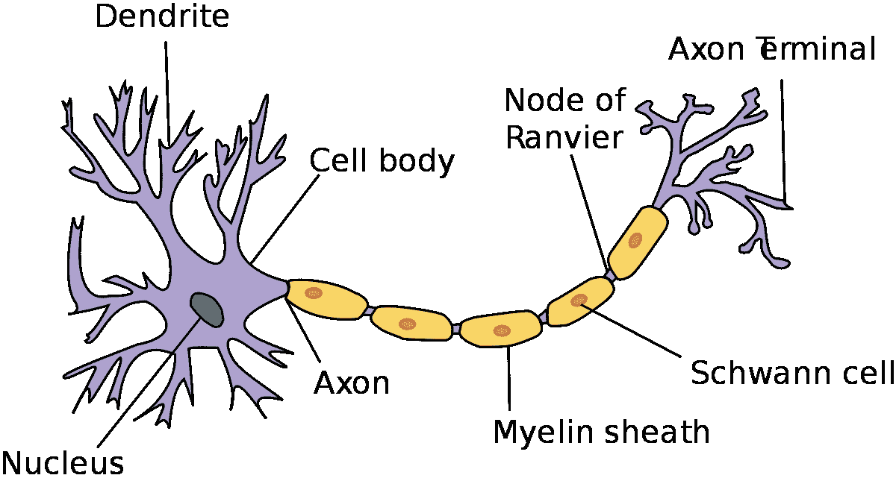
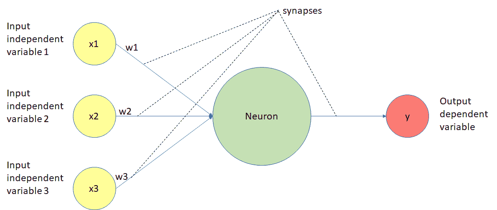
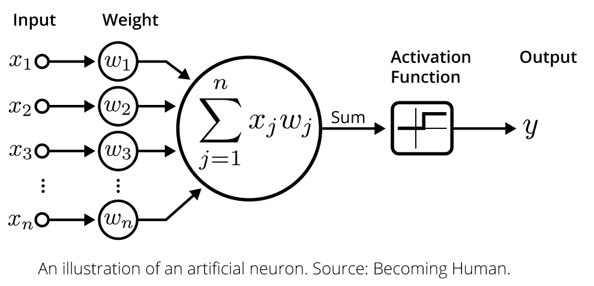
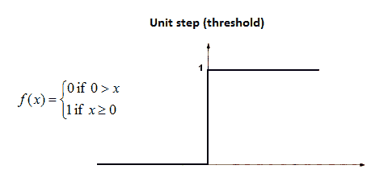
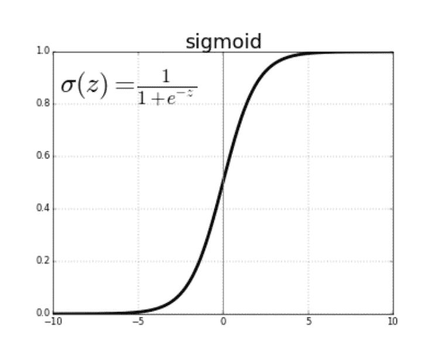
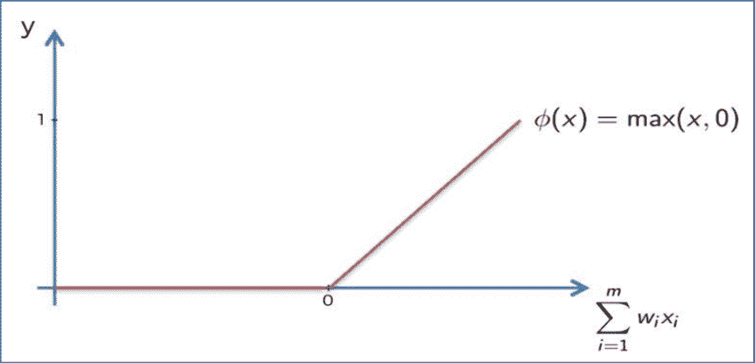
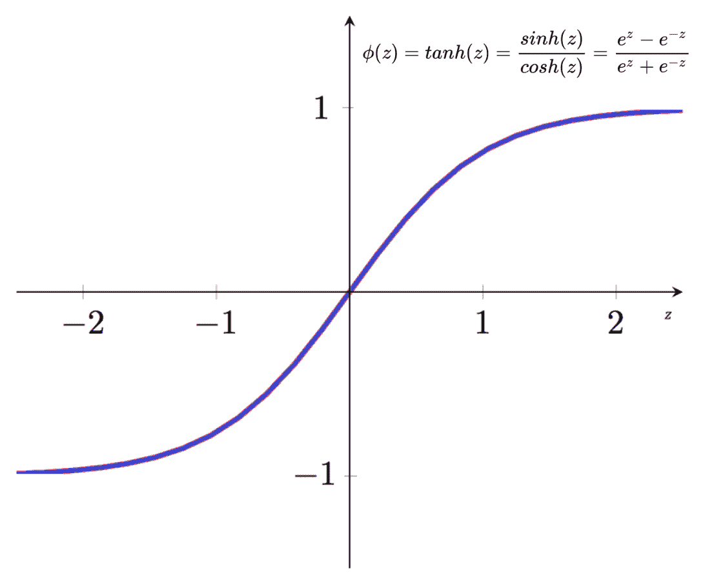
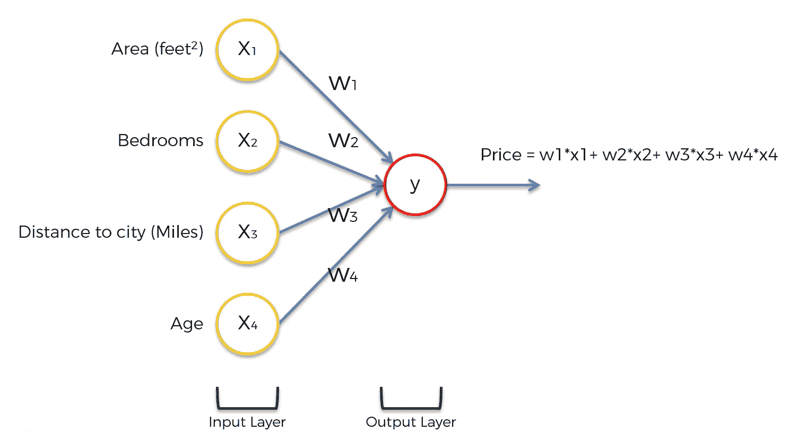
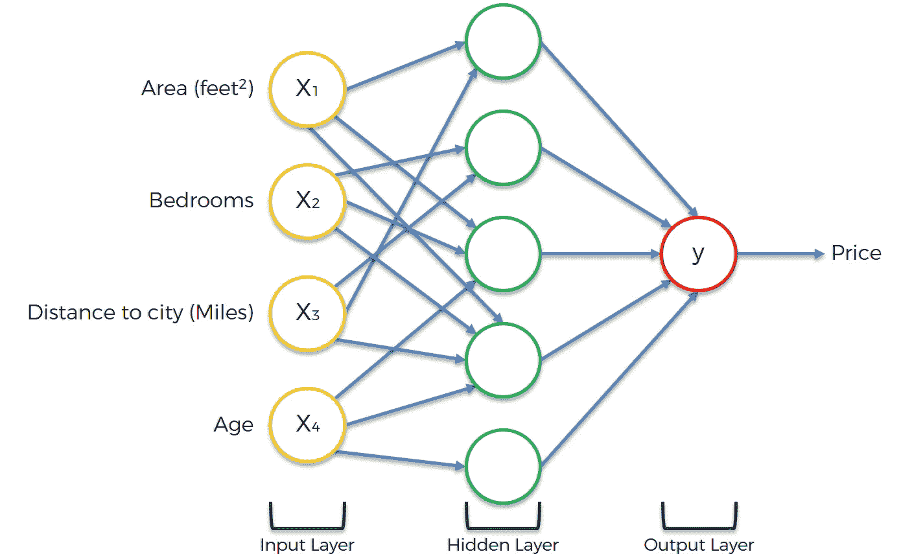
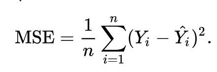

# 用简单的英语解释深度学习神经网络

> 原文：<https://www.freecodecamp.org/news/deep-learning-neural-networks-explained-in-plain-english/>

[机器学习](https://gumroad.com/l/pGjwd)，尤其是深度学习，是两项正在改变世界的技术。

在长达 30 年的漫长“人工智能冬天”之后，计算能力和数据集终于赶上了二十世纪下半叶提出的人工智能算法。

这意味着深度学习模型终于被用来进行有效的预测，解决现实世界的问题。

对于数据科学家和软件工程师来说，对深度学习模型如何工作有一个高层次的理解比以往任何时候都更重要。本文将用通俗易懂的英语解释深度学习神经网络的历史和基本概念。

## ****深度学习的历史****

深度学习是由[杰弗里·辛顿](https://en.wikipedia.org/wiki/Geoffrey_Hinton)在 20 世纪 80 年代提出的概念。他被广泛认为是深度学习领域的创始人。欣顿自 2013 年 3 月他的公司 DNNresearch Inc .被收购以来一直在谷歌工作。

Hinton 在深度学习领域的主要贡献是将机器学习技术与人脑进行比较。

更具体地说，他创建了“神经网络”的概念，这是一种深度学习算法，其结构类似于大脑中神经元的组织。Hinton 采用这种方法是因为人脑可以说是当今已知的最强大的计算引擎。

辛顿创建的结构被称为人工神经网络(或简称为人工神经网络)。下面是对它们功能的简要描述:

*   人工神经网络由多层节点组成
*   每个节点都被设计成类似于大脑中的一个神经元
*   神经网络的第一层被称为`input`层，接着是`hidden`层，最后是`output`层
*   神经网络中的每个节点执行某种计算，这些计算被传递给神经网络中更深层次的其他节点

下面是一个简化的可视化演示，展示了这是如何工作的:

神经网络代表了深度学习领域的巨大进步。

然而，机器学习(尤其是深度学习)花了几十年时间才获得突出地位。

我们将在下一节探讨原因。

## ****为什么深度学习没有马上见效****

如果深度学习最初是在几十年前构思的，为什么今天才刚刚开始有势头？

这是因为任何成熟的深度学习模型都需要丰富的两种资源:

*   数据
*   计算能力

在深度学习概念诞生的时候，研究人员没有足够的数据或计算能力来建立和训练有意义的深度学习模型。随着时间的推移，这种情况发生了变化，这导致了深度学习在今天的突出地位。

# **理解深度学习中的神经元**

[神经元](https://nickmccullum.com/python-deep-learning/understanding-neurons-deep-learning/)是任何深度学习模型的关键组成部分。

事实上，有人可能会说，如果你对神经元如何工作有很深的了解，你就无法完全理解深度学习。

本节将向您介绍深度学习中神经元的概念。我们将讨论深度学习神经元的起源，它们如何受到人脑生物学的启发，以及为什么神经元在今天的深度学习模型中如此重要。

## ****什么是生物学中的神经元？****

深度学习中的神经元受到了人类大脑中神经元的启发。这是大脑神经元的解剖图:

如你所见，神经元有一个非常有趣的结构。人类大脑中的神经元群一起工作，执行我们日常生活所需的功能。

Geoffrey Hinton 在他的神经网络开创性研究中提出的问题是，我们是否可以建立行为类似于大脑中神经元的计算机算法。希望通过模仿大脑的结构，我们可以获得它的一些能力。

为此，研究人员研究了神经元在大脑中的行为方式。一个重要的观察是神经元本身是无用的。相反，你需要神经元的 **网络** 来产生任何有意义的功能。

这是因为神经元通过接收和发送信号来发挥作用。更具体地说，神经元的`dendrites`接收信号，并通过`axon`传递这些信号。

一个神经元的`dendrites`与另一个神经元的`axon`相连。这些联系被称为`synapses`，这是一个已经推广到深度学习领域的概念。

## ****深度学习中的神经元是什么？****

深度学习模型中的神经元是数据和计算流经的节点。

神经元是这样工作的:

*   它们接收一个或多个输入信号。这些输入信号可以来自原始数据集，也可以来自位于神经网络前一层的神经元。
*   他们进行一些计算。
*   它们通过`synapse`向神经网络更深处的神经元发送一些输出信号。

下面是深度学习神经网络中神经元的功能图:

让我们一步一步地浏览这个图表。

正如你所看到的，深度学习模型中的神经元能够拥有连接到前一层中多个神经元的突触。每个突触都有一个相关的`weight`，这影响了前一个神经元在整个神经网络中的重要性。

权重是深度学习领域中一个非常重要的话题，因为调整模型的权重是训练深度学习模型的主要方式。当我们从零开始建立我们的第一个神经网络时，你会在实践中看到这一点。

一旦神经元从模型的前一层中的神经元接收到输入，它就将乘以相应权重的每个信号相加，并将它们传递给激活函数，如下所示:

激活函数计算神经元的输出值。这个输出值然后通过另一个突触传递到神经网络的下一层。

这是对深度学习神经元的广泛概述。如果有太多东西需要理解，不要担心——我们将在本教程的剩余部分学习更多关于神经元的知识。目前，对你来说，对它们在深度学习模型中的结构有一个高层次的理解就足够了。

# **深度学习激活功能**

[激活函数](https://nickmccullum.com/python-deep-learning/deep-learning-activation-functions/)是深度学习中需要理解的一个核心概念。

正是它们让神经网络中的神经元通过突触相互交流。

在本节中，您将学习理解深度学习中激活功能的重要性和功能性。

## ****深度学习中的激活函数有哪些？****

在上一节中，我们学习了神经元从神经网络的前一层接收输入信号。这些信号的加权和被馈入神经元的激活函数，然后激活函数的输出被传递到网络的下一层。

我们将在本教程中讨论四种主要类型的激活函数:

*   阈值函数
*   Sigmoid 函数
*   整流器功能，或 ReLUs
*   双曲正切函数

让我们逐一完成这些激活功能。

## ****阈值函数****

阈值函数根据输入是高于还是低于某个阈值来计算不同的输出信号。记住，激活函数的输入值是神经网络前一层输入值的加权和。

从数学上来说，深度学习阈值函数的正式定义如下:

如上图所示，阈值函数有时也被称为`unit step function`。

阈值函数类似于计算机编程中的布尔变量。它们的计算值要么是`1`(类似于`True`)要么是`0`(相当于`False`)。

## ****s 形函数****

sigmoid 函数在数据科学界广为人知，因为它用于[逻辑回归](https://nickmccullum.com/python-machine-learning/logistic-regression-python/)，这是用于解决[分类问题](https://nickmccullum.com/python-machine-learning/classification-performance-measurement/)的核心机器学习技术之一。

sigmoid 函数可以接受任何值，但总是计算在`0`和`1`之间的值。

以下是 sigmoid 函数的数学定义:

sigmoid 函数优于阈值函数的一个好处是它的曲线是平滑的。这意味着可以计算曲线上任意点的导数。

## ****整流功能****

整流器函数不具有与上一节中的 sigmoid 函数相同的平滑特性。不过在深度学习领域还是很受欢迎的。

整流器功能定义如下:

*   如果输入值小于`0`，则函数输出`0`
*   如果没有，该函数输出其输入值

下面是这个概念的数学解释:

整流器功能通常被称为`Rectified Linear Unit`激活功能，或简称为`ReLUs`。

## ****双曲正切函数****

双曲正切函数是本教程中唯一基于三角恒等式的激活函数。

它的数学定义如下:

双曲正切函数在外观上与 sigmoid 函数相似，但其输出值都向下移动。

# 神经网络到底是如何工作的？

到目前为止，在本教程中，我们已经讨论了构建神经网络的两个构造块:

*   神经元
*   激活功能

然而，对于神经网络到底是如何工作的，你可能还是有点困惑。

本教程将把我们已经讨论过的部分放在一起，这样你就可以理解神经网络在实践中是如何工作的。

## ****我们将在本教程中使用的例子****

本教程将一步一步地完成一个真实世界的例子，以便您可以理解神经网络是如何进行预测的。

更具体地说，我们将处理财产估价。

你可能已经知道影响房价的因素有很多，包括经济、利率、卧室/浴室的数量以及位置。

该数据集的高维数使其成为构建和训练神经网络的有趣候选者。

关于这一部分有一点需要注意的是，我们将用来进行预测的神经网络 **已经被训练过** 。我们将在本教程的下一部分探索训练新神经网络的过程。

## ****我们数据集中的参数****

让我们从讨论数据集中的参数开始。更具体地说，让我们假设数据集包含以下参数:

*   面积
*   卧室
*   到市中心的距离
*   房龄

这四个参数将形成人工神经网络的输入层。请注意，在现实中，可能有更多的参数*可以用来训练神经网络来预测房价。我们将这个数字限制为 4，以保持示例的合理简单。*

## *****神经网络的最基本形式*****

*在其最基本的形式中，神经网络只有两层——输入层和输出层。输出层是实际进行预测的神经网络的组成部分。*

*例如，如果您想要使用简单的加权和(也称为线性回归)模型进行预测，您的神经网络将采用以下形式:*

**

*虽然这个图有点抽象，但重点是大多数神经网络可以以这种方式可视化:*

*   *输入层*
*   *可能是一些隐藏层*
*   *输出层*

*正是隐藏的神经元层使得神经网络在计算预测方面如此强大。*

*对于隐藏层中的每个神经元，它使用神经网络最后一层中的部分(或全部)神经元来执行计算。这些值然后用于神经网络的下一层。*

## *****神经网络隐层神经元的用途*****

*你可能想知道——隐藏层中的每个神经元 **到底是什么意思** ？换个说法，机器学习从业者应该如何解读这些价值观？*

*一般来说，对于满足某些子属性的输入值，神经网络中间层的神经元被激活(意味着它们的激活函数返回`1`)。*

*对于我们的房价预测模型，一个例子可能是距离市中心很近的 5 居室房屋。*

*在大多数其他情况下，描述会导致隐藏层中的神经元激活的特征并不容易。*

## *****神经元如何确定自己的输入值*****

*在本教程的前面，我写道“对于隐藏层中的每个神经元，它使用神经网络最后一层中的一些(或全部)神经元来执行计算。”*

*这说明了重要的一点——神经网络中的每个神经元不需要使用前一层中的每个神经元。*

*神经元决定使用神经网络前一层的哪些输入值的过程称为 **训练** 模型。在本课程的下一部分，我们将学习更多关于训练神经网络的知识。*

## *****可视化神经网络的预测过程*****

*当可视化一个神经网络时，只要前一个神经元在当前神经元的加权和公式中的权重大于`0`，我们通常就绘制从前一层到当前层的线。*

*下图将有助于对此进行可视化:*

**

*如你所见，并不是每对神经元都有突触。例如，仅向隐藏层中五个神经元中的三个馈电。这说明了在构建神经网络时的一个重要点——并不是神经网络的下一层必须使用前一层中的每个神经元。*

# ***如何训练神经网络***

*到目前为止，您已经了解了关于神经网络的以下内容:*

*   *它们是由神经元组成的*
*   *每个神经元使用应用于神经网络前一层输出的加权和的激活函数*
*   *对神经网络如何进行预测的广泛、无代码的概述*

*我们还没有涉及神经网络工程过程的一个非常重要的部分:神经网络是如何训练的。*

*现在，您将了解神经网络是如何训练的。我们将讨论用于训练解决现实世界问题的现代神经网络的数据集、算法和广泛原则。*

## *****硬编码与软编码*****

*开发计算机应用程序有两种主要方式。在深入研究如何训练神经网络之前，重要的是要确保你了解`hard-coding`和`soft-coding`计算机程序之间的区别。*

*硬编码意味着您显式地指定输入变量和您想要的输出变量。换句话说，硬编码没有给计算机留下解释你试图解决的问题的空间。*

*软编码则完全相反。它为程序理解数据集中发生的事情留下了空间。软编码允许计算机开发自己解决问题的方法。*

*这里有一个具体的例子很有帮助。这里有两个使用软编码和硬编码技术在数据集中识别猫的例子。*

*   ***硬编码:**你用特定的参数来预测一个动物是不是猫。更具体地说，你可以说如果一个动物的体重和长度在一定范围内*
*   *****软编码:**** 您提供一个包含动物的数据集，这些动物标有它们的物种类型和关于这些动物的特征。然后你建立一个计算机程序，根据数据集中的特征来预测一个动物是不是猫。*

*可以想象，训练神经网络属于软编码的范畴。在学习本课程的过程中，请记住这一点。*

## *****使用成本函数训练神经网络*****

*使用一个`cost function`来训练神经网络，T0 是一个用于测量网络预测中包含的误差的等式。*

*深度学习成本函数的公式(有很多，这只是一个例子)如下:*

**

***注:这个代价函数叫做`mean squared error`，这就是等号左边有一个 MSE 的原因。***

*虽然这个等式中有大量的公式数学，但最好总结如下:*

*`Take the difference between the predicted output value of an observation and the actual output value of that observation. Square that difference and divide it by 2.`*

*重申一下，请注意这仅仅是可以在机器学习中使用的成本函数的一个例子(尽管它是公认的最受欢迎的选择)。选择使用哪个成本函数本身就是一个复杂而有趣的话题，超出了本教程的范围。*

*如上所述，人工神经网络的目标是最小化成本函数值。当算法的预测值尽可能接近实际值时，成本函数最小。换句话说，神经网络的目标是最小化它在预测中的误差！*

## *****修改神经网络*****

*在初始神经网络被创建并且其成本函数被估算之后，对神经网络进行改变以查看它们是否降低了成本函数的值。*

*更具体地说，被修改的神经网络的实际组成部分是与其下一层网络通信的突触处的每个神经元的权重。*

*修改权重以将神经网络移动到误差更小的权重的机制称为`gradient descent`。现在，你只要明白训练神经网络的过程是这样的就够了:*

*   *为每个神经元的输入值分配初始权重*
*   *使用这些初始值来计算预测*
*   *这些预测被输入到一个成本函数中，以测量神经网络的误差*
*   *梯度下降算法改变每个神经元输入值的权重*
*   *这个过程一直持续到权重停止变化(或者直到它们在每次迭代中的变化量低于指定的阈值)*

*这可能看起来很抽象——没关系！这些概念通常只有在你开始[训练你的第一个机器学习模型时才能完全理解。](https://gumroad.com/l/pGjwd)*

## *****最终想法*****

*在本教程中，您学习了神经网络如何执行计算来做出有用的预测。*

*如果你有兴趣了解更多关于构建、培训和部署前沿机器学习模型的信息，我的电子书[实用机器学习](https://gumroad.com/l/pGjwd)将教你如何使用真实世界的项目构建 9 种不同的机器学习模型。*

*您可以将电子书中的代码部署到您的 GitHub 或个人文件夹中，以展示给未来的雇主。这本书将于 8 月 3 日发布—[现在预订可享受五折优惠](https://gumroad.com/l/pGjwd)！*