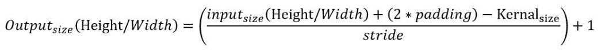
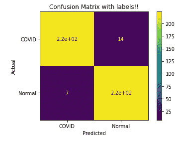

# 深度学习教程——如何使用 PyTorch 和转移学习来诊断新冠肺炎患者

> 原文：<https://www.freecodecamp.org/news/deep-learning-with-pytorch/>

自从 2019 年 12 月新冠肺炎爆发以来，人工智能和机器学习领域的研究人员一直在试图找到更好的方法来诊断这种疾病。

他们致力于开发能够在几秒钟内检测出疾病的算法——并且只需查看胸部 x 光和/或 ct 扫描图像。

这些技术中的一些已经被证明在诊断新冠肺炎病例中非常有用和准确。

有多种方法使用机器和深度学习来检测和/或分类疾病。研究人员提出了新开发的体系结构和迁移学习方法。

在这篇文章中，我们将研究一种利用胸部 X 射线图像对新冠肺炎病例进行分类的迁移学习方法。

我们将要使用的模型是 EfficientNet 架构的七个变体之一。我们将在庞大的 ImageNet 数据集上使用预先训练的模型。EfficientNet 是一种基于复杂卷积神经网络的高级架构。

在本文过程中，我们将进一步研究卷积神经网络、预训练模型和 EfficientNet 的细节。我把它分成了五个部分:

1.  什么是卷积神经网络？
2.  迁移学习初探。
3.  什么是效率网？
4.  PyTorch 简介。
5.  用 PyTorch 实现新冠肺炎分类器。

本教程假设您事先了解机器学习和深度学习。如果你想在这些主题上进一步发展你的基础，请查看这篇关于[人工智能 vs 机器学习 vs 深度学习](https://livecodestream.dev/post/artificial-intelligence-vs-machine-learning-vs-deep-learning/)的文章。

此外，尽管我们将在这里使用的数据集是与 COVID 相关的，但是您可以将实际的代码实现和分析应用于其他数据集。

## 什么是卷积神经网络？

卷积神经网络(CNN)是一种深度神经网络，用于处理视觉数据，即图像。CNN 将图像作为输入，并使用几个滤波器(也称为内核)对图像执行二维或三维卷积运算。

这些卷积运算输出 2D 或 3D 矩阵，其包含关于输入图像的空间信息的可学习的权重和偏差。这个输出矩阵被称为图像的特征图。

在某些情况下，在训练过程中处理卷积神经网络可能非常慢。这就是为什么在深度学习技术的训练过程中使用 GPU 和 TPU 是一个好主意，特别是卷积神经网络。

卷积神经网络比基本的前馈神经网络更好地学习关于图像的空间和时间信息。此外，CNN 可以减小图像的大小，同时保留图像中最重要的信息，这对于图像的预测分析至关重要。


[Source](https://i0.wp.com/vinodsblog.com/wp-content/uploads/2018/10/CNN-2.png?resize=1300%2C479&ssl=1)

卷积神经网络的起始层学习图像中抽象和简单的特征，例如线条和边缘。但是随着我们向网络的更深处移动，特征地图转向图像中更复杂的结构。

它开始学习图像的更具体的特征，比如一只猫、一只狗或一个人，就像我们人类感知周围世界的方式一样。这是现代基于深度学习的计算机视觉中的一个核心概念。

现在，在我们进入高级概念之前，学习 2D 卷积的基础知识是很重要的。

## 什么是 2D 卷积？

2D 卷积解释起来有点复杂，但它是这样的:如果卷积过程(广泛用于 h1-D 信号处理)是在两个信号之间进行的——但不只是沿着一个维度，而是沿着两个相互垂直的维度——它被称为 2D 卷积。

在图像的情况下，两个相互垂直的维度是灰度图像的行和列。卷积运算在数学上是通过将两个输入信号的重叠样本值相乘然后累加来完成的，其中一个信号被翻转。这种乘法和累加的输出给出了特征图上的单个点。

在 CNN 的情况下，图像是一个信号，滤波器/内核是翻转的第二个信号。内核的大小总是小于图像的大小。

然后，翻转的核被逐行和逐列地扫过整个图像，以输出特征图。


2d convolution

这里，一个 3×3 的内核扫过一个 6×6 的图像，以输出一个 4×4 的特征图。如您所见，输出要素地图的尺寸小于输入影像。因此，卷积中使用了一些概念来控制输出特征图的尺寸。这些包括填充、步幅和内核大小。

**填充**是在输入周围手动添加行和列，以保持输出维度与输入维度相同或不同。

**Stride** 指的是内核在扫描期间进行的跳转，包括列和行。在上面的例子中，卷积的步距是 1，因为内核在行和列上都移动了一个单位。

**内核大小**指所用内核的尺寸。改变要被扫描的核的维度会改变特征图的输出大小。

下图描述了具有相同内核大小但填充为 1、跨距为 2 的卷积。


描述步幅、填充和内核大小与输入和输出维度之间关系的等式如下:



3D 卷积的概念只是 2D 卷积的扩展，其中输入图像和内核都是三维的。

像 2D 卷积一样，我们在两个相互垂直的维度(即行和列)上扫过整个图像的三维内核。

我们通常不在颜色通道上扫描内核，因为内核具有与原始图像相同的第三维，即通道长度。这给出了二维而不是三维的输出特征图。

想了解更多 3D 卷积的细节，可以阅读[这篇文章](https://paperswithcode.com/method/3d-convolution)。

## 什么是迁移学习？

在迁移学习中，你采用一个在以前的数据集上预先训练的机器或深度学习模型，并使用它来解决一个不同的问题，而无需重新训练整个模型。

相反，您可以只使用预训练模型的权重和偏差来进行预测。您将权重从一个模型转移到您自己的模型，并根据您自己的数据集进行调整，而无需重新训练体系结构的所有先前层。

我们在卷积神经网络和自然语言处理的应用中使用迁移学习，因为它减少了计算时间和训练过程的复杂性。而且，在很多情况下，它表现得出奇的好。

这在我们可用数据有限的情况下也有帮助——因为神经网络需要极其大量的数据来实现良好的性能。

这意味着使用迁移学习方法可以大大减少对数据的需求，因为权重和偏差是预先调整的，并且通过稍微调整权重和偏差，能够在少量数据的情况下更好地工作。

但是迁移学习模型并不总是给你很好的性能(尽管新的架构在几乎每个问题上都能有效地执行)。尽管如此，有时手头的问题需要一个根据与您现有数据相似的数据进行预训练的架构。这个因素取决于你要解决的问题的复杂程度。

有几种方法可以执行迁移学习:

1.  ******使用预先训练好的模型。******
2.  ******开发新模式。******

您可以通过两种方式使用预训练模型。首先，您可以使用预先训练的权重和偏差作为您自己模型的初始参数，然后使用这些权重训练整个卷积模型。

另一种方法是从预训练的模型中执行特征提取。您使用预训练模型的参数从输入图像中提取特征，并在此基础上训练一个简单的分类器。

另一种选择是，如果您有一个数据量小的问题，您可以为一个数据量大的类似问题开发另一个模型，并训练该模型。然后，您可以使用新模型中训练好的权重，用较少的数据解决原始问题。

在本教程中，我们将使用一个预训练的模型作为特征提取器，我们将在它的基础上训练一个简单的分类器来输出预测。

在深度学习领域中有许多众所周知的架构，它们现在被用于迁移学习的目的。几乎所有这些都是在 ImageNet 数据集上训练的，这是可用的最大的开源数据集。它包含大约 1000 个类和大约 1500 万个实例。

在这些预训练体系结构中，LeNet 是 1998 年提出的第一个体系结构。其他著名的模型包括 VGG，雷斯网，AlexNet，谷歌网，盗梦空间和 Xception。

EfficientNet 也是最近在 2019 年提出的系列的一部分。

## 什么是效率网？

EfficientNet(或者说 EfficientNets 更好)是一个基于卷积神经网络的图像分类模型家族。它们在最先进的 ImageNet 数据集和其他流行的数据集(如 CIFAR-100 和 Flowers)上表现非常好。

除了性能出色之外，该架构体积小，计算速度也比以前的任何型号都快。该架构有从 EfficientNet-B0 到 efficient net-B7 的各种版本。

从 B0 到 B7 的变量基于复合标度法，按比例放大 B0 中的基线，以获得到 B7 的 B1。EfficientNet-B7 在 ImageNet 数据集上获得了 84.4%的顶级准确率，这是 ImageNet 上有史以来最高的顶级准确率。

如果你想了解更多关于效率网络是如何工作的，你可以阅读这篇文章。


[Source](https://github.com/tensorflow/tpu/tree/master/models/official/efficientnet)

在本文后面的编码教程中，我们将使用 EfficientNet-B0 作为特征提取器，并在其基础上使用分类器，使用胸部 x 射线图像对新冠肺炎进行分类。

## PyTorch 简介

PyTorch 是一个 Python 支持的库，帮助我们建立深度学习模型。与 Keras(另一个深度学习库)不同，PyTorch 很灵活，给了开发者更多的控制权。

它在处理上类似于 NumPy，但具有更快的 GPU 加速。要了解更多关于 NumPy 及其特性的信息，您可以查看[这本深度指南](https://www.freecodecamp.org/news/the-ultimate-guide-to-the-numpy-scientific-computing-library-for-python/)及其[文档](https://numpy.org/doc/stable/user/whatisnumpy.html)。

PyTorch 有一个称为“张量”的数据结构，类似于 NumPy ndarray，但它可以选择在 GPU 上操作。

PyTorch 提供了一种在 CPU 和 GPU 之间切换计算的简单方法。它还支持对 NumPy 数组的处理，只需提供一个内置模块，就可以将 NumPy 数组转换为张量，反之亦然。

PyTorch 中最方便的模块之一是`grad()`。它允许您在处理张量时计算张量的梯度，而不需要手动计算梯度并存储它。

这使您在训练过程中能够更好地控制深度学习操作，特别是反向传播。这在计算损失函数时很有帮助，它允许您调整模型的参数。

我们还可以通过使模块的`requires_grad`等于`False`来限制张量，从而在整个过程中不计算它的梯度。要了解更多关于张量和如何在 PyTorch 中进行梯度计算，你可以[查看这个教程](https://www.freecodecamp.org/news/pytorch-tensor-methods/)和[这个课程](https://www.freecodecamp.org/news/pytorch-full-course/)。

## 如何通过 PyTorch 使用 EfficientNet 实现新冠肺炎分类器

现在让我们转到 PyTorch 中 EfficientNet 的实际实现。我们将使用 EfficientNet 系列的 B0 变体。

首先，我们将检查数据并对其进行预处理。Kaggle 有一个庞大的数据集库，可供开源项目和研究使用。对于这个项目可以使用什么样的数据集没有限制。您可以使用任何包含新冠肺炎患者和没有 COVID 的人的胸部 X 射线图像的数据集。

出于本教程的考虑，我们将在这里使用这个数据集。但是，为了使代码能够处理您的自定义数据集，您必须将数据分成三个目录:train、test 和 valid。

每个目录应包含另外两个带有标签`covid`和`norma` l 的目录。这些 covid 和普通文件夹将包含与其所在目录的特定类别相对应的图像。


我们将在本文中使用的原始数据集包含三个文件夹:covid、normal 和 pneumonia。我们完全丢弃肺炎文件夹，并以与上述相同的方式划分其他数据。

我们这样做是为了在用于培训的数据和用于测试和验证的数据之间创建一个逻辑划分。此外，PyTorch 在默认情况下将文件夹的名称(它所在的实例)作为类的标签——因此我们没有对应于输入数据集的标签文件。

### 数据和架构

我们来看一下数据。下面我们可以看到新冠肺炎患者的 x 光图像:


这里我们可以看到正常类别的 x 光图像:


B-0 架构总共有 237 层。整个架构可以浓缩成下面的图表。我们向输入层提供 x 射线数据。


[Source](https://towardsdatascience.com/complete-architectural-details-of-all-efficientnet-models-5fd5b736142)

我们将冻结所有这些块的权重学习，因为我们将使用预训练的权重从我们自己的输入中提取特征。

我们将在输入通过模块 7 后进行特征提取。然后，我们将从模块 7 获得的特征图转移到我们自己的最终分类层(这就是为什么它被称为迁移学习)。我们用以下顶层来覆盖该架构:

*   BatchNorm1d
*   线性(输出神经元= 512)
*   ReLU()
*   BatchNorm1d()
*   线性(输出神经元= 128)
*   ReLU()
*   BatchNorm1d()
*   丢失(参数归零的概率= 0.4)
*   线性(输出神经元= 2)

### 让我们来看看代码

现在，在开始编写代码之前，我们需要安装几个依赖项。首先，您需要在本地机器上安装 PyTorch。您可以在 Python 环境中使用 pip install 命令来实现这一点。参考[此处](https://pytorch.org/get-started/locally/)根据你的机器安装(是否有 GPU 可用)。

在开始编写代码之前，我强烈建议您亲自完成代码。这就容易理解多了。也就是说，你可以在 Jupyter 笔记本[这里](https://drive.google.com/file/d/1m_ATQIrNN-dVVZwZjux5305yhuseZ58R/view?usp=sharing)访问全部代码。

您还需要在同一个 Python 环境中安装对 PyTorch 的 Efficientnet 支持。运行以下命令进行安装:

```
pip install efficientnet_pytorch
```

除此之外，您还需要在代码的开头导入一些其他的依赖项。

现在我们开始构建分类模型。首先，我们导入所有必要的模块:

```
#importing required modules
import gdown
import zipfile
import numpy as np
from glob import glob
import matplotlib.pyplot as plt
import torch
import torch.nn as nn
from torchsummary import summary
from torchvision import datasets, transforms as T
from efficientnet_pytorch import EfficientNet
import os
import torch.optim as optim
from PIL import ImageFile
from sklearn.metrics import accuracy_score
```

所有这些模块对于跨模型执行多种功能都是必不可少的。您可以使用 pip 命令安装所有缺少的模块。

然后，我们下载并提取为模型准备的数据:

```
#importing data
#Dataset address
url = 'https://drive.google.com/uc?export=download&id=1B75cOYH7VCaiqdeQYvMuUuy_Mn_5tPMY'
output = 'data.zip'
gdown.download(url, output, quiet=False)
#giving zip file name
data_dir='./data.zip'
#Extracting data from zip file
with zipfile.ZipFile(data_dir, 'r') as zf:
zf.extractall('./data/')
```

`gdown.download`模块从提供的 URL 和 zipfile.extractall 下载数据，并将数据提取到您当前所在的相同目录中(如果您正在使用 Google Colab，则是相同的运行时)。

我强烈推荐在这个项目上使用 Google Colab，以防你在本地没有可用的 GPU。

接下来，创建一个检查变量来检查 GPU 的可用性。

```
#Checking the availability of a GPU
use_cuda = torch.cuda.is_available()
```

如果 GPU 可用，此模块返回“真”,否则返回“假”。

接下来，我们需要对数据应用预处理技术。由于我们的数据是预先扩充的，我们不需要对它应用许多预处理技术。我们只将所有图像的大小调整为单一大小(224，224)。我们这样做是因为数据集中的图像都有不同的维度，我们需要模型有一致的维度。

我们还将图像转换成张量，由 PyTorch 处理，然后我们将所有图像归一化。该归一化函数以 0.5 的平均值和标准偏差归一化所有图像。

之后，我们为训练、测试和验证集创建位置，这些位置将作为“数据集”模块的输入。我们这样做是为了让 PyTorch 模型知道数据的确切位置，也是为了让数据可以加载到 GPU。我们保持一批 32 个。

```
#declaring batch size
batch_size = 32

#applying required transformations on the dataset
img_transforms = {
    'train':
    T.Compose([
        T.Resize(size=(224,224)), 
        T.ToTensor(),
        T.Normalize([0.5, 0.5, 0.5], [0.5, 0.5, 0.5]), 
        ]),

    'valid':
    T.Compose([
        T.Resize(size=(224,224)),
        T.ToTensor(),
        T.Normalize([0.5, 0.5, 0.5], [0.5, 0.5, 0.5])
        ]),

    'test':
    T.Compose([
        T.Resize(size=(224,224)),
        T.ToTensor(),
        T.Normalize([0.5, 0.5, 0.5], [0.5, 0.5, 0.5])
        ]),
     }

# creating Location of data: train, validation, test
data='./data/'

train_path=os.path.join(data,'train')
valid_path=os.path.join(data,'test')
test_path=os.path.join(data,'valid')

# creating Datasets to each of  folder created in prev
train_file=datasets.ImageFolder(train_path,transform=img_transforms['train'])
valid_file=datasets.ImageFolder(valid_path,transform=img_transforms['valid'])
test_file=datasets.ImageFolder(test_path,transform=img_transforms['test'])

#Creating loaders for the dataset
loaders_transfer={
    'train':torch.utils.data.DataLoader(train_file,batch_size,shuffle=True),
    'valid':torch.utils.data.DataLoader(valid_file,batch_size,shuffle=True),
    'test': torch.utils.data.DataLoader(test_file,batch_size,shuffle=True)
}
```

在预处理之后，我们继续构建模型。

```
#importing the pretrained EfficientNet model

model_transfer = EfficientNet.from_pretrained('efficientnet-b0')

# Freeze weights
for param in model_transfer.parameters():
    param.requires_grad = False
in_features = model_transfer._fc.in_features

# Defining Dense top layers after the convolutional layers
model_transfer._fc = nn.Sequential(
    nn.BatchNorm1d(num_features=in_features),    
    nn.Linear(in_features, 512),
    nn.ReLU(),
    nn.BatchNorm1d(512),
    nn.Linear(512, 128),
    nn.ReLU(),
    nn.BatchNorm1d(num_features=128),
    nn.Dropout(0.4),
    nn.Linear(128, 2),
    )
if use_cuda:
    model_transfer = model_transfer.cuda()
```

首先，我们导入带有预训练权重的 EfficientNet-B0 模型。接下来，我们禁用模型参数的训练，因为我们将使用预训练的参数从数据中提取特征。

然后，我们用自己的分类器替换模型的顶部全连接层。

Batchnorm 将整批数据标准化为作为参数给出的神经元数量。这降低了模型的复杂性，并防止其过度拟合。Dropout 做了类似的事情——它用作为参数给出的值的概率将模型中的一些神经元清零。

线性层是一个简单的全连接神经网络层。

最后，如果可能的话，我们将模型转移到 GPU。

```
# selecting loss function
criterion_transfer = nn.CrossEntropyLoss()

#using Adam classifier
optimizer_transfer = optim.Adam(model_transfer.parameters(), lr=0.0005)
```

这里，我们为我们的训练阶段选择损失函数和优化器。我们还为优化器定义了学习率的值。您可以更改该值，以查看不同的学习率如何以不同的方式影响模型。

接下来，我们继续模型的训练。

```
ImageFile.LOAD_TRUNCATED_IMAGES = True

# Creating the function for training
def train(n_epochs, loaders, model, optimizer, criterion, use_cuda, save_path):
    """returns trained model"""
    # initialize tracker for minimum validation loss
    valid_loss_min = np.Inf 
    trainingloss = []
    validationloss = []

    for epoch in range(1, n_epochs+1):
        # initialize the variables to monitor training and validation loss
        train_loss = 0.0
        valid_loss = 0.0

        ###################
        # training the model #
        ###################
        model.train()
        for batch_idx, (data, target) in enumerate(loaders['train']):
            # move to GPU
            if use_cuda:
                data, target = data.cuda(), target.cuda()

            optimizer.zero_grad()
            output = model(data)
            loss = criterion(output, target)
            loss.backward()
            optimizer.step()

            train_loss = train_loss + ((1 / (batch_idx + 1)) * (loss.data - train_loss))

        ######################    
        # validating the model #
        ######################
        model.eval()
        for batch_idx, (data, target) in enumerate(loaders['valid']):
            if use_cuda:
                data, target = data.cuda(), target.cuda()

            output = model(data)
            loss = criterion(output, target)
            valid_loss = valid_loss + ((1 / (batch_idx + 1)) * (loss.data - valid_loss))

        train_loss = train_loss/len(train_file)
        valid_loss = valid_loss/len(valid_file)

        trainingloss.append(train_loss)
        validationloss.append(valid_loss)

        # printing training/validation statistics 
        print('Epoch: {} \tTraining Loss: {:.6f} \tValidation Loss: {:.6f}'.format(
            epoch, 
            train_loss,
            valid_loss
            ))

        ## saving the model if validation loss has decreased
        if valid_loss < valid_loss_min:
            torch.save(model.state_dict(), save_path)

            valid_loss_min = valid_loss

    # return trained model
    return model, trainingloss, validationloss
```

我们为模型的训练和验证阶段创建一个函数。我们允许模型接受少于三个通道的截断图像。我们初始化训练和验证损失的值，并开始训练循环。我们从数据加载器中一批一批地导入数据，并执行训练操作。

在训练循环之后，我们开始验证循环，其中我们仅计算损耗和输出预测，而不像在训练循环中那样更新参数。我们为验证集保存具有最小损失的模型。

```
# training the model

n_epochs=10

model_transfer, train_loss, valid_loss = train(n_epochs, loaders_transfer, model_transfer, optimizer_transfer, criterion_transfer, use_cuda, 'model.pt')
```

我们运行模型 10 个时期，即 10 个循环。您可以更改历元数并测试损失值。保存的模型以名称`model.pt`保存。现在，我们加载模型，并进入测试阶段。

```
# Defining the test function

def test(loaders, model, criterion, use_cuda):

    # monitoring test loss and accuracy
    test_loss = 0.
    correct = 0.
    total = 0.
    preds = []
    targets = []

    model.eval()
    for batch_idx, (data, target) in enumerate(loaders['test']):
        # moving to GPU
        if use_cuda:
            data, target = data.cuda(), target.cuda()
        # forward pass
        output = model(data)
        # calculate the loss
        loss = criterion(output, target)
        # updating average test loss 
        test_loss = test_loss + ((1 / (batch_idx + 1)) * (loss.data - test_loss))
        # converting the output probabilities to predicted class
        pred = output.data.max(1, keepdim=True)[1]
        preds.append(pred)
        targets.append(target)
        # compare predictions
        correct += np.sum(np.squeeze(pred.eq(target.data.view_as(pred))).cpu().numpy())
        total += data.size(0)

    return preds, targets

# calling test function
preds, targets = test(loaders_transfer, model_transfer, criterion_transfer, use_cuda)
```

我们现在创建一个测试函数，将我们的模型应用到我们的测试数据集，并评估它的性能。

我们像在训练和测试阶段那样一批一批地传递数据集，但是我们在这里只做一次，而不是 10 个时期。这是因为我们只需要测试模型，而不需要更新参数。

该函数返回它为输入测试集计算的预测，以及测试集的原始目标值。

现在我们计算模型的精确度。首先，我们需要将张量，即预测和目标，转换成 NumPy 数组。我们首先将它们从 GPU 移动到 CPU，然后将它们转换为 NumPy 数组。下面的代码可以做到这一点:

```
#converting the tensor object to a list for metric functions

preds2, targets2 = [],[]

for i in preds:
  for j in range(len(i)):
    preds2.append(i.cpu().numpy()[j])
for i in targets:
  for j in range(len(i)):
    targets2.append(i.cpu().numpy()[j])
```

现在，我们使用 sklearn 库的准确性度量来计算准确性。

```
#Computing the accuracy
acc = accuracy_score(targets2, preds2)
print("Accuracy: ", acc)
```

我们的模型有 95.45%的准确率。


下一张图是分类器测试运行的混淆矩阵。在里面，你可以看到模特表演的视觉效果。实际标签表明这个人是否有 COVID，而预测标签表明我们的模型如何对图像进行分类。



正如我们所看到的，我们的模型正确地预测了大多数标签。一小部分错误预测的标签包括 7 个没有 COVID 的人，但我们的模型预测他们有。这并不太令人担忧。

另一方面，有 14 个例子，我们的模型预测他们没有 COVID，但他们有。在机器学习中，这些被称为假阴性。这是一个非常令人担忧的情况，因为我们会把患有新冠肺炎的人送回家。这将增加他们疾病恶化的风险。

## 结论

卷积神经网络已被证明在计算机视觉技术中非常有用，我们也可以在医学成像和诊断中有效地使用它们。

迁移学习是使用预训练架构在其他应用中高效执行的有效方法。

但是正如我们在上面看到的，使用这些模型取决于我们有什么样的问题和我们的目标是什么。就像在新冠肺炎的检测中，我们更希望有一个零假阴性的模型。但是深度学习在 COVID 诊断以及其他医疗诊断技术中仍然有很大的潜力。

感谢阅读！如果你喜欢这篇文章，并且想阅读更多关于计算机科学、Python 和 JavaScript 的有趣文章，请在 [Twitter](https://twitter.com/bajcmartinez) 上关注我。