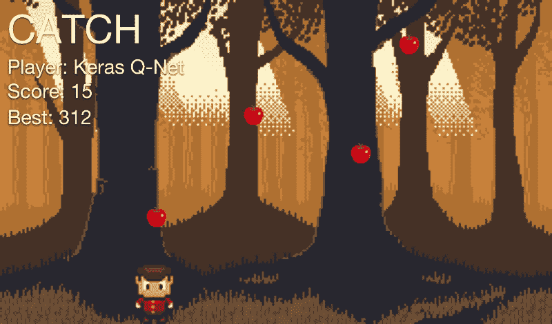
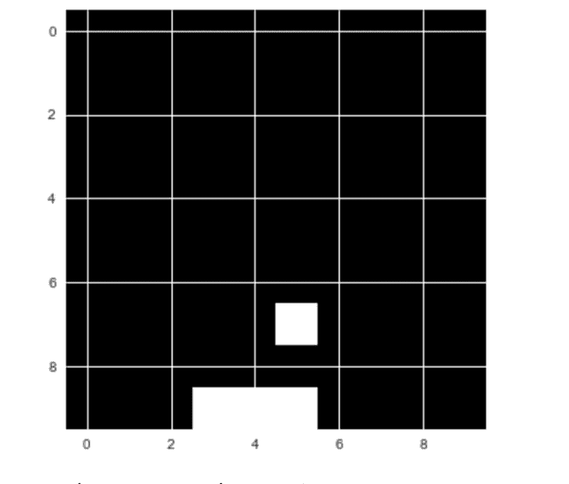
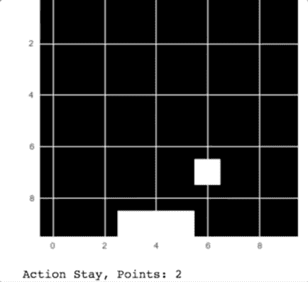
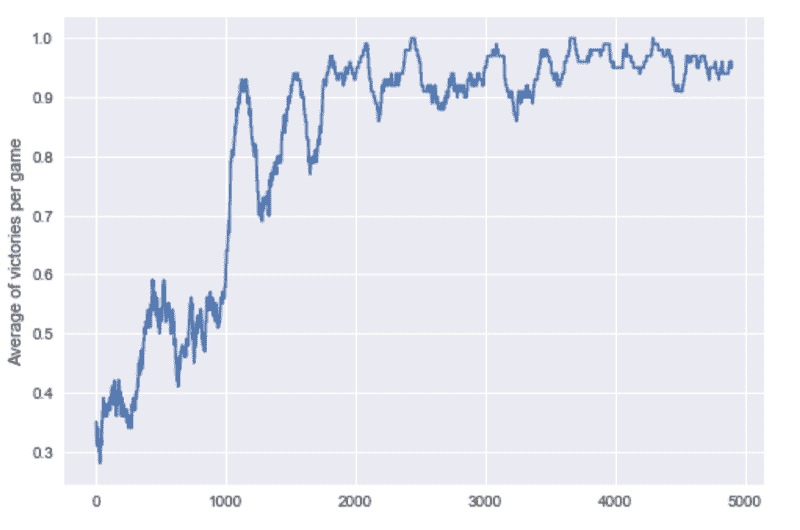

# 深度强化学习:从哪里开始

> 原文：<https://www.freecodecamp.org/news/deep-reinforcement-learning-where-to-start-291fb0058c01/>

作者 Jannes Klaas

# 深度强化学习:从哪里开始

去年， [DeepMind](https://deepmind.com/) 的 [AlphaGo](https://deepmind.com/research/alphago/) 以 4 比 1 击败了[的围棋世界冠军 Lee Sedol。超过 2 亿人观看了强化学习(RL)登上世界舞台。几年前，DeepMind 推出了一款可以玩雅达利游戏的机器人。该公司很快被谷歌收购。](https://www.wired.com/2016/03/two-moves-alphago-lee-sedol-redefined-future/)

许多研究人员认为，RL 是我们创造人工通用智能的最佳机会。这是一个令人兴奋的领域，有许多未解决的挑战和巨大的潜力。

虽然一开始看起来很有挑战性，但开始使用 RL 实际上并不困难。在本文中，我们将创建一个带有 [Keras](https://keras.io/) 的简单机器人，它可以玩接球游戏。

### 游戏

A prettier version of the game we will actually train on

Catch 是一款非常简单的街机游戏，你小时候可能玩过。水果从屏幕顶部落下，玩家必须用篮子接住它们。每抓到一个水果，玩家得一分。每失去一个水果，玩家就失去一分。

这里的目标是让电脑自己玩接球。但是我们不会使用上面的漂亮游戏。相反，我们将使用简化版本来简化任务:

Our simplified catch game

玩接球游戏时，玩家在三种可能的动作中做出选择。他们可以向左、向右移动篮子，或者保持不动。

这个决定的基础是游戏的当前状态。换句话说:下落的水果和篮子的位置。

我们的目标是创建一个模型，在给定游戏屏幕内容的情况下，选择导致最高分的动作。

这个任务可以看作是一个简单的分类问题。我们可以让专业的人类玩家多次玩这个游戏，并记录他们的行为。然后，我们可以训练一个模型来选择反映专家玩家的“正确”动作。

但这不是人类学习的方式。人类可以在没有指导的情况下，自己学习像接球这样的游戏。这很有用。想象一下，如果每次你想学习像接球这样简单的东西，你都必须雇用一群专家来执行一项任务数千次！这将是昂贵和缓慢的。

在强化学习中，模型从经验中训练，而不是标记的数据。

### 深度强化学习

强化学习受到行为心理学的启发。

我们不是给模型提供“正确”的行为，而是给它提供奖励和惩罚。该模型接收关于环境的当前状态的信息(例如，计算机游戏屏幕)。然后它输出一个动作，比如操纵杆的移动。环境对这一行动作出反应，并提供下一个状态，以及任何奖励。

该模型然后学习寻找导致最大回报的行动。

这在实践中有许多可行的方法。在这里，我们要看看 Q 学习。当 Q-Learning 被用来训练电脑玩雅达利游戏时，它引起了轰动。今天，它仍然是一个相关的概念。大多数现代 RL 算法都是 Q 学习的某种改编。

#### q-学习直觉

理解 Q-learning 的一个好方法是比较玩 Catch 和下棋。

在这两个游戏中，你都有一个状态。在国际象棋中，这是棋盘上数字的位置。在 Catch 中，这是水果和篮子的位置。

然后玩家必须采取行动。在国际象棋中，这是移动一个图形。在 Catch 中，这是向左或向右移动篮子，或者保持在当前位置。

结果，会有一些奖励`R`，和一个新的状态`S’`。

抓人和下棋的问题在于，奖励不会在行动后立即出现。

在接球游戏中，只有当水果击中篮筐或掉落在地板上时，你才能获得奖励；在象棋中，只有当你赢得或输掉比赛时，你才能获得奖励。这意味着奖励是**稀疏分布的。**大多数时候，`R`会是零。

当有奖励时，它并不总是前一步行动的结果。很久以前采取的一些行动可能会导致胜利。弄清楚哪种行为对奖励负责通常被称为**信用分配问题**。

因为奖励是延迟的，好的棋手不会只根据眼前的奖励来选择他们的棋。相反，他们通过**预期未来回报**来选择。

例如，他们不仅考虑他们是否能在下一步行动中消除对手的身影。他们还会考虑现在采取某项行动将如何在长远上帮助他们。

在 Q-learning 中，我们根据最高的预期未来回报来选择我们的行动。我们用一个“Q 函数”来计算这个。这是一个数学函数,它有两个参数:游戏的当前状态和一个给定的动作。

我们可以这样写:`Q(state, action)`

当处于状态`S`时，我们估计每个可能行为的未来回报`A`。我们假设，在我们采取行动`A`并转移到下一个状态`S’`后，一切都完美了。

给定状态`S`和动作`A`的预期未来回报`Q(S,A)`被计算为即时回报`R`，加上之后的预期未来回报`Q(S',A')`。我们假设下一个动作`A'`是最优的。

因为未来存在不确定性，所以我们用因子γ来贴现`Q(S’,A’)`。

`Q(S,A) = R + γ * max Q(S’,A’)`

优秀的棋手非常善于在头脑中估算未来的回报。换句话说，他们的 Q 函数`Q(S,A)`非常精确。

大多数国际象棋练习都围绕着开发一个更好的 Q 函数。玩家细读许多旧游戏，以了解特定的动作在过去是如何进行的，以及给定的动作有多大可能导致胜利。

但是机器如何估计一个好的 Q 函数呢？这就是神经网络发挥作用的地方。

### 毕竟回归了

玩游戏的时候，我们会产生很多“体验”。这些经验包括:

*   初始状态，`S`
*   采取的行动，`A`
*   获得的奖励，`R`
*   以及随之而来的状态，`S’`

这些经验就是我们的训练数据。我们可以将估算`Q(S,A)`的问题框架化为[回归问题](https://en.wikipedia.org/wiki/Regression_analysis)。为了解决这个问题，我们可以使用一个[神经网络](http://news.mit.edu/2017/explained-neural-networks-deep-learning-0414)。

给定由`S`和`A`组成的输入向量，神经网络应该预测等于目标值`R + γ * max Q(S’,A’)`的`Q(S,A)`的值。

如果我们擅长预测不同状态`S`和动作`A`的`Q(S,A)`，我们就有一个很好的 Q 函数近似值。注意，我们通过与`Q(S,A)`相同的神经网络来估计`Q(S’,A’)`。

### 培训过程

给定一批经验`< S, A, R, S` ' >，那么训练过程看起来如下:

1.  对于每个可能的动作`A’`(左、右、停留)，使用神经网络预测预期的未来回报`Q(S’,A’)`
2.  选择三个预测的最高值作为`max Q(S’,A’)`
3.  计算`r + γ * max Q(S’,A’)`。这是神经网络的目标值
4.  使用损失函数训练神经网络。这是一个计算预测值离目标值有多近或多远的函数。这里，我们将使用`0.5 * (predicted_Q(S,A) — target)²`作为损失函数。

在游戏过程中，所有的经历都存储在一个**回放存储器**中。这就像一个简单的缓冲区，我们在其中存储`< S, A, R, S` ' >对。体验重放类还处理为训练准备数据。查看下面的代码:

### 定义模型

现在是时候定义模型了，它将学习 Catch 的 Q 函数。

我们使用 [Keras](https://keras.io/) 作为 [Tensorflow](https://www.tensorflow.org/) 的前端。我们的基线模型是一个简单的三层密集网络。

这个模型在这个简单版本的 Catch 上已经表现得相当好了。前往 GitHub 查看[的完整实现](https://github.com/JannesKlaas/sometimes_deep_sometimes_learning/blob/master/reinforcement.ipynb)。您可以尝试更复杂的模型，看看是否可以获得更好的性能。

### 探测

Q-Learning 的最后一个要素是探索。

日常生活表明，有时你必须做一些奇怪和/或随机的事情，以发现是否有比你日常小跑更好的事情。

Q-Learning 也是如此。总是选择最佳选项意味着你可能会错过一些未探索的路径。为了避免这种情况，学习者有时会随机选择一个选项，但不一定是最好的。

现在我们可以定义训练方法:

我让游戏训练了 5000 个纪元，它现在做得相当好！

Our Catch player in action

正如你在动画中看到的，电脑接住了从天而降的苹果。

为了形象化模型是如何学习的，我绘制了各个时期胜利的移动平均值:

### 从这里去哪里

现在你已经对 RL 有了初步的了解和直觉。我推荐看一看这个教程的完整代码。你可以尝试一下。

你可能还想看看亚瑟·朱利安尼的系列作品。如果你想要一个更正式的介绍，看看[斯坦福的 CS 234](http://web.stanford.edu/class/cs234/index.html) 、[柏克莱的 CS 294](http://rll.berkeley.edu/deeprlcourse/) 或[大卫·西尔弗在 UCL 的演讲](http://www0.cs.ucl.ac.uk/staff/d.silver/web/Teaching.html)。

练习你的 RL 技能的一个很好的方法是 [OpenAI 的健身房](https://gym.openai.com/envs/)，它提供了一套带有标准化 API 的训练环境。

#### 承认

本文基于 2016 年 [Eder Santana](http://edersantana.github.io/) 的[简单 RL 示例](https://gist.github.com/EderSantana/c7222daa328f0e885093)。我重构了他的代码，并在我 2017 年早些时候写的[笔记本](https://github.com/JannesKlaas/sometimes_deep_sometimes_learning/blob/master/reinforcement.ipynb)中添加了解释。为了便于阅读，我在这里只展示了最相关的代码。前往[笔记本](https://github.com/JannesKlaas/sometimes_deep_sometimes_learning/blob/master/reinforcement.ipynb)或 [Eder 的原始帖子](http://edersantana.github.io/articles/keras_rl/)了解更多信息。

#### 关于 Jannes Klaas

本文是[金融背景下的机器学习课程材料](https://github.com/JannesKlaas/MLiFC)的一部分，帮助经济学和商科学生理解机器学习。

我花了十年时间开发软件，现在正踏上把 ML 带入金融界的旅程。我在鹿特丹管理学院学习，并在住房和城市发展研究所做研究。

你可以在推特上关注我。如果您有任何问题或建议，请在[媒体](https://medium.com/@jannesklaas)上留言或 ping 我。