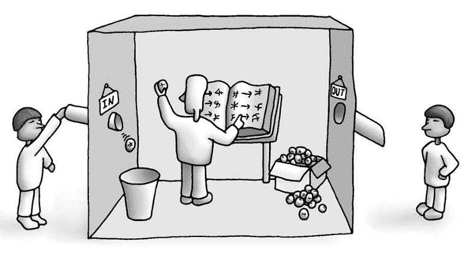

# 更深入:人工智能研究的思想史

> 原文：<https://www.freecodecamp.org/news/deeper-ai-a104cf1bd04a/>

埃琳娜·尼西奥蒂

# 更深入:人工智能研究的思想史

Do Androids Dream of Electric Sheep? Let’s go back to a time when AI questions were more straightforward (but still difficult to answer).

人工智能发展迅速。氛围无处不在。事实开始听起来像科幻电影，科幻电影像现实的版本(有更好的图形)。可能是人工智能最终达到了它追求了几十年的成熟水平，但却被顽固地否定了，这使得它的部分社区和整个世界对它的可行性产生了怀疑。

《弗兰肯斯坦》可能包含与今天相关的相似之处。玛丽·雪莱的哥特式小说包含了一个关于创造和引入一个人造生命到社会中的后果的讨论。这种生物以其非人的暴行和人类表现出的软弱、对伴侣的需求以及生存危机让我们困惑。

有人会说，我们应该关注未来和我们的发现的后果。但是，一个人怎么能关注向当代社会这样复杂的系统中注入一大群生物所造成的混乱呢？人们也可以关注那些成就，那些让这些想法听起来真实的成功故事。但是一个事后的人如何区分正确的直觉和运气呢？

把你工作的枝桠放在一边一会儿，并评估其根基的稳固性，这需要自我克制和智慧。一棵盛开的树会让人分心。

无论你是在追寻古希腊哲学家的逻辑思维规则，阿拉伯数学家的推理公式，还是 19 世纪知识分子的数学知识的力量，一个令人不安的概念变得清晰起来:问题比你可以设计的网络更深(即使考虑到[摩尔定律](https://en.wikipedia.org/wiki/Moore%27s_law))。

> “我相信，我们会成为什么样的人取决于我们的父亲在不经意间教给我们的东西，当他们不想教我们的时候。我们是由智慧的碎片组成的。”

> *安伯托·艾柯*

剩下的讨论将从人工智能的历史中浮现。不是成就的历史，而是一些重要人物的问题、争论和信仰的历史。大多数事件都围绕着 60 年代，这个时代人工智能获得了它的官方定义，它的目的，它的科学界和它的对手。

#### 机器会思考吗？

1950 年，艾伦·图灵试图在他的开创性论文[计算机器和智能](https://en.wikipedia.org/wiki/Computing_Machinery_and_Intelligence)中回答这个故意表达简单的问题。承认它的模糊性和它对理解人工智能的限制，他继续阐述一个思想实验，也被称为图灵测试:

玩家 A 是一个男人，玩家 B 是一个女人，玩家 C 是两种性别都有。c 扮演询问者的角色，看不到任何一个玩家，但是可以通过非个人的笔记与他们交流。通过向 A 和 B 提问，C 试图确定这两个人中哪个是男人，哪个是女人。a 的角色是欺骗审讯者做出错误的决定，而 B 试图协助审讯者做出正确的决定。

重新表述的问题是:

当一台机器在这个游戏中扮演 A 的角色时会发生什么？当游戏在两个人之间进行时，询问者会像他一样经常错误地决定吗？

图灵的方法似乎遵循了鸭子测试的原则:如果它看起来像鸭子，像鸭子一样游泳，像鸭子一样嘎嘎叫，那么它很可能就是一只鸭子。

当谈到智力的“人类”方面，如意识时，他的态度是，你不能责怪某人(或某物)不具备你尚未定义的特征。因此，在我们对人工智能的探索中，意识是无关紧要的。

哥德尔的不完全性定理是人们试图谈论人工智能的一个障碍。根据他们的观点，数理逻辑不可能既完整又一致，因此，配备了数理逻辑来学习的机器，如人工智能，预计在学习某些真理时会失败。图灵对这个问题的回答相当令人信服:你怎么知道人类的智力没有局限性？

图灵的论文在论点和清晰的辩证结构方面都很丰富，然而却局限于对尚未发现的技术的推测。

#### **迈向人工智能的步伐**

马文·明斯基是人工智能研究领域的创始人之一。在布满灰尘的艾全家福相册里，明斯基会是这个给一次家庭聚餐带来些许不安的老人:“老明斯基叔叔。他很特别，总是有一些有趣的事情要说。

明斯基是 1956 年达特茅斯会议的组织者之一，当时人工智能首次被定义为一个术语和一个领域。人们最记得他的是他坚信人工智能是可行的，以及他用错误的手段追求人工智能的做法。

让我们看看明斯基在 1961 年被问及迄今为止人工智能的进展时是怎么说的。

> 我们应该问什么是真正的智慧吗？我自己的观点是，这与其说是一个技术问题，不如说是一个美学问题，或者说是一个尊严感问题！对我来说,“智力”似乎只意味着我们碰巧尊重但不理解的复杂的行为。通常，数学中的“深度”问题也是如此。一个定理的证明一旦真正理解了，它的内容似乎就变得微不足道了。

明斯基认识到定义人工智能的内在困难，并因此追求人工智能，他从建立人工智能的基础开始。根据他的说法，这些是搜索、模式识别、学习、计划和归纳。

如果程序的最终目的是搜索并找到自己的解决方案，那么模式识别可以帮助它识别合适的工具，学习可以帮助它通过经验进行改进，规划可以导致更有效的探索。关于制造具有归纳能力和推理能力的机器的可能性，明斯基说:

> *现在【根据哥德尔不完全性定理】，不可能有一个归纳推理的系统在所有可能的宇宙中都行得通。但是给定一个宇宙(我们的世界)，或者一个宇宙的集合，以及一个成功的标准，对于机器来说，这个(认识论的)问题就变成了技术问题，而不是哲学问题。*

文本的其余部分包含了一种反复出现的冲动，即澄清对人工智能的追求应该通过复杂的层次结构来进行。出于这个原因，他质疑[感知器](https://en.wikipedia.org/wiki/Perceptron)方法，因为它对于中等难度的问题会失败。坦率地说，我们不能期望现实是简单的。

明斯基可以归咎于不鼓励对感知机的研究，这可能推迟了深度学习的发展。意识到，即使使用简单的构建模块，一个人也可以通过深入架构来解决复杂的问题，这似乎已经逃脱了他的，然而，巧妙的洞察力。

然而，他的评论最终可以被视为建设性的批评，因为它们有助于社区探索原始方法的弱点。此外，深度学习可能是我们迄今为止最好的(以及多么奇妙的应用)，但不应被无条件地视为人工智能的圣杯。

#### **头脑、大脑和程序**

1980 年，约翰·塞尔生气了。虽然他可能早些时候生气了，但这是他决定公开他与强艾的分歧的时刻。的确，就连标题听起来都很讽刺。我觉得塞尔抓住了我的衣领，用力挥舞着他的手指，说:“让我来帮你做一些基本的区分，年轻人”。

> 人们得到的印象是，写这种东西的人工智能的人认为他们可以逃脱惩罚，因为他们并没有认真对待它，他们也不认为其他人会认真对待它。我建议至少一会儿，认真对待它。”

塞尔只是在攻击强人工智能的概念，他将强人工智能定义为计算机有能力实践任何类似人类的行为。他将此解释为机器展示意识的能力，他用类比反驳了这种能力。他著名的思想实验“中国房间”是这样的:

你是一个只会说一种语言的英语的人，被锁在一个房间里，房间里有以下东西:一大堆中文文字(称为脚本)，另一大堆中文文字(称为故事)，以及一套指导你如何将第二批中文符号与第一批匹配的英文规则(称为程序)。然后，给你另一批中文写作(这次叫做问题)和另一套英文说明，其规则将问题与另外两批问题相匹配。恭喜你，你刚学会中文！

这是塞尔在 1980 年提出的中国房间实验。思想实验本身并不是一个实验，因为它的目标不是进行实验，而是探索一个想法的潜在后果。最古老最著名的，大概就是[伽利略的比萨斜塔实验](https://en.wikipedia.org/wiki/Galileo%27s_Leaning_Tower_of_Pisa_experiment)(你也以为伽利略真的是从塔上掉苹果吗？).

塞尔的观点是，你可以通过接受中文问题得到中文答案的事实并不意味着你理解中文，如果这种能力是通过遵循另一种语言的规则而产生的。因此，一台在被赋予适当算法后给出预期输出的机器不应被视为一个“思考”实体。

塞尔没有争议的是程序思考的能力，就像在一些函数推理方面一样。他指责当前的人工智能研究人员是行为主义和操作主义的，因为他们试图将程序等同于大脑(这是真的)，而忽略了大脑的重要性。

根据他的观点，意识只来自生物操作，因为程序完全独立于它的实现(因为它可以在任何硬件上运行),所以它不能表现出意识。

阅读原文，你会觉得他在攻击一个不成熟的计算机科学家群体，这个群体没有费心就什么是智能达成共识，却试图在目的论方法和推测的指导下模拟智能。

明斯基对塞尔和一般哲学方法的回应是虚无主义的:*“他们误解了，应该被忽略”*。

#### 大象不会下棋。

你不应该让他们为此感到难过。Rodney A. Brooks 在 1990 年写的这篇论文是一个新的人工智能布道者的尝试，他使用论据和他的机器人舰队来说服人工智能的经典方法应该为他的机器人留下一些空间。

为了获得那个时代的感觉，AI 正在经历它的第二个冬天。随着企业和政府意识到社区的期望过高，资金被削减了。

所以，是时候反省了。当某件事从根本上失败了，有两种方法可以解决它:要么不可能实现，要么你的方法有缺陷。

布鲁克斯提出，人工智能的停滞是由于它的功能性表征的教条。符号系统假说是一个关于智力如何运作的长期观点。按照它的说法，世界涉及实体，像人、汽车和宇宙之爱，所以很自然地把它们和符号匹配起来，用它们喂机器。如果这个假设是正确的，那么你已经为机器提供了所有必要的信息，让它“想出”智能。

虽然这个假设似乎没有问题，但它有一些深远的后果，可能是人工智能表现不佳的原因:

*   符号系统不足以描述世界。根据[框架问题](https://en.wikipedia.org/wiki/Frame_problem)假设任何没有明确陈述的事情都是逻辑谬误。关于这一点，布鲁克斯迷人地建议:为什么不把世界作为自己的模型？
*   智能不可能从简单的计算中产生。训练智能算法所必需的大量使用试探法与我们创造知识的尝试是矛盾的。(你的网格搜索是对人类智慧的侮辱。)
*   人工智能对确保学习模型通用性的痴迷导致了布鲁克斯称之为 puzzlitis 的现象:在证明算法在模糊情况下有效方面付出了过多努力。这当然是一种吸引人的能力，但它似乎不是知识的基本结果，我们的世界是相当一致的。

布鲁克的反对意见是*物理基础假说*。即允许人工智能直接与世界交互，并以此作为自己的表征。这无疑改变了人工智能的标准实践:从需要大量计算资源、专家指导和对训练数据永不满足的需求的学习，布鲁克建议用廉价的硬件装备物理实体，并在世界上释放它们。但这是否低估了问题？

布鲁克斯认为智力来自集体行为，而不是复杂的部分。也许他的实验中最深刻的观察是关于*“目标导向行为如何从更简单的非目标导向行为的相互作用中出现”*。不需要存在预先确定的协调模式，因为智能机器应该制定自己的策略来与世界进行最佳交互。

布鲁克对进化的论证在说服我们物质基础假说的重要性方面走了很长一段路:人类是我们拥有的最常见和最接近智力的例子。因此，在我们试图重新创造这一特征时，观察进化，一个缓慢的、适应性的过程，逐渐导致人类文明的形成，难道不是自然的吗？现在，如果考虑到我们进化诸如互动、繁殖和生存等技能所花费的时间，与我们仍然年轻的使用语言或下棋的能力形成对比，那么我们可能会得出这样的结论:这些是最难发展的技能。所以，为什么不把注意力放在这上面呢？

尽管布鲁克对他的方法的实用性欣喜若狂，但他承认其理论上的局限性，这可以归因于这样一个事实，即我们尚未对相互作用的种群的动力学形成完整的理解。再一次，工程师对哲学异议的漠视是显而易见的:

> “至少如果我们的策略不能说服扶手椅哲学家，我们的工程方法将会从根本上改变我们生活的世界。”

#### 人工智能体现进步

尽管漂浮在问题的海洋中，人工智能展现了我们无法争议的东西:进步。然而，将当前的应用从技术进步和启发式优势的影响中剥离出来，以获得对当前研究质量的准确感知是一项乏味的任务。

深度学习会被证明是一个有价值的工具来满足我们不断要求的智力标准吗？或者这是 AI 再次到达冬天之前的又一个间冰期？

此外，人们的担忧和问题已经从纯粹的哲学转向了社会，因为人工智能在日常生活中的后果变得比理解意识、上帝和智能的需求更加明显和紧迫。然而，这可能是一个更难回答的问题，并敦促我们挖掘得更深。

当维特根斯坦写《手稿》的时候，他面临着一个根本性谬误的危险:他的论点成为了他作品的教条的牺牲品。也就是说，如果一个人接受他的学说是真的，他的论点是不合逻辑的，因此他的学说应该是假的。但是维特根斯坦有不同的想法:

> 我的命题是这样阐明的:当他通过它们，在它们上面，在它们上面爬出来时，理解我的人最终认识到它们是无意义的

为了理解一个复杂想法背后的真相，我们需要进化。我们必须坚定地站在我们的前一步，并愿意放弃它。不是每一步都要正确，但一定要理解。当后来面对这一论点时，维特根斯坦说他不需要梯子，因为他能够直接接近真理。

我们可能还需要它。