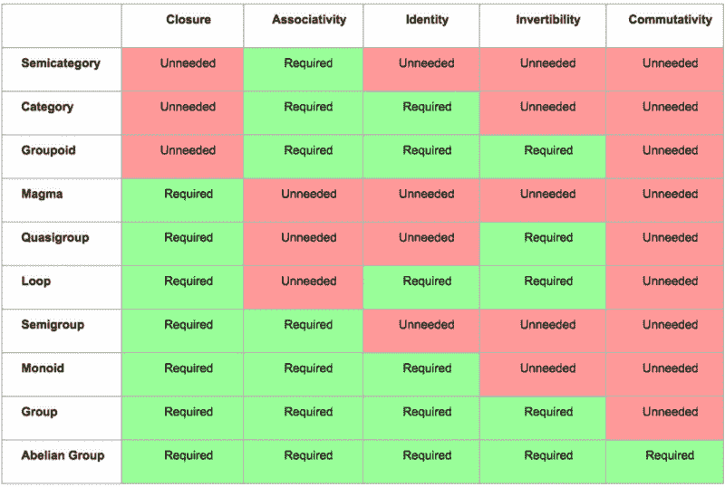
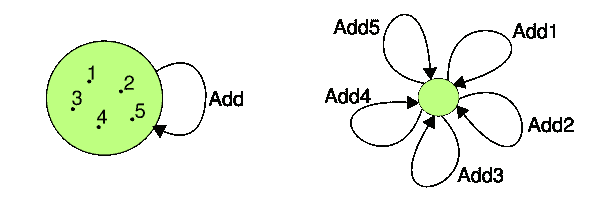

# 对 Scala 中单子的进一步去模糊化:范畴理论方法

> 原文：<https://www.freecodecamp.org/news/demistifying-the-monad-in-scala-part-2-a-category-theory-approach-2f0a6d370eff/>

你们中的一些人可能读过我关于单子的文章。这一次我想从一个不同的，更理论化的角度来谈论单子。不一定要先看前面的文章(以防你没有看过)，但是如果你对这个话题一无所知，我想在开始这篇文章之前熟悉一下也无妨。

我们开始吧。你们中的一些人可能听过这句名言:

> 幺半群只是内函子范畴中的幺半群，有什么问题？

最初的陈述来自桑德斯·麦克兰恩的工作数学家的*范畴，但是它被引用和重新表述了无数次。我把这句话作为一个参考点；一个教学目标，如果你愿意的话。所以我将尝试从范畴理论的角度，通过解释那个特殊的句子来解释单子。*

重要提示:这里写的很多东西都是简化的，可能不是 100%精确的。范畴论是一个非常复杂的数学领域(有时甚至被开玩笑地称为“[抽象的废话](https://en.wikipedia.org/wiki/Abstract_nonsense)”)。
这不是一篇数学文章。这只是我试图创建一个介绍性的，易于理解的文本，作为一个起点，让你对范畴理论感到兴奋，并继续自己的探索。

#### 代数结构

什么是类别？范畴是一个*代数结构*。好的，但是什么是代数结构呢？代数结构基本上是一个由一个或多个**元素**组成的**集合**(当在作为代数结构集合的上下文中使用时，它通常被称为 *集合*)以及一个或多个**运算**。

区分代数结构有两个主要因素:

*   集合元素运算需要遵守的定律
*   单位元素的存在性

以下是出现在不同代数结构中的一些定律(代数结构中的运算表示为○):

*   *闭包*:对于代数结构 *M* 中的所有 *a* 、 *b* ，运算 *a* ○ *b* 的结果也在 *M* 中
*   *可逆性*:对于 *M* 中的每个元素 *a* 都有一个元素 *b* 其中*a*○*b*=*b*○*a*=*e*，其中 *e* 为恒等式
*   *交换性*:对于 *M* : *a ○ b = b ○ a* 中的所有 *a，b*
*   *关联性*:对于 *M 中的所有 *a，b，c*:(a○b)○c = a ○( b○c)*

Identity 元素是一种元素(引用 [wiki](https://en.wikipedia.org/wiki/Identity_element) )“当与其他元素组合时，保持它们不变”。它是在操作中使用时不影响结果的元素。我们也可以把它变成一条法律:

*   *身份*:对于 *M* 中的任意一个 *a* 都有一个元素 *e* 其中*e*○*a = a*○*e = a*

因此，从具有一个或多个运算的简单集合开始，通过添加所需的某个定律组合，我们可以得到各种代数结构。以下是一些例子:



#### 种类

范畴是一种代数结构，它由对象组成，这些对象之间定义了映射。那些映射被称为*态射*或*箭头*。箭头从一个物体指向另一个物体。有些对象对之间定义了箭头，有些则没有。

类别有一个重要的特点:如果有某个箭头 *f* : A → B 和一个箭头 *g* : B → C，那么也自动有一个箭头 *f* 和 *g* 的*合成*，形成一个箭头 A → C，我们把这个合成写成 *g ○ f* 。回想一下，代数结构被定义为对其元素进行某种操作的集合；在类别的情况下，这些元素是箭头，操作是箭头组合。

类别是完全抽象的，这很难理解。“给我一个类别的例子”，你问。好了，这里有一个——*Set*。*集*是[集](https://en.wikipedia.org/wiki/Category_of_sets)的类别。哪几套？它包括整数集，英语字母表中的字母集，所有四条腿的动物集吗？是的，它包括任何一套。

这并不容易，但尽量不要用完全具体的术语来思考。不要试图将这些设定具体化。我们不关心类别中有多少个集合，也不关心这些集合中有哪些元素。我们只关心集合范畴中的对象是集合，箭头是集合之间可以组合的函数这一事实。我的意思是，这还不是全部，在包含大量公理和定律的集合类别背后，还有一门完整的科学。但是我们现在需要的都有了。

关于我们的代数结构定律，范畴服从两个:**恒等式**和**结合律**。因为范畴是一个代数结构，它的元素是箭头，元素之间的运算是箭头组合，遵循这些规律意味着我们有一个相同的箭头，箭头组合是关联的。

标识箭头是从一个对象指向其自身的箭头。任意箭头 *f* 与恒等箭头 *e* 的合成为箭头 *f:*

*e○○f*=*【f】*=*【f】**【e】*

给定箭头 *f* 、 *g* 、 *h* 及其组合 *○* ，结合律为:

*h○○(g○○f)=(h○○g)○f*

你最喜欢的编程语言中的函数是另一个例子。这个类别中的对象是类型，而态射是接受类型并返回类型的函数。对于任何类型，都存在一个返回相同类型(单位)的函数，并且函数容易组合，遵守结合律。注意，两个或更多参数的函数可以被[化为](https://en.wikipedia.org/wiki/Currying)，因此被视为返回高阶函数的一个参数的函数。

这就是目前关于类别的内容。对象，箭头，组成，身份，关联性。很好。我们很快会回复他们。

#### 幺半群

越来越暖和了。什么是幺半群？

幺半群可以定义为:

-单个集合 *S*
-与一个结合的二元运算 *○*
-和一个恒等式元素 *e*
*-* 遵循两个定律:
*(a○b)○c = a ○( b○c)*
*a○e = e○a = a*

请注意，这看起来与类别非常相似。我们很快就会明白这意味着什么。

但首先是一个幺半群的例子。好，我们需要一个集合，它有一个结合的二元运算和一些单位元素。我们可以对整数 z 集合做加法，好的，我们有一个单位元(它是零)，我们有结合律，因为(x + y) + z= x + (y + z)。如果你再看一下各种代数结构的定律表，你会注意到 Z 中的加法实际上是一个群，因为它也有一个逆(减)。

但这里有一些很酷的东西，同时可能有点令人不安——幺半群实际上是一个**类别**，只是有点特殊:**它只有一个对象**。

如果你回到我们之前看到的表格，你会看到幺半群实际上非常类似于一个范畴，唯一的区别是闭包法。回想一下闭包说“对于代数结构 *M* 中的所有 *a* 、 *b* ，运算结果 *a* ○ *b* 也在 *M* ”。我们在幺半群中得到闭包属性是非常合乎逻辑的，因为我们总是从同一个对象开始并在同一个对象中结束(我们拥有的唯一对象)。类别没有闭包，因为并不是所有的箭头都可以组合(例如，你不能组合 *a → b* 和 *c → d* )，所以“组合任意两个元素，你将得到也是集合的一部分的东西”这个属性不成立。其他两条定律(恒等式和结合律)是相同的。

当视点从*幺半群作为集合*切换到*幺半群作为范畴*时，集合的元素成为范畴的箭头，单位元成为单位箭头，二元运算成为箭头合成。是的，一旦我们进入阴阳魔界，也就是所谓的范畴理论，事情就变得很奇怪。但是随着思维方式的转变，我们的 add-in-Z 例子可以被看作是一个类别。

首先，数字现在是箭头。把箭头想象成一个“加 X”的函数。这些函数组合得非常好，因为将一个数加上 3，再加上 5，就等于将原来的数加上 8。此外，用 add5 合成 add3 然后用 add7 合成与用 add5 和 add7 的合成合成 add3 是相同的:

*(add 3○add 5)○add 7 = add 3 ○( add 5○add 7)*

举一个关于范畴理论的特别的[伟大的来源](http://bartoszmilewski.com/2014/12/05/categories-great-and-small/)，我以加法器为例:

> 与其给你传统的加法规则，我还不如给你组成加法器的规则，而不丢失任何信息。

因此，通过稍微转移我们的观点，我们能够把幺半群看作一个集合(在左边)和一个单对象范畴(在右边)。



(I took the photo from [here](https://en.wikiversity.org/wiki/Introduction_to_Category_Theory/Monoids#From_Binary_Operators_to_Arrows))

同样，我们在第一个例子中的所有定律在第二个例子中也存在。不多不少。

好，所以我们不再有数字。我们有表示单参数加法函数的加法箭头。加法运算的第二个操作数是“硬编码的”(运算现在是一元的，而不是二元的)，所以每个自然数都有一个函数。自然数的总数和我们类别中箭头的总数是一样的。最后，所有箭头共享相同的开始和结束对象。

这个对象完全不相关；把它想象成一团无质量的虚无。如果你愿意，我们可以将箭头从“addX”简单地重命名为“x ”,然后整个事情变得非常类似于我们正常的旧集合 Z 加上加法，只是不是“将二加二等于四”，而是我们会说“组成二加二等于四”。

以下是两种观点的维基，也许你会发现它们很有用:

*   [幺半群作为一个集合](https://en.wikipedia.org/wiki/Monoid)
*   [作为范畴的幺半群](https://en.wikipedia.org/wiki/Monoid_(category_theory))。

#### 函子

好了，现在我们知道了什么是代数结构，以及它们是如何定义的，我们还仔细研究了其中的两个——范畴和幺半群。我们看到幺半群也是一个范畴，只是只有一个对象。

我们现在需要的是一个*函子*(顺便说一下，我已经[写了一点关于函子](https://hackernoon.com/functors-and-applicatives-b9af535b1440#.zabfpezi1)的东西)。

与幺半群和范畴相比，函子有点不同。它不是真正的代数结构；它更像是一个函数，将*从代数结构映射到代数结构。但不是任何代数结构:函子是类别之间的**映射。***

我们现在知道，类别是一组对象，它们之间有箭头。functor 知道如何将一个类别映射到另一个类别。它将映射所有对象和所有箭头，并将保留对象之间的连接(如果在原始类别中的 *a* 和 *b* 之间有一个箭头，那么在结果类别中的 *Fa* 和 *Fb* 之间也有一个箭头)。给定原始范畴中的某个对象 *a* 或某个箭头 *f: a → b* ，对应的对象(函子映射到的对象)记为 *F(a)* ，对应的箭头记为 *F(f): F(a) → F(b)* 。

将一个类别映射回同一个类别的函子称为*内函子。*从范畴理论到现实世界的快速迂回——在编程中，我们处理类型范畴中的函子，它们都是内函子。它们将类型的类别映射回类型的类别。每当你映射某个东西时(Scala 中的 *map* ，Haskell 中的 *fmap* ，你手中就有一个 endofunctor。例如，Option、List 和 Future 都是有效的结束函子。基本上任何有 map()函数的东西都是 endofunctor。

但是不要认为这是理所当然的；这只是一个惯例。一些库可能提供给你一个对象，它的 map()不遵守仿函数法则(参见[旧文章](https://hackernoon.com/functors-and-applicatives-b9af535b1440#.zabfpezi1))，这意味着该对象本身不能被认为是仿函数。

示例:在 Scala 中，我们可以从 List[Int]映射到 List[String](换句话说，将 List 的所有元素从 Int 映射到 String):

```
List(1, 2, 3).map((x: Int) => x.toString)
```

我们可以有各种各样的映射:从 Int 到 String，从 String 到 List[String]，从 List[String]到 Banana 等等。都是 Scala 类型。这意味着我们总是从 Scala 类型的类别映射回 Scala 类型的类别。因此有了“结束”的部分。

现在让我们从某个仿函数 F 中“取出”map()方法，并将其视为两个参数的函数——一个仿函数对象和一个映射它的函数。例如，List(1，2，3)。map(f)变成 map(f，List(1，2，3))。

如果我们搜索一下，很容易看到*映射*的签名是:

*(a → b) → F[a] → F[b]*

我们映射的函数表示为 *a → b* ，起始函子对象是*F【a】*，结果函子是*F【b】。*注意，函数 *a → b* (例如 *(x: Int) = > _，而不是提供两个参数。toStrin* g())和一个函子 instance*ce F[*a](e .*g . List(1，2，* 3))，我们可以只提供关于 f 的函子*，在这种情况下，我们在 F[a]→F*b 上得到一个函子*(如果这不是您所熟悉的，请快速研究一下 currying 和部分应用的函子 *n 【T19 因此，我们可以只提供 A 类型的参数和 B 类型的参数并返回 C 类型的值，而不是只提供 A 类型的参数并返回一个函数B → C。**

我们再来看看这个有趣的函数 *(a → b) → F[a] → F[b]* 。是从 *(a → b)* 到 *F[a] → F[b]的函数。*用范畴理论的术语来说——它将一个范畴映射到另一个范畴，其中目的范畴的对象带有 F 符号。记得我们之前说的吗？"给定原始类别中的某个对象 *a* 或某个箭头 *a → b* ，对应的对象(函子映射到的对象)记为 *F(a)* ，对应的箭头记为 *F(a) → F(b)* "这正是地图的作用。

但是我们遗漏了一些东西。我们只看到了作为函子的一半:映射态射的那一半。功能上的**功能。它接受一个函数，并返回该函数的“提升”版本，也就是说，不是接受 *a* 并返回 *b* ，而是接受*F【a】*并返回*F【b】*。顺便说一句，在实践中，我们经常不仅仅是提升函数，并把它们保存起来以备后用。相反，我们立即将它们应用于仿函数实例。例如，我们通常不会将一个函数 *Int → String* 提升到 *List[Int] → List[String]* ，而是马上传入一个 *List[Int]* 的实例(或者，在 Scala 的情况下，我们调用 map()作为 *List[Int]* 实例上的方法)。**

但是，我们知道，functor 不仅把所有的源箭头映射到目的箭头，还把所有的源对象映射到目的对象，对吧？但是我们只看到了箭头的映射，当我们举起 *a → b* 到 *F(a) → F(b)* 的时候。如何映射 *a* 本身(以及 *b* )？这是函子的另一面:除了函数上的函数，还有类型上的**函数。仿函数对箭头的映射由函数对函数部分表示，而对象的映射由函数对类型部分表示。**

类型上的这个函数是什么？是一个*一元类型构造函数*。这意味着，给定某种类型，函子产生另一种新类型。因此，如果我们以列表函子为例，给定一个字符串，它给我们一个列表[字符串]。给定一些 A 型，它给我们一个列表[A]。函子的类型构造函数可以用更一般的方式描述为* → *(将一个类型作为参数，并从中产生一个新类型)。[这里有一些关于类型构造函数的更有用的阅读材料。](http://blogs.atlassian.com/2013/09/scala-types-of-a-higher-kind/)

函子的快速总结。每个函子都是范畴的映射。它通过将 C 中的对象映射到 F 中的对象，将 C 中的态射映射到 F 中的态射，将某个源类别 C 映射到目的类别 F。我们说(引用我自己的话)“给定原始类别中的某个对象 *a* 或某个箭头 *f: a → b* ，对应的对象(函子映射到的对象)表示为 *F(a)* ，对应的箭头表示为 *F(f): F(a) → F(b) 【T7”。*

As (Scala？)程序员们，我们正在处理 Scala 中的类型类别(Haskell 中的类型类别被称为 *Hask* ，所以我猜 Scala one 可以被称为 *Sca* 或其他什么)。这里的对象是 Scala 类型，而态射是这些类型之间的函数。 *Sca* 中的每个函子通过*类型构造函数*映射对象(Scala 类型)，通过函数*映射*映射态射(Scala 类型上的函数)。如果我们以 Option 为例，它将 *Sca* 中的每一个对象(即每一个 Scala 类型)映射到 Option(thatObject)，将 Scala 中的每一个对象间的态射(即 Scala 类型间的函数)映射到 Option(thatFunction)。

由于它是一个函子 *Sca → Sca* ，它更具体地说是一个*内函子*。

#### 单子

现在我们知道什么是范畴，幺半群和内函子，我们可以想象一个内函子的范畴，并试图在该范畴中找到幺半群。正如 Mac Lane 先生的著名声明所告诉我们的那样，内函子范畴中的幺半群实际上是幺半群。

成为某个范畴的幺半群意味着什么？比如范畴集合中的幺半群(记住，那是所有集合的范畴)。这是什么？嗯，看一下类别；它包含了所有可以想象的集合。现在挑出那些满足幺半群规律的，也就是挑出所有那些我们能为其元素找到一个*单位元*并定义一个*结合二元运算*的集合。

一个这样的集合是整数集合，其中单位元为零，二元运算为加法。注意，集合 S 上的同素二元运算必须对两个操作数进行运算，这两个操作数都来自 S，并且返回也是 S 的元素的东西。

酷，那么范畴集合中的幺半群就是任何具有那些性质的集合，也就是那两种运算(比如有加法的自然数的集合)。这里有更多关于 x 范畴中幺半群的例子。

现在让我们看看“内函子范畴中的幺半群”。在这个类别中，**对象是内函子**，**箭头是这些函子**之间的映射。在我们继续之前，有一个额外的术语:函子之间的映射被称为[自然转换](https://en.wikipedia.org/wiki/Natural_transformation)。它们在更高的抽象层次上运行:

*   *箭头*将类别中的对象从一个映射到另一个
*   *函子*将类别从一个映射到另一个
*   *自然转换*将函子从一个映射到另一个

我们也可以说，自然转换是“函子之间的箭头”，这正是我们这里所拥有的——我们有一个内函子类别，这意味着对象本身就是内函子，这些内函子之间的箭头按照定义就是自然转换。

回到我们寻找单子的话题。因此，我们正在做的是深入内函子的范畴，并寻找这一范畴中定义了两个特定箭头的对象——同一性和关联二元运算。当我们有这两个箭头时，我们就有了幺半群(在内函子的范畴中)。

所以我们需要一个内函子 F，为它定义了以下运算:

*   *:*I→f**
*   **:*f x f→f***

**其中 I 是恒等内函子， *η* (eta)是内函子上*恒等*的奇特数学名称， *μ* (mu)是内函子上*关联二元运算*的奇特数学名称。如果你突然不确定这两个是从哪里来的，请记住，当我们谈到幺半群作为一个集合时，我向你展示了一个 [wiki 链接](https://en.wikipedia.org/wiki/Monoid_%28category_theory%29)，正如你所看到的，它使用这两个运算(更准确地说，是幺半群范畴中的箭头)来定义幺半群(在幺半群范畴中)。**

**让我们在内函子范畴的上下文中检查这两个运算，看看它们在那种情况下变成了什么:**

*   ***恒等式*是从一个恒等式内函子(一个将范畴映射到自身的函子)到另一个内函子的自然变换映射。**
*   ***关联二元运算*是某种运算 x，它知道如何将两个内函子变成一个。请记住，这个操作必须是关联的，所以(F x F) x F 必须产生与 F x (F x F)相同的结果。**

**现在让我们看看这两个操作是如何在 Scala 世界中实现的。**

**首先， *η* : *I → F.* 恒等函子 *I* 做的是将任何范畴映射回自身。这意味着它的“类型构造器”实际上并没有创建任何新的类型 *F(value)* 。它只是让值保持原样。所以纳特。转换 *η* 实际上做的是——它接受一个身份函子并将其包装到一个函子 *F* 上下文中。在 Scala 类型类别中，identity 函子将类型映射回自身，因此我们可以将整个转换视为将 Scala 类型提升到某个 F 上下文中，其中 F 可以是任何函子。**

**那么 *μ* : *F x F → F* 呢？这是两个相同函子的组合，结果只有一个。是把 F[F[T]]变成 F[T]的一种方法。**

**基于我们刚才所说的，让 ***应用*** 作为****展平*** 作为 *μ，这是相当符合逻辑的。*方法*应用*从 x 构造一个类型 F[x]，而*展平*“展平”组合 F[F[x]]成 F[x]。***

**因此，每当你在 Scala 中看到一个内函子(实际上，这几乎是任何带有方法*映射*的对象，但是在你声明一个函子之前，记得检查函子法则；例如，有一种方法可以打破 Set 的那些定律)也有*展平*和*单位*，你实际上是在处理一个单子。**

#### **三个单子定义和单子定律**

**我们看到 monad 是一个内函子(记住，编程语言中的任何函子实际上都是内函子，因为它从类型的类别映射回类型的类别),它有两个自然转换:**

*   **身份/单位实施为*适用，*和**
*   **关联二元运算实现为*展平*(注意术语*单位*和*身份*可互换使用；当从实践、编程的角度谈论时，我倾向于使用 unit，当谈论范畴理论时，我倾向于使用 identity，但有时我可能会把它们混淆起来；它们是一回事)。**

**此外，由于我们在讨论(endo)仿函数，我们知道也有一个 *map* 方法可用。**

**你可能听说过由*单元*和*平面图*组成的单子。是的，没错。我们可以简单地将 *flatten* (来自 *μ* ) 和 *map* (来自其仿函数性质)方法“挤压”成一个单独的 *flatMap* 方法。我们的单子仍然会保留相同的属性，只是它的关联二元运算不再是 *flatten* ，而是 *flatMap* 。单子定律(稍后解释)不受伤害。**

**所以单子有两个有效的定义？一个涉及*单元*和*平面图*一个涉及*单元*、*平面图*和*？***

**是的。不仅如此，还有第三个。单子有三种不同的表达方式。这三个定义是等价的，我们可以很容易地将一个转换成另一个。他们在这里:**

*   **单位+平面图**
*   **单位+展平+贴图**
*   **单元+合成**

**这三者都同样强大，每一个都可以用另外两个中的一个来表达。我们稍后会详细讨论它们。**

**现在，每个 monad 实现(例如，列表、选项等。)需要遵守**单子定律**。单子定律可以用三种不同的方式表达，这取决于你使用的单子定义，但它们都类似于同一个核心概念。**

**以下是使用*单位+平面图*定义呈现的单子定律:**

*   ****左同一律** :
    *单位(x)。平面地图(f) == f(x)***
*   ****右同一律** :
    *m.flatMap(单位)== m***
*   ****结合律** :
    *m.flatMap(f)。flat map(g)= = m . flat map(x f(x)。平面地图(g))***

**很明显，*单位+平面图*定义很容易转换成*单位+展平+地图*，反之亦然，因为*平面图=展平+地图。*我现在将显示*单元* + *平面图*和*单元* + *合成*之间的连接。我喜欢*单元+组合*的定义，因为它使规则更容易表达。**

**让我们看看*编写*函数:**

```
**`def compose: (A => F[B]) => (B => F[C]) => A => F[C]`**
```

**这是一个双参数函数，其中两个参数都是类型为 *A → F[B]* 的函数，结果也是相同类型的函数。请注意，类型 A 和 B 是完全自由的，可以表示 Scala 中的任何具体类型( *A→F[B]* 可以是例如 *Int → List[String]* 或 *Int → Set[Int]* )。我们简单地使用字母来表示第一个函数的参数与结果函数的参数是相同的类型(这里表示为“A”)。**

**顺便说一下，类型 A *→* F[B]的函数被称为*克莱斯利箭头*，以防你在某处偶然发现这个术语。我们说，我们刚刚定义的函数将 Kleisli 箭头作为参数，也作为返回类型。这是克莱斯利之箭的*组合。***

**现在让我们也定义一下“单位”:**

```
**`def unit: A => F[A]`**
```

**我们可以很容易地检查出这确实是 unit:它是一个中性元素，当用组合时，会返回原始元素。取签名，用 F[B]代替 F[C],这样第二个参数就成了一个恒等函数:**

```
**`(A => F[B]) => (B => F[B]) => A => F[B]`**
```

**同样，类型 A、B 和 C 不是固定的，并且可以表示任何具体类型，因此来自第一个等式表达式的 *A → F[A]* 与该表达式中的 *B → F[B]* 是相同的函数。你可以不把恒等函数想成一个 *→* F[A]，而是随便什么*→*F[随便什么]:**

```
**`(A => F[Whatever]) => (Whatever => F[Whatever]) => A => F[Whatever]`**
```

**因此，如果我们将恒等函数作为第二个操作数应用于 *compose，*我们将回到第一个操作数。很好，用一些函数组成恒等式，结果得到相同的函数。身份成立。关联性也非常清楚；我将把它留给你自己去尝试和证明它。**

**我想给你展示的是*作曲*可以用*平面图*来表达。另一个方向也是如此；*平面图*可以用*合成*来表示。**

**这是:**

```
**`trait Monad[F[_]] {

  def flatMap[A, B](fa: F[A], f: A => F[B]): F[B] = ???

  def compose[A, B, C](f1: A => F[B], f2: B => F[C]): A => F[C] = {
    a => flatMap[B, C](f1(a), f2)
  }
}`**
```

**而另一个方向:**

```
**`trait Monad[F[_]] {

  def compose[A, B, C](f1: A => F[B], f2: B => F[C]): A => F[C] = ???

  def flatMap[A, B](fa: F[A], f: A => F[B]): F[B] = {
    compose[Unit, A, B]((u: Unit) => fa, f)()
  }
}`**
```

**前面说过，*单位* + *作曲*特别伟大是为了一个特定的目的，那就是表达单子法则。它们变得更容易阅读和理解。他们又来了，这次使用*合成*而不是*平面图*:**

*   ****左同一律**:
    *unit . compose(f)= = f***
*   ****右同一律** :
    *f.compose(单位)== f***
*   ****结合律**:
    f . compose(g . compose(h))= =(f . compose(g))。缀(h)**

**请记住，这三个定义都同样“好”，也就是说，这三个都是定义单子所需的最小操作集，并且每一个都可以用另外两个中的一个来表达。**

**永远记住单子定律是单子之所以成为单子的本质。如果不满足法则，仅有单子操作(例如*单元* + *平面图*)是不够的。**

#### **摘要**

**我们的初步目标已经完成。我们现在理解了那句名言。**内函子范畴中的幺半群是任何带有运算 *η* 和 *μ* 的内函子，我们称这样的内函子为*单子*** (提醒:该范畴的对象为内函子，箭头为自然变换)。**

**所以，单子可以有多种定义，比如:**

*   **内函子范畴中的幺半群**
*   **带有箭头 *η* 和 *μ* 的内函子类别中的对象**
*   **具有自然变换的内函子 *η* 和 *μ***

**在 Scala 中， *η* 被实现为 *apply* ，而 *μ* 被实现为 *flatten* ，这意味着 monad 是任何一个函子(也就是一个带有 *map* 方法的构造)附加了 *apply* 和 *flatten* 。就其操作而言，有两种更完全相同有效的定义单子的方式:*单元* + *平面图*和*单元* + *组成*。他们是完全平等的，没有什么是一个人能做而另一个人不能做的。我们看到了如何使用*组合*来表达*平面图*，反之亦然；这对于所有组合都是可能的。**

**别忘了单子定律。**

#### **一锤定音**

**希望这篇文章帮助你获得一些关于某些范畴理论结构如何组合在一起的认识，更具体地说，我们的老朋友幺半群“真正是什么”——内函子范畴中的幺半群。**

**对了，单子这个名字来源于“幺半群”和“三和弦”；幺半群是因为它是内函子范畴中的幺半群，三元组是因为它是三个东西的组合:一个配备了两个自然变换的内函子。**

**目前就这些。像往常一样，如果您发现任何错误，请务必通过电子邮件(sinisalouc[at]gmail[dot]com)让我知道。你也可以在推特上找到我。**

**干杯！**