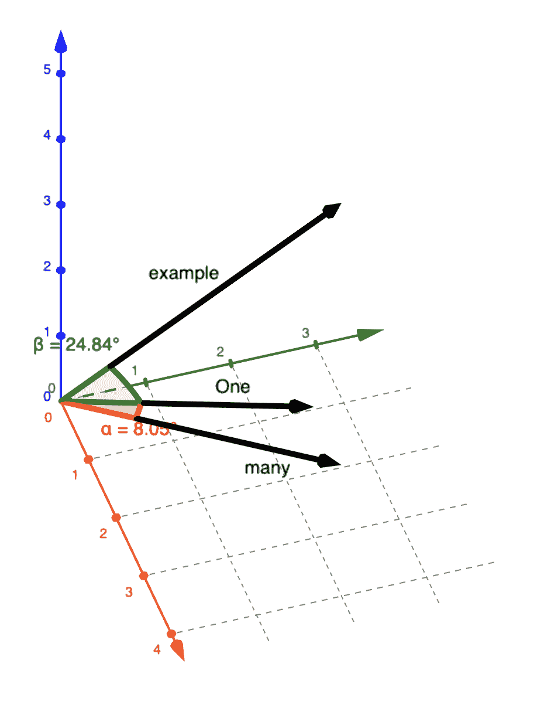
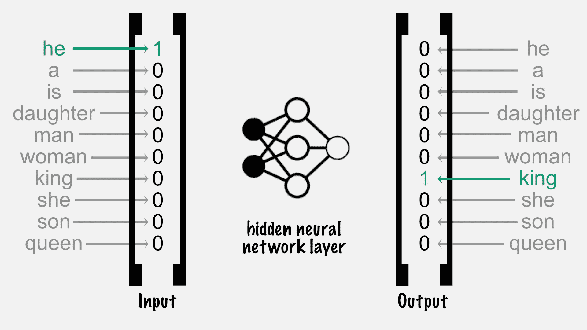
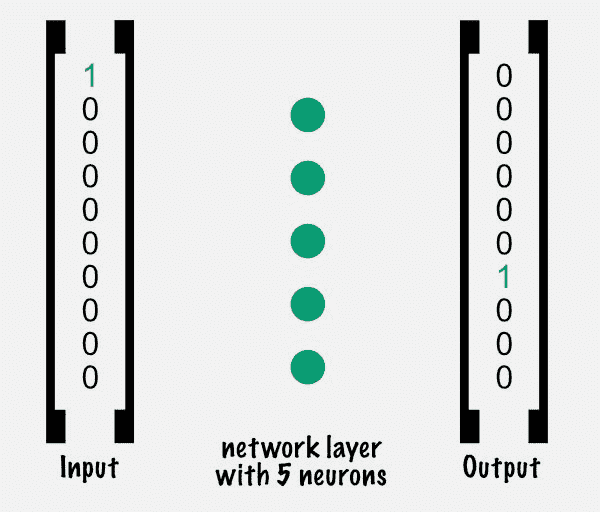
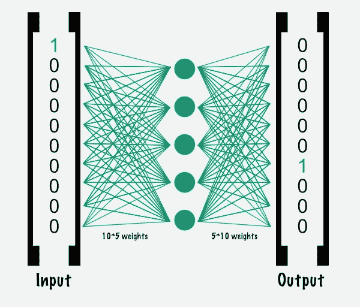
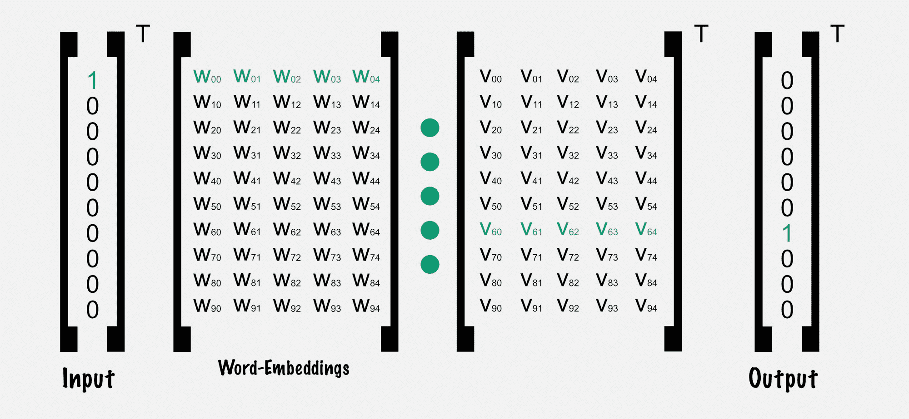
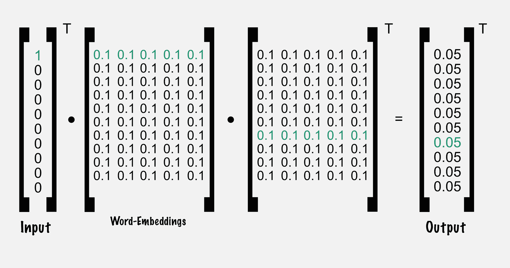
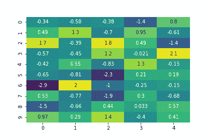

# 去神秘化的文本分类:单词嵌入导论

> 原文：<https://www.freecodecamp.org/news/demystify-state-of-the-art-text-classification-word-embeddings/>

自然语言处理(NLP)是一门始于 20 世纪 50 年代的古老科学。1954 年乔治城的 IBM 实验向全自动文本翻译迈出了一大步。使用简单的重新排序和替换规则，超过 60 个俄语句子被翻译成英语。

NLP 中的统计革命始于 20 世纪 80 年代末。不是手工制作一套规则，而是使用统计方法分析大量文本来创建规则。针对给定的输入数据计算不同的指标，并使用决策树或[基于回归的计算](https://en.wikipedia.org/wiki/Regression_analysis)进行预测。

如今，复杂的指标被更全面的方法所取代，这些方法可以产生更好的结果，也更容易维护。

这篇文章是关于单词嵌入的，这是我的面向程序员的机器学习系列的第一部分(后面还有更多！).

## 什么是单词嵌入？

传统上，在自然语言处理(NLP)中，单词被替换为唯一的 id 来进行计算。让我们举下面的例子:


这种方法的缺点是需要创建一个庞大的单词列表，并给每个元素一个惟一的 ID。除了使用唯一的数字进行计算，您还可以使用向量来表示它们的含义，即所谓的单词嵌入:


在这个例子中，每个单词由一个向量表示。向量的长度可以不同。向量越大，它可以存储的上下文信息就越多。此外，计算成本随着向量大小的增加而增加。

向量的元素计数也称为向量维数。在上面的例子中，单词 **example** 用(4 ^ 2 ^ 6)表示，其中 4 是第一维的值，2 是第二维的值，6 是第三维的值。

在更复杂的例子中，可能有超过 100 个维度可以编码大量信息。比如:

*   性别，
*   种族，
*   年龄，
*   词的类型

将被存储。

一个像**一个**这样的词是一个像**许多**这样的数量的词。因此，这两个向量与用法更不同的单词相比更接近。



简化，如果向量相似，那么单词在用法上有相似性。对于其他 NLP 任务，这有很多优点，因为与具有成千上万个 id 的庞大字典相比，可以基于只有几百个参数的单个向量进行计算。

此外，如果有以前从未见过的未知单词，这也没有问题。你只需要一个好的单词嵌入的新词，计算是类似的。这同样适用于其他语言。这基本上是单词嵌入的魔力，它使快速学习、多语言处理等等成为可能。

## 单词嵌入的创建

将单词嵌入的概念扩展到其他领域非常流行。例如，电影租赁平台可以创建电影嵌入，并根据向量而不是电影 id 进行计算。

### 但是如何创建这样的嵌入呢？

有各种各样的技术，但它们都遵循一个关键的方面，即单词的含义是根据其用法来定义的。

假设我们有一组句子:

```
text_for_training = [
    'he is a king',
    'she is a queen',
    'he is a man',
    'she is a woman',
    'she is a daughter',
    'he is a son'
]
```

句子包含 10 个独特的单词，我们希望为每个单词创建一个单词嵌入。

```
{
    0: 'he',
    1: 'a',
    2: 'is',
    3: 'daughter',
    4: 'man',
    5: 'woman',
    6: 'king',
    7: 'she',
    8: 'son',
    9: 'queen'
}
```

有各种方法可以用来创建嵌入。让我们挑选一种最常用的方法，叫做 [word2vec](https://en.wikipedia.org/wiki/Word2vec) 。这项技术背后的概念是使用一个非常简单的神经网络来创建代表单词含义的向量。

先说目标词“**王**”。它用在阳性代词“**和**”的上下文中。这个例子中的上下文意味着它只是同一个句子的一部分。同样适用于“**女王**”和“**她**”。对更通用的单词采用同样的方法也是有意义的。单词“**他**”可以是目标单词，“**是**”是上下文单词。


如果我们对每个组合都这样做，我们实际上可以得到简单的单词嵌入。更全面的方法增加了更多的复杂性和计算，但它们都是基于这种方法。

为了使用一个单词作为神经网络的输入，我们需要一个向量。我们可以通过在字典中单词的位置放置 1 来解码一个单词在向量中的唯一 id，并保持其他所有索引为 0。这被称为独热编码向量:



在输入和输出之间是一个单独的隐藏层。这一层包含的元素和单词 embedding 应该包含的一样多。单词嵌入的元素越多，它们能存储的信息就越多。

你可能会想，那就把它做得非常大。但是我们必须考虑到，我们需要为每个现有的单词存储一个嵌入，这很快就会增加需要存储的数据量。此外，更大的嵌入意味着使用嵌入的神经网络要进行更多的计算。

在我们的例子中，我们将只使用 5 作为嵌入向量大小。



神经网络的神奇之处在于各层之间被称为权重的东西。它们在层之间存储信息，其中上一层的每个节点都与下一层的每个节点相连接。



层之间的每个连接都是所谓的参数。这些参数包含了神经网络的重要信息。100 个参数——50 个在输入层和隐藏层之间，50 个在隐藏层和输出层之间——用随机值初始化，并通过训练模型来调整。



在这个例子中，为了简单起见，它们都用 0.1 初始化。让我们来看一个培训回合的例子，也称为新纪元:



在神经网络的计算结束时，我们没有得到我们的预期输出，该输出告诉我们对于给定的上下文“ **he** ”，目标是“ **king** ”。

结果与预期结果之间的差异称为网络误差。通过找到更好的参数值，我们可以调整神经网络来预测未来的上下文输入，以提供预期的目标输出。

在我们试图找到更好的参数使我们更接近我们期望的输出向量之后，我们的层连接的内容将会改变。一旦网络对不同的目标和上下文单词进行了正确的预测，错误就被最小化。输入层和隐藏层之间的权重将包含我们所有的单词嵌入。



你可以在这里找到带有可执行代码[的完整示例。您可以创建一个副本，并使用它，如果你按下“在操场上打开。”](https://colab.research.google.com/drive/1KN4wi_dcTAp55FqqFs-ashf4NqdIlYy0)

如果你对笔记本不熟悉，它相当简单:它可以从上到下阅读，你可以直接点击和编辑 Python 代码。

通过按“SHIFT+Enter”，您可以执行代码片段。确保从顶部开始，点击第一个剪贴，按 SHIFT+Enter，等一会儿再按 SHIFT+Enter，等等。

## 结论

简而言之，单词嵌入用于以更灵活的方式创建神经网络。它们可以使用具有特定任务的神经网络来构建，例如针对给定的上下文单词预测目标单词。层之间的权重是随时间调整的参数。瞧，这是你的单词嵌入。

我希望你喜欢这篇文章。如果你喜欢它，觉得需要一轮掌声，[在 Twitter 上关注我](https://twitter.com/sesigl)。我在易贝·克莱南泽根公司工作，这是全球最大的机密公司之一。顺便说一下，[我们正在招聘](https://jobs.ebayclassifiedsgroup.com/ebay-kleinanzeigen)！

快乐 AI 探索:)

参考

*   维基百科自然语言处理
    [https://en.wikipedia.org/wiki/Natural_language_processing](https://en.wikipedia.org/wiki/Natural_language_processing)
*   fastai
    [https://arxiv.org/abs/1801.06146](https://arxiv.org/abs/1801.06146)的联合创始人写了一篇关于文本分类的伟大论文
*   谷歌最先进的自然语言处理方法
    [https://arxiv.org/abs/1810.04805](https://arxiv.org/abs/1810.04805)