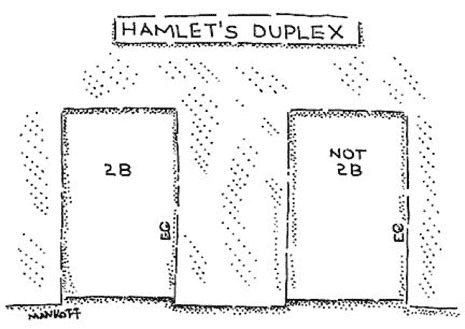

# 揭开动态编程的神秘面纱

> 原文：<https://www.freecodecamp.org/news/demystifying-dynamic-programming-3efafb8d4296/>

阿兰·卡夫卡

# 揭开动态编程的神秘面纱

#### 如何构造和编写动态规划算法


也许你在准备编码面试的时候听说过。也许你在一门算法课程中挣扎过。也许你正在努力学习如何自己编写代码，并且在学习过程中被告知理解动态编程很重要。使用动态编程(DP)来编写算法就像人们担心的那样重要。

谁能责怪那些逃避它的人呢？动态编程似乎令人生畏，因为它教得不好。许多教程关注的是结果——*解释*算法，而不是过程——*找到*算法。这鼓励记忆，而不是理解。

在今年的算法课上，我拼凑了自己解决需要动态编程的问题的过程。其中一部分来自我的算法教授(应该归功于他！)，以及我自己对动态编程算法的剖析。

但是在我分享我的过程之前，让我们从基础开始。究竟什么是动态编程？

### 定义的动态规划

动态编程相当于**将优化问题**分解成更简单的子问题，并且**存储每个子问题**的解决方案，使得每个子问题只被解决一次。

老实说，这个定义可能并不完全有意义，直到你看到一个子问题的例子。没关系，下一节会讲到。

我希望传达的是，DP 是一种用于优化问题的有用技术，即那些在给定一定约束条件下寻求最大或最小解的问题，因为它会检查所有可能的子问题，并且从不重新计算任何子问题的解。这保证了正确性和效率，我们不能说大多数技术用于解决或近似算法。仅此一点就使 DP 变得特别。

在接下来的两节中，我将解释什么是子问题，然后解释为什么存储解决方案——一种被称为**记忆**的技术——在动态编程中很重要。

### 子问题子问题子问题子问题

子问题是原始问题的较小版本。事实上，子问题通常看起来像是原问题的改写版本。如果表述正确，子问题相互建立，以获得原问题的解决方案。

为了让您更好地理解这是如何工作的，让我们在一个示例动态编程问题中找到子问题。

假设你回到了 20 世纪 50 年代，在一台 IBM-650 电脑上工作。你知道这意味着什么——打孔卡！你的工作是男人，或者女人，IBM-650 一天。给你一个自然数 *n* 的打孔卡。每个穿孔卡 *i* 必须在某个预定的开始时间 *s_i* 运行，并在某个预定的结束时间 *f_i* 停止运行。IBM-650 上一次只能运行一张穿孔卡。根据对公司的重要程度，每个穿孔卡还有一个相关的值。

**问题**:作为 IBM-650 的负责人，你必须确定最大化所有穿孔卡运行总价值的穿孔卡最佳时间表。

因为我将在本文中详细介绍这个例子，所以现在我只拿它的子问题来逗你:

**子问题**:打卡 *i* 到 *n* 的最大值时间表，打卡按开始时间排序。

请注意子问题是如何将原始问题分解成构建解决方案的组件的。有了子问题，就可以找到打孔卡 *n-1* 到 *n* 的最大值计划表，然后打孔卡 *n-2* 到 *n* 的最大值计划表，以此类推。通过找到每一个子问题的解决方案，你就可以解决原始问题本身:穿孔卡片 1 到 *n* 的最大价值表。由于子问题看起来像原问题，所以可以用子问题来解决原问题。

在动态编程中，在你解决了每个子问题之后，你必须记忆或者存储它。让我们在下一节中找出原因。

### 用斐波那契数激发记忆

当被告知要实现一个算法来计算任意给定数字的[斐波那契值](https://www.mathsisfun.com/numbers/fibonacci-sequence.html)时，你会怎么做？我认识的大多数人会选择类似 Python 中的[递归算法](https://softwareengineering.stackexchange.com/questions/25052/in-plain-english-what-is-recursion):

```
def fibonacciVal(n):  if n == 0:    return 0  elif n == 1:    return 1  else:    return fibonacciVal(n-1) + fibonacciVal(n-2)
```

这个算法实现了它的目的，但是代价是巨大的。例如，让我们看看这个算法为了求解 n = 5(缩写为 F(5))必须计算什么:

```
F(5)                      /      \                                     /        \                  /          \               F(4)          F(3)            /       \        /   \          F(3)     F(2)     F(2)  F(1)         /   \     /  \     /   \       F(2) F(1) F(1) F(0) F(1) F(0)       /  \     F(1) F(0)
```

上面的树表示为了找到 n = 5 的斐波那契值必须进行的每一次计算。注意 n = 2 的子问题是如何求解**三次的。**对于一个相对较小的例子(n = 5)，这是大量重复和浪费的计算！

如果不是计算 n = 2 的斐波那契值三次，而是创建一个算法来计算一次，存储它的值，并在 n = 2 的每个后续事件中访问存储的斐波那契值，会怎么样？这正是记忆的作用。

考虑到这一点，我编写了一个针对斐波那契值问题的动态编程解决方案:

```
def fibonacciVal(n):  memo = [0] * (n+1)  memo[0], memo[1] = 0, 1  for i in range(2, n+1):    memo[i] = memo[i-1] + memo[i-2]  return memo[n]
```

注意返回值的解是如何来自 memoization 数组 memo[ ]，它是由 for 循环迭代填充的。所谓“迭代地”，我的意思是 memo[2]在 memo[3]、memo[4]、…、memo[*n*之前被计算和存储。因为 memo[ ]是按此顺序填写的，所以每个子问题(n = 3)的解可以通过其前面的子问题(n = 2 和 n = 1)的解来解决，因为这些值在更早的时候已经存储在 memo[ ]中。

记忆意味着不需要重新计算，这是一个更有效的算法。因此，记忆化确保了动态规划是有效的，但是选择正确的子问题保证了动态规划经历所有的可能性，以便找到最好的一个。

既然我们已经解决了记忆和子问题，是时候学习动态编程过程了。系好安全带。

### 我的动态编程过程

#### 第一步:用文字识别子问题。

太多时候，程序员会在之前开始写代码*，批判性地思考手头的问题。不太好。在你触摸键盘之前激活你的大脑的一个策略是使用单词，英语或其他，来描述你在原始问题中发现的子问题。*

如果你正在解决一个需要动态编程的问题，拿起一张纸，想想解决这个问题所需要的信息。考虑到这一点，写出子问题。

例如，在打孔卡问题中，我陈述了子问题可以写成“打孔卡的最大值时间表 *i* 到 *n* ，这样打孔卡按照开始时间排序。”我发现了这个子问题，因为我意识到，为了确定穿孔卡 1 到 *n* 的最大值计划，以便穿孔卡按开始时间排序，我需要找到以下子问题的答案:

*   穿孔卡 *n-1* 到 *n* 的最大值时间表，以便穿孔卡按开始时间排序
*   穿孔卡 *n-2* 到 *n* 的最大值时间表，以便穿孔卡按开始时间排序
*   穿孔卡 *n-3* 到 *n* 的最大值时间表，以便穿孔卡按开始时间排序
*   (等等)
*   穿孔卡 2 到 *n* 的最大值时间表，以便穿孔卡按开始时间排序

如果你能发现一个子问题，它建立在以前的子问题的基础上来解决手头的问题，那么你就在正确的轨道上。

#### 第二步:写出子问题，作为一个重复的数学决策。

一旦你用文字确定了一个子问题，就该用数学方法把它写出来了。为什么？嗯，你找到的数学上的**循环、**或重复的决定，最终会成为你的代码。此外，写出子问题从数学上审查你的子问题从第一步的话。如果你的数学第一步的子题很难编码，那么可能是错题！

每当我试图寻找重复时，我都会问自己两个问题:

*   我在每一步做什么决定？
*   如果我的算法在步骤 *i* ，它需要什么信息来决定在步骤 *i+1* 做什么？(有时:如果我的算法在第 *i* 步，它需要什么信息来决定在第 *i-1* 步做什么？)

让我们回到打卡问题，问这些问题。

我在每一步都要做什么决定？如前所述，假设穿孔卡按开始时间排序。对于到目前为止与计划兼容的每个穿孔卡(其开始时间在当前正在运行的穿孔卡的结束时间之后)，算法必须在两个选项之间进行选择:运行或不运行穿孔卡。



This dynamic program chooses between two options at each step, just like our dear friend Hamlet!

**如果我的算法在步骤** ***i* ，那么在步骤** ***i+1* 需要什么信息来决定做什么？**为了在两个选项之间做出决定，算法需要知道订单中的下一个兼容穿孔卡。给定穿孔卡 *p* 的下一个兼容穿孔卡是穿孔卡 *q* ，使得 *s_q* (穿孔卡 *q* 的预定开始时间)发生在 *f_p* (穿孔卡 *p* 的预定结束时间)之后，并且使 *s_q* 和 *f_p* 之间的差异最小化。放弃数学家的说法，下一个兼容的穿孔卡是在当前穿孔卡完成运行后开始时间最早的一个。

**如果我的算法在步骤** ***i* ，那么在步骤** ***i-1* 中需要什么信息来决定做什么？**算法需要了解未来的决策:为穿孔卡 *i* 到 *n* 所做的决策，以便决定运行或不运行穿孔卡 *i-1* 。

既然我们已经回答了这些问题，也许你已经开始在脑海中形成一个反复出现的数学决策。如果没有，也没关系，当你接触到更多的动态编程问题时，编写递归就变得更容易了。

事不宜迟，以下是我们的重现:

```
OPT(i) = max(v_i + OPT(next[i]), OPT(i+1))
```

这个数学循环需要一些解释，特别是对于那些以前没有写过的人。我使用 OPT( *i* )来表示打孔卡 *i* 到 *n* 的最大值时间表，这样打孔卡按照开始时间排序。听起来很熟悉，对吧？OPT()是第一步中的子问题。

为了确定 OPT( *i* )的值，我们考虑两个选项，并且我们想要取这些选项的*最大值*以便满足我们的目标:所有穿孔卡的*最大值*值表。一旦我们在步骤 *i* 选择了给出最大结果的选项，我们就将其值记为 OPT( *i* )。

运行或不运行穿孔卡 *i* 这两个选项在数学上表示如下:

```
v_i + OPT(next[i])
```

该子句表示运行穿孔卡 *i* 的决定。它将运行穿孔卡 *i* 获得的值加到 OPT(下一个[ *i* ])上，其中下一个[ *i* 表示穿孔卡 *i* 之后的下一个兼容穿孔卡。OPT(next[ *i* ])给出了下一个[ *i* ]到 *n* 穿孔卡的最大值时间表，以便穿孔卡按开始时间排序。将这两个值相加产生打孔卡 *i* 到 *n* 的最大值表，这样如果打孔卡 *i* 运行，打孔卡将按开始时间排序。

```
OPT(i+1)
```

相反，该子句表示不运行穿孔卡 *i* 的决定。如果打孔卡 *i* 未运行，则不会获得其值。OPT( *i+1* )给出穿孔卡 *i+1* 到 *n* 的最大值时间表，以便穿孔卡按开始时间排序。因此，OPT( *i+1* )给出打孔卡 *i* 到 *n* 的最大值时间表，这样，如果打孔卡 *i* 没有运行，打孔卡将按开始时间排序。

这样，在穿孔卡问题的每一步做出的决定都被数学编码，以反映步骤 1 中的子问题。

#### 步骤 3:使用步骤 1 和 2 解决原始问题。

在第一步中，我们用文字写下了打孔卡问题的子问题。在第二步中，我们写下了一个对应于这些子问题的循环数学决策。我们如何用这些信息解决原来的问题？

```
OPT(1)
```

就这么简单。由于我们在步骤 1 中发现的子问题是穿孔卡 *i* 到 *n* 的最大值时间表，因此穿孔卡按开始时间排序，我们可以将原问题的解决方案写成穿孔卡 1 到 *n* 的最大值时间表，从而穿孔卡按开始时间排序。由于步骤 1 和 2 是齐头并进的，所以原问题也可以写成 OPT(1)。

#### 步骤 4:确定记忆数组的维数和填充方向。

你是否发现第三步看似简单？看起来的确如此。你可能会想，如果 OPT(1)依赖于 OPT(2)、OPT(next[1])等等，它怎么可能是我们动态程序的解呢？

您注意到 OPT(1)依赖于 OPT(2)的解决方案，这是正确的。这直接来自步骤 2:

```
OPT(1) = max(v_1 + OPT(next[1]), OPT(2))
```

但这不是一个决定性的问题。回想一下斐波那契记忆的例子。为了找到 *n* = 5 的斐波那契值，该算法依赖于这样一个事实，即 *n* = 4、 *n* = 3、 *n* = 2、 *n* = 1 和 *n* = 0 的斐波那契值已经被记忆。如果我们按照正确的顺序填写我们的记忆表，OPT(1)对其他子问题的依赖没有什么大不了的。

我们如何确定填充记忆表的正确方向？在穿孔卡问题中，由于我们知道 OPT(1)依赖于 OPT(2)和 OPT(next[1])的解，并且由于排序的原因，穿孔卡 2 和 next[1]的开始时间在穿孔卡 1 之后，因此我们可以推断，我们需要从 OPT( *n* )到 OPT(1)来填充我们的记忆表。

我们如何确定这个记忆数组的维数？这里有一个技巧:数组的维数等于 OPT()所依赖的变量的数量和大小。在 punchcard 问题中，我们有 OPT( *i* )，这意味着 OPT()只依赖于变量 *i* ，它代表 punchcard 的编号。这表明我们记忆阵列将是一维的，且它的大小将是 *n* ，因为总共有 *n* 个穿孔卡。

如果我们知道 *n* = 5，那么我们的记忆数组可能是这样的:

```
memo = [OPT(1), OPT(2), OPT(3), OPT(4), OPT(5)]
```

然而，因为许多编程语言[从 0](https://en.wikipedia.org/wiki/Zero-based_numbering) 开始索引数组，所以创建这个记忆数组使其索引与穿孔卡编号对齐可能更方便:

```
memo = [0, OPT(1), OPT(2), OPT(3), OPT(4), OPT(5)]
```

#### 第五步:编码！

为了编写我们的动态程序，我们将步骤 2-4 放在一起。编写动态程序所需的唯一新信息是一个基本情况，你可以在修改算法时找到它。

穿孔卡问题的动态程序如下所示:

```
def punchcardSchedule(n, values, next): # Initialize memoization array - Step 4  memo = [0] * (n+1)   # Set base case  memo[n] = values[n]   # Build memoization table from n to 1 - Step 2  for i in range(n-1, 0, -1):    memo[i] = max(v_i + memo[next[i]], memo[i+1])  # Return solution to original problem OPT(1) - Step 3  return memo[1]
```

祝贺你写了你的第一个动态程序！现在你已经湿了你的脚，我将带你通过一个不同类型的动态程序。

### 选择的悖论:多重选择 DP 示例


Unrelated to DP, but an accurate depiction of how harrowing multi-option decisions can be.

尽管前面的动态规划示例有两个选项决策—运行或不运行穿孔卡—但有些问题需要在每一步做出决策之前考虑多个选项。

是时候举个新例子了。

假设你正在向 *n* 个顾客出售友谊手镯，该产品的价值会单调增加。这意味着产品的价格{ *p_1* ，…， *p_n* }使得如果客户 *j* 在客户 *i* 之后，则 *p_i ≤ p_j* 。这些 *n* 客户有值{ *v_1* ，…， *v_n* }。当且仅当 *p_i* ≤ *v_i* 时，给定客户 *i* 将购买价格为 *p_i* 的友谊手镯；否则，从该客户获得的收入为 0。假设价格是自然数。

问题:你必须找到一套价格，确保你从出售友谊手镯中获得最大可能的收益。

在查看我对第 1 步和第 2 步的解决方案之前，花点时间想想你可能如何解决这个问题。

#### 第一步:用文字识别子问题。

**子问题**:从客户 *i* 到 *n* 获得的最大收益，使得客户 *i-1* 的价格被设置为 *q* 。

我发现了这个子问题，因为我意识到要确定客户 1 到 *n* 的最大收入，我需要找到以下子问题的答案:

*   从客户 *n-1* 到 *n* 获得的最大收益，这样客户 *n-2* 的价格被设置为 *q* 。
*   从客户 *n-2* 到 *n* 获得的最大收益，这样客户 *n-3* 的价格被设置为 *q* 。
*   (等等)

注意，我在子问题中引入了第二个变量 *q* 。我这样做是因为，为了解决每个子问题，我需要知道在子问题之前我为客户*设定的价格。变量 *q* 确保价格集合的单调性，变量 *i* 跟踪当前客户。*

#### 第二步:写出子问题，作为一个重复的数学决策。

每当我试图寻找重复时，我都会问自己两个问题:

*   我在每一步做什么决定？
*   如果我的算法在步骤 *i* ，它需要什么信息来决定在步骤 *i+1* 做什么？(有时:如果我的算法在第 *i* 步，它需要什么信息来决定在第 *i-1* 步做什么？)

让我们回到友情手环问题，问这些问题。

我在每一步都要做什么决定？我决定以什么价格向当前顾客出售我的友谊手镯。由于价格必须是自然数，我知道我应该为客户 *i* 设定价格，范围从 *q —* 为客户 *i-1 —* 到 *v_i* —客户 *i* 购买友谊手镯的最高价格。

**如果我的算法在步骤** ***i* ，那么在步骤** ***i+1* 需要什么信息来决定做什么？**我的算法需要知道为客户 *i* 设置的价格和客户 *i+1* 的值，以便决定以什么自然数为客户 *i+1* 设置价格。

有了这些知识，我可以用数学方法写出递归:

```
OPT(i,q) = max~([Revenue(v_i, a) + OPT(i+1, a)])
```

```
such that max~ finds the maximum over all a in the range q ≤ a ≤ v_i
```

同样，这个数学循环需要一些解释。由于客户 *i-1* 的价格是 *q* ，对于客户 *i* ，价格 *a* 要么保持整数 *q* 不变，要么变为介于 *q+1* 和 *v_i* 之间的某个整数。为了计算总收入，我们将来自客户 *i* 的收入加到从客户 *i+1* 到 *n* 获得的最大收入上，这样客户 *i* 的价格被设置为 *a* 。

换句话说，为了使总收入最大化，该算法必须通过检查在 *q* 和 *v_i* 之间的所有可能价格来为顾客 *i* 找到最优价格。如果 *v_i* ≤ *q* ，那么价格 *a* 必须保持在 *q* 。

#### 其他步骤呢？

完成步骤 1 和 2 是动态编程中最困难的部分。作为一个练习，我建议你自己完成第 3、4 和 5 步来检查你的理解。

### 动态程序的运行时分析

现在是写算法的有趣部分:运行时分析。我将在整个讨论中使用 big-O 符号。如果你还不熟悉 big-O，我建议你在这里阅读一下。

通常，动态程序的运行时由以下特征组成:

*   预处理
*   for 循环运行了多少次
*   在一次 for 循环迭代中运行递归需要多长时间
*   后处理

总体而言，运行时采用以下形式:

```
Pre-processing + Loop * Recurrence + Post-processing
```

让我们对穿孔卡问题进行一次运行时分析，以熟悉动态程序的 big-O。以下是穿孔卡问题动态程序:

```
def punchcardSchedule(n, values, next): # Initialize memoization array - Step 4  memo = [0] * (n+1)   # Set base case  memo[n] = values[n]   # Build memoization table from n to 1 - Step 2  for i in range(n-1, 0, -1):    memo[i] = max(v_i + memo[next[i]], memo[i+1])  # Return solution to original problem OPT(1) - Step 3  return memo[1]
```

让我们分解它的运行时:

*   预处理:在这里，这意味着建立记忆数组。O( *n* )。
*   for 循环运行多少次:O( *n* )。
*   在一次 for 循环迭代中运行递归需要多少时间:递归需要恒定的时间来运行，因为它在每次迭代中在两个选项之间做出决定。O(1)。
*   后期处理:此处无！O(1)。

穿孔卡问题动态程序的整体运行时间为 O(*n*)O(*n*)* O(1)+O(1)，或者，简单来说，O( *n* )。

### 你做到了！

好了，就这样——你离成为动态编程向导又近了一步！


Margaret Hamilton: one of the many programming wizards in our history!

最后一条智慧:**坚持练习动态编程**。不管这些算法看起来多么令人沮丧，重复编写动态程序会使子问题和递归更自然地出现在你面前。这里有一个[经典动态编程问题](https://www.quora.com/What-are-the-top-10-most-popular-dynamic-programming-problems-among-interviewers)的众包列表供你尝试。

所以，带着你新学到的动态编程知识去参加面试、上课和生活吧！

非常感谢史蒂文·贝内特、T2、克莱尔·杜兰德和 T4 对这篇文章的校对。感谢[Hartline](https://sites.northwestern.edu/hartline/)教授让我对动态编程如此兴奋，以至于我写了很多关于它的文章。

喜欢你读的东西吗？通过喜欢和分享这篇文章来传播爱。有想法或问题吗？请在 Twitter 上或下面的评论中联系我。