# 通过逻辑回归揭示梯度下降和反向传播的图像…

> 原文：<https://www.freecodecamp.org/news/demystifying-gradient-descent-and-backpropagation-via-logistic-regression-based-image-classification-9b5526c2ed46/>

作者:Sachin Malhotra

深度学习的炒作是什么，神经网络是什么？

本质上，

*   你有一个建筑
*   数以百万计的参数在数以千计的神经元之间共享
*   堆叠成多层
*   将各种激活功能应用于层的逻辑或输出
*   和用随机权重初始化馈送的归一化输入。
*   训练批次的损失定义了通过网络的反向传播步骤的梯度
*   和随机梯度下降法来训练模型并使损失最小化，直到收敛。

如果你喜欢这篇文章，一定要传播一些爱，尽可能多地分享。今天就到这里吧，伙计们。希望你读得开心。？。

你不会真的认为我会在对所有这些技术术语如此混乱的情况下结束这篇文章吧？？

如果你对这些东西一无所知，前面提到的所有术语对你来说都是希腊语，不要担心。因为在这篇文章结束时，我确信你将能够训练它，测试它，使它更密集，因此更聪明。

我们现在开始吧，好吗？

### 目录

*   [年代久远的机器学习算法](https://medium.com/p/9b5526c2ed46#f0d4)
*   [数据准备](https://medium.com/p/9b5526c2ed46#3f91)
*   [向神经元问好](https://medium.com/p/9b5526c2ed46#76ab)
*   [正向传播](https://medium.com/p/9b5526c2ed46#8c44)
*   [实现！](https://medium.com/p/9b5526c2ed46#ccfc)
*   [图像展平](https://medium.com/p/9b5526c2ed46#b04c)
*   [乙状结肠激活功能](https://medium.com/p/9b5526c2ed46#f084)
*   [喂网？](https://medium.com/p/9b5526c2ed46#e062)
*   [我们来预测一下？](https://medium.com/p/9b5526c2ed46#7e0a)
*   让我们下山吧？
*   [进入:损失函数？](https://medium.com/p/9b5526c2ed46#e0b7)
*   [最小化损失函数⬇️](https://medium.com/p/9b5526c2ed46#1cdb)
*   [梯度下降总是找到全局极小值吗？](https://medium.com/p/9b5526c2ed46#2893)
*   [让渐变流✈️](https://medium.com/p/9b5526c2ed46#5df3)
*   [我们来编码吧！？](https://medium.com/p/9b5526c2ed46#e389)

### 古老的机器学习算法

让我们从一个非常简短(嗯，太简短)的介绍开始，介绍机器学习中最古老的算法之一的本质。

在 2D 图上取几个点，画一条尽可能适合它们的线。您刚才所做的是从几个输入值对(x)和输出值对(y)的示例中归纳出一个可以将任何输入值映射到输出值的通用函数。

这就是所谓的**线性回归**，这是一种从一些输入输出对外推一般函数的极好技术。

这就是为什么拥有这样一种技术是美妙的:在现实世界中有无数的函数，对于这些函数来说，找到方程是一项非常困难的任务，但收集输入输出对相对来说是一项比较容易的任务——例如，将一个口语单词的录音输入映射到该口语单词的输出的函数。[【来源】](http://www.andreykurenkov.com/writing/ai/a-brief-history-of-neural-nets-and-deep-learning/)

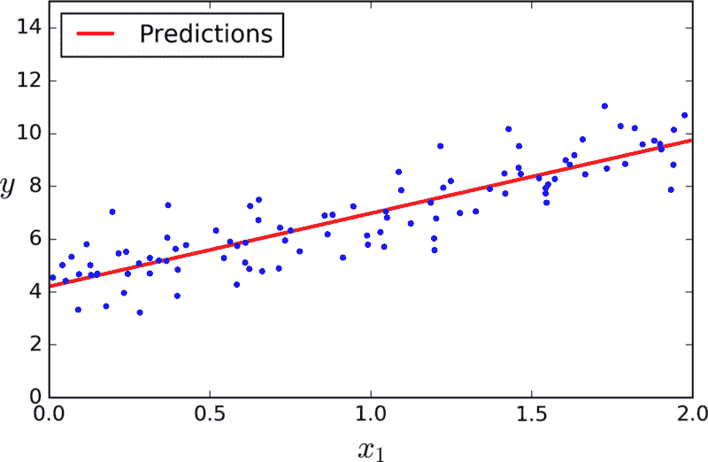

Source: [https://www.oreilly.com/](https://www.oreilly.com/)

然而，众所周知，我们可以拥有不可线性分离的数据。数据点可能过于分散，以至于我们无法用一个线性函数来近似地将给定的 X 值映射到给定的 Y 值。给定一组手工制作的特征，线性回归算法非常适合诸如房价预测之类的事情。但是它不能拟合只能用非线性函数近似的数据。

如果问题陈述是**图像分类**的问题陈述呢？假设给我们一个图像作为输入，如果给定的图像是一只猫或一只狗，我们希望我们的模型输出。

我们如何着手解决这个问题？

让我们从最基本的步骤开始，即**为我们的模型**准备数据集。我们将在文章的后面解释这个模型的工作原理。

建立任何机器学习模型的最重要的方面之一是准备数据集，并以模型能够处理并从中得出有意义的结论的合适格式提供数据集。

### 数据准备

我们将在此任务中查看的数据集是在 [Kaggle](http://kaggle.com/c/dogs-vs-cats) 上提供的猫与狗的二元分类任务。假设您已经下载了数据集，让我们将数据集加载到内存中，并查看数据集中的一些可用图像。

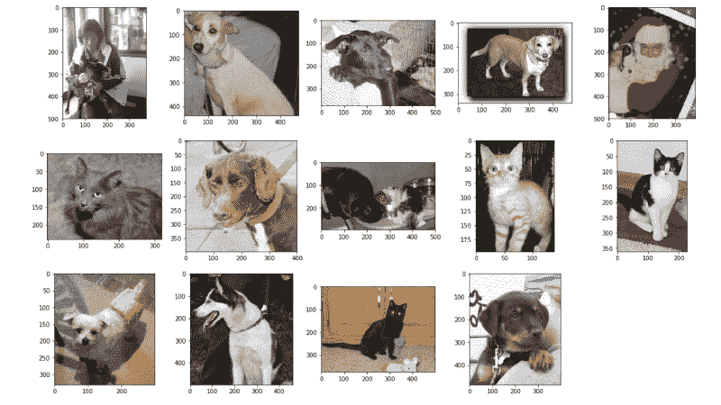

数据以 zip 文件的形式提供，解压缩后，您应该有两个不同的文件夹。一个给`train`，另一个给`test`。`test`数据将不会在整篇文章中使用，因为我们使用了训练数据集本身。`train`文件夹有大约 25000 张图片，我们将它们分成一个更小的`train`数据集，其中有 2000 张图片，另一个数据集将作为我们的验证集，包含 5000 张图片。

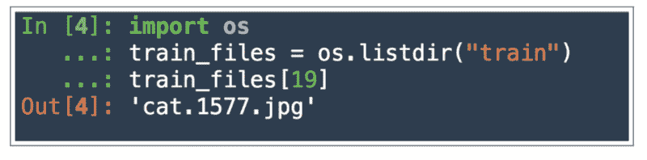

我们只是在训练数据集中打印了一个随机文件的名称。文件名的类型为

```
cat.<some number>.jpg or dog.<some number>.jpg
```

我们的模型将不能简单地处理 jpg 文件。在我们的模型可以处理数据并做出预测之前，必须对这些图像做一些工作，以将数据转换成某种格式。

#### 作为矩阵表示的图像

正如前面所讨论的，在训练我们的模型时，我们会将某个图像输入到模型中，模型会给我们一个关于它认为该图像是猫还是狗的预测。该模型可能正确，也可能不正确，如果不正确，那么我们必须“训练”它，以便它能够更好地分类猫和狗的图像。

计算机以`M-by-N-by-3`数据阵列的形式存储图像数据，该数据阵列为每个单独的像素定义了红色、绿色和蓝色分量。因此，如果我们以多维矩阵的形式查看图像数据，我们会看到一个维度为`(M, N, 3)`的 3D 矩阵，每个值都是 0–255 范围内的整数值，其中 0 代表黑色，1 代表白色，其余的值组成不同的颜色分量阴影。

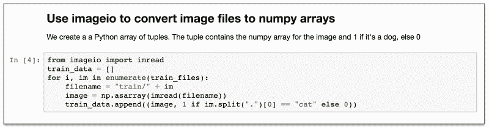

Imageio 是一个 Python 库，它提供了一个简单的接口来读写各种图像数据，包括动画图像、视频、体积数据和科学格式。

Numpy 是 Python 中的一个科学计算包，是 Python 中最基本的库之一，用于高效地操作和处理高维数组。关于 Numpy 和我们如何处理图像数据的详细介绍，请阅读[的这篇](http://cs231n.github.io/python-numpy-tutorial/#numpy)。

我强烈推荐你阅读上面提到的 Numpy 教程。我们将在前面讨论的模型编程主要是在 Numpy 中完成的，对 Numpy 中的操作有一个基本的了解是非常重要的。

#### 调整图像大小

接下来，让我们看看这些图像的 numpy 数组是什么样子的，也就是说，这些数组的维数是多少。

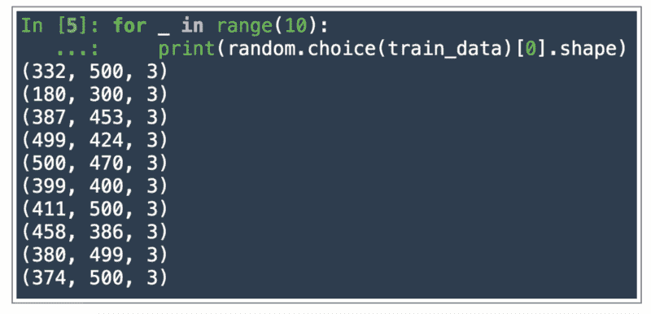

Printing out 10 random image sizes from the data we have.

我们从我们创建的列表`train_data`中随机选择一些图像，并打印形状，即代表该图像的 numpy 数组的尺寸。

正如我们所见，图像大小差异很大。在最基本的层面上，每个像素将是我们的图像分类模型的输入，如果每个图像的像素数量不同，那么模型将无法处理它们。

在将图像输入模型之前，我们需要它们的大小相同。

如果你隐约知道任何机器学习或深度学习模型，你一定听说过被称为模型的`parameters`的东西。

参数是我们的模型所学习的关键信息，在我们开始训练模型之前，模型的参数数量必须固定。

正是因为这个原因，我们不能输入动态大小的图像。我们需要确定图像的大小，从而确定每个图像中的像素数量，这样我们就可以定义每个示例的模型输入数量，并确定模型的总可学习参数。

如果你不知道这些`parameters`实际上是什么，不要担心。我们很快就会找到他们。

现在，重要的是**我们需要所有的图像都有相同的尺寸**以便我们的模型处理它们。

让我们看看有多少图片的尺寸超过了`64-by-64`的高度和宽度。


99% of the images can be scaled down to 64-by-64–3 images.

我们可以清楚地看到，99%的图像尺寸大于`64-by-64`，因此，我们可以将它们缩小到尺寸`64-by-64-by-3`。

这种方法只是一种天真的方法，我采用它来制作相同大小的所有图像，我觉得缩小不会像放大那样降低图像的质量，因为将非常小的图像放大到大的图像通常会导致像素化效果，并且会使模型的学习更加困难。还有，这个维度`64-by-64-by-3`不是一个神奇的数字，只是我去用的东西。

就图像数据而言，有更好的数据预处理方法，但这对于本文来说已经足够了。

让我们继续，看看将调整所有这些图像的大小并将数据分成`train`和`test`组的代码。我们使用 80/20 分割法分割给定数据，即 80%的数据将用于训练我们的数据，剩余的 20%将用于测试我们的模型，以查看未知数据的最终性能。

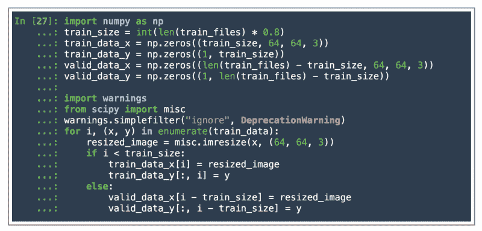

The train_files contain tuples of the form (image_matrix, 1 or 0 depending on if it’s a cat or dog)

为了调整图像的大小，我们使用了`[scipy.misc.imresize](https://docs.scipy.org/doc/scipy/reference/generated/scipy.misc.imresize.html)`方法。这种方法将很快被否决，所以最好检查一下其他的[选项](https://datascience.stackexchange.com/questions/5224/how-to-prepare-augment-images-for-neural-network)来调整图像大小，而不是依赖这个来进行你未来的冒险。

这里没有提供`scipy.misc.imresize`的内部工作的原因是因为它与本文的范围无关。

现在我们已经调整了图像的大小，让我们看看我们的训练和测试数据现在是什么样子，即它们的最终尺寸是什么。

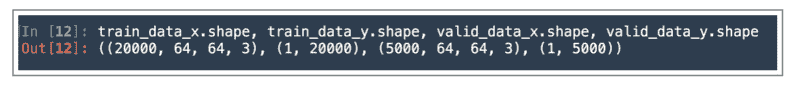

Final dimensions of our training and test data that can directly be fed into our model.

#### 保存日期

现在我们已经处理了我们的数据，并且有了我们需要的格式，我们最终可以将它保存到两个单独的文件中，即`train.npz`和`valid.npz`。

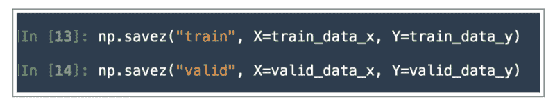

Saving the training and testing data to files.

`train.npz`的文件大小为 1.8G，`valid.npz`的文件大小为 469M。这些文件包含我们之前创建的 numpy 数组，分别用于表示我们的训练集和测试集。

注意，在这个数据集中，我们没有使用任何花哨的深度学习架构。我们只是在试验和展示单个神经元的力量。

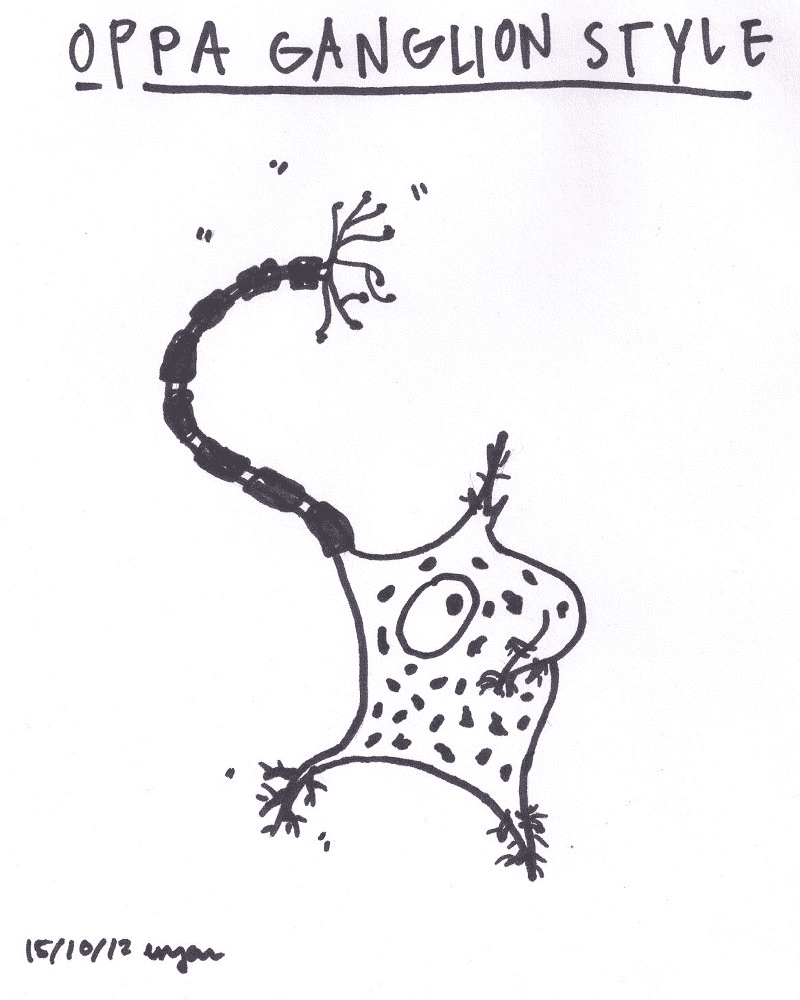

Source: [https://i1.wp.com/blog.eyewire.org](https://i1.wp.com/blog.eyewire.org)

因此，我们没有任何要优化的超参数的广泛列表，因此我们没有将原始数据分为培训、开发和测试。就本文而言，我们只需要一个训练集和一个开发集(或者一个验证集或者一个测试集)。)因此，我们在本文中交替使用术语验证数据或测试数据。

注意:训练数据、开发或验证数据以及测试数据的目的彼此之间有很大的不同。这三者都非常重要

*   每当我们解决任何有大量数据和复杂架构的大问题时
*   我们真正关心的是在一个独立的隐藏测试集上的最终结果。

我们这里没有这样的要求。因此没有单独的测试集。

请看一下 Jupyter 笔记本，它将我们上面讨论的所有内容汇集在一起，供您查看。

### 向神经元问好

既然我们已经对数据进行了预处理，并且采用了二元分类模型能够理解的格式，那么请允许我们介绍模型的核心组件:神经元！

神经元是我们的分类模型的核心计算元素。本质上，神经元对输入数据执行一些被称为`forward propagation`的操作。

让我们看看这意味着什么。

### 正向传播

现在让我们假设我们的图像由单个实数值表示。我们将该单个实数值称为表示输入图像的特征。

如果您一直关注并完成了数据准备步骤，您会知道我们总共有大约`12288`个特征来表示一幅图像。

如果您不确定我们是如何得出这个数字的，请不要担心，我们稍后会谈到这个问题。

**提示:**其 64 * 64 * 3？

在我们继续之前，让我们看看贯穿本文的符号

*   小斜体字母代表标量值
*   小型粗体非斜体字母代表一个向量，即行矩阵`1-by-m`或列矩阵`m-by-1`。
*   大写斜体字母表示给定维数的矩阵，例如`m-by-n`。

让`*x*`表示代表我们的输入图像的单个特征。

现在，作为向前传播的第一步，

> 神经元对输入特征应用线性变换

不要被这个**线性变换**的意思吓到。它本质上意味着我们有下图所示的形式。

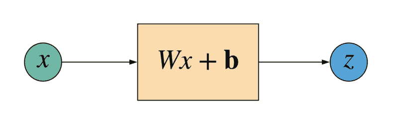

因此，给定输入特征 *x，*神经元给我们以下输出:

```
Wx + b
```

请注意上面图表和代码部分中符号的使用。所以，`*x*` 代表一个标量值，`*W*` 代表一个矩阵， **b** 代表一个向量。

矩阵 *W* 被称为`weight`矩阵，向量 **b** 被称为`bias`向量。

还记得我们之前提到的模型参数吗？在这种情况下，权重矩阵和偏差向量将代表我们模型的参数。

**注意:**尽管我们将`*W*` 称为我们的权重“矩阵”，将`**b**` 称为我们的偏差“向量”，但在上述场景中，由于我们只有一个输入特征，因此我们只需要一个`1-by-1`矩阵用于`*W*` 和一个标量值用于`**b**` 。

这就是输入要素的线性变换的全部内容。我们将它乘以一个`weight`并加上一个`bias`得到一个转换后的值。

### *Wx* + **b** = 94.233，现在怎么办？

那只是我想出来的一个随机数值。我想说的是，我们现在应该如何对待这种转变后的价值？

请记住，我们的最终目标是训练一个能够区分狗和猫的模型。

由于这是一个二元分类任务(只有 2 个类供模型选择)，我们需要某种阈值，比如说`Θ`。当神经元产生一个大于`Θ`的值时，它将输出其中一个类，否则它的输出将是第二个类。

很难得到线性变换给出的值的范围。该值可以是从`-inf`到`+inf`范围内的任何值。这完全取决于输入要素的取值范围以及权重和偏差的初始化方式。

因此，我们肯定需要确定神经元输出值的范围。

我们如何做到这一点？

通过对神经元的线性输出应用所谓的**激活**函数。

激活函数将简单地固定神经元输出值的范围，以便我们可以决定神经元分类输出的阈值`Θ`。

**注意:**激活函数不仅仅是简单地固定神经元的输出值，但是同样，对于本文的范围来说，知道这么多已经足够了。

我们将在这里考虑的激活函数被称为 Sigmoid 函数。

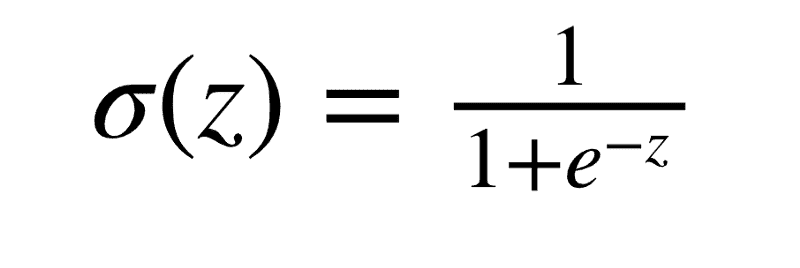

The Sigmoid activation function

这是 sigmoid 函数的图表。


Source: [https://www.vaetas.cz/img/machine-learning/sigmoid-function.png](https://www.vaetas.cz/img/machine-learning/sigmoid-function.png)

从上图可以看出，sigmoid 激活函数将所谓的`non linear transformation`应用于输入值，sigmoid 函数的范围是一组在[0，1]之间的实数值。

因此，作为正向传播过程的一部分，整个神经元本质上执行两种操作。

1.  对输入要素应用线性变换，然后
2.  在先前的输出之上应用非线性变换(在我们的例子中是 sigmoid ),以给出最终的输出。

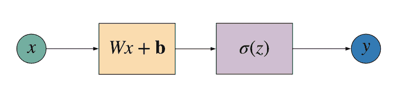

Complete set of transformations by a neuron.

### 但是等等。你说每个图像有 12288 个特征？

我们解释了上面的计算，假设输入图像将由单个特征值表示。

然而，这不是我们正在处理的情况。还记得我们在开始前向传播之前已经经历了整个数据准备步骤，并且我们已经将我们的图像重新缩放到`64-by-64-by-3`？

这意味着我们处理过的图像本质上总共由`12288`个像素组成。

对于我们的用例以及我们正在处理的简单分类模型，我们将简单地将每个像素视为一个输入特征。

这意味着对于我们的模型，每个图像有`12288`个输入特征。现在让我们看看这给我们的模型参数(即权重和偏差)的维度带来的变化。

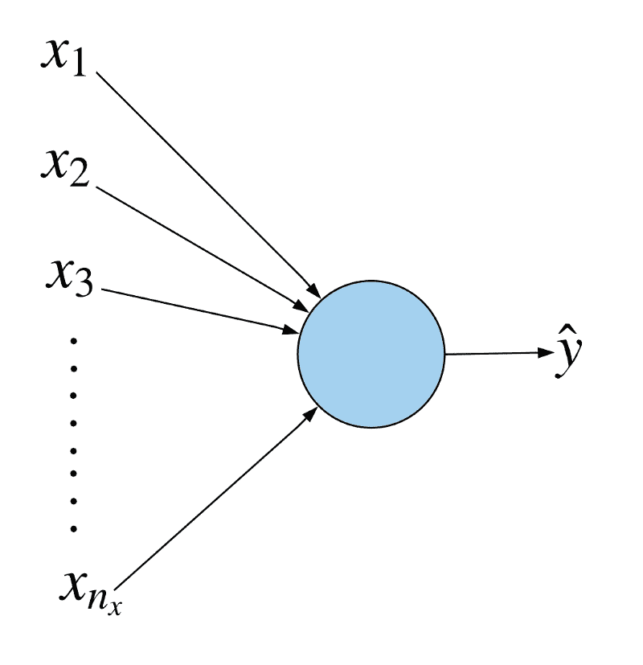

让我们用`nx`来表示我们的图像的输入特征的数量。对于我们在这里考虑的图像，输入特征的数量将是 12288。

因此，我们将给定图像的所有这些输入特征输入到我们的神经元，它对每个特征进行线性变换，组合结果以给出标量值，然后对该值应用 sigmoid 变换，最终给出`y^`，即该图像所属的类别。

请注意，该模型只是输出一个介于 0 和 1 之间的真实值。

**解释是，如果值是> 0.5，它是一只狗/猫(无论你想怎么考虑)，对于所有其他值，它是另一个类别** ss。

我们可以将输入特征表示为`column vector`或`row vector`。所以，我们可以有一个形状为`12288-by-1)`或`1-by-12288`的向量。让我们考虑前者，即我们将有一个列向量。

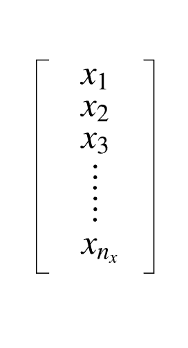

Column vector representing the input features.

我们将在下一节讨论编码部分。将`64-by-64-by-3`图像像素值转换为`12288-by-1`并不是一项巨大的任务。

之前，我们已经解释了单个输入要素的正向传播过程。我们为单个输入要素设定了一个权重值，然后我们还为其设定了一个偏差值，这两个值结合在一起就形成了我们想要的线性变换。

以类似的方式，我们将需要输入特征的每个的权重值**。我们不需要为每个特性设置单独的偏差值。单个值，即标量值在这里就足够了。**

线性变换现在变成:

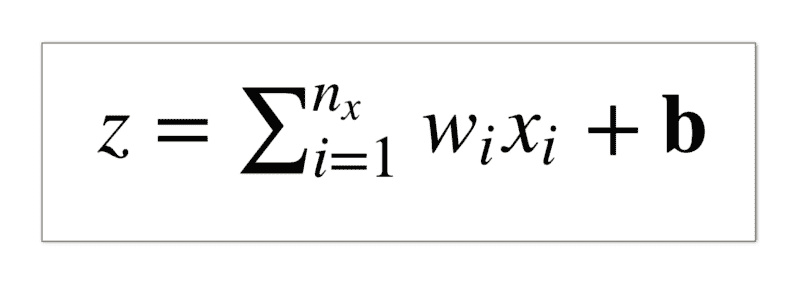

Linear transformation of the image’s input features

对于每个输入要素，我们将其乘以相应的权重值，然后将所有这些值相加，最后添加偏差项以获得线性变换值。

下一步保持不变:我们在`*z*` 上应用 sigmoid 激活函数，我们获得一个介于 0 和 1 之间的实数值(记住，这是 sigmoid 函数的范围)。

### 实施！

这是有趣的部分。？

我们将分多步进行。就像我们最终的 Jupyter 笔记本一样。

#### 检索数据

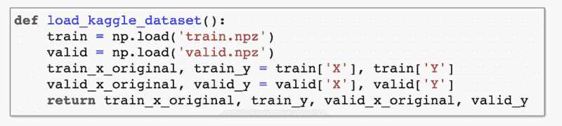

Obtaining the data from the saved files

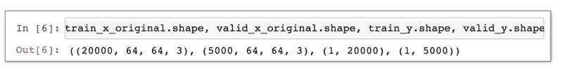

Shapes of the individual numpy arrays

还记得我们将预处理后的数据保存在两个文件中吗，即`train.npz`和`valid.npz`？我们将从它们加载数据，并返回 4 个不同的 numpy 数组。

1.  `train_x_original`以原始尺寸表示我们的训练集图像。
2.  `train_y`包含每个图像的相应标签。提醒你一下，`1`代表猫，`0`代表狗。
3.  `valid_x_original`与`train_x_original`相同，只是它包含验证数据集，即我们将评估模型性能的数据集。
4.  `valid_y`是验证集图像的标签。

现在，我们已经将整个训练和验证数据集加载到内存中。如前所述，我们希望将给定图像的所有特征转换成列向量或行向量。因此，对于每个图像，我们想要一个`12288-by-1`向量或一个`1-by-12288`向量。让我们看看如何从我们最初的维度图像`64-by-64-by-3`中做到这一点。

#### 图像展平

在 NumPy 中，这是一个非常简单的任务。给定一个尺寸为`64-by-64-by-3`的图像，我们只是想将它的形状改为`12288-by-1`或`1-by-12288`。

因为我们有一大堆图像，它可能是`12288-by-m`或`m-by-12288`，其中`m`代表我们将输入模型的图像总数，即训练样本的数量。

让我们看一下这个转换的代码。

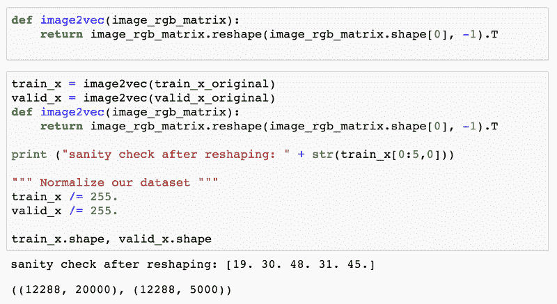

因此，我们定义了一个名为`image2vec`的函数，它基本上以原始维度接收我们的整个数据集，即训练集的`20000-by-64-by-64-by-3`和验证集的`5000-by-64-by-64-by-3`，并返回展平矩阵。

你注意到这几行代码了吗？

```
# Normalize our datasettrain_x /= 255.valid_x /= 255.
```

别担心，我们将在下一节讨论激活函数时讨论这个问题。

回到我们得到的矩阵，它是一个 2D 矩阵，第一个索引现在是我们每个图像中的特征数量，即`12288`，第二个索引表示数据集中的样本数量，这些样本在训练集中是`20000`，在验证集中是`5000`。

你可能会问为什么这种特殊的数据排列方式？为什么我们不选择转置版本，即`m-by-12288`，其中`m`代表数据集中的样本数量。

我想说我们本可以做到的。图像特征的排列没有任何问题。但是，在接下来的部分中，当我们开始对整个数据集进行前向传播时，您会注意到以这种方式排列数据的优势。

从视觉上看，最终的展平矩阵如下所示

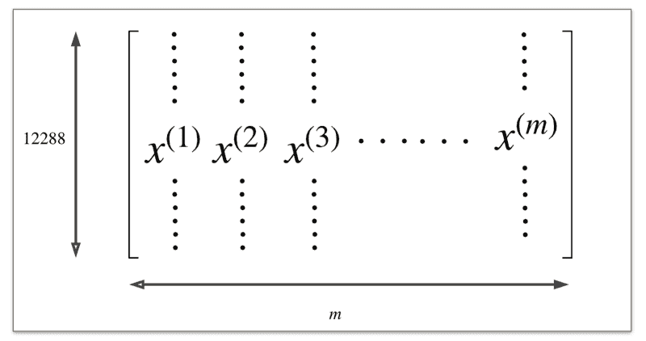

The flattened matrix representing our images.

#### Sigmoid 激活函数

下一步是定义我们的激活函数。我们在前面的章节中描述了我们使用的非线性激活函数，该函数是 sigmoid 函数。

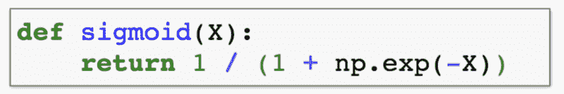

再次供你参考，这是 sigmoid 函数的样子。

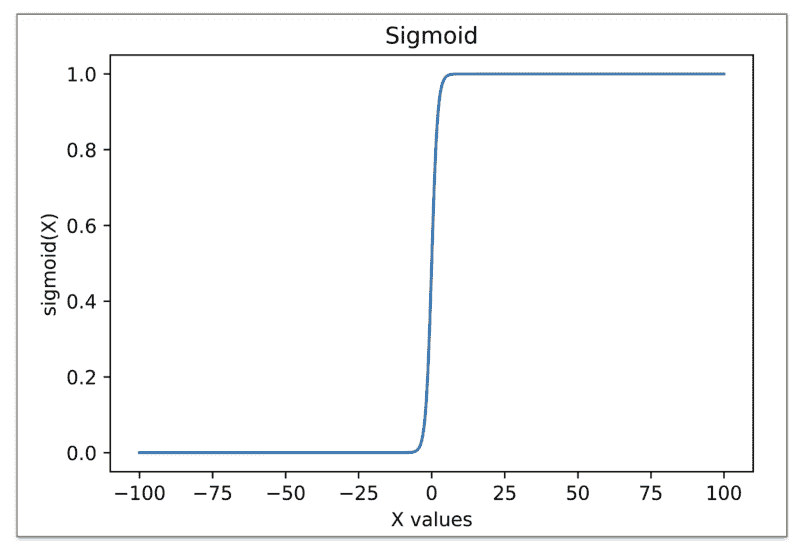

Sigmoid function.

如前所述以及从上图中可以看出，

> 对于非常高或非常低的值，sigmoid 给出的值为 0

因此，我们需要标准化我们的特征值，这样我们就不会有太大或太小的值。让我用一个例子来解释一下。

想想下面这些猫的图片。

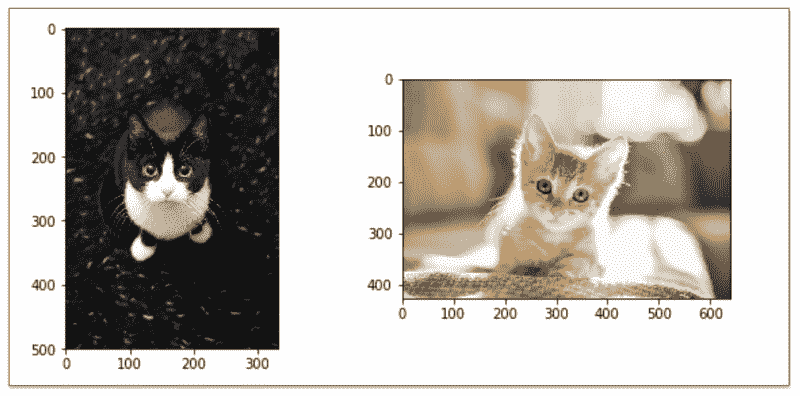

正如我们之前看到的，我们必须调整图像的大小，使它们达到固定的大小。因此，让我们在将它们调整到`64-by-64-by-3`后再来看这两幅图像。

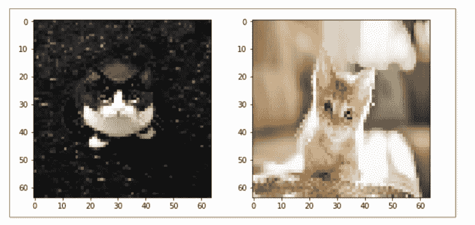

Resized images.

每个图像本质上是由不同强度的 RGB 值组成的 3D 矩阵，并且本质上它们代表给定图像的颜色。

像素值(R、G 或 B)的范围从`0-255`开始，其中`0`代表全黑，`255`代表白色。在这之间有数百万种可能的颜色组合。

让我们来看看这些图像的一些像素值。

```
[137, 109, 70, 144, 117, 74, 154, 126, 79, 160, 132, 85, 165, 137, 90, 167, 139, 92, 178, 150, 103, 186, 159, 112, 194, 170, 126, 204, 182, 143, 210, 187, 153, 212, 188, 150, 213, 185, 138, 214, 178, 121, 213, 170, 100, 212, 164, 85, 213, 158, 73, 212, 155, 65, 215, 159, 72, 215, 161, 75, 217, 162, 80, 216, 165, 82, 214, 166, 84, 212, 166, 84, 221, 187, 124, 226, 205, 160, 232, 212, 175, 236, 216, 179, 242, 220, 183, 242, 219, 177, 243, 215, 167, 243, 213, 162, 242, 213, 163, 240]
```

这是彩色图像的 100 个连续像素值。这里重要的是每个像素的值。这些值非常高，正如人们从上面显示的棕色猫的彩色图像中所期望的那样。

```
[37, 37, 37, 37, 37, 37, 29, 29, 29, 35, 35, 35, 39, 39, 39, 36, 36, 36, 38, 38, 38, 88, 88, 88, 43, 43, 43, 34, 34, 34, 33, 33, 33, 52, 52, 52, 48, 48, 48, 40, 40, 40, 33, 33, 33, 33, 33, 33, 39, 39, 39, 52, 52, 52, 36, 36, 36, 34, 34, 34, 46, 46, 46, 31, 31, 31, 34, 34, 34, 33, 33, 33, 35, 35, 35, 34, 34, 34, 26, 26, 26, 32, 32, 32, 25, 25, 25, 29, 29, 29, 23, 23, 23, 44, 44, 44, 43, 43, 43, 20]
```

相同的像素值组，但对于黑色图像是上面显示的那些。我们可以清楚地看到，这些值比彩色图像对应的值小得多。

原因很简单，因为黑色和白色像素值是 0 附近的值，自然地，与 255 附近的彩色值(即白色)相比，它们更小。

我们已经讨论了给定图像的输入特征的线性变换。出于修订的目的，这里是我们用于具有多个特征的图像的线性变换公式。


Linear transformation of the image’s input features

对于相同的权重矩阵`*W*` 和偏置向量`**b**` ，彩色图像的特征值会比黑白图像的特征值高很多，对吧？

线性变换后，我们应用 sigmoid 激活函数，我们之前看到，sigmoid 激活函数在非常高或非常低的值下输出为 0。

因此，自然地，有色猫的乙状结肠激活几乎总是以 0 结束。

有人可能会问，我们如何解决这个问题？

我们**正常化。**

```
# Normalize our datasettrain_x /= 255.valid_x /= 255.
```

这将使所有输入特征都在范围`[0,1]`内，因此所有这些值，无论是彩色图像还是黑白图像，都有一个共同的范围。我们称这个过程为图像特征的规范化。

现在，我们已经处理了所有的数据并将其加载到内存中，唯一剩下的就是我们的网络，即由我们的单个神经元供电的网络。现在，我们将迭代地将所有这些图像输入到我们的模型中，模型最终将学习(以一定的准确度)将图像分类为狗或猫。

总结一下我们到目前为止所做的一切:

*   处理我们可用的图像数据集，我们将`.jpg`图像转换为我们的模型能够处理的 numpy 数组。
*   然后，我们将两个文件`train.npz`和`valid.npz`加载到内存中，并展平图像，这样我们就有了`12288-by-1`而不是`64-by-64-by-3`图像。我们实际上是在一个专栏中介绍了该图像的所有功能。
*   我们定义了 sigmoid 激活函数，最后，
*   我们讨论了为什么规范化数据是一个必要的步骤。

现在，我们准备继续开发我们的模型。

### 喂网？

最后，我们可以将整个图像输入到我们的网络中，并从中获得一些预测。让我们看看如何首先对单个图像进行处理，然后对整个数据集进行处理。

#### 单一图像

如前所述，每个图像现在都有一个维度`12288-by-1`，当我们提到“图像”这个词时，我们真正的意思是该图像的特征已经被展平并被归一化。

对于线性变换，我们需要一个权重矩阵和一个偏差向量。我们知道，模型最终将给出 0 和 1 之间的单个值，即在应用 sigmoid 激活函数之后，因此，偏差只是一个标量。

本质上，我们需要这个操作:

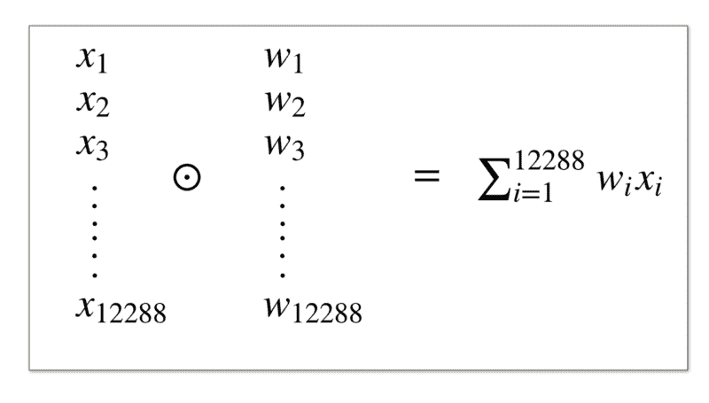

这就是所谓的**哈达玛乘积**或者两个向量的元素乘积，然后我们对所有这些值求和。

代替这样做，我们可以使用权重矩阵和特征向量的点积。

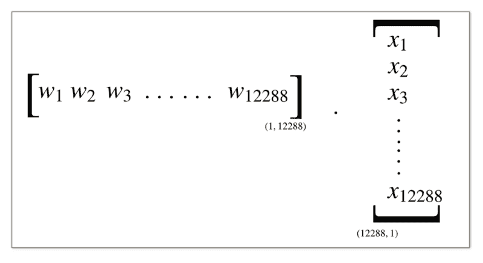

权重矩阵和表示输入图像特征的向量的点积将给出我们正在寻找的总和值。

我们可以将权重矩阵定义为行向量，并使用以下等式

```
W . x + b
```

或者我们可以将权重矩阵作为列向量，然后对其进行转置，得到点积。

```
transpose(W) . x + b
```

在这里，我们将采用第二种选择。我们认为对于单个图像，权重矩阵具有形状`12288-by-1`。出于线性变换的目的，在用特征向量做点积之前，我们做权重矩阵的转置。

现在，只需要知道我们希望每幅图像的权重值以单列的形式排列，而不是以行的形式。这将使计算变得更加容易。

输入特性也是如此。我们想把它们排成列。

#### 在整个训练集中进食

我们真的不想一次处理一个图像，因为那样太慢了。

理想情况下，我们希望对我们的模型(即这里的单个神经元)进行一次正向传递，并获得整个训练集的预测。一气呵成！

我们可以使用前面提到的等式来实现这一点:

```
transpose(W) . X + b
```

**注:** `*X*`表示包含我们所有图像的矩阵，`**x**` 表示单个图像向量。

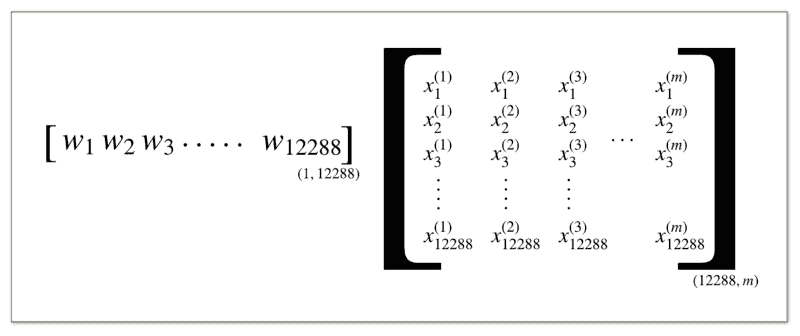

Linear transformation on the entire dataset of m examples all in one go.

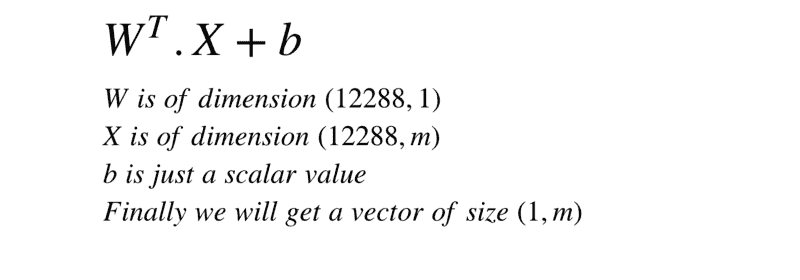

Dimensions of matrices involved in our calculations

注意等式中符号的变化。我们早先使用小的`**x**`来表示单个图像的特征。

由于我们正在一次处理我们的整个数据集，我们转移到描述整个数据集的大写斜体`*X*`符号，如上图所述，它的维度为`12288-by-m`，其中每个图像包含 12288 个特征，总共有`m`个示例。

让我们看看这个的代码。

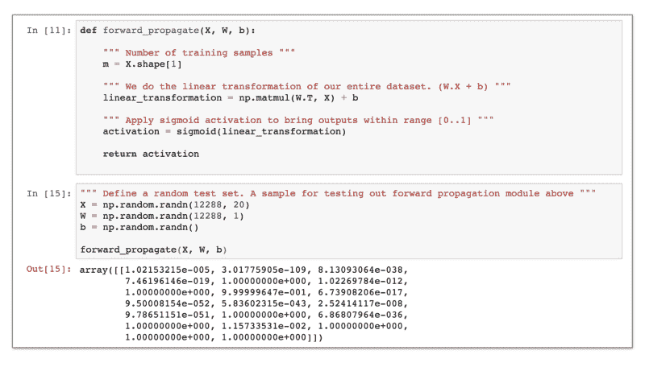

函数`forward_propagate`是为我们做所有繁重工作的函数。我们首先得到例子的数量(这里没有用到，但我只是为了说明第二维表示例子的数量)。

根据我们到目前为止所讨论的算法，我们首先对代表我们的图像数据集的输入矩阵`*X*`进行线性变换。

然后，我们对结果矩阵(在这种情况下是向量)应用 sigmoid 激活函数，并从神经元获得非线性应用激活值。

我们在这里初始化了一个随机数据集，并用它来显示上面的`forward_propagate`函数的运行和输出。

### 我们来预测一下？

现在，我们已经定义了神经元的结构和它对图像特征执行的计算，我们准备用我们的模型进行一些实际的分类。

但是，在我们这样做之前，我们需要有某种度量来看看我们的模型在测试集上的实际表现如何。

让我们看看计算模型预测的测试集准确性的代码。这是我们将在本文的剩余部分使用的核心指标，用于评估我们的模型的性能。

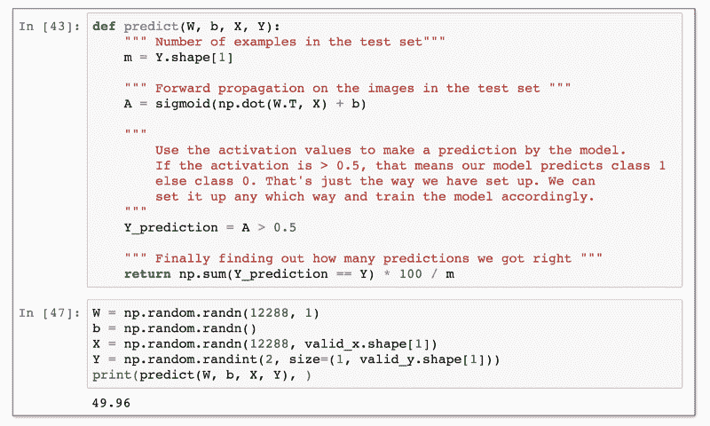

这是用于测量我们的模型在猫和狗的分类任务(测试集)中有多准确的代码。事实证明，一个未经训练的模型——我们随机初始化了权重和偏差值——达到了近 50%的准确率。这是随机抽样所期望的，因为这是一个 2 级分类任务。如果我们从[0，1]中随机选择一个值，有 50%的概率我们会得到正确的值。

现在的问题是，我们如何改进我们的模型？

我们可以通过一种叫做**梯度下降的算法来改进我们的模型。**让我们继续，看看这个算法是怎么回事，以及它如何帮助我们改进我们的模型。

### 我们下山吧？

梯度下降算法的要点是最小化成本函数，以便我们基于神经元的模型能够学习。

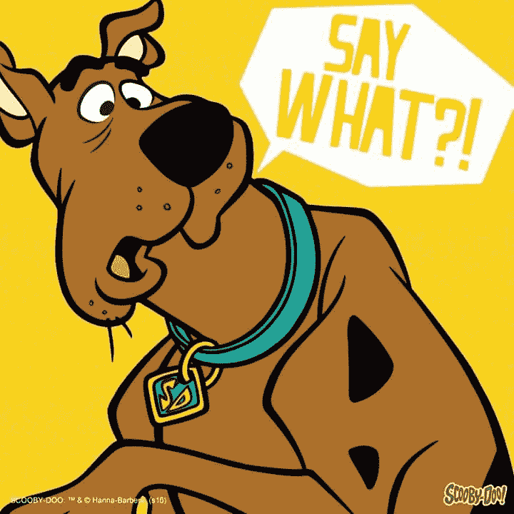

Source: [https://www.pinterest.com/pin/409053578638780708/?lp=true](https://www.pinterest.com/pin/409053578638780708/?lp=true)

这个**成本函数是什么？**

我们的模型**也学习？**

我知道。在使用梯度下降算法之前，我们需要先回顾一下这些术语。所以让我们先看看什么是成本函数。

### 我们模特的表现？

为了量化我们的模型在分类任务中做得有多好，我们有精确度的度量。我们的最终目标是提高模型的分类精度。

控制我们的模型有多精确的唯一一组参数是基于神经元的模型的权重和偏差。

这是因为这些值负责转换输入图像特征，并帮助我们预测图像是狗还是猫。

我们之前看到，一组随机的权重和偏差值可以在测试集上实现 50%的分类准确率。这意味着该模型有很大的改进空间。

从数学上讲，我们应该能够以这样一种方式修改权重和偏差值，以使模型的准确性达到最佳。我们需要这些完美的权重和偏差集，以便模型能够正确地对测试集中的所有图像进行分类。

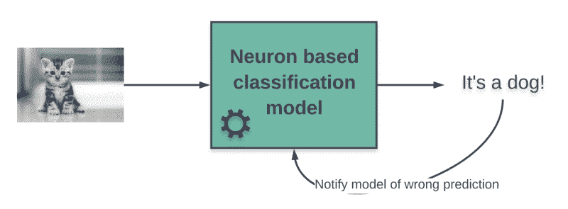

我们必须更新模型的参数，以使它在分类任务的测试数据上获得尽可能高的精度。


考虑如下所示的数学函数:

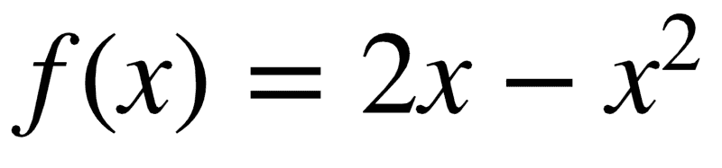

在微积分中，任何函数的最大值(或最小值)都可以通过下式求出

*   **取函数**的一阶微分，等于 0。用这种方法找到的点可以是最大值点或最小值点。
*   然后，我们将这些值(我们刚刚找到的点)代入函数的**二阶微分**中，如果该值为正，即> 0，则该点代表局部最小值点，否则代表局部最大值点。

如果我们查看仅包含两个特征的图像的基于神经元的模型的计算图，它看起来如下:

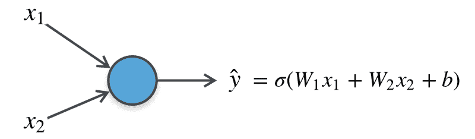

我们获得的最终值是一个介于 0 和 1 之间的真实值，我们用它来预测图像是狗还是猫。

不时地考虑模型对同一图像的下列输出值:

```
0.520.560.610.670.780.800.850.890.98
```

通过查看同一图像的这些值，您可以说模型越来越确信该图像确实属于猫的图像(在当前实现中，值> 0.5 被认为是猫图像)。如何组织数据完全取决于你自己。)

尽管模型对其预测越来越有信心，但实际预测仍然保持不变，即一只猫。对于所有这些值，模型的最终预测是一只猫。

这清楚地突出了一个**大问题，即使用精度作为优化措施来获得模型的最佳权重和偏差**。

我们可以建立一个以精度为中心的函数模型，并把它最大化作为我们的目标。

正确分类的图像数量不是网络中权重和偏差的平滑函数。在大多数情况下，**对权重和偏差进行小的改变根本不会导致正确分类的训练图像的数量发生任何变化**。

这使得很难找出如何改变权重和偏差来提高性能。从我们刚刚考虑的例子中可以看出这一点。

尽管模型越来越有信心，但准确性永远不会反映这一点，因此，模型不会做出这些改进。

相反，我们需要的是**一个代理测量值**,它在某种程度上与精确度相关，并且也是权重和偏差的平滑函数。

### 输入:损失函数？

这是一个二元分类问题。这意味着我们只能有两个类:0 或 1。

在一个完美的世界中，我们的模型将为狗输出 0，为猫输出 1，在这种情况下，它将达到 100%的准确性。对狗输出 0 或对猫输出 1 将显示模型对其预测的 100%信心。这在真实世界的场景中不会真的发生(至少现在不会！).

我们未经训练的模型一开始听起来会很困惑。它对自己的预测不会太有把握。所以它可能会输出像`0.51, 0.49, 0.514`这样的值。仅仅因为阈值被越过，预测**恰好是正确的**，并不意味着我们的模型训练有素。

从上面的讨论中，有一点是清楚的。我们需要缩小模型输出和实际输出之间的差距。差距越小，我们的模型预测就越好，预测时就越有信心。

这意味着对于狗的图像，我们希望我们的模型输出尽可能接近 0 的值，同样，对于猫的图像，我们希望我们的模型输出尽可能接近 1 的值。

这就是我们模型中所谓的**损失/错误/成本**术语。损失函数本质上模拟了我们的模型预测和实际输出之间的差异。理想情况下，如果这两个值相差很远，损失值或误差值应该较高。同样，如果这两个值比较接近，误差值应该较低。

给定这种误差函数作为我们模型性能的代理，我们想要**最小化这个损失函数*的值。***

你怎么想呢?损失函数仅仅是`y_predicted`和`y_actual`之间的距离吗？

```
|y_actual - y_predicted|
```

我们可以对每个图像使用这个特定的损失函数，然后对整个训练集的损失进行平均，从而得到整个时期的损失。但是，这真的不合适。

下面的损失函数被称为**绝对差值损失函数**

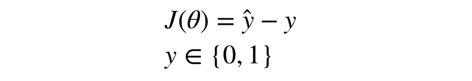

然而，考虑最小化这个损失函数是有意义的，因为在一天结束时，这就是我们之前讨论过的让我们了解我们的模型表现如何的精确代理测量。

**J** 是损失函数的常用符号，**θ**表示模型的参数，即权重和偏差。

但是，我们没有把这个函数作为损失函数，而是考虑下面的函数。

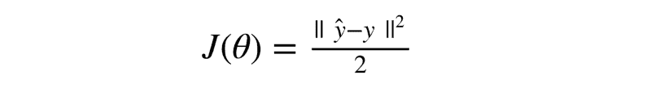

这个函数被称为**平方误差**。我们简单地取了实际输出`y` 和预测输出`y^`之间的差值，我们将该值平方(因此得名)并除以 2。

更喜欢平方误差而不是绝对误差的一个主要原因是平方误差是**处处可微的**，而绝对误差不是(其导数在 0 处未定义)。

要优化平方误差，你只要把它的导数设为 0 就可以求解；优化绝对误差通常需要更复杂的技术。

此外，平方的好处还包括:

*   平方**总是给出一个正值**，所以总和不会为零。我们之所以在这里讨论 sum，是因为我们会将训练数据集中每个图像的损失或错误值相加，然后我们会求平均值，以找到整批训练示例的损失。
*   平方强调更大的差异——这是一个既好又坏的特性(想想离群值的影响)。

下面分别考虑绝对误差和平方误差的图形。

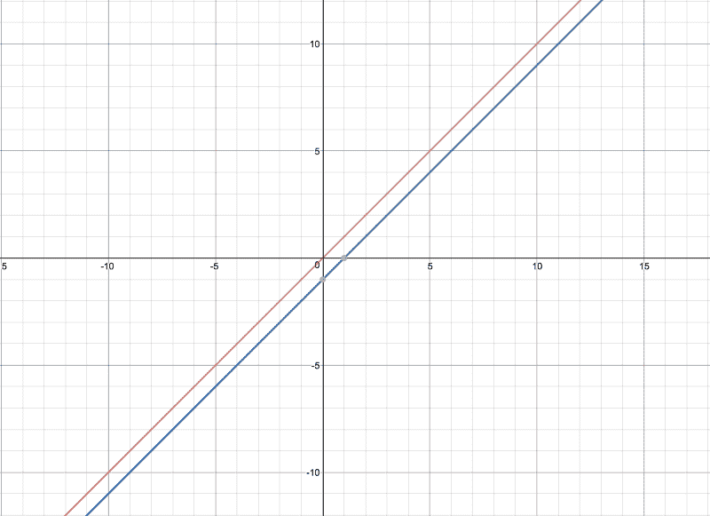

Absolute error. We can have y^ — 0 or y^ — 1 because the actual label can be 0 or 1\. So, two lines are depicted above.

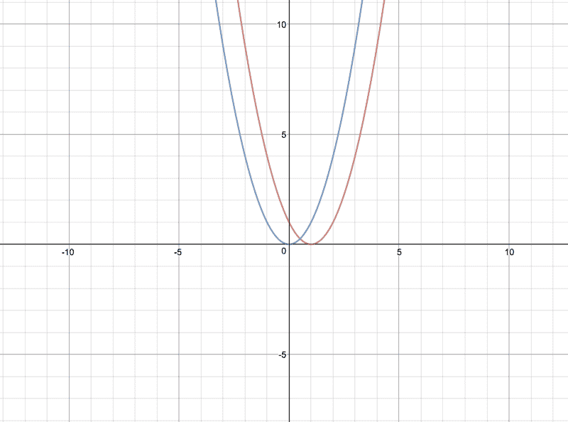

Similarly, we have (y^ — 1)² or (y^)² as the squared error functions.

暂时，忘记我们在使用它进行预测之前对神经元的输出应用 sigmoid 激活函数的事实。那么绝对误差就没有最小值或最大值，这从该函数的曲线图中可以清楚地看出。

但是，如果我们看看平方函数的抛物线图，我们可以看到底部的尖端，这是这个函数的最小值，它发生在`ŷ` = 0 或 1，这取决于我们在谈论哪个。但是，这个函数有一个明确定义的最小值，因此更容易优化。

这就是我写了这么久这篇文章后现在的感受。我希望你能够理解我们到目前为止讨论的所有重要概念。在我们结束之前还有很长的路要走。

你可能想休息一下，然后回到文章上来，因为我们现在将从梯度下降算法开始。

那好吧。希望你回来了，并准备好继续下去！

让我们正式定义我们将在这里使用的误差函数。它被称为均方误差，公式如下。

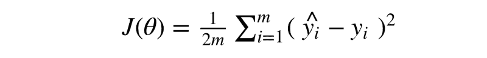

我们计算训练集中每个图像的平方误差，然后我们**找到这些值的平均值**，这代表了模型在训练集中的整体误差。

### 最小化损失函数⬇️

考虑之前只有两个特征的单个图像的例子。两个特征意味着我们有 2 个相应的权重值和一个偏差值。总之，我们的模型有 3 个参数。

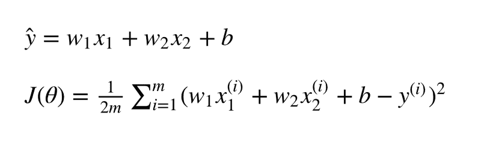

我们希望找到使损失函数值最小的权重值和偏差值。由于这是一个多变量方程，这意味着我们必须处理对应于每个变量`w1, w2 and b`的损失函数的偏导数。

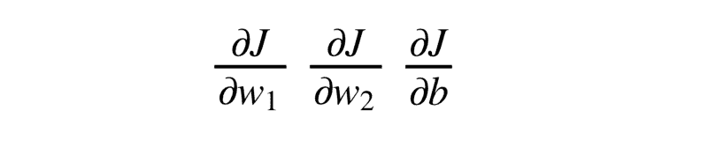

这看起来很简单，因为我们只有 3 个不同的变量。

然而，如果我们考虑手头的任务，即使用我们的单神经元模型进行猫 v/s 狗图像分类，我们有`12288`个权重。

用如此多的变量进行多元优化在计算上是低效的，并且不容易处理。因此，我们求助于替代和近似。

**趣闻:**一个典型的深度神经网络模型有几百万个权重和偏差？。

我们现在已经准备好学习梯度下降算法了。

如果有一种算法在几乎每个机器学习模型中使用，那就是**梯度下降**。

这是帮助我们的模型**学习**的算法。如果没有学习能力，任何机器学习模型本质上都和随机猜测模型一样好。

正是梯度下降算法赋予的学习能力让机器学习和深度学习模型变得如此酷。

这个算法的目的是最小化我们的损失函数值(惊喜惊喜！).我们希望以高效的方式完成这项工作。

如前所述，最快的方法是找出损失函数相对于模型参数的二阶导数。但是，这在计算上是昂贵的。

梯度下降算法的核心是获得最低误差值的过程。[维基百科](https://en.wikipedia.org/wiki/Gradient_descent#An_analogy_for_understanding_gradient_descent)对梯度下降算法有一个很好的类比:

梯度下降背后的基本直觉可以用一个假设的场景来说明。

一个人被困在山里，正试图下山(即试图找到最小值)。有大雾，所以能见度很低。因此，下山的路径是不可见的，所以他们必须使用本地信息来找到最小值。

他们可以使用梯度下降的方法，这涉及到在他的当前位置查看山的陡度，然后沿着最陡下降的方向前进(即下坡)。

如果他们试图找到山顶(即最大值)，那么他们会沿着最陡的上坡方向前进(即上坡)。用这种方法，他们最终会找到路。

然而，还假设山的陡度不是通过简单的观察就能立即明显看出的，而是需要一个复杂的仪器来测量，而这个人此时恰好拥有这个仪器。

用这种仪器测量山的陡度需要相当长的时间，因此如果他们想在日落前下山，就应该尽量少用这种仪器。

困难在于选择他们应该测量坡度的频率，以免偏离轨道。

在这个类比中，

*   这个人代表我们的**学习算法**，并且
*   下山的路径代表了我们的模型最终将探索的参数更新序列。
*   斜坡的陡度代表该点误差面的**斜率。**
*   用来测量陡度的仪器是**微分**(误差曲面的斜率可以通过对该点的平方误差函数求导来计算)。这是我们应用梯度下降时的近似值。我们真的不知道最小点，但是**我们知道方向**，它将把我们引向最小值(局部或全局)并且我们在那个方向上迈出一步。
*   人选择行进的方向与该点的误差表面的梯度一致。
*   在进行另一次测量之前，它们行进的时间量是算法的**学习速率。这基本上就是我们的模型(或者走下坡路的人)每次决定走多大的一步。**

要更深入地理解梯度下降算法背后的数学原理，我建议浏览:

[**梯度下降:你需要知道的全部**](https://hackernoon.com/gradient-descent-aynk-7cbe95a778da)
[*梯度下降是机器学习中使用最多的学习算法。这篇文章向你展示了你几乎所有的…*hackernoon.com](https://hackernoon.com/gradient-descent-aynk-7cbe95a778da)

### 梯度下降总是找到全局极小值吗？

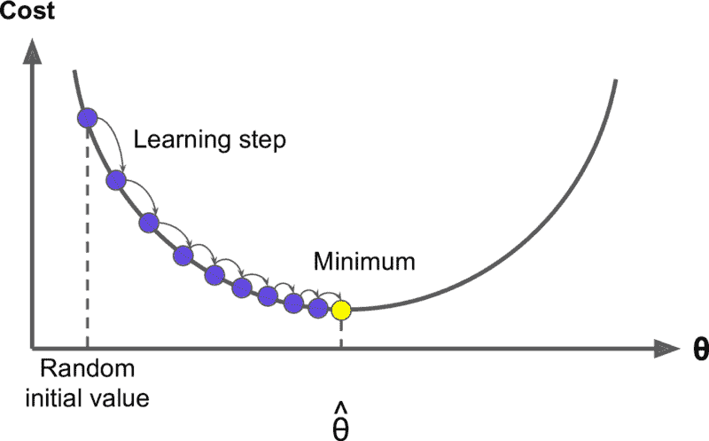

Source: [https://www.oreilly.com/](https://www.oreilly.com/)

这是与梯度下降相关的最常见的图形之一，它表明我们的误差函数是一个光滑的凸函数。它还表明梯度下降算法找到了全局最小值。

我们定义的损失函数被称为**均方损失函数**。该函数接受两个参数:`ŷ`，它是给定输入`x`的模型预测，然后我们有`y`，它是对应于该输入的实际标签。

显然，我们的函数是关于预测`ŷ`的凸函数。

但是，如果你看看我们之前写过几段的损失函数的展开式方程，你会发现预测值并不是我们可以直接控制的。

我们可以简单地控制模型的权重和偏差值，即模型的参数，它们反过来控制预测。

虽然，均方损失函数相对于模型`ŷ`的预测是凸的，但是我们真正感兴趣的是相对于模型参数的凸性。

我们希望损失函数是模型权重的光滑凸函数。

由于典型的机器学习模型有数百万个权重(我们的模型有 12288 个权重，并且是单个神经元)，我们的损失函数可能包含多个局部最小值点，梯度下降可能不一定找到全局最小值。

这完全取决于模型采用的**步长、**即学习率、模型的训练时长以及我们的模型拥有的训练数据量。

### 让渐变流向✈️

好的。所以现在我们知道这是两个方程，通过它们我们的模型将学会更好地进行猫和狗的图像分类。

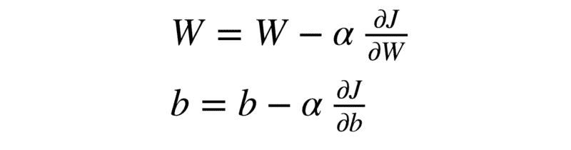

`α`代表我们梯度下降算法的学习率，即下山的步长。`α`旁边的项代表分别对应于权重和偏差的损失函数的**梯度**。

这里的问题是，我们如何计算这些梯度？

让我们看看到目前为止我们一直在使用的简单模型的计算图。

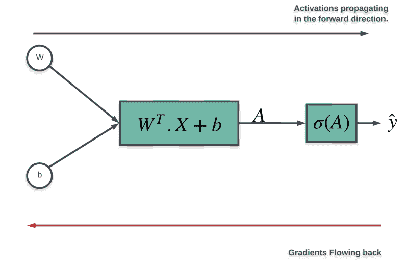

我们已经知道激活是如何向前流动的。我们获取输入图像的特征，对它们进行线性变换，对结果值应用 sigmoid 激活，最后得到我们的激活，然后用它来进行预测。

在这一部分，我们将通过一个被称为**反向传播的过程，来观察沿着上图中红线的梯度流。**

不要烦恼！

在本节结束时，您将清楚地了解反向传播为我们做了什么以及它背后的数学原理(至少对于我们的特定模型是这样)。

> 反向传播本质上是应用于计算图的微积分链式法则。

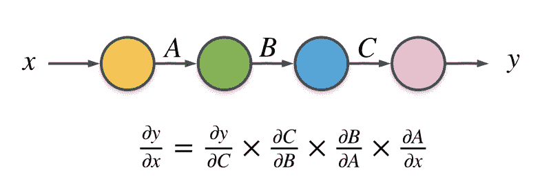

假设我们想要找到变量`y`相对于上图中`x`的偏导数。我们不能直接找出答案，因为在计算图中还有 3 个其他变量。

```
x --> (Some computation) --> AA --> (Some computation) --> BB --> (Some computation) --> CC --> (Some computation) --> y
```

因此，我们在计算图中以**向后**的方式反复进行这个过程。

我们首先找出输出`y`相对于变量`C`的偏导数。然后我们使用微积分的[链式法则](https://en.wikipedia.org/wiki/Chain_rule)，我们确定关于变量`B`的偏导数，等等，直到我们得到我们正在寻找的偏导数。

这就是反向传播的全部内容。

显然，实际上在计算图中找出导数是一件棘手的事情，会吓跑大多数人。然而，我们手头有一个相对简单的模型，在这里进行反向传播非常容易。因此，没有进一步的告别，让我们继续我们的计算图形上的反投影数学。

#### Step 1: dJ/dŷ

我们损失函数的最终等式是:

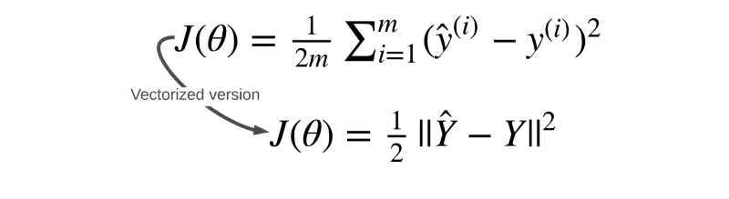

损失函数相对于我们的模型`ŷ`的激活的偏导数是:

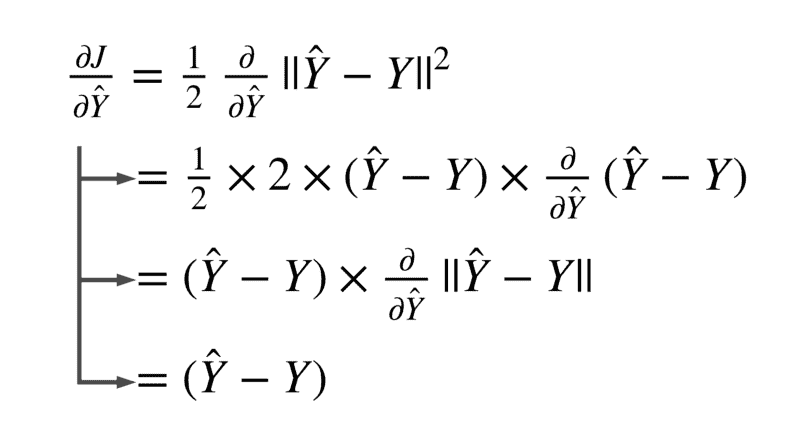

那很简单！

让我们后退一步，计算下一个偏导数。这将使我们离想要计算的实际梯度更近一步。

#### 第二步:dJ/dA

这就是我们应用之前提到的链式法则的地方。因此，计算损失函数相对于线性变换输出的偏导数，即在应用 sigmoid 激活之前我们的模型**的输出。：**

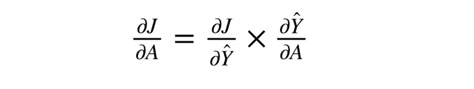

等式的第一部分是我们在步骤 1 中计算的值。我们可以在这里简单地使用它。

这里要计算的基本内容是我们的模型预测相对于线性转换输出的偏导数，也称为 **logit。**

让我们来看看我们的模型在逻辑上的预测方程。

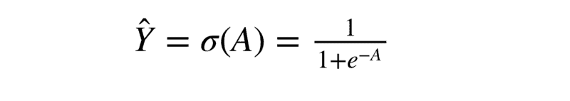

我们简单地写出了 sigmoid 激活函数的公式。

我们模型的最终输出的导数 w . r . t . logit 简单地表示 sigmoid 函数相对于其输入的偏导数。让我们看一下导数的求导？。

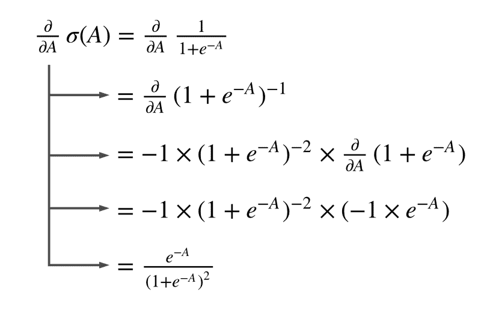

那是相当多的数学。但这里只是基本的微分学。

如果你对数学和它的推导不感兴趣，你可以简单地看看这些偏导数的最终值。您将需要这些来从头构建您的模型。

继续，我们可以进一步简化这个等式。

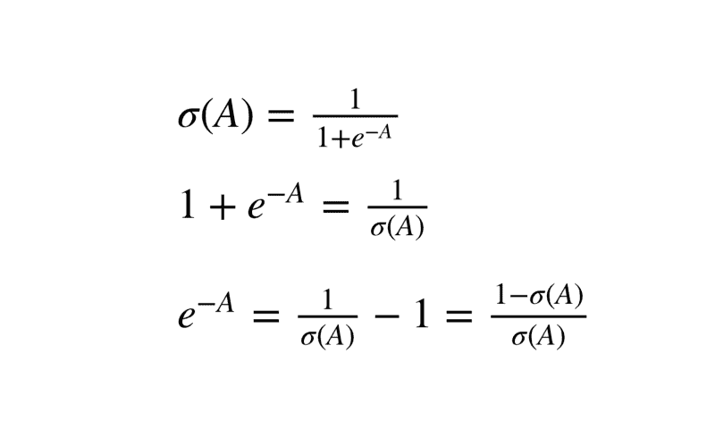

将该值代入我们之前的等式，我们得到:

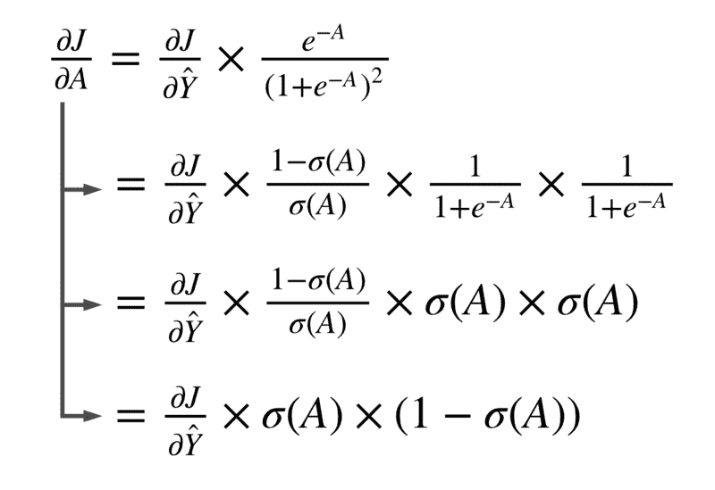

唷！有很多数学，对吧？

但是我们还没有完成。这个反向传播算法还有一步要走。

我们还需要找到关于权重和偏差的偏导数。

让我们继续前进，看看我们如何能做到这一点。

#### 第三步:dJ / dW 和 dJ / db

我们需要损失函数的偏导数对应于**的每一个权重。**但是由于我们采用了**矢量化，**我们可以一次找到所有内容。这就是为什么我们一直使用大写斜体符号`*W*`而不是较小的`w1 or w2 or any other individual weights.`

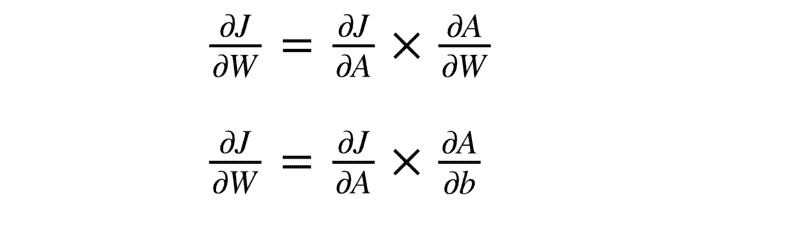

我们将展示权重的推导过程，并将偏差部分留给您来完成。


### 我们来编码吧！？

让我们将上一节中学习的所有数学知识放入一个简单的函数中，该函数接受激活向量`A`和真实输出标签向量`Y`，并计算我们的损失相对于权重和偏差的梯度。

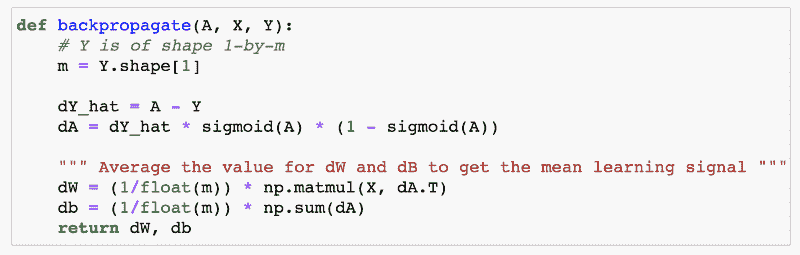

*   术语`dY_hat`代表我们的损失函数相对于最终输出值`ŷ`的偏导数，如前一节所示，该值为`A — Y`。
*   然后我们得到`dA`，它是线性变换输出`A`的偏导数。
*   下一项是`dW`,我们看到我们在这里做了矩阵乘法来得到这个值。我们除以`m`得到整个训练集的平均梯度。那是标准的。但是为什么我们在这里做了矩阵乘法呢？

在上一节的最后一张图中，我们看到了`dJ/dW = dJ/dA * X`。

让我们仔细看看这里涉及的两个量的量纲。我们的矩阵`X`将是`12288-by-m`，其中每个图像具有`12288`特征，我们有`m`个训练样本。

量`dJ/dA`的量纲将与`A`相同，这只是每个训练样本的单个真实值，即`1-by-m`。

此外，量`dJ/dW`的维数应该与`W`相同，因为最终，我们必须从原始权重值中减去梯度。所以这两个矩阵必须有相同的维数。

矩阵`W`的维度为`12288-by-1`。所以，我们需要`dJ/dW`也成为`12288-by-1`。要做到这一点:

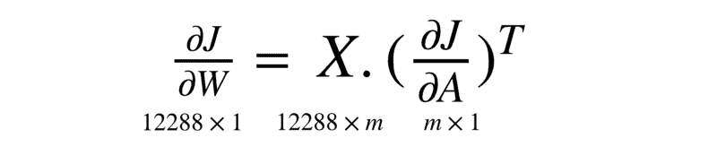

希望这能澄清为什么我们在取平均值之前把代码写成`np.matmul(X, dZ.T)`。

让我们将所有这些整合到一个单一的综合功能中，该功能具有以下功能:

*   获取输入 X 和模型参数 W 和 b，并对输入应用前向传播。
*   进行反向传播来计算梯度。
*   对模型参数应用梯度下降。
*   计算验证数据集中的损失，以衡量模型的性能，并使用它来查看模型的泛化能力是否良好。

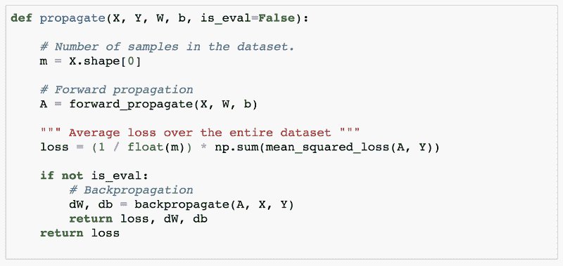

我们有这个组合函数，它为我们做前向和后向传播。因此，对这个函数和我们的模型的一次调用将会从我们的整个训练集中处理和学习一次。

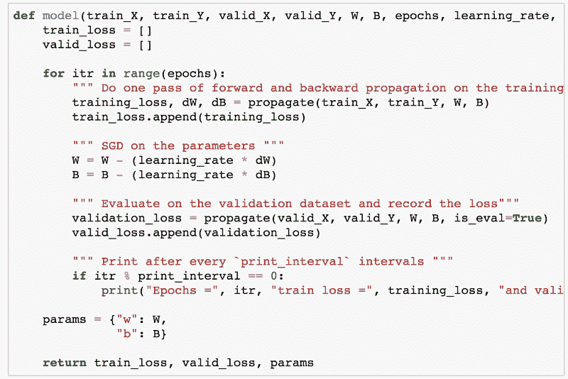

这是一个主要的功能，本质上是多次执行相同的过程。

将模型多次暴露给训练数据集，模型每次都会学到一些新东西。

因此，这些迭代被称为**历元**，我们有这个`model`函数，对于每个历元，它遍历前面提供的一组步骤。

最后，我们现在可以训练我们的模型，看看单个神经元实际上可以学习多少，就我们的猫与图像分类任务而言。

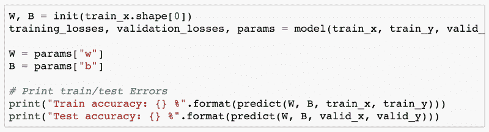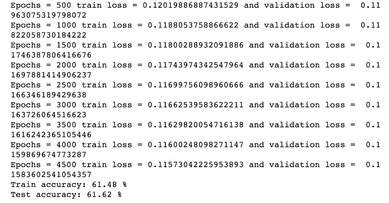

Sweet!

这意味着在**看不见的验证/测试集上，**我们的模型能够以 61%的准确率预测图像是猫还是狗。如果你问我，我会觉得这太棒了，因为我们已经能够简单地通过使用**单个神经元，实现比随机猜测者高出 10%的速度。**

只是为了好玩，我绘制了所有 5000 个时期的模型训练的训练和验证损失。

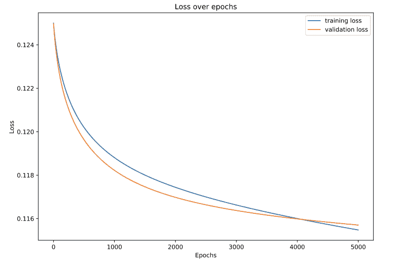

训练和验证损失随时间平稳减少。

在我让您继续研究代码之前，还有最后一件事。让我们为我们的模型提供一个自定义图像，一个不属于数据集的图像，看看它是否能够正确预测图像是猫还是狗。

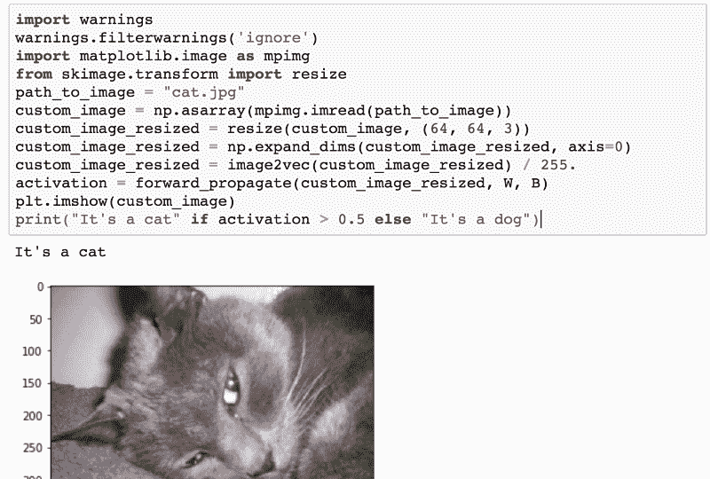

瞧啊。没错。的确，那是一只猫。

如需完整代码，请查看:

[**edorado 93/神经元的力量**](https://github.com/edorado93/Power-Of-A-Neuron)
[*猫 vs 狗图像分类使用逻辑回归-edorado 93/神经元的力量*github.com](https://github.com/edorado93/Power-Of-A-Neuron)

如果你认为这篇文章可能对某人有用，请推荐这篇文章！此外，如果任何计算或代码本身有错误，请随时指出。非常感谢。