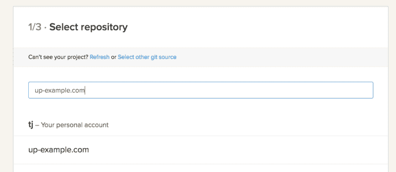
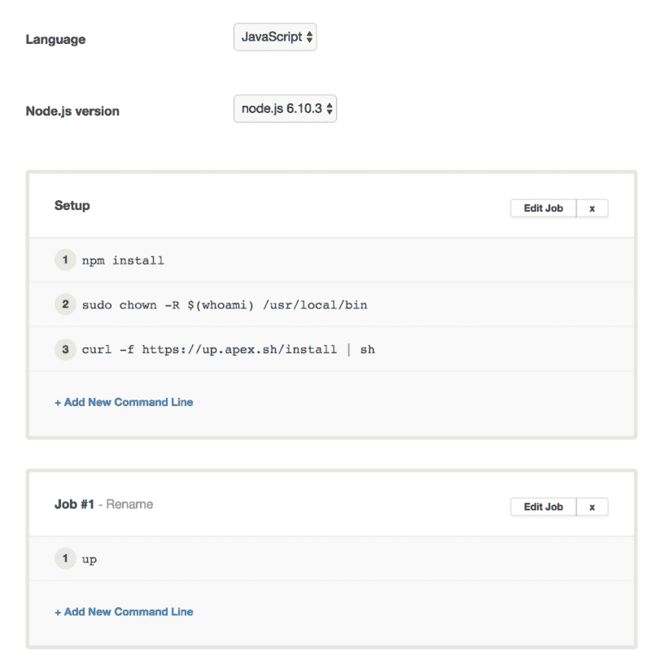
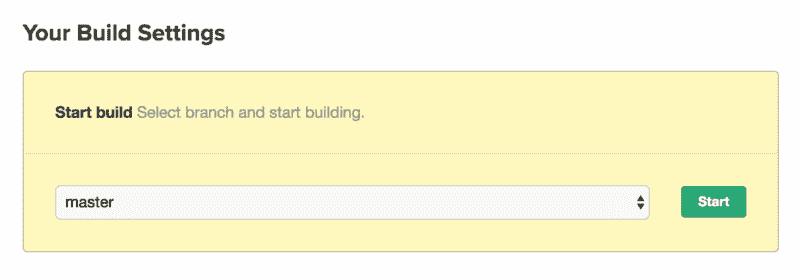
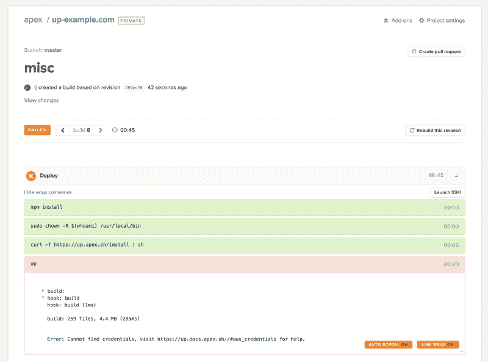
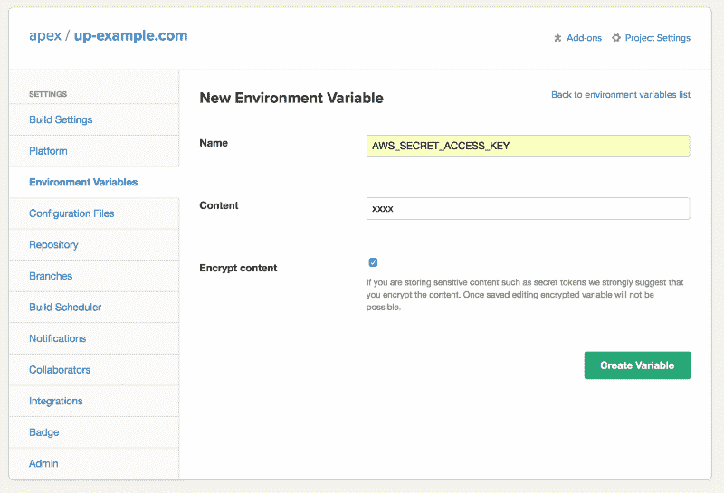
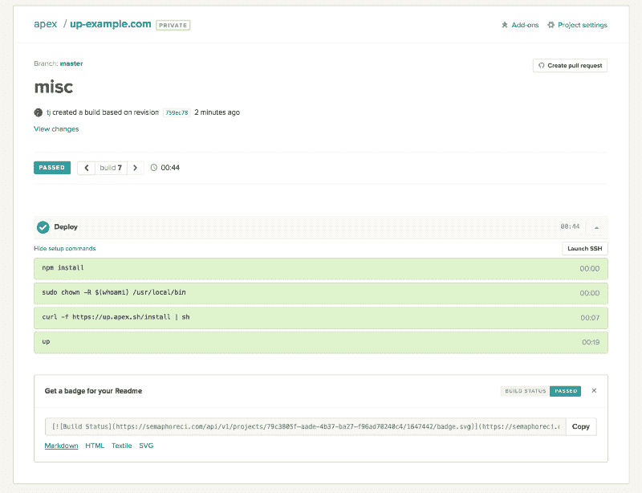
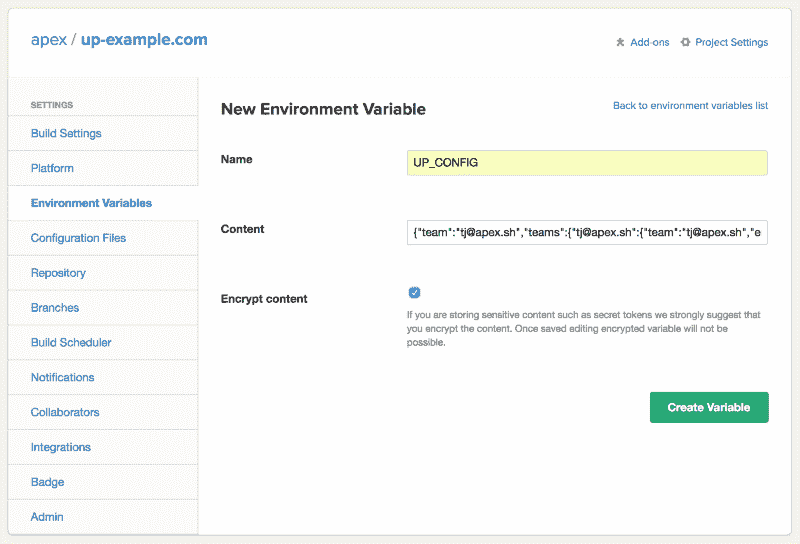
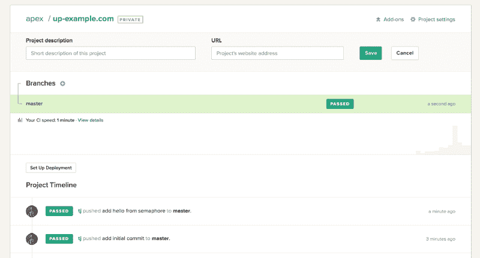

# 如何使用 Up & Semaphore CI 在几分钟内将无限可伸缩的应用程序部署到 AWS

> 原文：<https://www.freecodecamp.org/news/deploy-infinitely-scalable-applications-in-minutes-with-up-semaphore-ci-c2a60f821207/>

作者 TJ·霍洛韦丘克

# 如何使用 Up & Semaphore CI 在几分钟内将无限可伸缩的应用程序部署到 AWS


许多 [Apex Up](https://github.com/apex/up) 用户一直在询问关于持续集成平台的集成，这篇文章介绍了使用[信号量 CI](https://semaphoreci.com/) 进行产品化的准备和部署。

无服务器 Up 应用程序通常在几秒钟内从笔记本电脑上部署，但是如果网络连接不良，您可能需要考虑 CI，这不仅是为了改进工作流和测试，也是为了提高上传速度。

Semaphore 是我选择的 CI——它有一个简洁的设计，让您可以轻松地加密 env 变量，安排定时构建，并且不需要您在存储库中堆满点文件。也就是说，只要您可以定义环境变量，您就可以选择您喜欢的 CI 平台。

### 应用程序

对于这个例子，我们将部署一个最小的 [Koa](http://koajs.com/) Node.js 应用程序。在 GitHub 中创建一个新的存储库，并使用以下代码添加`app.js`:

```
const Koa = require('koa')const app = new Koaconst { PORT = 3000 } = process.env
```

```
app.use(function *() {  this.body = "Hello\n"})
```

```
app.listen(PORT)
```

您可以通过 npm 或 yarn 添加依赖项，这取决于您的喜好。将应用程序部署到 AWS，并查看那个光荣的“你好”:

```
$ up$ curl `up url`Hello
```

现在我们来设置 CI。

### 设置

要开始使用 Semaphore，首先需要创建一个新项目:


并找到您之前在 GitHub 中创建的存储库:



现在来看看好东西——配置构建！

### 配置作业

我非常喜欢 Semaphore 的一点是，您不必在存储库中使用点文件，只需在 UI 中定义所需的作业和命令。如果您的用例允许，您甚至可以并行运行作业来加快速度。

“Setup”作业将为应用程序安装 NPM 包，调整`/usr/local/bin`的所有者，因为这是默认安装 up 的地方，然后最终安装 Up 本身。Up 作为二进制文件分发，所以这个过程只需要几秒钟。

```
npm installsudo chown -R $(whoami) /usr/local/bincurl -f https://up.apex.sh/install | sh
```

您可以对命令进行定义和重新排序，但是，如果您单击“编辑作业”，您可以将上面的命令作为文本进行复制和粘贴。本例中的第二个作业用于部署到开发(`up`)。



如果您在安装到/usr/local/bin 时遇到权限问题，或者只是想避免这种情况，您可以提供一个带有`BINDIR`的安装路径:

```
curl -sf https://up.apex.sh/install | BINDIR=. sh
```

请注意，如果您使用 Up 运行 Node.js，您将希望指定 **6.10.3** ，因为这是 [AWS Lambda](https://aws.amazon.com/lambda/) 支持的 Node.js 的“本地”版本。

### 配置您的 AWS 凭据

配置完作业后，只需选择您的分支，然后单击“Start”。



你首先会看到的是`up`失败！这是因为我们没有提供任何 AWS 凭证，所以 Up 不知道在哪里部署，也没有被授权这样做。



如果您浏览侧边栏中的“环境变量”标签，您可以添加纯文本或加密的环境变量。你需要两个变量，`AWS_ACCESS_KEY_ID`和`AWS_SECRET_KEY_ID`。第一个可能是纯文本，但第二个应该加密，当有疑问，只是加密。



现在，当您执行新的构建时，您应该有一个传递 CI 管道！



> 您可以在 [Up 文档](http://up.docs.apex.sh/#aws_credentials)中阅读更多关于 AWS 凭证的选项。另外，请确保永远不要在 CI 等外部服务中使用您的根凭据。

### 使用 Up Pro 部署到生产环境

Up 的 [Pro 版本现已提前发布——仅 10 美元/月，可在您的组织中无限制使用——很快将提供加密的环境变量、警报和更多好东西！](https://github.com/apex/up#pro-features)

在[订阅了 Up Pro](http://up.docs.apex.sh/#guides.subscribing_to_up_pro) 之后，你将需要认证才能安装 Pro 二进制文件。运行以下命令将凭据复制到剪贴板。

```
$ up team ci --copy
```

添加一个名为`UP_CONFIG`的新的加密环境变量:



接下来你需要在安装完 Up 后添加`up upgrade`，这将安装 Pro 版本，因为它检测到`UP_CONFIG`。请注意,“部署”作业已经更改为部署到生产环境，而不是开发环境。更改这个命令允许您将 GIT 分支映射到不同的阶段，因此您可以利用 CI 来推进开发、阶段化或生产。

注意您可以通过`up upgrade -t 0.5.4`升级到特定版本的 Up，以“锁定”该版本。


尝试将 app.js 中的“Hello\n”字符串更改为“Hello from Semaphore CI\n”并将提交推送到 GitHub。

```
app.use(function *() {  this.body = "Hello from Semaphore CI\n"})
```

再过一分钟或更短的时间，你就会看到成功的绿叶。在 AWS 端没有远程构建，一旦它变绿，您的应用程序就会在不到一分钟的时间内运行并为请求提供服务。



如果在一个命令中将应用程序、API 和站点部署到您自己的 AWS 帐户听起来很有帮助，那么看看[Apex Up](https://github.com/apex/up)——并查看 [Semaphore CI](https://semaphoreci.com/) 来创建组织范围的持续集成工作流。

**编辑**:注意，在最新版本的 Up 中，你也可以就地升级二进制文件，以避免权限问题或对`/usr/local/bin`的更改，并且可以选择通过`-t x.x.x`传递一个特定的版本来“锁定” **Up Pro** 的版本

```
curl -f https://up.apex.sh/install | BINDIR=. sh./up upgrade -t 0.5.8./up production
```

我联系了 Semaphore CI，他们提出使用优惠券“ **SEMAPHORE330** ”为 Up 用户提供前 3 个月 30%的折扣。请注意，它可兑换到 12 月 31 日。