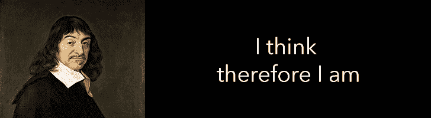
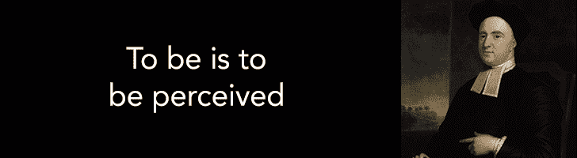
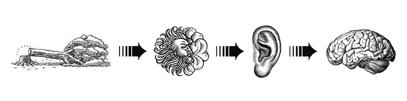

# 笛卡尔、贝克莱和函数反应式程序设计

> 原文：<https://www.freecodecamp.org/news/descartes-berkeley-and-functional-reactive-programming-18b0b61eac58/>

大卫·瓦尔德曼

# 笛卡尔、贝克莱和函数反应式程序设计


函数式反应式编程充斥着新手不熟悉的术语:纯函数、不变性、单子等等。但是在这些概念之下有一个更深层次的原则——一个早在查尔斯·巴贝奇和第一台计算机出现之前就被争论的原则。我认为面向对象编程(OOP)和函数式反应编程(FRP)的区别在于对现实的解释和程序的结构一样多。

这里有一个我们可能都听过的思维实验:

> 如果一棵树倒在森林中，没有人听到它，它会发出声音吗？

有许多方法可以将这个问题视为不适定问题。暂且忽略它们，这个问题触及了现实的一个基本方面:因果关系。存在是依赖于观察还是独立于观察？让我们把这个思想实验翻译成代码。这里有一棵 ***树*** :

```
class Tree {     constructor(){         this._fell = false;     }     set fell(state){         this._fell = state;     }     get fell(){         return this._fell;     }} 
```

```
var tree = new Tree();tree.fell = true;
```

为了使 ***树*** 倒下，我们将它的倒下状态设置为 ***真*** 。这是教科书式的面向对象编程。它的模式是 getters、setters 和 state。这很简单，但在我们的思想实验中有一个潜在的解释:如果有人问树是否倒下了，即使他们没有观察到，答案也是响亮的"*是的！*“只需要检查***tree . fell****是 ***真*** 。那些对我们的哲学问题回答“是”的人这样做是因为他们可以回到森林，看到倒下的树，并推断它在过去倒下。这是相应的代码。看起来我们已经解决了那个百年之谜。*

*没那么快！让我们看一个不同的方法。下面是另一棵 ***树*** :*

```
*`class Tree extends EventEmitter {}var tree = new Tree();tree.emit('fall');`*
```

*这就是【无功】 ***树*** 。它的模式是事件和转换。在最纯粹的形式中，我们的树没有状态。我们通过广播一个 ***fall*** 事件让它 fall。唉，这个消息被置若罔闻！没有状态改变，没有证据留下。没有办法通过质疑现实来推断过去。树倒了吗？* *耸肩* **

### *笛卡尔和伯克利*

*面向对象和反应式方法对我们的思想实验给出了两种不同的答案，因为它们体现了两种相互矛盾的认识论哲学:由笛卡尔在 17 世纪后期推广的理性主义和由伯克利在 18 世纪早期推广的经验主义。*

*

Descartes takes as a short break from writing a Java interface* 

*笛卡尔，带着一丝狂热的怀疑，发现他只能确定一件事:他自己的存在。他之所以得出这个结论，是因为他无法怀疑自己思想的存在，并断定一定有某种实体在思考，因此创造了这个短语。换句话说:通过承认有某种内部状态正在改变，一定有某种状态所属的代理人。对笛卡尔来说，状态的变化是存在的证明——就像我们的第一棵 ***树。****

*

Berkeley seen pondering Haskell type definitions* 

*笛卡尔之后不久，乔治·贝克莱出现了。贝克莱谴责了现实主义者的观点。对贝克莱来说，像树这样的物质对象的存在是没有意义的。存在只能通过思想(精神上的而不是物理上的经验)来达到我们，思想必须在头脑中吸收才能存在。实物是欺骗；他们的本质不是他们的肉体，而是他们转化非物质的能力。如果一个思想没有被头脑吸收，它就不存在。因此，他推广了拉丁语短语:存在就是被感知。*

*让我们把伯克利的现实翻译成代码。为了让我们的第二棵树*发出声音，头脑必须解读它。我们将创造一个因果链，从树倒下开始，到空气振动，到耳朵产生电刺激，到大脑将其解释为声音。**

****

**当树倒下时，空气会震动。**

```
**`class Air extends EventEmitter {    constructor (){        super();                function mapFall (fall){...}        this.on('fall', (fall) => {            var vibration = mapFall(fall);            this.emit('vibrate', vibration);        };    }}`**
```

**当空气振动时，耳朵将其转化为电刺激。**

```
**`class Ear extends EventEmitter {    constructor (){         super();                function mapFrequency (frequency){...}        this.on('vibrate', (frequency) => {            var stimulus = mapFrequency(frequency);            this.emit('stimulus', stimulus);        };    }}`**
```

**当耳朵产生刺激时，大脑将其解释为声音。**

```
**`class Brain extends EventEmitter {    constructor (){        super();        function mapStimulus (signal){...}        this.on('stimulus', (signal) => {            var sound = mapStimulus(signal);            this.emit('sound', sound);        };    }}`**
```

**我们已经有效地建立了一个因果关系链，我们通过构建一个管道来明确这一点:**

```
**`tree.pipe(air).pipe(ear).pipe(brain);`**
```

**现在，当树倒下时，它会给人留下印象:**

```
**`brain.on('sound', (sound) => {    // We exit the system. You have been heard!    console.log(sound); });`**
```

```
**`tree.emit('fall', fallData);`**
```

**伯克利把这个概念叫做*主观唯心主义*。*唯心主义*因为它断言只有思想或观念存在，*主观*因为现实依赖于感知它的主体。在我看来，主观唯心主义是支撑反应式编程的哲学。伯克利写道，**

> **这确实是一种在人类中奇怪地盛行的观点，房屋、山脉、河流，总之所有可感知的物体都有一种自然或真实的存在，与它们被理解所感知的不同。…因为除了我们通过感官感知的事物之外，前面提到的对象是什么……而这些对象中的任何一个或它们的任何组合存在而未被感知，这难道不是明显令人厌恶的吗？**

**我喜欢这句自信大胆的话。伯克利实质上是在说我们疯了，因为我们认为房子、山脉和河流是存在的。在我们的例子中，树木、空气、耳朵和大脑都是虚假的偶像；唯一真实的是***map fall******map frequency***和 ***mapStimulus*** 。现实永远不会被消费，就像物体保持状态时一样。现实只是被改变了。**

### ***主观唯心主义*在实践中**

**在 OOP 中，我们创建封装了某种行为的对象。然后我们构建程序，这些程序是这些对象的网络关系。我们的程序在结构上是一个*图*。**

**在 FRP 中，我们创建了封装因果关系的功能管道。管道然后被合并和分支，以给出面向对象程序的图形结构。然而，函数的类型有一个重要的限制。只允许使用[纯函数](https://en.wikipedia.org/wiki/Pure_function)。也就是说，功能不能影响自身以外的任何东西。在我们的例子中，**耳朵**物体不能改变**空气**物体的振动方式。这个约束确保我们的管道从原因到结果有一个明确的方向。就结构而言，这意味着我们的程序是一个 [*有向无环图*](https://en.wikipedia.org/wiki/Directed_acyclic_graph) (DAG)。**

**为了对软件进行推理，我们必须把它看作一系列因果关系。我们必须能够*订购*程序。数学上，一个图可以是[有序的](https://en.wikipedia.org/wiki/Topological_sorting)当且仅当它是一个有向无环图。不管你怎么写你的程序都是如此。无论你选择 OOP，玻璃钢或 XYZ。然而，FRP 的特殊之处在于，排序是由模式强制的。**

**在 OOP 中，排序是不确定的。对象可以调用其他对象的方法。对象可以改变其他对象的状态。默认情况下，所有东西都有读写权限。指定订单是由开发人员手动完成的。由他们将程序中各行的顺序与对象的因果关系联系起来。**

**不幸的是，这一切太容易搞砸了。注意，在 OOP 中，当两个对象写入同一个共享状态时，就会出现竞争情况。在 FRP 中，当两个函数试图相互影响时，就会出现无限循环。这只是理论模式实施实际结果的一个例子。**

**底线是封装状态是不够的。一个写得好的程序也会封装依赖性。**

### ****权衡****

> **"程序员知道每样东西的好处，也不知道任何东西的利弊."—里奇·希基**

**你可能会想，在所有这些对 FRP 的赞美和对 OOP 的抨击之后，我会坚定地站在 FRP 阵营中。你错了！FRP 是一种编程模式，模式用来约束解决方案。如果理想的解决方案不满足约束条件，那么与模式对抗就是浪费精力。**

**具体来说，玻璃钢有一些简单的烦恼。以不变性为例——你总是在创造更多的内存。比如说，你永远无法对一个列表进行排序。你总是会创建一个新的列表。理论上，不变性是一个很好的观察模式。在实践中，你可能会记忆受限，逆着玻璃钢水流游可能是个好主意。**

**但这不是*这个*突出的问题。突出的问题是，当您不知道代码库的两个部分何时会交互时，FRP 就变成了反模式。以第一人称射击游戏为例。某处是**子弹**对象，另一处是**玩家**对象。子弹可能会击中球员，但不清楚这种情况何时会发生。这些对象需要保持状态(子弹的速度、玩家的健康状况等)。)所以在他们互动的那一刻就有了。也许从抽象上来说，整个游戏可以被认为是一个因果管道，但对我来说，这听起来比从分离的对象和状态的角度来考虑更令人生畏。**

**再次戴上我的哲学帽子，物理学可能会规定，现实是一条因果管道，其时间演化受确定性物理定律支配，其初始条件(或概率)由大爆炸提供。但这几乎不是人类推理因果的方式。我们自然地将现实分割成更高层次的对象，并推理它们之间的相互关系。这样会更简单，尽管很容易出错！**

**我觉得这就是为什么 FRP 还没有被编程社区完全接受，即使在看到它的许多优点之后。在编写程序时，我们最好的希望是在模式适合解决方案的地方使用 FRP 原则，在模式不适合的地方让它们启发 OOP 模式。对我来说，这是可以被认为是管道的解决方案和不应该被认为是管道的解决方案之间的区别。**

### **结论**

**在哲学中，目标不是解决我们最深层的问题，而是有一个共同的语言和历史先例来辩论这些问题。所以当一个新的问题出现时，我们不必重新开始。编程模式也是如此。它们不是用来决定对错的，好像这些概念具有普遍的吸引力。它们用于对问题及其方法进行分类。**

**我们还应该看看比计算机科学更古老的其他学科，看看它们共享的语言和历史先例是否能激励我们自己。那么我们可能会看到这个问题，“*树倒了吗？*不是用*是*或*否*来回答。而是质疑一种观点。一个可以构建我们的认识论哲学或程序架构的框架。答案就在精神状态和思想流动之间！**

****第二部分预览****

**在我们的思想实验中仍然有一个困扰的两难问题。即使没有人听到这种声音，当树倒下时，空气肯定会震动！对吗？在第二部分，我们将进一步深入兔子洞，看看玻璃钢在这里也能给出令人惊讶的解释。我们将从推和拉的角度来考虑数据流，并看看这是如何出现在惰性评估、光线跟踪等算法和 Excel 等应用程序中的。**