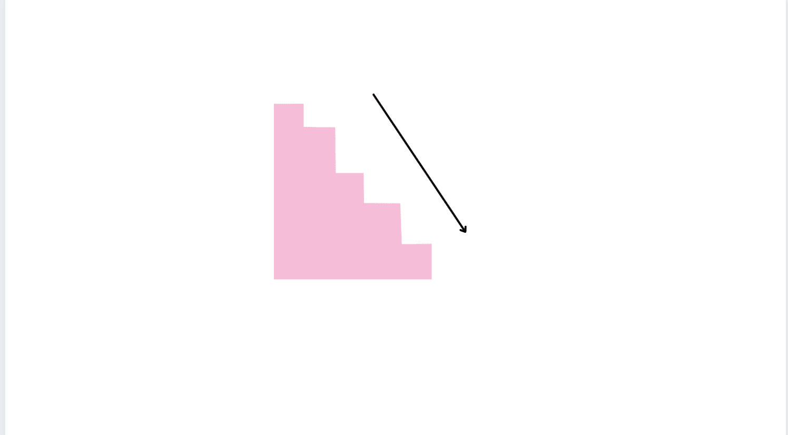

# 降序与升序–这意味着什么？

> 原文：<https://www.freecodecamp.org/news/descending-order-vs-ascending-order-what-does-it-mean/>

你可能听说过降序和升序这两个术语，但它们实际上是什么意思呢？

这篇文章用简单的英语解释了这两个术语之间的基本区别，并给出了一个可以帮助你区分它们的类比。

## 什么是降序？

当一系列数据按从高到低或从大到小的顺序排列时，意味着是按*递减*的顺序排列，也称为*递减*的顺序。

这可以适用于任何一组信息，如数字、日期、物体的大小或字母——同样的原则也适用于您正在处理的任何东西。

例如，将一组数字从最大值到最小值排序意味着您正在按降序排列它们。

假设你有以下数字:`49, 80, 56, 11, 20`。

将它们按降序排列如下:`80, 56, 49, 20, 11`。

你总是从左边最大的数字开始，以右边最小的数字结束。在本例中，`80`最大，`11`最小。中间的数字也是从大到小的顺序。

这些数字不断减少，每一个数字都比前一个数字小。

字母表中的字母也是如此。当按降序排列它们时，你应该从 Z 到 A 写出它们(所以，倒着写)。从头到尾想一想这个。

当你把事情按时间顺序排列时，日期也是一样——它们从最近的和最近的到最早的排列。

把它想象成走下一段楼梯——当你这样做时，你从高处开始，在较低的地方结束。你从最高层开始，想要往下走。

所以，简单来说，降序就是项目从最高到最低的排列。

## 什么是升序？

升序与降序完全相反——它也被称为重要性的递增顺序。

项目从最低值到最高值排列。该顺序从最小值开始，最大值结束。

因此，从上一节中取出数字:`49, 80, 56, 11, 20`，并按升序排列，看起来像这样:`11, 20, 49, 56, 80`。

最小的数字总是最先出现，在这种情况下是`11`，最后一个数字总是最大的，在上面的例子中是`80`。

同样的规则也适用于字母表中的字母。当按升序排列时，它们是从 A 到 Z 排列的——或者从开始到结束。

说到日期，升序意味着最早的日期在前，最近的日期在后。

再想想楼梯的例子。

当你爬上一段楼梯时，你从某个低的地方开始，最后到达的地方比你开始时高得多。

总之，升序是项目从最低到最高的排列。

感谢阅读！