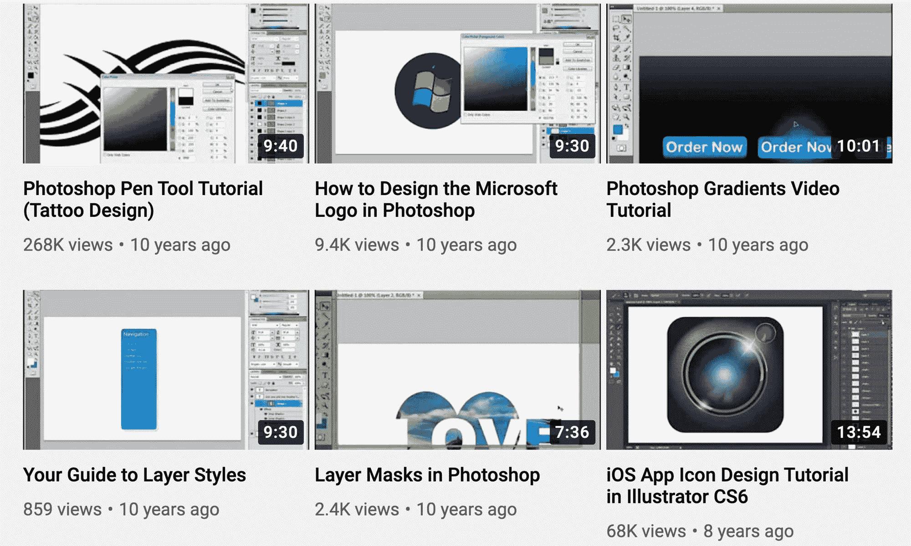

# 从一个 20 年的网页开发老手那里获得设计反馈 Gary Simon 直播系列

> 原文：<https://www.freecodecamp.org/news/design-course/>

Gary Simon 是一位多产的开发人员和设计师。他经营着 YouTube 频道的设计课程。多年来，Gary 通过他对网站设计的现场评论给了数百名开发者反馈。

Gary 以他的设计评论直播而闻名，在那里他评论开发者的网站设计，并按照 1 到 10 的等级进行评分。

他考虑的一些方面是:

*   易接近
*   表演
*   美学
*   和整体凝聚力

从本周开始，Gary 将在 freeCodeCamp 的 YouTube 频道上做一系列的 3 个视频流。

以下是这些溪流:

*   [流#1](https://www.youtube.com/watch?v=r-GpCakJjxc)
*   [流#2](https://www.youtube.com/watch?v=TzWXqTJk6Qs)
*   [流#3](https://www.youtube.com/watch?v=xVA-gUk8-aM)

## Gary 如何成为一名 UI 开发人员和设计师

Gary 作为前端开发人员已经工作了 20 多年。

早在 2000 年代初，Gary 说他的网站设计过程包括“在 Adobe Photoshop 中创建一个模型，然后使用 Adobe Fireworks 拼接’PSD，然后我用它来创建 HTML 表格以构建布局。”

“根本没有‘响应式’设计这回事！”

大约十年前，他开始教授设计和开发，特别关注 UI 设计和身份设计。

“Digg.com 是 2006 年左右第一个流行的社会化书签网站。我当时喜欢设计 logo，决定写一个 logo 设计教程，看看能不能上头版。我能够做到这一点，并最终从谷歌带来了大量的流量。”

取得初步成功后，Gary 迷上了帮助人们学习新工具和技术的热潮。"我意识到这是一个教授我开发的技能的机会。"

Some of Gary's earliest videos on Adobe Photoshop and visual design.

Gary 的 YouTube 频道在过去 10 年里有了很大的发展，现在已经有超过 664，000 名用户。

“2010 年，我创建了自己的 YouTube 频道。我决定在前几年录制一些教程。我从来没有检查过数据，也没有认真对待过。

“2014 年，我发现自己有大约 6000 名订户，于是决定通过定期上传来真正严肃起来。2014 年的前 100 天，我上传了 100 个视频。这帮助我成长了很多。从那以后，我每周都会上传教学 UI/UX 设计、前端开发等内容。”

Some of Gary's most recent videos, which span a variety of front-end development tools and techniques

迄今为止，Gary 已经创建了近 100 门课程，并在 Pluralsight、TutsPlus、LinkedIn Learning、Udemy 和他自己的平台上发布了这些课程。

在过去的几个月里，我花了很多时间和加里交谈。他是一个非常务实的人，大部分时间都花在照顾他的两个女儿和弹吉他上。

请在美国东部时间 9 月 30 日上午 10:30 加入我们，观看加里的第一个节目。您可以[在这里](https://www.youtube.com/watch?v=TzWXqTJk6Qs)观看视频流并提前加入，这样您就可以在他上线时得到提醒。

如果你想提交一个设计供他审阅，你可以用标签#LiveUIUXReview 发推文，他可能会选择它来进行现场审阅。

在那里见。