# 设计模式:生活和 Ruby 中的命令和礼宾

> 原文：<https://www.freecodecamp.org/news/design-patterns-command-and-concierge-in-life-and-ruby-aab9815817ea/>

作者:黄思慧

# 设计模式:生活和 Ruby 中的命令和礼宾

命令模式的定义很难理解。正式的定义是它:

*   将请求封装为对象
*   从而允许您用不同的请求、队列或日志请求参数化其他对象，并支持可撤销的操作。

让我们暂时忘掉它，去夏威夷旅行吧。

住在豪华酒店。

我们在沙滩上呆了一天，戴着水肺潜水，还看了一些风景。是时候回酒店放松一下，吃点东西，为第二天做打算了。

回到酒店后，我们想:

1.  晚餐要客房服务
2.  获得洗衣服务，因为我们没有带多余的衣服
3.  找一本我们明天要去的考艾岛的旅游指南

我们查看了酒店的服务菜单，发现有三项服务符合我们的需求。

然后我们打电话给前台提出这三个要求。礼宾员接听我们的电话，记下我们的需求清单，并按照服务菜单的指示对每个服务需求采取行动。

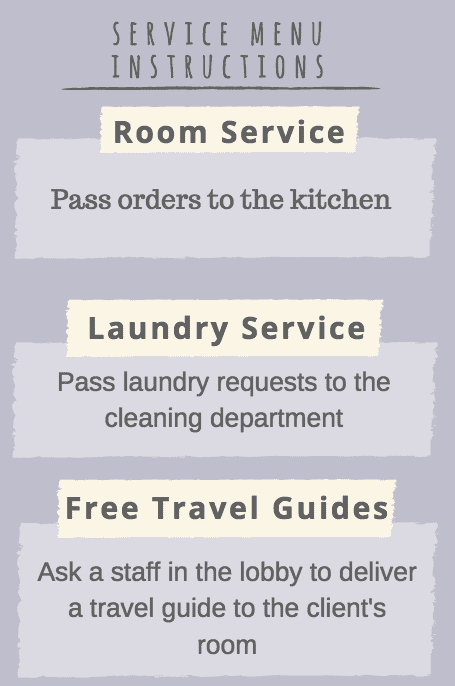

然后每个工作人员按照每个具体要求执行:

1.  厨房里的厨师开始做饭
2.  清洁部会派一名工作人员到我们的房间来取我们的衣服
3.  大堂的工作人员拿了一本旅游指南并把它送到我们的房间

让我们回顾一下刚刚发生的事情。

a.我们从菜单上选择了我们想要的服务，并把它们提交给礼宾部。

b.礼宾员把这些服务请求列成了一个清单。

c.挂断电话后，根据服务菜单的指示，礼宾员将我们的要求发送到相应的部门。

d.每个部门根据给定的请求执行。

### 让我们看看 Ruby 中的动作。

1.我们向门房提交了这三个请求:

2.这些请求被列入礼宾部记录的清单:

让我们看看实际情况(控制台):

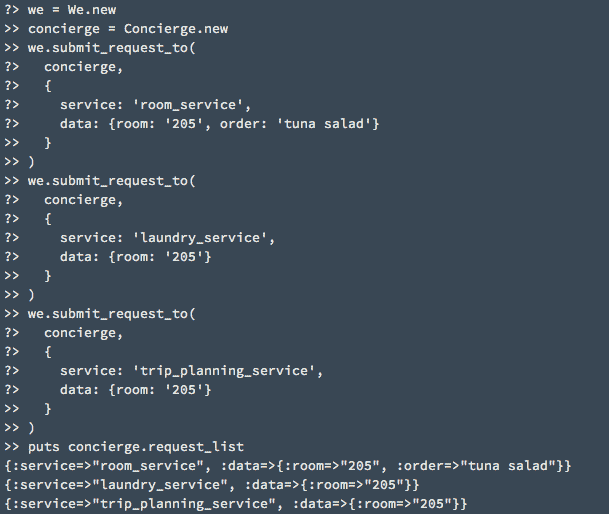

我们可以看到，`we`提交了三个请求后，这些请求都在`request_list`中由`concierge`处理。

3.根据服务菜单的指示，礼宾部将我们的要求发送到相应的部门。

上面的代码应该工作正常。

除了一件事…

它闻起来很难闻。

具体来说，我们有开关盒的部分:

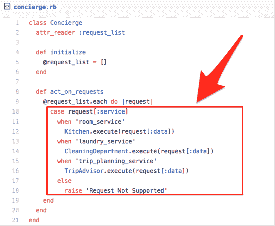

为什么这部分闻起来很臭？

1.  如果酒店提供 20 种服务，而不是 3 种，那么这个方法会很长。
2.  我们希望提供新的服务或删除现有的服务。然而，每次我们都必须打开`Concierge`类并重新定义`act_on_requests`方法。

方法知道的太多，需要经常改变。**将这两者结合在一起几乎总是一件坏事。**

为什么？

需要经常改变的方法是你需要经常更新的方法。每次你更新一段代码都是给系统引入新错误的机会。

当这个方法也知道很多东西时——而且很长——更新时出错的可能性会大大增加。这就是我们之前谈到的设计原则背后的推理——**概括了变化。**

### 是时候重构了！

一定有比这更好的办法:

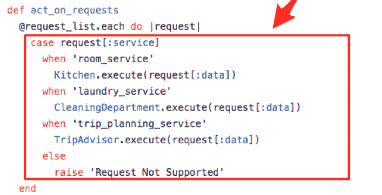

仔细看看，想一想。

让我们用英语重新表述一下代码在做什么。我们遍历请求列表上的请求。对于每个请求，根据其服务类型，我们给出相应的部门相关数据并执行请求。本质上，我们遍历请求并相应地执行每个请求。

但是如果每个请求实际上都知道如何执行自己呢？

那么该方法可以简单到:

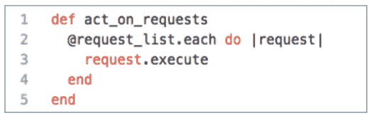

我们没有让`act_on_requests`方法决定每个请求应该如何处理，而是将责任和知识分配给每个请求，让它决定自己应该如何处理。

也就是说，我们的请求可能是这样的:

更新后的`Concierge`看起来会像这样:

有了更新后的代码，以下是我们酒店的顾客向礼宾部发送请求的方式。

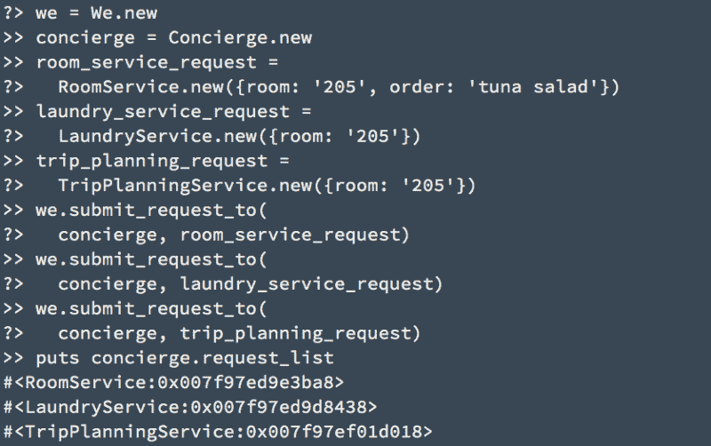

创建另一个服务非常容易。

例如，酒店还允许我们预订水疗:

该服务不仅支持`execute`(预订水疗)，还支持`undo`(取消预订)。

假设酒店还提供了另一种无需致电礼宾部即可请求服务的方式，即服务请求面板:

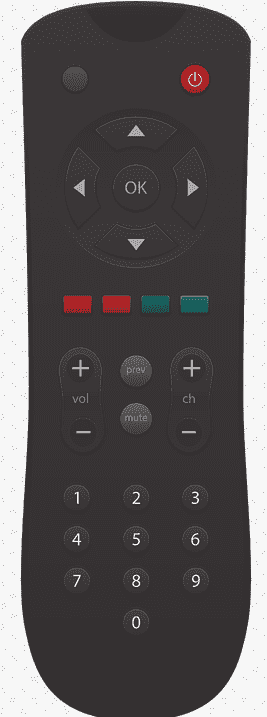

我们只要按一下按钮，默认设置的服务就会送到我们的房间。

下面是`ServicePanel`的代码:

下面是我们创建服务面板的方法:

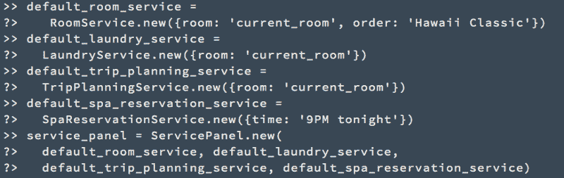

### ？？我们现在使用的是命令模式！？？

让我们重温一下命令模式的定义。它:

*   将请求封装为对象
*   从而允许您用不同的请求、队列或日志请求参数化其他对象，并支持可撤销的操作。

> 1."将请求封装为对象"

我们创建的每个服务类，`RoomService`、`LaundryService`、`TripPlanningService`和`SpaReservationService`，都是将请求封装为对象的一个例子。

概述:

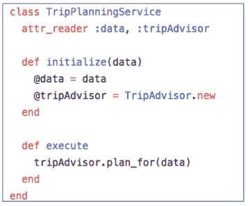

> 2.从而允许您用不同的请求参数化其他对象

`ServicePanel`是用不同的请求参数化一个对象的例子。

概述:

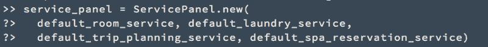

> 3."队列或日志请求，"

当门房通过电话处理我们的请求时，我们的请求正在排队。

概述:

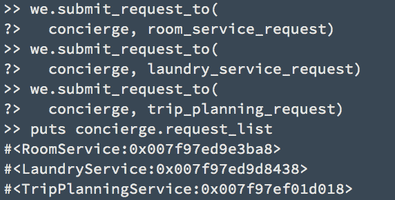

> 4.并支持可撤销的操作。

`SpaReservationService`支撑`undo`。

概述:

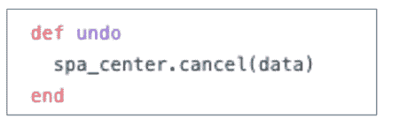

感谢阅读！

别忘了订阅。:D

这最初发表在我的博客上，[生活中的设计模式和 Ruby](http://www.sihui.io/design-patterns/) 。