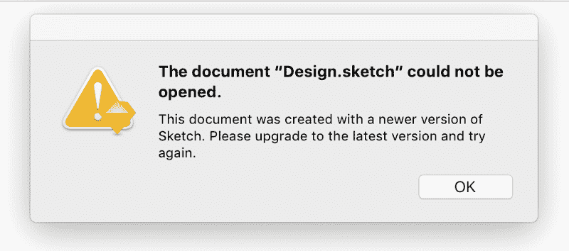

# 设计工具正在脱离正轨

> 原文：<https://www.freecodecamp.org/news/design-tools-are-running-out-of-track-94f21b6ae939/>

科尔姆·图伊特

# 设计工具正在脱离正轨。以下是我们解决这些问题的方法。

我几乎每天都在思考设计工具。几年前，我开发了一个设计工具，后来被漫威收购。那是两年前的事了，但从那以后，风景并没有太大的改变，我对改善它的热情也没有变。

最近，我发了一篇关于设计工具的微博——这是一件经常发生的事情。

那天我不是唯一一个说出自己想法的人，其他人也附和着。

2017 年 7 月 28 日对于设计工具来说并不是一个好日子。

在这些推特帖子中隐藏着很多深刻的见解，但是很长一段时间以来，我一直想花时间深入探究我认为当前设计工具模型的根本缺陷，以及我认为我们应该走向的方向。

### 我们都只是在画画。太疯狂了。

几乎所有流行的设计工具都可以导出到图像。这是有问题的，原因有很多:

1.  您无法与图像互动。原型工具使我们能够给图像添加屏幕过渡和简单的交互。然而，随着我们的产品继续要求更高级的屏幕过渡和微交互，图像根本无法跟上。
2.  图像不是流动的。通过图像传达响应性设计决策通常是一项困难的任务。
3.  图像不是有状态的。为了有效地传达 UI 的各种状态，通常需要许多图像。
4.  位图图像依赖于分辨率。随着视网膜设备的出现，图像有时会呈现不佳。
5.  图像文件往往很重，存储、管理或共享起来往往很麻烦。

只要设计工具继续输出图像，它们将*永远*无法产生我们产品的准确表现。这种缺乏准确性阻碍了设计者和开发者之间的交流。只要设计师继续使用一种非常不合适的媒介来传达他们的作品，那作品就会*总是*被曲解。

这是非常重要的一点，因为在其核心，几乎所有的设计工具都将矢量形状转换成图像。在这方面，Photoshop、Illustrator、漫威、Adobe XD、Sketch 和 Figma 都是一样的。然而，图像只能部分传达设计意图。随着我们的产品继续采用和支持复杂的交互、语音输入、视频输入、增强现实、虚拟现实、温度敏感性等。，这些工具提供的价值将迅速减少。基于图像的设计是一个死胡同。

我们的设计工具应该操纵*实际产品*，而不是它的图片。

### 我们的产品是互动的。我们的工具是静态的。

我在之前的观点中提到了这一点，但它非常关键，所以我想我应该详细阐述一下。

想想在我们几乎所有的产品中常见的简单交互的数量，但是却不能通过我们的设计工具进行交流。下面是我想出来的一个简单的清单:

*   悬停按钮
*   聚焦输入
*   选中复选框
*   选项卡式内容
*   滚动区域
*   聚焦状态的选项卡索引
*   快捷键

当然，这些特征中的一些可以通过一些黑客工程来模仿，但人们不得不怀疑，这到底有什么意义呢？为什么设计师不能只设计*实际产品？！最终，所有的模型都是一次性的，然而设计师们花了几个月的时间来完善它们。这些时间用在改进实际产品上会更好。*

我不会在“设计师是否应该编码”这个问题上走得太远，但我并不是建议我们都写代码。我只是说，我们的设计工具没有理由不支持直接操作我们的实时产品。

Framer 比这个部门的大多数人做得更好，支持高级和详细的交互。其余的狼群远远落在后面。

### 我们的工具应该支持网络的布局模式

直到大约一年前，在 web 上构建布局的唯一方法是使用`display: table`和`vertical-align` CSS 属性。现在我们有了 Flexbox，不久我们将有 CSS grid。这三个布局引擎的功能非常相似，都利用了 DOM 流。几乎所有的网站都是使用这三种布局系统中的一种来构建的。

因此，我们的设计工具支持相同的布局模型是有意义的。对吗？

几乎所有的设计工具都忽略了这些布局系统，而是选择将每一层完全定位在画板中。这在网络功能和我们的设计工具功能之间打开了一条鸿沟，引入了许多问题:

*   响应式设计变得非常困难，因为必须为每个断点手动重新安排每一层。或者，可以引入基于约束的布局系统，但这会增加复杂性，使学习曲线变陡，并最终阻止开发人员将布局直接转移到 web 上。
*   因为每一层都在文档流之外，所以操作内容变得很棘手。例如，如果要向列表中添加项目，必须手动重新定位列表中的其他项目。当然，可以引入重复函数和其他奇特的特性来减轻痛苦，但是这又引入了额外的复杂性，使 DOM 免费提供给我们的东西变得复杂。
*   绝对定位自然导致固定的像素坐标和维度。这滋生了不灵活性，并且，再一次，这是对网络功能的巨大背离。网络是建立在 em、rem、vh、vw 和%等流体单位上的。默认情况下，我们的工具应该支持这些单元。

设计工具不需要模仿或反映网络及其细微差别——它们应该只是网络。

### 单一的工具不是办法

好的设计是分阶段进行的。一个结构良好的设计系统有几个不同的层次:

1.  **风格调色板**
    颜色、阴影、间距、边框半径、字体、字体大小、动画和其他风格的集合，形成你的品牌身份。目前，大多数设计工具只支持调色板。在它们支持其他样式属性之前，系统地设计将是极其费力的。
2.  **资产**
    这包括图标、插图和图像等元素。有一些出色的图像编辑器，Figma 的 vector 工具也很出色，但是说到 SVG 支持，我们的设计工具还有很多不足之处。
3.  **组件库**
    组件是样式和资产的集合，它以各种变化将数据呈现给单个元素。示例包括按钮、输入、徽章等。正如我提到的，Figma 和 Sketch 最近已经将这个过程从主绘图流程中抽象出来——遗憾的是它们只是组件的图片，而不是真正的*T4 组件。*
4.  模块
    模块/组合是以各种状态将数据呈现给一个封装的用户界面的组件的集合。示例可能包括标题栏、选项卡菜单、登录表单、表格等。由于模块只是复杂的组件，我猜 Figma 和 Sketch 也能处理这些。尽管将两者分开可能有一些好处。
5.  **屏幕**
    屏幕是模块、组件和数据的集合，形成用户可以与之交互的完整 UI。

大多数设计工具都提供了至少在某种程度上支持这些设计阶段的特性。问题是所有的阶段都被混为一谈了。几乎所有的设计工具都只提供一种模式——绘图模式。你创建了一套画板，然后开始画图。直到最近，像 Sketch 和 Figma 这样的工具才从主绘图模式中抽象出组件/符号——这很奇怪，因为在前端开发中，组件已经被抽象了很多年。

设计风格面板时，我不需要看到画板或矢量工具。我想看看选择和谐颜色的工具。我想要像 8dp 间距标度或选择类型标度这样的东西的预置。

设计一个图标需要一种与设计用户流完全不同的思维模式。一个简单的 SVG 编辑器，允许我绘制本地 SVG 矩形，圆形，直线和路径，然后导出优化的 SVG 代码将是理想的。

当设计一个组件时，我不应该再考虑单独的样式——我应该简单地从我预先定义的样式调色板中选择样式。我不能只开始调整一个组件的样式，因为那会引入不一致性，稀释我的设计系统的有效性。一旦样式面板就位，它应该只能在源代码中编辑。

类似地，在构建模块时，我应该只暴露给我的预定义组件库。侧边栏中不应该有样式属性。没有矢量工具。只是一个可重用组件库，我可以拖放组成模块。

组成屏幕也是如此。此时，我们只是重用组件和模块来构建 UI。我们不考虑风格或形状或其他创造性的努力。我们主要专注于设计内容和用户流。

这些设计阶段中的每一个都可以在完全独立的工具中进行，或者在同一工具中以不同的模式进行。我觉得没多大关系。不过，有一点是肯定的，大多数当前的设计工具甚至没有认识到这个过程。

### 我们的工具应该鼓励好的设计

设计师拥有罕见的奢侈，能够在一个项目中添加无限数量的独特风格，而没有任何明显的反响。需要稍微大一点的字体？把它抬高。没什么大不了的。需要稍微亮一点的颜色吗？只是调整一下。很酷。您甚至可以在同一个项目中创建多个画板，每个画板为相似的样式使用稍微不同的值，这可能会被忽略。

你的设计工具永远不会告诉你你不能做某事。使用非品牌颜色永远不会让你停下来。它永远不会阻止您使用不属于间距范围的空白值。它永远不会警告你 20%的人看不到你刚刚设计的浅灰色文本。

为什么不……？因为设计工具不在乎。

设计工具如此任性地迷恋于无限创造力的愿景，以至于他们已经看不到什么是明智的设计，包容性的设计，系统化的设计。

简单地说，设计工具允许我们做任何我们想做的事情。在某种程度上，这种无限的创造力是有用的，尤其是在构思阶段。作为 UI 设计师，我们的大部分工作流程并不需要太多的创造力。相反，我们的工作流程要求重用、重复、熟悉和标准化；我们的工具很难满足的需求。

这种无限制的自由与 web 开发的现实相矛盾。由于开发人员正在使用*实际的*产品，他们必须使用相同的代码。开发人员不能简单地将孤立的字体大小或随机的颜色值添加到代码库中。首先，linter(一个警告写得不好的代码的警告消息)可能会立即开始尖叫。如果没有，那么他们拙劣的技术可能会在代码审查中被发现。如果它设法从裂缝中溜走，一个明显的性能影响最终会敲响警钟。

我在产品团队中看到的最具破坏性的问题之一是设计和开发团队之间的脱节。多年来，开发人员一直在严格的指导方针和约束下工作。除非我们的设计工具采用同样的约束，否则差距将永远不会缩小。

### 我们应该用实时数据进行设计

很多工具已经在一定程度上整合了实时数据，这很好。Adobe XD 有一些非常好的功能，可以生成类似典型实时数据的假数据。 [Invision Craft](https://www.invisionapp.com/craft) 还为 Sketch 提供了一些很酷的现场数据功能。

然而，实时数据不应止于文本。图像和视频等其他元素会显著增加加载时间，从而对用户体验产生巨大影响。如果你在网上工作，浏览器开发工具允许你调节连接，以适应不同的网速。然后，您可以直接看到一条新内容如何影响用户体验。

我们的设计工具能给我们带来这些奢侈品吗？

一句话:不会。

我们越接近设计实际的产品，我们的设计工作就越有帮助和影响力。

### 网络是开放的。我们的工具也应该如此。

网络真正美丽的一面是它的开放性。几乎可以在任何设备上的任何网络浏览器中浏览网站。

这与设计工具相比如何？几天前，我哥哥大卫向我要一份他正在开发的应用程序的设计评估。他给了我一份素描文件。当我打开它时，发生了这种情况…

大多数设计工具都是围墙花园。如果一个同事在 Photoshop 中工作，另一个同事无法在 Sketch 中打开该项目。让整个团队使用同一个工具是不够的——他们还必须使用该工具的同一个版本。

漫威和菲格玛在这方面做得很好，提供免费计划和创新的协作功能。

### 那么，设计工具的未来是什么样的？

设计工具的创新非常有价值，最近已经有很多了。在 Airbnb 设计工具公司，[乔恩·戈尔德](https://twitter.com/jongold)和[本杰明·威尔金斯](https://twitter.com/thatbenlifetho)一直在从事 [React-Sketchapp](https://github.com/airbnb/react-sketchapp) 的工作，该软件采用 React 组件并在 Sketch 中渲染它们。乔恩和本还在开发一个令人兴奋的新工具，它可以将餐巾纸草图转化成 React 组件。

[亚当·摩斯](https://twitter.com/mrmrs_)、[布兰特·杰克森](https://twitter.com/jxnblk)和[约翰·奥坦德](https://twitter.com/4lpine)正在[合成器](https://twitter.com/getcompositor)开发一套工具，这套工具基本上[解决了本文中的所有问题](https://twitter.com/getcompositor/status/897946464269291521)甚至可能是世界上的问题。

我正在开发 [Modulz](https://www.modulz.co) ，这是一个新的设计工具和开源设计系统，也旨在解决我在本文中提到的问题。如果你感兴趣，请在[推特](https://twitter.com/Modulz)上关注更新。

虽然工具的创新很重要，但真正的挑战是教育。设计社区还没有为系统化的设计工具做好准备。许多设计师对建筑系统几乎没有兴趣。对一些人来说，JPG 是终极目标——喜欢滴水。

我们需要以某种方式激发问责文化。多年来，开发人员一直有一种负责任的文化。他们有工具来检查他们的代码。如果开发人员反复偏离他们严格的代码指南，你可以肯定这个问题会得到解决。

与此同时，设计师经常在完全混乱的状态下堆积如山的图层，很少考虑图层的命名、分组和排序。每个人都有自己的想法。因为输出(光栅图像)不受输入(矢量图层)的影响，所以设计者没有真正的组织负担。设计师经常通过将设计艺术浪漫化来为这种缺乏组织性找借口，将自己描绘成魔术师，需要让他们自己去表演。

我们还必须激发一种包容的文化。我们应该积极阻止一些弊端，比如超浅的文本颜色会让很多人难以阅读，超高质量的字体会让网页加载缓慢，或者无模式的用户界面元素会让色盲人士难以理解。目前，这种类型的弊端在设计界受到欢迎。如果我们要欢迎智能设计工具，我们必须扭转这种文化。

如果一个系统的设计工具要赢得我们的心，它必须首先教育。