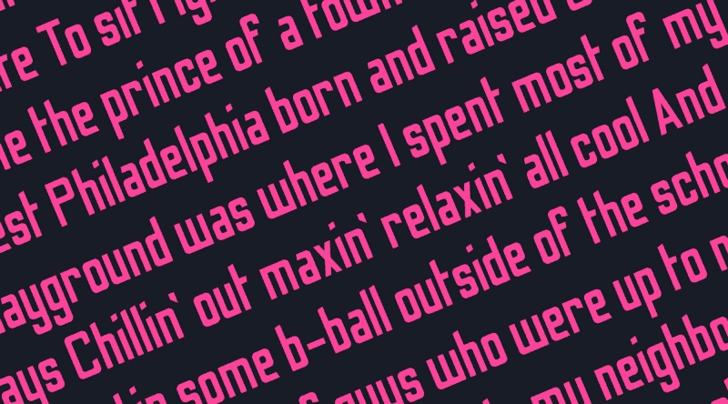
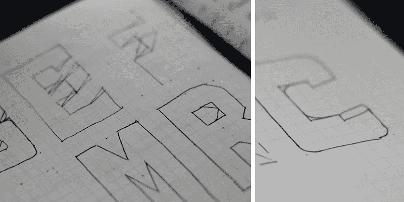
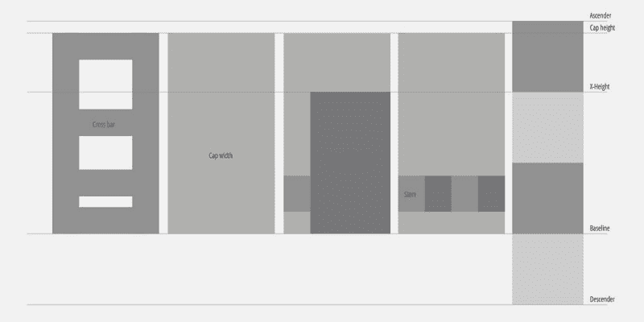
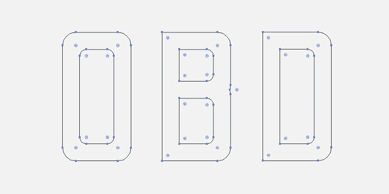
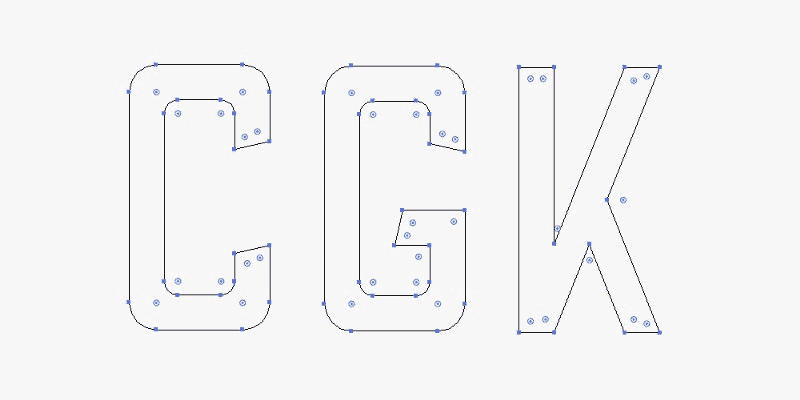
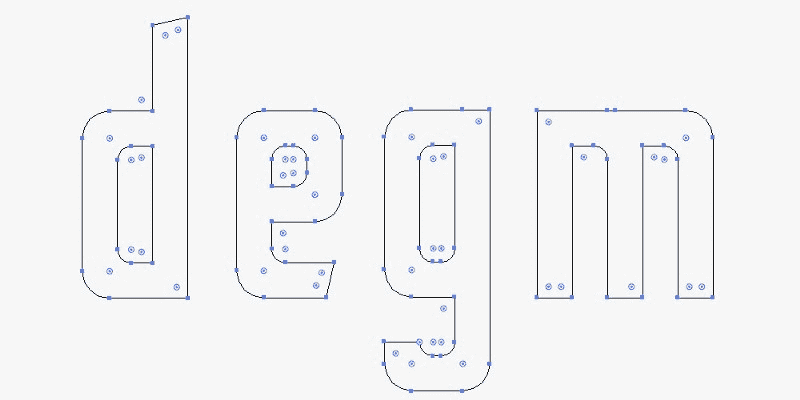
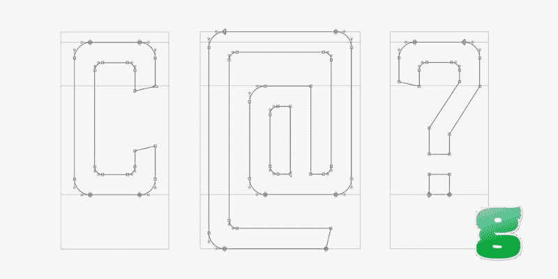
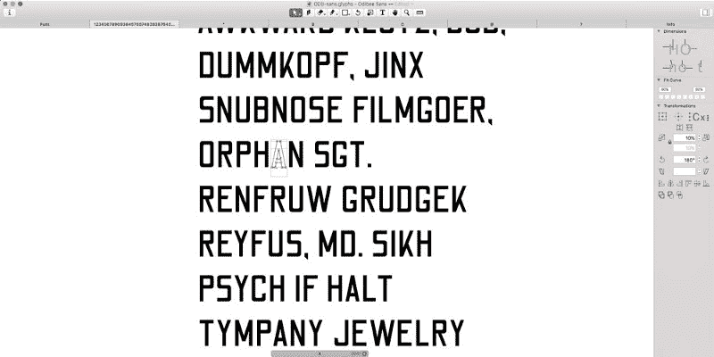
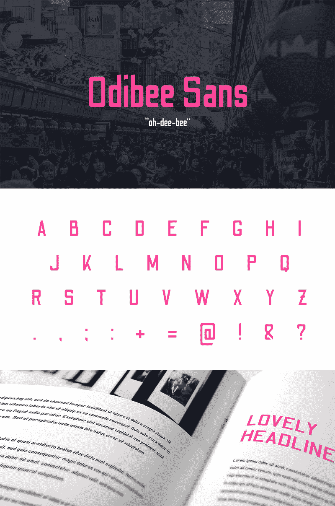
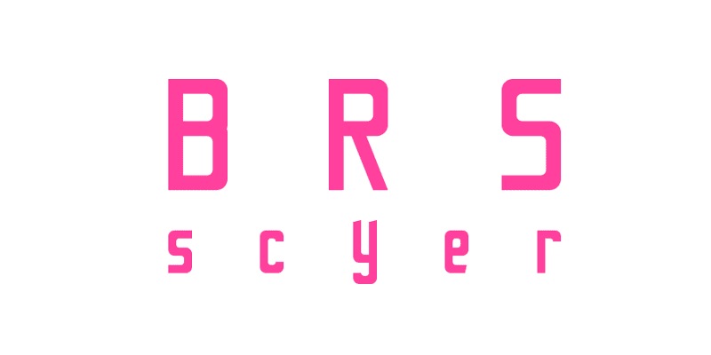

# 从头开始设计字体，并在 24 小时内提交给谷歌字体

> 原文：<https://www.freecodecamp.org/news/designing-a-font-from-scratch-and-submitting-it-to-google-fonts-in-24-hours-152a30c57095/>

詹姆斯·巴纳德

# 从头开始设计字体，并在 24 小时内提交给谷歌字体

### 一天建成

我是亚当·沙维奇的《一日建成》的超级粉丝。在一天的开始，他从一堆材料开始，最终拿着他曾经梦寐以求的东西([这是我最喜欢的](https://www.youtube.com/watch?v=-tUHJnl8qPM))。

所以带着这个想法(和一天的休假)，我给自己设定了一个挑战…

> 从头开始创建一个全新的字体，并在 24 小时内提交给谷歌字体。

我已经在一个旧笔记本上草拟了几封信。我想创建一个高，无衬线，显示字体，可用于海报，或大规模的艺术品。我在《男性健康》工作的早期，我不得不使用像“钨”或“T0”Heron 这样的字体，这对于大块的正文来说很糟糕，但用在标题或宣传材料中(这是我在那里的主要工作)却令人惊叹。这是我开始创造的风格。

(Very) rough sketches. Ugh.

### 周三下午 1 点

我拿着我画的两三种字体直接去找 Adobe Illustrator。我在画板上设置了五条网格线，下行线、基线、x 高度、封顶线和上行线各一条。然后，我决定了大写字母的宽度，并由此决定了字干的粗细(例如，字母 *I* 的宽度)。

我做了大量关于字母比例的研究，并实际测量了一些现有的字体，找出小写字母与大写字母的关系。从这里，我制定了一些规则:

*   X-height = 2 ×上升/下降高度。
*   词干宽度= 1/4 大写字母宽度
*   小写字母宽度= 3/4 大写字母宽度

The rules, illustrated.

从这里开始，我首先创建了字母 O 和字母 B*。我做了一个决定，任何通常有曲线的字母，将有一个圆角代替。大多数字母会是高高的方块形状，但是对于像 *O* 、 *B* 和 *D* 这样的字母，带有曲线的边缘会有圆角。*

外角半径为 12 毫米，内角半径为 6 毫米。同意了这些规则，加上我的横杆的高度(横过字母 *H* )我开始制作我的大写字母。

我的字体非常简单，但是有一个定义“繁荣”，如果你愿意的话。任何缝隙，如字母的开口，如字母 *C* 的切口，或任何弧形的末端，如字母 *J* 的弯曲末端，都将被切割成一个角度。这里最难的字母是 *G* 和 *K* 。

完成大写字母后，我开始学习小写字母。这无疑更难，但随着我的规则达成一致，这只是一个通过他们翻腾的情况。我在这里用了更多的“华丽”，尤其是在上行和下行的结尾。字母 *f* 、 *g* 、 *a* 和 *e* 是最棘手的，因为它们是全新的款式。

### 星期三晚上 9 点

我现在开始学习一些额外的符号，比如问号和感叹号。我加快了步伐，睡觉前我已经设法完成了其中的 35 个。

### 周四上午

早上，我很快地完成了数字 0 到 9，然后开始创建字体文件。

这是一个全新的领域。twitter 上的书法家朋友伊恩·巴纳德(Ian Barnard)(用我的姓)推荐了一个名为[字形](https://glyphsapp.com/)的程序，你可以下载免费试用 30 天。

我下载了 Glyphs Mini，看了几个教程视频，然后意识到我设置的 illustrator 文件完全错误。所以我不得不手动粘贴每个字符，并将其放大以匹配应用程序中的指南。

### 星期四上午 10 点

我的角色就位后，我开始调整字母的间距和字距。这一部分非常耗时。在这个应用程序中有一系列键盘快捷键，在开始之前，你绝对*必须*掌握这些快捷键。在开始字距调整之前，你必须让你的字母间距尽可能接近你想要的文件外观。

显然，作为一个经验法则，测量字母 *O* (中间的洞)的计数器的宽度，然后除以三。这就是你应该从字母左右两边开始的间距。

### 周四上午 11 点

随着间距的设置(考虑到像 *M* 和 *W* 这样更宽的字母)，我开始字距调整。这是一个非常艰苦的过程。我访问了[这个网站](http://logofontandlettering.com/kernking.html)，并粘贴了他们的示例字距调整文本。

使用键盘快捷键([使用本教程](https://glyphsapp.com/tutorials/kerning))我吃力地通过并调整每一个我觉得不合适的距离的字距组。显而易见的是在 *V* 和 *A* 之间，但是在那个例子中有这么多我没有想到的字母配对。

完成后，我将字距调整文本转换为全部大写，并重新做了一遍，将大写字母配对。

### 周四中午 12 点 59 分

我导出了我的字体，并将其转换为一个. ttf 文件，准备提交给谷歌。由于仍然缺少相当多的字形(如方括号和版权符号)，我确信它不会被接受。我也没有时间包括全面语言支持所需的众多口音。

这不是最好的字体，但对我的第一次尝试来说还不错。考虑到我不得不从头开始自学如何使用 Glyphs 软件，而且只用了一天就完成了，我感到非常自豪！

### 名字？

> 欧帝比·桑

…发音为“哦-迪-比”。我自己的“一天建成”(ODB)。

### 编后记

我在 2017 年 5 月向谷歌字体团队提交了 Odibee Sans，目前该字体仍在[他们的管道中添加](https://github.com/google/fonts/issues/952)。团队非常正确地建议我应该在字体上花一些额外的时间来完善设计(尽管他们承认这违背了项目的精神)。

考虑到这一点，我在字体上多花了一天时间。我已经添加了所有扩展拉丁语支持所需的额外符号(我认为)。我还对大约 30 个字形进行了一些重大修改，包括字母(大写)S、B、R 和小写字母 S、c、y、a、e、R、f、t、p、q 和 j 的新样式，以及一些数字调整。

除此之外，现在有超过 1500 个字距对，这对字体做了巨大的改进。

我还做了一个网站！[**odibeesans.com**](http://odibeesans.com/)

**这个网站也是用 Adobe Muse 在一天内完成的。[更多信息请点击这里。](http://barnard.co/how-i-launched-a-website-in-a-day-with-adobe-muse/)**

****

**感谢阅读！我很乐意阅读你可能在一天内完成的任何项目。这是一个相当有效的技术，如果你能抽出时间(上帝保佑自由职业者的生活方式)！**