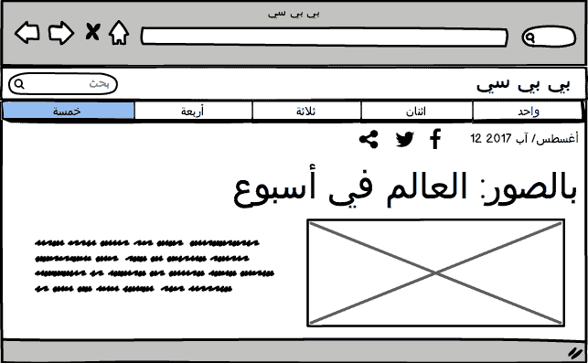
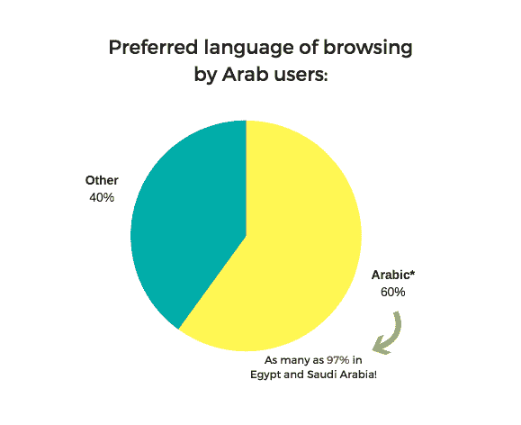
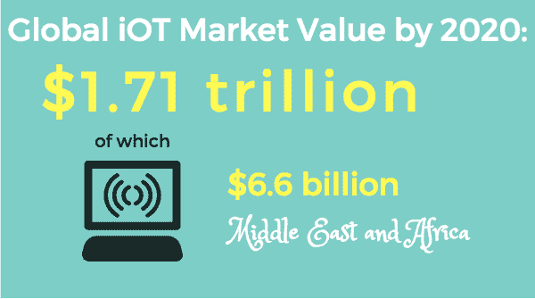
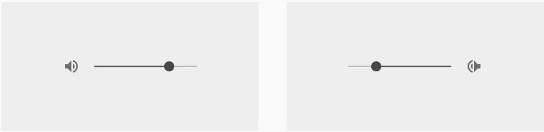
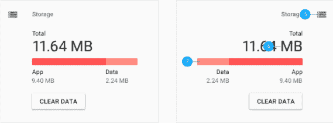
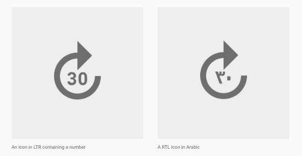
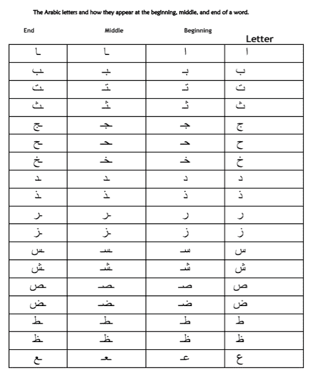
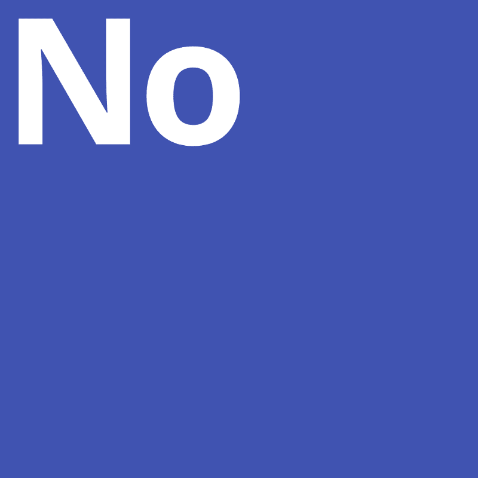

# 为阿拉伯用户设计—商务基础阿拉伯语 UX

> 原文：<https://www.freecodecamp.org/news/designing-for-the-arab-user-basic-arabic-ux-for-business-6ff29d4c7c60/>

安娜·鲁布凯维奇

# 为阿拉伯用户设计—商务基础阿拉伯语 UX

**你将在这篇文章中读到什么:**

*   阿拉伯语界面的镜像布局是关键，但也有其局限性，
*   在阿拉伯语中，数字是从左到右书写的，尽管有从右到左的界面，
*   将文本翻译成阿拉伯语不足以创建阿拉伯语界面，
*   不是所有的单词都可以用阿拉伯语 1:1 翻译；有些会产生很长的描述性短语，
*   阿拉伯文字通常需要比罗马字母更大的字体，
*   明智的做法是让阿拉伯用户参考英文内容(全球只有约 5%的内容是阿拉伯语)。

作为一名拥有超过 10 年经验(英语、阿拉伯语和波兰语)的翻译，以及负责[快速消费品](https://en.wikipedia.org/wiki/Fast-moving_consumer_goods)产品数据库开发的前初创公司员工，我不禁注意到，在内容和以用户为中心的设计方面，阿拉伯世界的代表性明显不足。有趣的是，与世界其他地区相比，中东的互联网普及率并不高。截至 2017 年 3 月 31 日，该地区用户近 1.42 亿。这意味着 57.4%的居民上网——相比之下，世界平均水平为 49.2%。

与此同时， **60%的阿拉伯人(在沙特阿拉伯和埃及高达 97%)宣称，在网上浏览或购物时，阿拉伯语将是他们的首选语言**。同时，**只有 5%的全球内容是用那种语言的** ( [2](https://arabiangazette.com/an-online-arabic-content-revolution-in-the-making/) ):

国际数据公司(IDC)的一份报告也表明，到 2020 年底，全球物联网市场的价值将达到 1.71 万亿美元，其中 66 亿美元将来自中东和非洲。

上述统计数据证明，中东社会与世界其他地方一样精通技术，在社交媒体上也很活跃。那么，为什么他们必须求助于英语网站和服务来充分受益于新技术呢？此外，为什么公司没有调整自己适应当地的社会、语言和文化特点，从而错过了该地区令人难以置信的商业潜力？

这不仅仅关系到曝光度有限的小公司或小设计团队。正如 UX 咨询公司 Yalantis 所注意到的，即使是渴望成为创新设计领导者的苹果公司，也没有针对 RTL(从右到左)用户全面调整其 iOS，直到 2015 年底发布 iOS 9([5](https://yalantis.com/blog/japanese-chinese-and-arabic-layouts-in-user-interface-and-user-experience-design/))。

最后，我们可以为阿拉伯用户做些什么，让他既能使用自己的母语，又能从丰富的英语资源中受益？

下面列出了为阿拉伯母语人士设计时需要考虑的几个方面，包括他们的时间顺序感、显示等。，不同于在 LTR-script 国家长大的用户。

**镜子，镜子**

镜像经常被称为任何想在阿拉伯世界推出应用程序的人都应该遵循的 101 规则。虽然这是一个概括，但主要概念是 RTL 布局应该反映为 LTR(从左到右)用户创建的布局。虽然西方世界的大多数运动图像是从左到右显示的(例如，超速行驶的汽车的广告)，但使用阿拉伯文字的国家(不仅是中东，还有伊朗和巴基斯坦)，如果从右到左显示，更有可能感知前进和向前运动。

While the man to the right is, in fact, running from right to left, I’m pretty sure the story was intended to be read from left to right… Source: [http://gosmellthecoffee.com/archives/9570](http://gosmellthecoffee.com/archives/9570)

谷歌的材料设计指南详尽地解释了这一点，其中包括方向图标(代表“前进”和“后退”的图标)以及其他指示运动的符号和图标。然而，这并不意味着所有的符号都要相应地改变。必须记住，阿拉伯人同时也是 LTR 界面和程序的用户，因此，某些符号(想想脸书或谷歌搜索)不需要改变。

Examples of mirroring — as you can see, storage space and volume are shown from right to left.

Examples of icons that do not need mirroring when used in a RTL interface.

An interesting application of two rules — the direction of the icon is not mirrored, but the number is changed for the Arab user (here, Hindu-Arab digits are used, which are still simultaneously used in the Arab World, along with Arabic numerals). All of the above examples cited from: [https://material.io/guidelines/usability/bidirectionality.html#bidirectionality-rtl-mirroring-guidelines](https://material.io/guidelines/usability/bidirectionality.html#bidirectionality-rtl-mirroring-guidelines)

镜像的另一个重要限制是**双向性**，这不仅常见于阿拉伯语，也常见于东亚文字。也就是说，虽然文本是右对齐的，但数字仍然是从左向右读取的。这对设计师来说意味着什么？他或她应该小心，并考虑到如果布局设计不合理，一长串数字可能会与阿拉伯文字“冲突”。

阿拉伯语句子中的数字示例:

فيفترةمابينالحربينالعالميتين**1919–1939**英语:*在两次大战之间的几年里:1919–1939(注意第一个日期写在右边，结束日期写在左边，尽管数字是从左向右读的)。*

波兰在 2007 年 12 月的人口为“T0”、“2007”、“T1”、“大约”、“T2”、“38，116，000”、“T3”、“人口”、“T4”和“英文”:2007 年 12 月，波兰人定居人数为“T5”、“38，116，000”、“T6”。

一个有趣的事实是，阿拉伯人目前也使用印度-阿拉伯数字(如上所述)，也是从左向右书写。

**翻译和验证**

我要强调的是，雇佣一名翻译将文本翻译成阿拉伯语并创建一个阿拉伯语版本的网站/应用程序不仅仅是一件简单的事情。这是一个半悲剧，看到一个 LTR 的设计与阿拉伯文字的应用，而不是，比方说，英语文本。当公司尝试使用阿拉伯文字，但是在 CMS 或编辑器中处理文本后，字母会散开，不再形成单词，这是一个完全的悲剧——我已经目睹过多次了。唯一比混乱、不切实际的设计更糟糕的是，阿拉伯字母在屏幕/书籍/产品封面上断开连接，不再构成单词。

这是一个常见的错误，其根源在于阿拉伯字母根据它们在给定单词中的位置而呈现不同的形状:

Source: [http://tjhomeschooling.blogspot.com/2015/11/thm-sadaqa-group-has-nice-simple-arabic.html](http://tjhomeschooling.blogspot.com/2015/11/thm-sadaqa-group-has-nice-simple-arabic.html)

如果我们不知道如何阅读阿拉伯文字，我们就会面临整个句子无法阅读的风险。下面的示例显示了两个错误:

*   这些字母是孤立的形式(所以不构成单词)
*   字母是从左到右写的，而不是从右到左(所以，倒着写)。

Source: [http://www.arabicgenie.com/wp-content/uploads/2009/08/disconnected-lefttoright.jpg](http://www.arabicgenie.com/wp-content/uploads/2009/08/disconnected-lefttoright.jpg)

因此，最好总是让一个说阿拉伯语的人在将任何翻译文本投入生产之前校对。此外，如果有一种字体我会推荐用来将文本翻译成非罗马文字，那就是谷歌设计的通用字体[**【Noto】**](https://www.google.com/get/noto/)。这至少会消除“豆腐渣”风险:

Source: [http://www.monotype.com/resources/case-studies/more-than-800-languages-in-a-single-typeface-creating-noto-for-google/](http://www.monotype.com/resources/case-studies/more-than-800-languages-in-a-single-typeface-creating-noto-for-google/)

**一对一翻译**

避免技术错误并不是唯一需要注意的事情，因为逐字翻译也不总是能解决问题。虽然某些阿拉伯国家在没有对等词的情况下可以自由使用外来词，但有些国家更喜欢使用描述性的翻译。第一种情况尤其适用于为年轻客户设计的应用程序，这些应用程序通常是用当地方言创建的。其他应用程序，如用于工作或学术目的的应用程序，适用于多个阿拉伯市场，更有可能用现代标准阿拉伯语(MSA)编写，这是非常正式和标准化的。因此，一个由 10 个英文字母组成的单词翻译成正式的阿拉伯语，可能会产生一个由 2 到 3 个单词组成的描述性阿拉伯语短语(因此会占用更多空间)。此外，请注意，阿拉伯语中的缩写相对较少，因此没有捷径。

以下是一些阿拉伯语单词及其翻译的例子(注意单词的长度):

电视-∞这是一篇借阅:te-le-fee-syoo-n)

kfc 肯塔基州的鸡

tvshow——电视节目

另一个挑战是，大多数阿拉伯字母是连在一起写的，许多都有圆点(看看:ب、ت、ج、ث、ي)，在某些情况下，音调符号(元音的小符号)写在字母上方(在这里读成)。这一切都意味着，为了让最终用户阅读起来更舒服，**可能需要比英语中相同单词使用的字体更大的字体**。

以下示例显示了比英文文本大 3 磅的阿拉伯字体(第一个图像)和相同大小的字体(第二个图像):

> 要阅读更多关于阿拉伯字母的内容，请点击[此处](http://www.arabic-course.com/arabic-alphabet.html)。

我在一家以快速消费品为目标的初创公司工作时，也做过类似的语言工作。这款产品是一款日常购物应用，适用于说波兰语和英语的人。最初的 JSON 文本是用英语写的，然后被翻译成波兰语，并最终在苹果商店和 Google Play 上面向说波兰语的用户推出。虽然波兰语词汇丰富，而且源语言和目标语言都是 LTR 脚本，但翻译所有文本字符串以使它们不扰乱布局，并在两种语言中保持一致的交流风格(随意)是一个相当大的挑战。因此，译者参与设计流程、接触原型并了解每个翻译文本在应用程序中的位置至关重要。

**英语互联网作为一种选择**

虽然各种报告表明，阿拉伯用户在网上，非常希望浏览和使用阿拉伯语的服务，但在线业务和服务需要数年时间才能提供数量和类型的内容，使单语体验成为可能。设备界面，完全可用的阿拉伯语，是一回事；另一个是执行一个任务，例如用阿拉伯语搜索一个复杂的主题或在线购买，并找到给定语言的足够信息。

维基百科的参考系统是一个很好的例子，如果用户选择的语言不够，他们可以参考英文信息。其他网站也可以成功地采用同样的方法——阿拉伯语界面用户可以参考英语内容，或者英语结果可以并入阿拉伯语搜索的结果中。

这肯定会增强用户体验，并在实际上提高某项服务的销量和曝光率。假设我们有一个库存产品，但是除了产品名称之外，没有任何阿拉伯语内容。这不应该阻止我们用英语向阿拉伯消费者展示产品信息——如果用英语描述、交货条款和供货详情代替空白字段，他或她更有可能购买。一个适当设计的接口应该使这种灵活的 LTR 和 RTL 混合成为可能。

**结论**

为阿拉伯文字用户设计不仅仅是将内容从外语翻译过来。它需要考虑、关注细节，并且意识到，虽然镜像等常见做法可能适用，但阿拉伯用户已经习惯了从左到右界面的某些工具和解决方案。企业应该观察中东和北非市场、当地创业场景、在线趋势和社会政治变化。这一点，以及我将在以后的帖子中讨论的其他观点，将为阿拉伯市场提供一种一致的沟通和交付服务的方式。

*如果您正在为您的业务/项目寻找**阿拉伯 UX 咨询**，非常欢迎您通过我的 [LinkedIn](https://www.linkedin.com/in/annarubkiewicz/) 页面与我联系。*

*喜欢这篇文章吗？你可能也会喜欢我关于朝觐的[**UX**](https://medium.com/@anna.rubkiewicz/the-ux-of-hajj-new-technologies-for-the-modern-pilgrim-3af9c6dad1c)和 [**彻底改造阿拉伯字体**](https://medium.com/@anna.rubkiewicz/reinventing-arabic-type-old-meets-new-5183239d4d96) 的文章。*

**推荐阅读:**

创建阿拉伯语界面的三步指南:
[http://UX Bert . com/designing-an-Arabic-user-experience-usability-Arabic-user-interfaces/](http://uxbert.com/designing-an-arabic-user-experience-usability-arabic-user-interfaces/)

哈佛商业评论对阿拉伯消费者的理解:
[https://hbr.org/2013/05/understanding-the-arab-consumer](https://hbr.org/2013/05/understanding-the-arab-consumer)

关于阿拉伯世界网页设计的轰动杂志:
[https://www . smashingmagazine . com/2010/09/showcase-of-Web-Design-in-the-Arab-World/](https://www.smashingmagazine.com/2010/09/showcase-of-web-design-in-the-arab-world/)

为什么设计阿拉伯字体这么难:
[https://www . wired . com/2015/10/why-its-so-hard-to-design-Arabic-typefaces/](https://www.wired.com/2015/10/why-its-so-hard-to-design-arabic-typefaces/)

CXPartners 阿拉伯语网站设计资源:
[https://www . CX partners . co . uk/our-thinking/Arabic-website-design-resources/](https://www.cxpartners.co.uk/our-thinking/arabic-website-design-resources/)

对为乌尔都语使用者设计感兴趣的人的一篇引人入胜的文章和应用:
[http://wahibhaq . com/blog/introducing-Urdu-font-comparator-app/](http://wahibhaq.com/blog/introducing-urdu-font-comparator-app/)