# 色彩设计

> 原文：<https://www.freecodecamp.org/news/designing-in-color-abd358660a7b/>

色彩在设计师手中是一种强大的力量。它吸引你的目光，唤起情感，传达意义。为了让你了解颜色有多重要，在一项被广泛引用的名为[颜色对营销的影响](http://marketingology.nl/wp-content/uploads/2015/03/impact-of-color-on-marketing.pdf)的研究中，研究人员发现，对于某些产品，人们对产品做出的 90%的快速决策可能仅基于颜色。

所以有效地使用色彩对设计来说很重要。但是想出不同的颜色组合也很难。每种颜色都有自己的含义，而且有无数种组合。

这篇文章旨在作为一个指南，帮助你为你的设计提出调色板。它鼓励你探索更多的颜色，这将有助于你培养良好的颜色组合的直觉。

> 随着你对颜色探索的深入，你会对好的颜色组合有一种直觉。

### 选择调色板

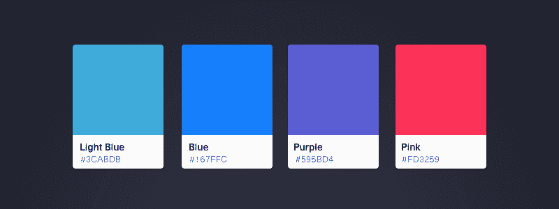

[Pretty fly for a color palette](https://dribbble.com/shots/2684569-Color-Palette-Sketch-Template)

有时调色板是突然灵感的结果。但大多数时候，它来自于采取系统的方法。

#### 确定目的

在做任何事情之前，首先要确定你设计的目的。好的设计让它的调色板与其目的一致。

问自己以下问题:

*   你想用你的设计传达什么信息？
*   你设计的目的是什么？为了增长见识？为了说服？
*   你希望你的设计唤起什么情感？

你设计的目的应该作为你选择调色板的指南。

#### 确定你的受众

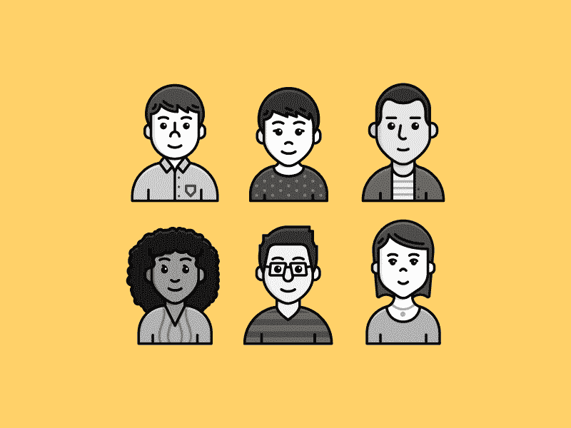

[Who is your audience and how does that affect your design?](https://dribbble.com/shots/2305976-Qualtrics-Target-Audience-Illustrations)

人们对颜色的感知是不同的。正如费尔柴尔德所说，颜色是观察者产生的一种心理现象。基于个人喜好、文化教养和经历，颜色对人有不同的影响。因此，为了了解人们对你的设计的反应，你需要确定你的受众。

虽然颜色的一些含义在观众中是通用的，但其他的却不是。绿色普遍代表自然，因为它是植物的颜色。然而，像红色这样的颜色在不同的文化中有不同的解释。在西方世界，红色与火、暴力和战争联系在一起。它也与爱和激情联系在一起。然而，像中国这样的国家将红色与繁荣和幸福联系在一起。

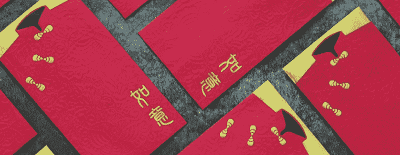

[Chinese red envelope](https://www.behance.net/gallery/34018164/ECESIS-Ang-Pow-Design)

因为颜色有很多不同的含义，所以将你作为设计师的心理色彩模型与你的观众的心理色彩模型相匹配是很重要的。

要阅读更多关于颜色在不同国家和人口统计中的含义，请查看[营销和品牌中的颜色心理学](https://www.helpscout.net/blog/psychology-of-color/)和[颜色的含义](https://www.smashingmagazine.com/2010/01/color-theory-for-designers-part-1-the-meaning-of-color/)。

#### 回顾色彩理论

选择调色板时，了解一点色彩理论有时会有所帮助。[色彩理论](https://en.wikipedia.org/wiki/Color_theory)是配色的逻辑结构和实用指南。它包含了从色轮到各种颜色含义的所有内容。

一本好的入门书是 Draw Paint Academy 的《艺术家色彩理论综合指南》(T0)和 Hubspot 的《T2 色彩理论 101》(T3)。你可以在[中读到色彩理论的一个有趣应用，为什么脸书是蓝色的？营销中色彩背后的科学](http://www.fastcompany.com/3009317/why-is-facebook-blue-the-science-behind-colors-in-marketing)。

#### 寻找灵感

有时候很难想象出适合你设计的颜色。没关系，大艺术家*偷*。或者说，他们从其他艺术家那里获得灵感。

调色板灵感通常来自于像 [Dribbble](http://dribbble.com) 和 [Behance](https://www.behance.net/) 这样的网站。如果你想为材料设计这样的特定设计风格寻找色彩灵感，你可以使用像 [MaterialUI](https://www.materialui.co/colors) 这样的网站。在 [FlatUIColors](https://flatuicolors.com/) 可以找到平面设计的等效物。

这些网站很有用，但是试着看看那些来自你设计的特定媒介之外的设计。这样做会帮助你想出意想不到的独特和令人愉快的调色板。举个例子，你可以看看室内设计。

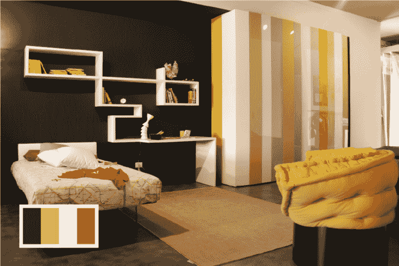

[Interior designers use color to bring spaces alive](http://www.home-designing.com/2012/01/yellow-room-inspiration-55-rooms-for-your-viewing-pleasure)

如果你想要不同的东西，在其他文化的设计中寻找色彩灵感。例如，韩国音乐电视布景设计以其色彩丰富和引人注目的调色板而闻名。每一帧都可以作为灵感的来源。

[Set design is a great source of inspiration](https://www.youtube.com/watch?v=N5wzkQvzp4c)

不用去韩国找色彩灵感。它无处不在，包括你的日常生活。下次你出门的时候，停下来欣赏你周围的色彩。

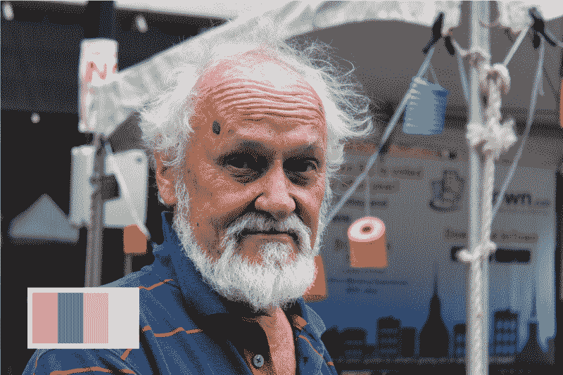

[Color inspiration is everywhere, including your daily life](https://www.instagram.com/jonathanzwhite/)

当你发现一些激励你的东西时，为它创建一个调色板。你可以使用你最喜欢的设计程序中的滴管工具来梳理出一个调色板，并在必要时进行调整。

#### 建立设计体系

设计系统，有时被称为风格指南，是一个框架，它封装了你设计中的所有元素。这包括从按钮到排版的一切。考虑你将使用什么样的按钮，你的导航栏看起来像什么。

关于设计系统的示例，请查看 [Salesforce](https://www.lightningdesignsystem.com/design/overview/) 的设计系统。更多的例子，下面是每个创业公司在启动之前都应该看的 [50 条细致风格指南。](https://designschool.canva.com/blog/50-meticulous-style-guides-every-startup-see-launching/)

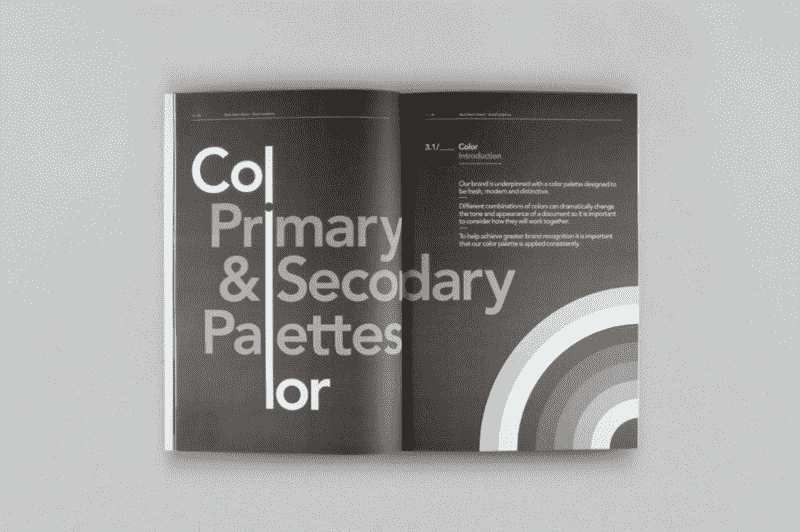

[The design system of MashCreative](http://mashcreative.co.uk/archived/black-watch-global/)

在选择调色板之前建立一个设计系统是有帮助的，即使只是一个粗略的草图。这样做可以让你了解你有哪些元素，以及如何将你的颜色运用到这些元素上。

在为你的设计选择调色板时，最好坚持 [KISS(保持简单，愚蠢)原则](https://en.wikipedia.org/wiki/KISS_principle)。颜色越少越好。对于大多数设计系统，以下结构是一个良好的开端:

*   背景
*   主要重音
*   次重音
*   错误颜色
*   成功颜色

原色是您最常用于重要按钮和强调的颜色。对于很多公司来说，这也是他们 logo 的颜色。

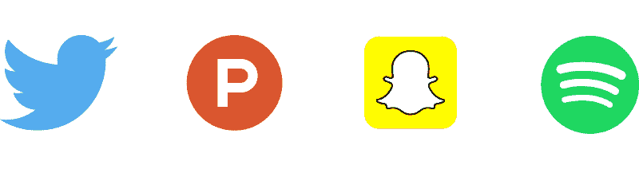

次要颜色是用来区分次要动作和主要动作的颜色。例如，主要和次要按钮。错误和成功的颜色，通常是红色和绿色，传达设计状态。例如，成功或错误通知。

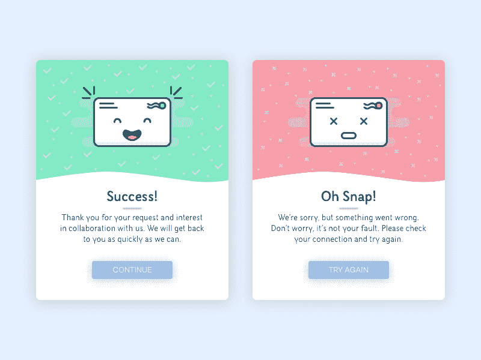

[Design states](https://dribbble.com/shots/2684479-Flash-Messages)

#### 选择调色板

既然你已经有了灵感和设计系统的草图，是时候选择调色板了。

对于一个基本的调色板，我喜欢把我的颜色并排，就像一个艺术家会为他们的调色板。

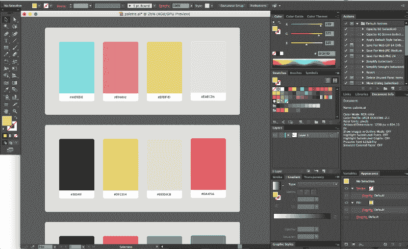

这是时候拿出你所有的颜色灵感，用它们来创造调色板了。越多越好。不要害怕尝试自己的颜色。

当缩小调色板选项的范围时，回想一下前两个部分，在那里你确定了设计的目的和受众。问自己以下问题:

*   [可访问的](https://www.smashingmagazine.com/2014/10/color-contrast-tips-and-tools-for-accessibility/)有哪些颜色？
*   哪些颜色具有视觉冲击力，吸引你的眼球？
*   你需要浅色还是深色的配色方案？人们会在一天中的什么时候使用你的产品？
*   你希望你的设计传达什么样的情绪？你有没有哪种颜色的调色板比其他的更好？

正如我在上一节提到的，颜色在你的设计系统中有不同的作用。这也意味着每种颜色在你的系统中有不同的权重。例如，你的背景色会比强调色用得更多。

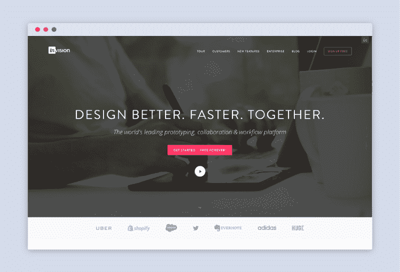

正因为如此，有时创建一个由不同尺寸的形状组成的一次性设计是一个很好的练习，每个尺寸大致等于该颜色在给定页面上出现的频率和平均表面积。

作为一个例子，这里是 [Invision 的](https://www.invisionapp.com/)调色板。

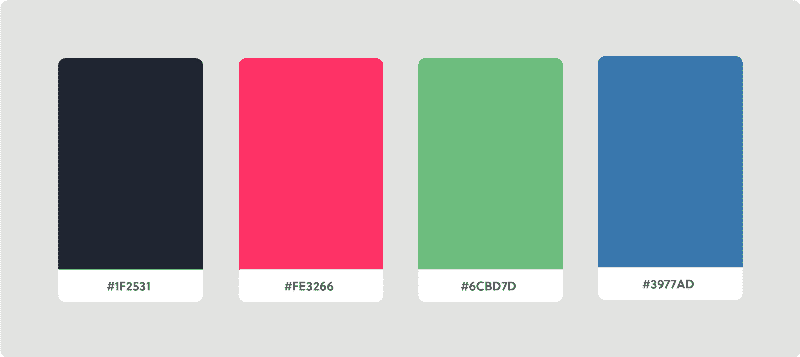

几何表示可能是这样的。

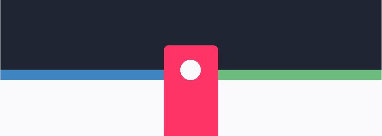

#### 应用调色板

为了让你了解如何将颜色应用到设计系统中，我们来看看 [Airbnb](https://www.airbnb.com/) 。Airbnb 的原色是 Rausch，以该公司起源的街道命名。喀山作为第二种颜色，两种灰色作为背景色。

[Airbnb’s brand colors](http://airbnb.design/)

对于大多数页面，Airbnb 使用雾蒙蒙的灰色作为背景。你可以看到他们用 rausch 作为主色来强调重要的行为，比如要求预定一个列表。

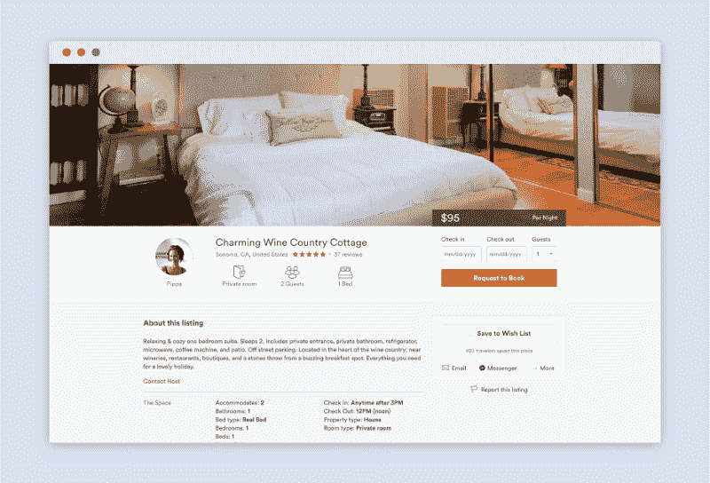

喀山，绿松石色，用来吸引你的眼球。注意它是如何赞美原色的。

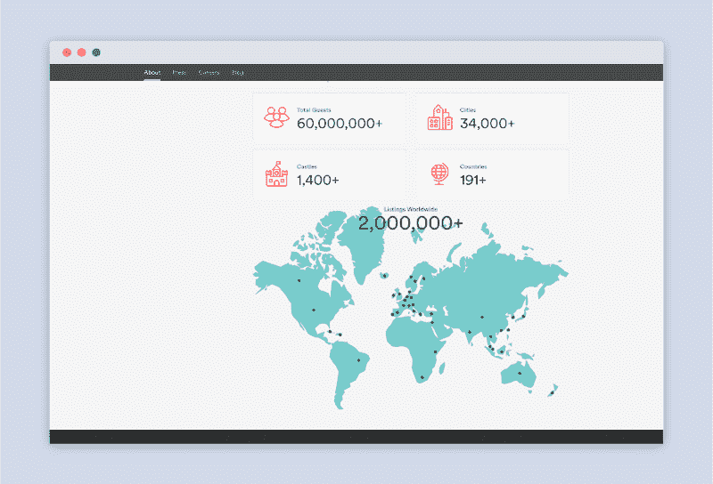

对于错误信息，Airbnb 使用浅红色，可以说是一种浅红色。红色和感叹号会立即吸引您的注意力，并通知您系统的状态。

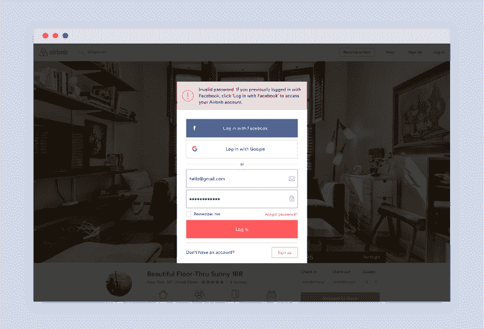

开始时，你的设计中没有任何颜色。关注元素的布局和位置。当你对你所拥有的感到满意后，你就可以开始将你的调色板应用到你的设计中了。

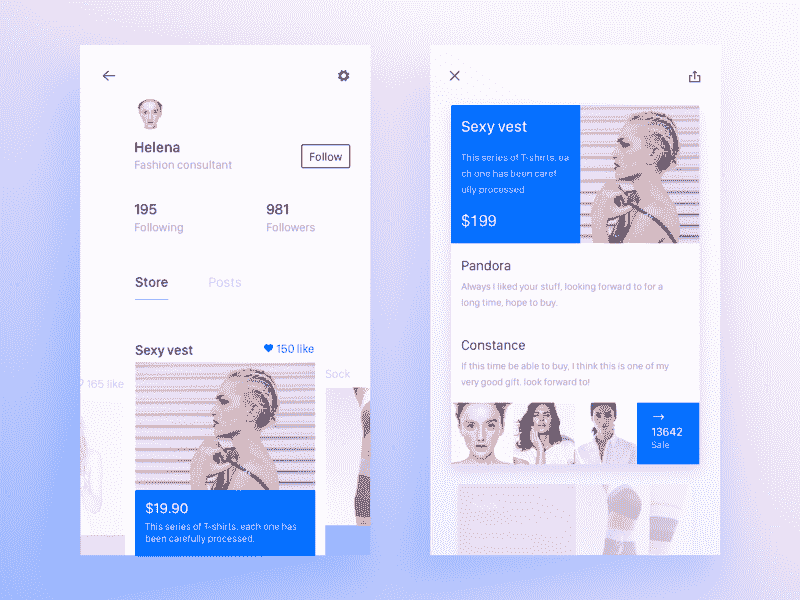

[Start off without color and slowly add from there](https://dribbble.com/shots/2760945-Store-Sale/attachments/562155)

在你的设计中考虑视觉层次。考虑您想要突出显示哪些设计组件，并分配适当的颜色。此外，考虑使用不同色调的颜色，比如悬停和点击状态。

### 包裹

色彩是关于实验和反复的。如果你想在色彩方面做得更好，唯一的答案就是做更多的工作。把颜色想象成添加剂。如果你已经有了设计的布局和功能，那么你就可以尝试任意多的调色板。

学习如何用色彩进行设计对设计师来说是非常有价值的。随着你越来越擅长挑选调色板，你甚至在接触设计程序之前，就能开发出在设计中视觉化颜色组合的能力。

我很想知道你是如何处理色彩的。你的流程是什么？欢迎给我留言或发推文。

另外，如果你喜欢这篇文章，点击推荐按钮或与朋友分享，这将意味着很多。

