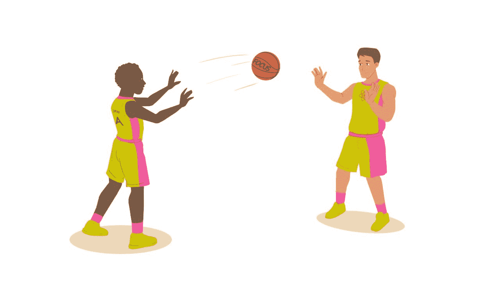
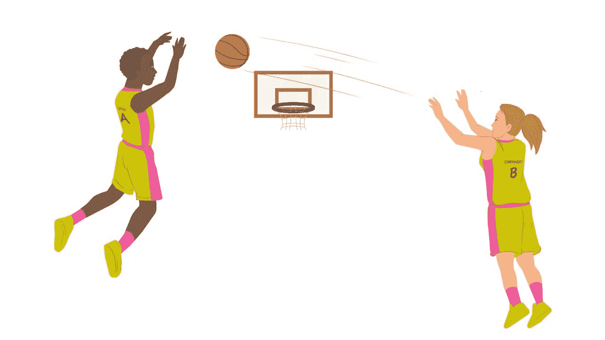

# 如何为复杂的 React 体验设计键盘可访问性

> 原文：<https://www.freecodecamp.org/news/designing-keyboard-accessibility-for-complex-react-experiences/>

上周是我作为 UX 设计师和工程师在 Pingboard 的最后一周。但我仍然相信该产品包含了世界上最好的组织结构图解决方案。

使用鼠标，您可以快速拖放任何组织结构，员工数据与您的其他工具保持同步。最令人印象深刻的是组织结构图是如何*活的*。员工可以自己探索组织结构图，甚至向公众公开。

但是，如果用户不能用鼠标浏览组织结构图，会发生什么呢？十分之三的美国人有某种残疾。许多这样的残疾限制了人们只能用键盘浏览网页。

如果用户试图用 tab 键导航组织结构图，焦点会以不可预知的方式在节点间跳转。

忘记不用鼠标编辑组织结构图:许多编辑操作隐藏在不可访问的溢出菜单和模态中。我们花了一年的时间让组织结构图完全可以通过键盘访问。

[https://player.vimeo.com/video/438922739?app_id=122963](https://player.vimeo.com/video/438922739?app_id=122963)

解决方案不是一次冲刺。这是在一年时间里发布的许多版本。

在这篇博文中，我将首先详细介绍这些交互的设计过程。下一节将详细介绍在 React 中实现这些交互。

我希望到最后你能学会如何处理在复杂体验中增加键盘可访问性的常见问题！

## 如何设计包容性的体验

你总是需要知道你正在解决什么方面的可访问性。无障碍解决方案很少是针对特定残疾的一对一解决方案。

例如，增加键盘辅助功能可以帮助有各种运动和视觉障碍的人。不过，键盘辅助功能对色盲没有多大帮助，色盲是一种视觉残疾。这就是为什么我说我们正在使组织结构图键盘可访问，而不是一般可访问。

关于网络可访问性的一个最好的方面是我们有国际公认的指导方针。W3C 有一个名为 [WAI-ARIA 创作实践](https://www.w3.org/TR/wai-aria-practices-1.1/)的文档。我知道这有点拗口，但这就是它如此伟大的原因:免费资源包括了常见 UI 元素的详细设计模式。

想知道手风琴、下拉菜单、调式菜单和弹出式菜单应该如何工作吗？该文档详细说明了编码示例所需的精确键盘交互。这些模式使得更新我们的公共组件变得轻而易举。

### 如何找到正确的心智模式


为组织结构图设计键盘可访问性的棘手部分是卡片到卡片的导航。文档中没有组织结构图的模式。那我们该怎么办？！

交互设计最好的属性之一就是熟悉。我们开始研究组织结构图导航的最接近的**心智模型**的文档。心理模型是来自其他经验的表现:

> “设计时要考虑人们的交互模式。如果有一个标准的心智模型来解释某样东西是如何工作的，试着利用这个模型来进行设计。当这不可能时(例如，系统是新的和新颖的)，创建一个尽可能从普通心智模型中提取的交互体验...”–[利德威尔、霍尔登和巴特勒的《设计的普遍原则》](https://bookshop.org/books/universal-principles-of-design-revised-and-updated-125-ways-to-enhance-usability-influence-perception-increase-appeal-make-better-design-decision/9781592535873)

那么，人们每天最相似的互动模式是什么呢？答案是一个用于导航文件和文件夹的 finder 窗口，正式名称为[树形视图](https://www.w3.org/TR/wai-aria-practices-1.1/examples/treeview/treeview-1/treeview-1a.html)。在并行文件间导航和深入文件夹的思维模式非常适合用户！

我们必须做的唯一改变是翻转箭头键的轴。在文件夹导航中，当你按下*右箭头*键时，你会移动得更深，但是在组织结构图中使用*下箭头*键会感觉更自然。我们最终得到了以下键盘控件:

*   *左*和*右箭头*–将焦点移动到数据结构中的相邻节点。
*   *向下箭头*–当焦点在一个关闭的节点上时，打开该节点，焦点不移动。当焦点在打开的节点上时，将焦点移动到第一个子节点。当焦点在结束节点上时，不执行任何操作。
*   *向上箭头*–当焦点在一个打开的节点上时，关闭该节点。当焦点位于既是结束节点又是闭合节点的子节点上时，将焦点移动到其父节点。当焦点位于同时是结束节点或封闭节点的根节点上时，不执行任何操作。
*   *起始*和*结束*–将焦点移动到第一个和最后一个节点。
*   a-z，A-Z–焦点移动到下一个以键入的字符开头的职务或部门标题的节点。如果在焦点节点之后的节点中找不到匹配的名称，搜索将返回到第一个节点。搜索会忽略封闭节点的后代节点。
*   *(星号)-展开与焦点节点处于同一级别的所有已关闭的同级节点。焦点不动。

### 如何将悬停交互转换到键盘

我们的组织结构图的一个令人愉快的方面是浏览时卡片看起来很干净。每张卡片可能有八个按钮，但是我们会隐藏它们，直到您将鼠标光标悬停在卡片上。

那么，当所有的按钮都被隐藏时，如何适应键盘导航呢？

我们决定当你用回车键选择一张卡片时，显示所有卡片动作(按钮)。从那时起，我们将键盘交互切换到所谓的[布局网格](https://www.w3.org/TR/wai-aria-practices/examples/grid/LayoutGrids.html)。

我们发现最接近布局网格的心智模型是用箭头键在电子表格中导航。

实现布局网格的一个棘手部分是交互布局。您直观地知道项目在布局中的位置，但是交互布局要求您将动作放置在严格的列和行网格中。

交互布局是一个清晰的技术文档，它告诉开发人员焦点将基于哪个箭头键被按下而准确地指向哪里。

说到焦点，让我们转到技术实现上来...

## 如何用 React 编写可访问的焦点状态

当你在网上谈论键盘的可访问性时，你主要谈论的是焦点状态。

一个浏览器一次只能有一个焦点项目。我们习惯用键盘浏览浏览器，用 tab 键前进，用 shift + tab 键后退。

正如我们在上一节交互设计中看到的，不同的体验需要更复杂的键盘控件来移动焦点状态。

如果 React 是我们用来呈现 UI 的库，我们需要在那个上下文中考虑焦点状态。在 React 中处理焦点状态时有四个常见的挑战:

1.  创建自定义键盘交互
2.  聚焦陷印适当的组件
3.  将焦点传递给其他组件
4.  将焦点传递给尚未安装的组件

**快速提示:**在下面的许多例子中，我们将使用模态(对话框)。老实说，有上百万种可访问模态的开源解决方案，在你自己开发之前，你应该考虑一下。这些例子之所以有价值，是因为它们将允许您识别和解决 React 中常见的焦点状态问题。

### 如何在 React 中创建自定义键盘交互

对于常用组件，我怎么推荐[breakit](https://reakit.io/)都不为过。这是一个键盘可访问的、非风格的组件库，有对话框、弹出窗口等等。我现在用它来做我所有的个人项目。结合用于动画的[成帧器动作](https://www.framer.com/motion/)和用于造型的[风格组件](https://styled-components.com/)，这是一个杀手组合。

但是，如果您需要在 React 中进行自定义键盘交互，该怎么办呢？虽然了解[键盘事件](https://www.javascripttutorial.net/javascript-dom/javascript-keyboard-events/)的背景知识很聪明，但是使用 React 钩子很容易！

这里有一个简单的键盘交互，使用一个名为 [React-Use](https://streamich.github.io/react-use/?path=/story/sensors-usekey--docs) 的 React 钩子库:

[https://codesandbox.io/embed/1-keyboard-accessible-modal-br4vo?from-embed](https://codesandbox.io/embed/1-keyboard-accessible-modal-br4vo?from-embed)

就是这样。这就是解决办法。

上面，我们使用 esc 键匹配模态规范来关闭一个模态。这不仅对可访问性很好，对任何有用的键盘快捷键也很好！

### 如何在 React 中捕获组件内部的焦点

**注意:**接下来的两个演示可能会有问题，因为它们会互相争夺焦点状态。您应该一次只打开一个演示的模式，或者单击“打开沙盒”在单独的窗口中查看它们，以获得最佳体验。

现在有一个关于上述模态组件的坏消息:当模态组件打开时，没有任何东西获得焦点。实际上，模态内部的第一个可聚焦元素应该获得焦点，焦点状态应该永远不能脱离模态。

我们将通过 [React Focus Lock](https://github.com/theKashey/react-focus-lock#readme) 向模态添加一个焦点陷阱来解决这个问题。焦点将无法逃脱焦点陷阱，直到它被卸载，并且第一个可聚焦的项目将自动聚焦:

[https://codesandbox.io/embed/2-keyboard-accessible-modal-with-focus-trap-owxdt?from-embed](https://codesandbox.io/embed/2-keyboard-accessible-modal-with-focus-trap-owxdt?from-embed)

有很多不同的依赖关系可以解决焦点捕捉问题。在定制情况下也很容易实现。你需要考虑所有必要的东西:

*   找到第一个和最后一个具有要陷印的 UI 的可聚焦元素
*   如果用户在关注最后一项时按 tab，则关注第一项
*   如果用户在聚焦第一个项目时按下 *shift* + *tab* ，聚焦最后一个项目

### 如何将焦点传递给其他组件



我们遇到的另一个常见问题是将带有快捷键的组件放在使用相同快捷键的其他组件中。

例如，如果在一个模态中有一个下拉菜单会怎样？当下拉列表展开时，esc 键应该关闭下拉列表，但不是模式。

我们可以用钩子状态暂停模态的快捷方式:

[https://codesandbox.io/embed/3-keyboard-accessible-modal-with-pausing-focus-trap-9lcfl?from-embed](https://codesandbox.io/embed/3-keyboard-accessible-modal-with-pausing-focus-trap-9lcfl?from-embed)

我们在新的溢出菜单组件中包含了两个重要的道具:onClose 和 onOpen。每当菜单打开或关闭时，我们就启动相应的道具。这允许模式组件在需要时暂停和恢复自己的焦点陷阱，并让溢出菜单焦点陷阱接管。

## 如何将焦点传递给尚未安装的组件

有些大公司有很大的组织结构图。这意味着为了让我们的组织结构图体验具有高性能，我们必须对组织结构图进行大量的异步加载。当用户取消经理卡时，我们就将更多数据加载到组织结构图中。

那么我们如何将焦点传递到尚不存在的卡片上呢？我讨厌增加一个超时来延迟启动切换。如果焦点知道卡片会在哪里，并且在卡片准备好的时候能在那里遇到它，那就太好了。

先说**轮询**。这是指外部系统不断被询问其状态。在 web 开发中，我们通常对 web 应用程序使用轮询来询问服务器它们是否处理完了某种数据。

我们还可以使用一个非常简单的投票示例来询问需要关注的组织结构图卡片是否已经呈现:

```
let polling = null;
let pollCount = 0;
polling = setInterval(() => {
 if (pollCount > 20) {
  clearInterval(polling)
  return;
 }

 const nodeInDOM = getNodeInDOM(node);

 if (nodeInDOM) {
  nodeInDOM.focus();
  clearInterval(polling);
  return;
 }

 pollCount =+ 1;
}, 100); 
```

现在您需要提供您自己的节点标识符和`getNodeInDOM`，但是这是 focus 归结的所有轮询。我们每十分之一秒检查一次，最多两秒钟，看卡是否已经出现。你能称之为黑客吗？当然可以。但事实证明这是一个非常可靠的黑客。



## 让世界变得更美好*

在 [Pingboard](https://pingboard.com) 上，我参与了许多伟大的发布，但这一次感觉最有影响力。

确保每个人都能使用相同的工具感觉很棒。在旧的体验上工作也训练了我们在考虑可访问性的情况下运送新的体验。

我希望你的公司考虑到离开体验的道德和法律后果。

如果你需要帮助来说服你的公司需要可访问性，我有一个免费的演示和演示。如果你对这篇文章有任何疑问，请随时[在 Twitter](https://twitter.com/seejamescode) 上联系！