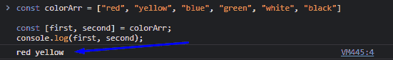
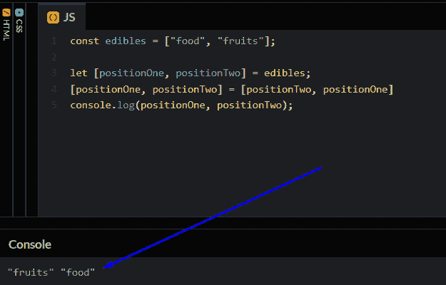
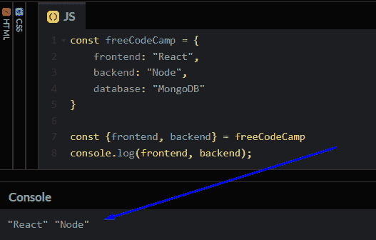
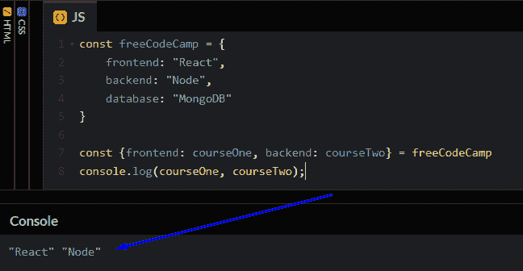

# JavaScript 中的析构——如何析构数组和对象

> 原文：<https://www.freecodecamp.org/news/destructuring-patterns-javascript-arrays-and-objects/>

如果对 JavaScript 数组和对象进行析构，那么使用它们会更有趣。这有助于您获取存储的数据。

在本文中，您将了解如何在 JavaScript 数组和对象中将析构提高到一个新的水平。

### 目录:

*   什么是数组？
*   什么是对象？
*   JavaScript 中的析构意味着什么
*   数组中的析构
*   对象中的析构

## JavaScript 中的数组是什么？

在 JavaScript 中，数组是存储多个元素的单个变量。这是一组数据。我们可以用两种不同的方式声明数组，它们是:

```
// Method 1
const firstArray = ["JavaScript", "Python", "Go"];

// Method 2
const secondArray = new Array(3);
secondArray[0] = "JavaScript";
secondArray[1] = "Python";
secondArray[2] = "Go"; 
```

在方法 1 中，可以在声明数组的同时进行初始化。在方法 2 中，在初始化之前，用要存储的元素数来声明数组。

## JavaScript 中的对象是什么？

在 JavaScript 中，对象是属性的集合，属性是名称(或*键*)和值之间的关联。

用 JavaScript 写一个对象看起来有点像数组，但是我们用花括号或小胡子来创建它们。让我们看看下面的代码，它显示了一个汽车对象及其属性:

```
const car = {
  name: "Toyota",
  color: "Black",
  year: 2022,
  engineType: "Automatic",
}; 
```

请注意，组成对象的是一个键，后跟它的值。

现在你已经知道了 JavaScript 数组和对象的基本情况，让我们来谈谈析构。

## JavaScript 中什么是析构？

想象一下，你想从你的收藏中挑选一些鞋子，你想要你最喜欢的蓝色鞋子。你要做的第一件事就是搜索你的收藏，打开里面所有的东西。

现在析构就像你在找鞋子时采取的方法。析构是将数组或对象中的元素解包的行为。

析构不仅允许我们解包元素，它还赋予你根据你想要执行的操作类型来操作和切换解包的元素的能力。

现在让我们看看析构在数组和对象中是如何工作的。

## 数组中的析构

为了在 JavaScript 中析构数组，我们使用方括号[]来存储变量名，该变量名将被分配给存储元素的数组的名称。

```
const [var1, var2, ...] = arrayName; 
```

上面声明的`var2`后面的省略号仅仅意味着我们可以创建更多的变量，这取决于我们想要从数组中移除多少项。

### 如何用析构给变量赋值

现在，假设我们有一个 6 种颜色的数组，但是我们只想得到数组中的前 2 种颜色。我们可以使用析构来得到我们想要的。

现在就让我们来看看:

```
const colorArr = ["red", "yellow", "blue", "green", "white", "black"];

const [first, second] = colorArr;
console.log(first, second);

// red, yellow 
```



当我们运行上面的代码时，我们应该将红色和黄色记录到控制台。厉害！

### 如何用析构交换变量

现在你已经知道了如何用析构给变量赋值，让我们看看如何使用析构快速交换变量值。

假设我们有一个两个元素的数组，`"food"`和`"fruits"`，我们使用析构将这些值赋给变量`positionOne`和`positionTwo`:

```
const edibles = ["food", "fruits"];

let [positionOne, positionTwo] = edibles;
console.log(positionOne, positionTwo);

// food, fruits 
```

如果我们稍后想要交换`positionOne`和`positionTwo`的值而不进行析构，我们将需要使用另一个变量来临时保存当前变量之一的值，然后执行交换。

例如:

```
const edibles = ["food", "fruits"];

let [positionOne, positionTwo] = edibles;
const temp = positionOne;

positionOne = positionTwo;
positionTwo = temp;
console.log(positionOne, positionTwo);

// fruits, food 
```

但是通过析构，我们可以非常容易地交换`positionOne`和`positionTwo`的值，而不必使用临时变量:

```
const edibles = ["food", "fruits"];

let [positionOne, positionTwo] = edibles;
[positionOne, positionTwo] = [positionTwo, positionOne];
console.log(positionOne, positionTwo);

// fruits, food 
```



注意，这种交换变量的方法不会改变原始数组。如果您将`edibles`登录到控制台，您会看到它的值仍然是`["food", "fruits"]`。

### 如何用析构来变异数组

变异意味着改变元素的形式或值。如果一个值可以被改变，那么这个值就是可变的。在数组析构的帮助下，我们可以改变数组本身。

假设我们有相同的`edibles`数组，我们想通过交换`"food"`和`"fruits"`的顺序来改变数组。

我们可以通过析构来实现，类似于我们之前交换两个变量的值的方式:

```
const edibles = ["food", "fruits"];

[edibles[0], edibles[1]] = [edibles[1], edibles[0]];
console.log(edibles);

// ["fruits", "food"] 
```

### 对象中的析构

当析构对象时，我们用花括号来表示对象中的确切名称。不像在数组中我们可以使用任何变量名来解包元素，对象只允许使用存储数据的名称。

有趣的是，我们可以操作并给我们想从对象中获取的数据分配一个变量名。让我们看看所有的代码。

```
const freeCodeCamp = {
  frontend: "React",
  backend: "Node",
  database: "MongoDB",
};

const { frontend, backend } = freeCodeCamp;
console.log(frontend, backend);

// React, Node 
```



将我们所拥有的记录到控制台显示了前端和后端的价值。现在让我们看看如何给我们想要解包的对象分配一个变量名。

```
const freeCodeCamp = {
  frontend: "React",
  backend: "Node",
  database: "MongoDB",
};

const { frontend: courseOne, backend: courseTwo } = freeCodeCamp;
console.log(courseOne, courseTwo);

// React, Node 
```



如您所见，我们将`courseOne`和`courseTwo`作为我们想要解包的数据的名称。

指定一个变量名总是有助于我们保持代码的整洁，尤其是当我们需要解包外部数据并在代码中重用它的时候。

## 包扎

您现在已经学习了如何在数组和对象中进行析构。您还学习了如何切换数组中元素的位置。

那么接下来呢？尝试练习，让你的破坏能力更上一层楼。