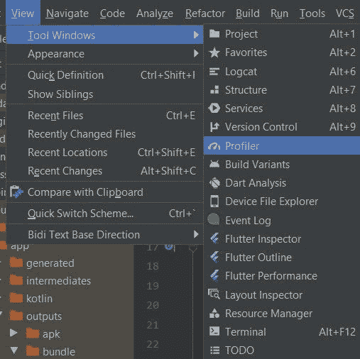
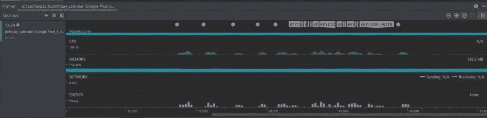

# 检测应用程序中的 anr

> 原文：<https://www.freecodecamp.org/news/detect-application-not-responding-errors-in-your-application/>

如果有办法让我的应用程序“应用程序不响应”的错误证明，我会这样做。

当你意想不到的时候，ANRs 似乎总是悄悄地靠近你。问题是你对此无能为力。

在 Google Play 控制台中查看应用程序的概览时，您可能会看到它们弹出来。但是不会有很多信息来理解 ANR 是如何发生的，以及你可以做些什么来解决这种情况。

除此之外，如果用户碰巧经历了 ANR，你必须依靠他们愿意投入时间和精力来告诉你。我们也都在另一边。如果你正在使用一个卡住的应用程序，你要做的一件事就是直接卸载它。

那么，作为开发者，我们如何尽我们所能来保护我们应用程序的用户免受 anr 的影响呢？

让我们找出答案。

## 如何防止 Android 上的“应用程序不响应”错误

### 积极主动

在我们深入研究可以帮助我们检测 anr 的解决方案之前，让我们首先了解我们可以做些什么来避免它们(或者最小化它们发生的可能性)。

这些要点可能听起来显而易见，但是在一个足够大的应用程序中，可能很容易忽略一些事情:

首先，检查你的代码中是否有地方在 UI 线程上做大量的工作。在 UI 线程上完成的工作应该很短，并且与应用程序的 UI 相关。

如果您正在执行任何其他逻辑，甚至可能是异步工作，请将其委托给后台线程或服务

第二，如果您的线程持有锁或某些需要同步的代码块，请确保您没有创建死锁或应用程序的某个状态到达死锁

第三，如果您的应用程序处理广播接收器，您必须验证 **onReceive** 方法的执行时间很短，并且能够及时结束。如果有需要花费一些时间的工作，将它委托给后台线程

另一种检测可能导致 ANRs 的地方的方法是使用 [**StrictMode**](https://developer.android.com/reference/android/os/StrictMode) 。您可以在开发应用程序时使用它，因为它可以捕获主线程上意外的磁盘或网络使用情况。

### 聪明点

你已经检查了你的申请，你认为它没有任何 ANRs 的风险。所以你发布它供公众消费。

瞧，几个月过去了，你开始看到关于 ANRs 的报道。你能做些什么不同的事情？正如我们之前所讨论的，这些坠机报告几乎没有提供任何关于 ANR 的信息。

当 ANR 发生时，为了帮助您的应用程序尽可能提供最高级别的细节，我将详细介绍两个选项:

1.  运行一个线程来轮询 UI 线程，看它是否被阻塞
2.  在 API 级别≥ 30 上，可以使用[**getHistoricalProcessExitReasons**](https://developer.android.com/reference/kotlin/android/app/ActivityManager#gethistoricalprocessexitreasons)

现在让我们来详细看看每一项:

#### 运行一个轮询 UI 线程的线程

已经有一个名为 [ANR 看门狗](https://github.com/SalomonBrys/ANR-WatchDog)的库负责检测 ANR 并为您提供所有细节。如果你不想使用它或者想拥有自己的东西，这里有一个它的大致轮廓:

*   创建一个在主线程上运行的线程(它不需要做任何实际工作)
*   查看几秒钟后线程的执行是否完成
*   如果有，那么没有 ANR 发生，你再次运行线程
*   如果没有，其他线程会阻塞主线程并导致 ANR

下面是这类课程的大致轮廓:

```
package com.tomerpacific.anrdetection

import android.os.Handler
import android.os.Looper
import java.lang.Exception

class ANRHandler: Thread() {

    val TIMEOUT: Long = 5000L
    private val handler: Handler = Handler(Looper.getMainLooper())
    private val worker : Runnable = Runnable {  }

    override fun run() {
        while (!isInterrupted) {
            handler.postAtFrontOfQueue(worker)

            try {
                sleep(TIMEOUT)
            } catch (exception: Exception) {
                exception.printStackTrace()
            }

            if (handler.hasMessages(0)) {
                //worker has not finished running so the UI thread is being held
                val stackTrace: Array<StackTraceElement> = currentThread().stackTrace
                var output: String = ""
                for (element in stackTrace) {
                    output += element.className + " " + element.methodName + " " + element.lineNumber
                }

                print(output)
            }
        }
    }
}
```

runnable 的执行总是在主线程上，但是因为它不做任何工作，所以不应该影响应用程序的性能。您也可以决定每隔一段时间运行一次。

#### 使用[getHistoricalProcessExitReasons](https://developer.android.com/reference/kotlin/android/app/ActivityManager#gethistoricalprocessexitreasons)

选项#2 可以让您的生活更简单，因为它的 API 可以为您提供大量信息。

在 Android 11 中引入(API 级别 30)，getHistoricalProcessExitReasons 做的正是你认为它做的。它返回记录的对象列表，这些对象说明了最近终止的应用程序。

此方法在 ActivityManager 上调用，接受三个参数:

1.  字符串类型的包名(可以为空)
2.  属于 int 类型的包的进程 id
3.  您想要取回的原因的最大数量–int 类型

值得注意的是，所有这些参数都可以替换为默认值。也就是说，您可以传递 null 作为包名，并获得调用者 UID 的完整退出原因

那么这些被记录的物体包含了什么呢？嗯，这些对象都是[**ApplicationExitInfo**](https://developer.android.com/reference/kotlin/android/app/ApplicationExitInfo)**类型的，它们可以给你提供很多有用的信息。**

**首先，您可以调用 **getReason** 方法来找出进程终止的原因。此方法返回一个整数，标记退出原因的代码。如果返回的值是 **6** ，这意味着应用程序被终止，因为它由于发生了 [ANR](https://developer.android.com/reference/kotlin/android/app/ApplicationExitInfo#reason_anr) 而没有响应。**

 **[https://giphy.com/embed/917Ve5cLpoB3Nhd1xh](https://giphy.com/embed/917Ve5cLpoB3Nhd1xh)

[通过 GIPHY](https://giphy.com/gifs/theoffice-nbc-the-office-tv-917Ve5cLpoB3Nhd1xh)

这很好，但是我们怎么能看到 ANR 发生在哪里呢？为此我们可以使用[**gettrace inputstream**](https://developer.android.com/reference/kotlin/android/app/ApplicationExitInfo#gettraceinputstream)。顾名思义，返回值是一个字节的 InputStream，需要像其他 InputStream 一样读取。

示例输出如下所示:

```
I/System.out: ----- pid 2738 at 2022-04-26 17:48:12 -----
    Cmd line: com.tomerpacific.anrdetection
    Build fingerprint: 'Android/sdk_phone_x86/generic_x86:11/RSR1.210210.001.A1/7193139:userdebug/dev-keys'
    ABI: 'x86'
    Build type: optimized
I/System.out: Zygote loaded classes=15746 post zygote classes=728
    Dumping registered class loaders
    #0 dalvik.system.PathClassLoader: [], parent #1
    #1 java.lang.BootClassLoader: [], no parent
I/System.out: #2 dalvik.system.PathClassLoader: [/data/app/~~C_0mqw-g_9cjPjIR_kpRIg==/com.tomerpacific.anrdetection-3-t-I6JR9Q3QA6UY7L8iPA==/base.apk], parent #1
    Done dumping class loaders
    Classes initialized: 302 in 19.361ms
    Intern table: 31490 strong; 543 weak
    JNI: CheckJNI is on; globals=637 (plus 31 weak)
I/System.out: Libraries: libandroid.so libaudioeffect_jni.so libcompiler_rt.so libicu_jni.so libjavacore.so libjavacrypto.so libjnigraphics.so libmedia_jni.so libopenjdk.so librs_jni.so libsfplugin_ccodec.so libsoundpool.so libstats_jni.so libwebviewchromium_loader.so (14)
    Heap: 91% free, 2330KB/26MB; 67022 objects
    Dumping cumulative Gc timings
I/System.out: Average major GC reclaim bytes ratio inf over 0 GC cycles
    Average major GC copied live bytes ratio 0.738176 over 4 major GCs
    Cumulative bytes moved 11482280
    Cumulative objects moved 217937
    Peak regions allocated 28 (7168KB) / 768 (192MB)
I/System.out: Start Dumping histograms for 1 iterations for young concurrent copying
    ProcessMarkStack:	Sum: 26.311ms 99% C.I. 26.311ms-26.311ms Avg: 26.311ms Max: 26.311ms
    ScanImmuneSpaces:	Sum: 5.625ms 99% C.I. 5.625ms-5.625ms Avg: 5.625ms Max: 5.625ms
    VisitConcurrentRoots:	Sum: 1.121ms 99% C.I. 1.121ms-1.121ms Avg: 1.121ms Max: 1.121ms
I/System.out: (Paused)ClearCards:	Sum: 375us 99% C.I. 7us-235us Avg: 28.846us Max: 235us
    GrayAllDirtyImmuneObjects:	Sum: 329us 99% C.I. 329us-329us Avg: 329us Max: 329us
    VisitNonThreadRoots:	Sum: 327us 99% C.I. 327us-327us Avg: 327us Max: 327us
I/System.out: InitializePhase:	Sum: 306us 99% C.I. 306us-306us Avg: 306us Max: 306us
    (Paused)GrayAllNewlyDirtyImmuneObjects:	Sum: 164us 99% C.I. 164us-164us Avg: 164us Max: 164us
    (Paused)FlipCallback:	Sum: 144us 99% C.I. 144us-144us Avg: 144us Max: 144us
    SweepSystemWeaks:	Sum: 142us 99% C.I. 142us-142us Avg: 142us Max: 142us
I/System.out: ScanCardsForSpace:	Sum: 125us 99% C.I. 125us-125us Avg: 125us Max: 125us
    ThreadListFlip:	Sum: 96us 99% C.I. 96us-96us Avg: 96us Max: 96us
    ClearFromSpace:	Sum: 78us 99% C.I. 78us-78us Avg: 78us Max: 78us
    CopyingPhase:	Sum: 76us 99% C.I. 76us-76us Avg: 76us Max: 76us
I/System.out: FlipOtherThreads:	Sum: 58us 99% C.I. 58us-58us Avg: 58us Max: 58us
    ProcessReferences:	Sum: 54us 99% C.I. 19us-35us Avg: 27us Max: 35us
    SweepArray:	Sum: 53us 99% C.I. 53us-53us Avg: 53us Max: 53us
I/System.out: EnqueueFinalizerReferences:	Sum: 38us 99% C.I. 38us-38us Avg: 38us Max: 38us
    RecordFree:	Sum: 37us 99% C.I. 14us-23us Avg: 18.500us Max: 23us
    ForwardSoftReferences:	Sum: 25us 99% C.I. 25us-25us Avg: 25us Max: 25us
    FlipThreadRoots:	Sum: 21us 99% C.I. 21us-21us Avg: 21us Max: 21us
I/System.out: (Paused)SetFromSpace:	Sum: 19us 99% C.I. 19us-19us Avg: 19us Max: 19us
    ResumeRunnableThreads:	Sum: 12us 99% C.I. 12us-12us Avg: 12us Max: 12us
    EmptyRBMarkBitStack:	Sum: 8us 99% C.I. 8us-8us Avg: 8us Max: 8us
    SwapBitmaps:	Sum: 7us 99% C.I. 7us-7us Avg: 7us Max: 7us
    Done Dumping histograms
    young concurrent copying paused:	Sum: 750us 99% C.I. 750us-750us Avg: 750us Max: 750us
I/System.out: young concurrent copying freed-bytes: Avg: 1052KB Max: 1052KB Min: 1052KB
    Freed-bytes histogram: 960:1
    young concurrent copying total time: 35.641ms mean time: 35.641ms
    young concurrent copying freed: 8956 objects with total size 1052KB
I/System.out: young concurrent copying throughput: 255886/s / 29MB/s  per cpu-time: 179578666/s / 171MB/s
    Average minor GC reclaim bytes ratio 0.742269 over 1 GC cycles
    Average minor GC copied live bytes ratio 0.276211 over 2 minor GCs
    Cumulative bytes moved 1410368
    Cumulative objects moved 26626
I/System.out: Peak regions allocated 28 (7168KB) / 768 (192MB)
    Total time spent in GC: 35.641ms
    Mean GC size throughput: 28MB/s per cpu-time: 169MB/s
    Mean GC object throughput: 251284 objects/s
    Total number of allocations 75978
    Total bytes allocated 3382KB
    Total bytes freed 1052KB
I/System.out: Free memory 23MB
    Free memory until GC 23MB
    Free memory until OOME 189MB
    Total memory 26MB
    Max memory 192MB
    Zygote space size 3040KB
    Total mutator paused time: 750us
I/System.out: Total time waiting for GC to complete: 80.600us
    Total GC count: 1
    Total GC time: 35.641ms
    Total blocking GC count: 0
    Total blocking GC time: 0
    Histogram of GC count per 10000 ms: 0:1
    Histogram of blocking GC count per 10000 ms: 0:1
    Native bytes total: 15621964 registered: 98204
I/System.out: Total native bytes at last GC: 15537168
    /system/framework/oat/x86/android.hidl.manager-V1.0-java.odex: quicken
    /system/framework/oat/x86/android.test.base.odex: quicken
    /system/framework/oat/x86/android.hidl.base-V1.0-java.odex: quicken
I/System.out: Current JIT code cache size (used / resident): 0KB / 32KB
    Current JIT data cache size (used / resident): 4KB / 32KB
    Zygote JIT code cache size (at point of fork): 45KB / 48KB
    Zygote JIT data cache size (at point of fork): 33KB / 36KB
    Current JIT mini-debug-info size: 26KB
I/System.out: Current JIT capacity: 64KB
    Current number of JIT JNI stub entries: 0
    Current number of JIT code cache entries: 48
    Total number of JIT compilations: 6
    Total number of JIT compilations for on stack replacement: 1
I/System.out: Total number of JIT code cache collections: 0
    Memory used for stack maps: Avg: 35B Max: 52B Min: 28B
    Memory used for compiled code: Avg: 125B Max: 257B Min: 69B
    Memory used for profiling info: Avg: 70B Max: 188B Min: 20B
    Start Dumping histograms for 48 iterations for JIT timings
    Compiling:	Sum: 385.780ms 99% C.I. 0.556ms-25.610ms Avg: 8.037ms Max: 25.610ms
I/System.out: TrimMaps:	Sum: 44.431ms 99% C.I. 2.400us-5148us Avg: 925.645us Max: 5643us
    Done Dumping histograms
    Memory used for compilation: Avg: 83KB Max: 322KB Min: 8560B
    ProfileSaver total_bytes_written=0
    ProfileSaver total_number_of_writes=0
    ProfileSaver total_number_of_code_cache_queries=0
I/System.out: ProfileSaver total_number_of_skipped_writes=0
    ProfileSaver total_number_of_failed_writes=0
    ProfileSaver total_ms_of_sleep=5000
    ProfileSaver total_ms_of_work=0
I/System.out: ProfileSaver total_number_of_hot_spikes=5
    ProfileSaver total_number_of_wake_ups=0
I/System.out: suspend all histogram:	Sum: 11.468ms 99% C.I. 0.018ms-10.658ms Avg: 1.042ms Max: 11.094ms
    DALVIK THREADS (15):
    "main" prio=5 tid=1 Runnable
      | group="main" sCount=0 dsCount=0 flags=0 obj=0x72107008 self=0xe7d05410
      | sysTid=2738 nice=-10 cgrp=top-app sched=0/0 handle=0xf6267478
I/System.out:   | state=R schedstat=( 5812106631 1041760011 2536 ) utm=535 stm=45 core=0 HZ=100
      | stack=0xff7cb000-0xff7cd000 stackSize=8192KB
      | held mutexes= "mutator lock"(shared held)
        at com.tomerpacific.anrdetection.MainActivity$onCreate$1$1.onClick(MainActivity.kt:18)
        at android.view.View.performClick(View.java:7448)
        at android.view.View.performClickInternal(View.java:7425)
I/System.out:     at android.view.View.access$3600(View.java:810)
        at android.view.View$PerformClick.run(View.java:28305)
I/System.out:     at android.os.Handler.handleCallback(Handler.java:938)
        at android.os.Handler.dispatchMessage(Handler.java:99)
        at android.os.Looper.loop(Looper.java:223)
        at android.app.ActivityThread.main(ActivityThread.java:7656)
I/System.out:     at java.lang.reflect.Method.invoke(Native method)
        at com.android.internal.os.RuntimeInit$MethodAndArgsCaller.run(RuntimeInit.java:592)
        at com.android.internal.os.ZygoteInit.main(ZygoteInit.java:947)
```

这只是所有输出的一部分，但是您可以看到它提供了大量信息，包括:

*   可用内存/总内存/最大内存
*   堆诊断(空闲百分比、分配的对象大小和数量)
*   主线程的堆栈跟踪

其他有用的方法包括:

*   getTimestamp–进程终止时的时间戳
*   get description–对进程终止原因的系统描述

### 随机应变

如果您的应用程序确实受到 anr 的影响，解决它们可能会非常棘手。这可能是因为您没有获得完整的 stacktrace(或者根本没有)，您无法再现它，或者它发生在一些深奥的设备上。你能做什么？

在 Android Studio 版本≥ 3.2 中，你有一个叫做 [CPU Profiler](https://developer.android.com/studio/profile/cpu-profiler) 的实用程序。该工具允许您在应用程序运行时检查线程活动。有了它，您可能会发现哪些线程正在运行，运行了多长时间，以及它们在哪里运行。

要使用它，在 Android Studio 中，进入视图→工具窗口→分析器:



屏幕底部会打开一个窗口。一旦您为其附加了一个流程，您将会看到三条时间线:

1.  事件时间线
2.  CPU 时间线
3.  线程时间线



您需要关注线程时间线，看看那里是否有任何异常。每个线程的活动可以用三种颜色来标识:

*   绿色–表示线程正在运行或处于可运行状态
*   黄色–表示线程正在等待执行某个 I/O 操作
*   灰色-表示线程正在休眠

## 包扎

希望您在尽可能使您的应用程序不受 ANR 影响方面获得了一些信心。使用上面列出的工具和技术可能有助于防止您的应用程序出现下一个 ANR。

欢迎您查看我在 GitHub 上的其他文章:

[GitHub - TomerPacific/MediumArticles: A repository that contains code associated with various Medium articles I have writtenA repository that contains code associated with various Medium articles I have written - GitHub - TomerPacific/MediumArticles: A repository that contains code associated with various Medium article...TomerPacificGitHub](https://github.com/TomerPacific/MediumArticles)**