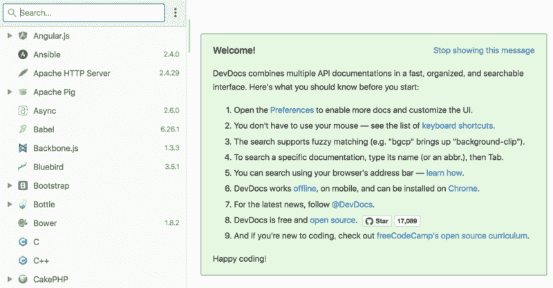
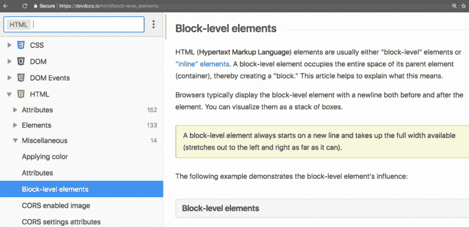
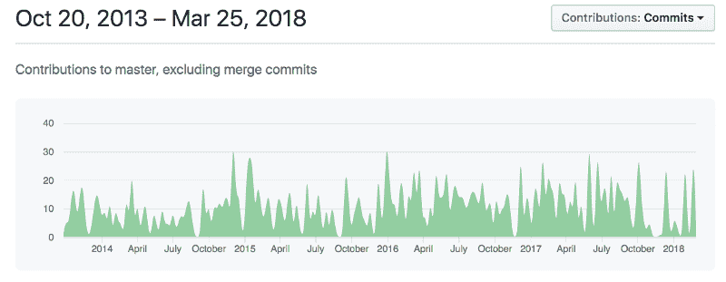
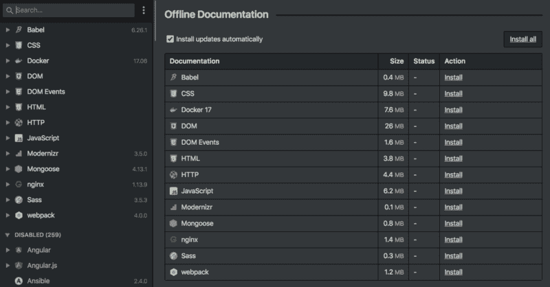

# DevDocs 正在加入 freeCodeCamp 社区

> 原文：<https://www.freecodecamp.org/news/devdocs-is-joining-the-freecodecamp-community-ae185a1c14a6/>

DevDocs 是一个开源的 web 应用程序，它将许多开发人员工具的文档合并到一个可搜索的界面中。

甚至在 freeCodeCamp 存在之前，我就已经在使用 DevDocs 了，这些年来我一直在赞美它。

The simple, no-nonsense landing page of DevDocs — with browsable API documentation along the left-hand side

DevDocs 的速度和简单性是真正的新鲜空气。每个 API 都以同样清晰的层次结构布局。

A screenshot of DevDocs.io and its intuitive API documentation browsing interface

所以当去年夏天设计免费代码营指南的时候，我心中已经有了一个清晰的模板。我们打算创建一个类似 DevDocs 的界面来探索编程概念。

我向 DevDocs 的创建者 Thibaut Courouble 寻求建议。他帮助解释了 DevDocs 是如何工作的，以及他的一些设计决策背后的推理。

DevDocs creator Thibaut Courouble

我和他一直保持联系。我们就如何让世界上没有可靠的高速互联网连接的地方的开发人员更容易使用工具交换了意见。

几个月前，Thibaut 找到我，询问是否有可能将 DevDocs 项目捐赠给 freeCodeCamp 社区，这样我们就可以继续发展这个项目，超越他作为一个单独的维护者所能做的。

今天——在 Thibaut 创建 DevDocs 整整 5 年后——我很兴奋地宣布 [DevDocs 现在正式成为 freeCodeCamp 社区的一部分](https://github.com/freecodecamp/devdocs)！

## DevDocs 简史

Thibaut 是一名法国开发人员，现在在加拿大渥太华的 Shopify 担任高级开发主管。

2013 年 3 月 26 日，也就是 5 年前的今天，Thibaut 创建了 DevDocs。当时，他只是想要一种更好的方法来快速访问 Mozilla 开发者网络文档。

最初，DevDocs 只是他硬盘上的一个普通文档文件夹，供他个人使用——许多开发人员手头都有供参考的那种。然后，经过几个月的开发，Thibaut 于 2013 年 6 月 18 日推出了 DevDocs，作为一款免费的 web 应用。

起初，Thibaut 保持 DevDocs 封闭源代码。但是 2013 年 10 月 24 日，他开源了。

DevDocs 项目已经积累了超过 17，000 个 GitHub stars，以及 66 个贡献者(尽管 Thibaut 仍然是迄今为止最多产的贡献者)。

Thibaut 编写了几十个抓取脚本，用于从不同的项目自动下载文档，每个脚本都经过精心调整，以创建一致的阅读体验并生成良好的搜索结果。

在接下来的两年里，Thibaut 增加了许多改进，如新的文档，键盘快捷键，更好的搜索，移动支持，以及切换到夜间观看的黑暗主题的能力。

然后在 2015 年，Thibaut 让 DevDocs 离线全功能化。突然间，任何人都可以下载整套文档进行离线访问。所有这些文件都将存储在浏览器中，这要归功于一种叫做 IndexedDB 的新技术的巧妙运用。

2016 年初，Thibaut 增加了对版本控制的支持。DevDocs 不再局限于文档的最新版本，而是开始支持每个项目和库的多个版本。

这两个主要的新特性将成为 DevDocs 用户群的转折点。该项目逐渐成为开发人员社区中使用最广泛的工具之一。

DevDocs offline mode preferences, seen here with dark mode enabled.

如果你想知道 DevDocs 在过去的五年里走了多远，比较一下这两条黑客新闻:

1.  2013 年 6 月的第一个帖子——大多数人不赞成将 DevDocs 与其他文档项目(其中许多现在已经不存在)进行比较。
2.  【2017 年末的第二个帖子——在黑客新闻有史以来投票最多的帖子之一中，人们称赞 DevDocs——尤其是因为它的速度。信息很清楚:你的项目不必是同类项目中的第一个——你只需要坚持下去，不断改进，你就能成为领导者。

**如今，每月有超过 100，000 名开发者使用 DevDocs 作为参考。**

## DevDocs 如何在幕后工作

人们问 Thibaut 的最常见的问题之一是:DevDocs 是如何变得如此之快的？

Thibaut 将 DevDocs 的速度归因于许多因素:

*   DevDocs 是一个单页 Ruby web 应用，后端很小。
*   当您访问 [DevDocs.io](https://devdocs.io) 时，在初始页面加载之后，所有后续文件(包括文档文件)都通过闪电般快速的内容交付网络(CDN)获取。
*   它使用 GZIP，HTTP 缓存，应用缓存，串联和缩小的 JavaScript 和 CSS
*   没有广告(广告让一切慢下来)
*   它使用 localStorage 作为某些资产的额外缓存级别
*   它使用一个内存缓存来进行即时的向后和向前导航
*   它使用 IndexedDB 在本地计算机上缓存整组文档
*   文档去掉了所有远程资产和不必要的标记，从而生成更小的文件
*   它使用[优化的客户端搜索](https://github.com/Thibaut/devdocs/blob/master/assets/javascripts/app/searcher.coffee)
*   它有一个非阻塞的异步用户界面
*   它有一个优化的 DOM 树，带有一个分页的侧边栏列表，这样它就不必立刻呈现 1000 个节点
*   它有一个简单的用户界面，避免了阴影或动画之类的虚饰

最后，DevDocs 不使用任何 jQuery 或任何 JavaScript 框架。所有的 DOM 操作都是手动实现的，这使得它们尽可能的快。(Thibaut 说，他不会为大多数应用程序推荐这种无框架方法，但它对 DevDocs 很有效。)

## 你如何参与其中

现在，我们正在寻找一个充满激情和经验丰富的 Ruby 开发人员，他有兴趣成为 DevDocs 的长期贡献者。

我们也在寻找对通过编写文档和重构代码使 DevDocs 更容易做出贡献感兴趣的人。

您还可以通过在问题跟踪器中报告您的任何 bug 或功能请求[，并帮助进行分类或修复。](https://github.com/freecodecamp/devdocs/issues)

你可以在 Gitter 上加入[DevDocs contributor 聊天室并介绍自己。](https://gitter.im/FreeCodeCamp/DevDocs)

最后，您可以通过使用 DevDocs 并与您的朋友和同事分享来提供帮助。下次你需要查找文档时，请访问 [DevDocs.io](http://devdocs.io/) 。

你也可以通过在 Chrome 的地址栏中输入“devdocs”并点击 tab 键来搜索 DevDocs。DuckDuckGo 还有一个特殊的`!dd`命令来搜索 DevDocs。

和我一起欢迎 Thibaut 和 DevDocs 加入 freeCodeCamp 社区，在他身上发推文。

玩得开心，快乐编码！