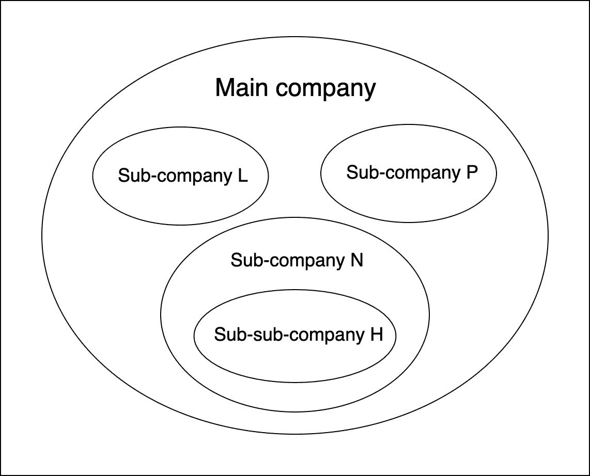
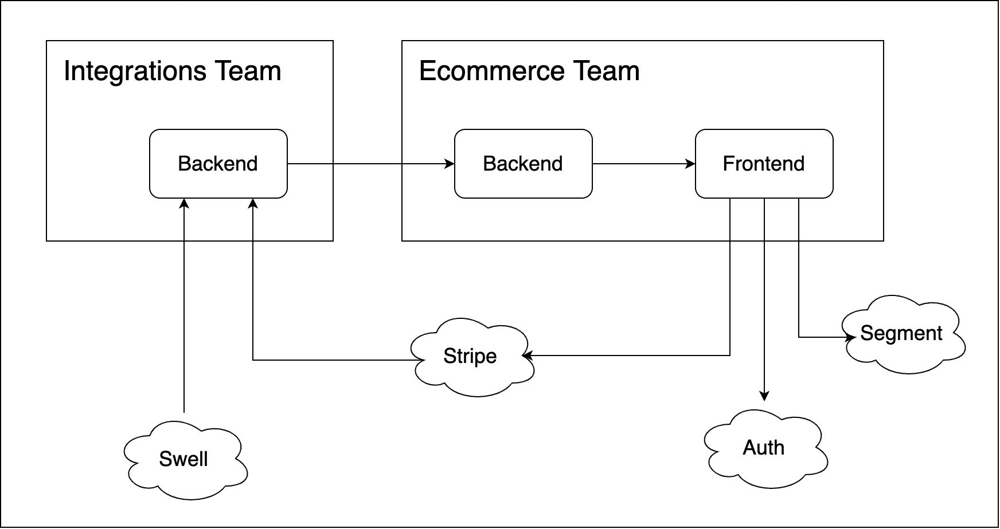
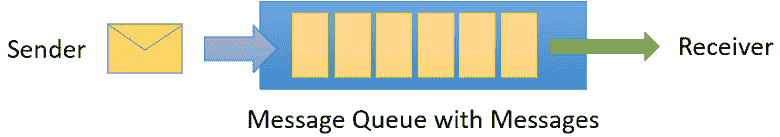
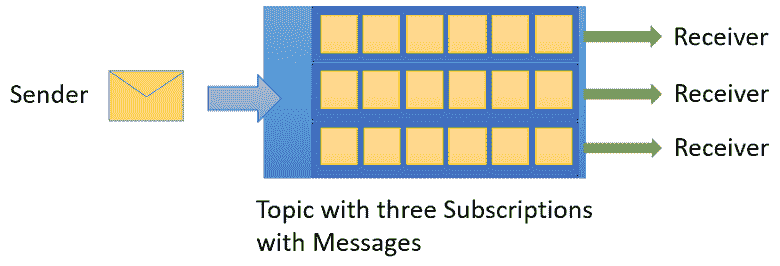
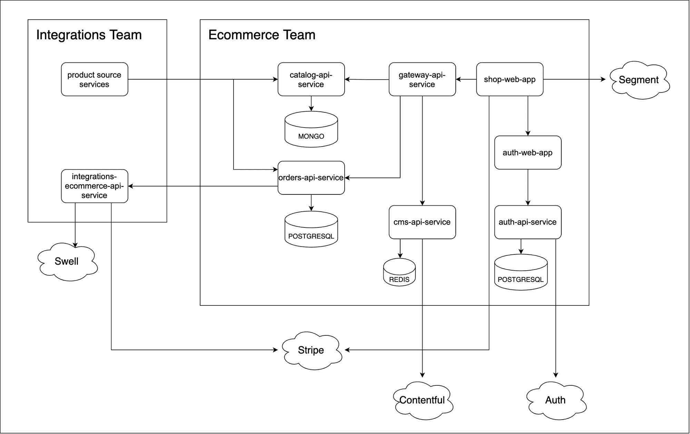
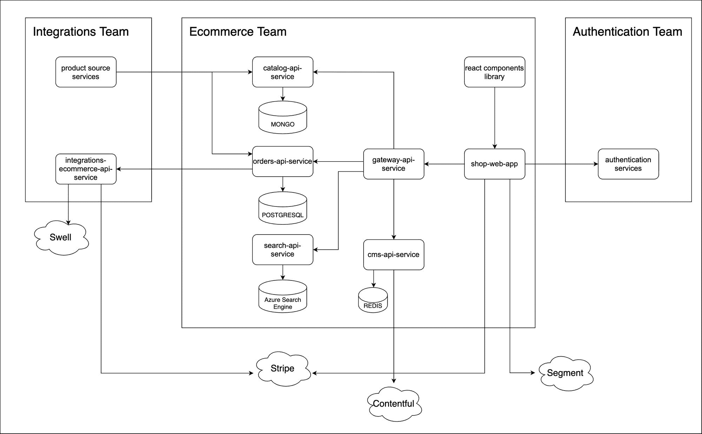
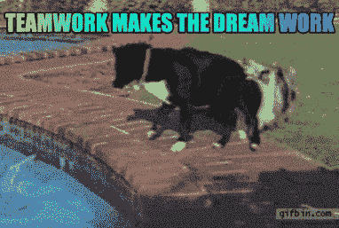

# 如何开发可重用的电子商务平台

> 原文：<https://www.freecodecamp.org/news/develop-a-reusable-ecommerce-platform/>

这是一个关于我的团队努力开发的故事，不是一个单一的电子商务平台，而是一个不同的所有者可重复使用的平台。我们保持了相同的代码库、外观和感觉，并使其高度可定制。

我将以我们从这一过程中学到的东西来结束我的发言。我认为我们的成果将成为其他软件开发人员有用的学习资源(对我们自己未来的项目也是如此)。

我会尽量把重点放在相关的部分，让它更容易理解。说到这里，通读这篇文章需要一点背景知识。

## 目录

*   项目背景
*   第一个 MVP
*   实现 GraphQL
*   架构和技术堆栈
*   第二个 MVP
*   结论和经验教训
*   最后的想法

## 项目背景

我们为其开发平台的客户是一家电子学习公司，它由 3 家主要的子公司组成。

在过去的几年里，这些分公司基本上是独立运营的。但是现在他们试图创造一种标准化的做事方式，这样他们就能以最好的方式共同成长。

这个项目是一个雄心勃勃的项目。创建一个适用于所有子公司的电子商务平台并不容易设计或实现。他们有大量未解决的问题，这使得很难估计。

## 第一个 MVP

为了应对这一艰巨的挑战，我们从 3 个子公司中的一个开始，姑且称之为 h 子公司。事实上，它不是一个主要的子公司，而是一个子公司的子公司。

为了更好地解释，如果我们把三个主要的子公司命名为 L、N 和 P，那么 H 就是 N 的子公司。

成为一家子公司并不意味着平台会更容易开发。事实上，考虑到 MVP 的所有特性，情况正好相反。

*Main company structure*

虽然主要目标是让用户能够购买产品(这似乎很明显)，但要完成这个看似简单的 MVP，还需要依赖太多的其他服务。

部分产品和订单信息来自另一个团队的领域，即集成团队(在中我称之为团队*)。他们与 [Swell](https://www.swell.is/) 和 Klopotek 沟通，Klopotek 是一个电子商务系统，我们在其中存储了产品信息和订单状态。*

折扣也是由团队*在*中提供的，我们必须订阅它，然后在显示之前根据用户信息和权限计算最终的产品价格。

为了让客户能够访问和定制图像或描述等产品内容，我们通过一个内容平台 [Contentful](https://www.contentful.com/) 进行检索，客户可以在这个平台上以一种简单的方式管理这些内容。

我们用支付服务 [Stripe](https://stripe.com/) 管理支付，然后我们与的团队*沟通，更新 Swell 上的订单状态。*

可供用户进行身份验证的服务应该对所有者是不可知的，并且可以在所有子公司上重用。它必须由另一个团队提供，但最终，我们实际上自己开发了它。

为了锦上添花，我们还必须使用 [Segment](https://segment.com/) 实现用户跟踪，这是一种从 web 和移动应用程序收集用户事件的流行服务。

这是我所描述的一个简单的图表，可能会更容易理解。为了简单起见，我将微服务架构分为*后端*和*前端*。

MVP Architecture overview

## 我们为什么选择 GraphQL

为了完成我们的项目目标，我们必须*向前端提供来自后端的产品核心信息的唯一真实来源*。

因此，我们唯一的目标是让一个商店的前台与另一个商店的前台有所不同的是设计和内容。

关于这些设计及其在 React 上的实现，我们计划使用一个共享组件库。

因此，GraphQL 在这里做什么，为什么我们决定去做呢？

嗯，如果你不知道 GraphQL 是如何工作的，本质上它允许你用所有的属性和查询来定义一个模式，这些属性和查询可以用于你的产品。然后，它让您将它提供给前端，让它决定请求什么，而后端不必为每个请求创建一个端点(就像 REST 服务一样)。

要了解更多，请查看我写的这篇教程[来解释它](https://www.ramonmorcillo.com/getting-started-with-graphql-and-nodejs/)。它教你如何使用 Node.js。另外，[他们的文档](https://graphql.org/learn/)值得一查。

这意味着每个商店只需通过查看模式，即事实的来源，就可以从产品中请求所需的数据。

由于这个事实，我们不必为每个商店在后端实现不同的数据源。这给了前端请求在每个界面显示所需的产品数据的权力和责任(第一个涉及第二个🕷)。

> 权力越大，责任越大。
> —斯坦·李

需要明确的是，如果我们决定使用 REST，我们将需要为每个商店创建不同的端点。或者，我们必须让前端检索每个商店中的所有产品数据，然后决定显示哪些属性。这意味着它必须在前端存储不必要的数据，这只会增加噪声。

或者更糟的是，我们会为每个前端商店部署所有商店的后端服务。这将使用不必要的资源，并大大增加成本。

这就是我们采取这种初始方法的原因。在我看来，最糟糕的部分是浪费时间去维护和重构我们已经制造出来的混乱。

此外，通过按需发出单个请求，负载变轻了，因此网络性能得到了提高。

无论如何，和每个问题一样，在开发这个项目和它的架构的过程中，我们可以采取其他的方法。但在那一刻，我们觉得这是最好的一个。

## 架构和技术堆栈

微服务架构主要由 Azure K8s 集群上托管的 Node.js 服务组成。根据他们的需求和他们处理的数据，他们有或没有相关的 MongoDB、PostgreSQL 或 Redis 数据库。

它们之间的异步通信主要是通过发布/订阅消息通信模型由 [Azure 服务总线](https://azure.microsoft.com/en-us/services/service-bus/)主题和订阅来处理的。

常见消息传递队列的主要区别在于，您可以有多个接收者，因此您不需要多个队列来接收多个服务中的消息。

Azure Service Bus messaging Queues. [Source](https://docs.microsoft.com/en-us/azure/service-bus-messaging/service-bus-messaging-overview#queues)

Azure Service Bus messaging Topics. [Source](https://docs.microsoft.com/en-us/azure/service-bus-messaging/service-bus-messaging-overview#topics)

在前端部分，站点是用 React 开发的。有时我们使用 [Next](https://github.com/vercel/next.js/) ，其他的我们用 [Create React App](https://github.com/facebook/create-react-app) 从头开始构建，这取决于每个的复杂性和需求。

我们从以前项目中使用的 Redux 转移到官方的[上下文 API](https://reactjs.org/docs/context.html) 来管理大部分状态。

以下是第一个 MVP 架构的主要服务及其功能:

*   **商店-网络-应用:**客户端商店应用。
*   **网关-API-服务:**代理服务，接收来自客户端的请求，并将它们重定向到相应的服务。
*   **cms-api-service:** 从 Contentful 检索和提供内容的服务
*   **catalog-api-service:** 在消息中订阅 team 并持久化产品核心数据的服务，稍后通过 GraphQL 为其提供服务。
*   **订单-API-服务。**处理所有支付业务逻辑的服务
*   **auth-api-service:** 临时服务，实现用户认证，以便能够购买产品。
*   **auth-web-app:** 认证服务的客户端。
*   **集成-电子商务-API-服务:**来自处理支付的集成域的服务。虽然这项服务不属于我们的领域，但我们一起开发它是为了提高交付速度，让他们从额外的工作中解脱出来。

First MVP architecture

为了在 Azure 上部署和更新所需的资源，我们使用了 [Terraform](https://www.terraform.io/) ，它让我们将基础设施定义为代码，并在 K8s 集群上管理它们的生命周期。我们还与 Azure DevOps 合作，作为我们的 CI & CD 系统。

在服务上，我们使用了[systematic](https://github.com/guidesmiths/systemic)，这是一个 Node.js 框架，用于最小的依赖注入，允许您在系统中创建组件及其依赖关系。每个组件以与其他组件不可知的方式处理来自域的独立对象，如路由、控制器、服务、数据库等。

我们选择 Apollo 来实现 GraphQL。它为我们提供了一个数据图形层来轻松连接前端和后端。

同样，要了解更多，请查看[他们的文档](https://www.apollographql.com/docs/)或[本教程。](https://www.ramonmorcillo.com/getting-started-with-graphql-and-nodejs/)

最后，我们在 [GitHub](https://github.com/) 上托管了代码，以利用 Pull 请求等特性在实现代码之前正确地审查我们的代码。

## 第二个 MVP

MVP(最小可行产品)是您在项目中创建和交付的第一个原型。这意味着通常只有一个，当你创建它的时候，你就开始在它上面实现新的特性。

那么，为什么我们在同一个项目中关注第二个 MVP 呢？嗯，当我们达到第一个的“稳定”版本时，客户意识到我们需要从主要的分公司商店开始。他们决定停止子母公司 H 店的开发，以专注于新店的开发。

这主要是因为一些服务在未来几个月内停止了对子公司的支持，这意味着他们的商店必须首先开发。

Graphical representation of how we felt with the second MVP

尽管我们试图对第一个 MVP 做一个适当的估计，但是我们超过了它的截止日期，因为在这个过程中出现了一些计划外的问题。因此，当我们被告知新的截止日期会更快时，我们决定采取不同的方法来按时完成。

我们决定同时发展一家以上的商店，这是一种双刃剑的做法。

一方面，我们会在重构平台的过程中看到平台的可重用性方面做得有多好。我们最终也会拥有不止一家商店。

另一方面，我们必须建立和维护多个商店的环境和资源。此外，我们还必须实施他们的设计，这会让我们慢下来，这意味着我们可能再次无法按时到达截止日期。

我们把这个 MVP 看作是一个重新开始和改进我们代码库的机会。因此，我们向 React 应用程序添加了类型脚本和样式组件。

我必须承认，当我们做出这些选择时，我非常高兴，因为我一直在自己的项目中使用这个堆栈。所以现在我能够学到更多，甚至做得更好。

幸运的是，我们能够为 React 应用和后端服务重用以前 MVP 的大部分代码。但并非一切都是称心如意的。

并非所有人都习惯使用这种新的堆栈，这在开始时会降低我们的速度。此外，使用相同的堆栈，我们开始为所有平台开发一个 React 组件库，尽管它是为第一个 MVP 计划的，但从未出现过。

那时，负责用户认证服务的团队已经开始工作了，所以我们停止了开发，只是在网站上实现了它。

此外，我们开始与 [Azure 认知搜索](https://azure.microsoft.com/en-us/services/search/)一起开发产品搜索服务( **search-api-service** )。

在上述所有变化之后，架构以这种方式发展。

Second MVP architecture

## 结论和经验教训

当我写这篇文章的时候，这个平台还没有完成。但是，要达到我们的目标，这是一个巨大的挑战。

我们学到了一些对其他人有用的有价值的经验，不仅仅是关于上面描述的堆栈和架构，还有关于我们作为一个团队的工作方式。

### 创新堆栈

使用新技术可能会有风险，而且比坚持使用旧的和众所周知的技术更不舒服。但是创新和适应性才是正确的方向，这样你才不会在软件开发中落后。

当您升级您的堆栈或采用新的堆栈时，除了检查遵循标准的正确方法之外，最重要的一点是*确保团队能够舒适地使用它，*。不只是在开始的时候，而是在整个过程中，使过渡更容易。

### 不要低估，少承诺，多兑现

我们愉快地评估了第一个 MVP，并同意交付大量的特性。由于路上出现的各种问题，我们最终需要更多的时间，有时不得不学会说“不”。

在第二个 MVP 上，我们没有在时间上估计那么远，也没有承诺我们不能确定我们能在预期时间内交付的特性。

正因为如此，我们能够减轻工作压力，拥有更好的心情，交付更好的代码，并改善客户对项目的感觉，因为他们对项目的进展并不失望。

### 团队内部的团队合作。

我们意识到进步和发展的最佳方式是感到舒适——不仅仅是对技术，更重要的是对我们的队友。改善我们关系和团队合作的一些措施包括:

#### 团队民主。

无论我们此刻在做什么工作，我们所有人的声音都是一样的，在做出选择时，我们的意见也是一样的。当我们讨论新堆栈的采用和我们将遵循的实践时，这是关键。

#### 审查代码。

反馈不仅是改进代码本身的最好方法之一，也是改进你编写代码的方式的最好方法之一。这就是为什么我们决定使用 GitHub Pull 请求来实现大部分功能。

与他们一起工作不仅改进了我们的代码库，还让我们意识到这些特性是如何在其他领域实现的，避免了碰头会，并帮助我们跟踪整个项目范围。

我们一点一点地完善了这个系统，增加了一些功能，比如最少数量的审核者合并他们，或者通过 slack 订阅他们的 T2。

#### 帮助和寻求帮助。

在我看来，这个是必须的。如果遇到困难，团队必须摆脱寻求帮助的恐惧。同时，他们必须愿意在别人要求的时候帮助别人。

我很高兴地说，我们能够达到这种平衡，我们的工作在许多方面都有所改进。下一点，结对，是消除寻求帮助的恐惧和更好地了解彼此的关键。

#### 尽可能配对。

在软件开发的这个阶段，结对编程的优势是众所周知的。我们结对不仅是为了以更快更好的方式交付特性，也是为了从彼此的编码方式中学习。

每周，我们决定结对任务和实施任务的队友。但是，如果有人需要或想要配对，我们只需提出要求，然后队友主动提供帮助。

#### 重视反馈。

冲刺回顾是回顾所有进展顺利的事情、出错的事情、提出改变和期待改进的完美时刻。因此，我们分享的观点越多，我们可以处理和解决的问题就越多。

#### 与其他伙伴的团队合作。

我们依赖于其他团队的工作，因此与他们保持良好的关系也是我们开发过程中的一个重要环节。

*沟通是关键:我们沟通得越多，进步就越多，*。正因为如此，我们的目标是成为一个完整的团队。为了加强这种沟通，我们采取了以下措施:

*   有一个属于我们的私人空间。我们创建了一个单独的渠道来谈论进展，并尽快解决任何问题或疑虑，而无需额外的会议。
*   **快速会议。每周一次的会议对于检查主要问题的进展非常有效。但是，我们并不总是等待这一次会议，每当有问题需要讨论时，我们会立即打电话。**
*   了解最新的整体进展。我们团队的一名队友参加了他们的每日站立会议，我们团队的一名队友在需要时向团队的其他成员通报了最新情况。

以下是我们和整合团队的一些实际镜头:

#### 让客户感觉自己是团队的一部分。

在第一个 MVP 开始时，有太多的线索和太少的沟通来澄清它们，所以我们有时会受阻，或者不得不为这些问题召开浪费时间的会议。

像生活中的大多数问题一样，问题的核心是缺乏沟通。因此，我们通过增加沟通来解决这个问题，直接向客户提问，邀请他们参加回顾会、每日站立会议和其他会议，即使他们不被要求。

这有助于尽可能保持客户端更新。最后，我们交流得越多，就越让他们觉得自己是团队的一部分，我们就能更好地合作。

## 最后的想法

我想首先感谢我的队友。与他们一起工作是一件愉快的事情，每天都渴望一起开发项目。

同样，感谢其他队的队友，他们总是在需要时伸出援手。

我也很感激有机会参与这个项目的完整的端到端实施，从中我学到了很多东西。我解决了前端、后端和开发运维方面的问题，比如设置环境、管道、服务间的消息传递、持久化和检索数据、向前端提供数据以及实现显示数据的接口。

最后，我感谢有机会工作，并更好地掌握我在 GraphQL 或 TypeScript 等兼职项目中使用的技术。

我希望你喜欢这篇文章。你也可以在我的网站和其他人一起阅读[！如果你有任何问题、建议或反馈，请不要犹豫，从](https://ramonmorcillo.com/developing-a-reusable-ecommerce-platform/)[我的网站](https://ramonmorcillo.com/)的任何社交网络上联系。