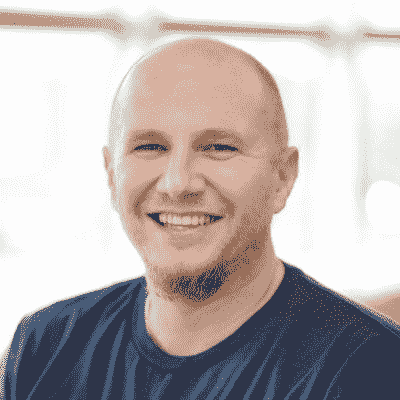

# 播客:服刑 12 年后成为一名开发者——蒂姆·迈尔斯访谈

> 原文：<https://www.freecodecamp.org/news/developer-after-prison/>

蒂姆·迈尔斯是来自丹佛的开发人员。20 世纪 90 年代，他高中毕业后立即加入了美国陆军。出狱后，他开始编码。当他在一家会计公司做开发人员时，他卷入了一场酒后斗殴，并最终导致他人受伤。

蒂姆被判二级伤害罪，被判 12 年监禁。他在狱中完成了大学学位，8 年后因表现良好被释放。

在接下来的 3 年里，他一边学习重返软件开发，一边从事各种工作，比如快餐。在过去的 4 年里，他在丹佛的几家公司做软件开发。

我采访了 Tim，关于他漫长而艰辛的软件开发之路。

我们谈论蒂姆与抑郁症、酗酒的斗争，以及被定罪的重罪犯在偿还社会债务后很久仍背负的污名。

这应该是一场黑暗的面试，但真的不是。蒂姆像他们一样坦率和坚忍。这是一个振奋人心的故事，讲述了一名美国退伍军人如何在监狱后重新开始职业生涯，以及他如何组建家庭。

这是你最喜欢的播客播放器应用程序中的两个小时的听力-只需搜索“freecodecamp ”,你应该可以找到它。

如果你有亚马逊 Echo，你可以直接说“Alexa -播放 freeCodeCamp 播客”

或者你可以[听它或者就在你的浏览器里](http://podcast.freecodecamp.org/ep-61-how-tim-myers-survived-a-12-year-prison-sentence-then-became-a-web-developer)。享受面试吧。