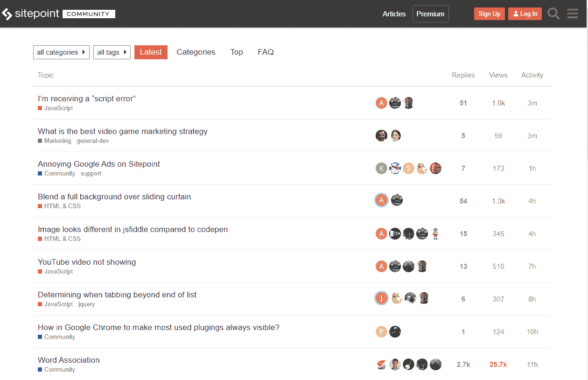
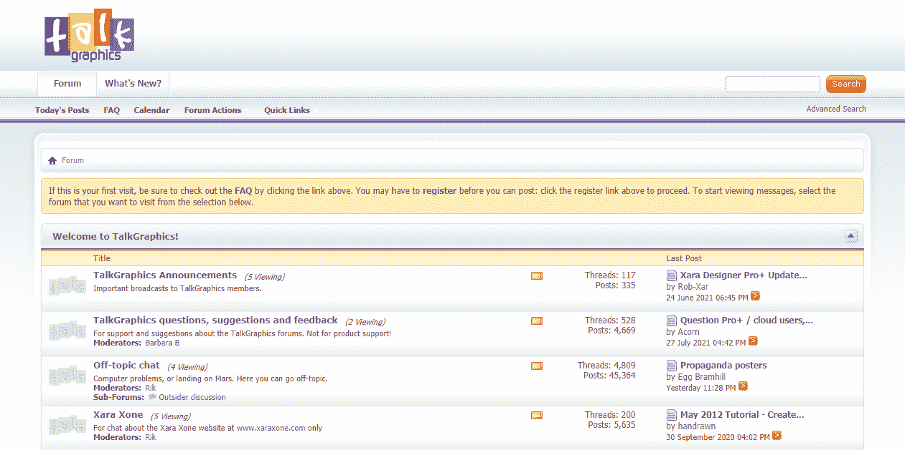
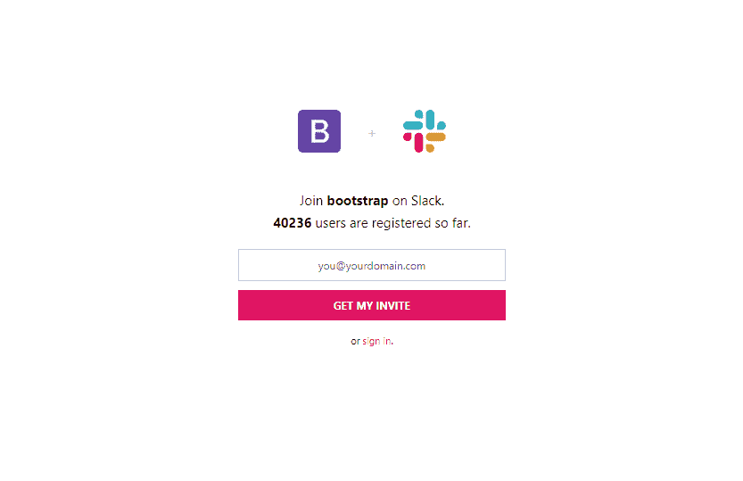
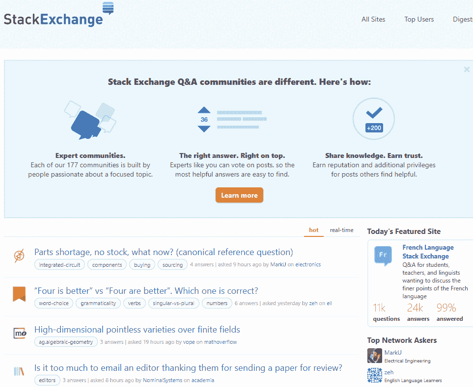
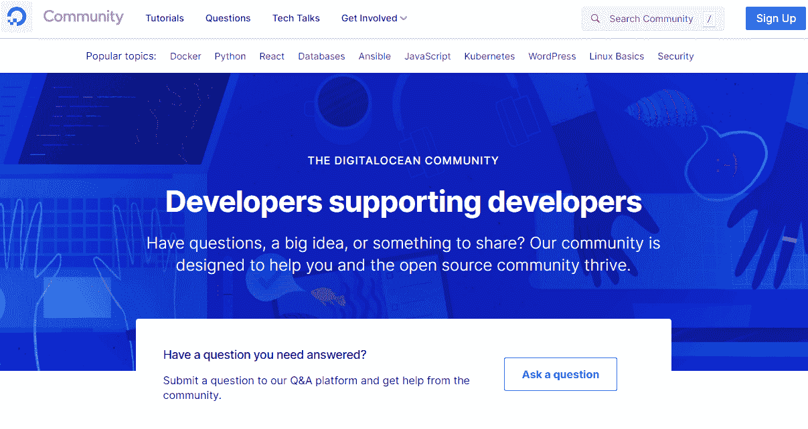
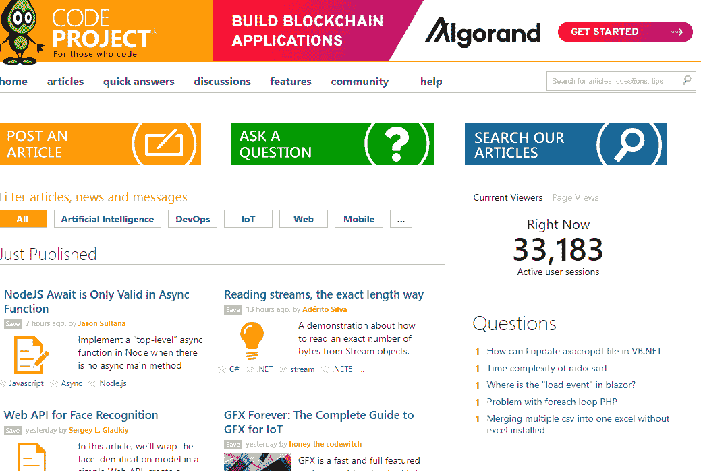
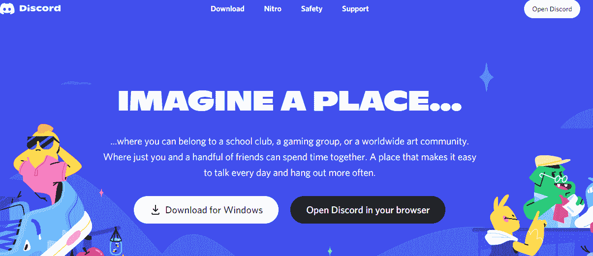
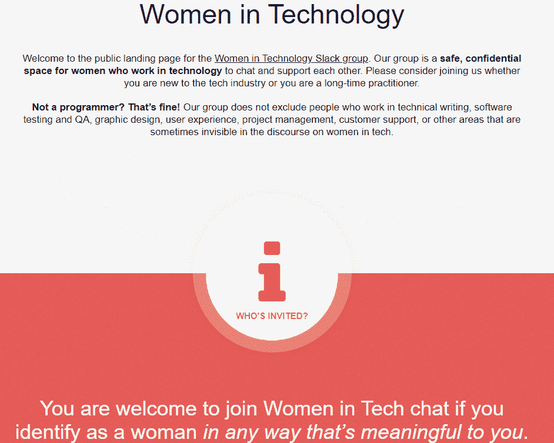
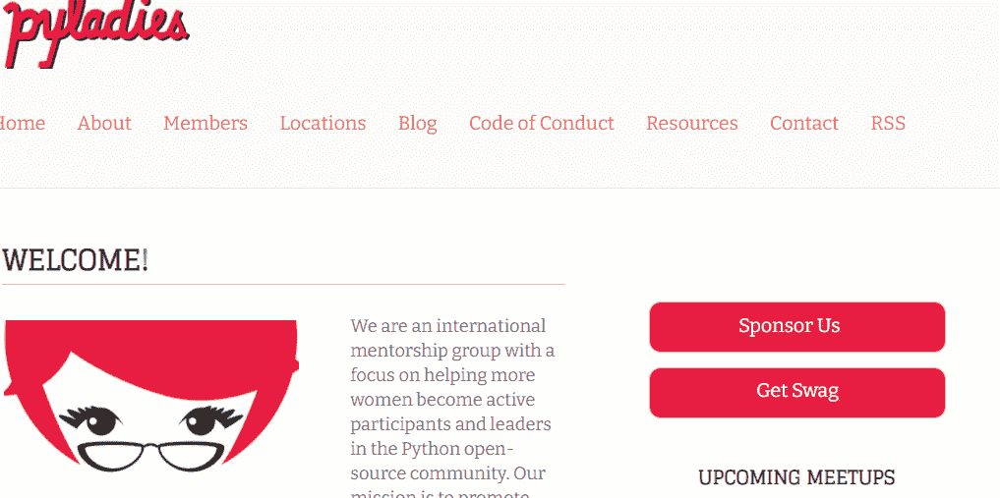

# 加入开发者社区，帮助您发展技术事业

> 原文：<https://www.freecodecamp.org/news/developer-communities-to-join-to-grow-your-career/>

> 独自一人，我们能做的很少；我们可以一起做很多事情。海伦·凯勒

这是真的——当你向某人伸出援手时，你会自我感觉良好，并且你可能会学到一些新的东西。

帮助别人感觉很有回报，因为你知道你为人类做出了非常重要的贡献。还有什么比加入众多开发者社区更好的方式来帮助你的开发者伙伴呢？

## 什么是开发者社区？

在过去的几年里，许多开发者社区带着不同的目标和使命走到了一起。但是你可能会同意我的观点，它们都有几个共同点:

*   他们帮助你学习，
*   他们分享想法
*   他们为新手提供支持，并且
*   你可以自由地与他们互动，也可以在他们内部互动。

有许多不同类型的开发人员社区——关注前端的、关注后端的和基于特定语言的。我们还有通用社区，在一个平台下包含所有上述内容。

### 开发者社区有什么好处？

正如我所说，这些社区提供的好处是“在另一个层次上”。他们帮助人们从零开始，并最终在谷歌和微软这样的大型科技公司找到工作。他们还培养了导师，并帮助提高了他们的代码编写和审查技能。

换句话说，成为开发者社区的一员可以真正帮助你学习如何编码。

## 你如何选择加入一个开发者社区？

我想帮助那些根据自己的兴趣和技能寻找好的社团加入的人。因此，我收集了几个主要关注前端、后端、博客等的顶级社区，以帮助您开始并结识您的开发伙伴。

我可能没有包括所有的社区，因为我们有很多这样的社区。所以，如果你觉得有任何其他真正有用和重要的东西，请随时给我发信息。

## Web 开发和设计社区

### [自由代码营论坛](https://forum.freecodecamp.org/)

这个社区的好处在于，你不仅可以提出问题，获得编程技巧，还可以获得职业建议，学习如何入门编码。

该论坛分为不同的子论坛，您可以根据自己的兴趣参与其中——HTML & CSS、职业建议、激励、与其他开发人员聊天的一般群组等等。

这个社区不需要任何会员费。你所需要做的就是用你的邮箱注册，然后你就可以成为这个社区的一员了。

### [网络开发者论坛](https://www.webdeveloper.com/)

web 开发者论坛是一个简单的网站，专注于学习 Web 开发和编程。它分为几个部分，web 开发人员和设计人员在这里学习和分享如何设计网站、构建移动应用程序、创建 WordPress 主题、编写 HTML 和 JavaScript 等等。

它易于使用，并且几乎涵盖了您对这些部分的所有疑问。对于刚开始从事 web 开发的开发人员来说，这是一个很好的地方。

要开始讨论，你需要做的就是注册，然后你就可以开始了。

### [site point 社区](https://www.sitepoint.com/community/)

在 SitePoint 上，你可以找到关于 CSS、HTML、市场营销、PHP、JavaScript、设计和 UX、数据库、虚拟主机等问题的答案。

这个社区的好处是，它不仅谈论寻找解决方案，它还有关于 web 开发的书籍、关于这些主题的文章等等(但其中一些功能只有在高级订阅下才可用)。

该社区有两个计划，免费和溢价。使用免费计划，您可以在社区中获得有限的资源，但使用高级计划，您可以无限制地访问课程、书籍、特色技术讲座等。

要成为这个社区的一部分，你只需要通过你的邮箱、GitHub 或者脸书注册。

### [谈论比喻](https://www.talkgraphics.com/)

顾名思义，这是一个平面设计师和 3D 艺术家的社区。

该论坛分为不同的分论坛，以方便新成员找到他们的设计类别，无论是网页还是图形。

在这里，你会发现现代网页设计师和图形艺术家的最新热门话题。

为了成为社区的一部分，你必须用你的邮箱注册，这是完全免费的。

### [咖啡杯](https://www.coffeecup.com/forums/)

CoffeeCup 始于 1996 年，当时一家咖啡店里有一个简单的 HTML 编辑器。

这个社区帮助设计师创建更好的网站。他们的主要目标是通过向客户提供优秀而又负担得起的软件来使生活变得更容易。

就像大多数社区一样，在论坛中你可以发表不同的问题，并找到其他问题的解决方案。

要加入正在进行的对话或成为社区的一员，您只需用您的电子邮件注册创建一个帐户。

### [自举](https://bootstrap-slack.herokuapp.com/)

Bootstrap 是一个流行的用于 UI 组件和交互的 HTML、CSS 和 JS 框架。该社区关注并讨论使用 Bootstrap 进行 ragarding 开发的最新趋势和技巧。

这个框架非常适合在流行的前端组件库的帮助下构建响应式站点。

要加入，使用 slack 频道或订阅他们的官方博客。

### [indie hacker](https://www.indiehackers.com/)

IndieHackers 是一个新兴的开发者在线社区。这是一个成功创业公司的创始人与他人分享他们的故事和经验的平台。

它的主要目的是帮助那些想开始他们的技术创业和副业项目的人，提供指导和大纲。你会从成功的科技企业家那里得到建议。

这是一个开放的论坛，每个成员都可以分享经验，探索想法，并为未来的开发人员提供支持。

目前这是一个只接受邀请的平台，这意味着你必须有一个注册的邀请代码才能加入。

#### [日常 UI](https://www.dailyui.co/)

如果你想成为一名 UI & UX 设计师，这个平台就是为你准备的。日常 UI 就是一系列 UI 挑战，顾名思义就是每天都贴，帮助设计师提高和完善技能。

你会找到设计灵感，当你完成项目时，你会得到奖励。所有这些都是为了帮助你在 100 天内成为一名更好的设计师。来自社区的惊人支持将激励你不断学习。

这是完全免费的，你需要做的就是注册你的邮箱。

## 博客社区

### [开发到](https://dev.to/)

如果你正试图开始撰写和发表与技术相关的文章，并且没有自己的领域，这就是开始的地方。你还会遇到一群热情的作家。

这是一个由 60 多万开发人员组成的开源社区，他们分享、学习并保持对最新技术趋势的了解。它有播客、文章、视频、真实世界的例子、黑客马拉松等资源。

要开始加入，请注册电子邮件或 GitHub 帐户。你会有自己的仪表盘来发布你的文章，就像这样`https://dev.to/larymak`

### [freeCodeCamp](https://www.freecodecamp.org/news)

freeCodeCamp 是一个非盈利平台，你可以在这里免费学习和练习编码——他们还有一个博客平台，开发者可以通过写文章来分享知识。

社区[也有一个论坛](https://forum.freecodecamp.org/)，在这里你可以见到其他开发者，分享想法，提出问题，解决问题，找出错误，并增加你的知识。

freeCodeCamp 出版物不是一个开放的出版平台。但如果你被接受为作家，编辑团队会仔细审查和编辑你的文章，然后向大量观众发表和宣传。

如果你想申请为 freeCodeCamp 的出版物写作，这篇文章将告诉你如何:[文章](https://www.freecodecamp.org/news/how-to-write-for-freecodecamp/)

#### [哈希节点](https://hashnode.com/)

Hashnode 是一个全球性的开发者社区，在这里你可以分享正在进行的项目，提出问题，提出想法，并帮助他人解决他们的问题。

这是一个免费的平台，帮助您与最新的技术趋势保持联系。

你可以发布博客，获得自己的子域，或者添加自己的子域，关注你喜欢的作者，甚至可以在 GitHub 上备份你的博客。还可以参加黑客马拉松，赢取奖品。

要加入，你需要在脸书、LinkedIn、谷歌或 GitHub 上创建一个账户，然后你就可以免费得到你的子域。

### [黑客月](https://hackernoon.com/)

Hackernoon 是一个你可以阅读、写作和发表文章的网站。这是一个拥有 15，000 多名作家和 300 多万读者的社区。顶级科技公司利用这个平台分享他们的专业知识。

### [代码新手](https://www.codenewbie.org/)

Code Newbie 最初是一个每周一次的 twitter 聊天，为学习编码的人提供有用的支持。

从那以后，它已经发展成为一个支持开发者的社区，你也可以在这里发表文章。

### [为开发者写博客](https://bloggingfordevs.com/)

这是一个面向开发者、自由职业者和技术创造者的私人社区，他们希望通过在线写作来扩大受众。

唯一的问题是它不是免费的——你需要付费才能成为它的一部分。

## 通用技术社区

还记得我之前提到过，有些社区在一个屋檐下拥有所有这些特性吗？在这一部分，我们将看看其中的一些。

一旦你成为注册会员，你只需要选择你的类别，你就可以开始了。

### [堆栈溢出](https://stackoverflow.com/)

对于任何热衷于编程的人来说，堆栈溢出都是一个巨大的资源。你可以加入这个社区来学习、分享和发展你的事业。

它接待了来自世界各地的开发人员，他们来寻找他们的编码挑战的答案，并就他们的错误提出问题。

神奇的是:根据他们的分析，每 12 秒就有一个问题发布，并且总是由已经知道如何解决的开发人员来回答。

### [堆叠交换](https://stackexchange.com/)

栈交换由栈交换网于 2010 年推出。
它由 173 个 Q & A 社区组成，包括我们刚刚讨论的堆栈溢出。

### [Reddit](https://www.reddit.com/)

Reddit 是一个全球社区，有很多子群体或子 Reddit，并且有无休止的对话在进行。

它有几乎所有趋势话题的线索，会面的机会，如何调试你的代码，工作列表，以及其他许多事情。

现在，为了帮助你走上正确的道路，这里有一些常见的子 reddits，你可以订阅并获得更新通知:

[WebDev](https://www.reddit.com/r/webdev) ， [ReactJS](https://www.reddit.com/r/reactjs) ， [Python](https://www.reddit.com/r/Python/) ， [Javascript](https://thehiveindex.com/communities/r-javascript/) 等等。

### [GitHub](https://github.com/)

GitHub 是一个非常受开发者欢迎的网站。社区论坛是开发者分享想法和跟进讨论的地方。

您还可以轻松地共享您的代码，并与其他人就他们的代码进行协作。这个特性使它成为一个非常有用和有趣的编程和编码社区。

### [数字海洋](https://www.digitalocean.com/community)

数字海洋是一个开发者可以找到或提供支持并为社区做出贡献的地方。该社区为开发人员提供指南、教程、趋势、问答部分等等。

### [编码项目](https://www.codeproject.com/)

Code Project 是一个面向计算机程序员的社区，提供不同主题和编程语言的文章，如 web 开发、软件开发、C++、Java 和其他主题。

### [在](https://devrant.com/)前面

devRant 是一个有趣的社区，开发者可以分享和联系他们在代码、技术和程序员生活中的成功和挫折。DevRant 有一个面向社区的 iOS 和 Android 应用程序。

### [不和](https://discord.com/)

就像 Reddit 一样，Discord 被组织成称为服务器的组。这些被组织成基于主题的频道，在那里你可以合作、分享，只是谈论你的一天，而不会阻塞群聊。

## 专门面向女性的技术社区

在过去的几年里，许多倡导在技术领域赋予女性权力的组织已经成立。他们呼吁男女机会均等。

这些社区的主要目的是提供支持，并创造一个让妇女感到舒适的学习环境。

### [女性编码](https://www.womenwhocode.com/)

Women Who Code 是一家国际非盈利组织，通过活动、编码资源、工作、导师等为技术领域的女性提供一个全球社区。

他们旨在激励、支持和帮助女性发展技能并在职业生涯中脱颖而出。

### [科技界的女性](https://witchat.github.io/)

女性在技术领域是一个安全、保密的空间，让从事技术工作的女性能够聊天并相互支持。他们欢迎那些已经掌握大量编程知识的人，也欢迎那些刚刚起步的人，这样他们就可以帮助彼此成长为一个社区。

### [编代码的女生](https://girlswhocode.com/)

编写程序的女孩致力于激励、教育和装备女孩的计算机技能，以追求 21 世纪的机遇。

该组织帮助成千上万的女性进入计算机科学教育领域。目标是为超过一百万的年轻女性提供计算机科学教育。

### DjangoGirls

Django Girls 是一个非营利组织和社区，通过提供工具、资源和支持，帮助妇女组织为期一天的免费编程研讨会。

### [铁轨女孩](http://railsgirls.com/)

Rails Girls 社区类似于 Django Girls 社区，致力于提供自主举办的活动，帮助年轻和成年女性参与编码游戏，并随时提供支持和建议。否则，旅程有时会显得有点凄凉。

### [幽门螺杆菌](https://pyladies.com/)

这个名字说明了一切:

> 我们是…
> …一群热爱 Python 编程语言的全球女性开发人员。我们白天或晚上写代码。我们中的一些人兼职从事 Python 项目，而其他人则全职从事 Python 开发。不过没关系。我们都喜欢编写 Python 代码，这是我们走到一起的原因。

PyLadies 是一个由女性 Python 开发人员组成的简单社区。它旨在为女性提供一个友好的支持网络，以及通向更大的 Python 世界的桥梁。任何对 Python 感兴趣的人都可以参与进来！

## 特定语言社区

### [Python](https://www.python.org/community/)

这个社区由 Python 组织运营，其主要目的是帮助 Python 开发人员提高他们的技能。

他们的目标是公开如何提高透明度，为机构群体提供与组织互动的机会，并对机构群体成员提出的任何建议做出回应。

如果你想专攻 Python 并了解该语言的最新特性，这是你应该加入的社区。

### [Java](https://www.oracle.com/java/technologies/javacommunity.html)

Java 社区有数百万的成员，有很多方法可以参与进来。

您可以加入他们不同的分论坛，与其他开发人员进行互动，或者您可以分享与 Java 相关的技术文章(顺便说一下，您可以通过分享获得报酬)。

### [C/C++](https://cppalliance.org/slack/)

这个社区的任务是让任何希望学习和应用 C++编程语言的人都可以使用这种语言。

这个社区将来自世界各地的 C++用户聚集到同一个地方，这样他们就可以互相学习。

为了成为社区的一员，您需要一个邀请代码，您可以在注册社区时请求该代码。

### [C#](https://csharpforums.net/)

这是一个 C#和。NET 开发人员，分享如何开始和如何使用该语言的技巧。

该社区还分为子论坛，在这里您可以提问、跟进对话，还可以分享想法和您在工作中遇到的任何问题。

要想加入，你需要注册一个谷歌、脸书或微软的账户，而且完全免费。

### [PHP](https://phpcommunity.org/)

这是一个活跃而充满活力的程序员社区，它是围绕着对 PHP 编程语言的热爱而发展起来的。这个社区是关于友谊和互相帮助提高 PHP 水平的。

### [锅炉](https://kotlinlang.org/community/)

你可以成为 Kotlin 社区的一员，要么加入他们的用户运动团体，计划 kotlin 活动，要么加入现有的活动。你也可以为语言和生态系统做出贡献。

在社区中，您可以了解 Kotlin 在 Android、Google 云平台和多平台开发中的要点和最佳实践。

### 雨燕

顺带一提，在 Swift 论坛中，我们鼓励公开对话，并鼓励 Swift 语言的活跃开发者监控相关的论坛类别。

### 月球

Lua 社区的主要目的是聚在一起，认识新的开发人员，讨论 Lua 语言、它的用途和它的实现。

另一个目标是帮助向技术行业和学术界传播 Lua。

### [iOS 开发者](https://ios-developers.io/)

这个社区有大约 3 万多名成员。他们的主要目标是开放、互相帮助和分享知识。

你可以通过电子邮件、Google 或 Apple ID 加入。当你加入时，你可以申请邀请，很快你就会成为会员。

### [移动开发者](https://forum.xda-developers.com/)

这个小组是由开发者成立的，为开发者服务。对于那些想充分利用移动设备的人来说，从定制外观到添加新功能，它都是一个宝贵的资源。

它面向来自 Android、iOS、游戏等各类移动应用开发者开放。它被分成几个分论坛，在那里你可以根据你的技能加入

## 结论

"志愿者没有报酬，不是因为他们一文不值，而是因为他们无价。"雪莉·安德森

你可以在上面列出的所有社区中找到这样的人，他们随时准备帮助你提升到下一个层次。

通过加入开发者社区，许多开发者找到了他们梦寐以求的工作，并建立了持久的友谊。这些社区改变了许多人的生活。

你是 on 的成员吗？如果没有，你还在等什么？

真正的社区需要承诺和开放。

请分享您的宝贵意见，感谢您的真诚反馈！

享受编码❤