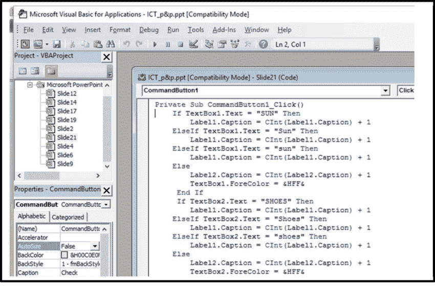
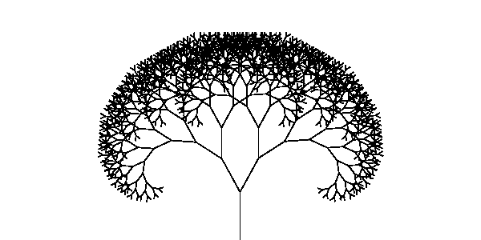

# 我的开发者之旅——我如何学习患有阅读障碍和多动症的人的编码

> 原文：<https://www.freecodecamp.org/news/developer-journey/>

大家好，我是 jal mari ikvalko，30 出头的软件开发人员。在这篇文章中，我将分享我从第一次接触代码到成为今天的专业开发人员的整个旅程。

我就从我小时候第一次对编程感兴趣说起吧。

## 我的编程入门

我大约 12 岁的时候——可能有一年左右——一场意想不到的夏季风暴把我们困在了西班牙南部阳光明媚的阳光海岸。这是我小时候唯一一次真正意义上的出国，因为我家的经济状况通常不允许我出国度假。

我和我的堂兄弟在祖父的小公寓里——因为他手术后的肺不适应芬兰的冬天——那里有一台电脑。这台电脑不能上网，但当时微软的 Word 恰好包含了一个 Visual Basic 编辑器和编译器。

然后是我的表弟，比我大一两岁，向我展示了一些 Visual Basic 编程的基础知识。

A screenshot of Microsoft Visual Basic editor

从我记事起，我就对电脑感兴趣，并喜欢花时间在电脑上。

我大部分时间都住在我妈妈那里，那里没有那么多视频游戏，电脑也比现在的潮流落后几代。尽管如此，我还是可以花很多时间探索计算机能做什么。尝试 DOS 命令，浏览我找到的随机文件，等等。

所以当我意识到任何人都可以在这些机器上编程并创建新的应用程序时，我当然立刻就被吸引住了。

## 我小时候是如何开始学习编程的

我的旅程开始时相当颠簸。当时，我不知道一个英语水平很差的小孩可以从哪里找到学习编码的有用资源。我窃听了我爸，他做过一些网站，对编程这种现象有一些大概的了解，他给我看了一些 HTML，CSS，JavaScript。

当时，JavaScript 相对较新，还没有完全确立自己作为事实上的网络语言的地位。事实上，大多数网站都避免依赖它。

我翻遍了我们当地小图书馆的书，但大部分书我都完全看不懂(尽管那里的图书管理员很棒。放学后我在那里闲逛时，他们会向我推荐书籍，那里有一台可以上网的电脑。

我让妈妈给我买了一本关于 C++的书，我吃力地读着，几乎不明白我在读什么。

## 阅读障碍和多动症的挑战

在学习编程的最初几年，我并没有真正持续地专注于学习，也没有真正能够完成任何项目——甚至是最小的项目。

当我试图做一些事情时，我经常感到非常沮丧，我不明白为什么它不像我想象的那样工作。

与此同时，学校也不是很好。我在小学的头几年被诊断患有阅读障碍，当时正在接受英语补习教育。我还与动机和欺凌作斗争，最终只能勉强通过而不必留级。

在我 15 岁左右的时候，我发现了 IRC(一个基于文本的聊天系统)和一个拥有自己网站和 IRC 频道的芬兰编程社区。那时，我们终于有了宽带互联网连接，这让我大部分时间都可以上网。有可以交谈的人和我母语的资源加速了我的学习过程。

我也对 demosscene 感兴趣——一个计算机艺术家围绕着所谓的 demo 的场景。这些程序在运行时以编程方式生成视频和音频，而不需要预先录制视频和音频并存储在程序中。我对以编程方式创建视觉效果产生了兴趣。

尽管如此，我仍在努力理解图形编程以及如何创建更高级的视觉效果。我被困在创建一些非常简单的，像一个基本的树分形。

A simple tree fractal

与此同时，我有一些同龄人，不一定比我大，他们正在做复杂的 3D 效果，全程演示，完全可玩的游戏，等等。

相比之下，我常常觉得自己很笨，因为我不像他们学得那么快，而且我很难理解复杂的代码。

回想起来，这并不令人惊讶——我的诵读困难症和后来被诊断出的多动症确实影响了，并继续影响着我辨别彼此符号的能力。它们也使得理解一长串文本变得困难，不管这些文本是用人类语言还是编程语言写的。

即使如此，我还是会因为阅读句子太长的文本而感到精神疲惫。陀思妥耶夫斯基的《罪与罚》的前十页左右，对我来说，就像是在读一本关于高等代数几何的整本书。

尽管如此，我继续努力，因为我想到有一天我将能够创造视觉效果、游戏、物理模拟等等。

## 我的第一份工作

我做了一些小演示和一些物理演示，没什么特别的，总体来说很粗糙，但不知何故，他们还是设法给我在当地一家小公司找到了一份实习工作，为手机开发 3D 引擎。

那是 2008 年左右，我 18 岁的时候。当时我甚至没有智能手机。一年前，第一代 iPhone 刚刚问世，我总是有点跟不上最新的技术。

我很确定手机的 3D 引擎毫无意义——谁会想在这么小的屏幕上看 3D 内容呢？当然，我是完全正确的！好吧，好吧，我没有，但更糟糕的是——让我有点害怕的是——我完全没有这个能力。

我设法在面试中假装出某种技能印象，但事实上，我不知道如何正确编程着色器或改进和优化渲染引擎。

我无法胜任这份工作，我的合同也没有续签——我感到非常尴尬，因为我从来没有在未来的求职申请中包括过这段短暂的工作。

## 参与开源

在那段时间，我也为一些开源游戏和 3D 引擎做出了一些小小的贡献。它并没有什么特别的，数学的，前沿的东西——只是添加了一些小的特性，比如将常量值复制粘贴到某个规范的列表中，或者添加了一个可以同时选择多个项目而不是一个项目的特性。诸如此类的东西。

我仍然学得很慢，无法独立完成复杂的任务。这是令人沮丧的，因为我已经知道编程大约六年了，并且已经更加积极地练习了两年。参与的人都很有帮助，我也从每个帮助我的人身上学到了很多小东西。

## 我的大学经历

我 19 岁那年申请了大学。我没有进入芬兰大学的正式先决条件，因为我还没有完成芬兰的大学入学考试(大致相当于美国的 SAT 和英国的 A-levels)。

尽管如此，我还是给他们写了一封信，请求允许他们参加计算机科学的考试。我得到了许可，考试分数足够高，可以入学。

不幸的是，我仍然不是一个非常好的学生。一方面，我有点太骄傲了，觉得初级课程对我来说太卑微了。另一方面，如果一门课程变得很难，我很快就失去了学习的动力。

几年后，我只完成了几门课程，什么也没学到，就被开除了。

我大约 21 岁，离开了学校，没有工作，回到了我妈妈的住处。我仍然把编程作为一种爱好。为开源软件编写小功能，尝试一些短期工作(但都失败了)。然后，我注意到我的一个 IRC 频道上有人在寻求创业帮助。我自愿参加，最后被录用了。

## 在创业公司工作

我对这个人有一点了解，因为他们和我参与了同一个社区，尽管在我加入他的公司之前我们没有直接交谈过。

这是一个有点不寻常的设置。我们合租了一套公寓，这算是非正式的薪酬，我的工资大约是我现在工作的公司支付给实习生和大三学生第一份工作的一半。

我一般不会向人们推荐这类合同，但就我而言，结果并不太糟。我终于有点用了，可以独立生活了，并且至少赚了一点钱——到了月底一点都不剩。

我仍然不太擅长独立完成任务，我的代码质量也相当糟糕。但是在这样的薪酬水平下，我朋友的创业公司并没有太多的选择。大部分时间，我都在做一些小的功能改进，修复 bug，给软件添加一些新功能。

一两年后，我遇到了我后来的妻子。我们搬到了一起，我换了城市，离开了那个创业公司。

## 初级游戏开发者

然后，我申请了另一家初创公司，薪水略高，员工超过 2-3 人。我的技术面试任务是给一个溜冰者在冰上的 3D 场景添加一个镜面效果。

通常，通过在反射的位置放置一个虚拟相机来进行反射，然后从该相机的角度渲染场景。不过，我从来没有这样做过，最后使用了我以前做过的另一个黑客。

我只是再次渲染了场景，只是在 X 轴上翻转了一下。这是一种不完美的技术，但在旧游戏中经常使用，对于相机下方足够远的平坦表面也足够有效。

就所需的技能而言，这份工作有点杂乱无章。我为一大堆不同的项目做出了贡献——即使微不足道——这一事实最终得到了回报。

同一天，我可能会为图形效果编写着色器代码。我可能会修复一个 web 后端，配置安装程序，或者维护服务器(在我十几岁的时候运行 Linux 是值得的！尽管它从未让我像别人告诉我的那样在学校受欢迎。

## 从初级开发人员到首席技术官

当我开始的时候，我是一名初级游戏开发人员。随着时间的推移，我们得到了越来越多的项目，工作变得更具挑战性，然后有一天我们的 CTO 离开了。没有人能代替他，我成了替代者。

几乎与此同时，优秀的 Adobe Flash 正在消亡，对它的支持也在结束，而我们的产品碰巧大部分都是 Flash。因此，我最终领导了我们主要产品的重大改写，从 Flash 到 Unity 游戏引擎。

与此同时，我们扩大了网络产品的种类，我也领导了这些产品的开发——有时更成功，有时不太成功。我仍然不知道我到底是如何设法跟上这一切而不在压力下崩溃的，但我想当你给某人责任时，他们可能会应付自如。

A noise meter & crowd camera product of a startup I worked for (from Uplause promotional materials)

我最终在那家公司工作了六年。但在某个时候，我开始觉得我职业发展的机会已经耗尽了。我们有实习生和大三学生过来，呆半年到一年，很多时候我是唯一有经验的全职开发人员。

我也不再对这些项目投入太多。做这些事情很有趣，但我没有任何公司的股份，我的工资也没有其他地方的水平。

当时，我并不十分了解芬兰更广泛的 IT 领域。我主要了解我们最大的游戏公司——过去没有，现在也没有那么多——但我并不真正了解大型咨询或产品公司是什么。

所以，我最终申请了一份新工作，只是简单地在谷歌上搜索职位空缺，找到一家有明确使命和价值观、看起来很适合我的公司。

我当时并不知道，但那家公司实际上已经赢得了一系列奖项，成为最佳工作场所之一。从某种意义上来说，在这里工作是很有声望的。

令人遗憾的是，我在准备不足的情况下参加了面试，但文化契合度很好，我的技术技能被认为足以通过面试，最终我被录用了。

## 从创业到软件咨询

所以，大约三年前，我离开了创业公司，成为了一名软件顾问。

当我加入目前的公司时，我对自己的技能非常自信，认为自己已经成长为一名非常优秀和聪明的程序员。我并没有完全错，但是事实证明我从一条小池塘里的大鱼变成了一条大池塘里的普通鱼。

我的宿敌，专注和专注(或者说缺乏专注和专注)再次制造了需要处理的不和谐。我怀疑我永远不会完全摆脱不得不定期重复寻找动力和保持纪律的斗争。

我还严重忽略了我的部分技能。在第一年半的时间里，我显著提高了我的函数式编码技能和编写易于测试的代码的能力。

我还需要更新我的许多知识。习惯新的持续集成工具、云服务测试工具和库是一个相当漫长的过程。(在那些勉强度日的小型创业公司，我们通常使用虚拟专用服务器，因为它们更便宜，而且云服务还不像现在这样成熟。)

然而，实际工作是提高的最佳方式之一，我确实提高了——而且在我看来，速度相当不错。

今天，我们公司不太重视头衔，我们有时会故意夸大头衔，只是为了博人一笑。但是如果我必须给客户一个头衔，我通常是一个高级软件顾问。这是一个足够描述性的标题。

在经历了成为一名可以启动项目、领导功能开发、参与软件开发的所有阶段，并且其他人可以依赖其帮助和反馈的开发人员的艰苦漫长的旅程后，我认为我终于成熟到足以检查对高级开发人员的期望的所有框。

我还在不断学习新的东西。最近，我开始觉得我想尝试从事数据工程、数据分析和机器学习任务。

因为我大部分时间都逃学了，所以我一直在赫尔辛基开放大学学习统计学课程，以便更好地理解数据分析师使用的术语和方法。

另一方面，我也开始学习关键的云证书，如数据管理员和数据工程师证书，以进一步提高我在客户端产品方面的证书。

而且，有趣的是，在通过艰难的课程终于取得一些成功后，我也开始觉得也许学士学位对我来说也不是不可能的。虽然我不确定过了这么久我是否还想要计算机科学！

## “运气是当准备遇到机会时发生的事情”

这就是我的旅程，从我第一次看到代码到我今天所做的事情。这有时是一条令人沮丧和坎坷的道路，我知道许多人比我更容易学会编程。不过，总的来说，我认为自己相当幸运。

一位前同事曾经引用罗马哲学家塞内卡的一句话作为他们的签名，“运气就是当准备遇到机会时发生的事情”。但是不仅仅是这样。你的童年环境会影响你的准备，你得到的机会取决于统计概率。

我认为自己很幸运，有这么多的机会，尽管也因为缺乏准备而失败了。

我认为自己很幸运，因为有支持我的父母和一个聪明、懂编程的表弟给我展示东西。

今天，我很幸运，因为我有一些非常棒、非常有技能的同事，以及一个接受神经分歧的工作环境。

然而，这句话还是有点道理的。如果准备是你努力工作的结果，即使工作几乎让我头破血流，我还是努力工作。

事实是，如果你有阅读障碍或多动症这样的缺点，你学习的时间可能会比别人长得多。但这并不意味着不可能学会。最终的结果可能会更加甜蜜。你最终获得的技能将是来之不易的，证明了你克服困难的能力。

如今，新学员可以获得更好的资源，这绝对令人惊叹。当我年轻的时候，免费资源的质量——当它们完全可用的时候——经常是可疑的，许多教程没有教好东西，即使完全正确。

我们有赫尔辛基大学的 MOOC.fi 这样的网站供所有人免费使用。我们当然也有免费代码营。有许多学习社区遍布 Reddit、Discord 等等。

好好利用这些服务，也许有一天，在完成之后，回过头来看看你能为他们做些什么。

我想给编程新手的最后一个建议是:编程在有趣的时候是最好的。如果你对目前的课程感到厌倦，并且不喜欢你的时间，尝试一些不同的东西。

产生正弦波并组合成和弦。以编程方式创建一些分形。尝试使最讨厌的网站成为可能，当点击按钮时有闪烁的灯光和声音效果。

让编程变得有趣。在做这件事的时候，你还会学到惊人的东西。

除了 freeCodeCamp 的编辑团队，我还要感谢 Liisa Toivonen 在校对和一些建议方面的帮助。

感谢阅读！