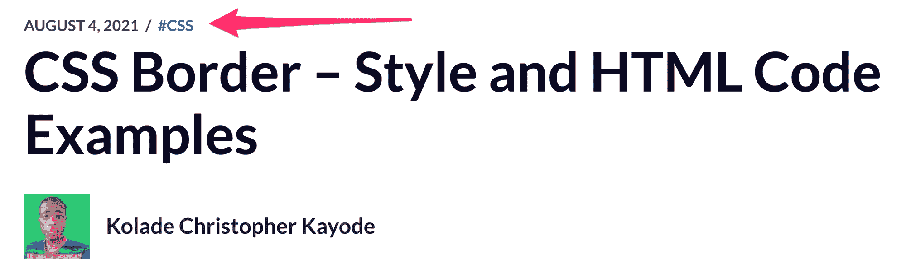
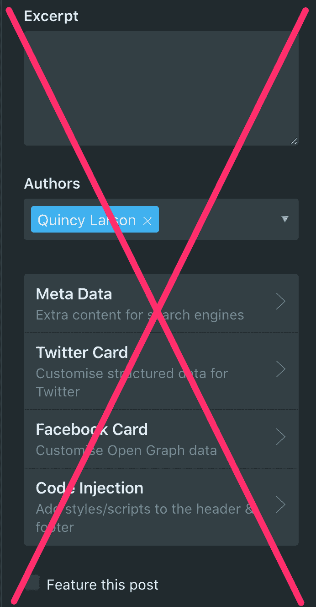
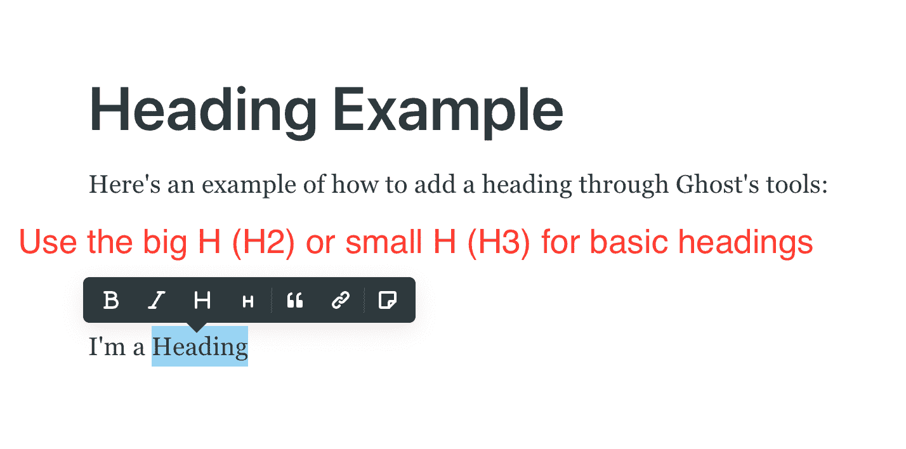
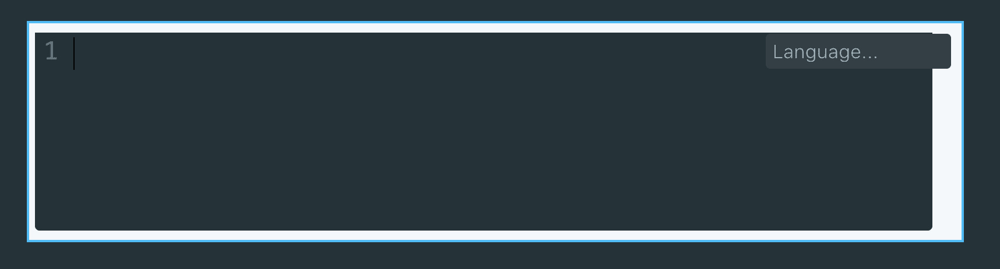
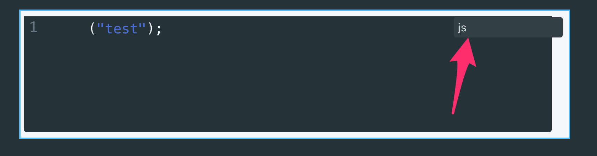

# freeCodeCamp 出版物风格指南

> 原文：<https://www.freecodecamp.org/news/developer-news-style-guide/>

Editor's note: leave this image here or the next image will be hidden.

感谢您与开发人员社区分享您的专业知识和见解。

我们的出版物将帮助您向世界各地的开发人员、设计人员和数据科学家传授知识。

作为网络上访问量最大的技术网站之一，freeCodeCamp.org 可以帮助你接触到成千上万的人，他们将从你的智慧中受益。

我们的非营利组织也有大量的社会媒体存在，强大的可访问性，搜索引擎优化，以及作为一个严肃的学习资源的既定声誉。所有这些都会为你的教程带来更多的读者。

在这篇风格指南中，我们会给你一些建议，让你的教程尽可能的强大，从而最大化你的影响力。

# 物质赢得胜利

这不是一个“一天写一篇博客”式的挑战或意识流观察帖子的地方。

带上你的事实。带上你的报价。带上你的代码片段。带来你的数据可视化。

多年的数据表明，教程越深入，人们花在阅读上的时间就越长，也越有可能分享给朋友。

如果你不能就你的主题写至少 500 字，试着先做更多的研究。

通过深入研究和扩展你的研究，你将能够向你的读者提供更多的洞察力。

# 正确打包你的教程

人们很忙。所以你必须立刻抓住他们的注意力。你是怎么做到的？标题引人注目。

## 标题:你的教程中唯一会被 100%的人阅读的部分

在你开始写你的故事之前，花点时间构思一个引人注目的标题。然后，你的整个教程将从那个标题中涌现出来，并回过头来支持它。

在过去的 8 年里，我们尝试了许多格式。我们发现，深入的技术教程对我们出版物的全球数百万开发者读者最有帮助。

以下是我们发现的一些适用于教程的标题结构:

*   “如何修复…”
*   “如何构建…”
*   “如何使用[工具]执行[任务]”
*   “某物如何工作”
*   “…的[形容词]指南”
*   “[名词]到底是什么？”
*   “为什么某事很重要。”
*   "某事物的历史"
*   “某物手册”(至少 10，000 字的更长的教程)

您也可以在标题中包含人们经常搜索的关键词。不要包含太多(“关键词填充”不好)，但值得思考的是，人们在搜索什么会让他们找到你的文章。

### 添加您的封面图片

一旦你选择了清晰、信息丰富的标题，添加一个漂亮的封面图片。为此，请点按右上角的齿轮。

一些投稿人为他们的教程创作了自己的封面。像 Canva.com 这样的免费网站可以帮助你完成这个过程。(如果您想防止在 Twitter 或 LinkedIn 上分享您的教程时图像的边缘被切断，**请使用 1.91:1 的图像纵横比**。)

在制作封面图片时，请记住以下几点:

*   使用对比鲜明的颜色，让图像/文字真正流行起来
*   不要在你的图片中包含太多的文字——只关注主题/关键词(例如，不要包含所有这些文字:“如何用 React 构建一个点餐应用程序”，你可以只说“如何用 React 构建一个应用程序”或“构建一个 React 应用程序”。)
*   总的来说，记住:封面图片越简单越好。你想要一个醒目的图像，易于在较小的设备上查看/阅读。
*   你可以用你的封面图片来帮助建立你作为作家的“品牌”。如果你创建了设计一致的图片，人们通常会通过封面图片认出你的教程。

如果你没有图片，你可以从 Pexels、Unsplash 或 Wikipedia 等网站下载一张无需署名的图片，保存后上传到 Ghost。

请不要热链接图片。取而代之的是，下载你想要使用的任何图像，然后将它们拖到你的 Ghost 教程中。这样，freeCodeCamp 可以通过我们自己的可靠 cdn 提供图像(以获得更好的性能和可访问性)。请尽量将图像大小保持在 1MB 以下。

还要记住，使用屏幕阅读器的人将看不到你的图像、图表、图形和截图。所以**请在所有对理解你的教程很重要的图片上加上一个简洁相关的标题**。这有助于辅助功能，并允许您指出有关图像的关键附加信息。

### 设置你的文章网址

您可以直接设置教程的 URL。我们建议保持这些简短和描述性的，如“使用 pytorch 的机器学习教程”或“如何推送至 git 远程存储库”。

## 选择您的标签

您可以为您的教程选择一到五个标签。一旦你选择了他们，只要让编辑团队知道，我们会为你添加他们。

这些标签会让读者在搜索和浏览标签时更容易发现你的教程。

你选择的第一个标签是最重要的，它会出现在你的教程上面，就像这样。

What tags look like on freeCodeCamp's publication

请不要更改菜单中的任何元信息。我们的出版物对此有合理的默认值。

Don't alter these values in Ghost - the defaults are great.

## 写一篇人们会真正阅读的教程的技巧

### 语法、拼写和格式的确很重要

阅读清晰且格式正确的教程更容易。以下是一些让你的教程尽可能具有可读性的技巧:

*   保持简单。尽可能使用简单易懂的语言。
*   使用短句。把长句子分解成短句子。这有助于人们读得更快，理解得更好。
*   使用短段落。将较长的段落分解成一到两个句子段落。文本墙会让你的读者放弃你的教程或者切换到“略读”模式。
*   **清理标点符号。**感叹号太多会分散注意力！！！分号很少是必要的；用句号代替就行了。椭圆是...良好的...通常有点多。
*   使用副标题来组织你的文本。我们的出版物为您的工具包提供了大标题和小标题。对主要主题使用大标题，对这些主题中的部分使用小标题。
    您可以使用 Markdown 语法添加标题(H2 为#号，H3 为#号，以此类推)，或者双击您想要制作标题的文本。将出现以下菜单:

How to add H2 and H3 headings in Ghost

*   **不要使用过多的粗体、斜体或两者都用**。过多的文本格式使其难以阅读。 ***特别是当你同时使用粗体和斜体的时候*** 。分别使用粗体和斜体，并尽量少用。
*   **去掉缩写**。它们使得教程更难理解。拼出任何不知名的缩写。将拉丁语表达如“例如”变成“例如”和“…等”变成“喜欢……”

### 尽可能使用主动语态

人们通常在交谈中自然地使用主动语态。它更加随意和平易近人，并暗示行动和权威。

所以尽可能在你的教程中使用主动语态。

这里有一个主动语态的例子:

"**您可以按照以下步骤安装** Node.js。"

这里有一个被动语态的例子:

" Node.js **可以通过以下步骤安装**"

这可能看起来很微妙，但是主动的例子更容易与读者联系起来，并帮助他们自信地遵循指示。

有时候，把写教程想象成向朋友解释某件事会有所帮助。你不需要使用过于复杂的语言，你会很友好和礼貌，事情会顺理成章。

### 校对你的教程。然后再校对一遍。

一些投稿人写得很快，这样他们就可以把他们的想法写在纸上。其他投稿人在写一个字之前做了所有的研究。

无论你的写作过程如何，一定要离开你的教程，带着一双崭新的眼睛回来。

再读一遍你的教程。然后大声读出来。你会惊讶于你发现的小错误、拼写错误和笨拙的短语。

### 向代码中添加语法突出显示

您可以通过键入三个反勾号(` `` `,然后按空格键来创建代码块。

A code block in Ghost

您甚至可以指定想要语法突出显示的编程语言。

例如，输入` ` js 将会突出显示 JavaScript 语法。我们还支持十几种其他流行编程语言的语法高亮显示。

A syntax-highlighted code block in Ghost with the programming language added

### 不要跑题

读者的时间是有限的。在你的读者不得不继续他们的生活之前，帮助他们从你的教程中获得尽可能多的价值。

### 尽可能让你的教程循序渐进

1.  写一个简明的介绍，告诉读者他们将完成什么。
2.  使用像这样的编号列表来表示步骤。
3.  尽可能详细地打包。
4.  通过提醒读者他们刚刚完成了什么来结束。

## 编写更长的综合教程，而不是多部分教程

我们一次又一次地观察到，如果人们没有读完之前的所有部分，他们就不会费心去读一个系列的第二、第三或第 n 部分。

与此同时，我们已经看到，非常长，深入的教程工作得出奇地好。人们会把你的教程加入书签，或者在社交媒体上分享，这样他们就可以回来看了。

当人们看到一个教程很长时，他们通常会认为这个教程是严肃而全面的。这激励人们放慢脚步，真正花时间阅读你的教程。许多人甚至会打开他们的代码编辑器，在家自己编写代码。

## 尽可能保持 G 级

freeCodeCamp 社区大部分是成年人，但也有一些孩子。

除非直接引用，否则尽量不要使用脏话，并避开潜在的攻击性模因。

最后，如果某个教程似乎违反了 freeCodeCamp 的[行为准则](https://code-of-conduct.freecodecamp.org/)，我们会立即删除。但是我们会保存一份副本，寄给您作为自己的记录，这样您就不会丢失您的作品。

## 使用不需要署名的图片或你自己创作的图片

您可以包括您自己创建的屏幕截图和其他图像。但是如果你没有一张照片的版权，那就用一张不需要注明出处的相似图片来代替。这些不需要许可费或归属。

同样，如果你需要库存图片，你可以在 Pexels、Unsplash 和维基百科上找到这些图片。

另外，作为提醒，请不要热链接图片。相反，只需下载您想要在教程中使用的任何图像，然后将它们拖入 Ghost。这样，freeCodeCamp 可以通过我们自己的可靠 cdn 提供图像(以获得更好的性能和可访问性)。请尽量保持图像大小在 1MB 以下。

一些图像——比如网络漫画——是在分享的理念下创作的。对于这些，你可以插入图片，然后说“图片来源:XKCD ”,并带有该网络漫画特定页面的链接。

## 永远相信你的来源，不要抄袭

抄袭是指某人将他人的作品(或图像或代码等)误传为自己的作品。这是一种严重的违法行为，会让人被解雇，被学校开除。我们同样重视 freeCodeCamp 的出版物。

很少有人厚颜无耻地试图剽窃 freeCodeCamp 的出版物。但是在过去的 7 年里，他们中的一些人。我们已经抓住了他们，删除了他们的教程，并终身禁止他们进入我们的社区。

不要担心——你不会无意中剽窃任何东西。抄袭是一种故意行为。

### 如何正确引用你的资料来源

如果你在转述(或直接引用)某人在另一个教程、视频、课程或其他媒体中说过的话，你应该相信他们。这意味着添加到原始源的链接并使用引用格式，如下所示:

> “这个游戏完全是通过输入命令行界面来控制的。因为游戏本质上是实时的，所以当你试图从危险中拯救你的无人机时，这可能会导致一些快速键入命令的紧张时刻。”([来源:昆西·拉森](https://www.freecodecamp.org/news/best-coding-games-online-adults-learn-to-code/)

这包括来自官方文档、StackOverflow、GitHub 和所有类似资源的文本(或代码)。如果你从这样的来源复制并粘贴了一些东西，确保你引用了它并链接到它。

总是把引用归功于最初说它们的人。如果是多行引用，你可以使用这样的引用来分隔较长的段落:

> "当你有自己的智慧时，相信别人的智慧是一种乐趣。"克里斯·伊斯兰大教堂

如果你的代码在很大程度上受到了他人代码的启发(或借鉴),你应该信任他们。

在你发表一篇严重依赖他人作品的教程之前，问问你自己:我的教程是否在那个人的作品上有实质性的扩展？如果不是，它可能不值得一个教程。

关于使用他人话语的最后一点:尽可能使用自己的话语总是更好。因此，与其复制/粘贴和过度引用其他来源，不如尝试消化这些信息，并用自己的话来解释。这会帮助你更好地理解它，你也不会冒险去剽窃别人的作品。

但是如果你必须引用或借用其他来源的话，**确保正确引用**。

### 一些剽窃的例子

这里有几个剽窃的例子——那么，什么是**不**要做的。第一个应该相当清楚(它是逐字逐句复制的):

#### 原文:

> 在我们开始之前，先简单说明一下:Instagram 的桌面界面和移动应用程序非常不同。大多数人在他们的移动设备上使用 Instagram(从 Instagram 应用程序)，因为那是你可以发布照片的地方。([来源:艾比·雷恩梅尔](https://www.freecodecamp.org/news/how-to-use-instagram-like-a-pro/))

#### 抄袭的文字:

> 好了，大家准备好了解 Instagram 了吗？让我们开始吧！
> 
> **在我们开始之前，先简单说明一下:Instagram 的桌面界面和手机应用程序有很大不同。大多数人在他们的移动设备上使用 Instagram(从 Instagram 应用程序)，因为那是你可以发布照片的地方。**
> 
> 既然已经解决了，我们就准备出发吧。

如你所见，抄袭的文字夹在原文之间。人们很容易添加别人精心制作的短语或段落。但除非你引用了那些部分，否则就是抄袭。

下面的第二个例子可能不太突出。但是如果你是在严密地转述别人的话，那仍然是剽窃。

#### 原文:

> 你可能想在 Instagram 上分享照片和视频的原因有很多。也许你正在创业或推出一款产品。你可能会为一家希望拥有 Instagram 的公司工作。作为一名摄影师、旅行者或艺术家，也许你想建立自己的个人品牌。或者你只是想通过图片分享你现在的感受。
> 
> 不管是什么原因，Instagram 是一个在线分享想法、信息和艺术的好地方。([来源](https://www.freecodecamp.org/news/how-to-use-instagram-like-a-pro/))

#### 抄袭的文字:

> 在 Insta 上分享照片和视频有很多理由。
> 
> **也许你正在开创自己的事业或推出某种产品。也许你为一个想要 Instagram 的组织工作。或者也许你想创建自己的品牌。或者你只是想用图片展示你现在正在做的事情。不管怎样，Instagram 都是一个在网上发布想法、信息和艺术的好地方。**

如你所见，以上文字大量基于原文。它可能会改变几个单词，或者漏掉几个，但很明显，这个人不是自己写的。同样，这是不可以的，会被认为是剽窃。

如果你对什么是抄袭有任何疑问，请做一些研究，并确保你知道如何正确引用你的来源和创作原创作品。

## 请不要交叉邮寄。

交叉过账一般无效。如果你想让很多人阅读你的教程，我们建议你在一个出版物中发布该教程——无论是 freeCodeCamp 的出版物，还是你自己的博客，或者在线杂志。

有几个例外:

*   在像 LinkedIn 这样有围墙的花园(没有被 Google 索引)里交叉发布教程是值得的。
*   如果你想在自己的博客上展示你从其他出版物中撰写的文章，让潜在的雇主看到，你可以交叉发布到自己的博客上，只需使用规范的 URL 指向原始出版物。这将减少谷歌混淆并在结果中显示错误版本的可能性。

但是，您可以将您的一些类似主题的个人博客帖子(例如“Visual Studios 插件”或“高级 Bash 命令”)收录到一个更长的 freeCodeCamp 教程中。

我们的理念是，由于我们将花费数小时指导您的教程，精心编辑它们，并向更广泛的 freeCodeCamp 社区发布它们，我们要求您不要在 Medium 这样的开放发布网站上交叉发布。

## 你可以在教程中自我推销的可接受的方式

freeCodeCamp.org 是一个由捐赠者资助的非营利组织。我们不想让任何人觉得我们做“有偿安置”(我们不做)，因为这可能会阻止人们向我们捐款。

同时，我们完全理解你可能想要宣传你的新书、课程或 SaaS 申请，或者让人们注册你的邮件列表或在 Twitter 上关注你。

我们要求你尽可能保持这种品味。在你的教程结束时，为你的产品**做一个一句话的行动号召是非常好的。**

不要打开带有产品链接的教程，因为这看起来很垃圾。不要在你的教程中使用附属链接，除非它们是你个人创作的书籍或课程的链接。

另请注意，我们不允许品牌账户。我们禁止任何形式的代写。我们不会将教程从一个公司的一名员工转移到另一名员工。

请不要代表那些还没有获得免费代码营贡献者帐户的人写故事。

请注意，出于您自己的 SEO 目的，与大多数流行网站不同，我们出版物上的所有链接都是`rel="doFollow"`。这意味着是的——你链接的每个页面(包括你自己的博客)在谷歌的排名都会有所提升。请记住这一点，不要过度。

## 完成该过程

一旦你确信你的故事已经为读者准备好了，就通过电子邮件把你草稿的链接发给 editorial@freecodecamp.org。我们的编辑团队将在发布之前快速浏览并编辑，以进一步强化您的教程。

我们主要关心的是标题和开头的段落。如果我们注意到任何文本格式问题或语法错误，我们也会纠正它们。

如果我们仍然认为你的教程需要大量的工作，我们会告诉你，然后你可以重新提交，一旦你做了这些改变。

最后，一个重要的注意事项:如果一家公司付钱让你写一篇文章，然后试图在 freeCodeCamp 的社区出版物上发表，请在你提交草稿时向编辑团队披露这一点。

## 其他有用的提示

### GitHub 降价

你知道你可以用 GitHub 风格的 Markdown 来编写你的教程吗？

您可以将 markdown 粘贴到/news 中，它会立即转换为富文本。

您也可以在行首键入 markdown 语法，例如#或##表示标题，或者*表示项目符号列表，然后开始键入。文本将变为您指定的格式。

### 小心嵌入

如果你愿意，你可以嵌入像推文和 YouTube 视频这样的东西。只需在新行的开头单击+图标，就可以从各种嵌入工具中进行选择。

也就是说，我们鼓励您谨慎使用这些工具，原因有三:

1.  嵌入程序调用外部服务，比如 Twitter，这可能会降低体验速度
2.  许多阅读该出版物的人使用屏幕阅读器来阅读。很大一部分开发人员患有视觉障碍(或者完全失明)。嵌入比文本更难访问。
3.  每个出版物教程都有一个加速的移动页面版本，嵌入的内容可能无法正确显示。

### 尽可能使用“你”而不是“我们”

有时候在写教程的时候很容易用“我们”。“现在我们需要安装 Node.js”。这是一种自然的交流方式。

但是我们发现使用第二人称(“你”)更有效。它让你感觉像是在直接与读者对话，并让读者在跟随你的向导时有所行动。

当然也有例外——例如，我们在本风格指南中使用了很多“我们”!:)但要运用你的最佳判断力，在适当的时候尽量用“你”。

# 如何申请供款人账户

如果你还没有一个贡献者帐户，你可以在这里申请一个。

## 感谢您与开发人员社区分享您的见解。

我们希望这个指南能帮助你写出更好的教程，这样整个社区都能从你的见解中受益。

编码快乐！

——自由代码营编辑团队