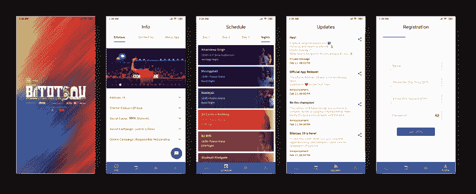

# 如何在 2019 年开发 Android 应用程序:拥抱“新”Android

> 原文：<https://www.freecodecamp.org/news/developing-an-android-app-in-2019-embracing-the-new-android/>

#### *或者 Bitotsav '19 应用如何成为现实*

### *背景:2017 年万神殿⏪*

大约两年前，也就是 2017 年 9 月，一个朋友 Ashank Anshuman 说服我为我们研究所的技术节开发一个应用程序。我们夜以继日地工作了大约两个星期，为节日发布做好准备。虽然我们已经筋疲力尽了，但这是一种很棒的感觉，在生产中得到人们实际使用的东西！它很好地实现了它的目的，帮助组织者轻松地将一切传达给参与者。

> [**【Pantheon’17-Apps on Google Play**](https://play.google.com/store/apps/details?id=in.pantheon17)
> [*致力于为年轻人提供一个展示技术技能的全国性平台；显示…*play.google.com](https://play.google.com/store/apps/details?id=in.pantheon17)

它被评为 4.9 级，有大约 120 条评论，谷歌的机器人出于某种原因删除了这些评论，但这是另一个故事了。我们收到了一些分享应用程序源代码的请求，但我们拒绝了，原因有很多——但主要是因为我们对代码不太满意，尤其是临近结尾的部分。我们只是没有足够的时间和经验来编写足够好的代码供人们学习和/或使用。

### 又来了！？

快进到 2018 年 11 月:Ankit Agrawal(他是那个“节日家伙”)邀请我加入我们一年一度的社会文化节日 Bitotsav 的团队，我同意了，因为我正在寻找一些重新访问 Android 的借口。这次我说服了 Ashank(花了很大的说服力！)来做 app。

我们在 12 月没有做太多，但是我开始阅读诸如架构组件、AndroidX、Jetpack 等等。在过去的几个月里，我也越来越熟悉 Kotlin，有几门课程很有帮助:由独一无二的 Hadi ha riri 开设的两部分课程，以及由 Svetlana Isakova 和 Andrey Breslav(他在 KotlinConf 2018 中介绍的)开设的另一门更近的课程。因此，Kotlin 显然是这款应用的不二之选。

> [**kot Lin 编程简介**](http://shop.oreilly.com/product/0636920052982.do)
> [*Kotlin 1.0 于 2016 年 2 月发布，从那时起，它就受到了全球开发者的欢迎……*shop.oreilly.com](http://shop.oreilly.com/product/0636920052982.do)

> [**Kotlin for Java 开发者| Coursera**](https://www.coursera.org/learn/kotlin-for-java-developers)
> [*Kotlin for Java 开发者来自 JetBrains。科特林编程语言是一种现代语言，它给了你更多…*www.coursera.org](https://www.coursera.org/learn/kotlin-for-java-developers)

### **决策？**

一月的上半月也过去了，没有多少代码被编写，因为我全神贯注，直到 1 月 16 日才能到达学院。然而，我们做了一些重大决定:

*   **使用[科特林](https://developer.android.com/kotlin)专用**
*   **使用[基于特征的封装](https://hackernoon.com/package-by-features-not-layers-2d076df1964d)**
*   **使用[Jetpack](https://developer.android.com/jetpack)架构组件与[AndroidX](https://developer.android.com/jetpack/androidx/releases)**
*   **使用 [API 21 作为最小 API](https://developer.android.com/about/dashboards/)** *(22 可能是更好的选择)*
*   **使用[安卓工作室金丝雀](https://developer.android.com/studio/preview)**
*   使用 [Git Flow](https://www.atlassian.com/git/tutorials/comparing-workflows/gitflow-workflow) & [永远](https://semver.org/)
*   编写足够好的代码以便在节日后公开？

Jetpack with AndroidX

所以基本上是从 2017 年开发一个 app 的所有体验到 2019 年的出血边缘的一次硬重置。这真的很令人兴奋，但也是一个巨大的挑战。

### 码码码！？

我们决定 Ashank 将负责应用程序的后端(数据库和网络，FCM 通知，后台处理)，我负责前端和集成，就像我们对 Pantheon '17 所做的那样。在我们开始工作时，许多资源都派上了用场，但迄今为止最好的是谷歌提供的这些令人敬畏的代码实验室:

*   [带景观的房间——科特林](https://codelabs.developers.google.com/codelabs/android-room-with-a-view-kotlin) (ViewModel，LiveData &带协程的房间)
*   [在您的 Android 应用中使用 Kotlin 协同程序](https://codelabs.developers.google.com/codelabs/kotlin-coroutines)
*   [数据绑定 Codelab](https://codelabs.developers.google.com/codelabs/android-databinding)
*   [导航代码实验室](https://codelabs.developers.google.com/codelabs/android-navigation):(导航架构组件)
*   [工作管理器的后台工作](https://codelabs.developers.google.com/codelabs/android-workmanager/#0)

> [**Google Codelabs**](https://codelabs.developers.google.com/?cat=Android)
> [*Google Codelabs 为开发者提供了一个有指导、有教程、有动手能力的编码体验。大多数代码实验室会带你一步一步地完成…*codelabs.developers.google.com](https://codelabs.developers.google.com/?cat=Android)

此外，谷歌的[向日葵](https://github.com/googlesamples/android-sunflower) & [谷歌 IO 18](https://github.com/google/iosched) 应用程序是理想的参考代码库。[如果我以前知道的话，Android Dev Summit app](https://github.com/google/iosched/tree/adssched) 也会是一个很好的参考来源！

> [**Google samples/android-sunflower**](https://github.com/googlesamples/android-sunflower)
> [*一款园艺应用，展示了使用 Android Jetpack 的 Android 开发最佳实践。-Google samples/Android-向日葵*github.com](https://github.com/googlesamples/android-sunflower)

有了这些，我们开始编码。我决定使用新的 [**导航架构组件**](https://developer.android.com/topic/libraries/architecture/navigation) **来实现一个[单活动 app 架构](https://www.youtube.com/watch?v=2k8x8V77CrU)** 。Ashank 从 Room 和 FCM 开始。我也曾想过用 [**Koin**](https://insert-koin.io/) **做 IoC** ，但不太确定。

顺便说一句，Joe Birch 大约在那个时候在 [caster.io](https://caster.io) 上推出了一个 Koin 课程(由专业人士提供小型的重点课程，每个课程在推出时免费一周！)，并决定随它去。没有遗憾！说真的，android 支持是惊人的，[文档](https://beta.insert-koin.io/docs/2.0/documentation/reference/index.html#_koin_for_android_developers)是神话般的❤️

> [**Koin**](https://caster.io/courses/koin)
> [*在本课程中，我们将通过构建一个全功能的…* caster.io](https://caster.io/courses/koin) 来学习一个称为 Koin 的依赖注入框架

有了 Navigation 和 Koin 设置，我从 UI 开始，决定将**材料设计组件**专门用于 UI，为此 [**指南**](https://material.io/design/components/) **和[文档](https://material.io/develop/android/components/bottom-app-bar/)** 派上了用场。而且，我之所以让***使用[数据绑定](https://developer.android.com/topic/libraries/data-binding)** 是因为我喜欢！同时 Ashank 实施了 **[工作管理器](https://developer.android.com/topic/libraries/architecture/workmanager)、**，我们决定用**代替【Firebase Job Dispatcher】**，全力以赴！*

*我开发的第一个东西是 Schedule UI，它帮助我熟悉架构组件。完成这些后，我转到注册流程 UI，这可能是该应用程序最复杂的部分，它具有 LiveData 的高级用法和导航功能，可以通过实时验证的表单实现三个步骤(值得一提的是，很快会有一篇自己的博客帖子？！).这让我对这些部件更有信心，从那以后就一帆风顺了。我们完成了计划的功能，发现了一些问题，修复了一些错误。*

### *发射？*

*随着主要功能的实现，我们做了一些用户界面的修改，完成了一些最终的待办事项，并准备推出！作为点睛之笔，我添加了我一直计划的东西:*

*每次配置更改都有不同的颜色主题！这样做是为了配合电影节的主题:“亚洲的颜色”*

*该应用于 2019 年 2 月 11 日在 Play Store 上线！？？*

> *[**【Bitotsav’19-Google Play 上的应用**](https://play.google.com/store/apps/details?id=in.bitotsav)
> [*【Bitotsav’19 第 29 届比尔拉理工学院、梅斯拉一年一度的社会文化节已经准备就绪……*play.google.com](https://play.google.com/store/apps/details?id=in.bitotsav)*

*

Bitotsav ’19 App* 

#### *修复和更新*

*我们面对(唯一的！)几个小时内的两个 bug，我们马上就修复了。第一个与被标记为`suspend`的 DAO 方法有关，但是我仍然不能 100%确定为什么会发生这种情况？。第二个错误是由导致序列化失败的混淆引起的，使用 K *eep a* 注释很容易修复。*

*然后我开始着手下一次更新，我在 feed 中添加了排行榜，在日程表中添加了节日的夜间活动，以及其他一些变化。第三次更新增加了一些更小的功能。*

*节日进行得很顺利，超过 1000 名参与者使用了该应用程序！*

*我们确实面临一个小问题，因为我们的朋友 Sushant Gupta 在服务器中输入了一个不正确的数据库条目，他后来就此写了一篇相当引人注目的博文。*

> *[**对 Bitotsav '19 网站的 DDoS 攻击**](https://cs.sonudoo.com/2019/02/ddos-attack-on-bitotsav-19-website.html)
> [*这不是技术写上去的。这是我想分享的一个故事，它可能是几个网络&应用…*cs.sonudoo.com](https://cs.sonudoo.com/2019/02/ddos-attack-on-bitotsav-19-website.html)的一个教训*

*活动结束后，我们发布了最终更新，存储了活动详情、提要等。作为应用程序的一部分，并出于隐私原因编辑了组织者的联系电话。*

#### *上市！*

*是时候开源代码了！这一次，我们小心翼翼地编写了可理解的代码，它已经为世界做好了准备。我准备了一份简洁的自述文件，为了从存储库的历史中删除联系号码，我们使用了令人惊叹的 [BFG 回购清理工具](https://rtyley.github.io/bfg-repo-cleaner)。*

*Bitotsav '19 应用程序的代码现已公开，任何人都可以查看、参考、学习或使用！检查一下，别忘了留下一个？？*

> *[**aksh 1618/Bitotsav-19**](https://github.com/aksh1618/Bitotsav-19)
> [*Bitotsav ' 19 官方 app。在 GitHub 上创建一个帐户，为 aksh1618/Bitotsav-19 开发做出贡献。*github.com](https://github.com/aksh1618/Bitotsav-19)*

### *挑战？*

*在开发过程中，我们确实面临一些挑战:*

*   ***时间限制:**我们面临的主要挑战是在非常有限的时间内学习非常新的概念，并使用它们来创建可供数百人使用的应用程序。这种时间限制导致了大量的连续工作时间，导致了压力和疲劳，但是我们能够全力以赴地完成任务！*
*   *工作管理器和协程:在技术方面，我们在工作管理器和协程方面遇到了一些小挑战，但是我们能够克服它们。希望随着开发的继续，Android SDK 能更好地支持协程？。*
*   *API 21: 我们选择了 min API 21，以避免不得不调整一切来适应旧版本，因为大多数 android 设备都是 API 21 或更高版本。但是令人惊讶的是，[有些东西](https://stackoverflow.com/a/29756195/6346531)拒绝在 API 21 上工作，尤其是视图背景。这真的很令人沮丧，让我希望我们已经将 min API 设置为 22，当我们发现该应用程序只安装在两个 API 21 设备上时更是如此:我们测试的设备？。*
*   ***缺少设备:**我们面临的另一个挑战是没有足够的设备进行测试。在 Pantheon '17 期间，我们有一个大约 200 人的宿舍，因此测试很容易。这一次，大多数人都去实习了，所以我们只能依靠对代码的信心！*
*   *没有代码审查员:我们使用的很多东西对我们来说都是新的，我们尽最大努力确保我们做的一切都是正确的。但是有一个评论者会很有帮助。即使现在，如果你觉得你可以做一个应用程序的代码快速审查，我们将非常感谢！*
*   ***启示录:**我们确实也面临着那个“ *DDoS* 问题，看看上面链接的 Sushant 的博文，你不会后悔的！*

### *Takeaways ✅*

*   ***Kotlin + Jetpack = ❤️ :** 主要的收获是，Android 开发已经走过了漫长的道路，有了 Kotlin 和 Jetpack，肯定会有更多的乐趣和纯粹的快乐！说真的，在编码过程中有多个*高潮*时刻！*
*   *没有什么是不可能的:有点老生常谈，但却是真的:如果你有努力工作的意愿，你可以做任何事情，不管有多困难。当然，会有压力阶段，但要坚持下去。相信自己就好！*

### *后悔？*

*   ***没有即时应用/应用捆绑包**:我们刚刚错过了这个。想都没想。好吧，也许下次吧。*
*   ***没有测试**:我知道，这是一个大的！拥有适当的测试本来可以帮我们很多，但是由于时间限制，我们决定不写测试，直到一个"以后"的时间，现在还没有到来？。*

### *TL；博士？*

*从一个带 2019 的 app 开始？*

#### *使用 Kotlin 和 coroutines*

*   *[学习](http://shop.oreilly.com/product/0636920052982.do)科特林[专用](https://codelabs.developers.google.com/codelabs/taking-advantage-of-kotlin)！*
*   *[学习在 Android 上使用](https://codelabs.developers.google.com/codelabs/kotlin-coroutines)协程。*

#### *在 android 上使用 jetpack 组件*

*   *[学会将](https://codelabs.developers.google.com/codelabs/android-navigation)导航组件用于单活动架构。*
*   *[学会使用 UI 的](https://codelabs.developers.google.com/codelabs/android-room-with-a-view-kotlin)生命周期组件&持久化空间。*
*   *帮自己一个忙，[使用](https://codelabs.developers.google.com/codelabs/android-databinding)数据绑定！*
*   *[学会使用](https://codelabs.developers.google.com/codelabs/android-workmanager/#0) WorkManager 进行后台处理。*

#### *使用材料组件*

*   *[材料成分指南](https://material.io/design/components/)*
*   *[材料组件 Android Docs](https://material.io/develop/android/components/bottom-app-bar/)*

#### *写测试！*

*我们不能，但你绝对应该！不要跳过测试。*

#### *参考源代码*

*..做这些事情的应用有:[向日葵应用](https://github.com/googlesamples/android-sunflower)、 [IO 应用](https://github.com/google/iosched)、[开发峰会应用](https://github.com/google/iosched/tree/adssched)，当然还有 [Bitotsav '19 应用](https://github.com/aksh1618/Bitotsav-19)！(还有，留个星？)*

#### *保持最新状态*

*订阅博客和时事通讯，了解最新动态！以下是一些开始: [Android Weekly，](https://androidweekly.net/) [ProAndroidDev](https://proandroiddev.com) ， [AndroidPub，](https://android.jlelse.eu) [Kotlin Weekly](http://www.kotlinweekly.net/) 。不知所措？看看这个由[呼延屠刀](https://www.freecodecamp.org/news/developing-an-android-app-in-2019-embracing-the-new-android/undefined)的精彩演讲:*

> *[**似水:跟上安卓**](https://academy.realm.io/posts/360-andev-2017-keynote-huyen-tue-keeping-up-with-android)
> [*如果你喜欢 360 AnDev 的演讲，请通过 Patreon 支持大会！在移动领域工作的一个不变因素是…* academy.realm.io](https://academy.realm.io/posts/360-andev-2017-keynote-huyen-tue-keeping-up-with-android)*

*好了，我们走吧。这是 Android 开发的大好时机，所以开始使用你的新应用吧，别忘了在使用的时候享受乐趣！*

*如果你学到了什么，请留下评论。欢迎建设性的批评？*

*在[推特](https://twitter.com/aksh1618)上抓住我？， [LinkedIn](https://www.linkedin.com/in/aakarshit-uppal/?lipi=urn%3Ali%3Apage%3Ad_flagship3_feed%3BdcfpLfCgSPiW0Cox1OEGIQ%3D%3D&licu=urn%3Ali%3Acontrol%3Ad_flagship3_feed-identity_welcome_message) ？还是 [GitHub？](https://github.com/aksh1618)？*

*直到下一次？？*