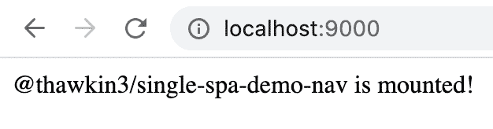
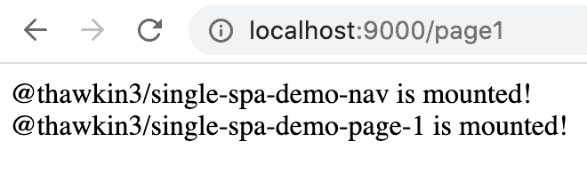
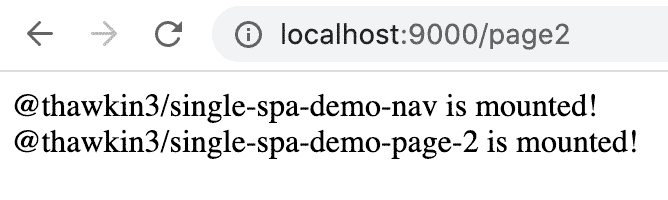
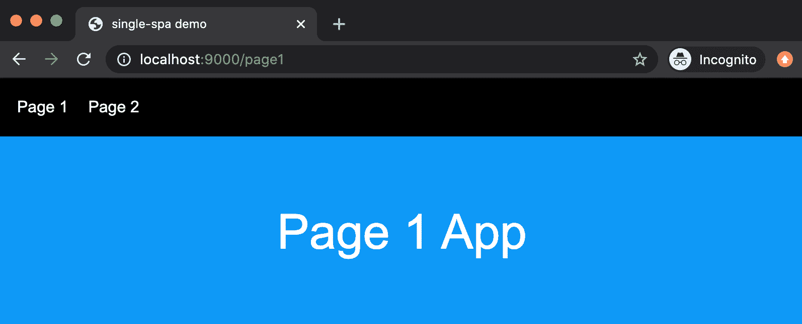
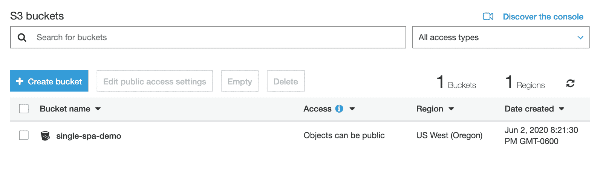
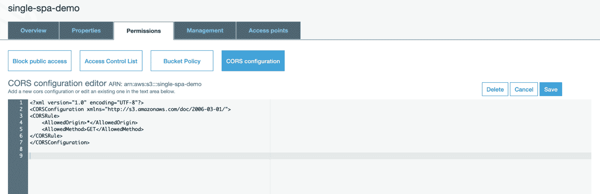
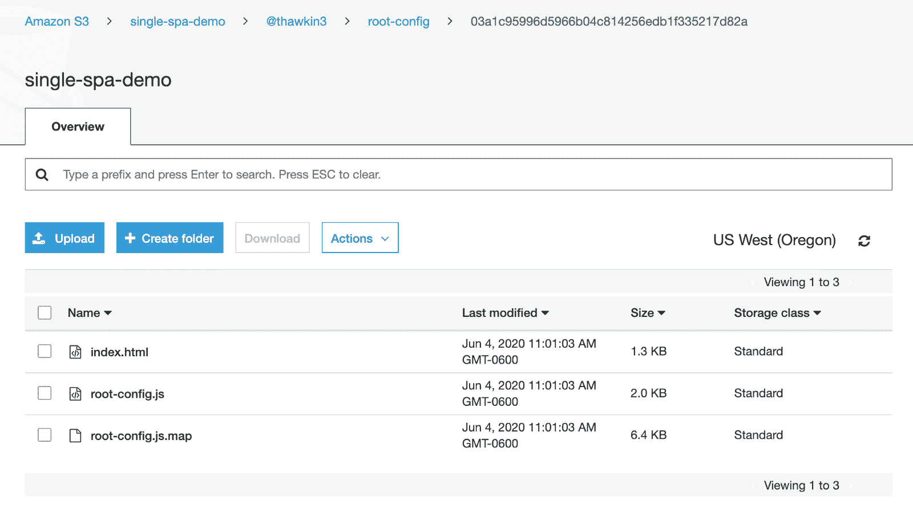
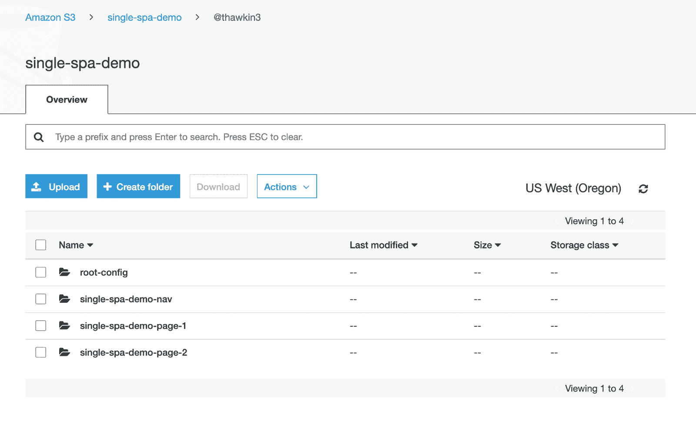
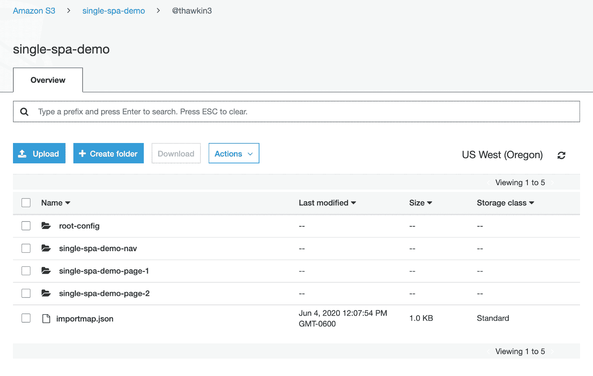
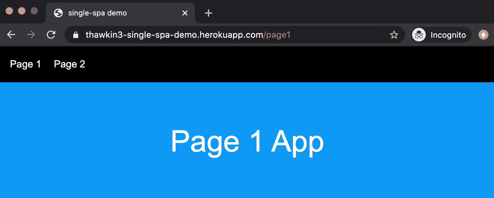

# 如何使用单 SPA 开发和部署微前端

> 原文：<https://www.freecodecamp.org/news/developing-and-deploying-micro-frontends-with-single-spa/>

微前端是前端 web 开发的未来。

受微服务的启发，微服务允许您将后端分成更小的部分，微前端允许您独立地构建、测试和部署前端应用程序的各个部分。

根据您选择的微前端框架，您甚至可以让多个微前端应用程序(用 React、Angular、Vue 或任何其他语言编写)和平共存于同一个更大的应用程序中。

在本文中，我们将使用 [single-spa](https://single-spa.js.org/) 开发一个由微前端组成的 app，并部署到 [Heroku](https://www.heroku.com/) 上。

我们将使用 [Travis CI](https://travis-ci.org/) 设置持续集成。每个 CI 管道将为微前端应用捆绑 JavaScript，然后将生成的构建工件上传到 [AWS S3](https://aws.amazon.com/s3/) 。

最后，我们将对其中一个微前端应用程序进行更新，看看它如何独立于其他微前端应用程序部署到生产环境中。

# 演示应用概述


Demo app — end result

在我们讨论逐步说明之前，让我们快速了解一下演示应用程序的组成。该应用程序由四个子应用程序组成:

1.  一个[容器应用](https://github.com/thawkin3/single-spa-demo-root-config)，作为主页面容器，协调微前端应用的安装和卸载
2.  一个总是出现在页面上的微前端导航条应用程序
3.  一个[微前端“第 1 页”应用](https://github.com/thawkin3/single-spa-demo-page-1)，仅在活动时显示
4.  一个[微前端“第 2 页”应用](https://github.com/thawkin3/single-spa-demo-page-2)，也只在活动时显示

这四个应用程序都存在于独立的 repos 中，可以在 GitHub 上找到，我在上面已经链接过了。

就用户界面而言，最终结果相当简单，但是，要明确的是，用户界面不是这里的重点。

如果您在自己的机器上学习，到本文结束时，您也将拥有开始使用自己的微前端应用程序所需的所有底层基础设施。

好吧，带上你的潜水装备，因为是时候潜水了！

# 创建容器应用程序

为了生成该演示的应用程序，我们将使用一个名为 [create-single-spa](https://single-spa.js.org/docs/create-single-spa/) 的命令行界面(CLI)工具。撰写本文时，create-single-spa 的版本是 1.10.0，通过 CLI 安装的 single-spa 的版本是 4.4.2。

我们将按照以下步骤创建容器应用程序(有时也称为根配置):

```
mkdir single-spa-demo

cd single-spa-demo

mkdir single-spa-demo-root-config

cd single-spa-demo-root-config

npx create-single-spa
```

然后，我们将按照 CLI 提示进行操作:

1.  选择“单个 spa 根配置”
2.  选择“纱线”或“npm”(我选择了“纱线”)
3.  输入一个组织名称(我使用“thawkin3”，但是可以是您想要的任何名称)

太好了！现在，如果您查看`single-spa-demo-root-config`目录，您应该会看到一个根配置应用程序的框架。我们将对此进行定制，但首先让我们也使用 CLI 工具来创建我们的其他三个微前端应用程序。

# 创建微前端应用程序

为了生成我们的第一个微前端应用程序 navbar，我们将遵循以下步骤:

```
cd ..

mkdir single-spa-demo-nav

cd single-spa-demo-nav

npx create-single-spa
```

然后，我们将按照 CLI 提示进行操作:

1.  选择“单 spa 应用/包裹”
2.  选择“反应”
3.  选择“纱线”或“npm”(我选择了“纱线”)
4.  输入一个组织名称，与创建根配置应用程序时使用的名称相同(在我的例子中为“thawkin3”)
5.  输入一个项目名称(我使用了“single-spa-demo-nav”)

现在我们已经创建了 navbar 应用程序，我们可以按照同样的步骤来创建我们的双页面应用程序。但是，我们将在第一遍中用“single-spa-demo-page-1”替换每个我们看到“single-spa-demo-nav”的地方，然后在第二遍中用“single-spa-demo-page-2”替换。

此时，我们已经生成了我们需要的所有四个应用程序:一个容器应用程序和三个微前端应用程序。现在是时候将我们的应用程序连接在一起了。

# 向容器应用注册微前端应用

如前所述，容器应用程序的主要职责之一是协调每个应用程序何时“活跃”或不活跃。换句话说，它处理每个应用程序应该何时显示或隐藏。

为了帮助容器应用程序理解每个应用程序应该何时显示，我们为它提供了所谓的“活动功能”每个应用程序都有一个 activity 函数，该函数简单地返回一个布尔值，true 或 false，表示该应用程序当前是否处于活动状态。

在`single-spa-demo-root-config`目录中，在`activity-functions.js`文件中，我们将为我们的三个微前端应用程序编写以下活动函数。

```
export function prefix(location, ...prefixes) {
  return prefixes.some(
    prefix => location.href.indexOf(`${location.origin}/${prefix}`) !== -1
  );
}

export function nav() {
  // The nav is always active
  return true;
}

export function page1(location) {
  return prefix(location, 'page1');
}

export function page2(location) {
  return prefix(location, 'page2');
}
```

接下来，我们需要向 single-spa 注册我们的三个微前端应用程序。为此，我们使用了`registerApplication`函数。该函数至少接受三个参数:应用程序名称、加载应用程序的方法和确定应用程序何时活动的活动函数。

在`single-spa-demo-root-config`目录中，在`root-config.js`文件中，我们将添加以下代码来注册我们的应用程序:

```
import { registerApplication, start } from "single-spa";
import * as isActive from "./activity-functions";

registerApplication(
  "@thawkin3/single-spa-demo-nav",
  () => System.import("@thawkin3/single-spa-demo-nav"),
  isActive.nav
);

registerApplication(
  "@thawkin3/single-spa-demo-page-1",
  () => System.import("@thawkin3/single-spa-demo-page-1"),
  isActive.page1
);

registerApplication(
  "@thawkin3/single-spa-demo-page-2",
  () => System.import("@thawkin3/single-spa-demo-page-2"),
  isActive.page2
);

start();
```

既然我们已经设置了 activity 函数并注册了我们的应用程序，那么在本地运行之前的最后一步是更新同一目录中的`index.ejs`文件中的本地导入映射。

我们将在`head`标签中添加以下代码，以指定每个应用程序在本地运行时的位置:

```
<% if (isLocal) { %>
  <script type="systemjs-importmap">
    {
      "imports": {
        "@thawkin3/root-config": "http://localhost:9000/root-config.js",
        "@thawkin3/single-spa-demo-nav": "http://localhost:9001/thawkin3-single-spa-demo-nav.js",
        "@thawkin3/single-spa-demo-page-1": "http://localhost:9002/thawkin3-single-spa-demo-page-1.js",
        "@thawkin3/single-spa-demo-page-2": "http://localhost:9003/thawkin3-single-spa-demo-page-2.js"
      }
    }
  </script>
<% } %> 
```

每个应用程序都包含自己的启动脚本，这意味着在本地开发期间，每个应用程序都将在自己的开发服务器上本地运行。如你所见，我们的 navbar 应用在端口 9001，我们的 page 1 应用在端口 9002，我们的 page 2 应用在端口 9003。

完成这三个步骤后，让我们来测试一下我们的应用程序。

# 本地运行的测试运行

要让我们的应用在本地运行，我们可以遵循以下步骤:

1.  打开四个终端标签，每个应用一个
2.  对于根配置，在`single-spa-demo-root-config`目录中:`yarn start`(默认运行在端口 9000 上)
3.  对于导航应用程序，在`single-spa-demo-nav`目录中:`yarn start --port 9001`
4.  对于第 1 页应用程序，在`single-spa-demo-page-1`目录中:`yarn start --port 9002`
5.  对于第 2 页应用程序，在`single-spa-demo-page-2`目录中:`yarn start --port 9003`

现在，我们将在浏览器中导航到 [http://localhost:9000](http://localhost:9000/) 来查看我们的应用程序。

我们应该看到…一些文字！超级刺激。



Demo app — main page

在我们的主页上，navbar 是显示的，因为 navbar 应用程序始终是活动的。

现在，让我们导航到 [http://localhost:9000/page1。](http://localhost:9000/page1.)如上面的活动函数所示，我们已经指定当 URL 路径以“page1”开头时，page 1 应用程序应该是活动的(如图所示)这激活了 page 1 应用程序，现在我们应该可以看到导航栏和 page 1 应用程序的文本。



Demo app — page 1 route

再一次，现在让我们导航到 [http://localhost:9000/page2。](http://localhost:9000/page2.)正如所料，这激活了第二页应用程序，所以我们现在应该看到导航栏和第二页应用程序的文本。



Demo app — page 2 route

# 对应用程序进行小的调整

到目前为止，我们的应用程序看起来不是很令人兴奋，但我们确实有一个工作的微前端设置在本地运行。如果你现在不在座位上欢呼，你应该在！

让我们对我们的应用程序做一些小的改进，让它们看起来和行为起来更好一些。

### 指定装载容器

首先，如果你在查看应用程序时一遍又一遍地刷新页面，你可能会注意到有时应用程序加载顺序混乱，页面应用程序出现在 navbar 应用程序的上方。

这是因为我们实际上还没有指定每个应用程序的*应该安装在哪里。这些应用程序只是由[系统](https://github.com/systemjs/systemjs)加载，然后哪个最快完成加载的应用程序首先被附加到页面上。*

*我们可以通过在注册时为每个应用程序指定一个挂载容器来解决这个问题。*

*在我们之前工作的`index.ejs`文件中，让我们添加一些 HTML 作为页面的主要内容容器:*

```
*`<div id="nav-container"></div>
<main>
  <div id="page-1-container"></div>
  <div id="page-2-container"></div>
</main>`*
```

*然后，在我们注册应用程序的`root-config.js`文件中，让我们为每个包含 DOM 元素的函数调用提供第四个参数，我们希望在这里挂载每个应用程序:*

```
*`import { registerApplication, start } from "single-spa";
import * as isActive from "./activity-functions";

registerApplication(
  "@thawkin3/single-spa-demo-nav",
  () => System.import("@thawkin3/single-spa-demo-nav"),
  isActive.nav,
  { domElement: document.getElementById('nav-container') }
);

registerApplication(
  "@thawkin3/single-spa-demo-page-1",
  () => System.import("@thawkin3/single-spa-demo-page-1"),
  isActive.page1,
  { domElement: document.getElementById('page-1-container') }
);

registerApplication(
  "@thawkin3/single-spa-demo-page-2",
  () => System.import("@thawkin3/single-spa-demo-page-2"),
  isActive.page2,
  { domElement: document.getElementById('page-2-container') }
);

start();`*
```

*现在，应用程序将总是被安装到一个特定的和可预测的位置。不错！*

### *设计应用程序*

*接下来，让我们给我们的应用增加一点风格。白底黑字看起来并不有趣。*

*在`single-spa-demo-root-config`目录中，再次在`index.ejs`文件中，我们可以通过在`head`标签底部粘贴以下 CSS 来为整个 app 添加一些基本样式:*

```
*`<style>
  body, html { margin: 0; padding: 0; font-size: 16px; font-family: Arial, Helvetica, sans-serif; height: 100%; }
  body { display: flex; flex-direction: column; }
  * { box-sizing: border-box; }
</style>`*
```

*接下来，我们可以通过找到`single-spa-demo-nav`目录，创建一个`root.component.css`文件，并添加以下 CSS 来设计我们的 navbar 应用程序:*

```
*`.nav {
  display: flex;
  flex-direction: row;
  padding: 20px;
  background: #000;
  color: #fff;
}

.link {
  margin-right: 20px;
  color: #fff;
  text-decoration: none;
}

.link:hover,
.link:focus {
  color: #1098f7;
}`*
```

*然后我们可以更新同一个目录中的`root.component.js`文件来导入 CSS 文件，并将这些类和样式应用到我们的 HTML 中。我们还将更改 navbar 内容，使其实际包含两个链接，这样我们就可以通过单击链接来浏览应用程序，而不是在浏览器的地址栏中输入新的 URL。*

```
*`import React from "react";
import "./root.component.css";

export default function Root() {
  return (
    <nav className="nav">
      <a href="/page1" className="link">
        Page 1
      </a>
      <a href="/page2" className="link">
        Page 2
      </a>
    </nav>
  );
}`*
```

*我们将为第 1 页和第 2 页应用程序遵循类似的过程。我们将在各自的项目目录中为每个应用程序创建一个`root.component.css`文件，并更新两个应用程序的`root.component.js`文件。*

*对于 page 1 应用程序，更改如下:*

```
*`.container1 {
  background: #1098f7;
  color: white;
  padding: 20px;
  display: flex;
  align-items: center;
  justify-content: center;
  flex: 1;
  font-size: 3rem;
}`*
```

```
*`import React from "react";
import "./root.component.css";

export default function Root() {
  return (
    <div className="container1">
      <p>Page 1 App</p>
    </div>
  );
}`*
```

*对于第 2 页应用程序，变化如下:*

```
*`.container2 {
  background: #9e4770;
  color: white;
  padding: 20px;
  display: flex;
  align-items: center;
  justify-content: center;
  flex: 1;
  font-size: 3rem;
}`*
```

```
*`import React from "react";
import "./root.component.css";

export default function Root() {
  return (
    <div className="container2">
      <p>Page 2 App</p>
    </div>
  );
}`*
```

### *添加 React 路由器*

*我们要做的最后一个小改动是将 [React 路由器](https://reacttraining.com/react-router/)添加到我们的应用程序中。现在我们放在 navbar 中的两个链接只是普通的锚标签，所以从一个页面导航到另一个页面会导致页面刷新。如果使用 React Router 在客户端处理导航，我们的应用程序会感觉更流畅。*

*要使用 React 路由器，我们首先需要安装它。从终端的`single-spa-demo-nav`目录中，我们将通过输入`yarn add react-router-dom`使用 yarn 安装 React 路由器。(或者如果你正在使用 npm，你可以输入`npm install react-router-dom`。)*

*然后，在`root.component.js`文件的`single-spa-demo-nav`目录中，我们将使用 React 路由器的`Link`组件替换我们的锚标记，如下所示:*

```
*`import React from "react";
import { BrowserRouter, Link } from "react-router-dom";
import "./root.component.css";

export default function Root() {
  return (
    <BrowserRouter>
      <nav className="nav">
        <Link to="/page1" className="link">
          Page 1
        </Link>
        <Link to="/page2" className="link">
          Page 2
        </Link>
      </nav>
    </BrowserRouter>
  );
}`*
```

*酷毙了。这看起来和工作更好！*

*

Demo app — styled and using React Router* 

# *为生产做准备*

*在这一点上，我们有一切我们需要继续工作的应用程序，同时运行它在本地。但是，我们如何让它托管在公共可用的地方呢？*

*使用我们选择的工具，我们可以采取几种可能的方法，但主要任务是:*

1.  *有一个地方我们可以上传我们的构建工件，比如 CDN，还有*
2.  *为了在每次我们将新代码合并到主分支中时自动上传工件。*

*对于本文，我们将使用 AWS S3 来存储我们的资产，并将使用 Travis CI 来运行构建作业和上传作业，作为持续集成管道的一部分。*

*让我们先把 S3 桶装好。*

### *设置 AWS S3 时段*

*不言而喻，但是如果您继续这里的工作，您将需要一个 AWS 帐户。*

*如果我们是 AWS 帐户的 root 用户，我们可以创建一个新的 IAM 用户，该用户只有编程访问权。这意味着当我们创建新用户时，我们将从 AWS 获得一个访问密钥 ID 和一个秘密访问密钥。我们想把这些东西存放在一个安全的地方，因为我们以后会用到它们。*

*最后，应该授予这个用户只使用 S3 的权限，这样，如果我们的密钥落入坏人之手，访问级别就会受到限制。*

*AWS 有一些关于访问键和[管理 IAM 用户访问键](https://docs.aws.amazon.com/IAM/latest/UserGuide/id_credentials_access-keys.html)的[最佳实践的很好的资源，如果你不熟悉如何做到这一点，这些资源非常值得一试。](https://docs.aws.amazon.com/general/latest/gr/aws-access-keys-best-practices.html)*

*接下来，我们需要创建一个 S3 桶。S3 代表简单存储服务，本质上是一个上传和存储亚马逊服务器上的文件的地方。一个桶就是一个目录。*

*我把我的桶命名为“单人水疗示范”，但是你可以随意命名你的桶。您可以按照 AWS 指南[了解如何创建新的存储桶](https://docs.aws.amazon.com/AmazonS3/latest/dev/UsingBucket.html)以获取更多信息。*

*

AWS S3 bucket* 

*一旦我们创建了我们的 bucket，确保 bucket 是公共的并且为我们的 bucket 启用了 [CORS(跨源资源共享)也很重要，这样我们就可以在我们的应用程序中访问和使用我们上传的资产。](https://docs.aws.amazon.com/AmazonS3/latest/dev/cors.html#how-do-i-enable-cors)*

*在我们的存储桶的权限中，我们可以添加以下 CORS 配置规则:*

```
*`<CORSConfiguration>
 <CORSRule>
   <AllowedOrigin>*</AllowedOrigin>
   <AllowedMethod>GET</AllowedMethod>
 </CORSRule>
</CORSConfiguration>`*
```

*在 AWS 控制台中，当我们点击 Save 后，它看起来像这样:*

*

CORS configuration* 

### *创建 Travis CI 作业以将工件上传到 AWS S3*

*既然我们有了上传文件的地方，让我们设置一个自动化的过程，每当我们将新代码合并到任何 repos 的主分支时，该过程将负责上传新的 JavaScript 包。*

*为此，我们将使用 [Travis CI](https://travis-ci.org/) 。如前所述，每个应用程序在 GitHub 上都有自己的 repo，所以我们有四个 GitHub repos 可以使用。我们可以[将 Travis CI 与我们的每个回购](https://docs.travis-ci.com/user/tutorial/#to-get-started-with-travis-ci-using-github)集成，并为每个回购建立持续的集成渠道。*

*为了为任何给定的项目配置 Travis CI，我们在项目的根目录中创建一个`.travis.yml`文件。让我们在`single-spa-demo-root-config`目录中创建该文件，并插入以下代码:*

```
*`language: node_js
node_js:
  - node
script:
  - yarn build
  - echo "Commit sha - $TRAVIS_COMMIT"
  - mkdir -p dist/@thawkin3/root-config/$TRAVIS_COMMIT
  - mv dist/*.* dist/@thawkin3/root-config/$TRAVIS_COMMIT/
deploy:
  provider: s3
  access_key_id: "$AWS_ACCESS_KEY_ID"
  secret_access_key: "$AWS_SECRET_ACCESS_KEY"
  bucket: "single-spa-demo"
  region: "us-west-2"
  cache-control: "max-age=31536000"
  acl: "public_read"
  local_dir: dist
  skip_cleanup: true
  on:
    branch: master`*
```

*这个实现是我在查看了 AWS S3 上传的 [Travis CI 文档](https://docs.travis-ci.com/user/deployment-v2/providers/s3/)和一个[单 spa Travis CI 示例配置](https://github.com/single-spa/import-map-deployer/blob/master/examples/ci-for-javascript-repo/travis-digital-ocean-spaces/.travis.yml)后想到的。*

*因为我们不希望我们的 AWS 秘密暴露在我们的 GitHub repo 中，所以我们可以将它们存储为环境变量。您可以将环境变量和它们的秘密值放在 Travis CI web 控制台中，这样就可以保证这些值是私有的，所以那就是`.travis.yml`文件获取这些值的地方。*

*现在，当我们向主分支提交和推送新代码时，Travis CI 作业将运行，它将为应用程序构建 JavaScript 包，然后将这些资产上传到 S3。为了验证这一点，我们可以查看 AWS 控制台，查看我们新上传的文件:*

*

Uploaded files as a result of a Travis CI job* 

*整洁！到目前为止一切顺利。现在，我们需要为其他三个微前端应用程序实现相同的 Travis CI 配置，但是根据需要交换掉`.travis.yml`文件中的目录名。在遵循相同的步骤并合并我们的代码之后，我们现在在我们的 S3 桶中创建了四个目录，每个回购对应一个目录。*

*

Four directories within our S3 bucket* 

# *为生产创建导入映射*

*让我们回顾一下到目前为止我们所做的事情。我们有四个应用程序，都位于独立的 GitHub repos 中。当代码被合并到主分支中时，每个 repo 被 Travis CI 设置为运行一个作业，该作业处理将构建工件上传到 S3 存储桶中。*

*所有这些都在一个地方，仍然缺少一件事:如何在我们的容器应用程序中引用这些新的构建工件？换句话说，即使我们在每次更新时都为我们的微前端推出新的 JavaScript 包，新代码实际上还没有在我们的容器应用程序中使用！*

*如果我们回想一下如何让我们的应用程序在本地运行，我们使用了一个导入映射。这个导入映射只是 JSON，它告诉容器应用程序在哪里可以找到每个 JavaScript 包。*

*但是，我们之前的导入映射专门用于在本地运行应用程序。现在我们需要创建一个将在生产环境中使用的导入映射。*

*如果我们查看`single-spa-demo-root-config`目录，在`index.ejs`文件中，我们会看到这一行:*

```
*`<script type="systemjs-importmap" src="https://storage.googleapis.com/react.microfrontends.app/importmap.json"></script>`* 
```

*在浏览器中打开该 URL 会显示一个如下所示的导入映射:*

```
*`{
  "imports": {
    "react": "https://cdn.jsdelivr.net/npm/react@16.13.1/umd/react.production.min.js",
    "react-dom": "https://cdn.jsdelivr.net/npm/react-dom@16.13.1/umd/react-dom.production.min.js",
    "single-spa": "https://cdn.jsdelivr.net/npm/single-spa@5.5.3/lib/system/single-spa.min.js",
    "@react-mf/root-config": "https://react.microfrontends.app/root-config/e129469347bb89b7ff74bcbebb53cc0bb4f5e27f/react-mf-root-config.js",
    "@react-mf/navbar": "https://react.microfrontends.app/navbar/631442f229de2401a1e7c7835dc7a56f7db606ea/react-mf-navbar.js",
    "@react-mf/styleguide": "https://react.microfrontends.app/styleguide/f965d7d74e99f032c27ba464e55051ae519b05dd/react-mf-styleguide.js",
    "@react-mf/people": "https://react.microfrontends.app/people/dd205282fbd60b09bb3a937180291f56e300d9db/react-mf-people.js",
    "@react-mf/api": "https://react.microfrontends.app/api/2966a1ca7799753466b7f4834ed6b4f2283123c5/react-mf-api.js",
    "@react-mf/planets": "https://react.microfrontends.app/planets/5f7fc62b71baeb7a0724d4d214565faedffd8f61/react-mf-planets.js",
    "@react-mf/things": "https://react.microfrontends.app/things/7f209a1ed9ac9690835c57a3a8eb59c17114bb1d/react-mf-things.js",
    "rxjs": "https://cdn.jsdelivr.net/npm/@esm-bundle/rxjs@6.5.5/system/rxjs.min.js",
    "rxjs/operators": "https://cdn.jsdelivr.net/npm/@esm-bundle/rxjs@6.5.5/system/rxjs-operators.min.js"
  }
}`*
```

*当我们使用 CLI 生成容器应用程序时，该导入映射是作为示例提供的默认映射。我们现在需要做的是用一个实际引用我们正在使用的包的导入映射替换这个示例导入映射。*

*因此，使用原始的导入映射作为模板，我们可以创建一个名为`importmap.json`的新文件，将它 **放在我们的 repos** 之外，并添加如下所示的 JSON:*

```
*`{
  "imports": {
    "react": "https://cdn.jsdelivr.net/npm/react@16.13.0/umd/react.production.min.js",
    "react-dom": "https://cdn.jsdelivr.net/npm/react-dom@16.13.0/umd/react-dom.production.min.js",
    "single-spa": "https://cdn.jsdelivr.net/npm/single-spa@5.5.1/lib/system/single-spa.min.js",
    "@thawkin3/root-config": "https://single-spa-demo.s3-us-west-2.amazonaws.com/%40thawkin3/root-config/179ba4f2ce4d517bf461bee986d1026c34967141/root-config.js",
    "@thawkin3/single-spa-demo-nav": "https://single-spa-demo.s3-us-west-2.amazonaws.com/%40thawkin3/single-spa-demo-nav/f0e9d35392ea0da8385f6cd490d6c06577809f16/thawkin3-single-spa-demo-nav.js",
    "@thawkin3/single-spa-demo-page-1": "https://single-spa-demo.s3-us-west-2.amazonaws.com/%40thawkin3/single-spa-demo-page-1/4fd417ee3faf575fcc29d17d874e52c15e6f0780/thawkin3-single-spa-demo-page-1.js",
    "@thawkin3/single-spa-demo-page-2": "https://single-spa-demo.s3-us-west-2.amazonaws.com/%40thawkin3/single-spa-demo-page-2/8c58a825c1552aab823bcbd5bdd13faf2bd4f9dc/thawkin3-single-spa-demo-page-2.js"
  }
}`*
```

*您会注意到前三个导入是针对共享依赖的:react、react-dom 和 single-spa。这样，我们的应用程序中就不会有四个 React 副本导致臃肿和更长的下载时间。接下来，我们有四个应用程序的导入。URL 就是 S3 中每个上传文件的 URL(在 AWS 术语中称为“对象”)。*

*现在我们已经创建了这个文件，我们可以通过 AWS 控制台将它手动上传到我们在 S3 的 bucket 中。*

***注意**:当使用 single-spa 时，这是一个非常重要和有趣的警告:导入映射实际上并不存在于源代码控制或任何 git repos 中。这样，导入映射可以动态更新，而不需要在 repo 中进行签入更改。我们一会儿会回到这个概念。*

*

Import map manually uploaded to the S3 bucket* 

*最后，我们现在可以在我们的`index.ejs`文件中引用这个新文件，而不是引用原始的导入映射。*

```
*`<script type="systemjs-importmap" src="//single-spa-demo.s3-us-west-2.amazonaws.com/%40thawkin3/importmap.json"></script>`* 
```

# *创建生产服务器*

*我们越来越接近于在生产中启动和运行某些东西了！我们将在 Heroku 上运行这个演示，因此为了做到这一点，我们需要创建一个简单的 Node.js 和 [Express](https://expressjs.com/) 服务器来服务我们的文件。*

*首先，在`single-spa-demo-root-config`目录中，我们将通过运行`yarn add express`(或`npm install express`)来安装 express。接下来，我们将添加一个名为`server.js`的文件，该文件包含少量用于启动 express 服务器并为我们的主`index.html`文件提供服务的代码。*

```
*`const express = require("express");
const path = require("path");
const PORT = process.env.PORT || 5000;

express()
  .use(express.static(path.join(__dirname, "dist")))
  .get("*", (req, res) => {
    res.sendFile("index.html", { root: "dist" });
  })
  .listen(PORT, () => console.log(`Listening on ${PORT}`));`*
```

*最后，我们将更新我们的`package.json`文件中的 NPM 脚本，以区分在开发模式下运行服务器和在生产模式下运行服务器。*

```
*`"scripts": {
  "build": "webpack --mode=production",
  "lint": "eslint src",
  "prettier": "prettier --write './**'",
  "start:dev": "webpack-dev-server --mode=development --port 9000 --env.isLocal=true",
  "start": "node server.js",
  "test": "jest"
}`*
```

# *部署到 Heroku*

*现在我们已经准备好了一个生产服务器，让我们把它部署到 Heroku 吧！为此，你需要创建一个的 [Heroku 账户，安装](https://signup.heroku.com/) [Heroku CLI](https://devcenter.heroku.com/articles/heroku-cli) 并登录。部署到 Heroku 就像 1–2–3 一样简单:*

1.  *在`single-spa-demo-root-config`目录中:`heroku create thawkin3-single-spa-demo`(将最后一个参数更改为唯一的名称，用于您的 Heroku 应用程序)*
2.  *`git push heroku master`*
3.  *`heroku open`*

*这样，我们就可以开始生产了。运行`heroku open`命令后，您应该看到您的应用程序在浏览器中打开。尝试使用导航链接在页面之间导航，以查看不同的微前端应用程序的安装和卸载。*

*

Demo app — up and running in production* 

# *进行更新*

*此时，你可能会问自己，“所有这些都是为了这个吗？为什么？”你是对的。算是吧。这是大量的工作，我们没有太多的东西可以展示，至少视觉上没有。但是，我们已经为我们想要的任何应用改进打下了基础。*

*任何微服务或微前端的设置成本通常比单块的设置成本高得多；直到后来，你才开始收获回报。*

*所以让我们开始考虑未来的修改。假设现在是五年或者十年后，你的 app 成长了。很多。与此同时，一个热门的新框架已经发布，你渴望使用这个新框架重写你的整个应用程序。*

*当处理一个整体时，这可能需要数年的努力，而且几乎不可能完成。但是，有了微前端，你可以一次换出应用程序的一部分技术，让你缓慢而平稳地过渡到新的技术堆栈。神奇！*

*或者，您可能有一个经常更改的应用程序部分和另一个很少更改的应用程序部分。在对 volatile 应用程序进行更新时，如果可以不去管遗留代码，那不是很好吗？*

*对于 monolith，你在应用程序的某个地方所做的改变可能会影响到应用程序的其他部分。如果您修改了一些单块的多个部分正在使用的样式表会怎么样呢？或者，如果您更新了一个在许多不同地方使用的依赖项，会怎么样呢？*

*使用微前端方法，您可以将这些担忧抛在脑后，在需要的地方重构和更新一个应用程序，而不去管遗留应用程序。*

*但是，如何进行这种更新呢？或者任何更新，真的吗？*

*现在，我们的`index.ejs`文件中有我们的生产导入映射，但是它只是指向我们手动上传到我们的 S3 存储桶的文件。如果我们现在想发布一些新的变化，我们需要为一个微前端推送新的代码，获得一个新的构建工件，然后手动更新导入映射，引用新的 JavaScript 包。*

*有没有一种方法可以让这个自动化？是啊！*

# *更新其中一个应用程序*

*假设我们想更新我们的第一页应用程序，以显示不同的文本。为了自动化这一变更的部署，我们可以更新 CI 管道，不仅构建一个工件并将其上传到我们的 S3 bucket，还可以更新导入映射以引用最新 JavaScript 包的新 URL。*

*让我们从更新我们的`.travis.yml`文件开始，如下所示:*

```
*`language: node_js
node_js:
  - node
env:
  global:
    # include $HOME/.local/bin for `aws`
    - PATH=$HOME/.local/bin:$PATH
before_install:
  - pyenv global 3.7.1
  - pip install -U pip
  - pip install awscli
script:
  - yarn build
  - echo "Commit sha - $TRAVIS_COMMIT"
  - mkdir -p dist/@thawkin3/root-config/$TRAVIS_COMMIT
  - mv dist/*.* dist/@thawkin3/root-config/$TRAVIS_COMMIT/
deploy:
  provider: s3
  access_key_id: "$AWS_ACCESS_KEY_ID"
  secret_access_key: "$AWS_SECRET_ACCESS_KEY"
  bucket: "single-spa-demo"
  region: "us-west-2"
  cache-control: "max-age=31536000"
  acl: "public_read"
  local_dir: dist
  skip_cleanup: true
  on:
    branch: master
after_deploy:
  - chmod +x after_deploy.sh
  - "./after_deploy.sh"`*
```

*这里的主要变化是添加了一个全局环境变量，安装了 AWS CLI，并添加了一个`after_deploy`脚本作为管道的一部分。这引用了我们需要创建的一个`after_deploy.sh`文件。内容将是:*

```
*`echo "Downloading import map from S3"
aws s3 cp s3://single-spa-demo/@thawkin3/importmap.json importmap.json
echo "Updating import map to point to new version of @thawkin3/root-config"
node update-importmap.mjs
echo "Uploading new import map to S3"
aws s3 cp importmap.json s3://single-spa-demo/@thawkin3/importmap.json --cache-control 'public, must-revalidate, max-age=0' --acl 'public-read'
echo "Deployment successful"`*
```

*该文件从 S3 下载现有的导入映射，修改它以引用新的构建工件，然后将更新的导入映射重新上传到 S3。为了处理导入映射文件内容的实际更新，我们使用了一个自定义脚本，我们将把它添加到一个名为`update-importmap.mjs.`的文件中*

```
*`// Note that this file requires node@13.2.0 or higher (or the --experimental-modules flag)
import fs from "fs";
import path from "path";
import https from "https";

const importMapFilePath = path.resolve(process.cwd(), "importmap.json");
const importMap = JSON.parse(fs.readFileSync(importMapFilePath));
const url = `https://single-spa-demo.s3-us-west-2.amazonaws.com/%40thawkin3/root-config/${process.env.TRAVIS_COMMIT}/root-config.js`;

https
  .get(url, res => {
    // HTTP redirects (301, 302, etc) not currently supported, but could be added
    if (res.statusCode >= 200 && res.statusCode < 300) {
      if (
        res.headers["content-type"] &&
        res.headers["content-type"].toLowerCase().trim() ===
          "application/javascript"
      ) {
        const moduleName = `@thawkin3/root-config`;
        importMap.imports[moduleName] = url;
        fs.writeFileSync(importMapFilePath, JSON.stringify(importMap, null, 2));
        console.log(
          `Updated import map for module ${moduleName}. New url is ${url}.`
        );
      } else {
        urlNotDownloadable(
          url,
          Error(`Content-Type response header must be application/javascript`)
        );
      }
    } else {
      urlNotDownloadable(
        url,
        Error(`HTTP response status was ${res.statusCode}`)
      );
    }
  })
  .on("error", err => {
    urlNotDownloadable(url, err);
  });

function urlNotDownloadable(url, err) {
  throw Error(
    `Refusing to update import map - could not download javascript file at url ${url}. Error was '${err.message}'`
  );
}`*
```

*请注意，我们需要在所有的 GitHub repos 中对这三个文件进行这些更改，以便每个文件都能够在创建新的构建工件后更新导入映射。*

*每个回购的文件内容几乎相同，但我们需要将应用程序名称或 URL 路径更改为每个的适当值。*

### *关于导入映射的补充说明*

*前面我提到过，我们手动上传到 S3 的导入地图文件实际上并不存在于我们的任何 GitHub repos 或任何签入的代码中。如果你像我一样，这可能看起来真的很奇怪！一切不都应该在源代码控制中吗？*

*它不在源代码控制中的原因是，我们的 CI 管道可以处理每个新的微前端应用程序版本的导入映射更新。*

*如果导入映射在源代码控制中，对一个微前端应用程序进行更新将需要在两个 repo 中进行更改:进行更改的微前端应用程序 repo，以及导入映射将被检入的根配置 repo。这种设置会使微前端架构的主要优势之一失效，即每个应用程序都可以完全独立于其他应用程序进行部署。*

*为了在导入映射上实现某种级别的源代码控制，我们总是可以为我们的 bucket 使用 S3 的版本控制特性。*

# *斗牛中的最后一剑*

*对我们的 CI 渠道进行了这些修改后，现在是最后的关键时刻:我们能否更新我们的一个微前端应用程序，独立部署它，然后在生产中看到这些更改生效，而无需接触我们的任何其他应用程序？*

*在`single-spa-demo-page-1`目录中，在`root.component.js`文件中，让我们将文本从“第 1 页应用程序”更改为“第 1 页应用程序-已更新！”接下来，让我们提交更改，并将其推送到 master。*

*这将启动 Travis CI 管道来构建新的 page 1 应用程序构件，然后更新导入映射来引用新的文件 URL。*

*如果我们在浏览器中导航到[https://thawkin3-single-spa-demo.herokuapp.com/page1](https://thawkin3-single-spa-demo.herokuapp.com/page1)，我们现在会看到……请击鼓……我们更新的应用程序！*

*

Demo app — successfully updating one of the micro-frontend apps* 

# *结论*

*之前说过，现在再说一遍: ****微前端是前端 web 开发的未来。*****

*好处是巨大的，包括独立的部署、独立的所有权领域、更快的构建和测试时间，以及在需要时混合和匹配各种框架的能力。*

*有一些缺点，例如初始设置成本和维护分布式体系结构的复杂性，但是我坚信好处大于成本。*

*单 spa 使微前端架构变得简单。现在你也可以去打破那块巨石了！*