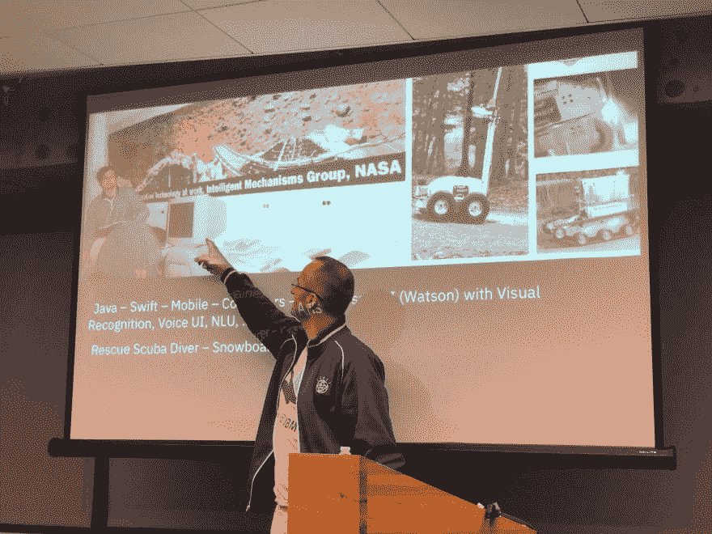
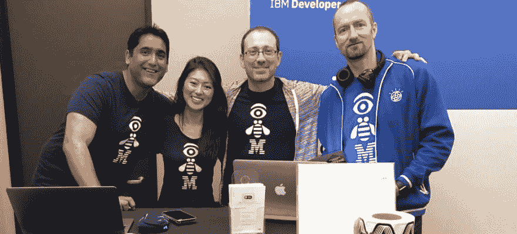
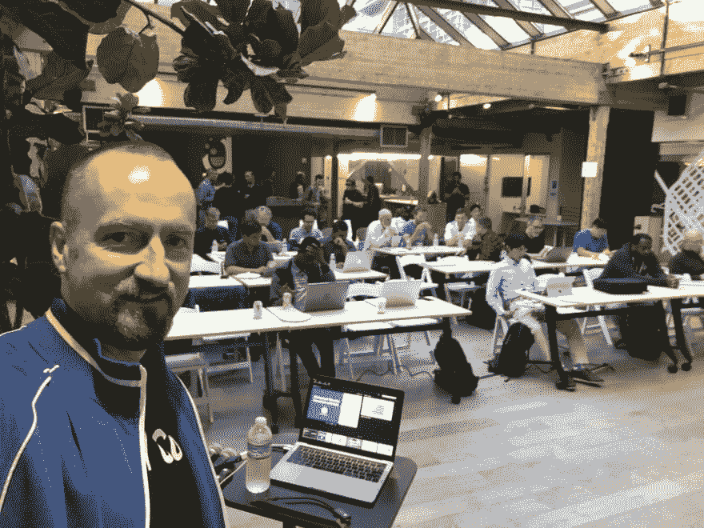

# DevRel Down the Stack: Containers、Kubernetes 和 DevOps 工程师

> 原文：<https://www.freecodecamp.org/news/devrel-down-the-stack-containers-kubernetes-and-devops-engineers/>

IBM 以[、34B 美元收购 Red Hat](https://newsroom.ibm.com/2019-07-09-IBM-Closes-Landmark-Acquisition-of-Red-Hat-for-34-Billion-Defines-Open-Hybrid-Cloud-Future) 的交易于上周完成，凸显了混合云基础设施的巨大和日益增长的重要性。我的同事 Marek Sadowski 已经成为 containers、Kubernetes 和服务器端 Swift 的主题专家，尽管他最初是一名全栈开发者倡导者、机器人初创公司创始人和企业家。

Marek 在美国、欧洲、日本、中东和非洲拥有 20 年的企业咨询经验，在 NASA 工作期间，他率先研究了虚拟现实系统的 VR 护目镜，以控制火星上的机器人。在创办了一家机器人初创公司后，马雷克来到了 IBM 工作。我和他谈了他在 DevOps 辩护的经历。

## 目录

*   DevOps 宣传与 API/app 宣传有何不同？
*   你如何关注 DevRel 社区？
*   搬到 DevOps DevRel，你改变了什么？
*   如何让开发人员将 Swift 视为服务器端？
*   你是怎么进入德弗雷尔的？

### 问:你在 DevRel 中关注的一个领域是容器。倡导 DevOps 技术与倡导 API 或应用程序有什么不同？

好问题。当使用容器时，工程师更多地考虑 DevOps 的管道和想法，以及扩展基础设施足迹的容易程度。相比之下，当您谈论 API 时，您试图将应用程序开发作为讨论的重心。

当与开发人员讨论 API 时，您会谈到如何以健壮的方式使用 API。让我们以 [IBM Watson API](https://ibm.biz/BdzKG5) 为例:我们的团队将讨论如何为开发者创建和运行 SDK，以使用他们自己的语言消费 API，例如 Swift(用于移动)或 Java(用于企业。)你会看着你的 API 的消费者，讨论你如何能生产 API，保护你自己和做帐单。

回到容器:当讨论容器技术时，你会更多地谈到云的*管道*。你如何管理容器？扩展它们？管理他们的工作负载？交付和测试新版本？

很快就很明显，这是两个不同的概念。容器化处理你的后端如何工作以及你的应用程序的正确维护，这吸引了来自 DevOps 背景的人。当你谈论 API 的时候，那是一个完全不同的故事。您的思维范式转变为消费者的观点:消费者如何找到 API？开发者如何消费 API？

我在两个主题领域的会议上发言。我发现开发应用程序的人对应用程序的外观和感觉以及开发人员的体验更感兴趣，而对于容器来说，更多的是关于后端、负载平衡以及从系统管理员的角度来看问题。

### 问:许多人对 DevRel 很熟悉，主要关注软件工程师，但 DevOps 是一个完全不同的社区。你如何关注这个社区？

这是一种分化——每个人都对 Kubernetes 和 Docker 这样的新事物感兴趣，但没有太多人愿意将自己的技能完善到日常工作的地步。所以许多开发人员想知道如何在容器中构建一个容器和一个服务，把它放在他们的简历中，然后完成它。开发人员可能会感兴趣，因为它很时尚，或者是一个流行词。但是，您会发现许多人在容器中运行服务，并有特定的问题:希望监控容器并确保安全性、负载平衡和其他管理方面的系统管理员。这与使用 API 并创建一个很酷的 web 应用程序的开发人员是完全不同的受众。他们是两个不同的社区，你要赋予每个社区不同的内容。

例如，在黑客马拉松中，很难在容器中创建大型部署。这是对开发和运营的优化，而不是对应用程序编码的优化。

### 问:当你转到 devo PS advocation 时，你是如何改变对 DevRel 的态度的？

以前，当我举办专注于应用程序开发人员的研讨会时，他们通常有几个目标:理解我们的 API，使用来自 API 端点的数据，并创建简单的“Hello World”类型的应用程序。在这些研讨会中，开发人员将询问有关设计应用程序的高级方法的问题，例如，使用 Watson，在移动应用程序或 web 应用程序中，或者在一系列流程中。

相反，当我谈到 DevOps 和容器时，观众中的开发人员希望提升服务，了解它们如何扩展和缩减，研究服务在出现故障时的行为以及如何改善安全问题。这是一种完全不同的方法。他们对构建新的东西不感兴趣，他们想要完善他们的部署方法。

我可以给这个领域的新手一个类比:这就像邀请一个油漆工和一个水管工去参加一个聚会。他们都做类似的事情，但油漆工想画一幅你可以挂在墙上的画，水管工很少谈论他在你的墙内使用的管道类型。两者都在你的房子里做一些事情，但油漆工考虑的是他们将吸引的人和油漆(我们的 API)以确保愉快的观看体验，而水管工只想完成工作，永远不再碰它。水管工希望尽可能少地进行改动，专注于稳定性，而画家希望创作更多新的画作。基于不同的目标，他们有不同的方法。

### 问:您也发表了关于 Swift 的演讲，特别是在服务器方面。大多数人都是从 iOS 开发端知道 Swift 的，但为什么它在服务器端有用？如何让开发者把它当成一种服务器语言？

服务器端 Swift 是一个相对较新的发展。我将服务器端 Swift 的当前状态与 24 年前 Java 的状态进行了比较。1996 年，我开始使用 Java 编写服务器端应用程序——这在当时还是一个新概念！同样的事情现在也发生在 Swift 上，因为开发人员正在将 Swift 语言转移到服务器上。原因有很多；一个最简单的方法是，你在服务器上用和你在移动应用上一样的语言编写，这样你就可以在两个系统上使用相同的数据结构、思维过程和人力资源。您不需要不同的系统或框架来与数据库或云对话。

现在的每个移动应用程序都要求你连接到互联网上进行人工智能、消息传递和社交媒体。即使是简单的游戏也能让你与世界各地的人交换信息或进行对话。如果你的 app 和后端是用 Swift 这样的一种语言编写的，那就让这些数据交换变得简单透明。

有些人说 Swift 是一种学习的时髦语言。由于您可以选择用 Java 或 JavaScript 编写应用程序，因此也可以用 Swift 编写。Swift 现在已经被苹果开源，类似于 Sun 开放 Java 的方式。现在，您可以在云中或任何平台上编写应用程序。例如，OpenWhisk 允许你在云中编写基于事件的 Swift 函数，而不需要任何 DevOps 代码。

有了 Swift，开发人员被语言的美丽和从移动到云编写一种语言的能力所吸引，从而使您的应用程序更好、更易于维护。你可以喜欢用你选择的语言写作，并扩展你所热爱的环境的能力。如果你是一名 iOS 开发人员，也许你可以成为一名全栈开发人员，开发人员喜欢他们可以成为更多东西并参与全栈开发过程的故事。

### 问:你是如何进入开发者关系的？

我作为一家初创公司的创始人刚从波兰来到美国，搬家的目的是扩大我的公司。他们说，99%的初创公司不会马上成功，创始人经常需要在现有工作中进行引导。有人告诉我，在云中工作是许多行业的关键因素，但我很少接触这些技术。另一方面，我积累了与投资者交谈的技巧，作为一名企业家，我能够理解什么对初创公司来说是重要的。我在 Java 开发和不同的 IT 技术方面也有很强的背景——我的职业是支持银行和其他企业的架构师，在 EMEA 是 Java 专业人员，向客户演示系统。

有一个移动优先开发者倡导者的空缺，尽管我没有移动或云经验，但我说服了面试官，因为我很容易与开发者交谈，并以一种可理解的方式介绍技术主题，所以我是完美的候选人。我喜欢通过演示和示例项目以简单的方式解释复杂的主题。

我的招聘经理要求我开发一个小型移动应用程序作为就业测试，它连接到 [IBM Cloud](https://ibm.biz/BdzKGU) 以在用户和后端之间交换信息。我喜欢这个任务，并且发现我很擅长！两年后，我迁移到更多的云技术和越来越多的 IBM APIs。最终，我开始对 Kubernetes 和容器产生兴趣，并意识到容器是一个具有惊人增长潜力的领域。

我必须说，DevRel 最吸引我的事情是有机会学习新技术并向开发人员传达新技术，并使用我的天赋以简单明了的方式解释复杂的事情。

### 下一步步骤:

*   [在 Twitter 上关注 Marek](https://twitter.com/blumareks)
*   查看 Marek 在即将举行的 [IBM 开发人员 SF 会议上的发言](https://www.meetup.com/IBM-Developer-SF-Bay-Area-Meetup)