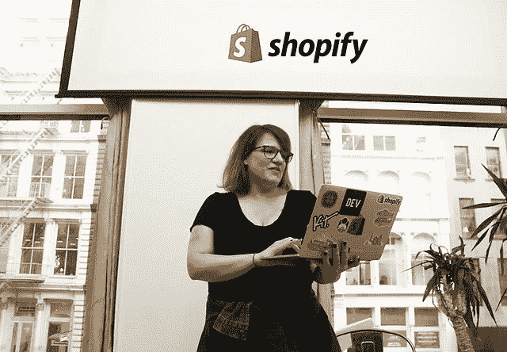
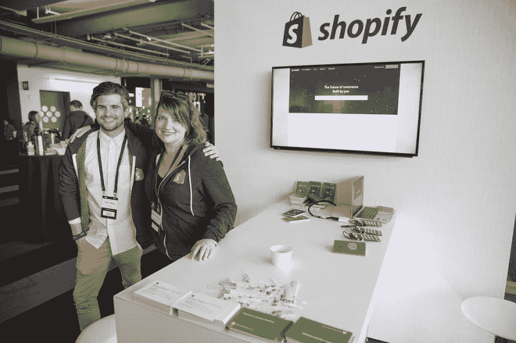

# DevRel 工程师一:从头开始建立一个开发者关系团队

> 原文：<https://www.freecodecamp.org/news/devrel-engineer-one-building-a-developer-relations-team-from-the-ground-up/>

这听起来像是一个令人兴奋的挑战:加入一家公司，作为他们的第一个 DevRel 工程师，塑造整个开发者关系战略。你如何塑造一个现代而有效的 DevRel 项目，同时确保你包括**准确的指标、多样性和社区建设**。

今天，我将采访开发商关系团队负责人、社区建设专家萨拉-简·莫里斯。Sarah-Jane 在旧金山花了 6 年时间在 Mashery、Intel、Keen IO 和最近的 Shopify 等公司建立包容性的开发人员社区。她曾在 B2B 和面向开发者的公司从事营销、社区、SEO 和品牌推广工作。她被一个多元化和受欢迎的科技行业的大胆愿景所驱动。我很好奇她会如何处理社区和效率的问题——特别是在，比如说，在一家初创公司，你是第一个专门负责开发关系的雇员。

我最近在旧金山的 DevRel 大会上遇见了 Sarah-Jane，当她在渥太华的 ForwardJS 演讲时。她目前经营着 [Listen 社区咨询](https://listen.community)，她很大方地同意在这次采访中与我分享她的知识。

## 目录

*   问:你是第一个被 DevRel 雇佣的人。你从哪里开始？
*   问:让我们谈谈活动:聚会、会议或贸易展？
*   问:你如何决定内容策略？
*   问:我如何为我的团队选择最好的 DevRel 工具？
*   问:你如何为 DevRel 创建度量标准？
*   问:如何选择有效的内容平台？

### 问:假设你是一家公司的第一个开发人员关系部雇员。你在许多方面都面临着巨大的任务:文档、潜在客户、事件、内容、产品。你从哪里开始？

作为一个新的 DevRel，你的第一个接触点将是现有的社区。在开始考虑内部接触点之前，你的首要任务之一是了解你当前社区的需求，这样你就可以得到基线:他们对文档有多满意？他们感觉如何？到目前为止，他们是否参加了活动，他们希望看到更多什么？SDK？

无论是查看数据后的一系列一对一对话，还是根据您的产品如何衡量活动(API 调用、云帐户等)来查看谁最活跃。)不管衡量标准是什么，与那些表示他们从您的工具中获得了某种价值的人交谈。

此外，与那些没有达到这些指标的人联系将有助于你描绘出社区目前如何与一些产品互动的全貌。与社区的联系将让你创建非常高层次的人物角色——通过调查，例如[我与 keen](https://dev.to/drnugent/%E2%80%9Dhttps://blog.keen.io/what-we-learned-when-we-surveyed-our-developer-community/%E2%80%9D) 一起完成的调查工作——我们获得了大量数据，我们真的很惊讶，关于我们社区的许多假设都是*错误的*，甚至像我们社区所说的语言一样简单的假设，或者像 Slack 这样的用户如何找到我们的社区空间。

这个基线研究将帮助你弄清楚你在最初的六个月里应该关注什么:哪些编程语言，哪些样本代码，你应该建立哪些策略来接触社区。哪些框架或工具是你产品的补充？你应该去参加什么样的活动？这项基线研究对于确定这些关键的后续步骤至关重要。

### 问:似乎公司里的每个人对活动策略都有不同的想法:例如，首席执行官想要举办会议，销售想要举办贸易展览，工程想要举办聚会。你如何为事件设计一个有凝聚力的愿景？

从 DevRel 的角度来看，您必须确保您的会议、研讨会和讲座与 Devrel 的总体目标保持一致。也许是社区目标，也许是为你的公司建立一个“防御护城河”。在这种情况下，你不能直接衡量投资回报率:我们扫描了多少徽章？

或者，你从事营销工作，也许你是能够从技术角度以最有说服力的方式谈论产品的人。作为一个 DevRel 团队，捍卫你的目标是很重要的，即使是在与市场合作的时候。确保将您的社区目标和产品反馈目标体现在您共同决定的活动策略中。

当以 devrel 招聘第一名的身份面试这家公司时，问这些问题，了解他们想从你身上得到什么。例如，如果他们只想让你去参加营销会议，你就必须和他们一起寻找一些共同点。

确保你对 DevRel 的看法与公司一致。你将身兼数职，但是你必须支持社区和产品反馈的目标，以展示 DevRel 能给公司带来的真正价值。

正如 Mary Thengvall 所说，“对社区来说，你代表公司，对公司来说，你代表社区。”确保您的活动推动了您作为公司和社区的核心使命。

### 问:一些组织正在全力支持内容和内容联合，而另一些组织则刚刚涉足这一领域。你如何决定什么对一个新公司是正确的？

回到我们的基线研究，要做的重要事情之一不仅仅是与用户和公司的利益相关者进行访谈。从那里，你将提取出“更大的画面”主题，你的社区为技术社区增加了什么样的价值。

例如，在 Shopify，我们的应用程序市场真正帮助我们完成了在高水平上支持企业家的使命。那么，作为一家公司，你如何开始围绕某些高层次的价值话题提高品牌知名度呢？如果你的公司做持续交付，也许你会谈论加速软件开发和使开发者更有效。

想想你是希望这些内容主要放在你的博客上，还是放在更中立的地方，比如 dev.to 或外部博客？(这是营销工作的一部分。)这与创造销售线索关系不大，更多的是创造对话，将用户吸引到您的网站，让他们研究并最终下载白皮书并创造销售线索。

如果内容策略看起来太难，从事件策略开始编织你的内容。在你的活动中记录谈话，在活动中做摘要并发布到你的博客上，拍照并发布到社交媒体上。通过将这两种策略编织在一起，您可以从每种策略中获得更多的价值，这可能比在这些大型主题区域中创建内容策略更容易实现。

### 问:有无数的工具可以用来管理社区、指标和 DevRel 工作流。你应该从哪里开始？

这很大程度上取决于你的预算等因素。有一些开源工具，比如 Vanilla 有一个开源论坛。我在早期的 DevRel 团队中经常看到的一件事是，他们会从不和谐或懈怠开始。我建议你尽早建立一个常青论坛，为开发者提供信息。

作为早期基线研究的一部分，您可以做的一件事是询问开发人员他们想要什么类型的数据，以及他们希望如何与您公司中的 devrel 进行交互。通过这些对话，您可以推出一个 alpha 版本，并激励您的高级用户在这些工具中播种问题、答案和信息。

在早期，你的懈怠或不和谐会令人惊讶，因为你的团队会参与进来，人们会得到问题的答案，但不幸的是，最终，这将无法扩展。最终，你会想要一些保持答案可用的东西，并通过 SEO 使它们可用。

我不愿意鼓励 devrel 团队过于依赖像 StackOverflow 这样的外部社区。它们肯定应该被监控，但是让所有东西都生活在 StackOverflow 上会让你的中枢失去意识控制。外部论坛也可能比你控制的社区中心更不友好，你不希望新用户每次提问都被拒绝，这是一些外部资源的刻板印象。

### 问:您应该如何为您的 DevRel 团队创建度量标准？

参加活动的人数是一个简单的指标，但衡量活动成功与否的方法应该基于活动结束时的调查，类似于 NPS 活动评分，只是为了了解人们是否会参加未来的活动以及他们是否喜欢活动内容。随着时间的推移，你会开始注意到模式。

另一件要看的事:重复出席者。这些天我发现自己大部分时间都在谈论一系列聚会，因为你可以获得良好的数据。然而，对于一个会议，我总是会把一个开发者公司从一个展位上移开，或者作为一种吸引开发者的唯一方式。除了你的展位，报名参加一个研讨会，或者一个真正的战术讲座，让你的公司教育和回馈社区。也许衡量标准是“有多少人真正通过了你所教的课程？”在 Shopify，我们举办了一系列 GraphQL 研讨会，并测量了有多少人通过了研讨会的每一步。然后，从商业的角度来看，衡量有多少与会者实际上用你的工具构建了一些东西。

就参与度指标而言，黑客马拉松类似于研讨会。也就是说，你也可以追踪“陈词滥调的数字:”你发了多少贴纸？如今，在社区中有一点点财富疲劳，但你也可以(例如)为非营利组织筹集资金，并衡量与会者和人们捐了多少钱。

最后，*现实一点*。活动是关于建立事物的，比如品牌参与，这是不可估量的。随着时间的推移，这些小接触点真的开始为你的品牌建立势头，因为开发者知道你是谁，对你有好感。用尽可能简短和甜蜜的方式追踪这些问题:“你喜欢吗？”“你会再来吗？”

### 问:发布社区内容时，您的指标会受到您使用的平台的影响:内部或外部。你如何明智地选择？

Jeff Lindquist 有一张幻灯片，上面写着“去开发人员所在的地方！”我们在 Mashery 的口号是相同的，这一直指导着我的策略。如果有大量开发人员阅读某个出版物，并且您可以在那里增加价值，那么在那里制作内容是有意义的。将会有很多新奇的事情需要记住:Dev.to 是一个整合你的内容的好地方，因为你可以放入一个规范的 URL，所以你将能够获得 SEO 汁液。

作为“个性”个体的 DevRel 与纯粹在公司内部的 DevRel 之间存在持续的紧张关系，DevRel 不可避免地与公司合作，并试图尽可能保持中立，那么内容在哪里反映这一点呢？

通过使用公司内部的外部工具，您可以在这条线上行走——一些公司过去通过为该公司发行媒体出版物来实现这一点，但最近媒体一直在推进他们的付费墙。这些天你也会看到很多人在使用 dev.to，但是你不想太依赖一个工具，你的发布工具会随着你的工具和你的公司的改变而改变。

感谢莎拉-简·莫里斯的采访。

### 后续步骤:

*   [在 Twitter 上关注莎拉-简](https://twitter.com/SarahJaneMorris)
*   联系[倾听社区咨询](https://listen.community)