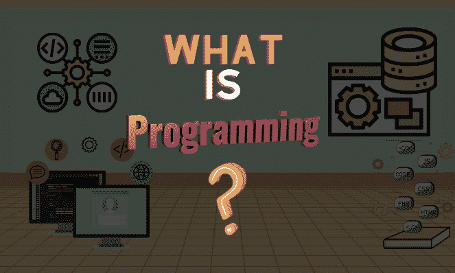
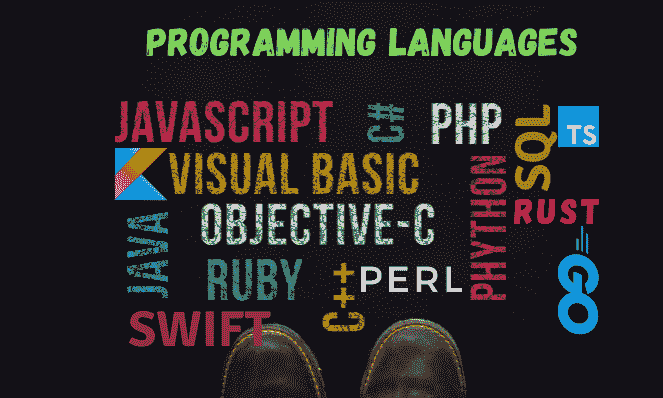

# 编码和编程有什么区别？

> 原文：<https://www.freecodecamp.org/news/difference-between-coding-and-programming/>

我花了很长时间才理解术语**编程**和**编码**的真正含义，以及每个领域包含的内容。我敢肯定，我不是唯一一个对这两个术语感到困惑的人，当我刚接触科技的时候。

有一段时间我认为它们是一回事，过了一段时间我才明白这两个“世界”是有区别的。

在本文中，我将解释编码和编程之间的基本区别，以及它们如何协作开发应用程序和网站。

因此，让我们先了解这些术语的含义，然后探究专业人士如何使用它们。

## 什么是编码？

你可能已经看到课程、训练营或文章都在谈论编码——那么为什么强调这个术语呢？

这是因为实际的编码行为使我们有可能做所有我们每天都在做的很酷的事情。它让我们使用移动应用程序，使用不同的软件和操作系统，甚至玩我们喜欢的游戏或访问您正在阅读本文的网站。这一切都是通过编码实现的。

那么，简单来说，什么是编码呢？

我们可以将编码定义为将计算机指令从人类语言翻译成机器能够理解的语言的行为。这个代码告诉计算机如何操作和执行什么动作。

如果你想成为一名程序员，你需要有一些编程语言的基础知识。当我说编程语言时，我指的是像 Python、Java、Go、PHP 或 JavaScript 这样的语言，仅举几例。

下面是用 Python 语言编写的一些代码的一个很好的例子，这些代码将任何 *PDF* 转换成*有声读物*:

```
import PyPDF2                     # pip install pypdf
import pyttsx3                    # pip install pyttsx3
from tkinter.filedialog import *  # pip install tkinter

book = askopenfilename()
pdfReader = PyPDF2.PdfFileReader(book)

pages = pdfReader.numPages

for num in range(0, pages):
    page = pdfReader.getPage(num)
    text = page.extractText()
    speak = pyttsx3.init()
    speak.say(text)
    speak.runAndWait() 
```

## 什么是编程？


你可能也听人说过，*“我是程序员”*。使用这个术语的一些人理解术语的含义，而其他人则不理解。如果你不知道编程到底是什么意思，让我们试着通过理解编程是怎么回事来解释一下。

编程是创建指令的过程，这些指令将告诉计算机如何执行分配给它的特定任务。您可以使用以下编程语言来实现这一点:



当我们谈论编程时，想象一下类似于电视遥控器的东西——它会等待您通过按下不同的按钮向它发出指令，然后告诉电视执行特定的任务(如更换频道、提高音量等)。嗯，这和程序员指导计算机做各种事情的方式是一样的。

通过编程，你几乎可以做任何事情——比如给机器人编程来帮助做家务，甚至像特斯拉一样给自动驾驶汽车编程。

为了让程序员开发出能够实现他们想法的程序，他们需要执行以下步骤:

*   规划应用程序的结构(*借助 Trello* 等工具)
*   设计它(*通过使用像 Figma 或 Adobexd* 这样的工具)
*   开发它(*通过使用他们选择的编程语言*
*   测试其功能
*   部署它(*在免费或付费托管服务上*
*   完工后维护它。

如你所见，我们可以说编程不仅仅是处理代码的实际编写。它还包括使用数据结构和算法，以及处理创建和开发复杂系统的全局。

## 编码和编程的区别

我们将把差异分为四个主要类别，这将有助于我们分解概念并更好地理解它们。

### 术语

***编码*** 处理用机器和人类都能理解的语言编写代码。编码的主要目的是提供两者之间的交流(人类&计算机)。

***编程*** 包括在编写实际代码以执行其需要执行的任务之前，为遵循特定标准的程序代码创建一个大纲和结构。

### 你使用的工具

说到**，你最重要的工具之一将是你的文本编辑器(比如记事本，或者更复杂、功能更丰富的东西，比如 Visual Studio Code、Sublime、Atom 或 Vim)。**

 **另一方面，当你在谈论 ***编程*** 时，你将需要一些额外的工具。作为一名程序员，你将执行文档审查，做大量的计划，思考设计，等等。

为了帮助您完成这些任务，您将使用更高级的代码编辑器、分析工具、调试器、建模框架、汇编器、建模算法等工具。

作为一名程序员，你需要有很多使用这些工具的经验，并更多地接触开发人员用来构建应用和其他产品的流程。

### 你的知识水平

作为一名 ***程序员*** 拥有编程语言及其语法的基础知识是一个良好的开端。一旦你知道如何用一种语言编码，学习其他语言就更容易了。再说一遍，你的主要目的是编写实际的代码，告诉机器做什么。

另一方面 ***程序员*** 一开始就需要更多的知识。你需要知道如何创建和使用算法，如何设计网站，如何调试和测试你的代码，如何管理项目，当然还有如何使用编程语言。

当你开发复杂系统时，解决问题、批判性思维和分析技能也是必不可少的。

### 最终产品

作为一个 ***编码者*** 你期望的结果通常是一个简单的解决方案，在编译之后，将成功地给出你想要的输出。一个很好的例子就是我们之前给出的——将 PDF 转换成音频文件。

另一方面，一个 ***程序员*** 将致力于给出一个完整的可工作的应用程序或一个人们将在市场上使用的软件。他们还负责跟进和维护他们构建的东西，以确保它运行平稳，没有任何故障。

## 编码和编程如何协同工作

至此，我希望你能够说出编码和编程之间的区别，以及这两者处理的是什么。现在，让我们来看看这两者如何能够(也应该)紧密合作来完成很多事情。

为了更好地理解如何实现，让我们从提供一个真实的场景开始，在这个场景中，编码和编程都需要紧密合作，以生成一个完整的工作应用程序。

想象一下，你被要求创建一个应用程序来帮助监控或跟踪你的日常事务或监控你的日常开支。通过使用两个世界的概念，这就是你将如何完成任务。

您将需要一名程序员，他将能够:

*   规划应用程序的结构(*借助 Trello* 等工具)
*   写下应用程序的主要功能，用户预期使用它的目的等
*   使用 Figma 或 Adobexd 等工具设计应用程序(

 *完成这些步骤后，编码者的角色开始发挥作用。他们接受程序员创造的想法，并通过编写代码来执行指定的任务，从而将其转化为机器可读的形式。在神奇的编码过程之后，程序员回来了。

然后，程序员将评估代码，检查错误，运行测试，并检查一切都正常工作，代码给出了预期的结果。如果所有这些都检查过了，那么应用程序现在就可以进行部署和维护了——这仍然由程序员来完成。

这个简单的例子解释了如何将这两种技能结合起来提高生产力。

最后一点:“程序员”和“程序员”并不总是两个独立的人。他们可以是执行所有这些任务的同一个人。

## 包裹

你属于两个世界的哪一部分？我花了很长时间才明白我真正感兴趣的是什么。

如果你对逻辑更感兴趣，试着把你的精力放在编程的整个过程中。如果你真的只是喜欢阅读和编写代码，那么就把你的时间投入到编码中。

众所周知，计算机科学是一个非常广泛的领域，而且它仍在不断发展。努力寻找你想探索的道路，并专注于此——一定要享受它并从中得到乐趣。

如果你还在挣扎，我希望这篇文章能给你一些启发，帮助你找到自己的位置。

谢谢你读到这里。如果你喜欢这篇文章，请分享它，这样你可以帮助其他开发者找到他们的道路。

与我联系:[Twitter](https://twitter.com/larymak1)|[LinkedIn](https://www.linkedin.com/in/hillary-nyakundi-3a64b11ab/)|[GitHub](https://github.com/larymak)

享受编码❤***