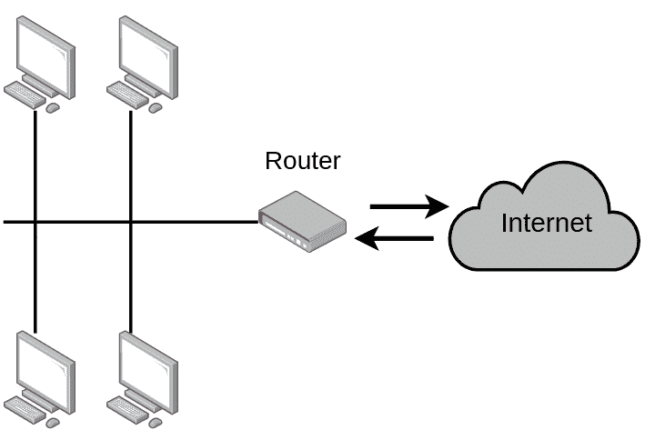
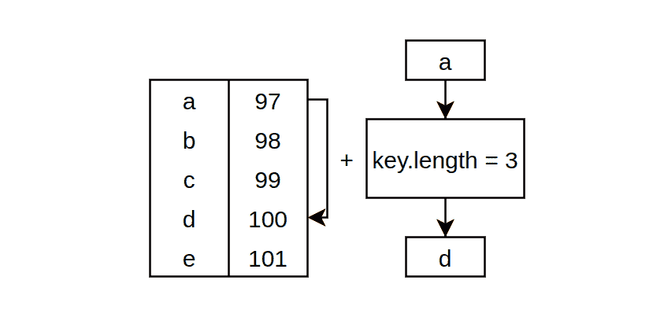
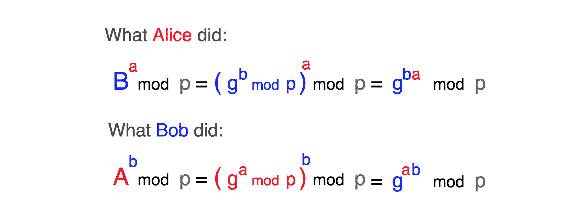
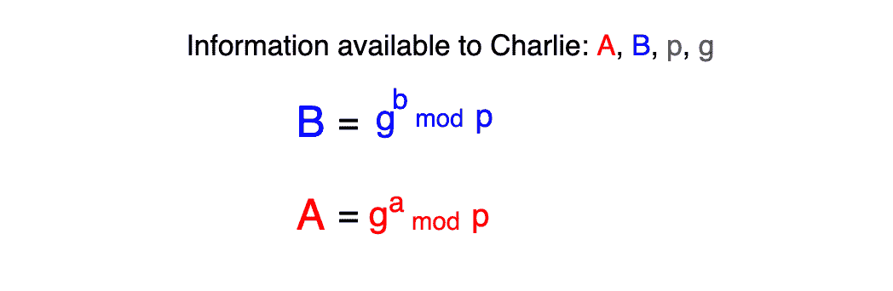

# Diffie-Hellman:安全网络通信背后的天才算法

> 原文：<https://www.freecodecamp.org/news/diffie-hellman-key-exchange/>

让我们从一个快速思维实验开始。

您有一个由 3 台计算机组成的网络，分别由 Alice、Bob 和 Charlie 使用。所有 3 个参与者都可以发送消息，但只是以连接到网络的所有其他客户端都可以读取的方式发送。这是参与者之间唯一可能的交流形式。

如果爱丽丝通过电线发送信息，鲍勃和查理都会收到。换句话说，如果查理没有收到，爱丽丝就不能直接发送消息给鲍勃。

但是 Alice 想给 Bob 发送一条机密消息，并且不希望 Charlie 能够看到它。

在这些严格的规则下似乎是不可能的，对吗？这个问题在 1976 年被惠特菲尔德·迪菲和马丁·赫尔曼解决了。

这是现实世界的简化版本，但是当我们通过有史以来最大的网络交流时，我们面临着同样的问题。

通常，你不是直接连接到互联网，但你是一个本地较小的网络，称为以太网的一部分。

这种较小的网络可以是有线或无线的(Wi-Fi)，但基本概念仍然存在。如果您通过网络发送信号，连接到同一网络的所有其他客户端都可以读取该信号。



一旦你用你的信用卡信息向你银行的服务器发出一条信息，本地网络中的所有其它客户都将收到这条信息，包括路由器。然后，它会将其转发给银行的实际服务器。所有其他客户端将忽略该消息。

但是如果网络中有一个恶意的客户端不会忽略你的机密消息，而是读取这些消息呢？你的银行账户上怎么可能还有钱？

## 加密

很明显，在这一点上，我们需要使用某种加密来确保消息对于 Alice 和 Bob 是可读的，但是对于 Charlie 是完全的乱码。

加密信息是通过加密算法完成的，该算法采用一个密钥(例如一个字符串)并返回一个加密值，称为密文。密文只是一个看起来完全随机的字符串。

重要的是，加密值(密文)只能用原始密钥解密。这被称为对称密钥算法，因为解密邮件时需要使用与加密邮件时相同的密钥。也有非对称密钥算法，但我们现在不需要它们。

为了更容易理解这一点，这里有一个用 JavaScript 实现的虚拟加密算法:

```
function encrypt(message, key) {
    return message.split("").map(character => {
        const characterAsciiCode = character.charCodeAt(0)
    	return String.fromCharCode(characterAsciiCode+key.length)
    }).join("");
}
```

Encrypting

在这个函数中，我根据给定键的长度将每个字符映射到另一个字符。

每个字符都有一个整数表示，称为 ASCII 码。有一个包含所有字符及其代码的字典，称为 ASCII 表。所以我们将这个整数增加了密钥的长度:



Character mapping

解密密文非常相似。但是我们不是加法，而是从密文的每个字符中减去密钥长度，因此我们得到原始消息。

```
function decrypt(cipher, key) {
    return cipher.split("").map(character => {
        const characterAsciiCode = character.charCodeAt(0)
    	return String.fromCharCode(characterAsciiCode-key.length)
    }).join("");
}
```

Decrypting

最后，这是虚拟加密的实际应用:

```
const message = "Hi Bob, here is a confidential message!";
const key = "password";

const cipher = encrypt(message, key);
console.log("Encrypted message:", cipher);
// Encrypted message: Pq(Jwj4(pmzm(q{(i(kwvnqlmv|qit(um{{iom)

const decryptedMessage = decrypt(cipher, key);
console.log("Decrypted message:", decryptedMessage);
// Decrypted message: Hi Bob, here is a confidential message!
```

Using our algorithm

我们对消息应用了某种程度的加密，但该算法仅用于演示目的，以了解对称密钥加密算法的行为。

除了处理不好极限情况和参数类型之外，这种实现还有几个问题。

首先，每个 8 字符长的密钥可以解密用密钥“密码”加密的消息。我们希望加密算法只有在我们给它与加密消息相同的密钥时才能解密消息。一把可以用其他钥匙打开的门锁没那么有用。

其次，逻辑太简单了 ASCII 表中的每个字符都移动了相同的量，这太容易预测了。我们需要一些更复杂的东西，让我们在没有钥匙的情况下更难找到信息。

第三，没有最小密钥长度。现代算法使用至少 128 位长的密钥(~16 个字符)。这大大增加了可能的密钥数量，从而提高了加密的安全性。

最后，加密或解密消息花费的时间太少。这是一个问题，因为尝试所有可能的密钥并破解加密消息并不需要太多时间。

这与密钥长度密切相关:如果我作为攻击者想要找到密钥，则算法是安全的，然后我需要尝试大量的密钥组合，并且尝试单个组合需要相对较长的时间。

有各种各样的对称加密算法可以满足所有这些要求，它们通常一起使用，以便在各种情况下找到速度和安全性的良好比例。

比较流行的对称密钥算法有 [Twofish](http://en.wikipedia.org/wiki/Twofish) 、 [Serpent](http://en.wikipedia.org/wiki/Serpent_%28cipher%29) 、 [AES](http://en.wikipedia.org/wiki/Advanced_Encryption_Standard) ( [Rijndael](http://en.wikipedia.org/wiki/Rijndael) )、 [Blowfish](http://en.wikipedia.org/wiki/Blowfish_%28cipher%29) 、 [CAST5](http://en.wikipedia.org/wiki/CAST5) 、 [RC4](http://en.wikipedia.org/wiki/RC4) 、 [TDES](http://en.wikipedia.org/wiki/Triple_DES) 和 [IDEA](http://en.wikipedia.org/wiki/International_Data_Encryption_Algorithm) 。

如果你想了解更多关于密码学的知识，请查看这个讲座。

## 密钥交换

看起来我们缩小了原来的问题空间。通过加密，我们可以创建对有资格阅读信息的各方有意义，但对其他人不可读的消息。

当爱丽丝想写一条机密信息时，她会选择一个密钥，用它加密她的信息，并通过电线发送密文。鲍勃和查理都会收到加密的信息，但是没有爱丽丝的钥匙，他们谁也无法破译。

现在唯一需要回答的问题是，Alice 和 Bob 如何通过网络通信找到一个共同的密钥，并防止 Charlie 找到相同的密钥。

如果爱丽丝通过电线直接发送她的密钥，查理会截获它，并能够解密爱丽丝的所有信息。所以这不是办法。这在计算机科学中被称为密钥交换问题。

### diffie–Hellman 密钥交换

这种很酷的算法提供了一种在两个人之间生成共享密钥的方式，通过观察通信看不到密钥。

作为第一步，我们会说有一个巨大的质数，所有参与者都知道，这是公共信息。我们称之为**“p”或模数**。

还有另外一个公众号叫做**“g”或者基数**、**、**小于 **p** 。

不用担心这些数字是怎么产生的。为了简单起见，让我们假设爱丽丝选择了一个非常大的质数( **p** )和一个比 **p** 小得多的数。然后她通过没有任何加密的线路发送它们，所以所有的参与者都知道这些数字。

**例子:**为了通过一个例子来理解这一点，我们将使用小数字。假设 **p=23** 和 **g=5** 。

第二步，爱丽丝( **a** )和鲍勃( **b** )将选择一个秘密号码，他们不会告诉任何人，只是本地存在他们的计算机中。

**举例:**假设爱丽丝挑了 4 ( **a=4** ，鲍勃挑了 3 ( **b=3** )。

下一步，他们将对他们的秘密数字做一些数学计算，他们将计算:

1.  基( **g** )在他们的秘密号的威力下，
2.  并将计算出的数的模取为 **p** 。
3.  将结果称为 **A** (对于爱丽丝)和 **B** (对于鲍勃)。

模是一个简单的数学表述，我们用它来求一个数除以另一个数后的余数。这里举个例子: **23 mod 4 = 3** ，因为 23/4 是 5，还剩 3。

也许在代码中更容易看到所有这些:

```
// base
const g = 5;
// modulus
const p = 23;

// Alice's randomly picked number
const a = 4;
// Alice's calculated value
const A = Math.pow(g, a)%p;

// Do the same for Bob
const b = 3;
const B = Math.pow(g, b)%p;

console.log("Alice's calculated value (A):", A);
// Alice's calculated value (A): 4
console.log("Bob's calculated value (B):", B);
// Bob's calculated value (B): 10
```

现在爱丽丝和鲍勃都将通过网络发送他们的计算值( **A** ， **B** )，因此所有参与者都将知道他们。

最后一步，Alice 和 Bob 将采用彼此的计算值，并执行以下操作:

1.  爱丽丝将利用鲍勃的秘密数字( **a** )的幂来计算鲍勃的值( **B** )，
2.  并且计算这个数对 **p** 的模，并将结果称为 **s** (秘密)。
3.  鲍勃也会这样做，但是用的是爱丽丝的计算值( **A** )和他的秘密数字( **b** )。

此时，他们成功地生成了一个共同的秘密( **s** )，即使现在很难看到。我们稍后将对此进行更详细的探讨。

在代码中:

```
// Alice calculate the common secret
const secretOfAlice = Math.pow(B, a)%p;
console.log("Alice's calculated secret:", secretOfAlice);
// Alice's calculated secret: 18

// Bob will calculate
const secretOfBob = Math.pow(A, b)%p;
console.log("Bob's calculated secret:", secretOfBob);
// Bob's calculated secret: 18
```

Calculating common secret

正如你所看到的，爱丽丝和鲍勃都得到了数字 18，他们可以用它作为加密信息的密钥。在这一点上看起来很神奇，但这只是一些数学。

让我们通过将计算分成基本部分来看看为什么他们得到了相同的数字:



The process as an equation

在最后一步中，我们使用了一个[模算术恒等式](https://en.wikipedia.org/wiki/Modulo_operation#Properties_(identities))及其分配性质来简化嵌套的模语句。

爱丽丝和鲍勃有同样的钥匙，但是让我们看看查理从这一切中看到了什么。我们知道 **p** 和 **g** 是公众号，每个人都可以使用。

我们还知道，爱丽丝和鲍勃通过网络发送了他们的计算值( **A** ， **B** )，这样查理也可以捕捉到。



Charlie's perspective

查理知道这个等式的几乎所有参数，只是 **a** 和 **b** 保持隐藏。再来看例子，如果他知道 **A** 是 4、 **p** 是 23、 **g** 的 **a** 的幂可以是 4、27、50、73、...以及在模空间中产生 4 的无限其他数。

他还知道只有这些数字的子集是可能的选项，因为不是所有的数字都是 5 的指数( **g** )，但这仍然是无限数量的选项可以尝试。

对于小数量，这似乎不太安全。但是在开始我说过 **p** 是一个非常大的数字，通常有 2000 或 4000 位长。这使得在现实世界中猜测 **a** 或 **b** 的值几乎是不可能的。

除了通过网络传播的信息之外，爱丽丝和鲍勃都拥有的公共密钥只能通过知道 **a** 或 **b** 来生成。

如果你更直观，这里有一个很棒的图表，通过混合颜料桶而不是数字来展示整个过程。


source: [Wikipedia](https://en.wikipedia.org/wiki/Diffie%E2%80%93Hellman_key_exchange)

这里的 **p** 和 **g** 共享由黄色“通用漆”表示的常数。爱丽丝和鲍勃的秘密号码( **a** ， **b** )就是“秘密颜色”，“共同秘密”就是我们所说的 **s** 。

这是一个很好的类比，因为它代表了模运算的不可逆性。因为混合的颜料不能被分解成它们的原始成分，所以模运算的结果不能反转。

## 摘要

现在，原来的问题可以通过使用共享密钥加密消息来解决，共享密钥是用 Diffie-Hellman 算法交换的。

有了这个，Alice 和 Bob 可以安全地通信，而 Charlie 不能阅读他们的消息，即使他是同一个网络的一部分。

感谢您读到这里！我希望你能从这篇文章中获得一些价值，并理解这个有趣的交流流程的一些部分。

如果很难理解这种解释的数学，这里的是一个很好的视频，可以帮助你从更高的层面理解没有数学的算法。

如果你喜欢这篇文章，你可以在 Twitter 上关注我，寻找更多关于编程和软件开发的令人兴奋的资源。