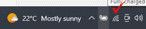
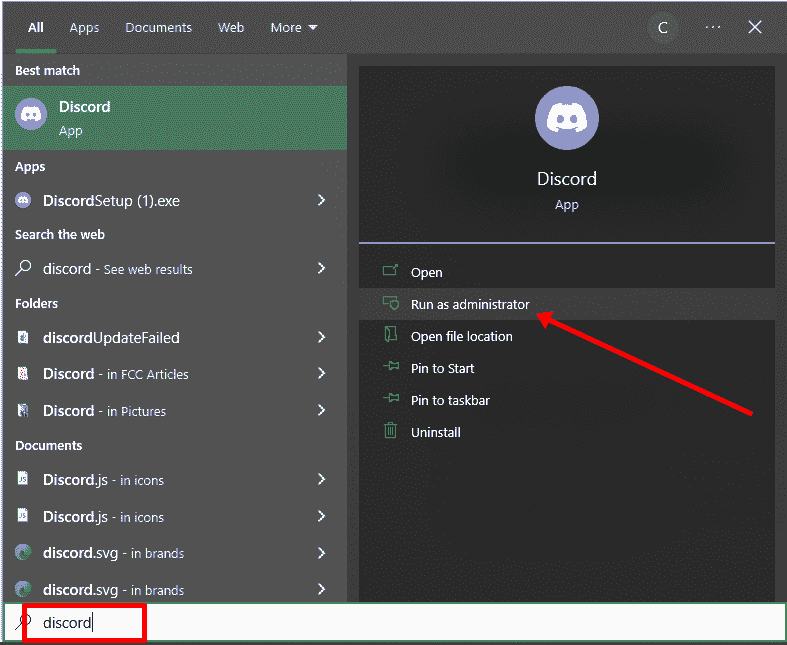
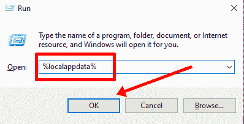
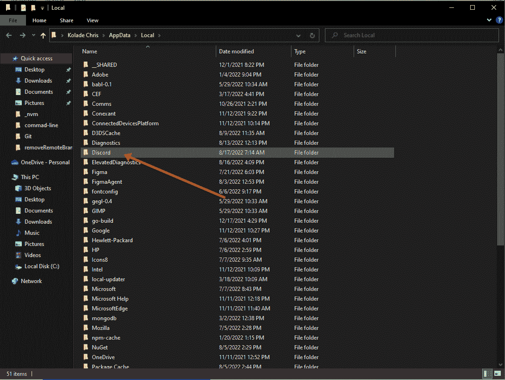
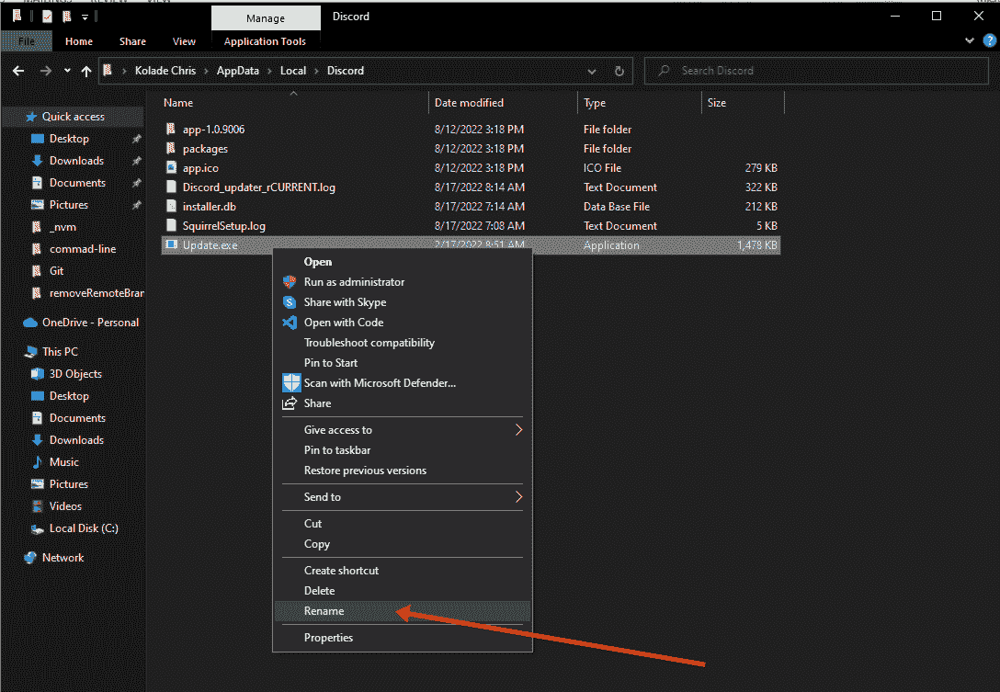
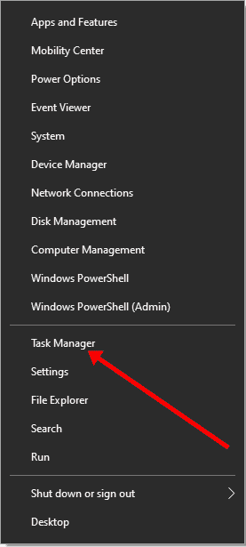
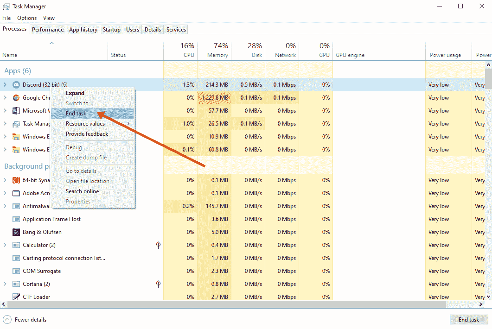

# 不和谐更新失败–如何在 Windows 10 电脑上修复错误

> 原文：<https://www.freecodecamp.org/news/discord-update-failed-how-to-fix-the-error-on-a-windows-10-pc/>

Discord 是一款流行的聊天应用，适用于游戏玩家和任何想要创建在线社区的人。尽管它很受欢迎，但用户报告的一个主要问题是更新失败循环。

Discord 必须经常更新，因为 Discord 团队会定期实施新功能和错误修复。

此外，应用程序本身必须从聊天室和 DMs 加载新消息。一旦更新失败，Discord 就会陷入更新失败循环。

在本指南中，我将向您展示 4 种方法来修复 Windows 10 电脑上的不和谐更新失败错误。

## 我们将涵盖的内容

*   [仔细检查你的网络连接](#solution1doublecheckyourinternetconnection)
*   [以管理员身份运行 Discord](#solution2rundiscordasanadministrator)
*   [重命名 Discord 的 Update.exe 文件](#solution3renamediscordsupdateexefile)
*   [暂时禁用您的防病毒程序和 VPN](#solution4temporarilydisableyourantivirusprogramandvpn)
*   [卸载并重新安装 Discord](#solution5uninstallandreinstalldiscord)
*   [结论](#conclusion)

## 解决方案 1:仔细检查你的网络连接

我建议你做的第一件事是检查你的互联网连接。

这是因为 Discord 需要互联网连接才能更新，因为更新必须通过互联网进行。一旦没有互联网连接，更新就不会发生。

请确保您的 Windows 10 PC 已连接到互联网，并且互联网连接足够强。

## 解决方案 2:以管理员身份运行 Discord

这个问题的一个常见解决方案是以管理员身份运行 Discord 应用程序。

这可能会解决问题，因为您要安装的任何应用程序都需要管理员权限。Discord 也不例外，因此授予 it 管理员权限可以让 it 更深入地研究问题并解决它。

要以管理员身份运行 Discord，请搜索 Discord 并在右侧选择以管理员身份运行:

## 解决方案 3:重命名 Discord 的 Update.exe 文件

有一个单独的可执行文件来更新 Discord。这是不和谐文件夹里的 update.exe 文件。

重命名此文件可以强制 Discord 下载一个新的文件，并随后为您修复问题。

**按照以下步骤重命名 Discord 的 update.exe 文件**
按下键盘上的`WIN` (Windows logo 键)+ `R`，键入`%localappdata%`。

找到 Discord 文件夹并打开它。

右击`Update.exe`文件并选择重命名。然后重命名为“Updater.exe”之类的。您不能更改扩展名。

再次打开应用程序，看看问题是否得到解决。

## 解决方案 4:暂时禁用您的防病毒程序和 VPN

众所周知，防病毒程序和 VPN 会干扰计算机和互联网连接的正常运行。因此，如果你的电脑上有一个或两个，它可能会阻止不和谐的更新。

要禁用您的防病毒和 VPN，请打开任务管理器，右键单击`WIN` (Windows 徽标键)并选择任务管理器。

在 processes 下，右键单击 Discord 并选择 End Task。

## 解决方案 5:卸载并重新安装 Discord

如果已经讨论过的解决方案对您不起作用，最后一个办法是卸载 Discord 并重新安装它。

**步骤 1** :前往控制面板，选择卸载程序。

**第二步**:查找 Discord，右键点击，选择卸载。

**第三步**:要彻底消除不和谐，按键盘上的`WIN` + `R`，键入`%localappdata%`，点击确定。

**第四步**:右键点击 Discord 文件夹，选择删除。

**第四步** : [再次下载 Discord](https://discord.com/download) 并安装。

## 结论

我希望上面讨论的解决方案能帮助你更新 Discord，这样你就可以再次开始使用它了。

感谢您的阅读。