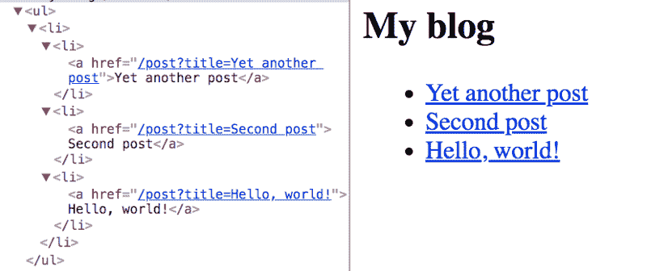
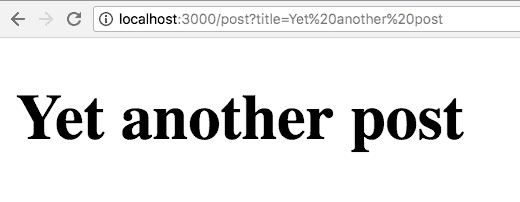

# 发现 Next.js 并以简单的方式编写服务器端 React 应用程序

> 原文：<https://www.freecodecamp.org/news/discover-next-js-and-write-server-side-react-apps-the-easy-way-cc920dea2d9d/>

> 对学习 JavaScript 感兴趣？在 jshandbook.com 获得我的电子书

### 介绍

在一个由 [React](https://flaviocopes.com/react/) 支持的现代 JavaScript 应用程序上工作是很棒的，直到你意识到在客户端呈现所有内容存在一些问题。

首先，页面需要更长的时间才能被用户看到。这是因为在内容加载之前，所有的 JavaScript 都必须加载，并且您的应用程序需要运行以确定在页面上显示什么。

第二，如果你正在建立一个公开的网站，你有一个内容搜索引擎优化的问题。搜索引擎在运行和索引 JavaScript 应用程序方面变得越来越好，但如果我们能向它们发送内容而不是让它们自己去解决，那就更好了。

这两个问题的解决方案是**服务器渲染**，也称为**静态预渲染**。

Next.js 是一个 React 框架，它允许我们以非常简单的方式完成所有这些工作，但它并不局限于此。它的创造者宣传它是 React 应用程序的**零配置、单命令工具链。**

它提供了一个通用的结构，允许您轻松地构建一个前端 React 应用程序，并且它透明地为您处理服务器端呈现。

### 主要特征

以下是 Next.js 主要特性的非详尽列表:

*   **热代码重新加载** : Next.js 在检测到保存到磁盘的任何更改时重新加载页面。
*   **自动路由**:任何 URL 都被映射到文件系统(映射到放在`pages`文件夹中的文件)，你不需要任何配置(当然，你有定制选项)。
*   **单个文件组件**:使用 [styled-jsx](https://github.com/zeit/styled-jsx) ，完全集成为同一个团队构建的，很容易添加组件范围内的样式。
*   **服务器呈现**:在将 HTML 发送到客户端之前，您可以(可选地)在服务器端呈现 React 组件。
*   **生态系统兼容性** : Next.js 与 JavaScript、Node 和 React 生态系统的其余部分配合良好。
*   **自动代码分割**:页面只呈现他们需要的库和 JavaScript，而不是更多。
*   **预取**:`Link`组件，用于链接不同的页面，支持`prefetch`道具，在后台自动预取页面资源(包括代码拆分导致的缺码)。
*   **动态组件**:这里可以导入 JavaScript 模块，动态反应组件[。](https://github.com/zeit/next.js#dynamic-import)
*   **静态导出**:使用`next export`命令，Next.js 允许你从你的应用程序中导出一个完全静态的站点。

### 装置

Next.js 支持所有主要平台:Linux、macOS、Windows。

使用 [npm](https://flaviocopes.com/npm/) 可以轻松启动 Next.js 项目:

```
npm install --save next react react-dom
```

或者用[纱](https://flaviocopes.com/yarn/):

```
yarn add next react react-dom
```

### 入门指南

创建一个包含以下内容的`package.json`文件:

```
{  "scripts": {    "dev": "next"  }}
```

如果您现在运行此命令:

```
npm run dev
```

该脚本将引发一个错误，抱怨找不到`pages`文件夹。这是 Next.js 需要运行的唯一内容。

创建一个空的`pages`文件夹，然后再次运行该命令。然后 Next.js 将在`localhost:3000`上启动一个服务器。

如果你现在去那个网址，你会看到一个友好的 404 页面，有一个漂亮干净的设计。


js 还处理其他类型的错误，比如 500 错误。

### 创建页面

在`pages`文件夹中，用一个简单的 React 功能组件创建一个`index.js`文件:

```
export default () => (  <div>    <p>Hello World!</p>  </div>)
```

如果你访问`localhost:3000`，这个组件会自动渲染。

为什么这么简单？

Next.js 使用基于文件系统结构的声明性页面结构。

简单来说，页面在一个`pages`文件夹里面，页面 URL 由页面文件名决定。文件系统是 pages API。

打开页面源码，用 Chrome`View -> Developer -> View` 源码。

如您所见，组件生成的 HTML 直接在页面源代码中发送。它不在客户端呈现，而是在服务器端呈现。

Next.js 团队希望为服务器呈现的页面创建一种开发人员体验，类似于创建基本 PHP 项目时获得的体验(只需放下 PHP 文件并调用它们，它们就会显示为页面)。当然，从内部来看，这一切都非常不同，但表面上的易用性是显而易见的。

### 添加第二页

让我们在`pages/contact.js`中创建另一个页面

```
export default () => (  <div>    <p>      <a href="my@email.com">Contact us!</a>    </p>  </div>)
```

如果你将浏览器指向`localhost:3000/contact`，这个页面就会呈现出来。如您所见，该页面是 slo 服务器呈现的。

### 热重装

请注意，您不必重启`npm`进程来加载第二个页面。Next.js 在幕后为您做了这件事。

### 客户端渲染

由于我们上面看到的所有原因，服务器渲染在你的第一个页面加载中非常方便。但是当涉及到在网站内部导航时，客户端渲染是加速页面加载和改善用户体验的关键。

Next.js 提供了一个可以用来构建链接的`Link`组件。试着把上面的两页链接起来。

将`index.js`更改为该代码:

```
import Link from 'next/link'
```

```
export default () => (  <div>    <p>Hello World!</p>    <Link href="/contact">      <a>Contact me!</a>    </Link>  </div>)
```

现在回到浏览器，尝试这个链接。如您所见，Contact 页面会立即加载，无需页面刷新。

这是客户端导航工作正常，完全支持**历史 API。**这意味着你的用户的后退键不会坏。

如果你现在`cmd-click`链接，相同的联系页面将在一个新的选项卡中打开，现在是服务器呈现的。

### 动态页面

Next.js 的一个很好的用例是博客。所有开发人员都知道它是如何工作的，它非常适合作为如何处理动态页面的简单示例。

动态页面是没有固定内容的页面，而是根据一些参数显示一些数据。

将`index.js`改为:

```
import Link from 'next/link'
```

```
const Post = (props) => (  <li>    <Link href={`/post?title=${props.title}`}>      <a>{props.title}</a>    </Link>  </li>)
```

```
export default () => (  <div>    <h2>My blog</h2>    <ul>      <li>        <Post title="Yet another post" />        <Post title="Second post" />        <Post title="Hello, world!" />      </li>    </ul>  </div>)
```

这将创建一系列文章，并将标题查询参数填充到文章标题中:



现在在`pages`文件夹中创建一个`post.js`文件，并添加:

```
export default (props) => (  <h1>{props.url.query.title}</h1>)
```

现在点击一篇文章将会在一个`h1`标签中呈现文章标题:



您可以使用不带查询参数的干净 URL。Next.js 链接组件通过接受一个`as`属性来帮助我们，您可以用它来传递一个 slug:

```
import Link from 'next/link'
```

```
const Post = (props) => (  <li>    <Link as={`/${props.slug}`} href={`/post?title=${props.title}`}>      <a>{props.title}</a>    </Link>  </li>)
```

```
export default () => (  <div>    <h2>My blog</h2>    <ul>      <li>        <Post slug="yet-another-post" title="Yet another post" />        <Post slug="second-post" title="Second post" />        <Post slug="hello-world" title="Hello, world!" />      </li>    </ul>  </div>)
```

### CSS-in-JS

Next.js 默认提供对 [styled-jsx](https://github.com/zeit/styled-jsx) 的支持，这是同一个开发团队提供的 CSS-in-JS 解决方案。但是你可以使用任何你喜欢的库，比如[风格的组件](https://flaviocopes.com/styled-components/)。

### 导出静态站点

Next.js 应用程序可以很容易地导出为静态站点。然后，这可以部署在一个超快速的静态站点主机上，如 [Netlify](https://flaviocopes.com/netlify/) 或 [Firebase Hosting](https://flaviocopes.com/firebase-hosting/) ，而无需设置节点环境。

这个过程要求你声明组成网站的 URL，但这是一个简单的过程。

### 部署

很容易创建应用程序的生产就绪副本，而不需要最终版本中不需要的源地图或其他开发工具。

在本教程开始时，您创建了一个包含以下内容的`package.json`文件:

```
{  "scripts": {    "dev": "next"  }}
```

这是使用`npm run dev`启动开发服务器的方法。

现在只需将以下内容添加到`package.json`中即可:

```
{  "scripts": {    "dev": "next",    "build": "next build",    "start": "next start"  }}
```

并通过运行`npm run build`和`npm run start`准备好你的 app。

### 现在

Next.js 背后的公司为 Node.js 应用提供了一个牛逼的托管服务，叫做 [**现在的**](https://zeit.co/now) 。

当然，他们集成了他们的产品，所以你可以无缝地部署 Next.js 应用，[一旦你现在已经安装了](https://zeit.co/download)，通过运行应用文件夹中的`now`命令。

在幕后，现在为您设置了一个服务器，您无需担心任何事情—只需等待您的应用程序 URL 准备就绪。

### 区域

您可以设置多个 Next.js 实例来监听不同的 URL。然而，对于外部用户来说，这个应用看起来就像是由一台服务器驱动的:[https://github.com/zeit/next.js/#multi-zones](https://github.com/zeit/next.js/#multi-zones)

### 插件

Next.js 有一个插件列表[这里](https://github.com/zeit/next-plugins)。

### 阅读更多关于 Next.js 的内容

我不可能描述这个伟大框架的每个特性，阅读更多关于 Next.js 的主要地方是 GitHub 上的项目自述文件。

> 对学习 JavaScript 感兴趣？在 jshandbook.com 获得我的电子书