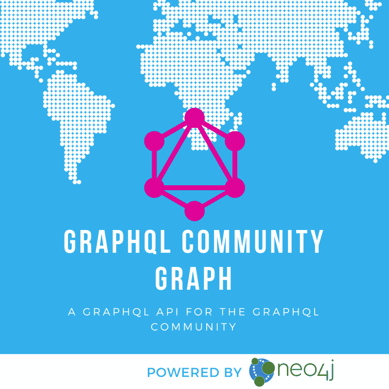
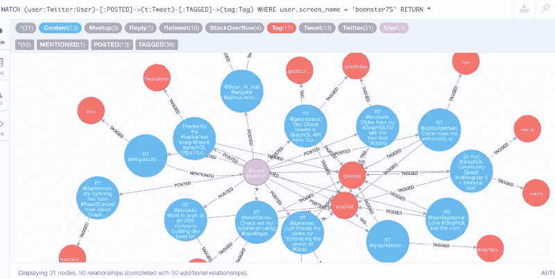
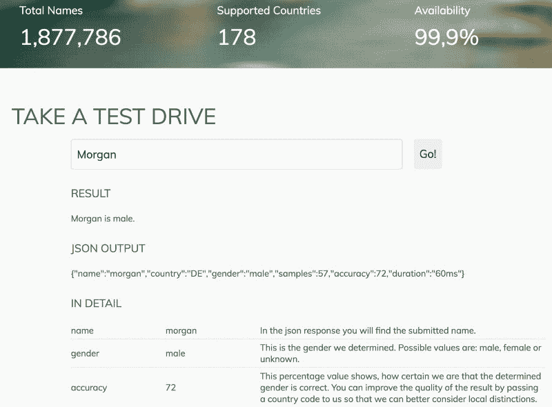

# 在 GraphQL 社区中发现优秀的女性工程师

> 原文：<https://www.freecodecamp.org/news/discovering-awesome-female-engineers-in-the-graphql-community-88ddf45e4ce1/>

迈克尔·亨格

# 在 GraphQL 社区中发现优秀的女性工程师

#### 我们社区图项目和性别 API 的一个有趣的应用

不久前，我看到佩吉的推特请求:

邦妮的冷淡回应温暖了我的心:

并引发了一个想法…

### 开发者社区活动数据

正如您可能知道的那样，我们通过将开发者导入到“社区图”中，在一个地方展示他们在社区(例如 GraphQL、Neo4j……)中令人印象深刻的参与度，从中获得了很多乐趣通常，你很难跟踪 Twitter、Slack、StackOverflow、GitHub 等网站上的一系列活动，以了解最新动态。尤其是当你的社区发展迅速的时候。

因此，我们挠了挠痒痒，并不断地将 Neo4j 社区的活动导入(通过 AWS Lambda)到一个单一的图形中，然后可以查询和可视化——在这里可以访问[。](https://github.com/community-graph/documentation)

我们对 **GraphQL 社区**做了同样的事情，因为他们的数据也可以通过 graph QL 和[在](https://github.com/neo4j-graphql/graphql-community)访问[。](http://graphql.communitygraph.org/)



GraphQL Community Graph

因此，由于我们的图形数据库中有 GraphQL 过去几个月的所有活动，我认为用它来回答 Peggy 的请求会很酷。

您可以使用“ **graphql** ”作为用户名和密码在这里:【http://107.170.69.23:7474/browser/】的[访问**只读**数据。](http://107.170.69.23:7474/browser/)

让我们看看能否在 Peggy 的 Twitter 帖子中找到一位活跃的女性(Bonnie Brennan ),她正在发关于 GraphQL 的推文，并显示她的推文及其标签。

*我们在这里使用 Neo4j 的查询语言[Cypher](http://neo4j.com/developer/cypher),**match**ASCII-art 模式“一个用户发布带有这些标签的推文”，然后将用户的 screen_name 绑定到‘bonnster 75’，然后**返回**我们找到的所有内容。*

```
MATCH (user:Twitter:User)-[:POSTED]->(t:Tweet)-[:TAGGED]->(tag:Tag)WHERE user.screen_name = 'bonnster75'RETURN *
```



### 决定性别

预测性别的一个简单方法是看名字。我知道这很不可靠，但我们只是在寻找建议，我们稍后会手动检查。那么网络的力量可以揭示进一步的候选人。


我谷歌了一下“性别 api ”,发现了这个网站,它看起来真的很不错，有 500 个免费的月请求和一个简单的 HTTP API。非常适合我的深夜(凌晨 3 点)目标。

我测试了几个符合佩吉要求的名字:
佩吉、邦妮、贝伦、罗宾、丹妮尔和摩根。不幸的是，只有几个人被推荐给她，所以我希望我能做得更好。

我在 gender-API 主页上使用了交互式名字检查，得到了这些结果。我不得不将国家改为“美国”，因为我的默认值(“DE”)没有 Robin 和 Morgan 的正确映射。



```
Peggy{"name":"peggy","country":"US","gender":"female","samples":3015,"accuracy":99,"duration":"51ms"}Bonnie{"name":"bonnie","country":"US","gender":"female","samples":3984,"accuracy":98,"duration":"25ms"}Morgan{"name":"morgan","country":"US","gender":"female","samples":5956,"accuracy":76,"duration":"33ms"}Belén{"name":"belén","country":"US","gender":"female","samples":35,"accuracy":97,"duration":"64ms"}Danielle {"name":"danielle","country":"US","gender":"female","samples":12284,"accuracy":99,"duration":"47ms"}Robin{"name":"robin","country":"US","gender":"female","samples":8088,"accuracy":83,"duration":"31ms"}
```

基于这个数据，我认为只看精度超过 75 的**和至少 10 个样本**的结果是有意义的。

可以这样使用 HTTP API:
`https://gender-api.com/get?key=<key>&country=US&name`= Peggy

### 社区图 Twitter 用户的性别检测

让我们对我们的社区图做同样的尝试:

1.  我们通过一个用户名列表来匹配 twitter 用户
2.  **将**的名字用空格分开，以**的第一个字**为名。
3.  然后我们**发送**给“gender-API”API(通过调用一个用户定义的过程)
4.  将结果作为 map- **值**返回。
5.  我们只想从用户节点返回一些属性。

```
MATCH (user:Twitter:User) WHERE user.screen_name IN ['bonnster75','peggyrayzis','okbel','morgancodes', 'robin_heinze','danimman']
```

```
WITH user, head(split(user.name," ")) as firstname
```

```
CALL apoc.load.json("https://gender-api.com/get?key=<key>&country=US&name="+firstname) YIELD value
```

```
RETURN user { .screen_name, .name, .followers, .statuses} as user_data, firstname, value;
```

这很有效。尽管摩根被推荐给了佩吉，但她还没有发微博，可能不会出现在我们的“最活跃”名单上。

```
user:  {"name":"Bonnie Brennan","screen_name":"bonnster75",        "followers":"467","statuses":"2831"}value: {"name":"bonnie","accuracy":"98","samples":"3984",        "country":"US","gender":"female"}user:  {"name":"Belén Curcio","screen_name":"okbel",        "followers":"3821","statuses":"35721"}value: {"name":"belén","accuracy":"97","samples":"35",        "country":"US","gender":"female"}user:  {"name":"Morgan Laco","screen_name":"morgancodes",        "followers":null,"statuses":null}value: {"name":"morgan","accuracy":"76","samples":"5956",        "country":"US","gender":"female"}
```

现在我们想找出在推特上发布 GraphQL 的最活跃的女性。一个“**分数**可以包含**的推文数量**，以及这些推文被**收藏、转发或回复**的频率。这就是我们在这里所做的，我们找到发布推文的用户，计算每个用户的分数，并返回按分数排序的前 500 名。

```
MATCH (u:Twitter:User)-[:POSTED]->(t:Tweet)WITH u, count(*) as tweets,      sum(t.favorites+size((t)<-[:RETWEETED|REPLIED_TO]-())) as scoreWHERE tweets > 5 AND tweets * score > 100RETURN u.name, u.screen_name, tweets, scoreORDER BY tweets * score DESC LIMIT 500
```

看看结果，这是有道理的:

```
╒══════════════════════╤═════════════════╤════════╤═══════╕│"u.name"              │"u.screen_name"  │"tweets"│"score"│╞══════════════════════╪═════════════════╪════════╪═══════╡│"Sashko Stubailo"     │"stubailo"       │"538"   │"1567" │├──────────────────────┼─────────────────┼────────┼───────┤│"Apollo"              │"apollographql"  │"150"   │"1389" │├──────────────────────┼─────────────────┼────────┼───────┤│"ReactDOM"            │"ReactDOM"       │"221"   │"596"  │├──────────────────────┼─────────────────┼────────┼───────┤│"KOYCHEV.DE"          │"K0YCHEV"        │"309"   │"341"  │├──────────────────────┼─────────────────┼────────┼───────┤│"Graphcool"           │"graphcool"      │"84"    │"859"  │├──────────────────────┼─────────────────┼────────┼───────┤│"adeeb"               │"_adeeb"         │"179"   │"328"  │├──────────────────────┼─────────────────┼────────┼───────┤│"ReactJS News"        │"ReactJS_News"   │"93"    │"517"  │├──────────────────────┼─────────────────┼────────┼───────┤│"Max Stoiber"         │"mxstbr"         │"102"   │"450"  │├──────────────────────┼─────────────────┼────────┼───────┤│"Caleb Meredith"      │"calebmer"       │"135"   │"273"  │├──────────────────────┼─────────────────┼────────┼───────┤│"Lee Byron"           │"leeb"           │"53"    │"652"  │
```

酷，现在我们可以合并我们的两个声明。为了节省一些重复的 API 调用，我只是在用户实体上存储性别信息(还有准确性和样本),以便我们以后可以重用它。

```
MATCH (u:Twitter:User)-[:POSTED]->(t:Tweet)// name has have at least 2 parts, and gender not yet retrievedWHERE u.name contains " " AND NOT exists(u.gender)
```

```
// compute the scoreWITH u, count(*) AS tweets,      sum(t.favorites+size((t)<-[:RETWEETED|REPLIED_TO]-())) AS scoreWHERE tweets > 5 AND tweets * score > 100
```

```
// top 500 usersWITH u, tweets, score, head(split(u.name," ")) as firstnameORDER BY tweets * score DESC LIMIT 500
```

```
// call gender apiCALL apoc.load.json("https://gender-api.com/get?key=<key>&name="+firstname) YIELD value
```

```
// set result values as propertiesSET u.gender = value.gender,     u.gender_meta = [value.accuracy,value.samples]
```

```
RETURN count(*)
```

因此，对于名称中带有空格的 500 个顶级帐户，我们通过 API 预测了性别。现在我们可以看看我们得到的数据，希望能找到一些我们可以推荐给佩吉的女性。

```
MATCH (u:Twitter:User)-[:POSTED]->(t:Tweet)WHERE u.gender = "female"   AND u.gender_meta[0] > 75 and u.gender_meta[1] > 10
```

```
WITH u, count(*) AS tweets,      sum(t.favorites+size((t)<-[:RETWEETED|REPLIED_TO]-())) AS scoreORDER BY tweets * score DESC LIMIT 50
```

```
RETURN u { .screen_name, .name, .followers, .following, .statuses} as user, tweets, score;
```

除了有趣的(Ruby Inside，Else if)和错误分类的(Jess，Brooke)之外，我们还在 GraphQL 社区中找到了一些以前没有被推荐的活跃女性: ****【lady leet，_ KarimaTounsya，thekamahele，lauralindal，thelamkin，eveporcello** 以及其他一些女性。**

**我手动查看了这些昵称，查看了这些推特资料，并为女性账户设置了一个复选标记 **√** 和一个**！**为新名字。**

**我们总共发现了 **22 名女性—** 如果你看看发关于 GraphQL 的推文的绝对人数，这当然不是很多，但这是一个开始，并有望快速增长。**

**现在我们有了清单，让我们好好利用它吧！如果你还没有在 Twitter 上关注她们，一定要看看这些有才华的活跃女性的工作。通过认可她们的贡献，我们可以**希望激励更多女性成为 GraphQL 社区的积极成员**并在未来发现更多的名字。**

****PS:** 我们从 [@graphqlweekly](http://twitter.com/graphqlweekly) 的策展人 Nikolas 处得知，我们的[“graph QL 中的本周”概览页](http://s3-eu-west-1.amazonaws.com/twigraphql/twigraphql.html)在他们编写每周简讯的过程中帮了大忙。它还有一个“Twitter 活动”标签，这应该也能帮助你找到可以关注的人。**

**我们也很高兴**向其他社区**提供社区地图服务，所以如果你感兴趣，请随时通过 devrel@neo4j.com[联系我们。](mailto:devrel@neo4j.com)**

****PPS:** 非常感谢 Peggy Rayzis 发起了这项引人入胜的活动，为这篇文章提供了非常有价值的反馈，并允许她发表。确保在[推特](https://twitter.com/peggyrayzis)和[媒体](https://medium.com/@peggyrayzis)上关注她。**