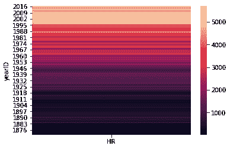
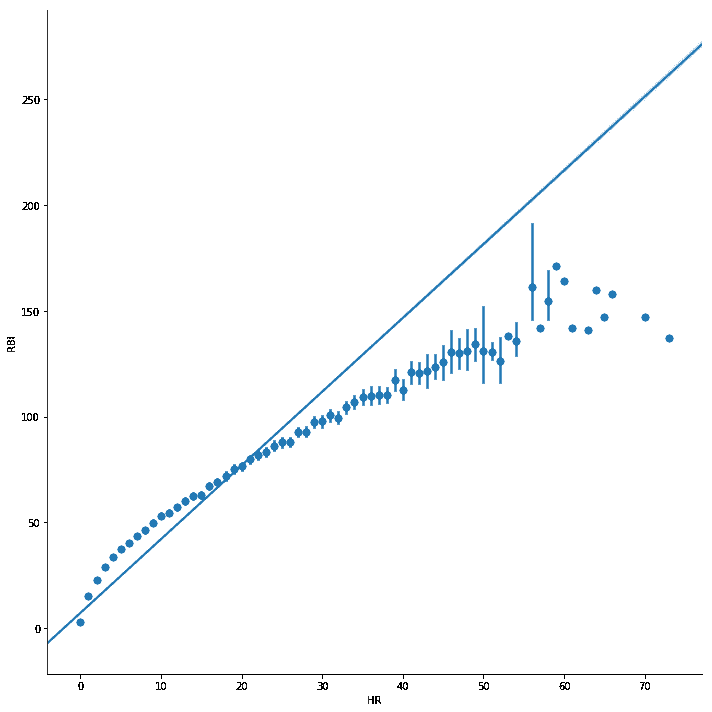
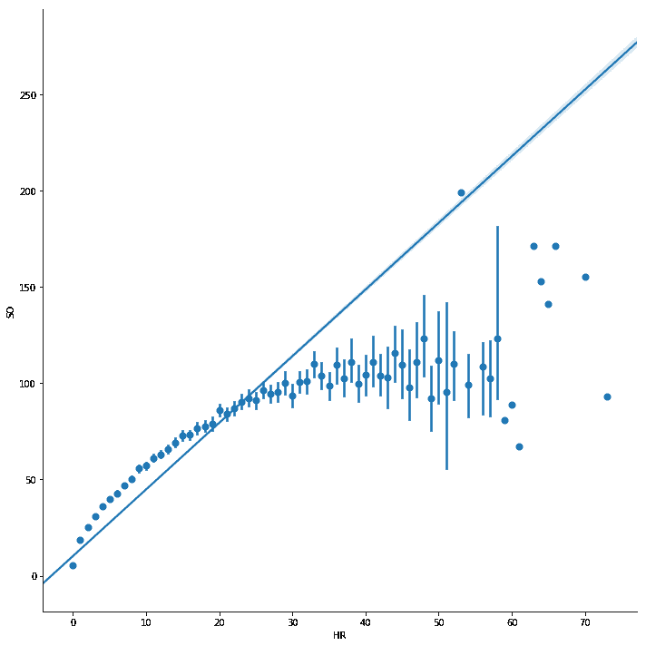
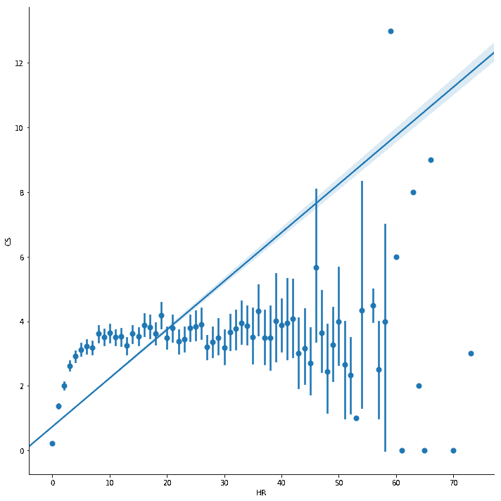
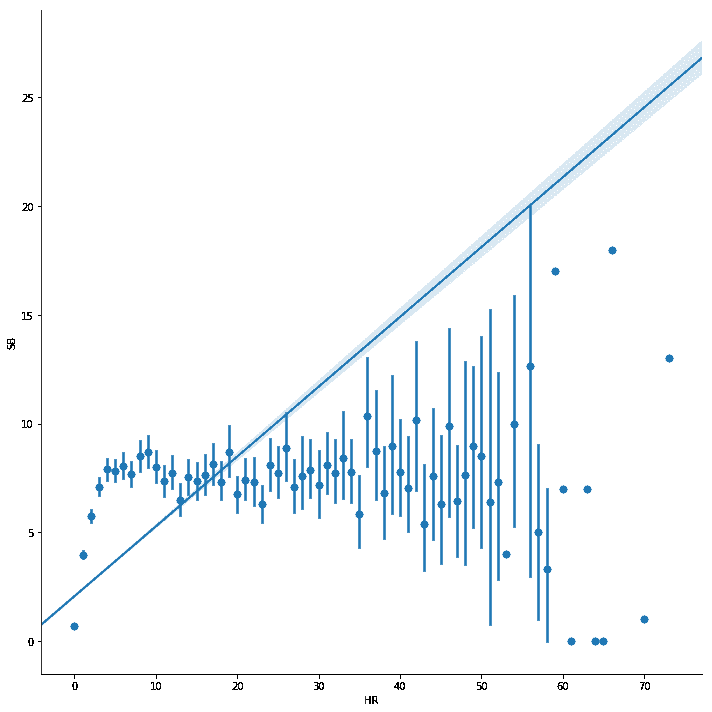

# 你如何利用数据发现棒球的秘密

> 原文：<https://www.freecodecamp.org/news/discovering-the-secrets-of-baseball-with-data-56f793852de0/>

by ?? Anton de Regt

# 你如何利用数据发现棒球的秘密


数据可以讲述很多故事，找到隐藏的秘密就像大海捞针。

在完成了我在 [Udacity](https://classroom.udacity.com/courses/ud170) 上的第一门数据分析课程后，是时候进行一个真实世界的项目了。

在这个项目中，我将探索棒球数据。更具体地说:1871 年至 2016 年期间所有球员的击球数据。你可以在这里下载整个数据集。

我的流程:

1.  先看一下数据
2.  提出一个问题
3.  争论数据
4.  探索数据
5.  得出结论/预测
6.  传达我的发现

我的目标是在数据中找到棒球的秘密，分享给你，让你学到东西，提高自己的球技。

[antonderegt/data-baseball](https://github.com/antonderegt/data-baseball/blob/master/Baseball%20Project.ipynb)
[data-baseball——Udacitygithub.com](https://github.com/antonderegt/data-baseball/blob/master/Baseball%20Project.ipynb)的最后一个项目

### 先看数据

第一步是导入数据集。首先，我将显示前五个条目，以了解我正在处理的内容。

```
import matplotlib.pyplot as pltimport numpy as npimport pandas as pdimport seaborn as sns%matplotlib inline
```

```
# Reading the batting datafilename = 'Batting.csv'batting_df = pd.read_csv(filename)
```

```
# Printing the first five entriesbatting_df.head()
```

```
# Getting some metrics on the home runs, number of games, runs batted in and the number of strikeoutsbatting_df[['HR','G', 'RBI', 'SO']].describe()
```

看上面的表格，似乎击球手在一个平均 51 场比赛的赛季中平均打出 2.8 个本垒打。

```
batting_df_groupedby_year = batting_df.groupby(['yearID']).sum()homeruns_per_year = batting_df_groupedby_year[['HR']]
```

```
# Plotting the heatmap in reverse order to make it easier to see the increasesns.heatmap(homeruns_per_year.iloc[::-1])
```



*Plotting the heatmap*

从上图可以看出，随着时间的推移，全垒打的数量在增加。在左边的 y 轴上你可以看到年份，在右边的 y 轴上你可以看到全垒打的次数。

### 问题

在数据将揭示它的秘密之前，我必须问它几个问题。以下是我可以向数据提问的一些问题示例:

1.  哪个队有最有效的击球手？
2.  三振出局和全垒打有关联吗？
3.  历史上谁是最好的偷球者(偷球被抓 vs 偷垒)？
4.  哪个地区生产最好的击球手(为此需要与另一个台合并)？
5.  不同性能指标之间的关系是什么？有没有什么强烈的消极或积极的关系？
6.  薪水最高的棒球运动员有什么特点？

我要关注的问题是:哪些指标相关，哪些不相关？

### 争论

```
# Displaying the batting data for the last ten yearsbatting_last_ten_years = batting_df.groupby(['yearID'], as_index=False).sum().sort_values(by='yearID', ascending=False).head(10)batting_last_ten_years
```

我使用的数据集已经非常干净了。我不必为了得到我需要的数据而争论不休。上面你可以看到过去 10 年的击球数据。

### 探索

在下一个代码块中，我将计算全垒打和所有其他指标之间的相关性。这样我们可以看到哪些指标有助于本垒打，哪些指标不利于本垒打得分。例如，我期望打更多比赛的击球手打出更多的本垒打。我也期待打点高的打者打出最多的全垒打。

两个值之间的相关性为 1 是完美的正相关。这意味着当两个值中的一个增加时，另一个也会增加。

相关性为-1 是负相关。这意味着当一个值增加时，另一个值减少。

当相关值变为零时，相关性非常小或不存在。根据相关性的强弱，我将正相关称为++或+-。无相关性将为 0，负相关性的范围将从-+、-或-为强负相关性。

```
def standardize(data):    return (data - data.mean()) / data.std(ddof=0)
```

```
def pearsons_r(x, y):    return (standardize(x) * standardize(y)).mean()
```

```
# It doesn't make sense to calculate the correlation between these values and home runsleave_out = ['playerID', 'yearID', 'teamID', 'lgID', 'HR']
```

```
# Meaning of the column names in the datadictionary = {'playerID':'Player', 'yearID':'Year', 'teamID':'Team', 'lgID':'League', 'HR':'Home Runs','stint':'Stints', 'G':'Games', 'AB': 'At Bats', 'R': 'Runs', 'H':'Hits', '2B':'Doubles', '3B':'Triples', 'RBI':'Runs Batted In', 'SB':'Stolen Bases', 'CS':'Caught Stealing', 'BB':'Base on Balls', 'SO':'Strikeouts', 'IBB':'Intentional Walks', 'HBP':'Hit by pitch', 'SH':'Sacrifice hits', 'SF':'Sacrifice flies', 'GIDP':'Grounded into double plays'}
```

```
strong_positive_correlation = []strong_negative_correlation = []
```

```
def correlations_for_hr(df):    columns = list(df)    for x in columns:        if x not in leave_out:            name_of_metric = dictionary[x]            r = pearsons_r(df['HR'], df[x])                        # Calculating the strenth of the correlation            correlation = ''            if r > 0.7:                correlation = '++'                strong_positive_correlation.append(name_of_metric)            elif r > 0.5:                correlation = '+ '            elif r > 0.3:                correlation = '+-'            elif r >= -0.3:                correlation = 'O '            elif r > -0.5:                correlation = '-+'            elif r > -0.7:                correlation = '- '            elif r > -1:                correlation = '--'                strong_negative_correlation.append(name_of_metric)                            print('{} Correlation between Home runs and {}:{}'.format(correlation, name_of_metric, "%.3f"%r))            print('-----------------------------------------')            print('Correlations:')print('-----------------------------------------------------')print(correlations_for_hr(batting_df))print('\n')
```

```
print('Positive correlations: {}'.format(strong_positive_correlation))print('\n')
```

```
print('Negative correlations: {}'.format(strong_negative_correlation))
```

输出:

```
Correlations:--------------------------------------------------------------------O  Correlation between Home runs and Stints: -0.065--------------------------------------------------------------------+  Correlation between Home runs and Games: 0.668--------------------------------------------------------------------+  Correlation between Home runs and At Bats: 0.695--------------------------------------------------------------------++ Correlation between Home runs and Runs: 0.729--------------------------------------------------------------------++ Correlation between Home runs and Hits: 0.703--------------------------------------------------------------------++ Correlation between Home runs and Doubles: 0.725--------------------------------------------------------------------+- Correlation between Home runs and Triples: 0.348--------------------------------------------------------------------++ Correlation between Home runs and Runs Batted In: 0.837--------------------------------------------------------------------O  Correlation between Home runs and Stolen Bases: 0.265--------------------------------------------------------------------+- Correlation between Home runs and Caught Stealing: 0.409--------------------------------------------------------------------++ Correlation between Home runs and Base on Balls: 0.731--------------------------------------------------------------------++ Correlation between Home runs and Strikeouts: 0.822--------------------------------------------------------------------++ Correlation between Home runs and Intentional Walks: 0.753--------------------------------------------------------------------+- Correlation between Home runs and Hit by pitch: 0.497--------------------------------------------------------------------O  Correlation between Home runs and Sacrifice hits: 0.064--------------------------------------------------------------------++ Correlation between Home runs and Sacrifice flies: 0.792--------------------------------------------------------------------++ Correlation between Home runs and Grounded into double plays: 0.767--------------------------------------------------------------------
```

```
Positive correlations: ['Runs', 'Hits', 'Doubles', 'Runs Batted In', 'Base on Balls', 'Strikeouts', 'Intentional Walks', 'Sacrifice flies', 'Grounded into double plays']
```

```
Negative correlations: []
```

### 回顾第一期望

还记得我的期望吗？我期望比赛的次数和打点分数与全垒打有正相关。根据我上面的计算，游戏的数量与皮尔逊的 R 为 0 . 668 成正相关。所以在一个赛季中打更多比赛的球员有更多的本垒打。这听起来很符合逻辑，因为打更多比赛的击球手有更多机会打出全垒打。

我的另一个期望是高打点意味着高本垒打数。全垒打和打点的相关度是 0.837！这也是很符合逻辑的，因为本垒打可以奖励球员最多的打点分数。

另一个有趣的事实是没有负相关。因此，当本垒打数量增加时，没有度量标准会降低。

```
# HOME RUNS vs. RUNS BATTED INsns.lmplot(size=10, data=batting_df[['HR', 'RBI']], x='HR', y='RBI', x_estimator=np.mean)
```



*HOME RUNS vs. RUNS BATTED IN*

上面的图表显示了全垒打与打点的关系。你可以看到 x 轴的本垒打数和 y 轴的打点点数。

```
# HOME RUNS vs. STRIKEOUTSsns.lmplot(size=10, data=batting_df[['HR', 'SO']], x='HR', y='SO', x_estimator=np.mean)
```



*HOME RUNS vs. STRIKEOUTS*

上面的图返回了一个有趣的相关性。是本垒打和三振出局的相关性。皮尔森的 R 相关性是. 822，几乎和全垒打和打点之间的相关性一样高。

我对这种相关性更感兴趣，因为打点是全垒打的直接结果。另一方面，三振出局与你失去全垒打的机会直接相关。三振出局究竟如何会导致更多的本垒打？

### 本垒打和三振出局有什么关系

为了解开这个谜团，我开始思考…也许那些更冒险的击球手更有可能打出全垒打。因为他们甚至在看起来很难击中的球上挥杆。所以，如果承担更多的风险会给你更多的本垒打，我看了一下风险指标。有风险的指标是涉及冒险的指标，比如偷垒。让我们来看看相关性。

```
# HOME RUNS vs. CAUGHT STEALINGsns.lmplot(size=10, data=batting_df[['HR', 'CS']], x='HR', y='CS', x_estimator=np.mean)
```



*HOME RUNS vs. CAUGHT STEALING*

上面你可以看到本垒打(x 轴)和跑垒员被抓到偷球的次数(y 轴)之间的相关性(. 409)。有模糊的关联，但不足以下结论。也许冒险者已经变得非常擅长偷垒，而且偷垒时不会被抓到？让我们看看盗垒。

```
# HOME RUNS vs. STOLEN BASESsns.lmplot(size=10, data=batting_df[['HR', 'SB']], x='HR', y='SB', x_estimator=np.mean)
```



*HOME RUNS vs. STOLEN BASES*

上面你可以看到 0.265 的本垒打(x 轴)和盗垒(y 轴)的相关性。这种相关性是不存在的。所以，冒险与打出全垒打无关。

数据本身并不能揭示打出全垒打的秘密。我需要了解更多关于棒球的知识来解开这个谜。我的下一个攻击计划是观看 YouTube 视频，看看高分击球手的表现如何。

事实证明，打出一个全垒打更多的是精细的计算，而不是冒险。我看到击球手在等待正确的投球。他们宁愿得到一个好球，希望下一次投球能给他们带来更好的结果。一个额外的好处是，当投手必须投更多的球时，他会累得更快。

### 结论/预测

对于想提高本垒打成绩的击球手，我有一些建议。获得更多本垒打的第一步是:多打比赛，不要找借口——打！第二步:三振出局。这听起来违背直觉，但它增加了你的本垒打数。它的工作方式是:吹灭投手，给击球手更多的时间等待最佳的投球来击中大满贯。

更多关于本垒打和三振出局之间的相关性，请阅读[这篇文章](https://www.mlb.com/news/anthony-castrovince-increasing-strikeout-totals-acceptable-if-a-batter-produces-offensively/c-47432098)。

或者这个关于疲惫的投手的风险

更多信息请看[ditisAnton.com](http://ditisanton.com)和[注册](https://goo.gl/mBggzD)我的每周时事通讯。