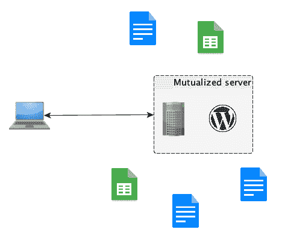
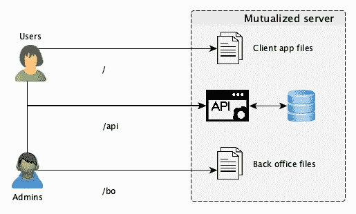
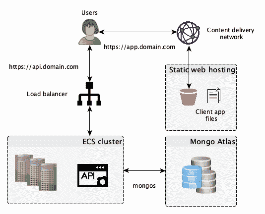
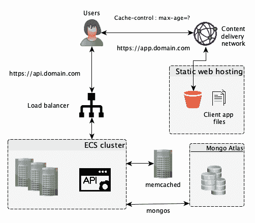
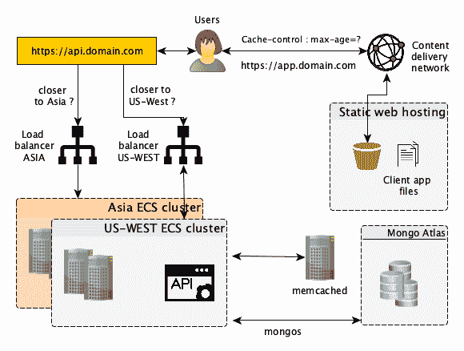

# 分布式系统:何时应该构建它们，以及如何扩展。循序渐进的指南。

> 原文：<https://www.freecodecamp.org/news/distributed-systems-when-you-should-build-them-and-how-to-scale-a-step-by-step-guide-37e76a177218/>

我总会想到，有多少初级开发人员在开始创作产品时，正遭受着“冒名顶替综合症”的折磨。

我明白了，有许多令人震惊的**例子**顶级公司**拥有难以置信的复杂分布式系统，可以处理**数十亿个请求**，优雅地升级数百个应用程序而不停机，在几秒钟内从灾难中恢复，每 60 分钟发布一次，在世界任何地方都有光速响应时间。**

当你开始你的项目时，这些期望可能会令人难以承受。但是正如你们中的许多人已经知道的，这些公司中的大多数都是从**最小可行系统**和**非常差的技术栈**开始的。原因很简单:他们开始的时候不需要它。花更多的时间设计你的系统而不是编码实际上可能会导致你失败。

本文是一篇**循序渐进**如何指导。我将向您展示，在 Visage，我们如何从有史以来最小的系统开始，构建一个基本的高可用性可伸缩分布式系统。这是一个真实的**案例研究**来**去除**你的**情结**如果你从来没有机会自己做的话。

我刚到 [Visage](https://www.visage.jobs) 当 CTO 的时候，我是唯一的工程师。我对技术堆栈一无所知，但我加入了，因为我真的很喜欢这个想法，即能够在没有内部招聘人员或人力资源服务的情况下，在 T2 招聘 T4 员工。这是 Visage 背后的核心理念:**众包**由许多无形的招聘人员提供动力，他们在**人工** **智能**的协助下，一起为你的角色工作，在几天内为你寻找最合适的人才。然后你直接跟他们接洽，不用中间人。

众包中的**人群**瞬间触发了我的工程大脑:将会有**很多人**，同时在**工作**，期待**来自**世界任何地方**的良好表现**。我喜欢挑战。

但就体制而言，事情是**坏**、**实**、**坏**。这是我到达时的发现:

*   一个被入侵的 Wordpress 实例运行数百个过时的有缺陷的插件，运行在一个共享服务器的虚拟机上
*   受损的邮箱
*   一大堆谷歌文档和电子表格。

这是完全正常的。同样，团队中没有技术成员，我一直期待这样的事情。尽管如此，该团队还是专注于一个商业机会，并让产品看起来像是****神奇地工作了**，同时手动完成所有工作！(假装直到你做出来)。这才是真正令人惊奇的地方。**

**

Our first system (Yes, it sucked but it did the job) !** 

**毫不奇怪，我的第一个任务是重新创建虚拟机，重新安装更新的 Wordpress 版本，确保每个人都更改了密码，建立了密码策略，并删除了公司电脑上的几十个恶意软件……但让我们继续讨论系统问题。**

### **从 Wordpress 到 web 应用程序**

**当你开始构建一个产品时，你首先要关注的是数据。数据是驱动你的**公司价值的**。这将是你每天用来做决定的东西，也是你向你的**投资者**展示**进展**的东西。**

**你需要理解你的数据，从不同的来源以不同的格式获取数据将会是对时间的巨大浪费。在很多情况下，Wordpress 是一个非常好的选择，因为它节省了大量的工程时间，但是为了满足他们的需求，Visage 团队不得不安装不再维护的花哨插件。因此，我们无法控制生成的数据模型，不适合该模型的数据分散在几十个文档和电子表格中。**

**因此，除非有一种产品已经满足了你 90%的需求，否则考虑一种**理想数据模型**和**设计**和**实现**一种最小可行产品(MVP ),它将能够保存你所有的数据。**

**然后想 **API** 。你的应用程序必须有一个 API，当你最终出售它时，这将是至关重要的。不要立即向上扩展，而是在编码时考虑可伸缩性。尽可能让你的 API **无状态**和 **RESTful** ，因为每个人都希望能够使用标准的 HTTP 方法查询它。**

**在我们的例子中，我们选择了 **NodeJS** ，因为我们的大部分代码只是处理输入和输出。NodeJS 是**非阻塞**，自带一个方便设计 API 的库: **ExpressJS** 。**

**如果你需要一个面向客户的网站，你有几个选择。首先，您可以在应用服务器中创建一个层来生成您的页面，或者您可以构建一个由静态 web 托管服务器提供服务的**单页 Javascript** 应用程序。**

**在 Visage，我们选择了第二个选项，决定为**用户**和**管理员分别创建一个应用程序。**这只是因为我们对用户的期望比我们对管理员的期望要大得多，并且希望保持两个代码库**简单**(也是为了以后 **CORS** 的考虑)。这是我们系统的样子:**

**

All data in one place** 

### **尽早委派敏感数据存储**

**除非对您的业务至关重要，否则没有理由将敏感的个人数据存储在您的系统中。安全性是一件复杂的事情，如果你每天都在修改你的代码，直到你发现你的产品适合市场，它就会崩溃。假设**任何心怀不轨的人都可以破坏您的应用程序**，如果他们真的想这么做的话。**

**这里的关键是不要持有任何对黑客来说容易取胜的数据。没人会抢没钱的银行。如果你正在设计一个 SaaS 产品，你可能需要认证和在线支付。有很多**第三方**你可以与之整合，他们会以一种比你可能做到的更好的方式来处理这个问题。**

**例如, [Auth0](https://auth0.com/) 是最知名的处理认证的第三方。 [Stripe](https://stripe.com/fr) 也是网上支付的好选择。他们将**奉献他们所有的**资源和这个星球上最好的**安全**工程团队来保护你的**数据安全**——否则他们就没有生意。**

**

Actual sign on a car in San Francisco** 

### **云服务是你最好的朋友**

**因此，在这一点上，我们有了一种方法来存储我们所有的数据、身份验证、在线支付和一个客户可以使用的 web 应用程序，以及一个我们可以针对不同的使用情形销售给合作伙伴的 API。我们的用户群在增长，很明显，他们希望能够随时访问该应用程序。所以是时候考虑一下**可扩展性**和**可用性**了。**

**我们依赖于一台服务器，但它只能处理这么多的请求，更换服务器或发布新版本将意味着在发布期间关闭应用程序。我们接下来的工作重点是:**负载平衡**、**自动扩展**、**日志记录**、**复制**和**自动备份**。当然，如果你是公司里唯一的工程师，试图独自解决所有这些问题是完全疯狂的。**

**幸运的是，我们生活在一个时代，一个全面发展的工程师可以使用云服务，如亚马逊网络服务、T2 谷歌云服务、T4 Azure 或 T5，在几天内轻松构建这样一个系统。我们决定将我们的系统转移到 **AWS** 上，因为那时它是最完整的解决方案，我们有 2 年的免费积分。**

**这就是为什么我在这篇文章中主要谈论 AWS 解决方案，但在其他平台上也有等效的服务。这也是我们选择开始在 **Docker** **containers** 中运行我们的模块的时候，因为许多不同的其他原因将不会在本文中讨论(您可以查看本文以了解更多信息:[https://medium . freecodecamp . org/Amazon-fargate-goodbye-infra structure-3b 66 c 7 e 3 e 413](https://medium.freecodecamp.org/amazon-fargate-goodbye-infrastructure-3b66c7e3e413))。**

**您决定如何运行您的应用程序实际上取决于您的用例，比如您需要的**灵活性**与您可以花费在管理基础架构上的**时间**。**

**答案没有好坏之分。**

**你可以选择将你所有的模块打包，使用一个**容器** **管理** **系统**，比如 AWS 的 ECS/EKS 或者 GCP 的 Kubernetes 引擎。如果没有，并且您不想自己处理自动伸缩和负载平衡之类的事情，您可以使用 Elastic Beanstalk 或 App Engine。**

**如果你想完全无服务器化，你也可以结合使用 Lambda 函数和 API Gateway。我们决定参加 **ECS。**我们在 3 个可用性区域部署了 3 个实例，一个**负载均衡器**，根据 CPU 使用情况设置**自动伸缩**，将我们所有容器的日志与 **Cloudwatch** 集成，并设置指标来观察**错误**、**外部调用**和 **API 响应时间**。**

**

High Availability: Did you know that Giraffes almost never sleep ? **99% uptime**** 

**对于我们的数据库，我们使用 MongoDB，因为我们的模型非常适合 NoSQL 数据库，并且具有高一致性。我们决定利用 **MongoDB Atlas** 并部署 3 个副本来实现高可用性。在其他服务中，Atlas 提供了**自动扩展**、**自动备份**，并允许您在发生灾难时无缝地回到**。****

**我们还决定将我们所有的静态 web 文件托管在 S3，并使用 T2 的 Cloudfront 作为 T4 的 CDN，这样我们的 JS 应用程序可以在世界任何地方快速加载，并根据需要提供多次服务。 **Cloudfare** 也是一个不错的选择，提供开箱即用的 DDOS 保护。**

**为了简单起见，我们决定使用 53 号路由作为我们的域名，所有域名都使用他们的域名服务器。这是我在 AWS 上最喜欢的服务之一。这让你的生活变得简单多了。每当你想通过域名提供服务时，无论是 **EC2** 实例、**弹性 IP** 、负载均衡器、Cloudfront **分发版**还是任何真正的、私人的或公开的服务，都要花费你几分钟的时间，因为它与所有其他服务集成得非常好。**

**再加上**证书管理器**，它可以让你在几分钟内免费获得 **SSL 证书**(包括通配符)，并通过勾选一个框将它们部署在你所有的服务器上，你就有了在你所有的模块上启用 **HTTPS** 的最快最可靠的方法。再见“让我们加密”SSL 证书，我不得不每 3 个月左右更新并安装在我的服务器上？。**

**

Starting to look decent** 

### **决定缓存策略**

**每个人都讨厌缓存管理，缓存可能发生在许多不同的层，与缓存相关的问题很难重现，并且是调试的噩梦。**

**不幸的是，分布式系统的**性能**严重依赖于**良好的缓存策略**。有很多关于好的缓存策略的好文章，所以我就不赘述了。要知道，如果你的**静态网页** **资源**非常多，你可能会想通过巧妙地使用缓存控制头来利用用户的浏览器缓存。**

**如果你的用户面对的页面在应用服务器上一遍又一遍地生成，那么使用一个缓存代理，比如 **Squid** 。但最重要的是，您很有可能会一遍又一遍地向数据库发出相同的请求。为了降低您的数据库负载并节省数据传输时间，使用一个像 **memcached** 这样的**内存对象缓存系统**，用于那些频繁使用而很少更新的对象**。****

**我们开始考虑使用 **memcached** ，因为我们经常一遍又一遍地要求相同的候选人资料和工作机会。在内存优化的机器**上实现它，当我们平均一天中所有请求的响应时间时，我们的 API **性能**提高了超过 **30%** 。Memcached 也是分布式的，所以它可以在不同的服务器上运行，但仍然像一个大内存空间一样存储对象。****

**

cache, cache everywhere** 

### **位置，位置，位置**

**现在我们有了一个分布式系统，它没有单点故障(如果你考虑 AWS **ELBs** 和 T4 分布式 memcached)，并且可以自动伸缩。我们还使用**缓存**来最小化网络数据传输。看起来不错。在这一点上，你可能想**审计你的第三方**，看看他们是否会像你一样承担这个负担。**

**但是，我们的一些用户仍然抱怨这个应用对他们来说有点慢，尤其是当他们上传文件的时候。事实上，即使我们的静态 web 文件被缓存在世界各地(感谢 CDN)，我们所有的应用服务器只部署在美国西部。来自**东亚**的用户经历了**更多的延迟**，尤其是对于大数据传输。**

**解决方案很简单:**在亚洲的**新区域**部署**完全相同的 ECS 集群以及新的负载平衡器，并依靠 Route 53 **地理邻近路由**将用户路由到“最近”的负载平衡器。MongoDB **Atlas** 还允许您跨 **区域**部署您的副本**，因此不需要额外的工作。****

**

And here we are ! Our distributed system is ready.** 

### **结论**

**虽然你在这里看到的分布式系统在这篇文章中已经被**简化了**，但是我们还是检查了你在很多现代 web 应用程序中最有可能看到的部分。其他相关但未涉及的主题有微服务架构、文件存储和加密、数据库分片、调度任务、异步并行计算……可能会在下一篇帖子中介绍！**

**我的主要观点是:**在你开始**你的产品的时候，不要试图建立完美的系统。你的大部分设计选择将由你的产品做什么和谁在使用它来决定。你只会知道，当你的产品达到市场适合度，并开始对你的用户群有一个好的了解时，这可能需要几个月，甚至几年。**

**专注于**弄清楚人们需要什么**，并尝试提出解决他们问题的方案，即使它有很多**手动步骤**。然后想办法**自动化**，花时间**编码**和**销毁**，在有意义的地方使用**第三方**。**

**不要扩展，但要始终为扩展而思考、编码和计划。一步一步地构建您的系统**，不要基于尚未成熟的特性来解决系统设计问题，最后，总是要尝试在您将花费的时间和性能、金钱以及降低的风险之间找到最佳的**权衡**。****

****如果您喜欢这篇文章，并发现其中有任何有用的内容，请点击“鼓掌”按钮，关注我以获取更多的架构和开发文章！？****