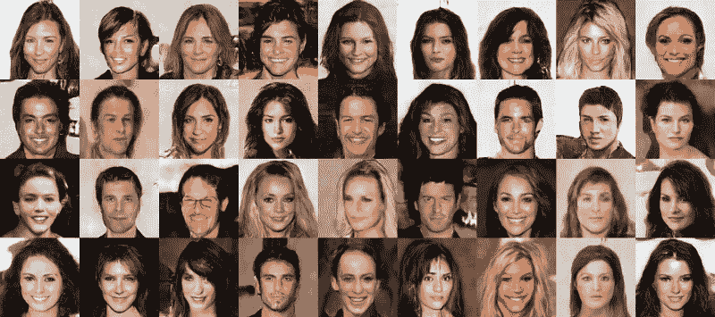
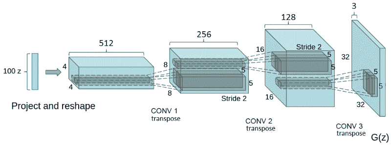
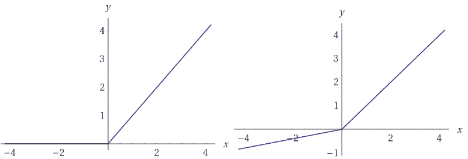
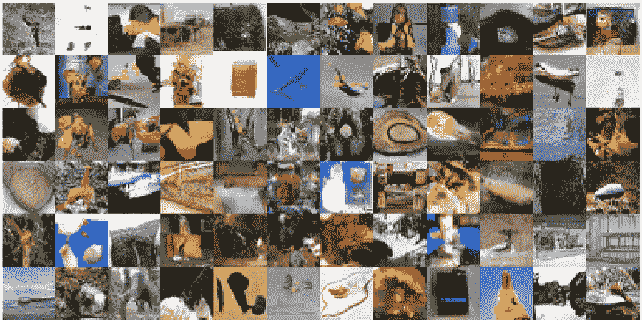
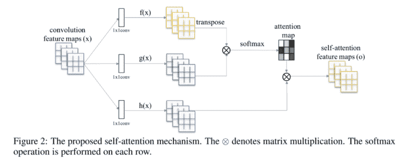
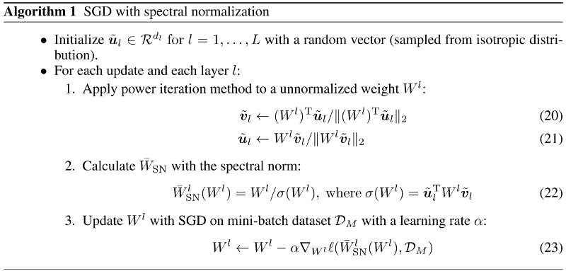
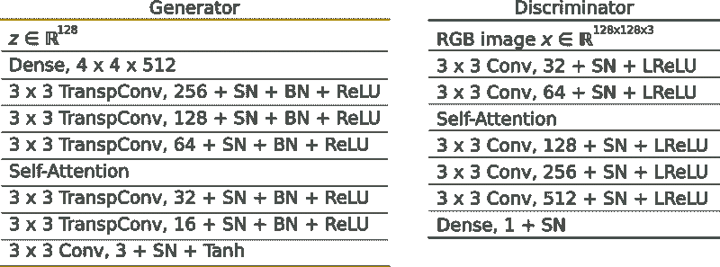
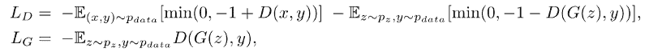
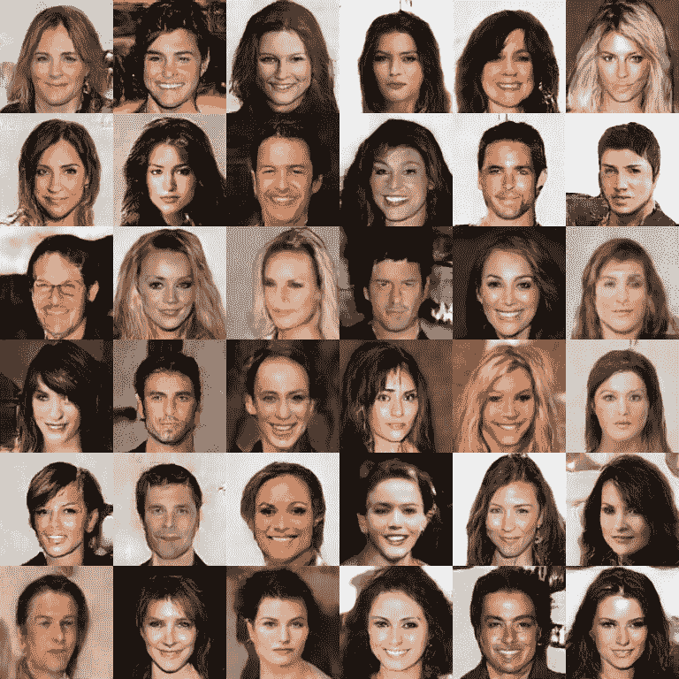

# 一头扎进高级 GANs:探索自我注意和光谱规范

> 原文：<https://www.freecodecamp.org/news/dive-head-first-into-advanced-gans-exploring-self-attention-and-spectral-norm-d2f7cdb55ede/>

泰勒·席尔瓦

# 一头扎进高级 GANs:探索自我注意和光谱规范



最近，生成模型吸引了很多关注。这其中很大一部分来自于生成性对抗网络(GANs)。由 Goodfellow 等人发明的 GANs 是两个玩家相互竞争的框架。发生器 **G** 和鉴别器 **D、**这两个角色都由函数逼近器表示。而且，他们在游戏中扮演着不同的角色。

给定一个训练数据 **Dt** , **G** 创建样本，试图模仿来自与 **Dt** 相同概率分布的样本。

**D** 则是常见的二元分类器。它有两个主要工作。首先，它对其接收的输入是来自真实数据分布( **Dt** )还是来自生成器分布进行分类。此外， **D** 还指导 **G** 通过传递给 **G** 其渐变来创建更真实的样本。事实上，从 **D** 获取梯度是 **G** 优化其参数的唯一方法。

在这个游戏中， **G** 将随机噪声作为输入，生成一个样本图像`Gsample`。该样本旨在最大化使 **D** 将其误认为来自真实训练集 **Dt** 的概率。

在训练过程中，有一半时间 **D** 接收来自训练集**Dt**的图像。另一半时间， **D** 从发电机网络— `Gsample`接收图像。 **D** 被训练为将正确的类别标签分配给两者的概率最大化:真实图像(来自训练集)和虚假样本(来自 **G** )。最终，我们希望这个游戏能找到一个均衡——纳什均衡。

在这种情况下， **G** 将捕获数据概率分布。而 **D** 反过来就无法分辨样品的真假。

在过去的几年中，gan 已经被用于许多不同的应用中。其中包括:生成合成数据、图像绘制、半监督学习、超分辨率和文本到图像的生成。

然而，最近对 GANs 的研究主要集中在开发稳定训练的技术上。事实上，众所周知，GANs 在训练期间是不稳定的，并且对超参数的选择非常敏感。

在这种情况下，这篇文章概述了两个相关的技术，以改善甘油脂。具体来说，我们旨在描述提高 **G** 样品质量的最新方法。为了做到这一点，我们在最近的论文中探讨了两种技术:[自我关注生成对抗网络](https://arxiv.org/abs/1805.08318)。

所有用 Tensorflow Eager execution API 开发的代码都可以在[这里](https://github.com/sthalles/blog-resources/tree/master/sagan)获得。

我这里有更深入的[对 GANs 的介绍](https://medium.freecodecamp.org/an-intuitive-introduction-to-generative-adversarial-networks-gans-7a2264a81394)。

### 卷积 GANs

[深度卷积 GAN](https://arxiv.org/abs/1511.06434) (DCGAN)是图像生成 GAN 成功的重要一步。DCGANs 是 ConvNets 的一个家族，它施加某些架构约束来稳定 GANs 的训练。

在 DCGANs 中， **G** 由一系列转置卷积运算组成。这些操作接受随机噪声向量 **z** ，并通过逐渐增加其空间维度同时减少其特征体深度来对其进行变换。



Credit: [Unsupervised Representation Learning with DCNNs](https://arxiv.org/abs/1511.06434).

DCGAN 引入了一系列架构指南，目标是稳定 GAN 训练。它提倡使用交错卷积，而不是合用层。此外，它对生成器和鉴别器网络都使用批量归一化(BN)。最后，它在发生器中使用 ReLU 和 Tanh 激活，在鉴别器中使用泄漏 ReLU。

让我们来谈谈其中的一些准则。

**批处理规范的工作原理是将一个图层的输入要素归一化，使其平均值和单位方差为零**。BN 对于让更深层次的模型工作而不陷入**模式崩溃**至关重要。模式崩溃是指 **G** 产生多样性非常低的样本的情况。换句话说， **G** 为不同的输入信号返回外观相同的样本。此外，BN 有助于处理由于参数初始化不佳而导致的问题。

此外，DCGAN 在鉴别器网络中使用泄漏 ReLU 激活。**与常规 ReLU 功能不同，泄漏 ReLU 允许负值的小梯度信号通过**。因此，它使来自鉴别器的梯度更强地流入发生器。对于负值，它不是在反向推进过程中传递 0 的梯度(斜率),而是传递一个小的负梯度。



ReLU function (right). Leaky ReLU (left). Different from ReLUs, the derivative of a negative value, on the leaky ReLU function, is non-zero.

DCGANs 引入的架构指导方针仍然存在于最近的模型设计中。然而，大部分工作集中在如何使 GAN 训练更加稳定。

### 自我关注 GANs

生成对抗网络的自我关注就是这样一种设计。最近，注意力技术已经被成功地应用在机器翻译等问题上。自我关注的 GANs 有一个架构，允许 **G** 对长程依赖进行建模。关键的想法是使 **G** 能够生产带有全球详细信息的样品。

如果我们看一下 DCGAN 模型，我们会发现常规的 GAN 在很大程度上基于卷积。这些操作使用局部感受域，卷积核，来学习表示。卷积具有非常好的性质，例如参数共享和平移不变性。

一个典型的深度通信网络以一种**分层的方式**学习表示。对于常规的图像分类 ConvNet，像边缘和拐角这样的简单特征是在前几层中学习的。然而，ConvNets 能够使用这些简单的表示来学习更复杂的表示。**简而言之，ConvNets 学习用更简单的表示法表达的表示法**。因此，长距离依赖性可能很难学习。

事实上，它可能只适用于低分辨率的特征向量。问题是，在这种粒度下，信号丢失的数量会使模拟远程细节变得很困难。

看看这些样本图像:



*Credits: [Unsupervised Representation Learning with DCNNs](https://arxiv.org/abs/1511.06434).*

这些图像来自在 ImageNet 上训练的 DCGAN 模型。正如[自我关注 GANs](https://arxiv.org/abs/1805.08318) 所指出的，大部分没有展示复杂形状的图像内容看起来都很好。换句话说，GANs 通常对建模像天空或海洋这样的非结构化内容没有问题。

尽管如此，创造几何形状复杂的形体，如四条腿的动物，却更具挑战性。这是因为复杂的几何轮廓需要长距离的细节，卷积本身可能无法掌握。这就是注意力发挥作用的地方。

这个想法是从一个更广阔的特征空间给 **G** 信息，而不仅仅是卷积核范围。通过这样做， **G** 可以创建具有精细分辨率的样本。

### 履行

一般来说，给定卷积层 **L** 的输入特征，第一步是以三种不同的表示来变换 **L** 。我们用 **1x1** 卷积 **L** 得到三个特征空间: **f** 、 **g** 和 **h** 。

这里我们用 **f** 和 **g** 来计算关注度。为此，我们使用矩阵乘法线性组合 **f** 和 **g** 。结果被输入到 softmax 层。



*Credits: [Self-Attention GANS](https://arxiv.org/abs/1805.08318).*

得到的张量与 **h** 线性组合，最后由**γ**缩放。**注意**伽马从 0 开始。

在训练的开始，gamma 取消了注意力层。因此，网络仅依赖于来自常规卷积层的本地表示。然而，随着伽马接收梯度下降更新，网络逐渐允许来自非本地场的信号通过。

此外，注意特征向量 **f** 和 **g** 相对于 **h** 具有不同的维度。事实上， **f** 和 **g** 使用的卷积滤波器比 **h** 少八倍。

这是自我关注模块的完整代码:

### 光谱归一化

之前， [Miyato 等人](https://arxiv.org/abs/1802.05957)提出了一种归一化技术，称为**光谱归一化** (SN)。简言之，SN 限制了卷积滤波器的 Lipschitz 常数。作者使用 SN 作为稳定训练 **D** 网络的方法。在实践中，效果非常好。

然而，当训练标准化的 **D** 时，有一个基本问题。先前的工作已经表明，规则化的 **D** 使 GAN 训练变慢。出于这个原因，一些变通办法包括在 **G** 和 **D** 之间不均匀的更新步骤速率。换句话说，在更新 **G** 之前，我们可以更新 **D** 几次。例如，一个规则化的 **D** 可能需要五个或更多的更新步骤用于一个 **G** 更新。

为了解决学习速度慢和更新步骤不均衡的问题，有一种简单而有效的方法。**需要注意的是**在 GAN 框架中， **G** 和 **D** 一起训练。在此背景下， [Heusel 等人](https://arxiv.org/abs/1706.08500)在 GAN 训练中引入了双时标更新规则(TTUR)。它包括为优化 **G** 和 **D** 提供不同的学习率。

这里， **D** 以比 **G** 大四倍的学习率进行训练——分别为 0.004 和 0.001。更大的学习速率意味着 **D** 将吸收更大部分的梯度信号。因此，较高的学习速率缓解了正则化 **D** 学习缓慢的问题。此外，这种方法使得对 **G** 和 **D** 使用相同的更新速率成为可能。事实上，我们在 **G** 和 **D** 之间使用 1:1 的更新间隔。

此外，[本文](https://sthalles.github.io/advanced_gans/Retrieved)已经表明，条件良好的发电机与 GAN 性能有因果关系。鉴于此，[对 GANs](https://arxiv.org/abs/1805.08318) 的自我关注也建议使用 SN 对发电机网络进行稳定训练。对于 **G** ，光谱归一化防止参数变得非常大，并避免不必要的梯度。

#### 履行

**需要注意的是**由[宫藤等人](https://sthalles.github.io/advanced_gans/#2)介绍的 SN 算法是一种**迭代逼近**。它定义了，对于每个层 W，用于正则化每个卷积层 **W** 的谱范数是 **W** 的最大奇异值。

然而，在每一步应用奇异值分解可能会增加计算量。相反， [Miyato 等人](http://arxiv.org/abs/1802.05957)使用**幂迭代法**来估计每层的 SN。

为了在 Keras 层中使用 Tensorflow eager execution 实现 SN，我们必须下载并调整 [convolutions.py](https://github.com/keras-team/keras/blob/master/keras/layers/convolutional.py) 文件。完整的代码可以访问[这里](https://github.com/sthalles/blog-resources/blob/master/sagan/libs/convolutions.py)。下面我们展示算法中有趣的部分。

首先，我们随机初始化向量`u`如下:

```
self.u = K.random_normal_variable([1, units], 0, 1, dtype=self.dtype)
```

如下面的算法 1 所示，幂迭代法计算**L2**——向量 **u** 和卷积核 **Wi** 的线性组合之间的距离。此外，SN 是基于未标准化的核权重计算的。



注意，在训练期间，在幂迭代中计算的ũ的值被用作下一次迭代中 **u** 的初始值。该策略允许该算法仅使用一轮幂迭代就获得非常好的估计。此外，为了归一化核权重，我们将它们除以当前的信噪比估计。

### 培训详情

我们使用 SN 和自我关注训练了一个定制版本的 SAGAN 模型。我们使用了 Tensorflow 的`tf.keras`模块和急切执行 API。

**G** 取一个随机向量 **z** 生成 128x128 的 RGB 图像。包括致密层在内的所有层都使用 SN。此外， **G** 使用批量标准化和 ReLU 激活。此外，它在中高特征图之间使用自我注意。与最初的实现一样，我们将注意力图层放置在尺寸为 32x32 的要素地图上。

**D** 也使用光谱归一化(所有图层)。它获取大小为 128x128 的 RGB 图像样本，并输出未缩放的概率。它使用 alpha 参数为 0.02 的泄漏 ReLUs。像 **G** 一样，它有一个自我关注层，用 32x32 尺寸的特征地图操作。



目标是最小化铰链版本的对抗性损失。为此，我们使用 Adam Optimizer 以交替的方式训练了 **G** 和 **D** ，共 200 个训练步骤。



对于这个任务，我们使用了[大规模名人面孔属性(CelebA)](http://mmlab.ie.cuhk.edu.hk/projects/CelebA.html) 数据集。

这些是结果。



感谢阅读！


最初发布于 [sthalles.github.io](https://sthalles.github.io/advanced_gans/) 。