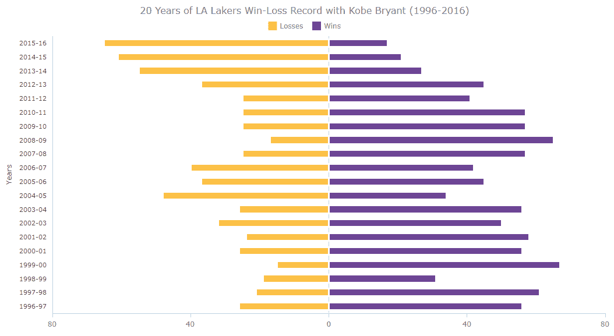
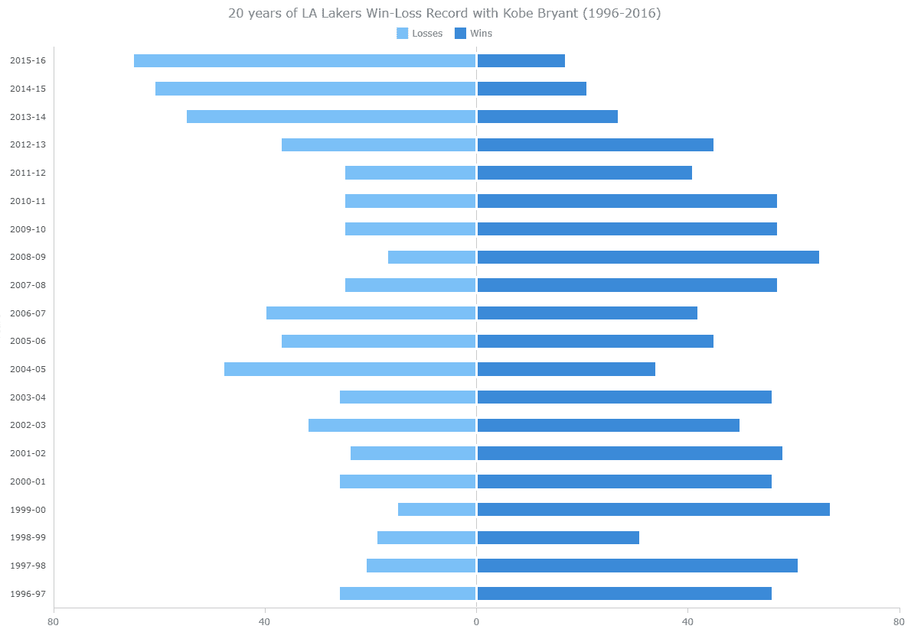
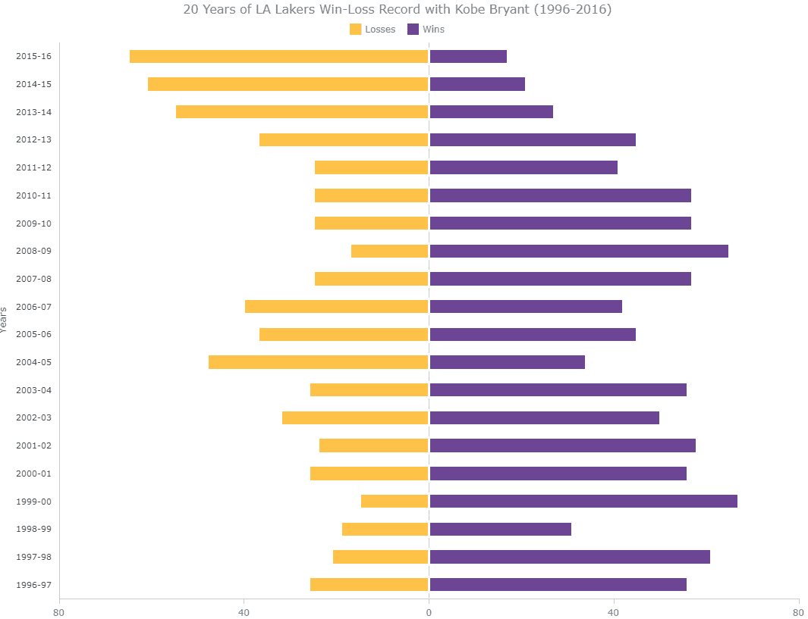

# 如何用 JavaScript 图表库创建发散条形图

> 原文：<https://www.freecodecamp.org/news/diverging-bar-chart-javascript/>

本文是一个循序渐进的指南，将向您展示如何构建一个交互式的 JavaScript 范围图，可视化 20 年来洛杉矶湖人队与科比·布莱恩特的表现。

出于显而易见的原因，2020 年是相当令人心酸的一年。但是，即使在疫情之前，这一年也是以篮球传奇人物科比·布莱恩特的去世而开始的。他是一名 NBA 明星运动员，已经为一支也是唯一一支球队——洛杉矶湖人队效力了 20 年。

在那次可怕的撞车事故一年后，我想起了科比，我想知道在他的二十年时代，湖人队表现如何。因此，在纯 JavaScript 的帮助下，我在一个交互式的发散条形图中可视化了它。

考虑到这个项目可能对那些网络制图新手有所帮助，我也记录了整个过程并制作了一个教程。看看吧！

## 什么是发散条形图？

首先，我会给你一个简单的解释，什么是背离条形图，然后我们将进入教程。

发散条形图显示两个或多个度量值，这些度量值从中间基线开始绘制，向左右(水平范围条)或上下(垂直范围列)延伸。

在这种分叉图表中，数据可视化的关键点是通过在分叉中点显示多个类别来促进多个类别的比较。

在本教程中，我使用发散条形图技术来展示洛杉矶湖人队在科比 20 年职业生涯中的胜败。

这里先来看一下最终的图表，让你为游戏的开始做好准备！跟随我学习如何用 JavaScript 创建这个漂亮的范围条形图。



## 如何用 4 个基本步骤构建一个 JavaScript 分叉条形图

有[多个](https://en.wikipedia.org/wiki/Comparison_of_JavaScript_charting_libraries) JavaScript 库为常用函数提供预写的 JS 代码，可以使交互式数据可视化过程变得非常快速和简单。

我选了一个叫做 [AnyChart](https://www.anychart.com) 的来创建这个发散条形图。这个 JS 图表库似乎支持开箱即用的范围图(在这种情况下特别有用),并且足够灵活，可以做我想做的事情。

此外，即使对于初学者来说，开始使用 AnyChart 也非常容易，因为有许多现成的例子，并且它有大量的[文档](https://docs.anychart.com)。

当然，在 web 上可视化数据时，拥有良好的 HTML 和 JavaScript 技能会给您带来优势。但是无论如何，使用好的图表库最大的好处是，即使没有太多经验，创建交互式图表也很简单。

创建任何 JS 图表的整个过程，包括像这样的发散条形图，可以分为四个基本步骤:

1.  创建一个 HTML 页面。
2.  参考必要的 JS 文件。
3.  设定日期
4.  为图表编写 JS 代码。

现在让我们详细介绍一下每个步骤。

### 1.创建基本的 HTML 页面

我们需要做的第一件事是创建一个基本的 HTML 页面。让我们给它一个标题，并创建一个 HTML 块元素来保存图表。为了在后面的代码中识别这个`<div>`，我们还应该给它一个 id 属性(假设它是“container”)。

```
<html>
  <head>
    <title>JavaScript Diverging Bar Chart</title>
    <style type="text/css">      
        html, body, #container { 
            width: 100%; height: 100%; margin: 0; padding: 0; 
        } 
    </style>
  </head>
  <body>
    <div id="container"></div>
  </body>
</html>
```

请注意，可以在`<style>`块中指定宽度和高度参数，以修改图表将占据的空间。我将两个参数都设置为 100%,因此图表占据了整个页面。

### 2.包括必要的 JavaScript 文件

接下来，我们需要添加图表库脚本来帮助创建数据可视化。因为我们在这里使用的是 AnyChart 库，所以让我们从它的 [CDN](https://www.anychart.com/download/cdn/) 中包含相应的文件。(请记住，如果需要，您可以随时下载脚本。)

对于发散条形图，我们需要将[基本模块脚本](https://docs.anychart.com/Quick_Start/Modules#base)添加到 HTML 页面的`<head>`部分。

```
<html>
  <head>
    <title>JavaScript Diverging Bar Chart</title>
    <script src="https://cdn.anychart.com/releases/8.9.0/js/anychart-base.min.js" type="text/javascript"></script>
    <style type="text/css">
      html,
      body,
      #container {
        width: 100%;
        height: 100%;
        margin: 0;
        padding: 0;
      }
    </style>
  </head>
  <body>  
    <div id="container"></div>
    <script>
      // All the code for the JS diverging bar chart will come here
    </script>
  </body>
</html> 
```

### 3.添加数据

我想可视化洛杉矶湖人队从 1996 年到 2016 年所有赛季的胜败次数。因此，我从 NBA 网站获得了数据，并创建了一个包含年份、输赢的数组。

由于数据量不大，我们可以像这样添加:

```
var winlossData = [
  [65, 17, "2015-16"],
  [61, 21, "2014-15"],
  [55, 27, "2013-14"],
  [37, 45, "2012-13"],
  [25, 41, "2011-12"],
  [25, 57, "2010-11"],
  [25, 57, "2009-10"],
  [17, 65, "2008-09"],
  [25, 57, "2007-08"],
  [40, 42, "2006-07"],
  [37, 45, "2005-06"],
  [48, 34, "2004-05"],
  [26, 56, "2003-04"],
  [32, 50, "2002-03"],
  [24, 58, "2001-02"],
  [26, 56, "2000-01"],
  [15, 67, "1999-00"],
  [19, 31, "1998-99"],
  [21, 61, "1997-98"],
  [26, 56, "1996-97"]
];
```

现在舞台已经搭建好了，让我们开始添加 JavaScript 代码来创建交互式分叉条形图！

### 4.为您的图表编写 JavaScript 代码

在做任何事情之前，我们需要添加一个包含所有 JS 代码的函数，确保其中的整个代码只有在页面加载后才会执行。

```
<script>
  anychart.onDocumentReady(function() {
    // The place for the JS diverging bar chart code
  });
</script>
```

总的来说，JS 背离条形图很容易创建，我将带你完成每个动作。所以准备好摆动、阻挡和投篮吧！

首先，我们创建一个条形图并输入数据，所有这些都在封闭的`anychart.onDocumentReady()`函数中。

```
// create a bar chart
var chart = anychart.bar();

// data
var winlossData = [
  [65, 17, "2015-16"],
  [61, 21, "2014-15"],
  [55, 27, "2013-14"],
  [37, 45, "2012-13"],
  [25, 41, "2011-12"],
  [25, 57, "2010-11"],
  [25, 57, "2009-10"],
  [17, 65, "2008-09"],
  [25, 57, "2007-08"],
  [40, 42, "2006-07"],
  [37, 45, "2005-06"],
  [48, 34, "2004-05"],
  [26, 56, "2003-04"],
  [32, 50, "2002-03"],
  [24, 58, "2001-02"],
  [26, 56, "2000-01"],
  [15, 67, "1999-00"],
  [19, 31, "1998-99"],
  [21, 61, "1997-98"],
  [26, 56, "1996-97"]
];
```

接下来，我们创建一个接受两个参数的函数——列号和名称。列号指示数据集中的列，名称指示系列。在我们的例子中，我们有两个系列——一个是赢的次数，一个是输的次数。

因为我们想要一个发散的条形图，让我们以此为中心，在右边画出盈利的条形图，在左边画出亏损的条形图。然后，我们应该通过“for”循环添加所有需要的值来准备数据集。

如果这听起来有点复杂，不要担心。这只是让我们的数据准备好绘制，当你看下面的代码，你可能会看到这一切都是完全符合逻辑的。

我们还需要在函数中包含两件事情。我们用 rangeBar 函数定义一个系列，并添加一条线来表示系列的名称，并在左右条之间添加一条分隔线。

```
var createSeries = function (columnNumber, name) {
  var data = [];
  for (var i = 0; i < winlossData.length; i++) {
    var value = winlossData[i][columnNumber];
    var center = 0;
    if (name === "Wins") {
      data.push({
        x: winlossData[i][2],
        low: center,
        high: center + value,
        value: value
      });
    } else {
      data.push({
        x: winlossData[i][2],
        low: -center,
        high: -center - value,
        value: value
      });
    }
  }

  var series = chart.rangeBar(data);
  series.name(name);
}; 
```

现在，我们使用刚刚定义的函数创建带有所需参数的两个序列。

```
createSeries(0, "Losses");
createSeries(1, "Wins");
```

中场休息，最复杂的部分结束了！现在我们只有图表的设置了。

向发散条形图添加标题:

```
chart
  .title()
  .enabled(true)
  .text("20 Years of LA Lakers Win-Loss Record with Kobe Bryant (1996-2016)");
```

并启用图表的图例:

```
chart
  .legend()
  .enabled(true);
```

为了使每年的盈亏相邻显示，我们应该将多系列条形图转换为堆积条形图。接下来，为了强调散度，让我们在 0 处添加一个线标记。最后，我们分配容器 div 并绘制图表:

```
// create a stacked bar chart from the multi-series bar chart
chart.yScale().stackMode("value");

// set a container id for the chart
chart.container("container");

// initiate chart drawing
chart.draw(); 
```

这就是哨子，这就是你要的——一个非常基本但功能齐全的用 JavaScript 构建的交互式分叉条形图！


虽然科比在 NBA 职业生涯的最后几场比赛中表现出色，但我们可以看到，在他最后几年里，湖人队输的比赢的多。但是总的来说，胜利肯定比失败多得多。

**在 CodePen 上看看这个带有完整 JS/CSS/HTML 代码[的发散条形图的初始版本。](https://codepen.io/shacheeswadia/pen/jOVrqLQ)**

```
<html>
  <head>
    <title>JavaScript Diverging Bar Chart</title>
    <script src="https://cdn.anychart.com/releases/8.9.0/js/anychart-base.min.js" type="text/javascript"></script>
    <style type="text/css">
      html,
      body,
      #container {
        width: 100%;
        height: 100%;
        margin: 0;
        padding: 0;
      }
    </style>
  </head>
  <body>  
    <div id="container"></div>
    <script>

    anychart.onDocumentReady(function () {

      // create a bar chart
      var chart = anychart.bar();

      // data
      var winlossData = [
        [65, 17, "2015-16"],
        [61, 21, "2014-15"],
        [55, 27, "2013-14"],
        [37, 45, "2012-13"],
        [25, 41, "2011-12"],
        [25, 57, "2010-11"],
        [25, 57, "2009-10"],
        [17, 65, "2008-09"],
        [25, 57, "2007-08"],
        [40, 42, "2006-07"],
        [37, 45, "2005-06"],
        [48, 34, "2004-05"],
        [26, 56, "2003-04"],
        [32, 50, "2002-03"],
        [24, 58, "2001-02"],
        [26, 56, "2000-01"],
        [15, 67, "1999-00"],
        [19, 31, "1998-99"],
        [21, 61, "1997-98"],
        [26, 56, "1996-97"]
      ];

      // configure a function to create series
      var createSeries = function (columnNumber, name) {
        var data = [];
        for (var i = 0; i < winlossData.length; i++) {
          var value = winlossData[i][columnNumber];
          var center = 0;
          if (name === "Wins") {
            data.push({
              x: winlossData[i][2],
              low: center,
              high: center + value,
              value: value
            });
          } else {
            data.push({
              x: winlossData[i][2],
              low: -center,
              high: -center - value,
              value: value
            });
          }
        }

        var series = chart.rangeBar(data);
        series.name(name);
      };

      // create series
      createSeries(0, "Losses");
      createSeries(1, "Wins");

      // set the chart title
     chart
        .title()
        .enabled(true)
        .text("20 Years of LA Lakers Win-Loss Record with Kobe Bryant (1996-2016)");

      // enable the chart legend
      chart
        .legend()
        .enabled(true);

      // create a stacked bar chart from the multi-series bar chart
      chart.yScale().stackMode("value");

      // set a container id for the chart
      chart.container("container");

      // initiate chart drawing
      chart.draw();

    });

    </script>
  </body>
</html> 
```

## 如何定制我们的 JavaScript 分叉条形图

使用 JavaScript 的交互式数据可视化的一个重要特点是我们可以自由定制它，这样我们的数据可以讲述更好的故事。我将向您展示如何对基本的基于 JS 的分叉条形图进行一些快速更改，使其更具吸引力和信息量。

现在，我将抛出一个 3 指针并自定义图表，以改进它的一些功能和美观性。

### 1.基本样式和轴设置

首先，让我们更改 X 和 Y 轴的一些基本样式和设置，使内容更具可读性。

请记住，在 AnyChart 中，[范围条形图](https://docs.anychart.com/Basic_Charts/Range_Bar_Chart)是[范围柱形图](https://docs.anychart.com/Basic_Charts/Range_Column_Chart)的垂直版本。因此，在我们的发散条形图中，水平轴是 Y 轴，垂直轴称为 X 轴。

因此，让我们去掉刻度，配置轴标题，并定制垂直轴上的标签。我们还将最大值设为 80，并删除水平轴标签上的减号:

```
chart
  .xAxis()
  .ticks(false);
chart
  .xAxis()
  .title()
  .enabled(true)
  .text("Years")
  .padding([0, 0, 10, 0]);
chart
  .xAxis()
  .labels()
  .fontSize(11)
  .fontColor("#474747")
  .padding([0, 10, 0, 0]);
chart.yScale().maximum(80);
chart
  .yAxis(0)
  .labels()
  .format(function () {
    return Math.abs(this.value);
  }); 
```

接下来，为了强调散度，最好在两个系列之间添加一个白色线条，并在 0 处添加一个线条标记。

```
// add the stroke by setting it in this line
series.name(name).stroke("3 #fff 1");

...

// create a line marker at 0
chart
  .lineMarker()
  .value(0)
  .stroke("#CECECE"); 
```



啊，现在图表看起来是不是更漂亮了，更容易阅读了？

**在 CodePen 上查看该版本发散条形图[的代码。](https://codepen.io/shacheeswadia/pen/zYoEMEd)**

在我们进行更多的定制之前，我想说一点题外话。我还想到让横轴以百分比而不是绝对值来显示每个赛季的输赢。这很容易，但结果并没有提供任何额外的见解。

另外，绝对值确实代表了湖人一年中打了多少场比赛。这就是我最终决定保留绝对值的原因。但是欢迎你在 CodePen 上查看带百分比[的版本。](https://codepen.io/shacheeswadia/pen/jOVrqKd)

好吧，让我们从那个错过的镜头继续，回到聚焦模式。

### 2.工具提示自定义

接下来，我定制了工具提示，使其更加丰富和有趣。

在这里，我还想到了在我们的分叉条形图的工具提示中显示之前计算的百分比值(参见上面离题的例子)作为额外的信息。

因此，第一步是实现百分比值的计算:

```
// calculate percentages for the tooltip
var val = winlossData[i][columnNumber] * 100;
if (columnNumber == 0) {
  var percentValue =
    val / (winlossData[i][columnNumber] + winlossData[i][columnNumber + 1]);
} else {
  var percentValue =
    val / (winlossData[i][columnNumber] + winlossData[i][columnNumber - 1]);
}
percentValue = percentValue.toFixed(2); 
```

百分比计算是系列配置功能的一部分，看看它是如何包含在其中的:

```
// configure a function to create series
var createSeries = function (columnNumber, name) {
  var data = [];
  for (var i = 0; i < winlossData.length; i++) {

    // calculate percentages for the tooltip
    var val = winlossData[i][columnNumber] * 100;
    if (columnNumber == 0) {
      var percentValue =
        val / (winlossData[i][columnNumber] + winlossData[i][columnNumber + 1]);
    } else {
      var percentValue =
        val / (winlossData[i][columnNumber] + winlossData[i][columnNumber - 1]);
    }
    percentValue = percentValue.toFixed(2);     

    var value = winlossData[i][columnNumber];
    var center = 0;
    if (name === "Wins") {
      data.push({
        x: winlossData[i][2],
        low: center,
        high: center + value,
        value: value,
        // add the calculated percentage value
        percentValue: percentValue
      });
    } else {
      data.push({
        x: winlossData[i][2],
        low: -center,
        high: -center - value,
        value: value,
        // add the calculated percentage value
        percentValue: percentValue
      });
    }
  } 
```

然后，我们有额外的工具提示格式，使其看起来整洁美观:

```
// customize the tooltip
chart
  .tooltip()
  .useHtml(true)
  .fontSize(12)
  .titleFormat(function () {
    return this.getData("x") + " " + this.seriesName;
  })
  .format(function () {
    return (
      "<h6 style='font-size:12px; font-weight:400; margin: 0.25rem 0;'>Total games: " +
      "<b>" +
      this.getData("value") +
      "</b></h6>" +
      "<h6 style='font-size:12px; font-weight:400; margin: 0.25rem 0;'>Percentage games: " +
      "<b>" +
      this.getData("percentValue") +
      " %</b></h6>"
    );
  }); 
```

### 3.调色板更改

好吧，这最后的定制绝对是一把匕首——这一枪将使图表看起来非常棒，并赢得比赛！它只是简单地改变了调色板，以匹配洛杉矶湖人队的球衣颜色。如此简单:

```
chart.palette(
  anychart.palettes.distinctColors().items(["#FDB827", "#542583"])
);
```



您看，在最后一秒，我还关闭了选择模式，在这行代码中添加了相应的命令:

```
series.name(name).stroke("3 #fff 1").selectionMode("none");
```

**好的！这个最终的交互式 JavaScript 分歧范围条形图可以在 CodePen 的[上获得。](https://codepen.io/shacheeswadia/pen/NWbrpYj)**

为了以防万一，HTML 页面的完整代码就在这里:

```
<html>
  <head>
    <title>JavaScript Diverging Bar Chart</title>
    <script src="https://cdn.anychart.com/releases/8.9.0/js/anychart-base.min.js" type="text/javascript"></script>
    <style type="text/css">
      html,
      body,
      #container {
        width: 100%;
        height: 100%;
        margin: 0;
        padding: 0;
      }
    </style>
  </head>
  <body>  
    <div id="container"></div>
    <script>

    anychart.onDocumentReady(function () {

      // create a bar chart
      var chart = anychart.bar();

      // data
      var winlossData = [
        [65, 17, "2015-16"],
        [61, 21, "2014-15"],
        [55, 27, "2013-14"],
        [37, 45, "2012-13"],
        [25, 41, "2011-12"],
        [25, 57, "2010-11"],
        [25, 57, "2009-10"],
        [17, 65, "2008-09"],
        [25, 57, "2007-08"],
        [40, 42, "2006-07"],
        [37, 45, "2005-06"],
        [48, 34, "2004-05"],
        [26, 56, "2003-04"],
        [32, 50, "2002-03"],
        [24, 58, "2001-02"],
        [26, 56, "2000-01"],
        [15, 67, "1999-00"],
        [19, 31, "1998-99"],
        [21, 61, "1997-98"],
        [26, 56, "1996-97"]
      ];

      // configure a function to create series
      var createSeries = function (columnNumber, name) {
        var data = [];
        for (var i = 0; i < winlossData.length; i++) {

          // calculate percentages for the tooltip
          var val = winlossData[i][columnNumber] * 100;
          if (columnNumber == 0) {
            var percentValue =
              val / (winlossData[i][columnNumber] + winlossData[i][columnNumber + 1]);
         } else {
            var percentValue =
              val / (winlossData[i][columnNumber] + winlossData[i][columnNumber - 1]);
          }
          percentValue = percentValue.toFixed(2);     

          var value = winlossData[i][columnNumber];
          var center = 0;
          if (name === "Wins") {
            data.push({
              x: winlossData[i][2],
              low: center,
              high: center + value,
              value: value,
              // add the calculated percentage value
              percentValue: percentValue
            });
          } else {
            data.push({
              x: winlossData[i][2],
              low: -center,
              high: -center - value,
              value: value,
              // add the calculated percentage value
              percentValue: percentValue
            });
          }
        }

        var series = chart.rangeBar(data);
        series.name(name).stroke("3 #fff 1").selectionMode("none");
      };

      // create series
      createSeries(0, "Losses");
      createSeries(1, "Wins");

      // set the chart title
      chart
        .title()
        .enabled(true)
        .text("20 Years of LA Lakers Win-Loss Record with Kobe Bryant (1996-2016)");

      // enable the chart legend
      chart
        .legend()
        .enabled(true);

      // create a stacked bar chart from the multi-series bar chart
      chart.yScale().stackMode("value");

      // customize the settings of the axes
      chart
        .xAxis()
        .ticks(false);
      chart
        .xAxis()
        .title()
        .enabled(true)
        .text("Years")
        .padding([0, 0, 10, 0]);
      chart
        .xAxis()
        .labels()
        .fontSize(11)
        .fontColor("#474747")
        .padding([0, 10, 0, 0]);
      chart.yScale().maximum(80);
      chart
        .yAxis(0)
        .labels()
        .format(function () {
          return Math.abs(this.value);
        });

      // create a line marker at 0
      chart
        .lineMarker()
        .value(0)
        .stroke("#CECECE");

      // customize the tooltip
      chart
        .tooltip()
        .useHtml(true)
        .fontSize(12)
        .titleFormat(function () {
          return this.getData("x") + " " + this.seriesName;
        })
        .format(function () {
          return (
            "<h6 style='font-size:12px; font-weight:400; margin: 0.25rem 0;'>Total games: " +
            "<b>" +
            this.getData("value") +
            "</b></h6>" +
            "<h6 style='font-size:12px; font-weight:400; margin: 0.25rem 0;'>Percentage games: " +
            "<b>" +
            this.getData("percentValue") +
            " %</b></h6>"
          );
        });

      // set a custom color palette
      chart.palette(
        anychart.palettes.distinctColors().items(["#FDB827", "#542583"])
      );

      // set a container id for the chart
      chart.container("container");

      // initiate chart drawing
      chart.draw();

    });

    </script>
  </body>
</html> 
```

## 结论

在本教程中，我已经向您展示了使用 JavaScript 创建并运行一个分叉条形图是多么的快速和简单。我们还看到了一点点努力如何使图形看起来非常酷，并让您从底层数据中获得更多。如果你有任何问题，请让我知道。

如果你有动力更多地使用基于 JS 的交互式数据可视化，继续在 CodePen 上玩分叉的条形图(我在整个教程中添加了链接)，查看[其他图表选项](https://www.anychart.com/chartopedia/)，或者尝试[其他 JavaScript 库](https://en.wikipedia.org/wiki/Comparison_of_JavaScript_charting_libraries)。

此外，当我们深情地回顾这位篮球传奇球队的统计数据时，记得多做运动，创造更多的视觉效果！