# 使用 Q-Learning 更深入地研究强化学习

> 原文：<https://www.freecodecamp.org/news/diving-deeper-into-reinforcement-learning-with-q-learning-c18d0db58efe/>

托马斯·西蒙尼尼

# 使用 Q-Learning 更深入地研究强化学习

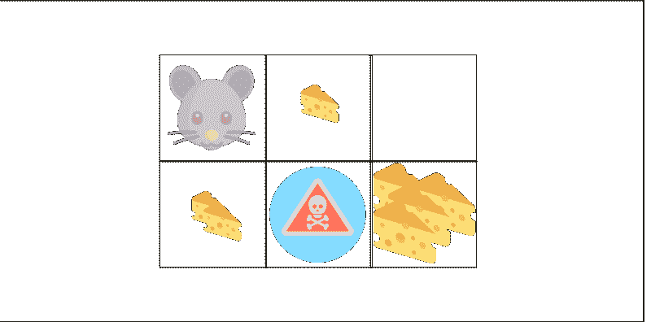

> 本文是 Tensorflow 深度强化学习课程的一部分？️.查看这里的教学大纲。

今天我们将学习 Q-Learning。Q-Learning 是一种基于值的强化学习算法。

本文是关于深度强化学习的免费系列博文的第二部分。如需更多信息和资源，请查看课程的教学大纲。参见[第一篇](https://medium.freecodecamp.org/an-introduction-to-reinforcement-learning-4339519de419)。

在本文中，您将了解到:

*   什么是 Q 学习
*   如何用 Numpy 实现

### 大图:骑士和公主

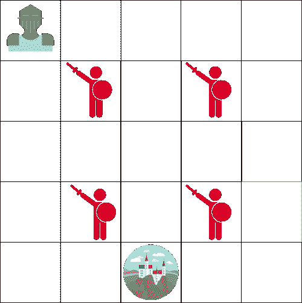

假设你是一名骑士，你需要拯救被困在上面地图所示城堡中的公主。

您一次可以移动一张牌。敌人不行，但是和敌人降落在同一个瓷砖上，你就死定了。你的目标是以最快的路线去城堡。这可以用一个“计分”系统来评估。

*   你每一步输-1(每一步失分帮助我们代理快)。
*   如果你碰到一个敌人，你失去-100 点，这一集结束。
*   如果你在城堡中获胜，你会得到+100 点。

问题是:如何创建一个能够做到这一点的代理？

这是第一个策略。比方说，我们的代理试图找到每块瓷砖，然后给每块瓷砖上色。绿色代表“安全”，红色代表“不安全”。


The same map, but colored in to show which tiles are safe to visit.

然后，我们可以告诉我们的代理人只拿绿色瓷砖。

但问题是它并没有真正的帮助。当绿牌彼此相邻时，我们不知道拿哪张牌最好。所以我们的代理在试图寻找城堡时会陷入无限循环！

### Q 表简介

这里有第二个策略:创建一个表格，我们将在其中计算每个状态下每个行为的最大预期未来奖励。

由于这一点，我们将知道对每个州采取什么样的最佳行动。

每个状态(图块)允许四种可能的操作。这些正在向左、向右、向上或向下移动。


0 are impossible moves (if you’re in top left hand corner you can’t go left or up!)

在计算方面，我们可以将这个网格转换成表格。

这被称为一个 **Q 表**(Q 代表动作的“质量”)。列将是四个动作(左、右、上、下)。这些行将是州。每个单元格的值将是给定状态和行为的最大预期未来回报。

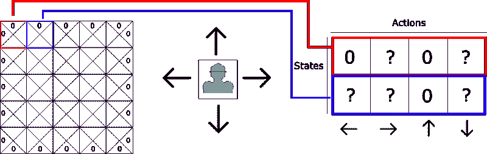

每一个 Q-table 分数都将是最大的预期未来回报，如果我在给定的最佳政策下采取行动的话。

为什么说“有了给定的政策？”这是因为我们不执行政策。相反，我们只是改进我们的 Q 表，以始终选择最佳行动。

把这个 Q 表想象成一个游戏“小抄”由于这一点，我们知道对于每个状态(Q 表中的每一行)采取什么样的最佳行动，通过找到该行中的最高分。

耶！我们解决了城堡问题！但是等等…我们如何计算 Q 表中每个元素的值呢？

为了学习这个 Q 表的每个值，**我们将使用 Q 学习算法。**

### q 学习算法:学习动作值函数

动作值函数(或“Q 函数”)接受两个输入:“状态”和“动作”它返回该状态下该行为的预期未来回报。

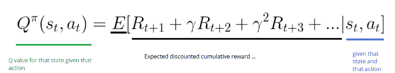

我们可以将这个 Q 函数看作是一个阅读器，它滚动 Q 表来查找与我们的状态相关联的行和与我们的动作相关联的列。它从匹配的单元格中返回 Q 值。这就是“预期的未来回报”

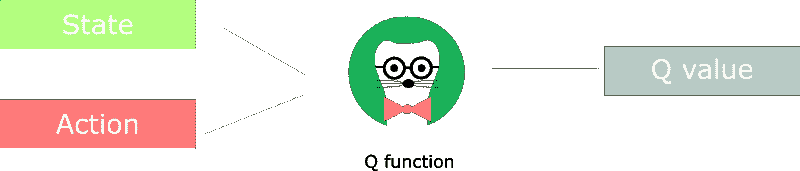

但是在我们探索环境之前，Q-table 给出了相同的任意固定值(大多数时候是 0)。当我们探索环境**，**时，Q 表将通过使用贝尔曼方程迭代更新 Q(s，a)给我们一个越来越好的近似值(见下文！).

#### Q 学习算法过程

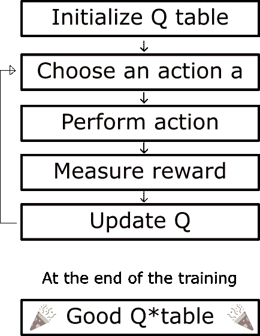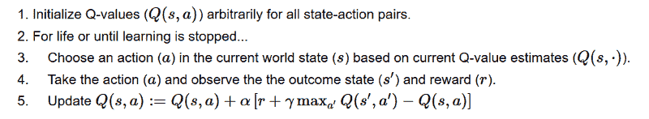

The Q learning algorithm’s pseudo-code

**第一步:初始化 Q 值**
我们构建一个 Q 表，有 *m* 列(m=动作数)，和 *n* 行(n =状态数)。我们将值初始化为 0。

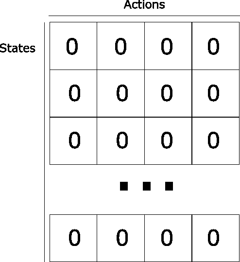

**步骤 2:终身(或直到学习停止)**
步骤 3 至 5 将被重复，直到我们达到最大集数(由用户指定)或直到我们手动停止训练。

**步骤 3:选择动作**
基于当前的 Q 值估计，在当前状态 *s* 中选择动作 *a* 。

但是…如果每个 Q 值都等于零，我们在开始时可以采取什么行动呢？

这就是我们在上一篇文章的[中谈到的勘探/开采权衡的重要性所在。](https://medium.freecodecamp.org/an-introduction-to-reinforcement-learning-4339519de419)

的想法是，一开始，我们会使用ε贪婪策略:

*   我们指定一个探测速率“epsilon”，我们在开始时将其设置为 1。这是我们随机进行的步数。在开始的时候，这个速率一定是在它的最高值，因为我们对 Q-table 中的值一无所知。这意味着我们需要做大量的探索，随机选择我们的行动。
*   我们生成一个随机数。如果这个数字>ε**o**n，那么我们将进行“开发”(这意味着我们使用我们已经知道的东西来选择每一步的最佳行动)。否则，我们将进行探索。
*   这个想法是，在 Q 函数训练的开始，我们必须有一个大的ε。然后，随着代理对估计 Q 值越来越有信心，逐渐减少它。

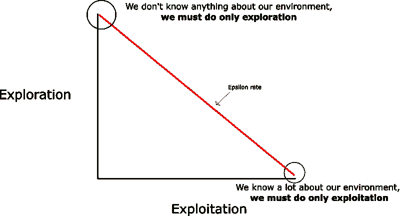

**步骤 4–5:评估！**
采取行动 *a* 观察结果状态*s’*奖励 *r.* 现在更新函数 Q(s，a)。

我们采取我们在步骤 3 中选择的动作 *a* ，然后执行这个动作返回给我们一个新的状态*s’*和一个奖励 *r* (正如我们在第一篇文章的[中的强化学习过程中看到的)。](https://medium.freecodecamp.org/an-introduction-to-reinforcement-learning-4339519de419)

然后，为了更新 Q(s，a ),我们使用**贝尔曼方程:**


这里的想法是像这样更新我们的 Q(状态，动作):

```
New Q value =    Current Q value +    lr * [Reward + discount_rate * (highest Q value between possible actions from the new state s’ ) — Current Q value ]
```

让我们举个例子:

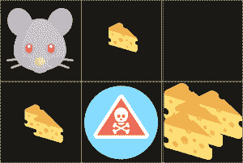

*   一块奶酪= +1
*   两块奶酪= +2
*   大堆奶酪= +10(本集结束)
*   如果吃了老鼠药=-10(本集结束)

**第一步:我们初始化我们的 Q 表**

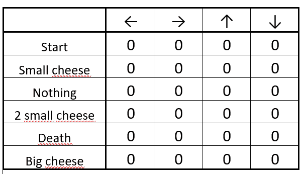

The initialized Q-table

**第二步:从起始位置选择一个动作**
，可以选择向右或向下。因为我们有一个很大的ε率(因为我们对环境还一无所知)，所以我们随机选择。比如…向右移动。

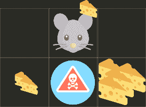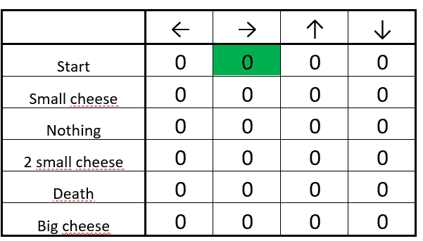

We move at random (for instance, right)

我们找到了一块奶酪(+1)，现在我们可以更新在起点向右的 Q 值。我们用贝尔曼方程来做这个。

**步骤 4–5:更新 Q 函数**

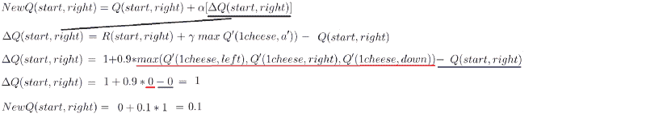

*   首先，我们计算 Q 值的变化δQ(开始，右侧)
*   然后，我们将初始 Q 值与δQ(开始，右侧)乘以学习速率相加。

可以把学习率看作是一个网络用新值取代旧值的速度。如果学习率是 1，新的估计将是新的 Q 值。

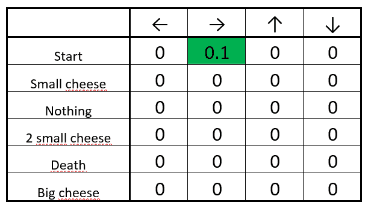

The updated Q-table

很好！我们刚刚更新了第一个 Q 值。现在我们需要一次又一次地这样做，直到学习停止。

### 实现一个 Q 学习算法

> 我们制作了一个视频，其中我们实现了一个 Q-learning agent，它学习用 Numpy 玩 Taxi-v2。

现在我们知道了它是如何工作的，我们将一步一步地实现 Q 学习算法。下面的 Jupyter 笔记本中直接解释了代码的每个部分。

可以在[深度强化学习课程 repo 中访问。](https://github.com/simoninithomas/Deep_reinforcement_learning_Course/tree/master/Q%20learning/FrozenLake)

或者你可以直接在谷歌联合实验室访问它:

[**【Q *学同冻湖】**](https://colab.research.google.com/drive/17iM0vx848VYWFwW3Du-l-FCn3Y1VhCgx)
[【colab.research.google.com】](https://colab.research.google.com/drive/17iM0vx848VYWFwW3Du-l-FCn3Y1VhCgx)

### 概述一下…

*   Q-learning 是一种基于值的强化学习算法，用于使用 q 函数找到最佳的动作选择策略。
*   它基于动作值函数来评估要采取的动作，该动作值函数确定处于某个状态以及在该状态下采取某个动作的值。
*   目标:最大化价值函数 Q(给定一个状态和动作的预期未来回报)。
*   q 表帮助我们找到每个状态的最佳行动。
*   通过选择所有可能行动中的最佳行动来最大化预期回报。
*   Q 来自于某一状态下某一动作的质量。
*   函数 Q(状态，行动)→返回该行动在该状态下的预期未来回报。
*   可以使用 Q 学习来估计该函数，Q 学习使用贝尔曼方程迭代地更新 Q(s，a)
*   在我们探索环境之前:Q 表给出了相同的任意固定值→但是随着我们探索环境→ Q 给了我们一个越来越好的近似值。

仅此而已！不要忘记自己实现代码的每一部分——尝试修改我给你的代码真的很重要。

尝试添加纪元，改变学习速率，使用更硬的环境(比如 8×8 瓷砖的冰封湖)。玩得开心！

下次我们将研究深度 Q 学习，这是 2015 年深度强化学习的最大突破之一。我们会训练一个特工来扮演毁灭战士并杀死敌人！

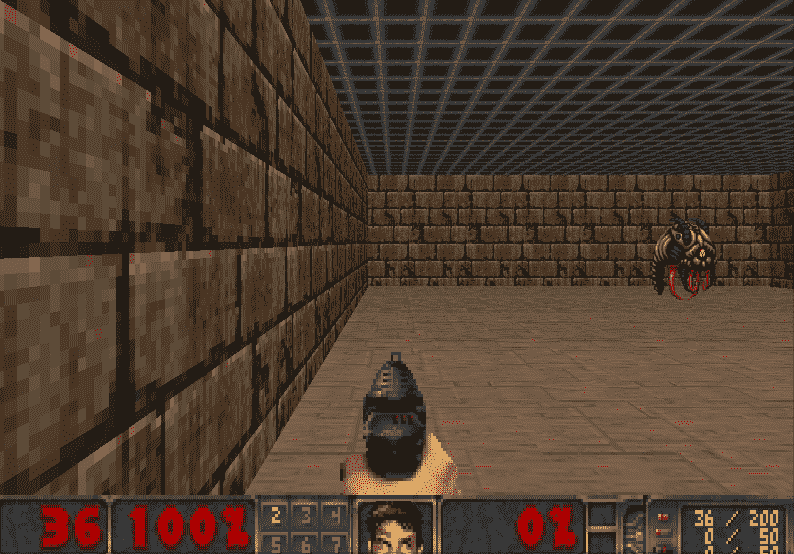

Doom!

如果你喜欢我的文章，请点击？下面是你喜欢文章的次数，所以其他人会在媒体上看到它。别忘了跟着我！

如果你有任何想法，评论，问题，欢迎在下面评论或者给我发邮件:hello@simoninithomas.com，或者发推特给我。


不断学习，保持牛逼！

#### Tensorflow 深度强化学习课程？️

？S [yllabus](https://simoninithomas.github.io/Deep_reinforcement_learning_Course/)

？视频版本

第一部分:[强化学习简介](https://medium.com/p/4339519de419/edit)

第 2 部分:[用 Q-Learning 更深入地研究强化学习](https://medium.freecodecamp.org/diving-deeper-into-reinforcement-learning-with-q-learning-c18d0db58efe)

第 3 部分:[深度 Q 学习简介:让我们玩毁灭战士](https://medium.freecodecamp.org/an-introduction-to-deep-q-learning-lets-play-doom-54d02d8017d8)

第 3 部分+: [深度 Q 学习的改进:决斗双 DQN，优先体验重放，固定 Q 目标](https://medium.freecodecamp.org/improvements-in-deep-q-learning-dueling-double-dqn-prioritized-experience-replay-and-fixed-58b130cc5682)

第 4 部分:[关于厄运和翻转的政策梯度的介绍](https://medium.freecodecamp.org/an-introduction-to-policy-gradients-with-cartpole-and-doom-495b5ef2207f)

第五部分:[优势演员介绍评论方法:我们来玩刺猬索尼克吧！](https://medium.freecodecamp.org/an-intro-to-advantage-actor-critic-methods-lets-play-sonic-the-hedgehog-86d6240171d)

第 6 部分:[刺猬索尼克 2 和 3 的近似策略优化(PPO)](https://towardsdatascience.com/proximal-policy-optimization-ppo-with-sonic-the-hedgehog-2-and-3-c9c21dbed5e)

第七部分:[好奇心驱动的学习变得简单第一部分](https://towardsdatascience.com/curiosity-driven-learning-made-easy-part-i-d3e5a2263359)