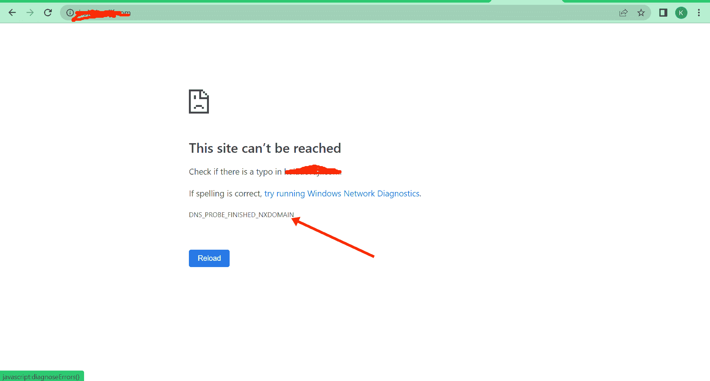
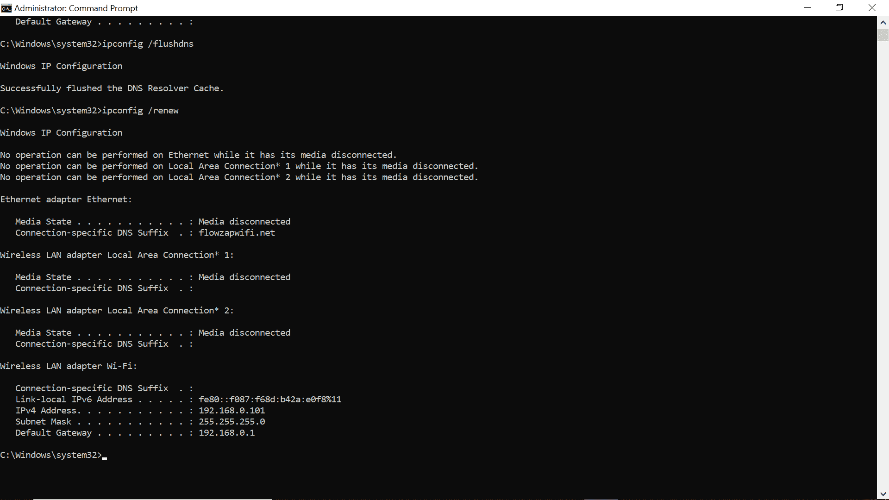
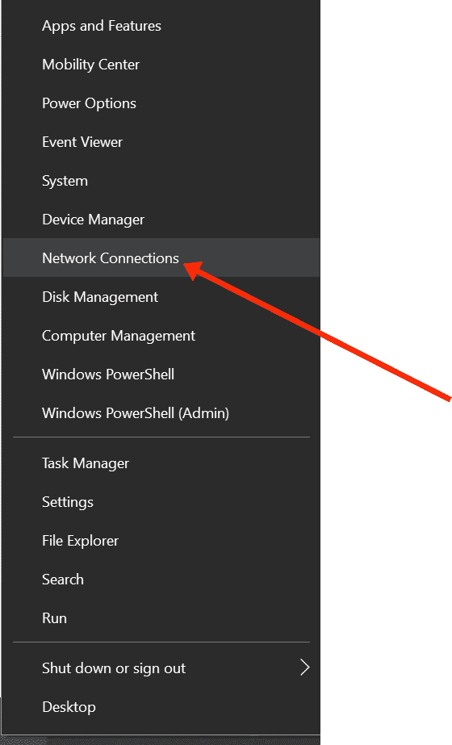
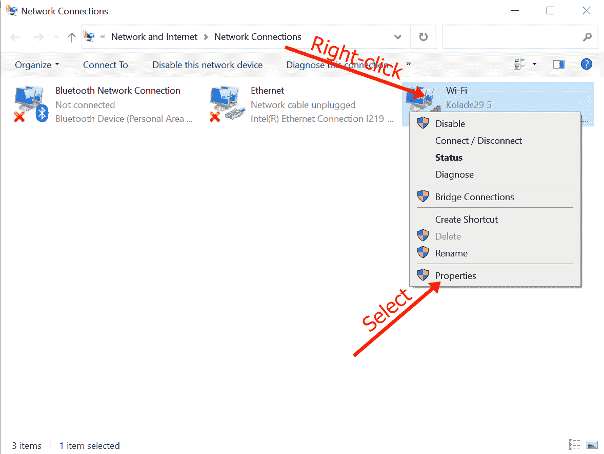
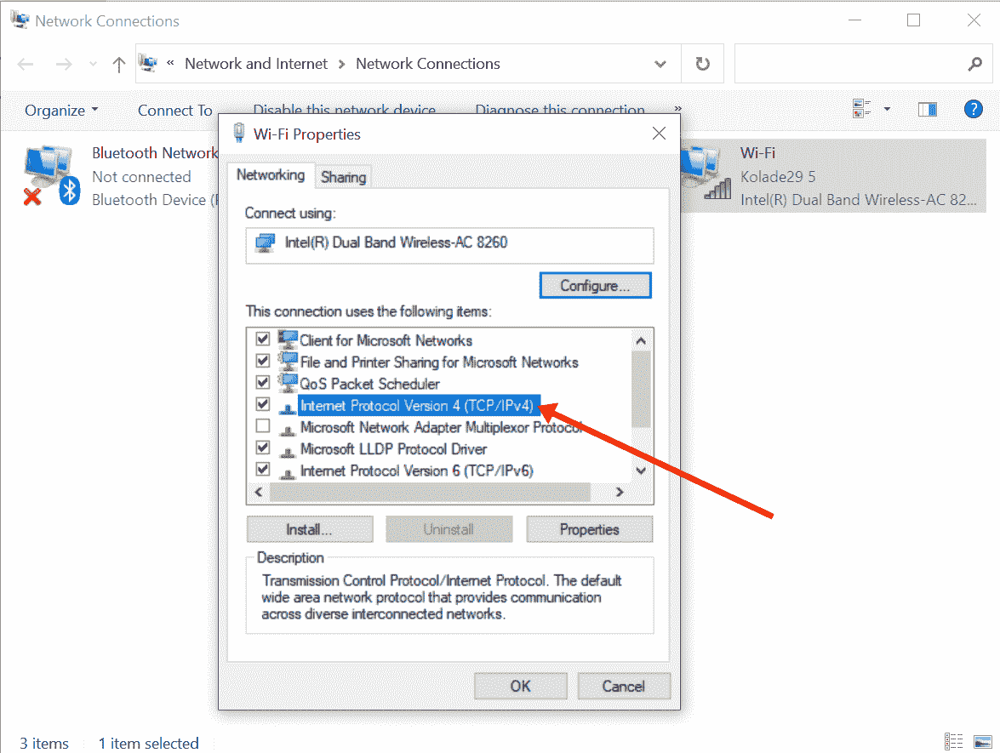
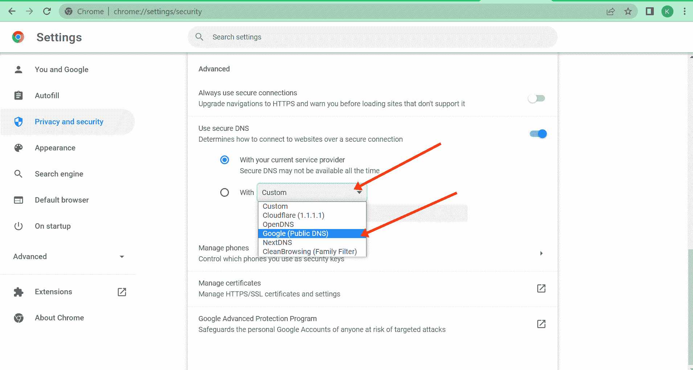

# dns_probe_finished_nxdomain 错误[已解决]

> 原文：<https://www.freecodecamp.org/news/dns_probe_finished_nxdomain-error-solved/>

如果你是谷歌 Chrome 的普通用户，那么你可能之前遇到过错误“dns_probe_finished_nxdomain”。通常伴随着“此站点无法到达”。

此错误与域名系统(DNS)服务器有关，可能是由于 DNS 服务器配置错误、服务器无响应或网站的 DNS 尚未传播造成的。

错误中的“nxdomain”意味着你试图访问一个“不存在的域”。

在其他浏览器中，“dns_probe_finished_nxdomain”错误可能会以另一种方式出现。在 Microsoft Edge 上，它可能会显示为“嗯…无法访问此页面”，而在 Firefox 上，它通常会显示为“嗯。我们很难找到那个网站”。

修复此错误以恢复您的互联网连接并不是一项艰巨的任务。所以在这篇文章中，我将向你展示 4 种方法来解决这个问题。

## 我们将在这里讨论的内容

*   [禁用您的防病毒软件和 VPN](#fix1disableyourantivirusandvpn)
*   [刷新、释放和更新您的 DNS 缓存](#fix2flushreleaseandrenewyourdnscache)
    *   [清空你的谷歌浏览器缓存](#youshouldalsoconsiderflushingchromesdns)
*   [重启路由器或调制解调器](#fix3restartyourrouterormodem)
*   [手动更改您的 DNS 服务器](#fix4manuallychangeyourdnsserver)
    *   [更换你的谷歌 Chrome 浏览器 DNS 服务器](#youcanalsochangethednsserverofthegooglechromebrowserinparticular)
*   [结论](#conclusion)

## 修复 1–禁用您的防病毒和 VPN

反病毒程序因干扰应用程序并阻止它们正常工作而臭名昭著。

另一方面，VPN 可以屏蔽一些网站，而其他一些网站则不能很好地使用它们。

如果您遇到“dns_probe_finished_nxdomain”错误，请考虑禁用防病毒软件并关闭 VPN，然后检查以确保您可以再次访问互联网。

如果在禁用防病毒程序并关闭 VPN 后，您能够访问互联网，那么这就是您出现错误的原因。

如果你在 Windows 10 上，可以按照以下步骤禁用 Windows 安全:
**第一步**:按键盘上的`ALT` + `SHIFT` + `ESC`打开任务管理器。

**第二步**:点击启动选项卡。

**第三步**:在列表中找到你的杀毒程序，点击右键，选择“禁用”。

再次尝试访问互联网，看看错误是否不再显示。如果这无法修复错误，请继续阅读并尝试本文中的其他修复方法。

## 修复 2–刷新、释放和更新您的 DNS 缓存

DNS 缓存保存您访问过的网站的 IP 地址，以便在您尝试访问相同的网站时加快加载速度。

刷新、释放和更新 dns 缓存可以修复“dns_probe_finished_nxdomain”错误，因为这些过程会删除 DNS 缓存中的无效 IP 配置和过时信息。

要在 Windows 上刷新、释放和更新计算机的 DNS，请遵循下面突出显示的步骤:
**第一步**:点击键盘上的`WIN`按钮，搜索“cmd”。然后选择右边的“以管理员身份运行”。

**步骤 2** :依次输入并执行以下命令:

*   `ipconfig /flushdns`
*   `ipconfig /release`
*   ` ipconfig /renew
    

### 你也应该考虑刷新 Chrome 的 DNS。

要刷新 Chrome 的 DNS，你只需要在地址栏输入`chrome://net-internals/#dns`，然后点击`ENTER`。然后点击【清除主机缓存】:

刷新电脑的 DNS 和 Chrome 的 DNS 后，重启电脑，看看是否不再出现错误。

## 修复 3-重启路由器或调制解调器

如果您通过路由器或调制解调器访问互联网，重新启动它可以帮助您摆脱“dns_probe_finished_nxdomain”错误。

这是因为关闭然后打开路由器或调制解调器会清除 IP 地址的缓存，从长远来看，这可以修复错误。

要重新启动路由器或调制解调器，找到电源按钮并长按将其关闭，然后再次长按将其打开。

## 修复 4-手动更改您的 DNS 服务器

如果以上任何修复方法对您不起作用，您应该考虑更改您的 DNS 服务器地址，因为这是修复“dns_probe_finished_nxdomain”错误的最可靠的方法之一。

默认情况下，DNS 服务器地址由您的互联网服务提供商提供，但使用此默认 DNS 并不总是安全的。这可能是您得到“dns_probe_finished_nxdomain”错误的原因。

你可以把你的 DNS 服务器换成 Google 和 Cloudflare 等公司提供的免费服务器。

以下步骤向您展示了如何将您的 DNS 服务器更改为 Google:
**第一步**:右键单击开始并选择“网络连接”:

**步骤 2** :向下滚动选择“更改适配器选项”:

**第三步**:在弹出的界面中，右键点击你所连接的网络，选择“属性”:

**步骤 4** :在出现的另一个弹出窗口中，双击“互联网协议版本 4(TCP/IP v4)”:

**第五步**:会出现另一个弹出窗口。这一次，选择单选按钮“使用下面的 DNS 服务器地址”:

**步骤 6** :输入 8.8.8.8 作为“首选 DNS 服务器”，输入 8.8.4.4 作为“备用 DNS 服务器”。这是谷歌提供的免费 DNS 服务器。

**第七步**:点击“确定”，再次点击“确定”。

**注意:**:如果你的电脑配置为使用 IPv6 而不是 IPv4，那么在步骤 4 中，你应该选择“互联网协议版本 6 (TCP/IPv6)”而不是“互联网协议版本 4 (TCP/IPv4)”。然后输入`2001:4860:4860::8888`作为首选 DNS 服务器，输入`2001:4860:4860::8844`作为备用 DNS 服务器。

### 你还可以特别更改谷歌 Chrome 浏览器的 DNS 服务器。

为此，请打开你的 chrome 浏览器，在地址栏输入`chrome://settings/security`，然后点击`ENTER`。

在出现的页面上，向下滚动，点击“自定义”，选择“Google(公共 DNS)”:

完成所有这些后，检查您的互联网连接是否已恢复。

## 结论

正如您在本文中看到的，解决“dns_probe_finished_nxdomain”错误并不困难，因为有几种方法可以修复它。本文讨论了其中的 4 种方法。

如果其中一个修复无法为您解决错误，那么您应该检查其余的任何修复。对于我来说，我不久前经历了这个错误，对我来说修复它的方法是改变我的 DNS 服务器。

感谢您的阅读。