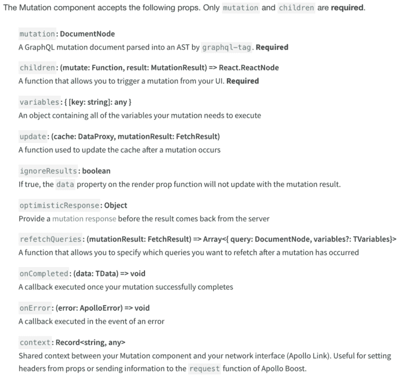

# 如何以正确的方式进行 Apollo HOC 突变

> 原文：<https://www.freecodecamp.org/news/do-apollo-hoc-mutations-goodly-bb4effdbee94/>

拉克伦·杨

# 如何以正确的方式进行 Apollo HOC 突变


Expert Custom Graphics….

像许多人一样，您可能是从 REST API 背景进入 Apollo 和 GraphQL 的。然而，当您开始探索这个堆栈的工作示例以及实现它的不同方式时，您无疑会被众多差异所绊倒，无论是 Apollo 的库，还是围绕 GraphQL 和 Apollo 的渲染组件的整个“按需获取数据”的思想。

在本文中，我想做的是帮助解决编写变异时的两个关键问题。这主要是针对特定的实现，但是对于渲染组件来说或多或少是一样的，只是将对象关键点调整为道具。

具体来说，我们将直接进入 optimisticResponse 以及您的 HOC 变异的更新参数。我希望这能让你更清楚地意识到，当把一个突变作为一个属性函数来实现时，你有哪些选择。

重要提示:如果你刚刚开始使用 Apollo，我衷心地恳求你实现他们在 2.1 版本发布的渲染组件。hoc 是不推荐使用的软件，因此缺少很多文档，正如一些人[在这里](https://github.com/apollographql/apollo-client/issues/3253)提到的。

### 乐观的回应

optimisticResponse 是我们管理应用程序是否在线的方式，以及我们对数据库的请求的状态。

如果我们在没有连接的情况下改变我们的数据库，乐观的反应允许它与我们合理预期的变量一起存在。

**例如**，如果我们假设将这个用户添加到 db:

```
{    userId: 123,    firstName: "Lachlan",    lastName: "Young",    status: "Hungry"}
```

我们希望用上述数据更新我们的用户详细信息。然而，由于我们的变异工作的方式(这是专门针对 hoc 的，但也可以应用于渲染组件)，变异有一个生命周期，从加载到成功/失败/无法连接。

如果在任何时候变异失败了，但没有出错，那么您的 Apollo 客户机就知道这是因为某个东西而不是坏对象。我的意思是，它考虑了您的离线状态，即请求的状态，而是将该用户呈现给用户详细信息组件，因为它假设该用户是有效的。因此，你的客户是乐观的。

当您再次连接到互联网或访问您的数据库时，它将使用有效数据更新响应。在该响应中，您可以处理在客户端生成的 userId 之类的东西，因此将我的硬编码 id 123 更新为 UUID。

如果我们不在线，我们仍然可以看到请求并与请求进行交互，任何更改都将被排队，然后在重新连接时改变服务器。

这是一个乐观的回答。

### 更新

至于如何处理来自数据库的响应，您实际上可以访问一个名为 **update** 的属性，对于 HOCs，它看起来是这样的:

```
update: (proxy, { data: { myDetails } }) => {    try {        // Read the data from our cache for this query.        const data = proxy.readQuery({             query: gql`${GET_MY_DETAILS}`        });
```

```
 // Add our new request from the mutation to the end.        data.getMyDetails.push(myDetails);
```

```
 // Write our data back to the cache.        proxy.writeQuery({             query: gql`${GET_MY_DETAILS}`,            data        });    } catch (err) {        console.log('Error updating the cahche: ', err.message);    }}
```

本质上，这发生在突变中的 optimisticResponse 字段之后。它直接处理收到响应后发生的事情，从顶部开始，它有`proxy`和`data`两个参数。`Proxy`实际上是我们的客户端，但是对于某些配置来说，你可以称它为缓存。`Data`是来自突变的反应。在本例中，我对它进行了解构，以进一步解释 myDetails 对象。

myDetails 包含了上面用户对象中的所有内容，但是 id 现在是一个有效的 UUID，而不是 123。然后，我们使用 apolloClient 的方法进行读写，并读取保存在缓存中的详细信息。从那里，我们添加新的详细信息，并将它们重新写入缓存。这样，在我从输入页面导航回我的详细信息后，我的新详细信息将立即可用，因为它们是缓存中的事实点。

### 附加说明

在我写这篇文章的时候，这里记录的所有渲染道具都可以应用到你的 HOC 变异中。正如我在本文介绍中提到的，特设文档确实已经被否决了。但是，下面给出的选项都可以作为特设对象的键来实现。



Mutation Props **4/12/2018**

非常感谢您的阅读。你通常可以在#React-Apollo 或#Apollo-Client 频道中看到我在 Apollo Slack 周围浮动。要注册 slack 并获得更多具体建议，请点击[此处](https://www.apollographql.com/slack/)。