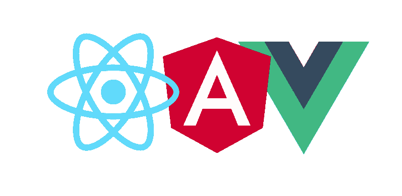
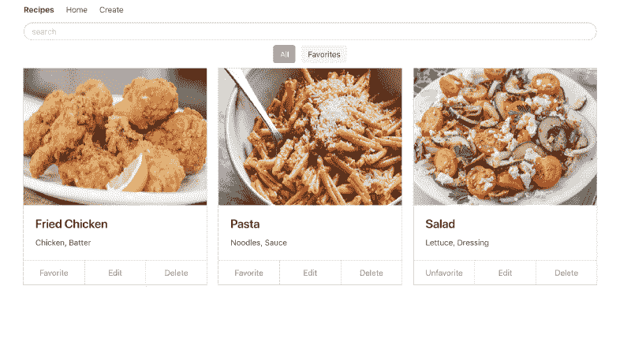
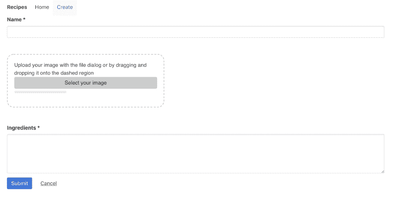
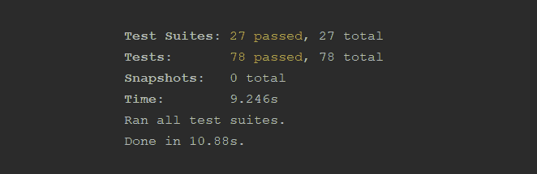
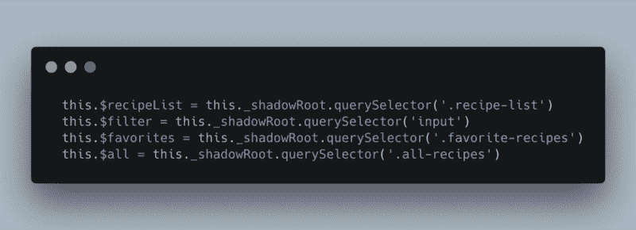
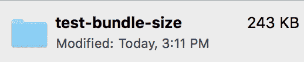
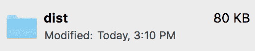
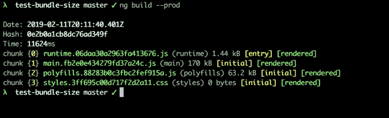
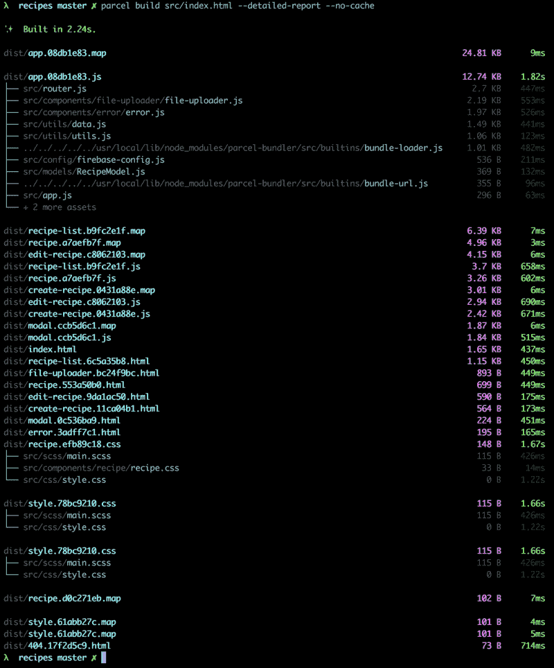

# 我们还需要 JavaScript 框架吗？

> 原文：<https://www.freecodecamp.org/news/do-we-still-need-javascript-frameworks-42576735949b/>

卢克·乔利亚特

# 我们还需要 JavaScript 框架吗？

作为一名 web 开发人员，我尝试定期评估我的工具箱，并确定我是否可以没有这个或那个工具。最近，我一直在研究在没有前端框架的情况下开发一个复杂的前端应用程序有多容易。

#### 什么是 JavaScript 框架？

简单地说，JavaScript 框架是一种工具，可以用来开发高级 web 应用程序，尤其是 SPAs。

过去，web 开发人员会严重依赖普通的 JS 和 jQuery 来实现前端逻辑。但是，随着前端应用程序变得越来越复杂，工具也应运而生。

当今流行的框架有一些核心共性。大多数前端框架/库，从 Vue 到 React，都提供了以下内容的某种组合:

*   状态和视图的同步
*   按指定路线发送
*   模板系统
*   可重用组件

#### 框架还有存在的必要吗？

这取决于你如何强调必要这个词。许多人会认为前端框架不是也从来没有必要。不过，它们是非常有用的工具。

所以问题是:框架是今天的 jQuery 吗？它们所解决的问题会被类似于 DOM API 的改变所解决吗？

这很难说，但是原生 JS、web 组件规范和易于配置的构建工具的进步使得在没有框架的情况下开发 SPA 变得前所未有的简单。

为了进一步检验这一点，我只使用普通的 JavaScript、本地 Web 组件和包开发了一个单页面应用程序。在这个过程中，有一些陷阱和困难凸显了 JS 框架的优势。

同时，一旦我通过了最初的障碍，我惊讶地发现只用普通的 JS 创建一个单页面应用程序是如此简单。

#### 概观

应用程序很简单。这是一个食谱应用程序，具有基本的 CRUD 功能。用户可以创建、编辑、删除、收藏和过滤配方列表。

The Home Screen

Create Recipe Screen

#### 成分

创建 web 组件也很简单。您创建一个扩展了`HTMLElement`(或`HTMLParagraphElement`等等)的类，然后使用该类定义一个定制元素。

您还可以利用生命周期挂钩，例如 *connectedCallback、disconnectedCallback、attributeChangedCallback。*

#### 按指定路线发送

recipes 应用程序的路由也非常简单。给定一个导航事件，我将应用程序的内容设置为相应的 web 组件。

最初，我使用的是名为 Vanilla JS Router 的 npm 包。有了[浏览器历史 API](https://developer.mozilla.org/en-US/docs/Web/API/History) ，用不到 100 行代码实现你自己的历史并不复杂！注意:我没有实现真正复杂的逻辑，比如路由守卫。

这是一个简短的总结。我想让这篇文章保持合理的长度。我可能会写一篇后续文章，对应用程序进行更全面的解释。我实现了一些有趣的功能，比如无限滚动、自定义拖放上传器等等！

### 回顾的

创建应用程序后，我花了一些时间从头到尾思考整个过程的利弊。我先说坏消息。

### 骗局

#### 该规范仍在不断变化

web 组件规范既是旧的又是新的。它存在的时间比我原先想象的要长得多。Web 组件是由亚历克斯·罗素在 2011 年 Fronteers 大会上首次介绍的。然而，web 组件背后的推动力在过去一两年里确实有所增长。因此，规范中仍然有很多混乱。例如，HTML 导入已经被放弃，尽管大多数文档/资源仍然引用它们。

#### 测试

没有很多专门的资源用于测试本地 web 组件。有一些有前途的工具，如来自 Polymer 的 skate js SSR T1 和 T2 web 组件测试器 T3。但是这些工具实际上是为了与它们各自的库一起使用。这给本机 web 组件的使用带来了一些困难。

#### 变化检测

拥有一个自动保持视图与数据模型同步的底层系统是不可思议的。这是最初吸引许多人使用 Angular 和其他框架的原因。

在小范围内保持状态与视图同步并不困难。但是它会很快失去控制，您会发现自己添加了大量的事件侦听器和查询选择器。

#### 影子王国

我真的很纠结于影子王国。一方面，我喜欢封装的想法。这是一个明智的设计模式，使您的风格级联更易于管理，简化您的关注点，等等。然而，当你确实想让某些东西穿透封装(比如一个共享的样式表)时，它也会带来一些问题，而且关于做这件事的最佳方式还有很多争论。

#### 生成 DOM 结构

像 Angular 和 React 这样的框架/库的伟大之处在于它们是各自领域的大师。也就是说，它们非常擅长在 DOM 中高效地呈现和重新呈现结构。来自[角大学的博客](https://blog.angular-university.io/why-angular-angular-vs-jquery-a-beginner-friendly-explanation-on-the-advantages-of-angular-and-mvc/):

> Angular 不是生成 HTML，然后将其传递给浏览器进行解析，而是直接生成 DOM 数据结构！

例如，与 jQuery 不同，Angular 直接呈现 DOM 数据结构。也就是说，不是将 HTML 传递给浏览器进行解析，然后渲染成 DOM 数据结构。这样做性能更好，因为它消除了解析步骤。虚拟 DOM 也非常有用，因为它们可以防止您在每次需要更新视图时重新渲染所有内容。

### 赞成的意见

另一方面，以这种方式开发应用程序有一些不可否认的好处:

#### 捆绑大小

最终产品可以(强调*可以*)比用现代框架开发的任何东西都小得多、紧凑得多。例如，我的全功能食谱应用程序的最终版本还不到一个新的 Angular 版本的一半大小。

Angular bundle size

Recipes app bundle

注意:这些是更新的、优化的包大小。

#### 谅解

如果你真的只用一个框架和它的 CLI 来开发，那么在没有额外工具的情况下制作一个 web 应用程序是一个很好的练习。作为一个想要达到一定程度(尽可能)精通 web 开发的人，获得更多关于构建工具、浏览器 API、设计模式等的实践经验对我来说至关重要。

#### 表演

这些前端框架和库在幕后所做的事情令人惊叹。但是，如果您决定使用它们中的任何一个，您可以支付性能价格；天下没有免费的午餐。在规模上有许多潜在的性能拖累:无论是浪费的重新渲染、冗余的侦听器、深度对象比较，还是不必要的大型 DOM 操作。您可以通过从头开始实现来减少很多复杂性。

Angular 和 React 团队似乎意识到了这些缺陷，并提供了像*should update*method overrides 和 *onPush* ChangeDetection 这样的东西作为进一步优化性能的手段。

#### 简单性和代码所有权

每当你引入第三方代码时，你都在冒险。经过测试的库/框架降低了这种风险，但从未真正消除。如果您可以自己或与您的团队一起编写代码，您就可以降低风险并维护一个您熟悉的代码库。

#### 笔记和有趣的花絮

我非常喜欢处理包裹。当试图解决某些边缘情况时，它有时感觉比 Webpack 更受限制，但我发现在大多数情况下，“零配置”口号是正确的。

我也很清楚，许多标签反应了一个“库”和一个“渐进”框架。虽然我理解这样做的原因，但我认为 React、Vue 和 Angular 解决了许多相同的问题。因此，我将它们放在“框架”这个术语下一起考虑。

为什么不使用模板或聚合物？我想尽可能避免使用包、库和框架。我想看看 web 标准在多大程度上满足了现代开发(除了构建工具)。

我敢肯定，在没有主要框架或库的情况下，有许多其他方法来开发 SPA 或前端应用程序，我在这里尝试了一种方法，我很乐意听到其他方法！

### 摘要

决定使用或不使用一个框架的一个很好的启发就是我所说的“临界点”随着应用程序的增长，为了重用功能和结构，您最终会创建自己的框架。例如，您有一堆表单，您想为反应式验证创建可重用的逻辑。

如果您到了这一步，您必须决定是否值得花时间创建系统来完成您可以通过框架或库快速完成的任务。根据您的时间限制或预算限制，会有不同的临界点，但是在合适的场景下，框架仍然非常重要。

也就是说，随着时间的推移，使用更小的库和/或本机代码，框架所做的许多事情可能会变得更容易。以我的申请为例。与此同时，如果大型框架和库保持通用性，它们可能会变形、适应和保留。否则，它们可能会像 jQuery 一样结束——在很大程度上是一个过时的工具。

### 结论

总之，在没有框架的情况下开发复杂的前端应用程序是有前途的方法。然而，web 组件之类的规范仍在发展，还有一些问题需要解决。框架仍然可以做很多令人惊奇的事情，并且可以使开发更加顺利。

在这个时候，据我所知，使用框架的好处往往大于坏处。然而，如果框架不开始解决新的问题并继续发展，它们最终会消失。

### 资源

[**有角新手指南:为什么有角？最大的好处**](https://blog.angular-university.io/why-angular-angular-vs-jquery-a-beginner-friendly-explanation-on-the-advantages-of-angular-and-mvc/)
[*注意:这篇文章是正在进行的 Angular for 初学者系列的一部分，这里是完整系列:Angular For 初学者…*blog . Angular-university . io](https://blog.angular-university.io/why-angular-angular-vs-jquery-a-beginner-friendly-explanation-on-the-advantages-of-angular-and-mvc/)[**与其他框架的比较-vue . js**](https://vuejs.org/v2/guide/comparison.html#Runtime-Performance-1)
[*vue . js-渐进式 JavaScript 框架*vuejs.org](https://vuejs.org/v2/guide/comparison.html#Runtime-Performance-1)[**优化性能- React**](https://reactjs.org/docs/optimizing-performance.html)
React 使用了几种巧妙的技术来最小化更新……reactjs.org[**Web 组件**](https://developer.mozilla.org/en-US/docs/Web/Web_Components)
[*所需的代价高昂的 DOM 操作数量作为开发人员，我们都知道尽可能多地重用代码是一个好主意。 这在传统上并非如此……*developer.mozilla.org](https://developer.mozilla.org/en-US/docs/Web/Web_Components)[**现代 JavaScript 框架存在的最深层次原因**](https://medium.com/dailyjs/the-deepest-reason-why-modern-javascript-frameworks-exist-933b86ebc445)
[*我见过很多很多人盲目地使用 React、Angular 或 Vue.js 这样的现代框架。这些框架提供了…*medium.com](https://medium.com/dailyjs/the-deepest-reason-why-modern-javascript-frameworks-exist-933b86ebc445)[**使用共享样式表设计 Web 组件的样式**](https://www.smashingmagazine.com/2016/12/styling-web-components-using-a-shared-style-sheet/)
[*Web 组件是 Web 的一个惊人的新特性，允许开发人员定义他们自己的定制 HTML 元素…*www.smashingmagazine.com](https://www.smashingmagazine.com/2016/12/styling-web-components-using-a-shared-style-sheet/)