# CSS Flexbox 的可视化指南

> 原文：<https://www.freecodecamp.org/news/do-you-even-flex-box-c16449cfca96/>

去找莫达克

### **什么是 CSS Flexbox？**

根据 MDN 网络文档:

> *“CSS 灵活框布局(Flexible Box Layout)是 CSS 的一个模块，它定义了一个为用户界面设计优化的 CSS 框模型，以及一维的项目布局。在 flex 布局模型中，flex 容器的子容器可以向任何方向布局，并且可以“伸缩”它们的大小，或者增长以填充未使用的空间，或者收缩以避免溢出父容器。孩子的水平和垂直对齐都可以很容易地操作。”*

总而言之，这是一个布局模块，它使得在容器中的项目之间对齐和分配空间变得更加容易。

让我们快速浏览几个例子，看看使用 CSS flexbox 只需最少 1-2 行代码就能完成什么:

水平对齐布局:

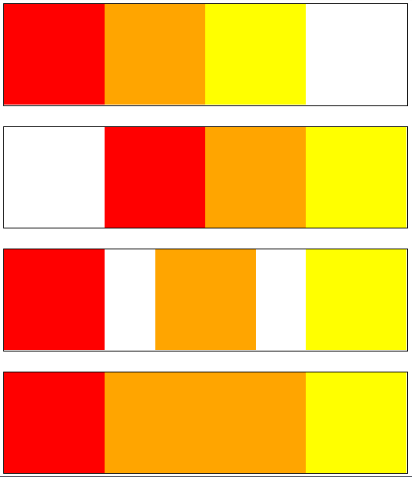

display: flex

垂直对齐布局:

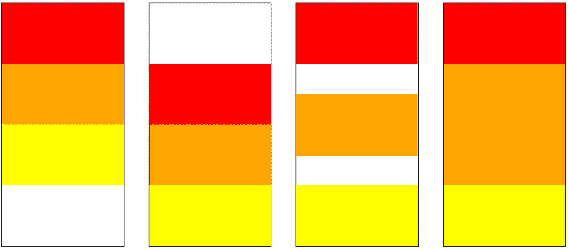

flex-direction: column

考虑到只需要一两行 CSS 来操作每个容器内部的布局，这是非常酷的。

### **基础知识**

Flexbox 属性可以分为两种主要类型:

1.  **容器属性**(伸缩方向、伸缩换行、内容对齐、项目对齐、内容对齐)
2.  **弹性项目属性**(订单、弹性、弹性增长、弹性收缩、自对齐)

#### **显示:伸缩**

第一个属性不是特定于 flexbox 的。该属性是`display`，我们将其设置为值:`flex`。这是在包含我们想要操作的项目的容器上设置的。

让我们添加一些视觉效果来理解它是如何工作的:

如果我们最初有一个容器，里面有 3 个盒子(`div`)。这是它们的样子:

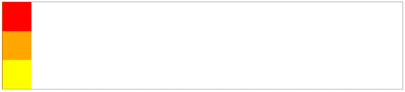

Container with 3 boxes

现在让我们将`flex`添加到容器中:

`display: flex;`

仅仅一行 CSS 就把布局从垂直方向改成了水平方向。

#### **围绕 Flexbox 的重要术语**

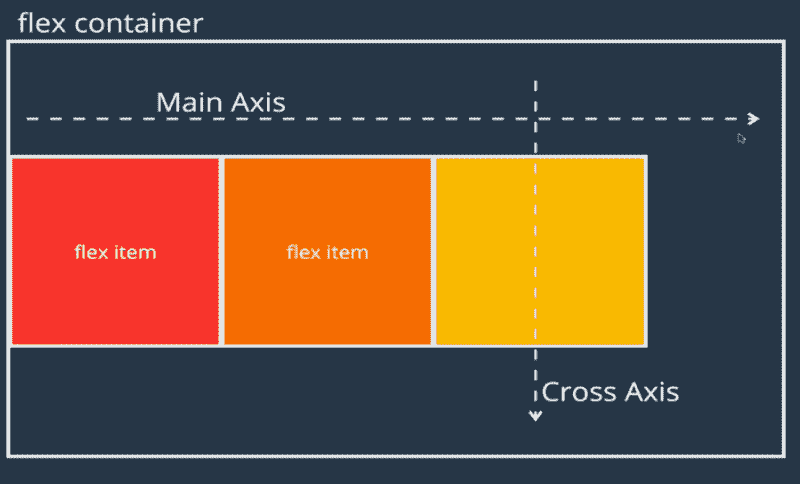

terminologies related to flexbox

这些术语将贯穿本指南。

1.  **Flex 容器:**这是指设置了`display: flex;`的容器。
2.  **Flex Item:** 这些是 Flex 容器中的单个子项
3.  **主轴**:默认从左向右设置。
4.  **横轴**:默认从上到下设置。

一旦在容器上设置了`display: flex`,这些假想的轴将一起决定 flex 容器内的 flex 项目应该如何移动和表现。每当我们改变下面讨论的某些 flexbox 属性时，这两个轴就改变方向。

#### **弯曲方向**

这个属性决定了假想轴的方向。反过来，轴决定了 flex 容器中的项目应该如何放置。它采用以下 4 个值:

1.  `row`是从左向右指向的主轴的默认值。横轴保持从上到下。
2.  `row-reverse`从右向左反转行的方向。同样，横轴不受影响。

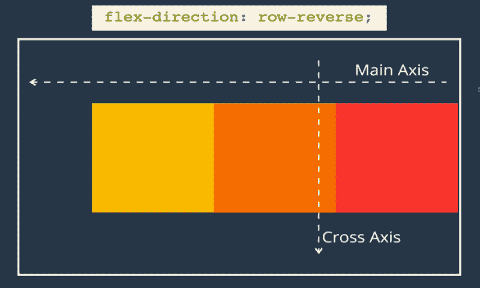

flex-direction: row-reverse;

3.`column`将主轴从水平轴改为垂直轴。这意味着主轴现在从上到下流动，而横轴现在从左向右流动。

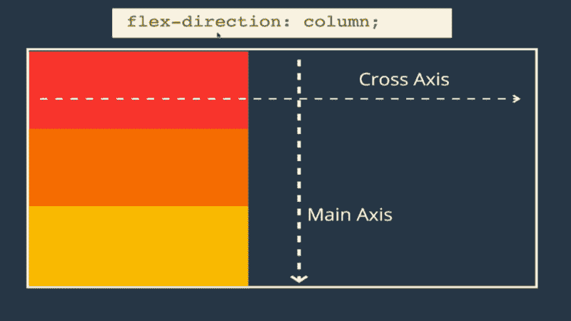

flex-direction: column;

4.`column-reverse`类似于列值，唯一的区别是主轴现在从底部流向顶部。

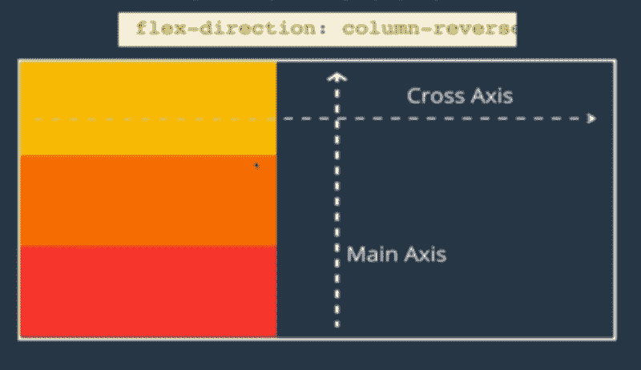

flex-direction: column-reverse;

#### **柔性包装**

默认情况下，flex 容器不允许项目占据一行中的几行。相反，所有的条目都将被压缩成一行，也就是说，它不允许换行。

1.  `flex-wrap: no-wrap`是默认值。

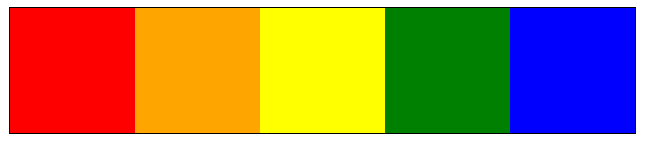

no-wrap. Each block is 200px in a 500px container

2.`flex-wrap: wrap`。通过将该属性更改为`wrap`，我们现在可以确保每个 flex-item 将保持它们各自的大小。如果它们不能放在一行中，它们将根据伸缩方向换行到下一行或下一列。

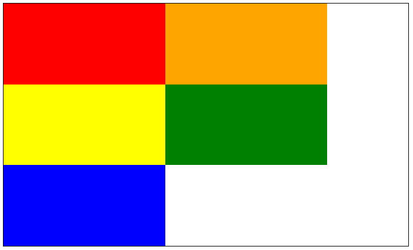

flex-wrap set to wrap for the same case as above

如果伸缩方向已设置为行反转，则项目将从右到左移动到下一行。

3.`wrap-reverse`另一方面，将从左到右将下一行 flex 项换行到第一行之上。

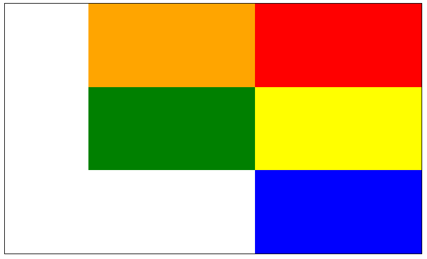

Flex-wrap now set to wrap-reverse

#### **调整内容**

这个属性经常被使用。其目的是沿着**主轴**在 flex 容器中的 flex 项目之间分配空间。其默认值设置为`flex-start`。

1\. justify-content: flex-start;

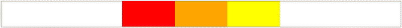

2\. justify-content: center;

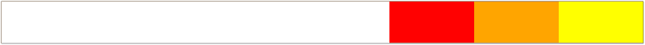

3\. justify-content: flex-end;

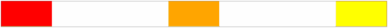

4\. justify-content: space-between;

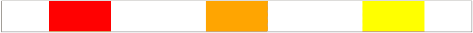

5\. justify-content: space-around;

**记住:**如果 flex-direction 已经设置为 column，那么主轴现在将从顶部流向底部。这意味着 justify-content 现在将以垂直方式分发项目。

#### **对齐项目**

这个属性和`justify-content`一样受欢迎，经常和 flexbox 一起使用。它与`justify-content`做同样的事情，唯一的区别是它沿着**横轴**工作。`align-items`的默认值为`stretch`。

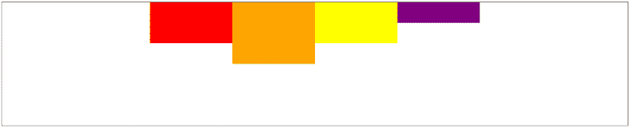

1\. align-items: flex-start;

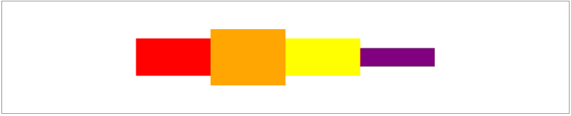

2\. align-items: center;

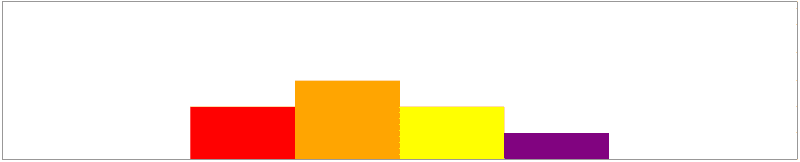

3\. align-items: flex-end;

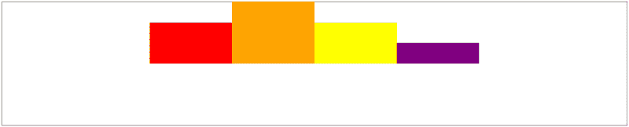

4\. align-items: baseline;

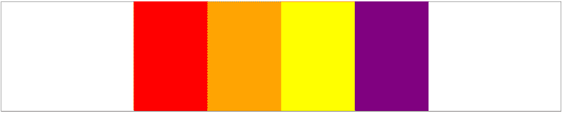

5\. align-items: stretch;

**记住:**如果 flex-direction 已经设置为 column，那么横轴现在将从左向右。这意味着 align-items 现在将以水平方式分布项目。

#### **对齐内容**

该属性与`align-items`类似，容易混淆。该属性的目的是确定 flex-container 中的**行**之间的空间应该如何沿着**横轴**分布。

`align-items`的目标是弹性项目之间的空间，`align-content`的目标是项目之间的行。`align-content`的默认值为`stretch`。

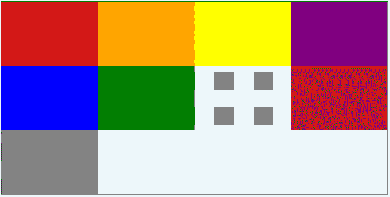

1\. align-content: stretch;

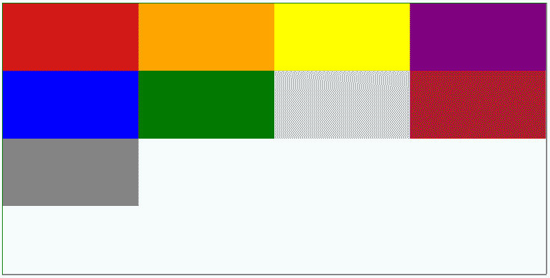

2\. align-content: flex-start;

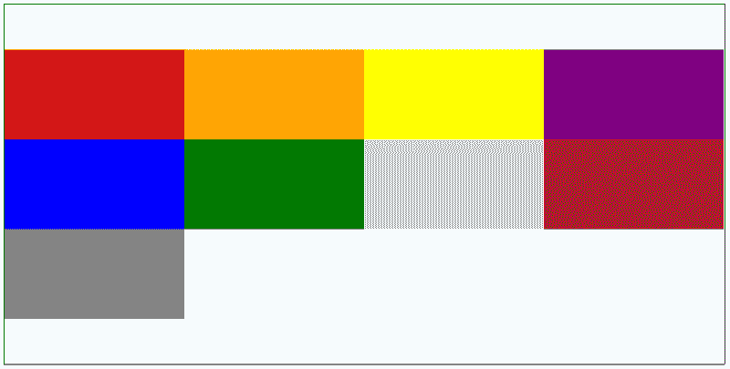

3\. align-content: center;

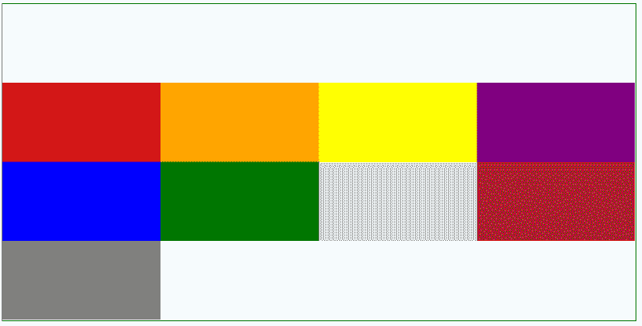

4\. align-content: flex-end;

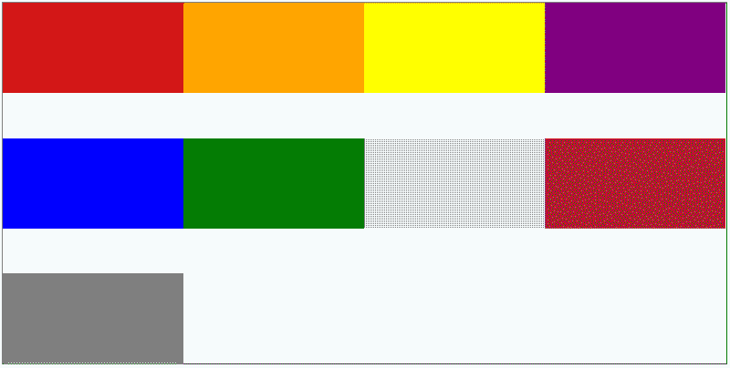

5\. align-content: space-between;

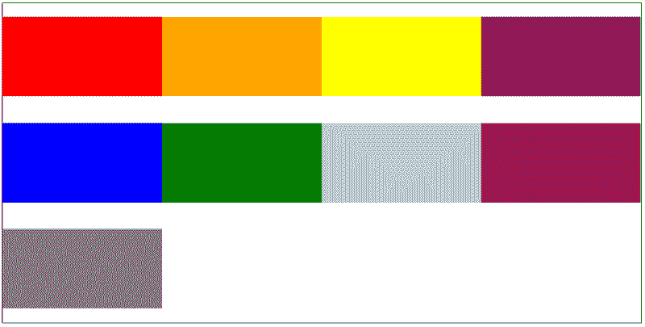

6\. align-content: space-around;

#### **弹性项目属性**

是时候讨论第二种类型的 flexbox 属性了，它允许我们将目标指向 flex 容器中的单个项目。

#### **自我对齐**

该属性允许您沿**横轴对齐单个伸缩项目。**它覆盖通过`align-items`设置到容器的对齐。

它也采用与`align-items`相同的属性(见上文)。

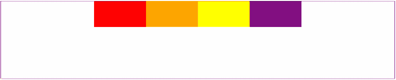

align-items set to flex-start on the parent container

align-self set to flex-end on the orange box

#### **订单**

该属性允许我们重新排列 flex 容器中各个 flex 项目的位置。默认情况下，所有项目都分配有值 0。

通过在单个项目上分配一个较低(-ve)或较大(+ve)的值(通过`order`)，该特定项目将根据它们的值进行移动。

顺序会遵循最符合逻辑的约定，就是-ve，0，+ve。最小的数字放在最左边，最大的数字放在最右边，假设其他的都设置为默认。如果有没有被赋予任何新值的项目，它们保持为 0。

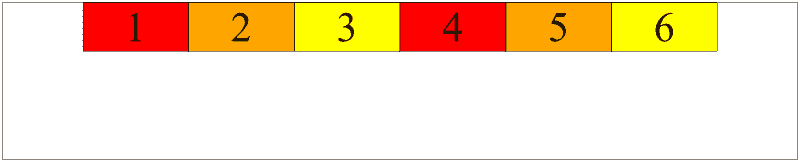

default — everything has a value of 0

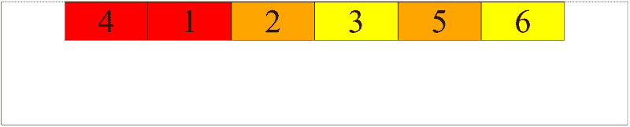

setting order: -1 on box 4

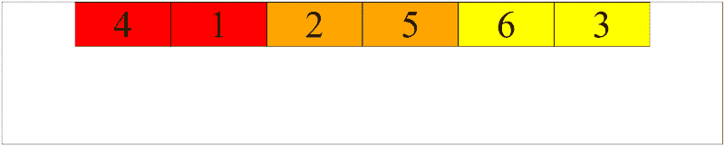

setting order: 1 on box 3

**注意:**上例中的方框 1、2、5、6 都还是默认值 0。为了澄清，上面的六个框有以下值:-1，0，0，0，0，1。

如果你想把一个盒子放在 4 号盒子的前面，那么你需要把你的目标盒子的顺序设置为-2 或者更低。

#### **弹性基础、弹性增长和弹性收缩**

到目前为止，所有的 flex-item 在大小上都是相同的。现在让我们看看如何让一个特定的 flex-item 在 flex-container 中比同一个容器中的其他项目占用更多的空间。

#### **弹性基础**

该属性指定了伸缩项**在**被放入伸缩容器之前的理想大小。处理行时，它的工作方式类似于宽度。在处理列时，它的作用类似于高度。因此，如果我们正在处理列，并且一个项目已经被给定了高度和伸缩基准，伸缩基准将优先考虑，因为它是一个伸缩项目在有足够空间的情况下将采用的**理想**高度。

也就是说，如果没有足够的空间，也没有指定项目的高度或宽度。物品将采用容器中可用的最大高度或最大宽度。

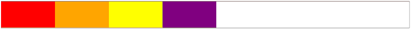

width of 200px and no flex-basis set

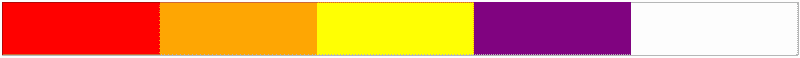

width of 200px and flex-basis of 300px. Flex-basis wins

flex-basis set to 500px. Items are smaller than 500px wide but take entire space of container

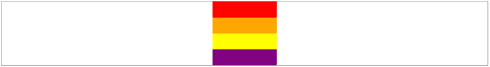

columns, height set to 50px each, no flex-basis

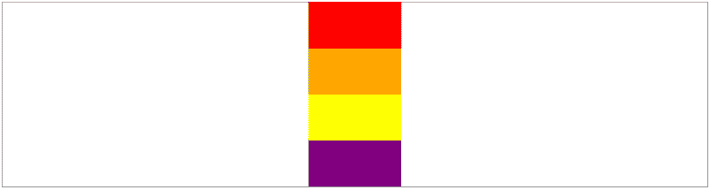

columns, height set to 50px and flex-basis set to 100px. Flex-basis wins.

#### **伸缩增长**

此属性决定了 flex-item 如何增长以填充 flex-container 中未使用的空间。

如果我们给所有的盒子分配一个`flex-grow: 1`,它们将会平均占用剩余的空间，这也是它的默认值。该数字可以是任何数字，只要它们都是相同的数字。

如果我们给一个项目一个`flex-grow: 1`，给第二个项目一个`flex-grow: 2`，那么第二个项目将会比第一个项目占用两倍的未使用空间。

这适用于行和列。

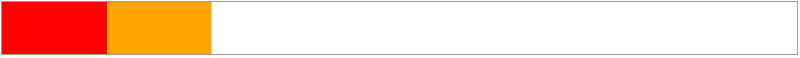

width set to 200px, no flex-grow

flex-grow set to 1 on the red box only

flex-grow set to 1 on both boxes

flex-grow set to 1 on the red box and 6 on the orange box.

#### **伸缩**

这个属性决定了当 flex 容器中没有足够的空间时，flex 项目如何收缩。

`flex-shrink: 1`是默认值，意味着默认情况下所有项目将以相同的速度收缩。

**注:`flex-shrink: 0;`** 表示这个具体的项目永远不应该缩小。

`flex-shrink: 2;`表示该特定项目在`flex-shrink: 1;`时应该比其他项目收缩得更快

no flex-shrink. width of items bigger than container

flex-shrink:2 on the red box

flex-shrink: 4 on the red box

#### **伸缩**

这是灵活增长、灵活收缩和灵活基础的简写版本。

如果您需要使用以上三种方法，您可以简单地使用如下方法:

`flex: 0 2 200px;`其中 0 表示伸缩，2 表示伸缩，200px 表示伸缩基础。

### **恭喜你！**

就是这样！这些是成为 flex 大师的关键要素。就像生活和代码中的其他事情一样，熟能生巧。我强烈建议将这个指南付诸实践，以获得实际的理解。一个例子是从简单的导航条这样的小东西开始。

你也可以在 flex-box 上查看我的 Codepen 集合的链接，我用它来创建上面图片中的 flex box，并调整它们以查看它们是如何变化的。

感谢您阅读本 flexbox 指南。我希望它是有帮助的和增长见识的。如果你有任何问题或想分享你对这个话题的想法，请随时通过评论区或发邮件到*maudarbocus.zeeshaan@gmail.com*联系我们

如果你觉得这篇文章很有价值，请给这篇文章留点掌声，让其他开发者也能发现。

[**【ZeeshaanMaudar】-概述**](https://github.com/ZeeshaanMaudar)
[*码为好玩码为改变码为社交好-ZeeshaanMaudar*github.com](https://github.com/ZeeshaanMaudar)