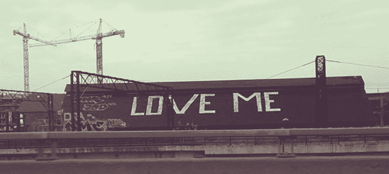

# 你有一个需要的，不安全的网站吗？

> 原文：<https://www.freecodecamp.org/news/do-you-have-a-needy-insecure-website-234502f586cd/>

吉尔·福斯特

# 你有一个需要的，不安全的网站吗？

Image by [CelineCelines](https://www.flickr.com/photos/clineclines/) licensed under [CC Attribution-ShareAlike 2.0](https://creativecommons.org/licenses/by-sa/2.0/)

想象你走进一家商店。

你可能已经在现实生活中这样做过了，所以这应该不是一个非常困难(或者特别有趣)的练习。但是暂时迁就我一下。

想象你走进一家商店。

你大概知道你想要什么，但是你以前没有去过这家店。你在门口停下来，花了一点时间确定自己的方向，整理思绪。现在是 2016 年，所以你可能还在听播客，在脸书和朋友聊天，在推特上对那些在政治或乔斯·韦登等问题上犯错误的人大喊大叫。简而言之，你有很多心事。

因此，当一名店员出现在离你的脸只有几英寸的地方，完全进入你的个人空间，以至于你周围的一切都变暗了，模糊了。

> 你好！！！！你喜欢你所看到的吗？
> 你想成为我们的朋友吗？
> 你应该注册我们的邮件列表。

你震惊地向后踉跄，但这张明亮的圆月脸已经锁定在你周围精确的地球同步轨道上，无论你走到哪里，无论你转向哪个方向，它们都在那里。

你试着说“不，谢谢”,但他们似乎不理解这句话。最终，你提出“也许以后”你会考虑他们一生提供的垃圾邮件的慷慨交易，所以，暂时平息，迎宾拉链回到他们来的地方。

出于你无法完全理解的原因，他们离开时会发出一种可以听见的噪音。

你开始浏览货架，过了一会儿，你意识到有东西在拽你的袖子。起初，你会忽略它，认为你只是在展示台的角落里偷了一件不流行的宽松套头衫，或者也许你正经历着独特的数字时代对智能手机振动的幻觉。在你低头看到一张充满希望的小脸从你视野的右下角盯着你之前，持续摇晃了将近 30 秒。

> 我是布鲁斯，你的私人销售助理。今天我能为你做什么？

好吧。太奇怪了。

不过，他看起来是个不错的小伙子。于是你向展示台做了个手势，问:“你们有不同尺寸的吗？”

布鲁斯无言地递给你一张名片。卡片的正面是布鲁斯的名字、照片和一条信息:*布鲁斯正在打字*。在背面，三个表情符号*——开心的嘴，悲伤的嘴，直直的嘴——完美地排列在标题下:*请评价我的服务。*

最终，你找到了你想要的东西(没有感谢布鲁斯),然后走向收银台。购买过程比预期的时间长一点，因为你不记得第一次告诉你这家商店的人的名字，而且显然没有这一关键数据，收银机无法打开。

在从你的脸书历史的考古深度挖掘这一重要信息的过程中，你早已忘记的问候者决定突袭。毕竟，你说的是“也许以后”，而不是“永远不会”。“稍后”是之前说的，所以它肯定是转到了“现在”，因为你马上就要离开了，所以真的没有太多的时间了，那么简讯呢？

“事实上，”迎宾员说，“为什么不像我们在脸书一样。你喜欢我们，对吗？想必你不*不*喜欢我们吧？”

当你礼貌地拒绝时，收银员会皱眉并取消你之前谈好的 5%的折扣。

收银机离出口只有五英尺远，但你还需要十分钟才能离开，因为直到你完成满意度调查并在 Instagram 上自拍后，门才会打开。当你最终离开商店时，你享受了短暂的胜利时刻，这一时刻只持续到你回到你的汽车时，在那里你发现当你被出口调查分散注意力时，布鲁斯偷偷溜走重新编程了你 GPS 中的*家*的位置，以便它指向商店。

#### 互联网什么时候变得这么他妈的需要了？

上周，我从网上商店订购了价值 80 美元的内存。交付完成后，我收到了来自三个不同来源的*三封电子邮件，*一封来自 eStore，一封来自履行平台，一封来自 AusPost，都要求我完成一项满意度调查。说真的。

你登陆的每一个网站都会弹出一个“注册我们的邮件列表”来覆盖你想看的内容。实时聊天窗口滑过屏幕，欢快地向你发出“T1”和“T3”的哔哔声，带有铅灰色画外音的视频和令人兴奋的音乐自动播放，发出意想不到的噪音，开始了那个曾经流行的工作场所游戏——那个该死的浏览器标签是从哪里来的寻宝游戏。

这真的是品牌想要为顾客创造的体验吗？除非你在上次的品牌原型角色研讨会上确定了**贫困、缺乏情感安全感的男/女朋友**，否则我可以 100%地向你保证，这些技巧不会创造出你想要的那种印象。

数字化并不意味着你可以期望少花钱多办事。为什么会有人想在登陆你主页的 2 秒钟内注册你的时事通讯呢？你向他们展示了什么价值来保证这种承诺？

就像那哥们说的:不要问你的客户能为你做什么，要问你能为你的客户做什么。通过向新客户展示你的工作质量和卓越的服务，帮助他们发现这一点。快速有效地满足他们的需求，他们会回来要求更多。

*表情符号的正确复数形式是什么？Emojii？表情符号？Emojiae？