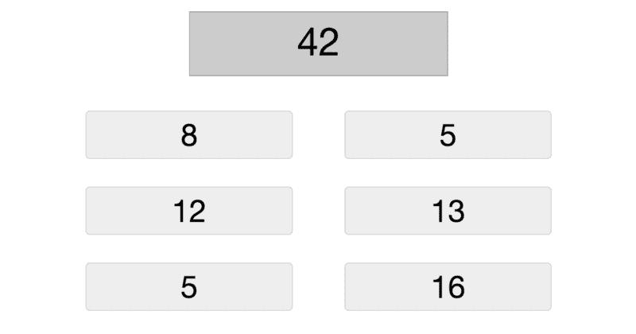
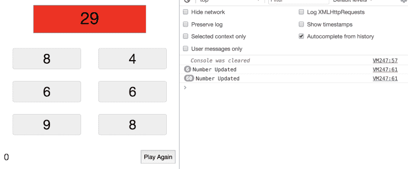
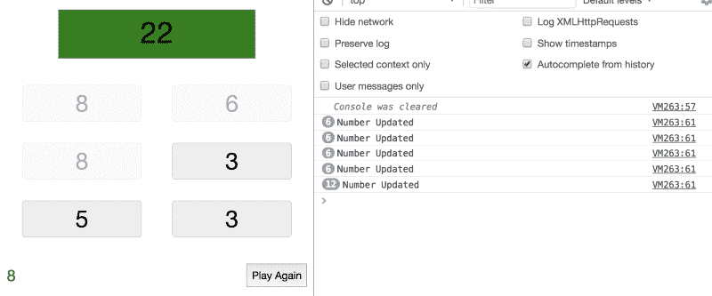
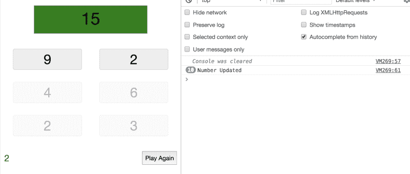

# 你想了解更多关于 React 的知识吗？让我们来做一个游戏，然后玩一玩。

> 原文：<https://www.freecodecamp.org/news/do-you-want-to-learn-more-about-react-lets-build-and-then-play-a-game-218e0da5be44/>

> **更新:**这篇文章现在是我的书《React.js Beyond The Basics》的一部分。

> 阅读此内容的更新版本以及更多关于在[**【jscomplete.com/react-beyond-basics】**](https://jscomplete.com/g/target-sum)*做出反应。*

当我向初学者教授 React 时，我首先向他们介绍 React API。然后我让他们制作一个简单的浏览器游戏。我认为这是一个很好的引入策略，因为一个简单的游戏通常有一个小的状态，并且在大多数情况下，根本没有数据依赖。学习者可以完全专注于 React API 本身。官方的 React 教程是一个简单的[井字游戏](https://reactjs.org/tutorial/tutorial.html#getting-started)，是一个极好的选择。

在这么多层面上，构建简单的游戏应用胜过构建抽象(和待办事项)应用。我一直反对使用抽象的 foo-bar 类型的例子，因为它们缺乏上下文和参与性。

学习者需要喜欢他们正在构建的东西。他们需要在学习旅程的每个阶段结束时完成一些事情。他们需要做出设计决策，并看到与他们相关的功能的进展。

**请注意**本文不是初学者教程。我将假设你知道反应的基本知识。如果你完全是 React 新手，从[编写你的第一个 React 组件](https://medium.freecodecamp.org/how-to-write-your-first-react-js-component-d728d759cabc)开始，然后[学习 React 的基本概念](https://medium.freecodecamp.org/all-the-fundamental-react-js-concepts-jammed-into-this-single-medium-article-c83f9b53eac2)。



The Target Sum Game: Pick the set of challenge numbers that sum to the target 42 within 10 seconds

我将本文中我们将要构建的游戏命名为目标总和。这是一个简单的方法:首先在标题中添加一个随机数，**目标**(上面截图中的 42)，在目标下面添加一个随机的**挑战数**(上面截图中的 6 个数字)。

上面使用的六个随机数中的四个(8，5，13，16)加起来正好是目标总数 42。选择正确的数字子集是赢得游戏的关键。

想玩几局吗？点击下面的**开始**按钮:

你能赢吗？我太不擅长这个游戏了。

现在你已经知道我们要构建什么了，让我们开始吧。不要担心，我们会一步一步地逐步构建这个游戏。

#### 步骤#1:初始标记和样式

从任何已知的标记和样式入手来解决这些问题是一个好主意。对于像这样的简单游戏，这通常是一个简单的任务。只需将模拟静态内容放在动态内容最终所在的位置。

为了使这篇文章尽可能简短，并专注于 React，我将从一些初始就绪标记和 CSS 开始。这里有一个 jsComplete 代码会话，您可以使用它来启动:[jsdrops.com/rg-0](https://jsdrops.com/rg-0)

如果您想使用不同的开发环境，下面是我用来设计上述标记样式的所有 CSS:

```
.game {  display: inline-flex; flex-direction: column;  align-items: center; width: 100%;}.target {  border: thin solid #999; width: 40%; height: 75px;  font-size: 45px; text-align: center; display: inline-block;  background-color: #ccc;}.challenge-numbers {  width: 85%; margin: 1rem auto;}.number {  border: thin solid lightgray; background-color: #eee;  width: 40%; text-align: center; font-size: 36px;  border-radius: 5px; margin: 1rem 5%; display: inline-block;}.footer {  display: flex; width: 90%; justify-content: space-between;  }.timer-value { color: darkgreen; font-size: 2rem; }
```

我对 CSS 不是很在行，上面我的一些选择大概是有问题的。不要因此而分心。我们要做一个游戏。

#### 步骤 2:提取组件

一旦我们达到了初始标记和样式的良好状态，下一步自然会考虑组件。将部分代码提取到一个组件中有很多原因。对于这个例子，我想只关注一个原因:**共享行为**。

当多个元素将共享完全相同的行为时，这是您需要新组件的一个好指标。在我们的示例中，您可以单击六个随机挑战数字中的任何一个，向目标数字求和。这些点击将触发用户界面的变化。这种共享行为意味着我们应该创建一个组件来表示一个数字。我将简单地命名为`Number`。

下面每个代码片段中引入的新变化以**粗体**突出显示。

```
// Step #2
```

```
class Number extends React.Component {  render() {    return <div className="number">{this.props.value}</div>;  }}
```

```
class Game extends React.Component {  render() {    return (      <div className="game">        <div className="target">42</div>        <div className="challenge-numbers">          <Number value={8} />          <Number value={5} />          <Number value={12} />          <Number value={13} />          <Number value={5} />          <Number value={16} />        </div>        <div className="footer">          <div className="timer-value">10</div>          <button>Start</button>        </div>      </div>    );  }}
```

```
ReactDOM.render(<Game />, document.getElementById('mountNode'));
```

您可能想要提取更多的组件，比如一个`Target`或`Timer`组件。虽然添加这样的组件可能会增强代码的可读性，但我将保持示例的简单性，只使用两个组件:`Game`和`Number`。

#### 第三步:让事情充满活力

每当我们渲染一个新游戏，我们需要创建一个新的随机目标数。这很简单。我们可以使用这个函数使用`Math.random()`来获得一个在`min...max`范围内的随机数:

```
// Top-level function
```

```
const randomNumberBetween = (min, max) =>  Math.floor(Math.random() * (max - min + 1)) + min;
```

如果我们需要一个在`30`和`50`之间的目标数，我们可以简单地使用`randomNumberBetween(30, 50)`。

然后，我们需要生成六个随机挑战数字。我将把数字`1`从这些数字中排除，第一级可能不会超过`9`。这允许我们简单地在一个循环中使用`randomNumberBetween(2, 9)`来生成所有的挑战号。很简单，对吧？对吗？

这组随机挑战数需要有一个子集，它实际上等于我们生成的随机目标数。我们不能随便选一个数字。我们必须挑选目标数的一些**因子**(用他们的一些因式分解结果)，然后是一些更分散注意力的随机数。这太难了！

如果你在编码面试中面临这个挑战，那么你接下来要做的事情可能会决定这份工作的成败。你需要做的只是简单地问自己:有没有更简单的方法？

花一分钟思考这个特殊的问题。为了让事情变得有趣，让我们将挑战数字列表的大小动态化。`Game`组件将获得两个新属性:

```
<Game challengeSize={6} challengeRange={[2, 9]} />
```

上述因式分解问题的简单替代方案是首先选取随机挑战数**，**，然后从这些挑战数的随机子集计算目标。

这样更容易。我们可以使用`Array.from`在`randomNumberBetween`函数的帮助下创建一个随机数数组。然后，我们可以使用洛达什`sampleSize`方法来挑选一个随机子集，然后对该子集求和，并将其称为目标。

由于这些数字在一个游戏会话中不会改变，我们可以放心地将它们定义为实例属性。

以下是我们目前需要的修改:

```
// In the Game class
```

```
 challengeNumbers = Array    .from({ length: this.props.challengeSize })    .map(() => randomNumberBetween(...this.props.challengeRange));
```

```
 target = _.sampleSize(    this.challengeNumbers,    this.props.challengeSize - 2  ).reduce((acc, curr) => acc + curr, 0);
```

```
 render() {    return (      <div className="game">        <div className="target">{this.target}</div>                <div className="challenge-numbers">         {this.challengeNumbers.map((value, index) =>           <Number key={index} value={value} />          )}        </div>        <div className="footer">          <div className="timer-value">10</div>          <button>Start</button>        </div>      </div>    )  }
```

注意我是如何使用来自`map`调用的`index`值作为每个`Number`组件的`key`。请记住，只要我们不删除、编辑或重新排列数字列表(我们在这里不会这样做)，这是可以的。

你可以在这里看到我们目前拥有的全部代码[。](https://jscomplete.com/repl/?j=S10iws71M)

#### 第 4 步:决定状态的变化

当点击**开始**按钮时，游戏将进入不同的状态，并且`10`秒计时器将开始倒计时。因为这些是 UI 更改，所以游戏状态和计时器在任何给定时间的当前值都应该放在状态中。

当游戏处于`playing`模式时，玩家可以开始点击挑战号码。每一次点击都会触发一次 UI 变化。当一个数字被选中时，我们需要 UI 以不同的方式来表示它。这意味着我们还需要将选定的数字放在州名上。我们可以简单地用一个数组。

然而，我们不能在这个新的数组中使用数字**值**，因为随机挑战数字列表可能包含重复的值。我们需要指定这些号码中唯一的**id**作为选择。我们使用一个数字位置索引**作为它的 ID，所以我们可以使用它来惟一地选择一个数字。**

所有这些识别的状态元素都可以在`Game`组件的状态上定义。`Number`组件不需要任何状态。

以下是到目前为止我们需要在`Game`组件状态上放置的内容:

```
// In the Game component
```

```
state = {  gameStatus: 'new' // new, playing, won, lost  remainingSeconds: this.props.initialSeconds,  selectedIds: [],};
```

请注意我是如何定制`remainingSeconds`的初始值的。为此我使用了一个新的游戏级道具(`initialSeconds`):

```
<Game   challengeSize={6}   challengeRange={[2, 9]}   initialSeconds={10} />
```

老实说，我们根本不需要`gameStatus`处于状态。它大部分是可计算的。然而，我有意将它放在状态上作为一种简化形式的**缓存**该计算，以此作为例外。

理想情况下，最好将这个计算作为实例属性进行缓存，但是为了简单起见，我将把它保存在状态中。

当玩家赢或输一局时，目标数字所用的背景颜色是什么样的？那些需要上州吗？

不完全是。因为我们有一个`gameStatus`元素，我们可以用它来查找正确的背景颜色。背景颜色的字典可以是一个简单的静态`Game`属性(或者如果您想让它可定制，您可以传递它):

```
// In the Game component
```

```
 static bgColors = {    playing: '#ccc',    won: 'green',    lost: 'red',  };
```

你可以在这里看到我们目前拥有的全部代码[。](https://jscomplete.com/repl/?j=rkh2YjEJf)

#### 步骤 5:将视图设计为数据和状态的函数

这真的是 React 的核心。现在我们已经确定了这个游戏需要的所有数据和状态，我们可以基于它们设计整个 UI。

由于状态通常以空值开始(比如空的`selectedIds`数组)，不测试实际值就很难设计 UI。然而，模拟值可以用来简化测试:

```
// Mock states:
```

```
state = {  gameStatus: 'playing',  remainingSeconds: 7,  selectedIds: [0, 3, 4],};
```

```
// Also test with  gameStatus: 'lost'
```

```
// And  gameStatus: 'won'
```

使用这种策略，我们不必担心行为和用户交互。我们可以专注于将 UI 设计为数据和(模拟)状态的函数。

正确执行这一步的关键是**确保子组件只接收它们在各种状态下重新呈现所需的最少数据**。这可能是整篇文章中最重要的陈述。

我们只有一个子组件，所以让我们想想它自己需要呈现什么。我们已经通过 map 调用传递了它的值，那么它还需要什么呢？例如，思考这些问题:

*   `Number`组件需要知道`selectedIds`数组来判断它是否是一个选中的数字吗？
*   `Number`组件需要知道当前的`gameStatus`值吗？

我承认回答这些问题并不像你想象的那么容易。虽然您可能想对这两个问题的答案都是肯定的，但是`Number`组件不需要知道`selectedIds`和`gameStatus`。它只需要知道它是否可以被点击。如果它不能被点击，它将需要以不同的方式呈现自己。

向`Number`组件传递任何东西都会使它不必要地重新呈现，这是我们应该避免的。

我们可以使用较低的不透明度来表示不可点击的数字。让我们让`Number`组件接收一个`clickable`道具。

计算这个布尔属性`clickable`应该发生在`Game`组件中，这样你就可以避免传递更多的数据给`Number`组件。让我举几个例子来说明确保子组件只接收它需要的最少数据的重要性:

*   如果我们将`gameStatus`值传递给`Number`组件，那么每次`gameStatus`改变时(例如，从`playing`到`won`，React 将重新呈现所有六个挑战号。但是在这种情况下，它真的不需要重新渲染它们。
*   当`gameStatus`从`new`变为`playing`时，数字组件确实需要重新渲染，因为在开始时有屏蔽问号的功能。为了避免将`gameStatus`传递给`Number`，我们可以在`Game`组件的`map`函数回调中计算显示在`Number`组件中的值。
*   如果我们将`selectedIds`数组向下传递给`Number`组件，那么在每次点击时，React 将重新呈现所有六个挑战数字，而它只需要重新呈现一个数字。这就是为什么`clickable`布尔标志在这里是一个更好的选择。

你传给孩子的每一件道具都伴随着巨大的责任。

这比你想象的更重要。但是，React 不会自动优化组件的重新渲染。我们必须决定我们是否希望它这样做。这将在下面的步骤 8 中讨论。

除了`clickable`道具，`Number`组件还需要什么？因为它将被点击，我们需要将被点击数字的 ID 放在`Game`状态，每个`Number`组件的点击处理程序需要知道它自己的 ID。在这种情况下，我们不能使用 React 的`key`属性值。让我们让`Number`组件也接收一个`id`道具。

```
// In the Number component
```

```
render() {    return (      <div         className="number"         style={{ opacity: this.props.clickable ? 1 : 0.3 }}        onClick={() => console.log(this.props.id)}      >        {this.props.value}      </div>    );  }
```

要计算一个数字是否可用和可点击，可以在`selecetdIds`数组上使用一个简单的`indexOf`调用。让我们为此创建一个函数:

```
// In the Game classisNumberAvailable = (numberIndex) =>    this.state.selectedIds.indexOf(numberIndex) === -1;
```

在玩上面的游戏时，你可能注意到的一个行为是，数字方块开始显示一个问号，直到点击开始按钮。我们可以使用三元运算符根据`gameStatus`值控制每个`Number`组件的值。下面是我们需要修改来呈现`map`调用中的`Number`组件:

```
<Number  key={index}  id={index}  value={this.state.gameStatus === 'new' ? '?' : value}  clickable={this.isNumberAvailable(index)}/>
```

我们可以对目标数值使用类似的三元表达式。我们还可以使用对静态`bgColors`对象的查找调用来控制它的背景颜色:

```
<div  className="target"  style={{ backgroundColor: Game.bgColors[gameStatus] }}&gt;  {this.state.gameStatus === 'new' ? '?' : this.target}</div>
```

最后，我们应该只在`gameStatus`为`new`时显示**开始**按钮。否则我们应该只显示`remainingSeconds`柜台。当游戏是`won`或`lost`时，让我们展示一个**再玩一次**按钮。以下是我们需要的修改:

```
<div className="footer">  {this.state.gameStatus === 'new' ? (    <button>Start</button>  ) : (    <div className="timer-value">{this.state.remainingSeconds}</div>  )}  {['won', 'lost'].includes(this.state.gameStatus) && (    <;button>Play Again</button>  )}</div>
```

你可以在这里看到我们目前拥有的全部代码[。](https://jscomplete.com/repl/?j=HkIlnsEJG)

#### 步骤 6:设计行为来改变状态

我们需要弄清楚的第一个行为是如何开始游戏。这里我们需要两个主要动作:1)将`gameStatus`改为`playing`以及 2)启动一个定时器来递减`remainingSeconds`值。

如果`remainingSeconds`一直递减到零，我们需要强制游戏进入`lost`状态并停止计时器。否则，它将递减到零以上。

这里有一个函数，我们可以用它来完成所有这些工作:

```
// In the Game class
```

```
startGame = () => {  this.setState({ gameStatus: 'playing' }, () => {    this.intervalId = setInterval(() => {      this.setState((prevState) => {        const newRemainingSeconds = prevState.remainingSeconds - 1;        if (newRemainingSeconds === 0) {          clearInterval(this.intervalId);          return { gameStatus: 'lost', remainingSeconds: 0 };        }        return { remainingSeconds: newRemainingSeconds };      });    }, 1000);  });};
```

请注意，我是如何在`setState`调用完成后才启动计时器的。这可以通过使用**的第二个参数函数回调**到`setState`来实现。

接下来，让我们弄清楚在游戏过程中点击一个数字会发生什么。让我们为此创建一个`selectNumber`函数。这个函数应该接收被点击的数字的 ID，并且应该只在`gameStatus`是`playing`时工作。每次点击一个数字，我们都需要将它的 ID 添加到`selectedIds`数组中。

我们还需要计算新的`gameStatus`，因为每次点击都可能导致`won` / `lost`状态。让我们创建一个`calcGameStatus`函数来完成这项工作。

下面是实现这两个新功能的一种方法:

```
// In the Game class
```

```
selectNumber = (numberIndex) => {  if (this.state.gameStatus !== 'playing') {    return;  }  this.setState(    (prevState) => ({      selectedIds: [...prevState.selectedIds, numberIndex],      gameStatus: this.calcGameStatus([        ...prevState.selectedIds,        numberIndex,      ]),    }),    () => {      if (this.state.gameStatus !== 'playing') {        clearInterval(this.intervalId);      }    }  );};
```

```
calcGameStatus = (selectedIds) => {  const sumSelected = selectedIds.reduce(    (acc, curr) => acc + this.challengeNumbers[curr],    0  );  if (sumSelected < this.target) {    return 'playing';  }  return sumSelected === this.target ? 'won' : 'lost';};
```

请注意关于上述函数的一些事情:

*   我们使用数组**展开运算符** 将`numberIndex`追加到`selectedIds`。这是一个避免改变原始数组的简便方法。
*   由于新的`gameStatus`将在更新状态时计算**，我将新的`selectedIds`值传递给`calcGameStatus`函数，而不是使用当前的`selectedIds`值。目前还没有更新到包括新的`numberIndex`。**
*   在`calcGameStatus`中，我使用了一个`reduce`调用。这将使用所选内容和原始的`challengeNumbers`数组(保存数字的实际值)的组合来计算单击后的当前总和。然后，一些条件可以决定当前的游戏状态。
*   因为如果新的`gameStatus`不是`playing`，计时器必须停止，所以我使用了第二个回调参数来实现`setState`的逻辑。这确保了它将在异步`setState`调用完成后使用新的`gameStatus`。

除了**再玩**按钮之外，游戏目前完全正常。你可以在这里看到我们目前拥有的全部代码[。](https://jscomplete.com/repl/?j=SJoO0nVJf)

现在，我们到底要如何实施这个**再打**的行动呢？我们可以简单地重置组件的状态吗？

没有。想想为什么。

#### 步骤 7:重置 React 组件

**再次播放**动作需要的不仅仅是简单重置`Game`组件的状态。我们需要生成一组新的`challengeNumbers`和一个新的`target`号。此外，我们需要清除任何当前运行的计时器，并自动启动游戏。

我们当然可以改进`startGame`函数来做到这一切。但是 React 提供了一种更简单的重置组件的方法:卸载该组件，然后重新挂载它。这将触发所有的初始化代码，并处理所有的定时器。

我们真的不必担心状态的计时器部分，因为这部分是由行为控制的。但是，一般来说，卸载一个组件也应该清除该组件中定义的任何计时器。总是这样做:

```
// In the Game class
```

```
 componentWillUnmount() {    clearInterval(this.intervalId);  }
```

现在，如果卸载并重新装载`Game`组件，它将使用新的随机数和空状态启动一个全新的实例。然而，为了基于行为重新挂载一个组件，我们需要为`Game`引入一个新的父组件。我们将把它命名为`App`。然后，我们将在这个新的父组件的状态上放置一些东西，这将触发 UI 更改。

React 有另一个有用的技巧，我们可以用它来完成这项任务。如果任何 React 组件使用某个`key`进行渲染，然后使用不同的`key`进行重新渲染，React 会看到一个全新的实例。然后，它会自动卸载并重新安装该组件！

我们需要做的就是拥有一个唯一的游戏 ID 作为`App`组件状态的一部分，使用它作为`Game`组件的`key`，并在我们需要重置游戏时更改它。

我们还希望游戏在玩家点击**再次玩**时自动启动，而不是让他们在**再次玩后点击**开始**。**因此，让我们让应用程序组件也将一个**自动播放**道具传递给**游戏**，并基于新的 **gameId** 属性对其进行计算。只有第一场比赛不应该自动播放。

以下是我们需要的修改:

```
// Create new App component
```

```
class App extends React.Component {  state = {    gameId: 1,  };
```

```
resetGame = () =>    this.setState((prevState) => ({      gameId: prevState.gameId + 1,    }));
```

```
 render() {    return (      <Game        key={this.state.gameId}        autoPlay={this.state.gameId > 1}        challengeSize={6}        challengeRange={[2, 9]}        initialSeconds={10}        onPlayAgain={this.resetGame}      />    );  }}
```

```
// In the Game class: respect the value of the new autoPlay prop  componentDidMount() {    if (this.props.autoPlay) {      this.startGame();    }  }
```

```
// In the Game render call// Wire the Play Again action using the parent prop<button onClick={this.props.onPlayAgain}>  Play Again</button>
```

```
// Render the new App component instead of GameReactDOM.render(<App />, document.getElementById('mountNode'));
```

你可以在这里看到完整的代码。

#### 第八步:如果你能测量，优化

React 应用程序的挑战之一是避免对不需要重新呈现的组件进行浪费性的呈现。在第 5 步中，我们竭尽全力不传递任何会导致`Number`组件不必要地重新渲染的属性。

然而，现在的代码仍然浪费地重新呈现了大多数的`Number`组件。要看到这一点，在`Number`组件中使用一个`componentWillUpdate`方法，并在那里使用`console.log`方法:

```
// In the Number componentcomponentWillUpdate() {  console.log('Number Updated');}
```

那么，继续玩吧。在`Game`组件的每个状态改变时，你会看到我们正在重新渲染所有 6 个`Number`组件。当我们点击**开始**按钮时就会发生这种情况，之后每秒钟都会发生一次！



The Number component was re-rendered 66 times. How many of these were necessary?

事实是，`Number`组件不应该重新呈现自己，除非玩家点击它。由定时器改变触发的`60`重新渲染是浪费的。此外，当玩家单击一个数字时，只需要重新呈现该数字。现在，当玩家选择任意数字时，React 还会重新渲染所有六个数字。



36 Number component updates happened when only 9 updates should have happened

幸运的是，我们已经足够小心地只将需要重新呈现的道具传递给了`Number`组件。只有需要重新渲染的挑战号才会在这些道具中获得不同的数值。

这意味着如果一个`Number`组件的所有`nextProps`都匹配当前的道具，我们可以在 React 的`shouldComponentUpdate`中使用一个条件来缩短渲染操作。

React 的`PureComponent`类将完全做到这一点。继续修改`Number`组件来扩展`React.PureComponent`而不是`React.Component`，看看问题是如何神奇地消失的。

```
class Number extends React.PureComponent
```



Exactly ten Number components were updated (initial six + the selected four)

但是，这种优化值得吗？没有测量，我们无法回答这个问题。基本上，你需要测量哪个代码使用更少的资源:一个组件渲染调用或者比较前一个和下一个状态/道具的`React.PureComponent`中的`if`语句。这完全取决于状态/道具树的大小和被重新渲染的复杂程度。不要只是假设一种方式比另一种方式更好。

你可以在这里看到最终代码[。MVP 完成。现在，看在 CSS 的份上，有人能设计一下这个游戏，让它对孩子们有吸引力吗？:)](https://jscomplete.com/repl/?j=rJj8poQyM)

如果你喜欢这个，就不要停在这里。给游戏增加更多的功能。例如，为获胜保留一个分数，玩家每赢一轮就增加一个分数。也许让得分值取决于玩家赢得回合的速度。

当开始一个新游戏时，你也可以通过改变`challengeSize`、`challengeRange`和`initialSeconds`来增加未来回合的难度。

Target Sum 游戏在我的**React Native Essential Training 课程**中有介绍，该课程可在 [Lynda](https://www.lynda.com/React-Native-tutorials/React-Native-Essential-Training/560343-2.html) 和 [LinkedIn Learning](https://www.linkedin.com/learning/react-native-essential-training) 上获得。

感谢阅读。

学习 React 还是 Node？签出我的图书:

*   [通过构建游戏学习 react . js](http://amzn.to/2peYJZj)
*   [超越基础的节点 js](http://amzn.to/2FYfYru)